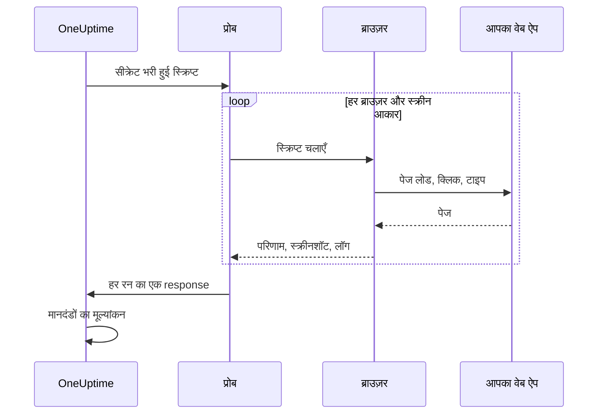

# सिंथेटिक मॉनिटर

सिंथेटिक मॉनिटर आपकी लिखी Playwright स्क्रिप्ट से, तय शेड्यूल पर, एक असली ब्राउज़र में आपका वेब ऐप चलाता है: यह पेज खोलता है, फ़ॉर्म भरता है और एक उपयोगकर्ता यात्रा पर क्लिक करते हुए आगे बढ़ता है, और यात्रा विफल होने पर विफल होता है। इसका उपयोग उन खराबियों को पकड़ने के लिए करें जो uptime जाँच नहीं देख सकती — ऐसा लॉगिन जो अब काम नहीं करता, ऐसा checkout बटन जो कुछ नहीं करता, ऐसा डैशबोर्ड जो कभी लोड होना पूरा नहीं करता।

:::cards
- [मॉनिटर बनाएं](#सिंथेटिक-मॉनिटर-बनाएं): स्क्रिप्ट लिखें, ब्राउज़र और स्क्रीन आकार चुनें।
- [स्क्रिप्ट लिखें](#स्क्रिप्ट-लिखें): शुरुआत के लिए चलने लायक साइन-इन यात्रा।
- [स्क्रीनशॉट](#स्क्रीनशॉट): देखें कि रन विफल होने पर पेज कैसा दिख रहा था।
- [स्क्रिप्ट क्या उपयोग कर सकती है](#स्क्रिप्ट-में-उपलब्ध-मॉड्यूल): Playwright, HTTP, crypto और मेट्रिक्स।
:::

## यह कैसे काम करता है

हर जाँच पर एक प्रोब आपकी चुनी हर ब्राउज़र और स्क्रीन आकार के लिए आपकी स्क्रिप्ट एक-एक बार, एक के बाद एक चलाता है। हर रन एक नए ब्राउज़र से शुरू होता है जिसमें पिछले रन की कोई cookies या storage नहीं होती; स्क्रिप्ट अपना पेज चलाती है, स्क्रीनशॉट लेती है, और एक परिणाम लौटाती है या त्रुटि फेंकती है। प्रोब हर रन की रिपोर्ट करता है, और OneUptime उन पर आपके मानदंडों का मूल्यांकन करता है।



| स्क्रीन प्रकार | Viewport |
| --- | --- |
| Mobile | 360 × 640 |
| Tablet | 1024 × 768 |
| Desktop | 1920 × 1080 |

ब्राउज़र Chromium और Firefox हैं।

## शुरू करने से पहले

- एक **प्रोब** जो आपके वेब ऐप तक पहुँच सके। अपने नेटवर्क के अंदर के ऐप के लिए [कस्टम प्रोब](/docs/probe/custom-probe) का उपयोग करें। प्रोब की Docker image में Chromium और Firefox शामिल हैं; Docker के बाहर चलने वाले प्रोब पर इन्हें इंस्टॉल करना होगा।
- यात्रा को जिन पासवर्ड या टोकन की ज़रूरत है, वे सब [मॉनिटर सीक्रेट](/docs/monitor/monitor-secrets) के रूप में सहेजे हुए हों।

## सिंथेटिक मॉनिटर बनाएं

:::steps
### नया मॉनिटर शुरू करें

**मॉनिटर** पर जाएँ और **मॉनिटर बनाएं** पर क्लिक करें। **मॉनिटर प्रकार** में **और मॉनिटर प्रकार** पर क्लिक करें और **Synthetic Monitoring** के अंतर्गत **Synthetic Monitor** चुनें, या खोज बॉक्स में `playwright` टाइप करें। एक **नाम** दर्ज करें, फिर **अगला** पर क्लिक करें।

### स्क्रिप्ट जोड़ें

अपनी स्क्रिप्ट **Playwright Code** editor में लिखें। [नीचे दिए गए उदाहरण](#स्क्रिप्ट-लिखें) से शुरू करें।

### ब्राउज़र और स्क्रीन आकार चुनें

**ब्राउज़र प्रकार** में ब्राउज़र और **स्क्रीन प्रकार** में आकार चुनें। स्क्रिप्ट हर संयोजन के लिए एक बार चलती है, इसलिए दो ब्राउज़र और तीन आकार का मतलब है हर जाँच में छह रन। **और फ़ील्ड** में **त्रुटि पर पुनः प्रयास गणना** किसी विफल रन को 5 बार तक फिर से चलाती है।

### परीक्षण करें

स्क्रिप्ट को एक प्रोब से एक बार चलाने के लिए **मॉनिटर का परीक्षण करें** पर क्लिक करें, और हर रन का परिणाम, लॉग और स्क्रीनशॉट जाँचें।

### मानदंडों की समीक्षा करें

मॉनिटर दो मानदंडों के साथ शुरू होता है: कोई रन विफल होने पर वह ऑफ़लाइन हो जाता है और एक घटना घोषित करता है, और कोई रन विफल न होने पर ऑनलाइन रहता है। इन्हें बदलें या अपने मानदंड जोड़ें — देखें [मानदंड](#मानदंड) — फिर **अगला** पर क्लिक करें।

### प्रोब चुनें और बनाएं

**प्रोब** और एक **निगरानी अंतराल** चुनें — सिंथेटिक मॉनिटर के लिए 5 मिनट या उससे लंबे अंतराल मिलते हैं — फिर **मॉनिटर बनाएं** पर क्लिक करें।
:::

## स्क्रिप्ट लिखें

स्क्रिप्ट एक `async` फ़ंक्शन की body है। `page` एक Playwright-संगत पेज है जो पहले से खुला है; उसे चलाएँ, `return` से परिणाम लौटाएँ, और रन को विफल करने के लिए `throw` करें (या किसी Playwright कॉल का समय समाप्त होने दें)। यह उदाहरण साइन इन करता है और जाँचता है कि डैशबोर्ड लोड होता है:

```javascript title="Synthetic monitor script"
await page.goto("https://app.example.com/login");
screenshots["login-page"] = await page.screenshot();

await page.fill("#email", "monitoring@example.com");
await page.fill("#password", "{{monitorSecrets.AppPassword}}");
await page.click("button[type=submit]");

// Fails the run if the dashboard does not appear within 10 seconds.
await page.waitForSelector(".dashboard", { timeout: 10000 });
screenshots["dashboard"] = await page.screenshot();

console.log(`Signed in on ${browserType}, ${screenSizeType}`);

return {
  data: { title: await page.title() },
};
```

| इसके लिए | यह करें | OneUptime क्या दर्ज करता है |
| --- | --- | --- |
| परिणाम रिपोर्ट करना | `return { data: ... }` | रन का **परिणाम**। केवल `data` रखा जाता है। |
| रन विफल करना | `throw new Error("...")`, या किसी प्रतीक्षा का समय समाप्त होने दें | रन की **स्क्रिप्ट त्रुटि**। |
| सबूत रखना | `screenshots["name"] = await page.screenshot()` | एक स्क्रीनशॉट, जो रन विफल होने पर भी रखा जाता है। |
| निशान छोड़ना | `console.log(...)` | रन के लॉग संदेश। |

रन देखने के लिए मॉनिटर का **अवलोकन** खोलें: **मॉनिटर सारांश** कार्ड में हर ब्राउज़र और स्क्रीन आकार के लिए एक खंड है, और **अधिक विवरण दिखाएं** हर रन के स्क्रीनशॉट दिखाता है।

### Playwright का उपयोग

हम उपयोगकर्ता की गतिविधियों की नकल करने के लिए Playwright का उपयोग करते हैं। `page` मान इस निष्पादन के लिए बनाए गए पेज का एक सुरक्षित, Playwright-संगत facade है। आम `Page`, `Locator`, `Frame`, `ElementHandle`, `JSHandle`, `Request`, `Response`, keyboard, mouse और browser-context methods उपलब्ध हैं। इसमें navigation, locators, clicks, फ़ॉर्म इनपुट, पेज पर मूल्यांकन, popups, अतिरिक्त पेज, response की जाँच और स्क्रीनशॉट शामिल हैं। आप `page.context()` से इस निष्पादन के browser context तक पहुँच सकते हैं, उदाहरण के लिए नया पेज खोलने या popup संभालने के लिए।

सिंथेटिक स्क्रिप्ट प्रोब की Node.js process में नहीं चलतीं। मान runtime सीमा को कॉपी किए गए डेटा या निष्पादन से बंधी अपारदर्शी क्षमताओं के रूप में पार करते हैं, इसलिए कुछ Playwright APIs अलग तरह से काम करती हैं या बिल्कुल नहीं करतीं:

| उपलब्ध नहीं | इसके बजाय यह उपयोग करें |
| --- | --- |
| ब्राउज़र launch या connection methods, CDP sessions, request routing, exposed bindings, Playwright के private fields, और कोई भी option जो होस्ट फ़ाइल सिस्टम पथ पढ़ता या लिखता है। इसलिए `page.context().browser()` उपलब्ध नहीं है। | वह पेज और browser context जो आपको दिया गया है। |
| Event listeners (`page.on(...)`, `page.once(...)`) — इन्हें कॉल करने पर स्पष्ट त्रुटि के साथ विफलता होती है। | dialogs और popups के लिए `page.waitForEvent(...)`, या string या regular-expression matchers के साथ response और request की प्रतीक्षा। |
| event, request, response और URL wait methods के लिए function predicates। | String या regular-expression matchers, locators, या स्पष्ट polling। |
| Synchronous frame accessors (`page.frames()`, `page.mainFrame()`, `page.frame(...)`)। | iframes के लिए `page.frameLocator(...)`। |
| `page.request.*` | HTTP अनुरोधों के लिए global `axios`। |
| पूरे पेज के स्क्रीनशॉट और PDF output। | Viewport स्क्रीनशॉट, जो नीचे बताए गए विफलता-सबूत वाले व्यवहार को बनाए रखते हैं। |

`page.waitForNavigation(...)`, `page.setDefaultTimeout(...)` और `page.setDefaultNavigationTimeout(...)` समर्थित हैं। `page.waitForEvent(...)` `dialog`, `domcontentloaded`, `load`, `popup`, `request`, `requestfailed`, `requestfinished` और `response` की प्रतीक्षा करता है। `page.evaluate()` जैसी methods को दिए गए evaluation functions निगरानी वाले ब्राउज़र पेज में चलते हैं, प्रोब process में कभी नहीं। हर निष्पादन अधिकतम आठ पेज उपयोग कर सकता है।

ब्राउज़र अनुमतियाँ geolocation और notifications तक सीमित हैं। Clipboard, camera, microphone, MIDI, local-font और अन्य होस्ट-डिवाइस अनुमतियाँ मॉनिटर स्क्रिप्ट के लिए उपलब्ध नहीं हैं।

### स्क्रिप्ट क्या लौटाती है

स्क्रिप्ट से लौटाया गया डेटा संग्रहीत होने से पहले JSON में serialize होता है: सादे objects और arrays में `NaN` और `Infinity` `null` बन जाते हैं, `undefined` properties और functions हटा दिए जाते हैं, और `Date` objects ISO strings बन जाते हैं — ठीक वैसे ही जैसे `JSON.stringify` इन्हें संभालता है। Class instances और दूसरे गैर-सादे objects पूरी तरह हटा दिए जाते हैं। `BigInt` एक string बन जाता है। जो परिणाम circular हो, 30 स्तरों से ज़्यादा nested हो, या 5 MB से बड़ा हो, वह इसके बजाय रन को विफल कर देता है।

### लौटाए गए डेटा पर अलर्ट

स्क्रिप्ट `data` के रूप में जो भी लौटाती है, वह मॉनिटर का **Result Value** है, जिसकी तुलना कोई मानदंड कर सकता है। जब `data` एक object या array हो, तो उसके एक field की तुलना करने के लिए Result Value फ़िल्टर पर **फ़ील्ड पथ (वैकल्पिक)** भरें — उदाहरण के लिए `status`, `timings.loadTime` या `errors[0].message`। फ़िल्टर की जाँच उस हर ब्राउज़र और स्क्रीन आकार के डेटा पर होती है जिस पर मॉनिटर चलता है, और उनमें से कोई भी मेल खाए तो फ़िल्टर मेल खाता है। पथ और शर्तें कैसे काम करती हैं, इसके लिए देखें [लौटाए गए डेटा पर अलर्ट](/docs/monitor/custom-code-monitor#लौटाए-गए-डेटा-पर-अलर्ट)।

## स्क्रीनशॉट

स्क्रिप्ट के संदर्भ में एक पहले से घोषित `screenshots` object उपलब्ध है। स्क्रिप्ट में किसी भी समय उसमें स्क्रीनशॉट रखें — ये स्क्रीनशॉट **स्क्रिप्ट के त्रुटि फेंकने पर भी** सहेजे जाते हैं (assertion विफलताएँ, timeouts या अनपेक्षित त्रुटियाँ भी शामिल हैं), ताकि आप ठीक-ठीक देख सकें कि रन विफल होने पर पेज कैसा दिख रहा था। सहेजे गए स्क्रीनशॉट OneUptime Dashboard में उस खास मॉनिटर रन के लिए दिखते हैं।

```javascript
// Capture screenshots via the `screenshots` side-channel — they are preserved on both success and failure.

await page.goto("https://app.example.com/login");
screenshots["login-page"] = await page.screenshot();

await page.fill("#email", "user@example.com");
await page.fill("#password", "wrong");
await page.click("button[type=submit]");

// If the next assertion throws, the `login-page` screenshot above is still captured.
await page.waitForSelector(".dashboard", { timeout: 5000 });

screenshots["dashboard"] = await page.screenshot();

return {
  data: "Login succeeded",
};
```

एक रन अधिकतम 20 स्क्रीनशॉट रखता है, हर एक अधिकतम 10 MB और कुल 50 MB। किसी विफल रन से खुलने वाली घटना या अलर्ट में भी — उसके पेज पर और उसके बारे में भेजे गए ईमेल में — स्क्रीनशॉट दिखाया जा सकता है, बस उसे मॉनिटर के घटना या अलर्ट विवरण में रखें। देखें [स्क्रीनशॉट दिखाना](/docs/monitor/incident-alert-templating#synthetic-monitors)।

:::details स्क्रीनशॉट लौटाना (पुराना तरीका)
पिछली संगतता के लिए आप स्क्रीनशॉट को return value के हिस्से के रूप में भी स्क्रिप्ट से लौटा सकते हैं। इस तरह लौटाए गए स्क्रीनशॉट **केवल** तब सहेजे जाते हैं जब स्क्रिप्ट सामान्य रूप से पूरी होती है — स्क्रिप्ट के त्रुटि फेंकने पर वे खो जाते हैं। विफलताओं का सबूत चाहिए तो ऊपर वाले side-channel तरीके को प्राथमिकता दें।

```javascript
// Legacy pattern — screenshots only captured on successful return.
const screenshots = {};
screenshots["screenshot-name"] = await page.screenshot();

return {
  data: "Hello World",
  screenshots: screenshots,
};
```
:::

## मॉनिटर सीक्रेट का उपयोग

स्क्रिप्ट में कहीं भी किसी सीक्रेट को `{{monitorSecrets.NAME}}` के रूप में संदर्भित करें। स्क्रिप्ट के प्रोब तक पहुँचने से पहले OneUptime इस संदर्भ को सीक्रेट के मान से, सादे टेक्स्ट के रूप में, बदल देता है। इसलिए किसी सीक्रेट को string के रूप में इस्तेमाल करने के लिए उसे उद्धरण चिह्नों में रखें, और number या boolean के रूप में इस्तेमाल करने के लिए बिना उद्धरण चिह्नों के छोड़ें:

```javascript
// Used as a string: wrap it in quotes.
const password = "{{monitorSecrets.AppPassword}}";

// Used as a number or a boolean: leave it bare.
const retryLimit = {{monitorSecrets.RetryLimit}};
const verbose = {{monitorSecrets.Verbose}};
```

सीक्रेट बनाने और यह चुनने के लिए कि कौन से मॉनिटर उसका उपयोग कर सकते हैं, देखें [मॉनिटर रहस्य](/docs/monitor/monitor-secrets)।

## कस्टम मेट्रिक्स

आप `oneuptime.captureMetric()` फ़ंक्शन से अपनी स्क्रिप्ट में कस्टम मेट्रिक्स दर्ज कर सकते हैं। ये मेट्रिक्स OneUptime में संग्रहीत होते हैं और Metric Explorer से डैशबोर्ड पर चार्ट के रूप में दिखाए जा सकते हैं।

```javascript
oneuptime.captureMetric(name, value, attributes);
```

| पैरामीटर | प्रकार | विवरण |
| --- | --- | --- |
| `name` | string, आवश्यक | मेट्रिक का नाम (जैसे `"dashboard.load.time"`)। यह अपने आप `custom.monitor.` उपसर्ग के साथ संग्रहीत होता है। |
| `value` | number, आवश्यक | मेट्रिक का संख्यात्मक मान। |
| `attributes` | object, वैकल्पिक | अतिरिक्त संदर्भ के लिए key-value जोड़े। |

### उदाहरण

```javascript
await page.goto("https://app.example.com");

const startTime = Date.now();
await page.waitForSelector("#dashboard-loaded");
const loadTime = Date.now() - startTime;

// Capture page load time, tagged with this run's browser and screen size
oneuptime.captureMetric("dashboard.load.time", loadTime, {
  page: "dashboard",
  browser: browserType,
  screen: screenSizeType,
});

screenshots["dashboard"] = await page.screenshot();

return {
  data: { loadTime },
};
```

दर्ज होने के बाद ये मेट्रिक्स Metric Explorer में `custom.monitor.dashboard.load.time` जैसे नामों के साथ दिखते हैं, और मॉनिटर के **मेट्रिक्स** पेज पर **कस्टम मीट्रिक** के अंतर्गत भी। OneUptime हर डेटा पॉइंट में मॉनिटर और प्रोब जोड़ता है; ब्राउज़र या स्क्रीन आकार से फ़िल्टर करने के लिए उन्हें attributes के रूप में दें, जैसा उदाहरण करता है।

एक रन अधिकतम 100 मेट्रिक्स दर्ज कर सकता है, केवल संख्यात्मक मानों के साथ, और OneUptime अपने सभी रन मिलाकर प्रति जाँच अधिकतम 100 रखता है। कस्टम कोड मॉनिटर की तरह, कुछ attribute नाम [आरक्षित](/docs/monitor/custom-code-monitor#आरक्षित-attribute-keys) हैं और स्क्रिप्ट के सेट करने पर हटा दिए जाते हैं।

## मानदंड

| फ़िल्टर प्रकार | यह क्या जाँचता है |
| --- | --- |
| **त्रुटि** | किसी रन द्वारा फेंकी गई त्रुटि, अगर कोई हो। |
| **Result Value** | किसी रन द्वारा लौटाया गया `data`। |
| **निष्पादन समय (ms में)** | किसी रन में कितना समय लगा। |
| **ब्राउज़र प्रकार** | किसी रन का ब्राउज़र: **Equal To** या **Not Equal To**। |
| **Screen Size** | किसी रन का स्क्रीन आकार: **Equal To** या **Not Equal To**। |

हर फ़िल्टर की जाँच हर रन पर होती है, और कोई एक रन मेल खाए तो फ़िल्टर मेल खाता है। फ़िल्टर अलग-अलग जाँचे जाते हैं, रन दर रन नहीं: **त्रुटि** Is Not Empty के साथ **ब्राउज़र प्रकार** Equal To `Firefox` तब मेल खाता है जब कोई भी रन विफल हुआ और किसी रन ने Firefox का उपयोग किया — केवल तब नहीं जब Firefox वाला रन विफल हुआ। किसी एक ब्राउज़र पर अलग से नज़र रखनी हो, तो उसे अपना अलग मॉनिटर दें।

घटना और अलर्ट टेम्पलेट में हर रन `{{syntheticResponses}}` में है: देखें [घटना और अलर्ट टेम्पलेट](/docs/monitor/incident-alert-templating#synthetic-monitors)।

## स्क्रिप्ट में उपलब्ध मॉड्यूल

| नाम | यह क्या है |
| --- | --- |
| `page` | ब्राउज़र से बातचीत के लिए एक सुरक्षित Playwright-संगत facade। पेज बनाने या popups संभालने के लिए आप `page.context()` से इस निष्पादन के browser context तक पहुँच सकते हैं, लेकिन browser launch/connect, CDP, routing, bindings, private fields और होस्ट-पथ options उपलब्ध नहीं हैं। |
| `screenshots` | पहले से घोषित एक object, जिसमें आप स्क्रीनशॉट रखते हैं (जैसे `screenshots['login-page'] = await page.screenshot()`)। यहाँ रखे गए स्क्रीनशॉट स्क्रिप्ट के बाद में त्रुटि फेंकने पर भी सहेजे जाते हैं। |
| `browserType` | इस रन का ब्राउज़र: `Chromium` या `Firefox`। |
| `screenSizeType` | इस रन का स्क्रीन आकार: `Mobile`, `Tablet` या `Desktop`। |
| `axios` | Promise पर आधारित HTTP क्लाइंट जो callable Axios के साथ `request`, `get`, `head`, `options`, `post`, `put`, `patch`, `delete` और `create` का समर्थन करता है। अनुरोध body अधिकतम 1 MB और response अधिकतम 5 MB हो सकता है; यह 5 redirects तक का पालन करता है और अधिकतम 30 सेकंड बाद timeout होता है। कस्टम transports, adapters, sockets, agents और proxy overrides उपलब्ध नहीं हैं। |
| `crypto` | SHA-256 hashes, HMAC-SHA-256, `randomBytes`, `randomInt` और `randomUUID` का browser-worker implementation। |
| `console` | `console.log`, `info`, `warn` और `error`। संदेश हर रन के साथ रखे जाते हैं। |
| `oneuptime.captureMetric` | एक कस्टम मेट्रिक दर्ज करता है। देखें [कस्टम मेट्रिक्स](#कस्टम-मेट्रिक्स)। |
| `http` | एक buffered, केवल-client compatibility facade जो `request`, `get` और `Agent` का समर्थन करता है। |
| `https` | केवल-client `http` facade का HTTPS रूप। |
| `Buffer`, `setTimeout`, `setInterval` | और उनके `clear` functions। |

स्क्रिप्ट Node.js में नहीं, एक browser worker में चलती है, और अपने नेटवर्क कनेक्शन नहीं खोल सकती: `fetch`, `XMLHttpRequest` और `WebSocket` blocked हैं। HTTP अनुरोधों के लिए `axios` का उपयोग करें।

## सीमाएँ

| सीमा | डिफ़ॉल्ट | प्रोब सेटिंग |
| --- | --- | --- |
| स्क्रिप्ट timeout | 60 सेकंड। Timeout हुए workers और ब्राउज़र की सभी child processes समाप्त कर दी जाती हैं। | `PROBE_SYNTHETIC_MONITOR_SCRIPT_TIMEOUT_IN_MS` |
| एक रन के पूरे process tree की मेमोरी | 1.5 GiB | `PROBE_SYNTHETIC_MONITOR_MAX_PROCESS_TREE_RSS_BYTES` |
| लिखने योग्य ब्राउज़र storage | 256 MiB | `PROBE_SYNTHETIC_MONITOR_MAX_DISK_BYTES` |
| एक प्रोब पर एक साथ चलने वाले रन | 4 | `PROBE_SYNTHETIC_MONITOR_MAX_CONCURRENCY` |
| प्रति निष्पादन पेज | 8 | — |

मेमोरी या storage सीमा पार होने पर वह निष्पादन समाप्त हो जाता है और उसकी अस्थायी profile हटा दी जाती है। प्रोब सेटिंग्स self-hosted प्रोब पर लागू होती हैं; Helm chart हर प्रोब के लिए यही मान सेट करता है (उदाहरण के लिए `syntheticMonitorScriptTimeoutInMs`)।

ब्राउज़र प्रोब की Docker image के अंदर आते हैं, इसलिए image अपडेट करने पर self-hosted प्रोब को नए ब्राउज़र मिल जाते हैं।

## समस्या निवारण

:::details रन विफल होता है, लेकिन कारण समझ नहीं आता
हर जोखिम वाले कदम से पहले `screenshots` object में स्क्रीनशॉट रखें। रन विफल होने पर भी वे रखे जाते हैं, और दिखाते हैं कि उस समय पेज कैसा दिख रहा था।
:::

:::details `page.on(...)` त्रुटि फेंकता है
Event listeners isolation सीमा पार नहीं कर सकते। dialogs और popups के लिए `page.waitForEvent(...)` का उपयोग करें, या string या regular-expression matcher के साथ response या request की प्रतीक्षा करें।
:::

:::details रन का समय समाप्त हो जाता है
`page.waitForSelector(...)` और स्क्रिप्ट की अपनी सीमा से छोटे `timeout` के साथ खास elements की प्रतीक्षा करें, ताकि रन उसी कदम पर स्पष्ट त्रुटि के साथ विफल हो जो धीमा है।
:::

:::details Self-hosted प्रोब कहता है कि browser executable नहीं मिला
प्रोब अपनी Docker image के बाहर चल रहा है, और उस पर Chromium या Firefox इंस्टॉल नहीं है। प्रोब की image चलाएँ, या उस मशीन पर ब्राउज़र इंस्टॉल करें।
:::

## अगले कदम

:::cards
- [कस्टम कोड मॉनिटर](/docs/monitor/custom-code-monitor): बिना ब्राउज़र के, स्क्रिप्ट से APIs जाँचें।
- [स्क्रीनशॉट दिखाना](/docs/monitor/incident-alert-templating#synthetic-monitors): विफल रन का स्क्रीनशॉट घटना में डालें।
- [मॉनिटर रहस्य](/docs/monitor/monitor-secrets): क्रेडेंशियल को अपनी स्क्रिप्ट से बाहर रखें।
:::
