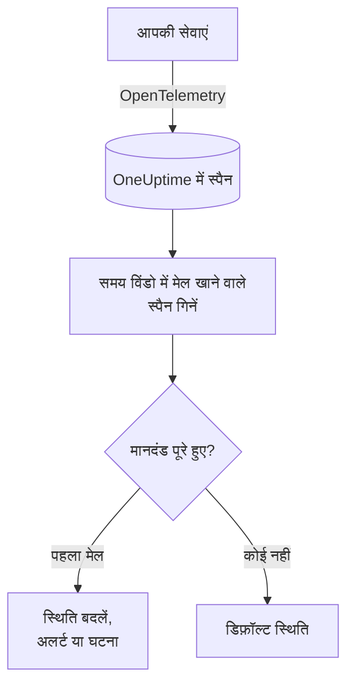

# ट्रेस मॉनिटर

ट्रेस मॉनिटर एक समय विंडो में उन स्पैन की गिनती करता है जो आपकी सेवाएं OneUptime को भेजती हैं और जो आपके फ़िल्टर (स्पैन नाम, स्थिति, सेवा, विशेषताएं) से मेल खाते हैं। जब गिनती आपके मानदंड पूरे करती है, तो यह मॉनिटर की स्थिति बदलता है, अलर्ट बनाता है या घटना घोषित करता है। किसी एंडपॉइंट के विफल अनुरोधों, त्रुटि स्पैन में उछाल, या ट्रेस भेजना बंद कर चुकी सेवा पर अलर्ट के लिए इसका उपयोग करें।

:::cards
- [मॉनिटर बनाएं](#ट्रेस-मॉनिटर-बनाएं): चुनें कि कौन-से स्पैन गिने जाएं और अलर्ट कब हो।
- [स्पैन स्थिति कोड](#span-status-codes): OK, ERROR और UNSET का मतलब, और किस पर फ़िल्टर करें।
- [इसका मूल्यांकन कैसे होता है](#इसका-मूल्यांकन-कैसे-होता-है): समय विंडो, गिनती और एक मिनट का चक्र।
- [मानदंड](#मानदंड): थ्रेशोल्ड, विसंगति पहचान और डिफ़ॉल्ट।
:::

## यह कैसे काम करता है

हर मिनट OneUptime उन स्पैन को गिनता है जो मॉनिटर के फ़िल्टर से मेल खाते हैं और उसकी समय विंडो के भीतर शुरू हुए। वह इस गिनती की तुलना मॉनिटर के मानदंडों से ऊपर से नीचे करता है, और जो मानदंड सबसे पहले मेल खाता है वही तय करता है कि क्या होगा। जब कोई मेल नहीं खाता, तो मॉनिटर अपनी डिफ़ॉल्ट स्थिति पर लौट आता है।

## शुरू करने से पहले

- आपकी सेवाएं OpenTelemetry के ज़रिए OneUptime को ट्रेस भेजती हैं। [OpenTelemetry](/docs/telemetry/open-telemetry) देखें।
- जिस स्पैन पर आप नज़र रखना चाहते हैं, उसका सटीक नाम ट्रेस एक्सप्लोरर में देखें: स्पैन के नाम आपका इंस्ट्रुमेंटेशन तय करता है, जैसे `POST /api/checkout` या `GET`।

## ट्रेस मॉनिटर बनाएं

:::steps
### नया मॉनिटर शुरू करें

**मॉनिटर** पर जाएं और **मॉनिटर बनाएं** पर क्लिक करें।

### Traces चुनें

**मॉनिटर प्रकार** में **और मॉनिटर प्रकार** पर क्लिक करें और **टेलीमेट्री** के अंतर्गत **ट्रेस** चुनें, या खोज बॉक्स में `traces` टाइप करें। **नाम** डालें, फिर **अगला** पर क्लिक करें।

### गिने जाने वाले स्पैन चुनें

**ट्रेस मॉनिटर कॉन्फ़िगरेशन** में **स्पैन नाम**, **(time) के लिए मॉनिटर ट्रेस** और **स्पैन स्थिति द्वारा फ़िल्टर करें** सेट करें। खाली छोड़ा गया फ़िल्टर हर स्पैन से मेल खाता है। फ़िल्टर के नीचे **स्पैन पूर्वावलोकन** दिखाता है कि वे अभी किन स्पैन से मेल खाते हैं।

### दायरा सीमित करें (वैकल्पिक)

टेलीमेट्री सेवा, इन्फ्रास्ट्रक्चर एंटिटी या विशेषता के आधार पर फ़िल्टर करने के लिए **और फ़ील्ड** खोलें।

### मानदंड सेट करें

**मॉनिटर मानदंड** कार्ड दो मानदंडों से शुरू होता है: कोई स्पैन मेल न खाए तो घटना के साथ ऑफ़लाइन; कम से कम एक मेल खाए तो ऑनलाइन। इन्हें उस चीज़ के अनुसार बदलें जिस पर आप अलर्ट चाहते हैं ([मानदंड](#मानदंड) देखें)।

### मॉनिटर बनाएं

**मॉनिटर बनाएं** पर क्लिक करें। मॉनिटर अपने **अवलोकन** पृष्ठ पर खुलता है, और उसका पहला मूल्यांकन एक मिनट के भीतर चलता है।
:::

> [!TIP]
> जब कोई AI फ़ीचर ठीक से जवाब न दे (विफल, अस्वीकृत, अधूरे, खाली, फ़्लैग किए गए या धीमे जवाब) तब सूचना पाने के लिए, इसकी जगह **टेलीमेट्री** के अंतर्गत **AI / LLM** चुनें। वह मॉनिटर आपके लिए आपके ट्रेस में AI कॉल पढ़ता है, लिखने के लिए कोई स्पैन फ़िल्टर नहीं। [AI / LLM ऑब्ज़र्वेबिलिटी](/docs/telemetry/ai-llm-observability#जब-ai-खराब-जवाब-दे-तो-सूचना-पाएँ) देखें।

## यह क्या क्वेरी करता है

| फ़ील्ड | किससे मेल खाता है | डिफ़ॉल्ट |
| --- | --- | --- |
| **स्पैन नाम** | वे स्पैन जिनके नाम में यह टेक्स्ट हो, बड़े-छोटे अक्षरों का अंतर किए बिना। | खाली: हर स्पैन |
| **(time) के लिए मॉनिटर ट्रेस** | पिछले 5 सेकंड से लेकर पिछले 24 घंटे तक में शुरू हुए स्पैन। | **पिछला 1 मिनट** |
| **स्पैन स्थिति द्वारा फ़िल्टर करें** | चुनी गई किसी भी स्थिति वाले स्पैन: **अनसेट**, **ठीक है** या **त्रुटि**। | खाली: हर स्थिति |
| **टेलीमेट्री सेवा द्वारा फ़िल्टर करें** (**और फ़ील्ड** में) | चुनी गई किसी भी सेवा से आए स्पैन। | खाली: हर सेवा |
| **Filter by Infrastructure Entity** (**और फ़ील्ड** में) | चुने गए किसी भी होस्ट, पॉड, कंटेनर और दूसरी एंटिटी से आए स्पैन। | खाली: हर एंटिटी |
| **विशेषताओं द्वारा फ़िल्टर करें** (**और फ़ील्ड** में) | वे स्पैन जिनकी विशेषताएं हर शर्त पूरी करती हैं। हर शर्त का अपना ऑपरेटर होता है, जैसे "बराबर है" या "शामिल है"। | खाली: कोई शर्त नहीं |

किसी स्पैन को गिने जाने के लिए आपके सेट किए सभी फ़िल्टर से मेल खाना ज़रूरी है।

### Span Status Codes

- **OK** — operation को application code या किसी trace pipeline द्वारा explicitly successful mark किया गया
- **ERROR** — operation में error आई
- **UNSET** — कोई error status set नहीं किया गया। यह OpenTelemetry का default status है

UNSET का मतलब यह नहीं है कि data missing है। OpenTelemetry instrumentation किसी operation के fail होने पर ERROR set करता है और successful spans को UNSET ही रहने देता है, इसलिए एक healthy service पर अधिकांश spans UNSET होते हैं। OneUptime उन्हें हरे रंग में "Unset (no error)" के रूप में दिखाता है। किसी exception को record करने से span का status नहीं बदलता, इसलिए UNSET span में भी exceptions हो सकते हैं; वे span के साथ list किए जाते हैं। Failures पर alert करने के लिए ERROR से filter करें। हर उस span को count करने के लिए जो fail नहीं हुआ, OK और UNSET दोनों चुनें।

यदि आप चाहते हैं कि successful requests OK के रूप में दिखें, तो **ट्रेस > सेटिंग्स > पाइपलाइन** के अंतर्गत एक trace pipeline जोड़ें, जिसकी filter condition **स्थिति = अनसेट** हो और जिसमें एक **स्थिति रीमैपर** हो, जो `http.response.status_code` की `200` जैसी values को "ठीक है (1)" status पर map करे।

## इसका मूल्यांकन कैसे होता है

- **हर मिनट।** ट्रेस मॉनिटर की जांच प्रोब नहीं करते, इसलिए इसमें सेट करने के लिए कोई अंतराल नहीं है और न ही **प्रोब और अंतराल** पृष्ठ।
- **हर मूल्यांकन में एक संख्या।** मॉनिटर उन स्पैन को गिनता है जो हर फ़िल्टर से मेल खाते हैं और मूल्यांकन से पहले **(time) के लिए मॉनिटर ट्रेस** के भीतर शुरू हुए। **पिछले 5 मिनट** के साथ हर मूल्यांकन पांच मिनट पीछे देखता है, इसलिए लगातार मूल्यांकनों की विंडो एक-दूसरे पर चढ़ी होती हैं।
- **कोई स्पैन नहीं, यानी गिनती 0।** ट्रेस भेजना बंद कर चुकी सेवा 0 देती है, और डिफ़ॉल्ट ऑफ़लाइन मानदंड ठीक इसी को खोजता है।
- **OneUptime का अपना डाउनटाइम खामोशी नहीं है।** जब तक समय विंडो में वह समय शामिल है जब OneUptime खुद डेटा प्राप्त नहीं कर रहा था (वह रीस्टार्ट हो रहा था, अपग्रेड हो रहा था या बैकलॉग निपटा रहा था), जांच इंतज़ार करती है: स्थिति नहीं बदलती, और कोई घटना या अलर्ट न खुलता है न सुलझता है। [जब OneUptime डेटा प्राप्त नहीं कर रहा हो](/docs/monitor/when-oneuptime-is-not-receiving) देखें।
- **मानदंड ऊपर से नीचे।** जो मानदंड सबसे पहले मेल खाता है वही तय करता है, इसलिए सबसे गंभीर को सबसे ऊपर रखें।

हर स्थिति परिवर्तन, उसके कारण के साथ, मॉनिटर की **स्थिति टाइमलाइन** पर दर्ज होता है।

## मानदंड

ट्रेस मॉनिटर के मानदंडों में एक ही **फ़िल्टर प्रकार** होता है: **Span Count**, यानी विंडो में मेल खाने वाले स्पैन की संख्या। एक **फ़िल्टर शर्त** चुनें और, थ्रेशोल्ड शर्त के लिए, एक **मान**।

| फ़िल्टर शर्त | मेल खाती है जब स्पैन की गिनती… |
| --- | --- |
| **Greater Than** | मान से ऊपर हो |
| **Greater Than Or Equal To** | मान के बराबर या उससे ऊपर हो |
| **Less Than** | मान से नीचे हो |
| **Less Than Or Equal To** | मान के बराबर या उससे नीचे हो |
| **Equal To** | ठीक मान के बराबर हो |
| **Anomalously High** | सप्ताह के इस घंटे के अपेक्षित दायरे से ऊपर हो |
| **Anomalously Low** | उस दायरे से नीचे हो |
| **Anomalous** | किसी भी दिशा में उस दायरे से बाहर हो |

विसंगति वाली शर्तों में कोई **मान** नहीं होता। एक **संवेदनशीलता** (Low, Medium जो डिफ़ॉल्ट है, या High) और 14 (डिफ़ॉल्ट), 28, 60 या 90 दिनों की **बेसलाइन विंडो** चुनें। OneUptime गिनती को प्रति मिनट की दर में बदलता है और उसकी तुलना उस विंडो में सप्ताह के उसी घंटे से करता है। बेसलाइन में सिर्फ़ मॉनिटर की सेवाएं और स्पैन स्थितियां शामिल होती हैं: उसके स्पैन नाम और विशेषता फ़िल्टर इसका हिस्सा नहीं हैं। जब तक सप्ताह के उस घंटे का पर्याप्त इतिहास नहीं बन जाता, मानदंड सीख रहा होता है और ट्रिगर नहीं होता।

नया ट्रेस मॉनिटर इन मानदंडों से शुरू होता है:

| मानदंड | फ़िल्टर | प्रभाव |
| --- | --- | --- |
| Check if … is offline | **Span Count** **Equal To** `0` | मॉनिटर को ऑफ़लाइन चिह्नित करता है और घटना घोषित करता है, जो अपने आप सुलझ जाती है |
| Check if … is online | **Span Count** **Greater Than** `0` | मॉनिटर को ऑनलाइन चिह्नित करता है |

## उदाहरण: विफल checkout अनुरोध

पांच मिनट में checkout सेवा `POST /api/checkout` नाम के 1,200 स्पैन दर्ज करती है: 1,150 UNSET, 20 OK और 30 ERROR। एक ही मॉनिटर **स्पैन स्थिति द्वारा फ़िल्टर करें** के अनुसार बहुत अलग संख्याएं गिनता है:

| स्पैन स्थिति द्वारा फ़िल्टर करें | Span Count | यह क्या मापता है |
| --- | --- | --- |
| **त्रुटि** | 30 | विफल हुए अनुरोध |
| **ठीक है** | 20 | सिर्फ़ वे अनुरोध जिन्हें आपके कोड ने सफल चिह्नित किया |
| **अनसेट** और **ठीक है** | 1,170 | हर वह अनुरोध जो विफल नहीं हुआ |
| खाली | 1,200 | हर अनुरोध |

पांच मिनट में 10 से ज़्यादा checkout अनुरोध विफल होने पर पेज होने के लिए:

- **स्पैन नाम**: `POST /api/checkout`
- **(time) के लिए मॉनिटर ट्रेस**: **पिछले 5 मिनट**
- **स्पैन स्थिति द्वारा फ़िल्टर करें**: **त्रुटि**
- मानदंड 1: **Span Count** **Greater Than** `10`: मॉनिटर को ऑफ़लाइन चिह्नित करें और घटना घोषित करें
- मानदंड 2: **Span Count** **Less Than Or Equal To** `10`: मॉनिटर को ऑनलाइन चिह्नित करें

30 विफल अनुरोधों पर मानदंड 1 मेल खाता है और घटना घोषित होती है। 10 या उससे कम विफलताओं के साथ पांच मिनट बीतने पर मानदंड 2 मेल खाता है, मॉनिटर फिर ऑनलाइन हो जाता है और घटना अपने आप सुलझ जाती है।

## समस्या निवारण

:::details मॉनिटर मेरे एंडपॉइंट के लिए कोई स्पैन नहीं गिनता
**स्पैन नाम** की तुलना स्पैन के नाम से होती है, और इंस्ट्रुमेंटेशन अक्सर सर्वर स्पैन का नाम रूट (`POST /api/checkout`) या सिर्फ़ मेथड (`GET`) पर रखता है। ट्रेस एक्सप्लोरर में सटीक नाम खोजें। फिर मॉनिटर का **मानदंड** पृष्ठ (**कॉन्फ़िगरेशन** के अंतर्गत) खोलें और **Edit Monitoring Criteria** पर क्लिक करें: **स्पैन पूर्वावलोकन** दिखाता है कि फ़िल्टर अभी किससे मेल खाते हैं।
:::

:::details ठीक है पर फ़िल्टर करने पर सफल अनुरोध नहीं गिने जाते
ज़्यादातर इंस्ट्रुमेंटेशन सफल स्पैन को OK नहीं, UNSET छोड़ देते हैं ([स्पैन स्थिति कोड](#span-status-codes) देखें)। **अनसेट** और **ठीक है** दोनों चुनें, या वहां बताई गई trace pipeline जोड़ें।
:::

:::details किसी स्पैन में अपवाद है, लेकिन उसे त्रुटि के रूप में नहीं गिना जाता
अपवाद दर्ज करने से स्पैन की स्थिति नहीं बदलती। **त्रुटि** पर फ़िल्टर करें, या खुद अपवादों पर अलर्ट के लिए [अपवाद मॉनिटर](/docs/monitor/exceptions-monitor) का उपयोग करें।
:::

:::details विसंगति वाला मानदंड कभी ट्रिगर नहीं होता
वह अभी सीख रहा है: सप्ताह के जिस घंटे से वह तुलना करता है, उसका **बेसलाइन विंडो** के भीतर अभी पर्याप्त इतिहास नहीं है।
:::

## अगले कदम

:::cards
- [अपवाद मॉनिटर](/docs/monitor/exceptions-monitor): आपकी सेवाओं के दर्ज किए अपवादों पर अलर्ट करें।
- [लॉग मॉनिटर](/docs/monitor/logs-monitor): लॉग की मात्रा और सामग्री पर अलर्ट करें।
- [खोज सिंटैक्स](/docs/telemetry/search-syntax): ट्रेस एक्सप्लोरर में स्पैन नाम और स्थितियां खोजें।
- [घटना और अलर्ट टेम्पलेट](/docs/monitor/incident-alert-templating): उपयोगी अलर्ट शीर्षक और विवरण लिखें।
:::
