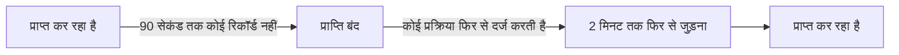

# जब OneUptime डेटा प्राप्त नहीं कर रहा हो

जब OneUptime रीस्टार्ट होता है, अपग्रेड होता है या जमा हुए डेटा को निपटाता है, तब आपके एजेंट, कलेक्टर, प्रोब और हार्टबीट भेजने वाले जो कुछ भेजते हैं, वह आपके मॉनिटर तक नहीं पहुँच पाता। OneUptime दर्ज करता है कि ऐसा कब होता है और उस समय को कभी किसी सर्वर, होस्ट या किसी अन्य संसाधन के विरुद्ध नहीं गिनता: उस समय निगरानी नहीं हुई, इसलिए वह डाउनटाइम नहीं है।

## यह कैसे काम करता है

डेटा लेने वाली हर OneUptime प्रक्रिया, जब तक वह उन डेटाबेस तक पहुँच सकती है जिनमें वह डेटा रखती है, हर 30 सेकंड में दर्ज करती है कि वह डेटा प्राप्त कर रही है। OneUptime तीन तरह के समय को अलग रखता है:

- प्राप्ति बंद: किसी भी प्रक्रिया ने 90 सेकंड से अधिक समय तक कुछ दर्ज नहीं किया। OneUptime बंद था, रीस्टार्ट या अपग्रेड हो रहा था, या अपने किसी डेटाबेस तक नहीं पहुँच पा रहा था।
- फिर से जुड़ना: OneUptime के फिर से प्राप्त करना शुरू करने के बाद के पहले 2 मिनट, जब एजेंट फिर से जुड़ते हैं और रोका हुआ डेटा भेजते हैं।
- बराबरी पर आना: जब तक प्रोसेस होने की प्रतीक्षा कर रहे डेटा की कतार एक मिनट से ज़्यादा पीछे है, उसमें अब भी प्रतीक्षा कर रहे सबसे पुराने डेटा के बाद का समय।



90 सेकंड से कम समय में पूरा होने वाला रीस्टार्ट कोई अंतराल नहीं है: कलेक्टर वह फिर से भेजते हैं जो वे पहुँचा नहीं सके।

## उस समय के दौरान क्या बदलता है

| कहाँ | OneUptime क्या करता है |
| --- | --- |
| सर्वर / VM मॉनिटर | **Is Online** केवल वे मिनट गिनता है जब OneUptime प्राप्त कर रहा था: डिफ़ॉल्ट रूप से, कोई सर्वर ऐसी 3 मिनट की चुप्पी के बाद ऑफ़लाइन होता है जिसे OneUptime सुन सकता था। |
| आने वाले अनुरोध और आने वाले ईमेल मॉनिटर | **Recieved In Minutes** और **Not Recieved In Minutes** केवल वे मिनट गिनते हैं जब OneUptime प्राप्त कर रहा था। ऐसा मानदंड पूरा होने पर उसका कारण बताता है कि उनमें से कितने मिनट अलग रखे गए। |
| होस्ट, Kubernetes, Docker, मेट्रिक्स, लॉग, ट्रेस और टेलीमेट्री पढ़ने वाले अन्य मॉनिटर | जिस जाँच की विंडो में ऐसा समय है जब OneUptime प्राप्त नहीं कर रहा था, वह तब तक प्रतीक्षा करती है जब तक वह समय विंडो से बाहर न निकल जाए, और उसके ख़त्म होने के बाद 15 मिनट से ज़्यादा कभी नहीं। तब तक कुछ नहीं बदलता: कोई स्थिति परिवर्तन नहीं, और कोई घटना या अलर्ट न खुलता है न हल होता है। जब तक कतार पीछे है, जाँच अब तक के बजाय वहाँ तक पढ़ती है जहाँ कतार है। |
| होस्ट, क्लस्टर और बाकी इन्वेंटरी | कोई संसाधन तभी **डिस्कनेक्टेड** होता है जब OneUptime के प्राप्त करते समय उसकी चुप्पी की सीमा, अधिकांश के लिए 15 मिनट, बीत जाए। |
| प्रोब और AI एजेंट | OneUptime के प्राप्त करते समय 3 मिनट की चुप्पी के बाद **डिस्कनेक्टेड** हो जाते हैं। |
| होस्ट, Docker और Podman होस्ट तथा Kubernetes क्लस्टर के **उपलब्धता** चार्ट | उस समय को **निगरानी नहीं** के रूप में छायांकित किया जाता है, और लाइन डाउन तक गिरने के बजाय वहाँ टूट जाती है। अपटाइम बैज उस समय को अलग रखता है; डेटा वाला अंतराल अब भी अप गिना जाता है। |
| स्थिति पृष्ठों का अपटाइम और SLO | दोनों मॉनिटर की स्थितियों से निकाले जाते हैं: कोई ग़लत स्थिति परिवर्तन नहीं, तो कोई ग़लत डाउनटाइम नहीं। |

> [!NOTE]
> समय को अलग रखना उसे भरना नहीं है। जिस समय OneUptime किसी संसाधन को सुन नहीं सकता था, उस समय के लिए उसे कभी अप नहीं दिखाया जाता: उस समय का बस आकलन नहीं होता। OneUptime के फिर से प्राप्त करना शुरू करते ही, जो संसाधन सचमुच डाउन है उसका आकलन तब से इस आधार पर होता है कि वह क्या भेजता है, या भेजने में विफल रहता है।

## स्व-होस्टेड इंस्टॉलेशन

### शुरू होते समय

जब कोई OneUptime प्रक्रिया शुरू हो रही होती है, तो वह अपनी स्थिति जाँचों को छोड़कर हर अनुरोध का जवाब `503 Service Unavailable` और `Retry-After: 5` से देती है, और ब्राउज़र को एक ऐसा पृष्ठ मिलता है जो ख़ुद को फिर से लोड करता है। OpenTelemetry कलेक्टर और SDK ऐसे जवाब पर डेटा छोड़ने के बजाय अनुरोध फिर से भेजते हैं। `/status/ready` तब तक विफल रहता है जब तक प्रक्रिया तैयार न हो, इसलिए Kubernetes उससे पहले उसे कोई ट्रैफ़िक नहीं भेजता।

### वर्कर रेप्लिका

कोई प्रक्रिया तभी दर्ज करती है कि OneUptime प्राप्त कर रहा है जब आने वाला ट्रैफ़िक उस तक पहुँच सकता हो। अगर आप ऐसी रेप्लिका चलाते हैं जो केवल कतारें प्रोसेस करती हैं और जिनके आगे कोई ingress नहीं है, तो उन पर `RECEIVES_INGRESS_TRAFFIC` को `false` पर सेट करें। वरना जब ट्रैफ़िक लेने वाली सभी रेप्लिका डाउन हों, तब भी वे दर्ज करती रहती हैं, और वह आउटेज फिर से आपके संसाधनों के विरुद्ध गिना जाता है। Helm चार्ट इसे अपने वर्कर पॉड पर पहले से सेट करता है, और एक अकेले OneUptime कंटेनर को कुछ नहीं चाहिए।

```yaml title="वर्कर कंटेनर"
env:
  - name: RECEIVES_INGRESS_TRAFFIC
    value: "false"
```

### क्या दर्ज होता है

OneUptime यह रिकॉर्ड तब से रखना शुरू करता है जब आप ऐसे संस्करण पर अपग्रेड करते हैं जिसमें यह है; उससे पहले के समय का आकलन हमेशा की तरह होता है। जब तक कोई प्रक्रिया यह दर्ज नहीं करती कि वह प्राप्त कर रही है, आख़िरी रिकॉर्ड के बाद का समय अधिकतम एक घंटे तक अंतराल माना जाता है; उसके बाद चुप्पी फिर से गिनी जाती है, ताकि लिखा जाना बंद हो चुका रिकॉर्ड आपके संसाधनों के आउटेज को लंबे समय तक छिपा न सके। रिकॉर्ड 400 दिन तक रखे जाते हैं, और जब OneUptime उन्हें पढ़ नहीं पाता, तो वह चुप्पी का आकलन ऐसे करता है मानो वह पूरे समय प्राप्त कर रहा था।

## अगले कदम

:::cards
- [होस्ट मॉनिटर](/docs/monitor/host-monitor): किसी होस्ट के मेट्रिक्स पर अलर्ट करें।
- [सर्वर / VM मॉनिटर](/docs/monitor/server-monitor): जानें कि किसी सर्वर का एजेंट कब रिपोर्ट करना बंद करता है।
- [आने वाले अनुरोध मॉनिटर](/docs/monitor/incoming-request-monitor): हार्टबीट को डेड-मैन स्विच में बदलें।
- [अपग्रेड करना](/docs/installation/upgrading): स्व-होस्टेड इंस्टॉलेशन को अपग्रेड करें।
:::
