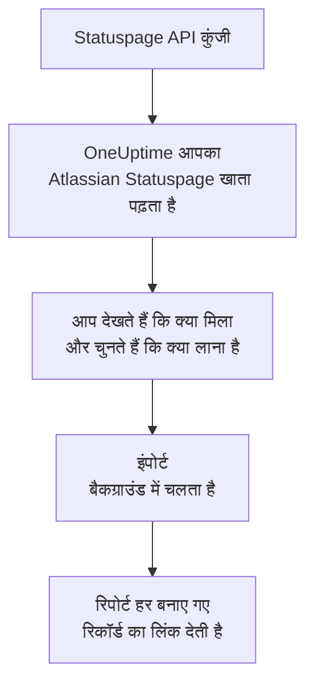

# Atlassian Statuspage से आना

**किसी दूसरे टूल से इंपोर्ट करें** आपके Atlassian Statuspage पृष्ठ कुछ ही मिनटों में OneUptime में ले आता है। Statuspage API कुंजी से OneUptime आपके पृष्ठ, उनके कंपोनेंट और समूह, और उनके ईमेल सब्सक्राइबर पढ़ता है, दिखाता है कि क्या मिला, और जो आप चुनते हैं उसे बनाता है। Statuspage में कुछ नहीं बदलता।

:::cards
- [अपना खाता इंपोर्ट करें](#अपना-atlassian-statuspage-खाता-इंपोर्ट-करें): कुंजी बनाएं, अपना खाता पढ़ें और चुनें कि क्या लाना है।
- [क्या लाया जाता है](#क्या-लाया-जाता-है): हर Statuspage पृष्ठ, कंपोनेंट और सब्सक्राइबर OneUptime में क्या बनता है।
- [बदलाव पूरा करें](#बदलाव-पूरा-करें): इंपोर्ट पूरा होने के बाद क्या करना है।
:::

## यह कैसे काम करता है

- **कुंजी एक बार इस्तेमाल होती है।** जब तक OneUptime आपका खाता पढ़ता है, कुंजी एन्क्रिप्ट करके रखी जाती है, और पढ़ना खत्म होते ही हटा दी जाती है, चाहे वह सफल रहा हो या नहीं। इसे फिर कभी नहीं दिखाया जाता और न ही किसी लॉग में लिखा जाता है।
- **OneUptime सिर्फ़ पढ़ता है।** यह सिर्फ़ Atlassian Statuspage के अपने API को कॉल करता है: `api.statuspage.io`। यह हर सेकंड एक अनुरोध भेजता है, जो Statuspage किसी कुंजी को ज़्यादा से ज़्यादा देता है। जब Atlassian Statuspage धीमा होने को कहता है, तो यह रुककर फिर से कोशिश करता है।
- **जब तक आप इंपोर्ट शुरू नहीं करते, कुछ नहीं बनता।** पूर्वावलोकन हर आइटम के लिए दिखाता है कि वह नया है, पहले से OneUptime में है (और जैसा है वैसा इस्तेमाल होता है), किसी पिछले इंपोर्ट ने उसे लाया था, या वह क्यों नहीं लाया जा सकता।
- **फिर से चलाने पर कभी कुछ दोबारा नहीं बनता।** OneUptime याद रखता है कि हर इंपोर्ट ने Atlassian Statuspage ID के अनुसार क्या लाया। Atlassian Statuspage में पृष्ठ या कंपोनेंट जोड़ने के बाद इसे फिर से चलाएं, और सिर्फ़ नए ही बनेंगे।

## शुरू करने से पहले

- **एक OneUptime प्रोजेक्ट, और जो आप लाते हैं उसे बनाने का अधिकार।** प्रोजेक्ट के मालिक और एडमिन सब कुछ ला सकते हैं। दूसरी भूमिकाएं भी इंपोर्ट चला सकती हैं और उन प्रकार के रिकॉर्ड ला सकती हैं जिन्हें वे बना सकती हैं। बाकी सब कारण के साथ नहीं लाया गया के रूप में दिखता है।
- **एक Statuspage API कुंजी।** इसे केवल खाते का मालिक बना सकता है। इंपोर्ट कभी Statuspage में कुछ नहीं लिखता, और कुंजी जो भी पृष्ठ देख सकती है उन सबको पढ़ता है।
- **आपके पृष्ठों के लिए जगह, OneUptime Cloud पर।** आपके प्लान में स्थिति पृष्ठों और सब्सक्राइबर की एक तय संख्या की जगह होती है। जो नहीं समाता, वह नहीं लाया गया के रूप में दिखता है। कंपोनेंट मैन्युअल मॉनिटर बनते हैं, जो मुफ़्त हैं।

## अपना Atlassian Statuspage खाता इंपोर्ट करें

:::steps
### Statuspage में API कुंजी बनाएं
Statuspage में नीचे बाईं ओर अपना अवतार चुनें, फिर **API info**। **Create key** चुनें, इसका नाम `OneUptime import` रखें और इसे कॉपी करें।

### इंपोर्ट पेज खोलें
OneUptime में **प्रोजेक्ट सेटिंग्स** > **किसी दूसरे टूल से इंपोर्ट करें** पर जाएं और **Atlassian Statuspage** चुनें।

### Atlassian Statuspage कनेक्ट करें
कुंजी को **Atlassian Statuspage API कुंजी** में पेस्ट करें और **मेरा Atlassian Statuspage खाता पढ़ें** चुनें। बड़ा खाता पढ़ने में कुछ मिनट लगते हैं, और पढ़ने के दौरान आप पेज छोड़ सकते हैं।

### चुनें कि क्या लाना है
पूर्वावलोकन हर प्रकार के लिए एक सेक्शन में दिखाता है कि क्या मिला। जो कुछ भी बनाया जाएगा वह शुरू से चुना हुआ होता है, सिवाय सब्सक्राइबर के। हर आइटम के नीचे OneUptime बताता है कि क्या ठीक वैसा नहीं आएगा जैसा था। जब कोई चुना गया स्थिति पृष्ठ ऐसा मॉनिटर दिखाता है जिसे आपने नहीं चुना, तो वह बताता है, और **इन्हें भी चुनें** उसे चुन देता है। सब्सक्राइबर लाने के लिए उन्हें चुनें, फिर उनके नीचे पुष्टि करें कि उन्होंने आपके अपडेट पाने के लिए सहमति दी है और आप उन्हें ले जा सकते हैं। किसी को ईमेल नहीं भेजा जाता।

### इंपोर्ट शुरू करें
**इंपोर्ट शुरू करें** चुनें। इंपोर्ट बैकग्राउंड में चलता है: आप पेज छोड़ सकते हैं, और रिपोर्ट वहीं आपका इंतज़ार करेगी।
:::

रिपोर्ट गिनती है कि क्या बनाया गया और क्या नहीं लाया गया, और हर आइटम को उस रिकॉर्ड के लिंक के साथ दिखाती है जो वह बना, विफल आइटम सबसे पहले। पिछले इंपोर्ट उसी पेज पर **पिछले इंपोर्ट** के नीचे दिखते हैं।

## क्या लाया जाता है

| Atlassian Statuspage में | OneUptime में | कैसे |
| --- | --- | --- |
| Components | मैन्युअल मॉनिटर | हर कंपोनेंट एक मैन्युअल मॉनिटर बनता है जिसे स्थिति पृष्ठ दिखाता है। उसे कुछ नहीं जांचता: आप उसकी स्थिति OneUptime में तय करते हैं, जैसे Statuspage में करते थे। कंपोनेंट समूह पृष्ठ पर एक समूह बनता है। |
| Pages | स्थिति पृष्ठ | हर पृष्ठ अपने नाम और विवरण, अपने समूहों में कंपोनेंट, और जिन कंपोनेंट को वह प्रमुखता से दिखाता है उनकी उपलब्धता और इतिहास के साथ लाया जाता है। जिस पृष्ठ को केवल कुछ लोग देख सकते हैं, वह निजी रूप में लाया जाता है। |
| Email subscribers | स्थिति पृष्ठ सब्सक्राइबर | पुष्ट ईमेल सब्सक्राइबर तब लाए जाते हैं जब आप पुष्टि करते हैं कि आप उन्हें ले जा सकते हैं, और वे उन्हीं कंपोनेंट को फ़ॉलो करते हैं। किसी को ईमेल नहीं भेजा जाता, और OneUptime से मिलने वाले हर अपडेट में सदस्यता छोड़ने का लिंक होता है। |

कंपोनेंट चालू स्थिति में लाए जाते हैं। पूर्वावलोकन हर उस कंपोनेंट का नाम बताता है जो अभी Statuspage में चालू नहीं दिख रहा, ताकि आप इंपोर्ट के बाद उसकी स्थिति तय कर सकें।

## क्या नहीं लाया जाता

- **घटनाएं, अनुसूचित रखरखाव और उनका इतिहास।** OneUptime में घटना एक सक्रिय रिकॉर्ड है जो लोगों को पेज करता है, इसलिए पुरानी घटनाएं Statuspage में ही रहती हैं।
- **SMS, वेबहुक, Slack या Microsoft Teams से जुड़े सब्सक्राइबर।** पूर्वावलोकन इन्हें गिनता है। केवल ईमेल सब्सक्राइबर लाए जाते हैं।
- **घटना टेम्पलेट और सिस्टम मेट्रिक्स।** जो अभी भी चाहिए, उसे OneUptime में जोड़ें।
- **स्थिति पृष्ठ का अपना डोमेन और ब्रांडिंग।** OneUptime में डोमेन को **कस्टम डोमेन** में और लोगो को **ब्रांडिंग** में जोड़ें।

## सीमाएं

एक इंपोर्ट ज़्यादा से ज़्यादा 2,000 रिकॉर्ड बनाता है: ज़्यादा से ज़्यादा 1,000 मॉनिटर और 50 स्थिति पृष्ठ। सब्सक्राइबर इसमें नहीं गिने जाते: एक इंपोर्ट ज़्यादा से ज़्यादा 5,000 सब्सक्राइबर लाता है। किसी सीमा से ऊपर का सब कुछ नहीं लाया गया के रूप में दिखता है। बाकी लाने के लिए इंपोर्ट फिर से चलाएं।

OneUptime Cloud पर, जिन स्थिति पृष्ठों और सब्सक्राइबर के लिए आपके प्लान में जगह नहीं है, वे ज़रूरी चीज़ के साथ नहीं लाए गए के रूप में दिखते हैं।

पूर्वावलोकन एक दिन तक रखा जाता है। सिर्फ़ वही व्यक्ति आइटम चुन सकता है और इंपोर्ट शुरू कर सकता है जिसने खाता पढ़ा। प्रोजेक्ट के मालिक और एडमिन हर इंपोर्ट की प्रगति और रिपोर्ट देखते हैं।

## बदलाव पूरा करें

:::steps
### अपने स्थिति पृष्ठ जांचें
**स्थिति पृष्ठ** में हर पृष्ठ खोलें और उसकी तुलना Statuspage वाले पृष्ठ से करें। हर कंपोनेंट एक मैन्युअल मॉनिटर है: कुछ बदलने पर OneUptime में उसकी स्थिति बदलें।

### अपने स्थिति पृष्ठ का पता OneUptime पर करें
**स्थिति पृष्ठ** में पृष्ठ खोलें, **कस्टम डोमेन** में अपना डोमेन जोड़ें, फिर उसका DNS रिकॉर्ड बदलें। इसके बाद आपके विज़िटर और सब्सक्राइबर नए पृष्ठ पर पहुंचेंगे।

### Atlassian Statuspage में अपना पृष्ठ बंद करें
जब आपका डोमेन OneUptime पर हो जाए, तो Statuspage में पृष्ठ बंद कर दें ताकि उसके सब्सक्राइबर को दो बार न बताया जाए।
:::

## समस्या निवारण

:::details Atlassian Statuspage ने API कुंजी स्वीकार नहीं की
जांचें कि आपने पूरी कुंजी कॉपी की है, और उसे खाते के मालिक ने **API info** में बनाया है। एक कुंजी एक Statuspage संगठन की होती है और केवल उसी के पृष्ठ पढ़ती है। फिर **फिर से प्रयास करें** चुनें।
:::

:::details सब्सक्राइबर नहीं लाए जा सकते
उनके नीचे वह बॉक्स चुनें जो पुष्टि करता है कि उन्होंने आपके अपडेट के लिए सहमति दी है और आप उन्हें ले जा सकते हैं: **इंपोर्ट शुरू करें** इसका इंतज़ार करता है। जिन सब्सक्राइबर ने Statuspage में कभी अपनी सदस्यता की पुष्टि नहीं की, वे वहीं रहते हैं।
:::

:::details कुछ आइटम नहीं चुने जा सकते
हर एक के साथ कारण लिखा होता है: ऐसा नाम जो प्रोजेक्ट में पहले से है, कुछ ऐसा जो पिछले इंपोर्ट ने लाया, या ऐसा रिकॉर्ड जिसे बनाने की आपको अनुमति नहीं है या जो आपके प्लान में शामिल नहीं है।
:::

## अगले कदम

:::cards
- [स्थिति पृष्ठ अवलोकन](/docs/status-pages/index): स्थिति पृष्ठ क्या दिखाता है और उसे कौन देख सकता है।
- [सब्सक्राइबर और घोषणाएँ](/docs/status-pages/subscribers): सब्सक्राइबर को घटनाओं के बारे में कैसे पता चलता है।
- [मैन्युअल मॉनिटर](/docs/monitor/manual-monitor): ऐसा मॉनिटर जिसकी स्थिति आप खुद तय करते हैं।
:::
