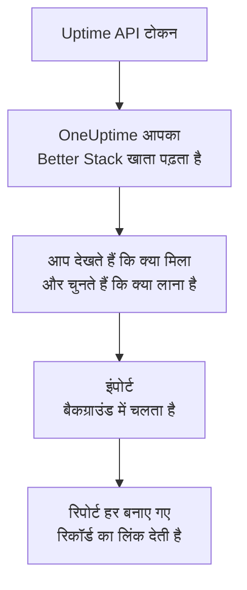

# Better Stack से आना

**किसी दूसरे टूल से इंपोर्ट करें** आपके Better Stack Uptime मॉनिटर, हार्टबीट और स्थिति पृष्ठ कुछ ही मिनटों में OneUptime में ले आता है। Better Stack Uptime API टोकन से OneUptime आपके मॉनिटर, हार्टबीट, स्थिति पृष्ठ और उनके ईमेल सब्सक्राइबर पढ़ता है, दिखाता है कि क्या मिला, और जो आप चुनते हैं उसे बनाता है। Better Stack में कुछ नहीं बदलता।

:::cards
- [अपना खाता इंपोर्ट करें](#अपना-better-stack-खाता-इंपोर्ट-करें): टोकन बनाएं, अपना खाता पढ़ें और चुनें कि क्या लाना है।
- [क्या लाया जाता है](#क्या-लाया-जाता-है): हर Better Stack मॉनिटर, हार्टबीट और स्थिति पृष्ठ OneUptime में क्या बनता है।
- [बदलाव पूरा करें](#बदलाव-पूरा-करें): इंपोर्ट पूरा होने के बाद क्या करना है।
:::

## यह कैसे काम करता है

- **कुंजी एक बार इस्तेमाल होती है।** जब तक OneUptime आपका खाता पढ़ता है, कुंजी एन्क्रिप्ट करके रखी जाती है, और पढ़ना खत्म होते ही हटा दी जाती है, चाहे वह सफल रहा हो या नहीं। इसे फिर कभी नहीं दिखाया जाता और न ही किसी लॉग में लिखा जाता है।
- **OneUptime सिर्फ़ पढ़ता है।** यह सिर्फ़ Better Stack के अपने API को कॉल करता है: `incidents.betterstack.com`। जब Better Stack धीमा होने को कहता है, तो यह रुककर फिर से कोशिश करता है।
- **जब तक आप इंपोर्ट शुरू नहीं करते, कुछ नहीं बनता।** पूर्वावलोकन हर आइटम के लिए दिखाता है कि वह नया है, पहले से OneUptime में है (और जैसा है वैसा इस्तेमाल होता है), किसी पिछले इंपोर्ट ने उसे लाया था, या वह क्यों नहीं लाया जा सकता।
- **फिर से चलाने पर कभी कुछ दोबारा नहीं बनता।** OneUptime याद रखता है कि हर इंपोर्ट ने Better Stack ID के अनुसार क्या लाया। Better Stack में मॉनिटर या हार्टबीट जोड़ने के बाद इसे फिर से चलाएं, और सिर्फ़ नए ही बनेंगे।

## शुरू करने से पहले

- **एक OneUptime प्रोजेक्ट, और जो आप लाते हैं उसे बनाने का अधिकार।** प्रोजेक्ट के मालिक और एडमिन सब कुछ ला सकते हैं। दूसरी भूमिकाएं भी इंपोर्ट चला सकती हैं और उन प्रकार के रिकॉर्ड ला सकती हैं जिन्हें वे बना सकती हैं। बाकी सब कारण के साथ नहीं लाया गया के रूप में दिखता है।
- **एक Better Stack Uptime API टोकन।** टीम-आधारित Uptime टोकन इस्तेमाल करें: यह उस टीम के मॉनिटर, हार्टबीट और स्थिति पृष्ठ पढ़ता है। इंपोर्ट कभी Better Stack में कुछ नहीं लिखता।
- **भुगतान का तरीका, OneUptime Cloud पर।** जांच करने वाले मॉनिटर का बिल इस्तेमाल के हिसाब से बनता है, Free प्लान पर भी, इसलिए इंपोर्ट से पहले **प्रोजेक्ट सेटिंग्स** > **बिलिंग** में भुगतान का तरीका जोड़ें। इसके बिना वे मॉनिटर नहीं लाए गए के रूप में दिखते हैं।

## अपना Better Stack खाता इंपोर्ट करें

:::steps
### Better Stack में API टोकन बनाएं
Better Stack में **API tokens** > **Team-based tokens** पर जाएं और अपनी टीम चुनें। **Uptime API tokens** में `OneUptime import` नाम से एक टोकन बनाएं और उसे कॉपी करें।

### इंपोर्ट पेज खोलें
OneUptime में **प्रोजेक्ट सेटिंग्स** > **किसी दूसरे टूल से इंपोर्ट करें** पर जाएं और **Better Stack** चुनें।

### Better Stack कनेक्ट करें
टोकन को **Better Stack API कुंजी** में पेस्ट करें और **मेरा Better Stack खाता पढ़ें** चुनें। बड़ा खाता पढ़ने में कुछ मिनट लगते हैं, और पढ़ने के दौरान आप पेज छोड़ सकते हैं।

### चुनें कि क्या लाना है
पूर्वावलोकन हर प्रकार के लिए एक सेक्शन में दिखाता है कि क्या मिला। जो कुछ भी बनाया जाएगा वह शुरू से चुना हुआ होता है, सिवाय रुके हुए मॉनिटर के, जो चुनने पर रुकी हुई स्थिति में लाए जाते हैं, और सब्सक्राइबर के। हर आइटम के नीचे OneUptime बताता है कि क्या ठीक वैसा नहीं आएगा जैसा था। जब कोई चुना गया स्थिति पृष्ठ ऐसा मॉनिटर दिखाता है जिसे आपने नहीं चुना, तो वह बताता है, और **इन्हें भी चुनें** उसे चुन देता है। सब्सक्राइबर लाने के लिए उन्हें चुनें, फिर उनके नीचे पुष्टि करें कि उन्होंने आपके अपडेट पाने के लिए सहमति दी है और आप उन्हें ले जा सकते हैं। किसी को ईमेल नहीं भेजा जाता।

### इंपोर्ट शुरू करें
**इंपोर्ट शुरू करें** चुनें। इंपोर्ट बैकग्राउंड में चलता है: आप पेज छोड़ सकते हैं, और रिपोर्ट वहीं आपका इंतज़ार करेगी।
:::

रिपोर्ट गिनती है कि क्या बनाया गया और क्या नहीं लाया गया, और हर आइटम को उस रिकॉर्ड के लिंक के साथ दिखाती है जो वह बना, विफल आइटम सबसे पहले। पिछले इंपोर्ट उसी पेज पर **पिछले इंपोर्ट** के नीचे दिखते हैं।

## क्या लाया जाता है

| Better Stack में | OneUptime में | कैसे |
| --- | --- | --- |
| Monitors and heartbeats | मॉनिटर | हर मॉनिटर उसी प्रकार का मॉनिटर बनता है, उसी पते, अंतराल और टाइमआउट के साथ। हर हार्टबीट एक आने वाले अनुरोध मॉनिटर बनता है। |
| Status pages | स्थिति पृष्ठ | हर पृष्ठ अपने सेक्शन को समूह बनाकर, और जो मॉनिटर और हार्टबीट वह दिखाता है उनके साथ लाया जाता है। जिस आइटम को आप हाथ से ट्रैक करते हैं, वह मैन्युअल मॉनिटर बनता है। पासवर्ड या IP अनुमति-सूची वाला पृष्ठ निजी रूप में लाया जाता है। |
| Email subscribers | स्थिति पृष्ठ सब्सक्राइबर | पुष्ट ईमेल सब्सक्राइबर तब लाए जाते हैं जब आप पुष्टि करते हैं कि आप उन्हें ले जा सकते हैं, और वे उन्हीं संसाधनों को फ़ॉलो करते हैं। किसी को ईमेल नहीं भेजा जाता, और OneUptime से मिलने वाले हर अपडेट में सदस्यता छोड़ने का लिंक होता है। |

- **status, expected status code, keyword और keyword absence मॉनिटर** वेबसाइट मॉनिटर बनते हैं, या API मॉनिटर जब वे कोई दूसरा मेथड, हेडर या JSON बॉडी भेजते हैं। status मॉनिटर किसी भी 2xx जवाब पर चालू माना जाता है, और expected status code मॉनिटर अपनी सूची के कोड पर।
- **पिंग और TCP मॉनिटर** पिंग और पोर्ट मॉनिटर बनते हैं। **SMTP, POP और IMAP मॉनिटर** अपने पोर्ट के पोर्ट मॉनिटर बनते हैं: OneUptime जांचता है कि पोर्ट जवाब देता है, मेल बातचीत नहीं।
- **DNS मॉनिटर** उस नाम के DNS मॉनिटर बनते हैं जिसे वे पूछते हैं, उसी सर्वर से।
- **हार्टबीट** आने वाले अनुरोध मॉनिटर बनते हैं, जो अवधि और ग्रेस में कोई अनुरोध न आने पर बंद माने जाते हैं। OneUptime में हर एक का नया पता होता है।
- **SSL समाप्ति चेतावनियां।** जो मॉनिटर प्रमाणपत्र की समाप्ति से पहले चेतावनी देता है, उसे उसी के नाम पर एक SSL प्रमाणपत्र मॉनिटर भी मिलता है, जो उतने ही दिन पहले चेतावनी देता है।

हर मॉनिटर आपके प्रोजेक्ट के प्रोब से जांचा जाता है, ठीक वैसे ही जैसे आपका खुद बनाया मॉनिटर। जो अंतराल OneUptime में नहीं है, वह सबसे नज़दीकी उपलब्ध अंतराल बन जाता है, और एक मिनट से ज़्यादा का टाइमआउट एक मिनट बन जाता है। इनमें से कुछ भी बदलने पर पूर्वावलोकन बताता है।

## क्या नहीं लाया जाता

- **उपलब्धता का इतिहास, रिस्पॉन्स टाइम और घटनाएं।** OneUptime इंपोर्ट पूरा होने के बाद से जांच शुरू करता है।
- **अलर्ट संपर्क और इंटीग्रेशन।** [बदलाव पूरा करें](#बदलाव-पूरा-करें) में बताए अनुसार OneUptime में तय करें कि किसे बताया जाए।
- **पासवर्ड, और ऐसे हेडर जिनमें कोई सीक्रेट हो सकता है।** जो मॉनिटर साइन इन करता है, या `Authorization`, कुकी या टोकन हेडर भेजता है, वह उसके बिना लाया जाता है: उसे [मॉनिटर सीक्रेट](/docs/monitor/monitor-secrets) के साथ जोड़ें।
- **UDP और Playwright मॉनिटर।** OneUptime में ऐसा कोई मॉनिटर नहीं है जो यही काम करे, और पूर्वावलोकन हर एक का नाम बताता है।
- **जिन सब्सक्राइबर ने कभी अपनी सदस्यता की पुष्टि नहीं की।** वे Better Stack में ही रहते हैं।
- **स्थिति पृष्ठ पर मॉनिटर, हार्टबीट और हाथ से ट्रैक किए गए आइटम के अलावा जो कुछ दिखता है।** पूर्वावलोकन हर एक का नाम बताता है।
- **स्थिति पृष्ठ का अपना डोमेन और ब्रांडिंग।** OneUptime में डोमेन को **कस्टम डोमेन** में और लोगो को **ब्रांडिंग** में जोड़ें।

## सीमाएं

एक इंपोर्ट ज़्यादा से ज़्यादा 2,000 रिकॉर्ड बनाता है: ज़्यादा से ज़्यादा 1,000 मॉनिटर और 50 स्थिति पृष्ठ। सब्सक्राइबर इसमें नहीं गिने जाते: एक इंपोर्ट ज़्यादा से ज़्यादा 5,000 सब्सक्राइबर लाता है। किसी सीमा से ऊपर का सब कुछ नहीं लाया गया के रूप में दिखता है। बाकी लाने के लिए इंपोर्ट फिर से चलाएं।

OneUptime Cloud पर, जांच करने वाले मॉनिटर को भुगतान के तरीके की ज़रूरत होती है, और जिसके लिए आपके प्लान में जगह नहीं है वह ज़रूरी चीज़ के साथ नहीं लाया गया के रूप में दिखता है।

पूर्वावलोकन एक दिन तक रखा जाता है। सिर्फ़ वही व्यक्ति आइटम चुन सकता है और इंपोर्ट शुरू कर सकता है जिसने खाता पढ़ा। प्रोजेक्ट के मालिक और एडमिन हर इंपोर्ट की प्रगति और रिपोर्ट देखते हैं।

## बदलाव पूरा करें

:::steps
### अपने मॉनिटर जांचें
**मॉनिटर** में हर मॉनिटर खोलें और उसके पहले नतीजे जांचें। हार्टबीट मॉनिटर का नया पता होता है: उसे पिंग करने वाले जॉब को उस पते पर भेजें।

### तय करें कि किसे बताया जाए
अपने मॉनिटर में मालिक जोड़ें, या उनकी खोली गई घटनाओं पर **ऑन-कॉल ड्यूटी** > **ऑन-कॉल नीतियां** से ऑन-कॉल नीति लगाएं, ताकि कुछ बंद होने पर सही लोगों को पता चले।

### अपने स्थिति पृष्ठ का पता OneUptime पर करें
**स्थिति पृष्ठ** में पृष्ठ खोलें, **कस्टम डोमेन** में अपना डोमेन जोड़ें, फिर उसका DNS रिकॉर्ड बदलें। इसके बाद आपके विज़िटर और सब्सक्राइबर नए पृष्ठ पर पहुंचेंगे।

### Better Stack में जांचें बंद करें
जब OneUptime वही चीज़ें जांचने लगे, तो Better Stack में इन जांचों को रोक दें ताकि किसी को दो बार न बताया जाए।
:::

## समस्या निवारण

:::details Better Stack ने API कुंजी स्वीकार नहीं की
जांचें कि आपने पूरा टोकन कॉपी किया है, और यह **Uptime API tokens** से टीम का टोकन है, Telemetry टोकन नहीं। फिर **फिर से प्रयास करें** चुनें।
:::

:::details कोई मॉनिटर नहीं लाया गया के रूप में दिखता है
उसके साथ कारण लिखा होता है: ऐसा मॉनिटर प्रकार जो OneUptime में नहीं है, ऐसा पता जिसे OneUptime पढ़ नहीं सकता, या ऐसा प्रोजेक्ट जिसमें उसके लिए जगह या भुगतान का तरीका नहीं है। अगर OneUptime पहले से उसी नाम, प्रकार और पते वाला मॉनिटर चलाता है, तो वही मॉनिटर जैसा है वैसा इस्तेमाल होता है।
:::

:::details कुछ आइटम नहीं चुने जा सकते
हर एक के साथ कारण लिखा होता है: ऐसा नाम जो प्रोजेक्ट में पहले से है, कुछ ऐसा जो पिछले इंपोर्ट ने लाया, या ऐसा रिकॉर्ड जिसे बनाने की आपको अनुमति नहीं है या जो आपके प्लान में शामिल नहीं है।
:::

## अगले कदम

:::cards
- [आने वाले अनुरोध मॉनिटर](/docs/monitor/incoming-request-monitor): OneUptime में हार्टबीट कैसे काम करता है।
- [स्थिति पृष्ठ अवलोकन](/docs/status-pages/index): स्थिति पृष्ठ क्या दिखाता है और उसे कौन देख सकता है।
- [UptimeRobot से आना](/docs/moving-to-oneuptime/uptimerobot): UptimeRobot से अपनी जांचें ले आएं।
:::
