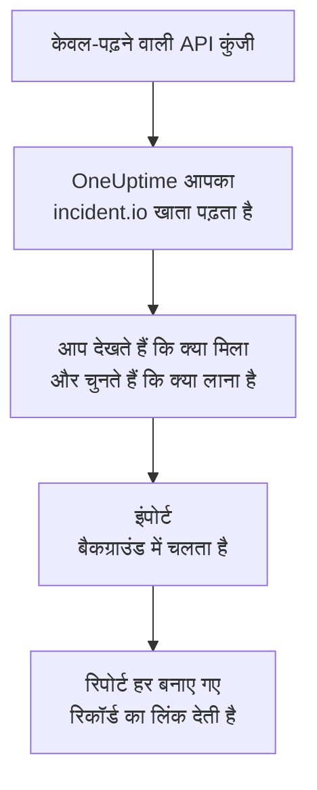

# incident.io से आना

**किसी दूसरे टूल से इंपोर्ट करें** आपका incident.io सेटअप कुछ ही मिनटों में OneUptime में ले आता है। केवल-पढ़ने वाली incident.io API कुंजी से OneUptime आपके उपयोगकर्ता, टीमें, अनुसूचियां, एस्केलेशन पथ, सेवाएं और घटना सेटिंग्स पढ़ता है, दिखाता है कि क्या मिला, और जो आप चुनते हैं उसे बनाता है। incident.io में कुछ नहीं बदलता।

:::cards
- [अपना खाता इंपोर्ट करें](#अपना-incidentio-खाता-इंपोर्ट-करें): कुंजी बनाएं, अपना खाता पढ़ें और चुनें कि क्या लाना है।
- [क्या लाया जाता है](#क्या-लाया-जाता-है): हर incident.io रिकॉर्ड OneUptime में क्या बनता है।
- [बदलाव पूरा करें](#बदलाव-पूरा-करें): इंपोर्ट पूरा होने के बाद क्या करना है।
:::

## यह कैसे काम करता है

- **कुंजी एक बार इस्तेमाल होती है।** जब तक OneUptime आपका खाता पढ़ता है, कुंजी एन्क्रिप्ट करके रखी जाती है, और पढ़ना खत्म होते ही हटा दी जाती है, चाहे वह सफल रहा हो या नहीं। इसे फिर कभी नहीं दिखाया जाता और न ही किसी लॉग में लिखा जाता है।
- **OneUptime सिर्फ़ पढ़ता है।** यह सिर्फ़ incident.io के अपने API, `api.incident.io`, को कॉल करता है। जब incident.io धीमा होने को कहता है, तो यह रुककर फिर से कोशिश करता है।
- **जब तक आप इंपोर्ट शुरू नहीं करते, कुछ नहीं बनता।** पूर्वावलोकन हर आइटम के लिए दिखाता है कि वह नया है, पहले से OneUptime में है (और जैसा है वैसा इस्तेमाल होता है), किसी पिछले इंपोर्ट ने उसे लाया था, या वह क्यों नहीं लाया जा सकता।
- **फिर से चलाने पर कभी कुछ दोबारा नहीं बनता।** OneUptime याद रखता है कि हर इंपोर्ट ने incident.io ID के अनुसार क्या लाया। incident.io में लोग या अनुसूचियां जोड़ने के बाद इसे फिर से चलाएं, और सिर्फ़ नए ही बनेंगे।

## शुरू करने से पहले

- **एक OneUptime प्रोजेक्ट, और जो आप लाते हैं उसे बनाने का अधिकार।** प्रोजेक्ट के मालिक और एडमिन सब कुछ ला सकते हैं। दूसरी भूमिकाएं भी इंपोर्ट चला सकती हैं और उन प्रकार के रिकॉर्ड ला सकती हैं जिन्हें वे बना सकती हैं। बाकी सब कारण के साथ नहीं लाया गया के रूप में दिखता है।
- **एक incident.io API कुंजी जो सिर्फ़ डेटा देख सकती है।** इंपोर्ट कभी incident.io में कुछ नहीं लिखता, इसलिए कुंजी को कुछ भी बनाने, बदलने या प्रबंधित करने की अनुमति नहीं चाहिए।

## अपना incident.io खाता इंपोर्ट करें

:::steps
### incident.io में API कुंजी बनाएं
incident.io में **Settings** > **API keys** पर जाएं और **Add new** चुनें। इसका नाम `OneUptime import` रखें, इसे सिर्फ़ डेटा देखने की अनुमतियां दें, बनाने, बदलने या प्रबंधित करने की कोई नहीं, और कुंजी कॉपी करें।

### इंपोर्ट पेज खोलें
OneUptime में **प्रोजेक्ट सेटिंग्स** > **किसी दूसरे टूल से इंपोर्ट करें** पर जाएं और **incident.io** चुनें।

### incident.io कनेक्ट करें
कुंजी को **incident.io API कुंजी** में पेस्ट करें और **मेरा incident.io खाता पढ़ें** चुनें। बड़े खाते में कुछ मिनट लगते हैं, और पढ़ने के दौरान आप पेज छोड़ सकते हैं।

### चुनें कि क्या लाना है
पूर्वावलोकन हर प्रकार के लिए एक सेक्शन में दिखाता है कि क्या मिला। जो कुछ भी बनाया जाएगा वह शुरू से चुना हुआ होता है, सिवाय उन लोगों के जो किसी टीम, अनुसूची या एस्केलेशन पथ में नहीं हैं। हर आइटम के नीचे OneUptime बताता है कि क्या ठीक वैसा नहीं आएगा जैसा था। जब कोई चुना गया आइटम ऐसी चीज़ इस्तेमाल करता है जिसे आपने नहीं चुना, तो वह बताता है, और **इन्हें भी चुनें** उसे चुन देता है।

### इंपोर्ट शुरू करें
अगर लोगों को आमंत्रित किया जाएगा, तो **नए लोगों को इसमें आमंत्रित करें** में वह टीम चुनें जिसमें वे शामिल होंगे। फिर **इंपोर्ट शुरू करें** चुनें। इंपोर्ट बैकग्राउंड में चलता है: आप पेज छोड़ सकते हैं, और रिपोर्ट वहीं आपका इंतज़ार करेगी।
:::

रिपोर्ट गिनती है कि क्या बनाया गया, किसे आमंत्रित किया गया और क्या नहीं लाया गया, और हर आइटम को उस रिकॉर्ड के लिंक के साथ दिखाती है जो वह बना, विफल आइटम सबसे पहले। पिछले इंपोर्ट उसी पेज पर **पिछले इंपोर्ट** के नीचे दिखते हैं।

## क्या लाया जाता है

| incident.io में | OneUptime में | कैसे |
| --- | --- | --- |
| उपयोगकर्ता | प्रोजेक्ट सदस्य | ईमेल पते से मिलाए जाते हैं। जो अभी प्रोजेक्ट में नहीं है, उसे आपकी चुनी हुई टीम में आमंत्रित किया जाता है। निष्क्रिय किए गए उपयोगकर्ता नहीं लाए जाते। |
| टीमें | टीमें | अपने सदस्यों के साथ बनाई जाती हैं। जिस टीम का नाम प्रोजेक्ट में पहले से है, उसे जैसी है वैसी इस्तेमाल किया जाता है, और उसके सदस्यों को नहीं छेड़ा जाता। |
| अनुसूचियां | ऑन-कॉल अनुसूचियां | हर रोटेशन उन्हीं लोगों, उसी शुरुआत, उसी बारी की लंबाई और उन्हीं काम के घंटों वाली एक परत बन जाता है, अनुसूची के समय क्षेत्र में। रोटेशन का वह संस्करण लाया जाता है जो अभी लागू है। |
| एस्केलेशन पथ | ऑन-कॉल नीतियां | हर स्तर एक एस्केलेशन नियम बन जाता है जो उसी प्रतीक्षा के बाद उन्हीं अनुसूचियों, उपयोगकर्ताओं और टीमों को पेज करता है। दोहराव नीति के दोहराव बन जाते हैं, और किसी शाखा से पहला पथ लाया जाता है। |
| कैटलॉग सेवाएं | सेवाएं | सेवा श्रेणी के आपके कैटलॉग प्रकारों की प्रविष्टियां, सेवा कैटलॉग में बनाई जाती हैं। संग्रहीत प्रविष्टियां छोड़ दी जाती हैं। |
| गंभीरताएं | घटना गंभीरताएं | incident.io के क्रम में बनाई जाती हैं, सबसे गंभीर पहले। जिस गंभीरता का नाम प्रोजेक्ट में पहले से है, उसे जैसी है वैसी इस्तेमाल किया जाता है। |
| स्थितियां | घटना स्थितियां | ट्राइएज स्थिति उस स्थिति से मेल खाती है जिसमें OneUptime घटनाएं शुरू करता है, और बंद स्थिति उस स्थिति से जिसमें घटनाएं सुलझाई जाती हैं। सक्रिय और रोकी गई स्थितियां स्वीकार किया गया और सुलझाया गया के बीच बनाई जाती हैं। |
| घटना भूमिकाएं | घटना भूमिकाएं | मुख्य भूमिका OneUptime के घटना कमांडर से मेल खाती है, और बाकी भूमिकाएं बनाई जाती हैं। OneUptime हर घटना घोषित करने वाले को दर्ज करता है, इसलिए रिपोर्टर भूमिका की ज़रूरत नहीं है। |
| कस्टम फ़ील्ड | घटना कस्टम फ़ील्ड | एकल-चयन फ़ील्ड ड्रॉपडाउन बन जाते हैं, बहु-चयन फ़ील्ड कई विकल्पों वाले ड्रॉपडाउन, टेक्स्ट और लिंक फ़ील्ड टेक्स्ट, और संख्यात्मक फ़ील्ड संख्याएं, अपने विकल्पों के साथ। |

जिस रोटेशन में एक साथ कई लोग ऑन-कॉल होते हैं, वह हर ऑन-कॉल व्यक्ति के लिए एक OneUptime अनुसूची बन जाता है, क्योंकि OneUptime की अनुसूची में एक समय पर एक ही व्यक्ति ऑन-कॉल होता है। जो ऑन-कॉल नीति उस अनुसूची को पेज करती थी, वह इन सभी को पेज करती है।

## क्या नहीं लाया जाता

- **घटनाएं, अलर्ट और उनका इतिहास।** OneUptime आपके सेटअप से शुरू होता है, आपकी पुरानी घटनाओं से नहीं।
- **वर्कफ़्लो, स्टेटस पेज, अलर्ट रूट और इंटीग्रेशन।** इसके बजाय अपने मॉनिटर और अलर्ट स्रोत OneUptime की ओर करें, जैसा कि [बदलाव पूरा करें](#बदलाव-पूरा-करें) में बताया गया है।
- **ऐसे कस्टम फ़ील्ड जिनके विकल्प कैटलॉग से आते हैं,** और वे स्थितियां जिनके लिए OneUptime में कोई स्थिति नहीं है: declined, merged, canceled और learning।
- **अनुसूचियों के ओवरराइड, और रोटेशन में बाद के लिए तय बदलाव।** पूर्वावलोकन हर तय बदलाव का नाम बताता है, ताकि समय आने पर आप उसे OneUptime में कर सकें।
- **ऐसे एस्केलेशन चरण जिनका OneUptime में ठीक-ठीक मेल नहीं है।** Slack या Microsoft Teams चैनल में पोस्ट करने वाला चरण छोड़ दिया जाता है, क्योंकि OneUptime में यह काम वर्कस्पेस सूचना नियम करते हैं, और किसी दूसरे एस्केलेशन पथ को सौंपने वाला चरण भी छोड़ दिया जाता है। अगले ऑन-कॉल व्यक्ति को पेज करने वाला चरण OneUptime में सबसे नज़दीकी रूप में लाया जाता है, और पूर्वावलोकन बताता है कि क्या बदलता है।

## सीमाएं

एक इंपोर्ट ज़्यादा से ज़्यादा 2,000 रिकॉर्ड बनाता है: ज़्यादा से ज़्यादा 500 लोग, 200 टीमें, 200 ऑन-कॉल अनुसूचियां, 200 ऑन-कॉल नीतियां, 500 सेवाएं, 100 घटना कस्टम फ़ील्ड, और घटना गंभीरताएं, घटना स्थितियां और घटना भूमिकाएं हर एक 25। किसी सीमा से ऊपर का सब कुछ नहीं लाया गया के रूप में दिखता है। बाकी लाने के लिए इंपोर्ट फिर से चलाएं।

OneUptime Cloud पर, जो रिकॉर्ड आपके प्लान में शामिल नहीं हैं, वे ज़रूरी प्लान के साथ नहीं लाए गए के रूप में दिखते हैं।

पूर्वावलोकन एक दिन तक रखा जाता है। सिर्फ़ वही व्यक्ति आइटम चुन सकता है और इंपोर्ट शुरू कर सकता है जिसने खाता पढ़ा। प्रोजेक्ट के मालिक और एडमिन हर इंपोर्ट की प्रगति और रिपोर्ट देखते हैं।

## बदलाव पूरा करें

:::steps
### ऑन-कॉल अनुसूचियां जांचें
**ऑन-कॉल ड्यूटी** > **ऑन-कॉल अनुसूची** में हर अनुसूची खोलें और जांचें कि अभी कौन ऑन-कॉल है और आगे कौन है।

### पक्का करें कि हर किसी को पेज किया जा सके
आमंत्रित लोग अपना आमंत्रण स्वीकार करते हैं, फिर पेज पाने के लिए फ़ोन नंबर, ईमेल पता या मोबाइल ऐप जोड़ते हैं। **ऑन-कॉल ड्यूटी** > **तैयारी** दिखाता है कि अभी किससे संपर्क नहीं हो सकता।

### अपने अलर्ट OneUptime को भेजें
अपने मॉनिटर और अलर्ट भेजने वाले टूल OneUptime की ओर करें, और जांचने के लिए एक बार खुद को पेज करें।

### incident.io में पेजिंग बंद करें
जब OneUptime सही लोगों को पेज करने लगे, तो incident.io में सूचनाएं बंद कर दें ताकि किसी को दो बार पेज न किया जाए।
:::

## समस्या निवारण

:::details incident.io ने API कुंजी स्वीकार नहीं की
जांचें कि आपने पूरी कुंजी कॉपी की और कि उसे **Settings** > **API keys** में हटाया नहीं गया है। फिर **फिर से प्रयास करें** चुनें।
:::

:::details पूर्वावलोकन में किसी प्रकार के रिकॉर्ड नहीं हैं
कुंजी उन्हें नहीं पढ़ सकी, और पूर्वावलोकन सबसे ऊपर यह बताता है। कुंजी को उस प्रकार का डेटा देखने की अनुमति दें और खाता फिर से पढ़ें।
:::

:::details कुछ आइटम नहीं चुने जा सकते
हर एक के साथ कारण लिखा होता है: निष्क्रिय किया गया उपयोगकर्ता, ऐसा नाम जो प्रोजेक्ट में पहले से है, कुछ ऐसा जो पिछले इंपोर्ट ने लाया, या ऐसा रिकॉर्ड जिसे बनाने की आपको अनुमति नहीं है या जो आपके प्लान में शामिल नहीं है।
:::

## अगले कदम

:::cards
- [ऑन-कॉल अनुसूचियां](/docs/on-call/schedules): परतें, प्रतिबंध और हैंड-ऑफ़।
- [घटना स्थितियां और गंभीरताएं](/docs/incidents/states-and-severities): घटनाएं किन स्थितियों और गंभीरताओं से गुज़रती हैं।
- [Opsgenie से आना](/docs/moving-to-oneuptime/opsgenie): Opsgenie से एक टीम ले आएं।
:::
