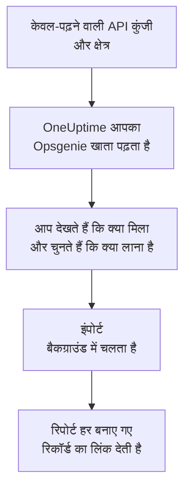

# Opsgenie से आना

Atlassian, Opsgenie को बंद कर रहा है: जून 2025 से Opsgenie बेचा नहीं जा रहा, और अप्रैल 2027 में इसका सपोर्ट खत्म हो जाएगा। OneUptime आपकी ऑन-कॉल टीम का नया घर है, और **किसी दूसरे टूल से इंपोर्ट करें** उसे कुछ ही मिनटों में ले आता है। केवल-पढ़ने वाली Opsgenie API कुंजी से OneUptime आपके उपयोगकर्ता, टीमें, अनुसूचियां, एस्केलेशन और सेवाएं पढ़ता है, दिखाता है कि क्या मिला, और जो आप चुनते हैं उसे बनाता है। Opsgenie में कुछ नहीं बदलता।

:::cards
- [अपना खाता इंपोर्ट करें](#अपना-opsgenie-खाता-इंपोर्ट-करें): कुंजी बनाएं, अपना खाता पढ़ें और चुनें कि क्या लाना है।
- [क्या लाया जाता है](#क्या-लाया-जाता-है): हर Opsgenie रिकॉर्ड OneUptime में क्या बनता है।
- [बदलाव पूरा करें](#बदलाव-पूरा-करें): इंपोर्ट पूरा होने के बाद क्या करना है।
:::

## यह कैसे काम करता है

- **कुंजी एक बार इस्तेमाल होती है।** जब तक OneUptime आपका खाता पढ़ता है, कुंजी एन्क्रिप्ट करके रखी जाती है, और पढ़ना खत्म होते ही हटा दी जाती है, चाहे वह सफल रहा हो या नहीं। इसे फिर कभी नहीं दिखाया जाता और न ही किसी लॉग में लिखा जाता है।
- **OneUptime सिर्फ़ पढ़ता है।** यह सिर्फ़ Opsgenie के अपने API को कॉल करता है: `api.opsgenie.com`, या यूरोप के खाते के लिए `api.eu.opsgenie.com`। जब Opsgenie धीमा होने को कहता है, तो यह रुककर फिर से कोशिश करता है।
- **जब तक आप इंपोर्ट शुरू नहीं करते, कुछ नहीं बनता।** पूर्वावलोकन हर आइटम के लिए दिखाता है कि वह नया है, पहले से OneUptime में है (और जैसा है वैसा इस्तेमाल होता है), किसी पिछले इंपोर्ट ने उसे लाया था, या वह क्यों नहीं लाया जा सकता।
- **फिर से चलाने पर कभी कुछ दोबारा नहीं बनता।** OneUptime याद रखता है कि हर इंपोर्ट ने Opsgenie ID के अनुसार क्या लाया। Opsgenie में लोग या अनुसूचियां जोड़ने के बाद इसे फिर से चलाएं, और सिर्फ़ नए ही बनेंगे।

## शुरू करने से पहले

- **एक OneUptime प्रोजेक्ट, और जो आप लाते हैं उसे बनाने का अधिकार।** प्रोजेक्ट के मालिक और एडमिन सब कुछ ला सकते हैं। दूसरी भूमिकाएं भी इंपोर्ट चला सकती हैं और उन प्रकार के रिकॉर्ड ला सकती हैं जिन्हें वे बना सकती हैं। बाकी सब कारण के साथ नहीं लाया गया के रूप में दिखता है।
- **Read और Configuration access अधिकारों वाली एक Opsgenie API कुंजी।** Configuration access से ही कुंजी उपयोगकर्ता, टीमें, अनुसूचियां और एस्केलेशन पढ़ पाती है। इंपोर्ट कभी Opsgenie में कुछ नहीं लिखता।
- **आपका Opsgenie क्षेत्र।** अगर आप `app.eu.opsgenie.com` पर साइन इन करते हैं, तो आपका खाता यूरोप में है। नहीं तो यह संयुक्त राज्य अमेरिका में है।

## अपना Opsgenie खाता इंपोर्ट करें

:::steps
### Opsgenie में API कुंजी बनाएं
Opsgenie में **Settings** > **API key management** पर जाएं और **Add new API key** चुनें। इसका नाम `OneUptime import` रखें, इसे सिर्फ़ **Read** और **Configuration access** दें, और कुंजी कॉपी करें।

### इंपोर्ट पेज खोलें
OneUptime में **प्रोजेक्ट सेटिंग्स** > **किसी दूसरे टूल से इंपोर्ट करें** पर जाएं और **Opsgenie** चुनें।

### Opsgenie कनेक्ट करें
**आपका Opsgenie खाता कहां है?** में **संयुक्त राज्य अमेरिका** या **यूरोप** चुनें। कुंजी को **Opsgenie API कुंजी** में पेस्ट करें और **मेरा Opsgenie खाता पढ़ें** चुनें। बड़े खाते में कुछ मिनट लगते हैं, और पढ़ने के दौरान आप पेज छोड़ सकते हैं।

### चुनें कि क्या लाना है
पूर्वावलोकन हर प्रकार के लिए एक सेक्शन में दिखाता है कि क्या मिला। जो कुछ भी बनाया जाएगा वह शुरू से चुना हुआ होता है, सिवाय Opsgenie में बंद अनुसूचियों के और उन लोगों के जो किसी टीम, अनुसूची या एस्केलेशन में नहीं हैं। हर आइटम के नीचे OneUptime बताता है कि क्या ठीक वैसा नहीं आएगा जैसा था। जब कोई चुना गया आइटम ऐसी चीज़ इस्तेमाल करता है जिसे आपने नहीं चुना, तो वह बताता है, और **इन्हें भी चुनें** उसे चुन देता है।

### इंपोर्ट शुरू करें
अगर लोगों को आमंत्रित किया जाएगा, तो **नए लोगों को इसमें आमंत्रित करें** में वह टीम चुनें जिसमें वे शामिल होंगे। फिर **इंपोर्ट शुरू करें** चुनें। इंपोर्ट बैकग्राउंड में चलता है: आप पेज छोड़ सकते हैं, और रिपोर्ट वहीं आपका इंतज़ार करेगी।
:::

रिपोर्ट गिनती है कि क्या बनाया गया, किसे आमंत्रित किया गया और क्या नहीं लाया गया, और हर आइटम को उस रिकॉर्ड के लिंक के साथ दिखाती है जो वह बना, विफल आइटम सबसे पहले। पिछले इंपोर्ट उसी पेज पर **पिछले इंपोर्ट** के नीचे दिखते हैं।

## क्या लाया जाता है

| Opsgenie में | OneUptime में | कैसे |
| --- | --- | --- |
| उपयोगकर्ता | प्रोजेक्ट सदस्य | ईमेल पते से मिलाए जाते हैं। जो अभी प्रोजेक्ट में नहीं है, उसे आपकी चुनी हुई टीम में आमंत्रित किया जाता है। ब्लॉक किए गए उपयोगकर्ता नहीं लाए जाते। |
| टीमें | टीमें | अपने सदस्यों के साथ बनाई जाती हैं। जिस टीम का नाम प्रोजेक्ट में पहले से है, उसे जैसी है वैसी इस्तेमाल किया जाता है, और उसके सदस्यों को नहीं छेड़ा जाता। |
| अनुसूचियां | ऑन-कॉल अनुसूचियां | हर रोटेशन उन्हीं लोगों, उसी शुरुआत, उसी बारी की लंबाई और उसी समय-सीमा वाली एक परत बन जाता है, अनुसूची के समय क्षेत्र में, और अनुसूची की टीम के स्वामित्व में। |
| एस्केलेशन | ऑन-कॉल नीतियां | हर नियम एक एस्केलेशन नियम बन जाता है जो उसी अनुसूची, उपयोगकर्ता या टीम को पेज करता है। एक जैसी देरी वाले नियम एक साथ पेज करते हैं, और अगले एस्केलेशन नियम से पहले की प्रतीक्षा देरियों का अंतर होती है। एस्केलेशन के दोहराव नीति के दोहराव बन जाते हैं। |
| सेवाएं | सेवाएं | सेवा कैटलॉग में बनाई जाती हैं, अपनी टीम के स्वामित्व में। |

जिस अनुसूची के रोटेशन दो लोगों को एक साथ ऑन-कॉल रखते हैं, वह हर रोटेशन के लिए एक OneUptime अनुसूची बन जाती है, क्योंकि OneUptime की अनुसूची में एक समय पर एक ही व्यक्ति ऑन-कॉल होता है। जो ऑन-कॉल नीति उस अनुसूची को पेज करती थी, वह इन सभी को पेज करती है।

## क्या नहीं लाया जाता

- **अलर्ट, घटनाएं और उनका इतिहास।** OneUptime आपके सेटअप से शुरू होता है, आपके पुराने अलर्ट से नहीं।
- **इंटीग्रेशन, हार्टबीट, अलर्ट नीतियां और रूटिंग नियम।** इसके बजाय अपने मॉनिटर और अलर्ट स्रोत OneUptime की ओर करें, जैसा कि [बदलाव पूरा करें](#बदलाव-पूरा-करें) में बताया गया है।
- **अनुसूचियों के ओवरराइड, और वे रोटेशन जो पहले ही खत्म हो चुके हैं।** जिन ओवरराइड की अब भी ज़रूरत है, उन्हें इंपोर्ट के बाद OneUptime में जोड़ें।
- **हर व्यक्ति के सूचना नियम।** आमंत्रण स्वीकार करने के बाद हर व्यक्ति अपनी **उपयोगकर्ता सेटिंग्स** में चुनता है कि उसे कैसे पेज किया जाए।
- **ऐसे चरण जिनका OneUptime में ठीक-ठीक मेल नहीं है।** जो नियम अगले ऑन-कॉल व्यक्ति को या किसी टीम के एडमिन को पेज करता है, उसे OneUptime में सबसे नज़दीकी रूप में लाया जाता है, और पूर्वावलोकन बताता है कि क्या बदलता है।

## सीमाएं

एक इंपोर्ट ज़्यादा से ज़्यादा 2,000 रिकॉर्ड बनाता है: ज़्यादा से ज़्यादा 500 लोग, 200 टीमें, 200 ऑन-कॉल अनुसूचियां, 200 ऑन-कॉल नीतियां और 500 सेवाएं। किसी सीमा से ऊपर का सब कुछ नहीं लाया गया के रूप में दिखता है। बाकी लाने के लिए इंपोर्ट फिर से चलाएं।

OneUptime Cloud पर, जो रिकॉर्ड आपके प्लान में शामिल नहीं हैं, वे ज़रूरी प्लान के साथ नहीं लाए गए के रूप में दिखते हैं।

पूर्वावलोकन एक दिन तक रखा जाता है। सिर्फ़ वही व्यक्ति आइटम चुन सकता है और इंपोर्ट शुरू कर सकता है जिसने खाता पढ़ा। प्रोजेक्ट के मालिक और एडमिन हर इंपोर्ट की प्रगति और रिपोर्ट देखते हैं।

## बदलाव पूरा करें

:::steps
### ऑन-कॉल अनुसूचियां जांचें
**ऑन-कॉल ड्यूटी** > **ऑन-कॉल अनुसूची** में हर अनुसूची खोलें और जांचें कि अभी कौन ऑन-कॉल है और आगे कौन है।

### पक्का करें कि हर किसी को पेज किया जा सके
आमंत्रित लोग अपना आमंत्रण स्वीकार करते हैं, फिर पेज पाने के लिए फ़ोन नंबर, ईमेल पता या मोबाइल ऐप जोड़ते हैं। **ऑन-कॉल ड्यूटी** > **तैयारी** दिखाता है कि अभी किससे संपर्क नहीं हो सकता।

### अपने अलर्ट OneUptime को भेजें
अपने मॉनिटर और अलर्ट भेजने वाले टूल OneUptime की ओर करें, और जांचने के लिए एक बार खुद को पेज करें।

### Opsgenie में पेजिंग बंद करें
जब OneUptime सही लोगों को पेज करने लगे, तो Opsgenie में सूचनाएं बंद कर दें ताकि किसी को दो बार पेज न किया जाए।
:::

## समस्या निवारण

:::details Opsgenie ने API कुंजी स्वीकार नहीं की
जांचें कि आपने पूरी कुंजी कॉपी की, कि यह **API key management** की कुंजी है न कि किसी इंटीग्रेशन की, कि इसके पास **Read** और **Configuration access** हैं, और कि आपने वही क्षेत्र चुना जिसमें आपका खाता है। फिर **फिर से प्रयास करें** चुनें।
:::

:::details पूर्वावलोकन में किसी प्रकार के रिकॉर्ड नहीं हैं
कुंजी उन्हें नहीं पढ़ सकी, और पूर्वावलोकन सबसे ऊपर यह बताता है। कुंजी को **Configuration access** दें और खाता फिर से पढ़ें।
:::

:::details कुछ आइटम नहीं चुने जा सकते
हर एक के साथ कारण लिखा होता है: ब्लॉक किया गया उपयोगकर्ता, ऐसा नाम जो प्रोजेक्ट में पहले से है, कुछ ऐसा जो पिछले इंपोर्ट ने लाया, या ऐसा रिकॉर्ड जिसे बनाने की आपको अनुमति नहीं है या जो आपके प्लान में शामिल नहीं है।
:::

## अगले कदम

:::cards
- [ऑन-कॉल अनुसूचियां](/docs/on-call/schedules): परतें, प्रतिबंध और हैंड-ऑफ़।
- [एस्केलेशन नियम](/docs/on-call/escalation-rules): ऑन-कॉल नीतियां लोगों को कैसे पेज करती हैं।
- [incident.io से आना](/docs/moving-to-oneuptime/incident-io): incident.io से एक टीम ले आएं।
:::
