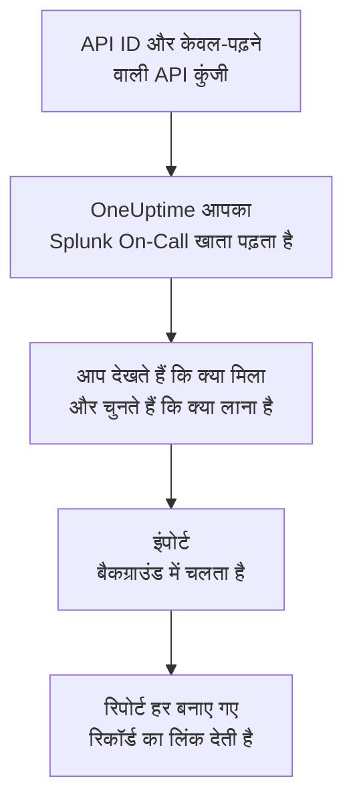

# Splunk On-Call से आना

**किसी दूसरे टूल से इंपोर्ट करें** आपका Splunk On-Call (पहले VictorOps) सेटअप कुछ ही मिनटों में OneUptime में ले आता है। आपकी API ID और केवल-पढ़ने वाली API कुंजी से OneUptime आपके उपयोगकर्ता, टीमें, रोटेशन और एस्केलेशन नीतियां पढ़ता है, दिखाता है कि क्या मिला, और जो आप चुनते हैं उसे बनाता है। Splunk On-Call में कुछ नहीं बदलता।

:::cards
- [अपना खाता इंपोर्ट करें](#अपना-splunk-on-call-खाता-इंपोर्ट-करें): कुंजी बनाएं, अपना खाता पढ़ें और चुनें कि क्या लाना है।
- [क्या लाया जाता है](#क्या-लाया-जाता-है): हर Splunk On-Call रिकॉर्ड OneUptime में क्या बनता है।
- [बदलाव पूरा करें](#बदलाव-पूरा-करें): इंपोर्ट पूरा होने के बाद क्या करना है।
:::

## यह कैसे काम करता है

- **कुंजी एक बार इस्तेमाल होती है।** जब तक OneUptime आपका खाता पढ़ता है, कुंजी API ID के साथ एन्क्रिप्ट करके रखी जाती है, और पढ़ना खत्म होते ही हटा दी जाती है, चाहे वह सफल रहा हो या नहीं। इसे फिर कभी नहीं दिखाया जाता और न ही किसी लॉग में लिखा जाता है।
- **OneUptime सिर्फ़ पढ़ता है।** यह सिर्फ़ Splunk On-Call के अपने API, `api.victorops.com`, को कॉल करता है। Splunk On-Call हर प्रकार के अनुरोध का जवाब एक सेकंड में ज़्यादा से ज़्यादा दो बार देता है, इसलिए OneUptime यही रफ़्तार रखता है, और जब Splunk On-Call धीमा होने को कहता है, तो यह रुककर फिर से कोशिश करता है।
- **जब तक आप इंपोर्ट शुरू नहीं करते, कुछ नहीं बनता।** पूर्वावलोकन हर आइटम के लिए दिखाता है कि वह नया है, पहले से OneUptime में है (और जैसा है वैसा इस्तेमाल होता है), किसी पिछले इंपोर्ट ने उसे लाया था, या वह क्यों नहीं लाया जा सकता।
- **फिर से चलाने पर कभी कुछ दोबारा नहीं बनता।** OneUptime याद रखता है कि हर इंपोर्ट ने Splunk On-Call ID के अनुसार क्या लाया। Splunk On-Call में लोग या रोटेशन जोड़ने के बाद इसे फिर से चलाएं, और सिर्फ़ नए ही बनेंगे।

## शुरू करने से पहले

- **एक OneUptime प्रोजेक्ट, और जो आप लाते हैं उसे बनाने का अधिकार।** प्रोजेक्ट के मालिक और एडमिन सब कुछ ला सकते हैं। दूसरी भूमिकाएं भी इंपोर्ट चला सकती हैं और उन प्रकार के रिकॉर्ड ला सकती हैं जिन्हें वे बना सकती हैं। बाकी सब कारण के साथ नहीं लाया गया के रूप में दिखता है।
- **आपकी Splunk On-Call API ID और केवल-पढ़ने वाली API कुंजी।** दोनों Splunk On-Call में **Integrations** > **API** में हैं। इंपोर्ट कभी Splunk On-Call में कुछ नहीं लिखता, इसलिए केवल-पढ़ने वाली कुंजी काफ़ी है।

## अपना Splunk On-Call खाता इंपोर्ट करें

:::steps
### Splunk On-Call में API कुंजी बनाएं
Splunk On-Call में **Integrations** > **API** पर जाएं। आपकी API ID आपकी API कुंजियों के ऊपर दिखती है। `OneUptime import` नाम से एक नई API कुंजी बनाएं, **Read-only** चुनें, और API ID और कुंजी कॉपी करें।

### इंपोर्ट पेज खोलें
OneUptime में **प्रोजेक्ट सेटिंग्स** > **किसी दूसरे टूल से इंपोर्ट करें** पर जाएं और **Splunk On-Call** चुनें।

### Splunk On-Call कनेक्ट करें
API ID को **Splunk On-Call की API ID** में और कुंजी को **Splunk On-Call API कुंजी** में पेस्ट करें, और **मेरा Splunk On-Call खाता पढ़ें** चुनें। बड़े खाते में कुछ मिनट लगते हैं, और पढ़ने के दौरान आप पेज छोड़ सकते हैं।

### चुनें कि क्या लाना है
पूर्वावलोकन हर प्रकार के लिए एक सेक्शन में दिखाता है कि क्या मिला। जो कुछ भी बनाया जाएगा वह शुरू से चुना हुआ होता है, सिवाय उन लोगों के जो किसी टीम, रोटेशन या एस्केलेशन नीति में नहीं हैं। हर आइटम के नीचे OneUptime बताता है कि क्या ठीक वैसा नहीं आएगा जैसा था। जब कोई चुना गया आइटम ऐसी चीज़ इस्तेमाल करता है जिसे आपने नहीं चुना, तो वह बताता है, और **इन्हें भी चुनें** उसे चुन देता है।

### इंपोर्ट शुरू करें
अगर लोगों को आमंत्रित किया जाएगा, तो **नए लोगों को इसमें आमंत्रित करें** में वह टीम चुनें जिसमें वे शामिल होंगे। फिर **इंपोर्ट शुरू करें** चुनें। इंपोर्ट बैकग्राउंड में चलता है: आप पेज छोड़ सकते हैं, और रिपोर्ट वहीं आपका इंतज़ार करेगी।
:::

रिपोर्ट गिनती है कि क्या बनाया गया, किसे आमंत्रित किया गया और क्या नहीं लाया गया, और हर आइटम को उस रिकॉर्ड के लिंक के साथ दिखाती है जो वह बना, विफल आइटम सबसे पहले। पिछले इंपोर्ट उसी पेज पर **पिछले इंपोर्ट** के नीचे दिखते हैं।

## क्या लाया जाता है

| Splunk On-Call में | OneUptime में | कैसे |
| --- | --- | --- |
| उपयोगकर्ता | प्रोजेक्ट सदस्य | ईमेल पते से मिलाए जाते हैं। जो अभी प्रोजेक्ट में नहीं है, उसे आपकी चुनी हुई टीम में आमंत्रित किया जाता है। |
| टीमें | टीमें | अपने सदस्यों के साथ बनाई जाती हैं। जिस टीम का नाम प्रोजेक्ट में पहले से है, उसे जैसी है वैसी इस्तेमाल किया जाता है, और उसके सदस्यों को नहीं छेड़ा जाता। |
| रोटेशन | ऑन-कॉल अनुसूचियां | हर रोटेशन अपनी टीम के स्वामित्व वाली एक अनुसूची बन जाता है, और उसकी हर शिफ़्ट उन्हीं लोगों, उसी शुरुआत, उसी हैंड-ऑफ़ और उन्हीं ऑन-कॉल दिनों और घंटों वाली एक परत। जो अभी Splunk On-Call में ऑन-कॉल है, वही OneUptime में भी ऑन-कॉल है। |
| एस्केलेशन नीतियां | ऑन-कॉल नीतियां | नीति की टीम के स्वामित्व में। हर चरण एक एस्केलेशन नियम बन जाता है जो उन्हीं रोटेशन और उपयोगकर्ताओं को पेज करता है। किसी चरण का टाइमआउट उससे पहले की प्रतीक्षा बन जाता है, और जिन चरणों के बीच टाइमआउट नहीं है वे एक साथ पेज करते हैं। |

एक रोटेशन की जो शिफ़्टें एक साथ ऑन-कॉल होती हैं, वे हर एक अपनी अलग OneUptime अनुसूची बन जाती हैं, क्योंकि OneUptime की अनुसूची में एक समय पर एक ही व्यक्ति ऑन-कॉल होता है। जो ऑन-कॉल नीति उस रोटेशन को पेज करती थी, वह इन सभी को पेज करती है। अनुसूची रोटेशन की पहली शिफ़्ट का समय क्षेत्र रखती है, और किसी दूसरे समय क्षेत्र वाली शिफ़्ट के घंटे उसमें बदल दिए जाते हैं।

## क्या नहीं लाया जाता

- **घटनाएं, अलर्ट और उनका इतिहास।** OneUptime आपके सेटअप से शुरू होता है, आपकी पुरानी घटनाओं से नहीं।
- **इंटीग्रेशन, routing keys और alert rules।** इसके बजाय अपने मॉनिटर और अलर्ट स्रोत OneUptime की ओर करें, जैसा कि [बदलाव पूरा करें](#बदलाव-पूरा-करें) में बताया गया है।
- **निर्धारित ओवरराइड।** जिन ओवरराइड की अब भी ज़रूरत है, उन्हें इंपोर्ट के बाद OneUptime में जोड़ें।
- **हर व्यक्ति की पेजिंग नीति।** आमंत्रण स्वीकार करने के बाद हर व्यक्ति अपनी **उपयोगकर्ता सेटिंग्स** में चुनता है कि उसे कैसे पेज किया जाए।
- **ऐसे चरण जिनका OneUptime में ठीक-ठीक मेल नहीं है।** जो चरण किसी webhook को कॉल करता है या किसी दूसरी एस्केलेशन नीति पर भेजता है, उसे छोड़ दिया जाता है, और वह चरण भी जो ऐसे पते पर ईमेल भेजता है जो लाए जा रहे किसी भी व्यक्ति का नहीं है। जो चरण अगले या पिछले ऑन-कॉल व्यक्ति को पेज करता है, वह अभी ऑन-कॉल व्यक्ति को पेज करता है, और पूर्वावलोकन बताता है कि क्या बदलता है।

## सीमाएं

एक इंपोर्ट ज़्यादा से ज़्यादा 2,000 रिकॉर्ड बनाता है: ज़्यादा से ज़्यादा 500 लोग, 200 टीमें, 200 ऑन-कॉल अनुसूचियां और 200 ऑन-कॉल नीतियां। किसी सीमा से ऊपर का सब कुछ नहीं लाया गया के रूप में दिखता है। बाकी लाने के लिए इंपोर्ट फिर से चलाएं।

OneUptime Cloud पर, जो रिकॉर्ड आपके प्लान में शामिल नहीं हैं, वे ज़रूरी प्लान के साथ नहीं लाए गए के रूप में दिखते हैं।

पूर्वावलोकन एक दिन तक रखा जाता है। सिर्फ़ वही व्यक्ति आइटम चुन सकता है और इंपोर्ट शुरू कर सकता है जिसने खाता पढ़ा। प्रोजेक्ट के मालिक और एडमिन हर इंपोर्ट की प्रगति और रिपोर्ट देखते हैं।

## बदलाव पूरा करें

:::steps
### ऑन-कॉल अनुसूचियां जांचें
**ऑन-कॉल ड्यूटी** > **ऑन-कॉल अनुसूची** में हर अनुसूची खोलें और जांचें कि अभी कौन ऑन-कॉल है और आगे कौन है।

### पक्का करें कि हर किसी को पेज किया जा सके
आमंत्रित लोग अपना आमंत्रण स्वीकार करते हैं, फिर पेज पाने के लिए फ़ोन नंबर, ईमेल पता या मोबाइल ऐप जोड़ते हैं। **ऑन-कॉल ड्यूटी** > **तैयारी** दिखाता है कि अभी किससे संपर्क नहीं हो सकता।

### अपने अलर्ट OneUptime को भेजें
अपने मॉनिटर और अलर्ट भेजने वाले टूल OneUptime की ओर करें, और जांचने के लिए एक बार खुद को पेज करें।

### Splunk On-Call में पेजिंग बंद करें
जब OneUptime सही लोगों को पेज करने लगे, तो Splunk On-Call में सूचनाएं बंद कर दें ताकि किसी को दो बार पेज न किया जाए।
:::

## समस्या निवारण

:::details Splunk On-Call ने API ID और API कुंजी स्वीकार नहीं की
जांचें कि आपने **Integrations** > **API** से API ID और पूरी कुंजी कॉपी की, और कि कुंजी वहां हटाई नहीं गई है। फिर **फिर से प्रयास करें** चुनें।
:::

:::details पूर्वावलोकन में किसी प्रकार के रिकॉर्ड नहीं हैं
कुंजी उन्हें नहीं पढ़ सकी, और पूर्वावलोकन सबसे ऊपर यह बताता है। **Integrations** > **API** में कुंजी जांचें और खाता फिर से पढ़ें।
:::

:::details कुछ आइटम नहीं चुने जा सकते
हर एक के साथ कारण लिखा होता है: ऐसा नाम जो प्रोजेक्ट में पहले से है, कुछ ऐसा जो पिछले इंपोर्ट ने लाया, या ऐसा रिकॉर्ड जिसे बनाने की आपको अनुमति नहीं है या जो आपके प्लान में शामिल नहीं है।
:::

## अगले कदम

:::cards
- [ऑन-कॉल अनुसूचियां](/docs/on-call/schedules): परतें, प्रतिबंध और हैंड-ऑफ़।
- [एस्केलेशन नियम](/docs/on-call/escalation-rules): ऑन-कॉल नीतियां लोगों को कैसे पेज करती हैं।
- [PagerDuty से आना](/docs/moving-to-oneuptime/pagerduty): PagerDuty से एक टीम ले आएं।
:::
