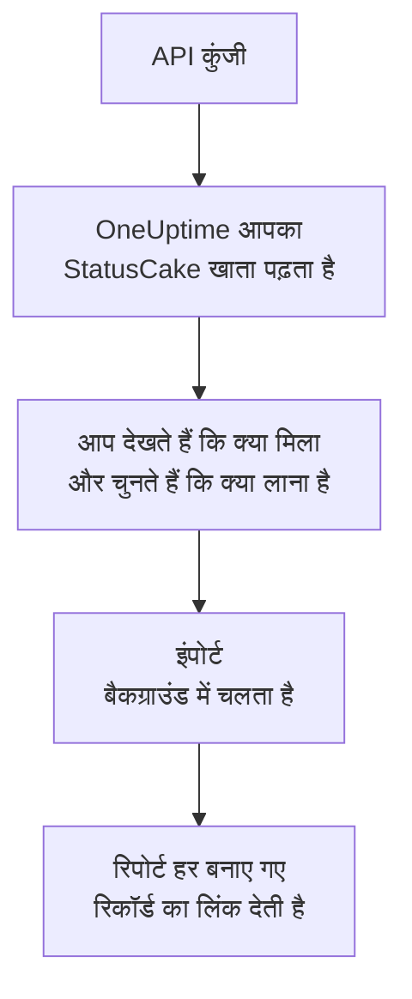

# StatusCake से आना

**किसी दूसरे टूल से इंपोर्ट करें** आपकी StatusCake जांचें कुछ ही मिनटों में OneUptime में ले आता है। StatusCake API कुंजी से OneUptime आपकी अपटाइम, SSL और हार्टबीट जांचें पढ़ता है, दिखाता है कि क्या मिला, और जो आप चुनते हैं उसे बनाता है। StatusCake में कुछ नहीं बदलता।

:::cards
- [अपना खाता इंपोर्ट करें](#अपना-statuscake-खाता-इंपोर्ट-करें): कुंजी बनाएं, अपना खाता पढ़ें और चुनें कि क्या लाना है।
- [क्या लाया जाता है](#क्या-लाया-जाता-है): हर StatusCake जांच OneUptime का कौन-सा मॉनिटर बनती है।
- [बदलाव पूरा करें](#बदलाव-पूरा-करें): इंपोर्ट पूरा होने के बाद क्या करना है।
:::

## यह कैसे काम करता है

- **कुंजी एक बार इस्तेमाल होती है।** जब तक OneUptime आपका खाता पढ़ता है, कुंजी एन्क्रिप्ट करके रखी जाती है, और पढ़ना खत्म होते ही हटा दी जाती है, चाहे वह सफल रहा हो या नहीं। इसे फिर कभी नहीं दिखाया जाता और न ही किसी लॉग में लिखा जाता है।
- **OneUptime सिर्फ़ पढ़ता है।** यह सिर्फ़ StatusCake के अपने API को कॉल करता है: `api.statuscake.com`। यह हर सेकंड एक अनुरोध भेजता है, जो StatusCake की Free खाते के लिए प्रति मिनट 60 अनुरोधों की सीमा के भीतर है। जब StatusCake धीमा होने को कहता है, तो यह रुककर फिर से कोशिश करता है।
- **जब तक आप इंपोर्ट शुरू नहीं करते, कुछ नहीं बनता।** पूर्वावलोकन हर आइटम के लिए दिखाता है कि वह नया है, पहले से OneUptime में है (और जैसा है वैसा इस्तेमाल होता है), किसी पिछले इंपोर्ट ने उसे लाया था, या वह क्यों नहीं लाया जा सकता।
- **फिर से चलाने पर कभी कुछ दोबारा नहीं बनता।** OneUptime याद रखता है कि हर इंपोर्ट ने StatusCake ID के अनुसार क्या लाया। StatusCake में जांचें जोड़ने के बाद इसे फिर से चलाएं, और सिर्फ़ नए ही बनेंगे।

## शुरू करने से पहले

- **एक OneUptime प्रोजेक्ट, और जो आप लाते हैं उसे बनाने का अधिकार।** प्रोजेक्ट के मालिक और एडमिन सब कुछ ला सकते हैं। दूसरी भूमिकाएं भी इंपोर्ट चला सकती हैं और उन प्रकार के रिकॉर्ड ला सकती हैं जिन्हें वे बना सकती हैं। बाकी सब कारण के साथ नहीं लाया गया के रूप में दिखता है।
- **एक StatusCake API कुंजी।** इंपोर्ट कभी StatusCake में कुछ नहीं लिखता।
- **भुगतान का तरीका, OneUptime Cloud पर।** जांच करने वाले मॉनिटर का बिल इस्तेमाल के हिसाब से बनता है, Free प्लान पर भी, इसलिए इंपोर्ट से पहले **प्रोजेक्ट सेटिंग्स** > **बिलिंग** में भुगतान का तरीका जोड़ें। इसके बिना वे मॉनिटर नहीं लाए गए के रूप में दिखते हैं।

## अपना StatusCake खाता इंपोर्ट करें

:::steps
### StatusCake में API कुंजी बनाएं
StatusCake में अपना खाता पैनल खोलें और **API Keys** पर जाएं। `OneUptime import` नाम की एक कुंजी बनाएं और उसे कॉपी करें।

### इंपोर्ट पेज खोलें
OneUptime में **प्रोजेक्ट सेटिंग्स** > **किसी दूसरे टूल से इंपोर्ट करें** पर जाएं और **StatusCake** चुनें।

### StatusCake कनेक्ट करें
कुंजी को **StatusCake API कुंजी** में पेस्ट करें और **मेरा StatusCake खाता पढ़ें** चुनें। बड़ा खाता पढ़ने में कुछ मिनट लगते हैं, और पढ़ने के दौरान आप पेज छोड़ सकते हैं।

### चुनें कि क्या लाना है
पूर्वावलोकन हर प्रकार के लिए एक सेक्शन में दिखाता है कि क्या मिला। जो कुछ भी बनाया जाएगा वह शुरू से चुना हुआ होता है, सिवाय उन जांचों के जो StatusCake में रुकी हुई हैं; उन्हें चुनने पर वे रुकी हुई स्थिति में लाई जाती हैं। हर आइटम के नीचे OneUptime बताता है कि क्या ठीक वैसा नहीं आएगा जैसा था।

### इंपोर्ट शुरू करें
**इंपोर्ट शुरू करें** चुनें। इंपोर्ट बैकग्राउंड में चलता है: आप पेज छोड़ सकते हैं, और रिपोर्ट वहीं आपका इंतज़ार करेगी।
:::

रिपोर्ट गिनती है कि क्या बनाया गया और क्या नहीं लाया गया, और हर आइटम को उस रिकॉर्ड के लिंक के साथ दिखाती है जो वह बना, विफल आइटम सबसे पहले। पिछले इंपोर्ट उसी पेज पर **पिछले इंपोर्ट** के नीचे दिखते हैं।

## क्या लाया जाता है

| StatusCake में | OneUptime में | कैसे |
| --- | --- | --- |
| Uptime, SSL and heartbeat checks | मॉनिटर | हर जांच उसी प्रकार का मॉनिटर बनती है, उसी पते, अंतराल, टाइमआउट और उस टेक्स्ट के साथ जो पेज में होना या नहीं होना चाहिए। |

- **HTTP और HEAD जांचें** वेबसाइट मॉनिटर बनती हैं, या API मॉनिटर जब वे डेटा या हेडर भेजती हैं। StatusCake उन स्टेटस कोड की सूची देता है जिन पर अलर्ट आता है: बाकी हर कोड OneUptime में भी चालू माना जाता है।
- **पिंग और TCP जांचें** पिंग और पोर्ट मॉनिटर बनती हैं। **SMTP और SSH जांचें** अपने पोर्ट के पोर्ट मॉनिटर बनती हैं: OneUptime जांचता है कि पोर्ट जवाब देता है, उस पर होने वाली बातचीत नहीं।
- **DNS जांचें** उसी सर्वर से पूछने वाले DNS मॉनिटर बनती हैं।
- **SSL जांचें** SSL प्रमाणपत्र मॉनिटर बनती हैं, जो पहले अलर्ट जितना पहले चेतावनी देते हैं। SSL अलर्ट वाली अपटाइम जांच को भी एक मिलता है।
- **हार्टबीट जांचें** आने वाले अनुरोध मॉनिटर बनती हैं, जो अवधि में कोई अनुरोध न आने पर बंद मानी जाती हैं। OneUptime में हर एक का नया पता होता है।

हर मॉनिटर आपके प्रोजेक्ट के प्रोब से जांचा जाता है, ठीक वैसे ही जैसे आपका खुद बनाया मॉनिटर। जो अंतराल OneUptime में नहीं है, वह सबसे नज़दीकी उपलब्ध अंतराल बन जाता है, और एक मिनट से ज़्यादा का टाइमआउट एक मिनट बन जाता है। इनमें से कुछ भी बदलने पर पूर्वावलोकन बताता है।

## क्या नहीं लाया जाता

- **उपलब्धता का इतिहास, रिस्पॉन्स टाइम और घटनाएं।** OneUptime इंपोर्ट पूरा होने के बाद से जांच शुरू करता है।
- **अलर्ट संपर्क और इंटीग्रेशन।** [बदलाव पूरा करें](#बदलाव-पूरा-करें) में बताए अनुसार OneUptime में तय करें कि किसे बताया जाए।
- **पासवर्ड, और ऐसे हेडर जिनमें कोई सीक्रेट हो सकता है।** जो मॉनिटर साइन इन करता है, या `Authorization`, कुकी या टोकन हेडर भेजता है, वह उसके बिना लाया जाता है: उसे [मॉनिटर सीक्रेट](/docs/monitor/monitor-secrets) के साथ जोड़ें।
- **DNS जांच के अपेक्षित पते।** इन्हें OneUptime में मानदंड के रूप में जोड़ें।
- **पेज स्पीड, डोमेन और सर्वर जांचें।** OneUptime का अपना [डोमेन मॉनिटर](/docs/monitor/domain-monitor) और सर्वर मॉनिटरिंग है, जिन्हें आप इनकी जगह सेट करें।
- **रखरखाव विंडो।** पूर्वावलोकन इन्हें गिनता है: इन्हें OneUptime में अनुसूचित रखरखाव के रूप में शेड्यूल करें।

## सीमाएं

एक इंपोर्ट ज़्यादा से ज़्यादा 2,000 रिकॉर्ड बनाता है, और ज़्यादा से ज़्यादा 1,000 मॉनिटर। किसी सीमा से ऊपर का सब कुछ नहीं लाया गया के रूप में दिखता है। बाकी लाने के लिए इंपोर्ट फिर से चलाएं।

OneUptime Cloud पर, जांच करने वाले मॉनिटर को भुगतान के तरीके की ज़रूरत होती है, और जिसके लिए आपके प्लान में जगह नहीं है वह ज़रूरी चीज़ के साथ नहीं लाया गया के रूप में दिखता है।

पूर्वावलोकन एक दिन तक रखा जाता है। सिर्फ़ वही व्यक्ति आइटम चुन सकता है और इंपोर्ट शुरू कर सकता है जिसने खाता पढ़ा। प्रोजेक्ट के मालिक और एडमिन हर इंपोर्ट की प्रगति और रिपोर्ट देखते हैं।

## बदलाव पूरा करें

:::steps
### अपने मॉनिटर जांचें
**मॉनिटर** में हर मॉनिटर खोलें और उसके पहले नतीजे जांचें। हार्टबीट मॉनिटर का नया पता होता है: उसे पिंग करने वाले जॉब को उस पते पर भेजें।

### तय करें कि किसे बताया जाए
अपने मॉनिटर में मालिक जोड़ें, या उनकी खोली गई घटनाओं पर **ऑन-कॉल ड्यूटी** > **ऑन-कॉल नीतियां** से ऑन-कॉल नीति लगाएं, ताकि कुछ बंद होने पर सही लोगों को पता चले।

### StatusCake में जांचें बंद करें
जब OneUptime वही चीज़ें जांचने लगे, तो StatusCake में इन जांचों को रोक दें ताकि किसी को दो बार न बताया जाए।
:::

## समस्या निवारण

:::details StatusCake ने API कुंजी स्वीकार नहीं की
जांचें कि आपने **API Keys** से पूरी कुंजी कॉपी की है, और वह हटाई नहीं गई है। फिर **फिर से प्रयास करें** चुनें।
:::

:::details कोई मॉनिटर नहीं लाया गया के रूप में दिखता है
उसके साथ कारण लिखा होता है: ऐसा मॉनिटर प्रकार जो OneUptime में नहीं है, ऐसा पता जिसे OneUptime पढ़ नहीं सकता, या ऐसा प्रोजेक्ट जिसमें उसके लिए जगह या भुगतान का तरीका नहीं है। अगर OneUptime पहले से उसी नाम, प्रकार और पते वाला मॉनिटर चलाता है, तो वही मॉनिटर जैसा है वैसा इस्तेमाल होता है।
:::

:::details कुछ आइटम नहीं चुने जा सकते
हर एक के साथ कारण लिखा होता है: ऐसा नाम जो प्रोजेक्ट में पहले से है, कुछ ऐसा जो पिछले इंपोर्ट ने लाया, या ऐसा रिकॉर्ड जिसे बनाने की आपको अनुमति नहीं है या जो आपके प्लान में शामिल नहीं है।
:::

## अगले कदम

:::cards
- [वेबसाइट मॉनिटर](/docs/monitor/website-monitor): वेबसाइट मॉनिटर क्या और कैसे जांचता है।
- [SSL प्रमाणपत्र मॉनिटर](/docs/monitor/ssl-certificate-monitor): OneUptime प्रमाणपत्र की समाप्ति से पहले कैसे चेतावनी देता है।
- [Uptime Kuma से आना](/docs/moving-to-oneuptime/uptime-kuma): Uptime Kuma से अपनी जांचें ले आएं।
:::
