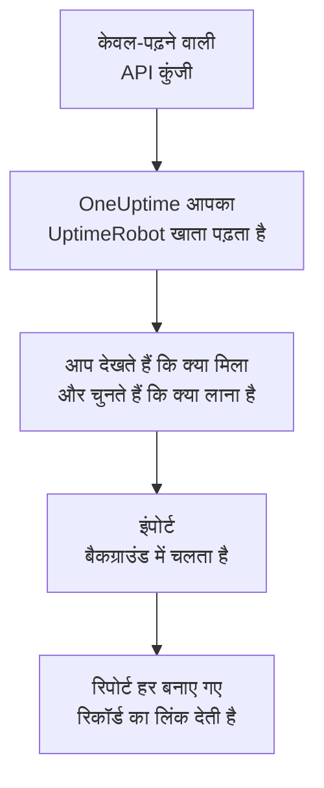

# UptimeRobot से आना

**किसी दूसरे टूल से इंपोर्ट करें** आपके UptimeRobot मॉनिटर और स्थिति पृष्ठ कुछ ही मिनटों में OneUptime में ले आता है। केवल-पढ़ने वाली UptimeRobot API कुंजी से OneUptime आपके मॉनिटर और सार्वजनिक स्थिति पृष्ठ पढ़ता है, दिखाता है कि क्या मिला, और जो आप चुनते हैं उसे बनाता है। UptimeRobot में कुछ नहीं बदलता।

:::cards
- [अपना खाता इंपोर्ट करें](#अपना-uptimerobot-खाता-इंपोर्ट-करें): कुंजी बनाएं, अपना खाता पढ़ें और चुनें कि क्या लाना है।
- [क्या लाया जाता है](#क्या-लाया-जाता-है): हर UptimeRobot मॉनिटर और स्थिति पृष्ठ OneUptime में क्या बनता है।
- [बदलाव पूरा करें](#बदलाव-पूरा-करें): इंपोर्ट पूरा होने के बाद क्या करना है।
:::

## यह कैसे काम करता है

- **कुंजी एक बार इस्तेमाल होती है।** जब तक OneUptime आपका खाता पढ़ता है, कुंजी एन्क्रिप्ट करके रखी जाती है, और पढ़ना खत्म होते ही हटा दी जाती है, चाहे वह सफल रहा हो या नहीं। इसे फिर कभी नहीं दिखाया जाता और न ही किसी लॉग में लिखा जाता है।
- **OneUptime सिर्फ़ पढ़ता है।** यह सिर्फ़ UptimeRobot के अपने API को कॉल करता है: `api.uptimerobot.com`। यह हर छह सेकंड में एक अनुरोध भेजता है, जो UptimeRobot की Free खाते के लिए प्रति मिनट दस अनुरोधों की सीमा के भीतर है, इसलिए बड़े खाते में कुछ मिनट लगते हैं। जब UptimeRobot धीमा होने को कहता है, तो यह रुककर फिर से कोशिश करता है।
- **जब तक आप इंपोर्ट शुरू नहीं करते, कुछ नहीं बनता।** पूर्वावलोकन हर आइटम के लिए दिखाता है कि वह नया है, पहले से OneUptime में है (और जैसा है वैसा इस्तेमाल होता है), किसी पिछले इंपोर्ट ने उसे लाया था, या वह क्यों नहीं लाया जा सकता।
- **फिर से चलाने पर कभी कुछ दोबारा नहीं बनता।** OneUptime याद रखता है कि हर इंपोर्ट ने UptimeRobot ID के अनुसार क्या लाया। UptimeRobot में मॉनिटर जोड़ने के बाद इसे फिर से चलाएं, और सिर्फ़ नए ही बनेंगे।

## शुरू करने से पहले

- **एक OneUptime प्रोजेक्ट, और जो आप लाते हैं उसे बनाने का अधिकार।** प्रोजेक्ट के मालिक और एडमिन सब कुछ ला सकते हैं। दूसरी भूमिकाएं भी इंपोर्ट चला सकती हैं और उन प्रकार के रिकॉर्ड ला सकती हैं जिन्हें वे बना सकती हैं। बाकी सब कारण के साथ नहीं लाया गया के रूप में दिखता है।
- **एक UptimeRobot API कुंजी।** Read-only API key काफ़ी है: इंपोर्ट कभी UptimeRobot में कुछ नहीं लिखता। Main API key भी काम करती है, लेकिन किसी एक मॉनिटर की कुंजी सिर्फ़ उसी मॉनिटर को पढ़ती है।
- **भुगतान का तरीका, OneUptime Cloud पर।** जांच करने वाले मॉनिटर का बिल इस्तेमाल के हिसाब से बनता है, Free प्लान पर भी, इसलिए इंपोर्ट से पहले **प्रोजेक्ट सेटिंग्स** > **बिलिंग** में भुगतान का तरीका जोड़ें। इसके बिना वे मॉनिटर नहीं लाए गए के रूप में दिखते हैं।

## अपना UptimeRobot खाता इंपोर्ट करें

:::steps
### UptimeRobot में API कुंजी बनाएं
UptimeRobot में **Integrations & API** > **API** पर जाएं। **Read-only API key** बनाएं, या अपनी मौजूदा कुंजी कॉपी करें।

### इंपोर्ट पेज खोलें
OneUptime में **प्रोजेक्ट सेटिंग्स** > **किसी दूसरे टूल से इंपोर्ट करें** पर जाएं और **UptimeRobot** चुनें।

### UptimeRobot कनेक्ट करें
कुंजी को **UptimeRobot API कुंजी** में पेस्ट करें और **मेरा UptimeRobot खाता पढ़ें** चुनें। बड़ा खाता पढ़ने में कुछ मिनट लगते हैं, और पढ़ने के दौरान आप पेज छोड़ सकते हैं।

### चुनें कि क्या लाना है
पूर्वावलोकन हर प्रकार के लिए एक सेक्शन में दिखाता है कि क्या मिला। जो कुछ भी बनाया जाएगा वह शुरू से चुना हुआ होता है, सिवाय उन मॉनिटर के जो UptimeRobot में रुके हुए हैं; उन्हें चुनने पर वे रुकी हुई स्थिति में लाए जाते हैं। हर आइटम के नीचे OneUptime बताता है कि क्या ठीक वैसा नहीं आएगा जैसा था। जब कोई चुना गया स्थिति पृष्ठ ऐसा मॉनिटर दिखाता है जिसे आपने नहीं चुना, तो वह बताता है, और **इन्हें भी चुनें** उसे चुन देता है।

### इंपोर्ट शुरू करें
**इंपोर्ट शुरू करें** चुनें। इंपोर्ट बैकग्राउंड में चलता है: आप पेज छोड़ सकते हैं, और रिपोर्ट वहीं आपका इंतज़ार करेगी।
:::

रिपोर्ट गिनती है कि क्या बनाया गया और क्या नहीं लाया गया, और हर आइटम को उस रिकॉर्ड के लिंक के साथ दिखाती है जो वह बना, विफल आइटम सबसे पहले। पिछले इंपोर्ट उसी पेज पर **पिछले इंपोर्ट** के नीचे दिखते हैं।

## क्या लाया जाता है

| UptimeRobot में | OneUptime में | कैसे |
| --- | --- | --- |
| Monitors | मॉनिटर | हर मॉनिटर उसी प्रकार का मॉनिटर बनता है, उसी पते, अंतराल, टाइमआउट और उन्हीं स्टेटस कोड के साथ जिन्हें चालू माना जाता है। |
| Public status pages | स्थिति पृष्ठ | हर पृष्ठ वही मॉनिटर दिखाता है: जिनका वह नाम लेता है, जिन पर उसके टैग हैं, या सभी, उपलब्धता और इतिहास की पट्टियों के साथ जैसे वह दिखाता था। पासवर्ड वाला पृष्ठ निजी रूप में लाया जाता है। |

- **HTTP(S) और कीवर्ड मॉनिटर** वेबसाइट मॉनिटर बनते हैं, या API मॉनिटर जब वे कोई दूसरा मेथड, हेडर या JSON बॉडी भेजते हैं। कीवर्ड मॉनिटर UptimeRobot की तरह अपना कीवर्ड दिखने या न दिखने पर बंद माना जाता है, और कीवर्ड को बड़े अक्षरों सहित बिल्कुल वैसा ही मिलाता है।
- **पिंग और पोर्ट मॉनिटर** पिंग और पोर्ट मॉनिटर बनते हैं।
- **हार्टबीट मॉनिटर** आने वाले अनुरोध मॉनिटर बनते हैं, जो अंतराल और ग्रेस अवधि में कोई अनुरोध न आने पर बंद माने जाते हैं। OneUptime में हर एक का नया पता होता है।
- **DNS और API मॉनिटर** DNS और API मॉनिटर बनते हैं।
- **SSL समाप्ति रिमाइंडर।** जो मॉनिटर प्रमाणपत्र की समाप्ति से पहले चेतावनी देता है, उसे उसी के नाम पर एक SSL प्रमाणपत्र मॉनिटर भी मिलता है, जो उतने ही दिन पहले चेतावनी देता है।

हर मॉनिटर आपके प्रोजेक्ट के प्रोब से जांचा जाता है, ठीक वैसे ही जैसे आपका खुद बनाया मॉनिटर। जो अंतराल OneUptime में नहीं है, वह सबसे नज़दीकी उपलब्ध अंतराल बन जाता है, और एक मिनट से ज़्यादा का टाइमआउट एक मिनट बन जाता है। इनमें से कुछ भी बदलने पर पूर्वावलोकन बताता है।

## क्या नहीं लाया जाता

- **उपलब्धता का इतिहास, रिस्पॉन्स टाइम और घटनाएं।** OneUptime इंपोर्ट पूरा होने के बाद से जांच शुरू करता है।
- **अलर्ट संपर्क और इंटीग्रेशन।** [बदलाव पूरा करें](#बदलाव-पूरा-करें) में बताए अनुसार OneUptime में तय करें कि किसे बताया जाए।
- **पासवर्ड, और ऐसे हेडर जिनमें कोई सीक्रेट हो सकता है।** जो मॉनिटर साइन इन करता है, या `Authorization`, कुकी या टोकन हेडर भेजता है, वह उसके बिना लाया जाता है: उसे [मॉनिटर सीक्रेट](/docs/monitor/monitor-secrets) के साथ जोड़ें।
- **UDP, विज़ुअल तुलना और डिपेंडेंसी मॉनिटर।** OneUptime में ऐसा कोई मॉनिटर नहीं है जो यही काम करे, और पूर्वावलोकन हर एक का नाम बताता है।
- **पोर्ट खुला रहने पर अलर्ट देने वाले पोर्ट मॉनिटर।** ये OneUptime के पोर्ट मॉनिटर के उलटे काम करते हैं।
- **DNS मॉनिटर के अपेक्षित जवाब और API मॉनिटर की शर्तें।** इन्हें OneUptime में मानदंड के रूप में जोड़ें।
- **रखरखाव विंडो।** पूर्वावलोकन इन्हें गिनता है: इन्हें OneUptime में अनुसूचित रखरखाव के रूप में शेड्यूल करें।
- **स्थिति पृष्ठ का अपना डोमेन और ब्रांडिंग।** OneUptime में डोमेन को **कस्टम डोमेन** में और लोगो को **ब्रांडिंग** में जोड़ें।

## सीमाएं

एक इंपोर्ट ज़्यादा से ज़्यादा 2,000 रिकॉर्ड बनाता है: ज़्यादा से ज़्यादा 1,000 मॉनिटर और 50 स्थिति पृष्ठ। किसी सीमा से ऊपर का सब कुछ नहीं लाया गया के रूप में दिखता है। बाकी लाने के लिए इंपोर्ट फिर से चलाएं।

OneUptime Cloud पर, जांच करने वाले मॉनिटर को भुगतान के तरीके की ज़रूरत होती है, और जिसके लिए आपके प्लान में जगह नहीं है वह ज़रूरी चीज़ के साथ नहीं लाया गया के रूप में दिखता है।

पूर्वावलोकन एक दिन तक रखा जाता है। सिर्फ़ वही व्यक्ति आइटम चुन सकता है और इंपोर्ट शुरू कर सकता है जिसने खाता पढ़ा। प्रोजेक्ट के मालिक और एडमिन हर इंपोर्ट की प्रगति और रिपोर्ट देखते हैं।

## बदलाव पूरा करें

:::steps
### अपने मॉनिटर जांचें
**मॉनिटर** में हर मॉनिटर खोलें और उसके पहले नतीजे जांचें। हार्टबीट मॉनिटर का नया पता होता है: उसे पिंग करने वाले जॉब को उस पते पर भेजें।

### तय करें कि किसे बताया जाए
अपने मॉनिटर में मालिक जोड़ें, या उनकी खोली गई घटनाओं पर **ऑन-कॉल ड्यूटी** > **ऑन-कॉल नीतियां** से ऑन-कॉल नीति लगाएं, ताकि कुछ बंद होने पर सही लोगों को पता चले।

### अपने स्थिति पृष्ठ का पता OneUptime पर करें
**स्थिति पृष्ठ** में पृष्ठ खोलें, **कस्टम डोमेन** में अपना डोमेन जोड़ें, फिर उसका DNS रिकॉर्ड बदलें। इसके बाद आपके विज़िटर और सब्सक्राइबर नए पृष्ठ पर पहुंचेंगे।

### UptimeRobot में जांचें बंद करें
जब OneUptime वही चीज़ें जांचने लगे, तो UptimeRobot में इन जांचों को रोक दें ताकि किसी को दो बार न बताया जाए।
:::

## समस्या निवारण

:::details UptimeRobot ने API कुंजी स्वीकार नहीं की
जांचें कि आपने पूरी कुंजी कॉपी की है, और यह **Integrations & API** से खाते की Read-only या Main API key है, किसी एक मॉनिटर की कुंजी नहीं। फिर **फिर से प्रयास करें** चुनें।
:::

:::details कोई मॉनिटर नहीं लाया गया के रूप में दिखता है
उसके साथ कारण लिखा होता है: ऐसा मॉनिटर प्रकार जो OneUptime में नहीं है, ऐसा पता जिसे OneUptime पढ़ नहीं सकता, या ऐसा प्रोजेक्ट जिसमें उसके लिए जगह या भुगतान का तरीका नहीं है। अगर OneUptime पहले से उसी नाम, प्रकार और पते वाला मॉनिटर चलाता है, तो वही मॉनिटर जैसा है वैसा इस्तेमाल होता है।
:::

:::details कुछ आइटम नहीं चुने जा सकते
हर एक के साथ कारण लिखा होता है: ऐसा नाम जो प्रोजेक्ट में पहले से है, कुछ ऐसा जो पिछले इंपोर्ट ने लाया, या ऐसा रिकॉर्ड जिसे बनाने की आपको अनुमति नहीं है या जो आपके प्लान में शामिल नहीं है।
:::

## अगले कदम

:::cards
- [वेबसाइट मॉनिटर](/docs/monitor/website-monitor): वेबसाइट मॉनिटर क्या और कैसे जांचता है।
- [आने वाले अनुरोध मॉनिटर](/docs/monitor/incoming-request-monitor): OneUptime में हार्टबीट कैसे काम करता है।
- [Pingdom से आना](/docs/moving-to-oneuptime/pingdom): Pingdom से अपनी जांचें ले आएं।
:::
