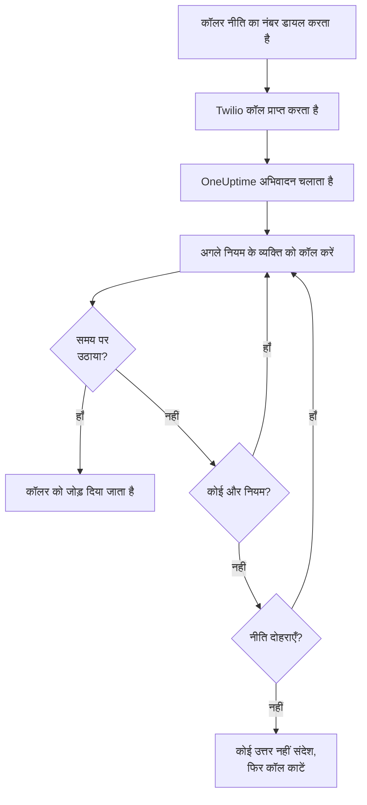
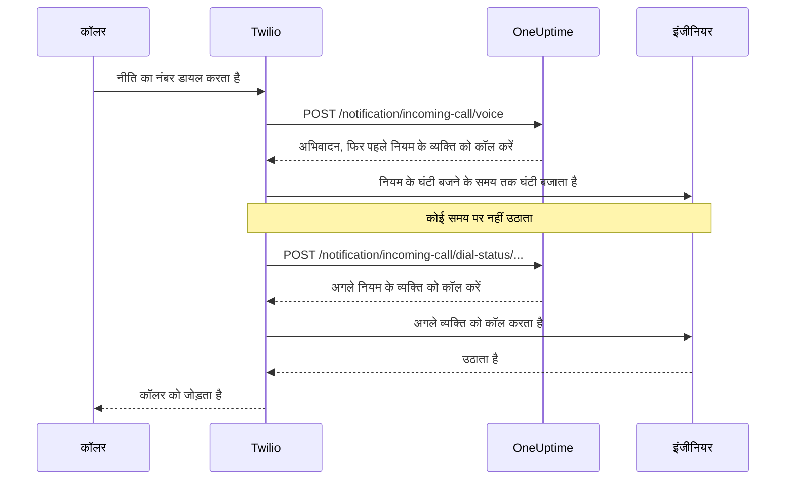

# आने वाली कॉल नीति

आने वाली कॉल नीति आपकी टीम को एक फ़ोन नंबर देती है जो ऑन-कॉल व्यक्ति तक पहुँचता है। जब कोई उस पर कॉल करता है, तो OneUptime नीति के एस्केलेशन नियमों के लोगों को एक के बाद एक तब तक कॉल करता है जब तक कोई उठा न ले, और फिर कॉल करने वाले को जोड़ देता है। नंबर और कॉल आपके अपने Twilio खाते पर चलते हैं।

:::cards
- [नीति सेट करें](#नीति-सेट-करें): अपने Twilio खाते से एक टेस्ट कॉल तक, सात चरणों में।
- [कॉल कैसे रूट होती है](#कॉल-कैसे-रूट-होती-है): किसे कॉल किया जाता है, कितनी देर, और कॉलर क्या सुनता है।
- [छूटी हुई कॉल](#छूटी-हुई-कॉल): किसे बताया जाता है, और वर्कफ़्लो में उन पर कैसे कार्रवाई करें।
- [समस्या निवारण](#समस्या-निवारण): ऐसी कॉल जो कभी नहीं पहुँचतीं, या कभी किसी इंजीनियर तक नहीं पहुँचतीं।
:::

## शुरू करने से पहले

| आपको चाहिए | क्यों |
| --- | --- |
| एक Twilio खाता, उसके Account SID और Auth Token के साथ | नीति के नंबर और कॉल उसी पर चलते हैं, और Twilio उन्हीं का बिल उसी खाते में लगाता है। |
| OneUptime Cloud पर **Growth** प्लान | प्रोजेक्ट को अपने Twilio कॉन्फ़िगरेशन के लिए इसकी ज़रूरत होती है। |
| अगर आप ख़ुद होस्ट करते हैं, तो ऐसा OneUptime सर्वर जिस तक Twilio पहुँच सके | Twilio हर कॉल `https://<your host>/notification/incoming-call/voice` पर भेजता है। |
| प्रोजेक्ट में **SMS** चालू | हर इंजीनियर का नंबर SMS से भेजे गए कोड से सत्यापित होता है। |
| हर इंजीनियर का सत्यापित नंबर | नियम केवल उन लोगों को कॉल करता है जिन्होंने प्रोजेक्ट में इनकमिंग कॉल के लिए नंबर जोड़ा और सत्यापित किया है। |

## नीति सेट करें

:::steps
### अपना Twilio खाता जोड़ें

**प्रोजेक्ट सेटिंग्स** > **सूचनाएं** > **सूचना सेटिंग्स** पर जाएँ। **Twilio कॉन्फ़िगरेशन** कार्ड में **Create Twilio Config** पर क्लिक करें और फ़ॉर्म भरें:

- **नाम** और **विवरण**: खाता किस काम के लिए है, जैसे "सपोर्ट हॉटलाइन"।
- **Twilio Account SID**: Twilio Console से। यह `AC` से शुरू होता है।
- **Twilio Auth Token**: Twilio Console से।
- **Twilio प्राथमिक फ़ोन नंबर**: उस खाते का एक नंबर, उसके भेजे SMS और कॉल के लिए।
- **Twilio द्वितीयक फ़ोन नंबर**: वैकल्पिक। ऐसे नंबर जो अपने देश के प्राप्तकर्ताओं को प्राथमिक नंबर की जगह भेजते हैं।
- **प्रोजेक्ट डिफ़ॉल्ट के रूप में सेट करें**: प्रोजेक्ट के पहले Twilio कॉन्फ़िगरेशन के लिए चालू, ताकि प्रोजेक्ट के सदस्यों को जाने वाले SMS और कॉल भी इसी खाते से जाएँ। अगर यह खाता केवल इनकमिंग कॉल के लिए है, तो इसे बंद करें।

### नीति बनाएँ

**ऑन-कॉल ड्यूटी** > **इनकमिंग कॉल नीतियां** पर जाएँ और **इनकमिंग कॉल नीति बनाएँ** पर क्लिक करें। इसे एक **नाम** दें, जैसे "सपोर्ट हॉटलाइन", और चाहें तो **विवरण** और **लेबल**। फिर इसे सूची से खोलें।

### Twilio खाता चुनें

नीति का **अवलोकन** तीन क्रमांकित चरणों वाला **सेटअप** कार्ड दिखाता है। पहले चरण में **चुनें** पर क्लिक करें, **Twilio कॉन्फ़िगरेशन** के नीचे खाता चुनें और **सहेजें** पर क्लिक करें।

### फ़ोन नंबर जोड़ें

दूसरे चरण में **Add Phone Number** पर क्लिक करें। आपके Twilio खाते में पहले से मौजूद नंबर लाने के लिए **Use Existing Phone Number** चुनें, या नया नंबर लेने के लिए **Reserve New Phone Number**। OneUptime नंबर को अपनी ओर मोड़ देता है, इसलिए Twilio में कुछ सेट नहीं करना पड़ता। देखें [फ़ोन नंबर](#फ़ोन-नंबर)।

### एस्केलेशन नियम जोड़ें

तीसरे चरण में **नियम प्रबंधित करें** पर क्लिक करें। जिस हर ऑन-कॉल शेड्यूल या व्यक्ति को कॉल करना है, उसके लिए एक नियम जोड़ें, उसी क्रम में जिसमें उन्हें कॉल करना है। देखें [एस्केलेशन नियम](#एस्केलेशन-नियम)।

### हर इंजीनियर का नंबर सत्यापित करें

जिसे भी कोई नियम कॉल कर सकता है, वह इनकमिंग कॉल के लिए अपना नंबर जोड़ता और सत्यापित करता है। देखें [इंजीनियरों के फ़ोन नंबर](#इंजीनियरों-के-फ़ोन-नंबर)।

### नंबर पर कॉल करें

जब तीनों चरण पूरे हो जाते हैं, तो कार्ड **Phone Numbers & Twilio Configuration** बन जाता है। किसी भी फ़ोन से नंबर पर कॉल करें, फिर नीति के **कॉल लॉग** खोलकर देखें कि किसे कॉल किया गया।
:::

## कॉल कैसे रूट होती है

1. Twilio कॉल OneUptime को भेजता है, जो नीति का **अभिवादन संदेश** पढ़ता है।
2. OneUptime उस व्यक्ति को कॉल करता है जिसका नाम पहला एस्केलेशन नियम लेता है: वह व्यक्ति, या उस समय नियम के ऑन-कॉल शेड्यूल में जो ऑन-कॉल हो, यूज़र ओवरराइड समेत। उसके फ़ोन पर कॉलर के रूप में नीति का नंबर दिखता है।
3. अगर वह नियम के **घंटी बजने का समय** के अंदर उठा लेता है, तो कॉलर को जोड़ दिया जाता है, और कॉल लॉग दर्ज करता है कि किसने उठाया।
4. अगर नहीं, तो कॉलर "Connecting you to the next available engineer." सुनता है, और अगले नियम के व्यक्ति को कॉल किया जाता है।
5. आख़िरी नियम के बाद, अगर **यदि कोई उत्तर नहीं देता तो नीति दोहराएं** चालू है, तो नीति पहले नियम से फिर शुरू होती है, उतनी बार जितना **नीति दोहराव बार** कहता है। वरना कॉलर **कोई उत्तर नहीं संदेश** सुनता है, और कॉल ख़त्म हो जाती है।

कोई नियम किसी को कॉल किए बिना छोड़ दिया जाता है जब अभी उसके लिए कॉल करने लायक कोई नहीं है: उसके शेड्यूल में कोई ऑन-कॉल नहीं है, व्यक्ति के पास इस प्रोजेक्ट में इनकमिंग कॉल के लिए कोई सत्यापित नंबर नहीं है, या वह अब प्रोजेक्ट का सदस्य नहीं है। जब किसी नियम में कॉल करने लायक कोई नहीं होता, तो कॉलर **कोई उपलब्ध नहीं संदेश** सुनता है। अक्षम नीति हर कॉल का जवाब "Sorry, this service is currently disabled." से देती है और कॉल काट देती है।

OneUptime हर अनुरोध पर Twilio का हस्ताक्षर Twilio कॉन्फ़िगरेशन के Auth Token से जाँचता है, और जिस अनुरोध को सत्यापित नहीं कर पाता उसे अस्वीकार कर देता है।

> [!TIP]
> नीति का नंबर अपने फ़ोन में संपर्क के रूप में सहेजें, जैसे "सपोर्ट हॉटलाइन", ताकि रूट की गई कॉल आने पर आप उसे पहचान लें।

## एस्केलेशन नियम

एस्केलेशन नियम तय करते हैं कि जब कोई नीति के नंबर पर कॉल करता है तो सूची में ऊपर से नीचे किसे कॉल किया जाए। नीति खोलें, उसके साइड मेन्यू में **एस्केलेशन नियम** चुनें और **एस्केलेशन नियम जोड़ें** पर क्लिक करें। एक नियम एक छोटा-सा चरण है:

- **किसे कॉल करें**: एक ऑन-कॉल शेड्यूल या एक व्यक्ति। शेड्यूल उस व्यक्ति को कॉल करता है जो कॉल आने के समय उसमें ऑन-कॉल हो। लोग आपके प्रोजेक्ट के सदस्य हैं।
- **घंटी बजने का समय (सेकंड में)**: कॉल अगले नियम पर जाने से पहले उनका फ़ोन कितनी देर बजता है। यह 20 सेकंड से शुरू होता है, और Twilio 5 से 600 तक स्वीकार करता है।
- **नाम** और **विवरण** वैकल्पिक हैं, **और फ़ील्ड** के नीचे। बिना नाम वाला नियम सूची में अपनी जगह के हिसाब से दिखता है: **Level 1**, **Level 2**।

नियम सूची में ऊपर से नीचे बुलाए जाते हैं, और नया नियम अंत में जुड़ता है। क्रम बदलने के लिए नियम को उसके ऊपर बाईं ओर के हैंडल से खींचें। कीबोर्ड से हैंडल पर फ़ोकस करें, Space दबाएँ, तीर कुंजियों से उसे हिलाएँ और फिर से Space दबाएँ।

> [!WARNING]
> **वॉइसमेल का ध्यान रखें**: **घंटी बजने का समय** उस समय से कम रखें जितने में व्यक्ति का फ़ोन बिना उठाई कॉल को वॉइसमेल पर भेज देता है। अगर वॉइसमेल पहले उठा लेता है, तो कॉलर उससे जुड़ जाता है और कॉल अगले नियम पर नहीं जाती। Twilio हर घंटी में अपने कुछ सेकंड जोड़ता है। इसी वजह से नया नियम 20 सेकंड से शुरू होता है। जब डिफ़ॉल्ट 30 सेकंड था तब जोड़े गए नियम अपने 30 सेकंड रखते हैं: अगर उनकी कॉल वॉइसमेल पर ख़त्म होती हैं, तो उन नियमों पर **घंटी बजने का समय** कम करें।

उदाहरण के लिए, तीन नियम जो दो रोटेशन आज़माते हैं और फिर एक लीड को:

| स्तर | किसे कॉल करें | घंटी बजने का समय |
| --- | --- | --- |
| Level 1 | प्राथमिक ऑन-कॉल शेड्यूल | 20 सेकंड |
| Level 2 | द्वितीयक ऑन-कॉल शेड्यूल | 20 सेकंड |
| Level 3 | इंजीनियरिंग लीड (एक व्यक्ति) | 20 सेकंड |

## फ़ोन नंबर

एक नीति के कई नंबर हो सकते हैं, और हर नंबर वही नियम बजाता है। हर नंबर एक ही नीति का होता है। इन्हें नीति के **अवलोकन** पर **Add Phone Number** से जोड़ें:

:::tabs
@tab पहले से मौजूद नंबर इस्तेमाल करें
1. **Add Phone Number** पर, फिर **Use Existing Phone Number** पर क्लिक करें। OneUptime नीति के Twilio खाते के नंबरों की सूची दिखाता है।
2. नंबर के पास **चुनें** पर, फिर **नंबर असाइन करें** पर क्लिक करें।

जो नंबर पहले से अपनी कॉल कहीं और भेजता है, वह "Currently has a webhook configured" दिखाता है। उसे असाइन करने पर उसकी कॉल OneUptime पर आने लगती हैं।
@tab नया नंबर आरक्षित करें
1. **Add Phone Number** पर, फिर **Reserve New Phone Number** और **नंबरों की खोज करें** पर क्लिक करें।
2. एक **देश** चुनें। चाहें तो **एरिया कोड (वैकल्पिक)** भरें, जैसे 415, या **शामिल है (वैकल्पिक)** में वे अंक भरें जो नंबर में होने चाहिए। **खोजें** पर क्लिक करें: अधिकतम 10 स्थानीय नंबर दिखाए जाते हैं।
3. किसी नंबर के पास **आरक्षित करें** पर क्लिक करें, और **आरक्षित करें** से पुष्टि करें। Twilio नंबर का शुल्क आपके Twilio खाते से लेता है।
:::

OneUptime नंबर का वॉइस वेबहुक `https://<your host>/notification/incoming-call/voice` पर सेट करता है, जो सेल्फ़-होस्टेड इंस्टॉलेशन पर `HOST` और `HTTP_PROTOCOL` से बनता है। किसी नीति को दूसरे Twilio खाते पर ले जाने के लिए पहले उसके नंबर रिलीज़ करें: खाता केवल तभी बदल सकता है जब नीति के पास कोई नंबर न हो।

किसी नंबर को रिलीज़ करने के लिए उसके पास **रिलीज़** पर क्लिक करें और **नंबर रिलीज़ करें** से पुष्टि करें।

> [!CAUTION]
> नंबर रिलीज़ करने से वह Twilio को वापस चला जाता है, चाहे वह **Use Existing Phone Number** से लाया गया नंबर ही क्यों न हो, और हो सकता है कि आपको वह फिर न मिले। किसी नीति को, या उसके इस्तेमाल किए Twilio कॉन्फ़िगरेशन को हटाने से भी उसके नंबर रिलीज़ हो जाते हैं।

## इंजीनियरों के फ़ोन नंबर

नियम किसी व्यक्ति को उस नंबर पर कॉल करता है जिसे उसने इस प्रोजेक्ट में इनकमिंग कॉल के लिए सत्यापित किया है, और जिसके पास कोई नंबर नहीं है उसे छोड़ देता है। हर व्यक्ति अपना नंबर ख़ुद जोड़ता है:

:::steps
1. **उपयोगकर्ता सेटिंग्स** > **इनकमिंग कॉल नीति** > **इनकमिंग फ़ोन नंबर** खोलें। **इनकमिंग कॉल नीति** साइड मेन्यू का एक सेक्शन है जो शुरू में सिमटा रहता है।
2. **फोन नंबर इनकमिंग कॉल रूटिंग के लिए** कार्ड में **फोन नंबर इनकमिंग कॉल रूटिंग के लिए जोड़ें** पर क्लिक करें और देश कोड के साथ नंबर दर्ज करें, जैसे `+15551234567`।
3. OneUptime जो 6 अंकों का कोड उस नंबर पर SMS से भेजता है, उसे **सत्यापन कोड** के नीचे दर्ज करें, और **सत्यापित करें** पर क्लिक करें। **Send a new code** दूसरा कोड भेजता है।
:::

हर व्यक्ति के पास हर प्रोजेक्ट में एक सत्यापित नंबर हो सकता है। इसे बदलने के लिए पहले पुराना नंबर हटाएँ। ये नंबर **सूचना विधियां** के नीचे के फ़ोन नंबरों से अलग हैं, जिनका इस्तेमाल ऑन-कॉल पेज करते हैं।

इनकमिंग कॉल नंबर SMS से सत्यापित होते हैं, इसलिए पहले प्रोजेक्ट के लिए **SMS** चालू होना चाहिए। प्रोजेक्ट का मालिक, **Billing Admin** या **Manage Billing** वाला व्यक्ति इसे **प्रोजेक्ट सेटिंग्स > सूचनाएं > सूचना सेटिंग्स** पर **सूचना चैनल** कार्ड में चालू करता है।

## वॉइस संदेश और नीति सेटिंग्स

नीति खोलें और उसके साइड मेन्यू में **उन्नत** के नीचे **सेटिंग्स** चुनें। **वॉइस संदेश** कार्ड पर **Edit Messages** बदलता है कि कॉलर क्या सुनते हैं; **नीति सेटिंग्स** कार्ड पर **Edit Policy Settings** बाकी चीज़ें बदलता है।

| सेटिंग | यह क्या करती है | नई नीति के लिए |
| --- | --- | --- |
| **अभिवादन संदेश** | कॉल उठाए जाने पर, पहले व्यक्ति को कॉल करने से पहले पढ़ा जाता है। | "Please wait while we connect you to the on-call engineer." |
| **कोई उत्तर नहीं संदेश** | जब हर नियम आज़माया गया और किसी ने नहीं उठाया, तब पढ़ा जाता है। | "No one is available. Please try again later." |
| **कोई उपलब्ध नहीं संदेश** | जब किसी नियम में कॉल करने लायक कोई नहीं होता, तब पढ़ा जाता है। | "We are sorry, but no on-call engineer is currently available. Please try again later or contact support." |
| **सक्षम** | अक्षम नीति हर कॉल लौटा देती है। | चालू |
| **यदि कोई उत्तर नहीं देता तो नीति दोहराएं** | आख़िरी नियम के बाद, पहले से फिर शुरू करती है। | बंद |
| **नीति दोहराव बार** | कितनी बार फिर से शुरू करना है। | 1 |

Twilio संदेशों को टेक्स्ट-टू-स्पीच आवाज़ में पढ़ता है, इसलिए उन्हें वैसे लिखें जैसे आप चाहते हैं कि वे सुनाई दें।

## कॉल लॉग

हर कॉल नीति के **कॉल लॉग** पेज पर, उसके साइड मेन्यू में **लॉग** के नीचे दिखती है: **कॉलर**, **Number Called**, उसकी **स्थिति**, किसने उठाई (**द्वारा उत्तर दिया गया**), **अवधि**, और वह कब शुरू हुई (**शुरू हुआ**)। किसी कॉल पर **View Timeline** पर क्लिक करके उसकी **कॉल टाइमलाइन** देखें: हर व्यक्ति जिसे कॉल किया गया, किस नंबर पर, और हर कोशिश कैसे ख़त्म हुई।

| स्थिति | क्या हुआ |
| --- | --- |
| **Initiated**, **Ringing**, **Escalated** | कॉल अभी जारी है: वह आई, कोई फ़ोन बज रहा है, या वह किसी बाद के नियम पर चली गई। |
| **पूर्ण** | किसी ने उठाया, और कॉलर को जोड़ दिया गया। |
| **कोई उत्तर नहीं** | हर एस्केलेशन नियम आज़माया गया और किसी ने नहीं उठाया। कॉलर ने आपका **कोई उत्तर नहीं संदेश** सुना। |
| **Caller Hung Up** | किसी इंजीनियर का फ़ोन बजते समय कॉलर ने कॉल काट दी। |
| **विफल** | किसी को कॉल नहीं किया जा सका: किसी एस्केलेशन नियम में सत्यापित इनकमिंग कॉल नंबर वाला कोई ऑन-कॉल उपयोगकर्ता नहीं था (कॉलर ने आपका **कोई उपलब्ध नहीं संदेश** सुना), या नीति अक्षम है। |

## छूटी हुई कॉल

कॉल तब छूटी हुई होती है जब वह किसी तक पहुँचे बिना ख़त्म हो जाती है: उसकी स्थिति **कोई उत्तर नहीं**, **Caller Hung Up** या **विफल** होती है।

### किसे सूचित किया जाता है

जब कोई कॉल छूट जाती है, तो OneUptime नीति के मालिकों को सूचित करता है: नीति के **मालिक** पेज पर जोड़े गए उपयोगकर्ता और टीमों के सदस्य। अगर नीति का कोई मालिक नहीं है, तो इसके बजाय प्रोजेक्ट के मालिकों को सूचित किया जाता है।

सूचना बताती है कि किसने कॉल किया, किस नंबर पर डायल किया, किसी ने क्यों नहीं उठाया, और किसे कॉल किया गया और हर कोशिश कैसे ख़त्म हुई। इसमें कॉल लॉग में उस कॉल का लिंक होता है।

मालिकों को डिफ़ॉल्ट रूप से ईमेल भेजा जाता है। हर व्यक्ति **उपयोगकर्ता सेटिंग्स** > **सूचना सेटिंग्स** में, **ऑन-कॉल** > **इनकमिंग कॉल नीतियां** > **छूटी हुई कॉल** के नीचे दूसरे चैनल (SMS, कॉल, पुश और अन्य) चुन सकता है या इसे बंद कर सकता है।

### वर्कफ़्लो में छूटी हुई कॉल पर कार्रवाई करें

इनकमिंग कॉल लॉग वर्कफ़्लो ट्रिगर के रूप में उपलब्ध हैं:

- **On Create Incoming Call Log** तब चलता है जब कोई कॉल आती है।
- **On Update Incoming Call Log** कॉल के आगे बढ़ने के साथ चलता है। जो अपडेट **Ended At** सेट करता है, वही कॉल का अंत है।

केवल छूटी हुई कॉल पर कार्रवाई करने के लिए, जैसे उन्हें Slack या Microsoft Teams में पोस्ट करने या टिकट खोलने के लिए:

:::steps
1. **On Update Incoming Call Log** ट्रिगर जोड़ें। **Listen on** को **Ended At** पर सेट करें, और जिन फ़ील्ड का आप इस्तेमाल करना चाहते हैं उन्हें चुनें, जैसे **Status**, **Caller Phone Number** और **Routing Phone Number**।
2. एक **If / Else** चरण जोड़ें। ट्रिगर की **Status** को तुलना **is not equal to** और `Completed` के साथ जाँचें।
3. अपने चरणों को **Yes** पोर्ट से जोड़ें।
:::

वर्कफ़्लो **Find One** और **Find Many** से कॉल लॉग पढ़ सकता है, लेकिन उन्हें बना या बदल नहीं सकता।

## फ़ोन नंबर कौन जोड़ और रिलीज़ कर सकता है

किसी नीति के फ़ोन नंबर उन्हीं भूमिकाओं का पालन करते हैं जिनका नीति ख़ुद करती है:

- **नंबर खोजना** - आरक्षित करने के लिए Twilio में नंबर खोजना, या आपके Twilio खाते में पहले से मौजूद नंबरों की सूची देखना - इसके लिए इनकमिंग कॉल नीतियाँ पढ़ने की और कॉल व SMS कॉन्फ़िगरेशन पढ़ने की अनुमति चाहिए, क्योंकि यह उनमें से एक के ज़रिए आपका Twilio खाता पढ़ता है। **Project Owner**, **Project Admin**, **Project Member**, **Viewer**, **Settings Admin**, **Settings Member** और **Settings Viewer** के पास दोनों हैं। किसी कस्टम भूमिका में ये **Read Incoming Call Policy** और **Read Call and SMS** हैं।
- **नंबर आरक्षित करना, मौजूदा नंबर इस्तेमाल करना और नंबर रिलीज़ करना** के लिए इनकमिंग कॉल नीतियाँ संपादित करने की अनुमति चाहिए: **Project Owner**, **Project Admin**, **Project Member**, **Settings Admin** और **Settings Member**, या किसी कस्टम भूमिका में **Edit Incoming Call Policy**। ये उस नीति के नंबर बदलते हैं जिसे आप संपादित कर सकते हैं: कुछ लेबल तक सीमित भूमिका के साथ, वे नीतियाँ जिन पर वे लेबल हैं।

इनमें से किसी अनुमति पर बिना लेबल वाली टीम की रोक उसे छीन लेती है। बाकी किसी के लिए, **Add Phone Number** और **रिलीज़** पेज पर बने रहते हैं, लॉक, और उनका टूलटिप बताता है कि उनके लिए क्या चाहिए। API उनका अनुरोध ऐसे वाक्य के साथ अस्वीकार करता है जो बताता है कि क्या चाहिए: "Looking up phone numbers needs permission to read incoming call policies and call and SMS settings." या "Adding or releasing a phone number needs permission to edit incoming call policies." नंबर आरक्षित करने का शुल्क आपके अपने Twilio खाते से लिया जाता है, आपके OneUptime बैलेंस से नहीं, इसलिए इसके लिए किसी बिलिंग अनुमति की ज़रूरत नहीं है।

## API या Terraform से नीतियाँ बनाना

| रिसोर्स | API रूट |
| --- | --- |
| इनकमिंग कॉल नीतियाँ | `/api/incoming-call-policy` |
| उनके एस्केलेशन नियम | `/api/incoming-call-policy-escalation-rule` |
| उनके फ़ोन नंबर, केवल पढ़ने के लिए | `/api/incoming-call-policy-phone-number` |
| कॉल लॉग, केवल पढ़ने के लिए | `/api/incoming-call-log` |

API से बिना `escalateAfterSeconds` के बनाया गया नियम 20 सेकंड तक बजता है, और Terraform द्वारा बिना `escalate_after_seconds` के बनाया गया नियम भी।

### एस्केलेशन नियम की सेटिंग्स

| सेटिंग | API फ़ील्ड | इसमें क्या रहता है |
| --- | --- | --- |
| किसे कॉल करें | `onCallDutyPolicyScheduleId` या `userId` | इनमें से एक, दोनों कभी नहीं: वह शेड्यूल जिसके ऑन-कॉल व्यक्ति को कॉल किया जाता है, या वह व्यक्ति। |
| घंटी बजने का समय (सेकंड में) | `escalateAfterSeconds` | कॉल आगे बढ़ने से पहले फ़ोन कितनी देर बजता है (डिफ़ॉल्ट: 20; 5 से 600 तक)। |
| नाम और विवरण | `name`, `description` | वैकल्पिक। बिना नाम वाला नियम सूची में अपनी जगह के हिसाब से Level 1, Level 2 आदि के रूप में दिखता है। |
| क्रम | `order` | नियम सूची में कहाँ है: नियम ऊपर से नीचे बुलाए जाते हैं। बिना क्रम वाला नया नियम अंत में जाता है। |

## समस्या निवारण

:::details कॉल OneUptime तक नहीं पहुँचतीं
- Twilio Console में नंबर खोलें: **A call comes in** को HTTP POST के साथ वेबहुक `https://<your host>/notification/incoming-call/voice` होना चाहिए। नंबर जोड़े जाने पर OneUptime इसे `HOST` और `HTTP_PROTOCOL` से सेट करता है। अगर तब से ये बदल गए हैं, तो Twilio में वेबहुक ठीक करें।
- सेल्फ़-होस्टेड OneUptime इंटरनेट से https पर पहुँच में होना चाहिए। Twilio Console में नंबर का कॉल लॉग, और Twilio का **Debugger**, दिखाते हैं कि OneUptime ने क्या जवाब दिया।
- `403` जवाब का मतलब है कि अनुरोध का हस्ताक्षर सही नहीं निकला। सुनिश्चित करें कि Twilio कॉन्फ़िगरेशन में खाते का मौजूदा **Twilio Auth Token** है, और OneUptime के आगे की प्रॉक्सी वह होस्ट और स्कीम आगे भेजती है जिसे Twilio ने कॉल किया (`X-Forwarded-Host` और `X-Forwarded-Proto`)।
:::

:::details कॉल उठाई जाती है, लेकिन किसी को कॉल नहीं होती
कॉल लॉग **विफल** कहता है। जाँचें कि नीति **सक्षम** है, हर नियम के ऑन-कॉल शेड्यूल में अभी कोई ऑन-कॉल है, और जिन लोगों को नियम कॉल करते हैं उनके पास इस प्रोजेक्ट में **उपयोगकर्ता सेटिंग्स** > **इनकमिंग कॉल नीति** > **इनकमिंग फ़ोन नंबर** के नीचे सत्यापित नंबर है। नियम केवल प्रोजेक्ट के सदस्यों को कॉल करते हैं।
:::

:::details कॉल वॉइसमेल पर ख़त्म होती हैं
अगर कॉल किसी इंजीनियर के वॉइसमेल पर ख़त्म होती हैं, तो नियम का **घंटी बजने का समय** उस समय से कम सेट करें जितने में उनका फ़ोन वॉइसमेल पर जाता है। वॉइसमेल का उठाना भी उठाना गिना जाता है, और कॉल वहीं रुक जाती है।
:::

:::details नया नंबर आरक्षित नहीं हो पाता
कई देशों में स्थानीय नंबर बेचने से पहले Twilio को स्वीकृत regulatory bundle चाहिए, और कुछ नंबरों के लिए Twilio बैलेंस सकारात्मक होना चाहिए। इसे Twilio Console में सेट करें, या नंबर वहीं से लें और **Use Existing Phone Number** से जोड़ें।
:::

:::details नीति का Twilio खाता नहीं बदला जा सकता
खाता केवल तभी बदल सकता है जब नीति के पास कोई फ़ोन नंबर न हो: पेज कहता है "Remove all phone numbers to change"। नंबर रिलीज़ करने से वे Twilio को वापस चले जाते हैं, इसलिए बदलाव की योजना पहले बनाएँ।
:::

:::details इंजीनियर के नंबर का कोड नहीं पहुँचता
प्रोजेक्ट के लिए SMS चालू होना चाहिए। OneUptime Cloud पर, जिस प्रोजेक्ट का अपना डिफ़ॉल्ट Twilio कॉन्फ़िगरेशन नहीं है, वह SMS का भुगतान अपने बैलेंस से करता है, जो 1 USD से ज़्यादा होना चाहिए। कोड पहुँचने में एक मिनट लग सकता है; दूसरा भेजने के लिए **Send a new code** पर क्लिक करें, और **प्रोजेक्ट सेटिंग्स** > **सूचनाएं** > **सूचना लॉग** दिखाता है कि उसका क्या हुआ।
:::

## अगले कदम

:::cards
- [एस्केलेशन नियम](/docs/on-call/escalation-rules): ऑन-कॉल नीति स्तर-दर-स्तर लोगों को कैसे पेज करती है।
- [ऑन-कॉल अनुसूची](/docs/on-call/schedules): वे रोटेशन बनाएँ जिन्हें आपके नियम कॉल करते हैं।
- [वर्कफ़्लो](/docs/workflows/index): छूटी हुई कॉल पर कार्रवाई करें: उन्हें किसी चैनल में पोस्ट करें या टिकट खोलें।
- [Twilio SMS और वॉइस इंटीग्रेशन](/docs/self-hosted/twilio-integration): सेल्फ़-होस्टेड इंस्टॉलेशन के लिए Twilio सेट करें।
:::
