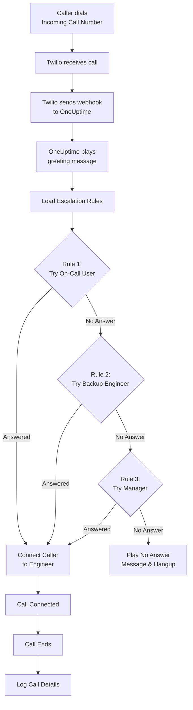
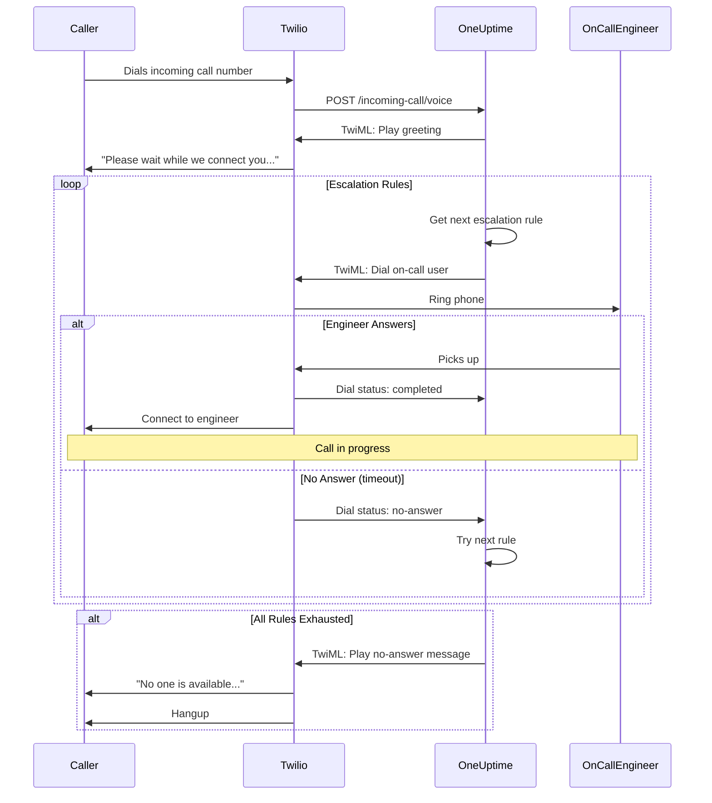

# Incoming Call Policy (Twilio Integration)

Incoming Call Policies बाहरी callers को एक dedicated phone number dial करके आपके on-call engineers तक पहुंचने की अनुमति देती हैं। जब कोई call करता है, OneUptime आपके configured escalation rules के माध्यम से call route करता है जब तक कोई engineer answer नहीं करता।

## यह कैसे काम करता है

## Call Routing Flow

## पूर्व आवश्यकताएं

- एक Twilio account - [https://www.twilio.com](https://www.twilio.com) पर बनाएं
- आपका Twilio Account SID और Auth Token
- आपके OneUptime self-hosted instance तक पहुंच

## Overview

Incoming Call Policy feature इस तरह काम करता है:

1. Twilio phone number पर incoming calls receive करना
2. एक customizable greeting message play करना
3. escalation rules (ऑन-कॉल अनुसूचियाँ या लोग) के माध्यम से call route करना
4. caller को पहले available on-call engineer से connect करना
5. कोई answer नहीं होने पर अगले rule पर escalate करना

चूंकि आप OneUptime self-host कर रहे हैं, आपको अपना खुद का Twilio account configure करना होगा। यह आपको अपने phone numbers और billing पर पूर्ण नियंत्रण देता है।

## चरण 1: Twilio Account बनाएं

1. [https://www.twilio.com](https://www.twilio.com) पर जाएं और account के लिए sign up करें
2. verification process पूरी करें
3. Twilio Console dashboard से अपना **Account SID** और **Auth Token** नोट करें

## चरण 2: OneUptime में Call/SMS Config Configure करें

1. अपने OneUptime Dashboard में log in करें
2. **प्रोजेक्ट सेटिंग्स** > **सूचनाएं** > **सूचना सेटिंग्स** पर जाएं
3. **Twilio कॉन्फ़िगरेशन** में **Create Twilio Config** पर क्लिक करें
4. निम्नलिखित fields भरें:
   - **नाम**: एक friendly name (जैसे "Production Twilio Config")
   - **विवरण**: वैकल्पिक description
   - **Twilio Account SID**: आपका Twilio Account SID (`AC` से शुरू होता है)
   - **Twilio Auth Token**: आपका Twilio Auth Token
   - **Twilio प्राथमिक फ़ोन नंबर**: outbound calls के लिए आपके Twilio account का phone number
   - **प्रोजेक्ट डिफ़ॉल्ट के रूप में सेट करें**: प्रोजेक्ट के पहले Twilio कॉन्फ़िगरेशन के लिए चालू रहता है, इसलिए प्रोजेक्ट के सदस्यों के SMS और कॉल भी इसी खाते से जाते हैं। अगर यह खाता केवल इनकमिंग कॉल के लिए है, तो इसे बंद करें।
5. **सहेजें** पर क्लिक करें

## चरण 3: Incoming Call Policy बनाएं

1. **ऑन-कॉल ड्यूटी** > **इनकमिंग कॉल नीतियां** पर जाएं
2. **Create Incoming Call Policy** पर क्लिक करें
3. निम्नलिखित fields भरें:
   - **नाम**: एक friendly name (जैसे "Support Hotline")
   - **विवरण**: वैकल्पिक description
4. **सहेजें** पर क्लिक करें

## चरण 4: Twilio Configuration को Policy से Link करें

1. अपनी नई बनाई Incoming Call Policy खोलें
2. **Phone Number Routing** card में, **Step 2: Link Twilio Configuration** खोजें
3. **Select Twilio Config** पर क्लिक करें और चरण 2 में बनाई configuration चुनें
4. selection save करें

## चरण 5: Phone Number Configure करें

Phone number सेट अप करने के लिए आपके पास दो options हैं:

### Option A: मौजूदा Twilio Phone Number उपयोग करें

यदि आपके Twilio account में पहले से phone numbers हैं:

1. **फ़ोन नंबर** card में, **Use Existing Number** पर क्लिक करें
2. OneUptime आपके Twilio account से सभी phone numbers fetch करेगा
3. वह phone number चुनें जिसे आप उपयोग करना चाहते हैं
4. इसे policy assign करने के लिए **Use This** पर क्लिक करें

> **नोट**: यदि phone number में पहले से webhook configured है, तो इसे OneUptime की ओर point करने के लिए update किया जाएगा।

### Option B: एक नया Phone Number खरीदें

OneUptime से directly नया phone number खरीदने के लिए:

1. **फ़ोन नंबर** card में, **Buy New Number** पर क्लिक करें
2. dropdown से एक **देश** चुनें
3. वैकल्पिक रूप से एक **Area Code** दर्ज करें (जैसे San Francisco के लिए 415)
4. वैकल्पिक रूप से वे digits दर्ज करें जो number में **Contain** होने चाहिए (जैसे 555)
5. उपलब्ध numbers खोजने के लिए **खोजें** पर क्लिक करें
6. results से एक phone number चुनें
7. number खरीदने के लिए **Purchase** पर क्लिक करें

Phone number आपके Twilio account से खरीदा जाएगा और webhook **automatically configured** होगा — कोई manual setup आवश्यक नहीं!

## चरण 6: Escalation Rules Configure करें

Escalation rules यह तय करते हैं कि जब कोई policy के नंबर पर कॉल करता है, तो list में ऊपर से नीचे किसे कॉल किया जाए:

1. अपनी Incoming Call Policy खोलें
2. **एस्केलेशन नियम** tab पर जाएं
3. **एस्केलेशन नियम जोड़ें** पर क्लिक करें
4. rule भरें। यह एक ही step है:
   - **किसे कॉल करें**: एक ऑन-कॉल अनुसूची या एक व्यक्ति। अनुसूची, कॉल आने पर उस समय उसमें ऑन-कॉल व्यक्ति को कॉल करती है। लोग आपके project के सदस्य होते हैं।
   - **घंटी बजने का समय (सेकंड में)**: कॉल के अगले rule पर जाने से पहले उनका फ़ोन कितनी देर बजता है। यह 20 सेकंड से शुरू होता है, और Twilio 5 से 600 तक लेता है।
   - **नाम** और **विवरण** वैकल्पिक हैं तथा **और फ़ील्ड** के अंदर हैं। बिना नाम का rule list में अपनी जगह के अनुसार दिखता है: **Level 1**, **Level 2**।
5. इसे save करें, और आगे try किए जाने वाले हर अनुसूची या व्यक्ति के लिए एक rule जोड़ें

Rules list में ऊपर से नीचे कॉल किए जाते हैं, और नया rule अंत में जुड़ता है। क्रम बदलने के लिए rule को उसके ऊपर-बाएँ handle से drag करें; keyboard से handle पर focus करें, Space दबाएँ, arrow keys से उसे खिसकाएँ और फिर से Space दबाएँ।

> **Voicemail का ध्यान रखें**: **घंटी बजने का समय** उस समय से कम रखें जितने में व्यक्ति का फ़ोन बिना उत्तर वाली कॉल को voicemail पर भेज देता है। अगर voicemail पहले उत्तर देता है, तो caller उससे जुड़ जाता है और कॉल अगले rule पर नहीं जाती। Twilio हर घंटी में अपने कुछ सेकंड जोड़ता है। इसी वजह से नया rule 20 सेकंड से शुरू होता है। जो rules तब जोड़े गए थे जब default 30 सेकंड था, वे अपने 30 रखते हैं: अगर उनकी कॉल voicemail पर पहुँचती हैं, तो उन rules का **घंटी बजने का समय** कम करें।

| Level   | किसे कॉल करें                   | घंटी बजने का समय |
| ------- | ------------------------------- | ---------------- |
| Level 1 | Primary On-Call Schedule        | 20 सेकंड         |
| Level 2 | Secondary On-Call Schedule      | 20 सेकंड         |
| Level 3 | Engineering Team Lead (व्यक्ति) | 20 सेकंड         |

## चरण 7: Voice Messages Configure करें (वैकल्पिक)

callers जो messages सुनते हैं उन्हें customize करें:

1. अपनी Incoming Call Policy खोलें
2. **सेटिंग्स** पर जाएं
3. Configure करें:
   - **अभिवादन संदेश**: call answer होने पर play होता है
   - **कोई उत्तर नहीं संदेश**: सभी escalation rules fail होने पर play होता है
   - **कोई उपलब्ध नहीं संदेश**: कोई on-call नहीं होने पर play होता है

## Configuration Options

### Policy Settings

| Setting                         | विवरण                                          | Default                                                        |
| ------------------------------- | ---------------------------------------------- | -------------------------------------------------------------- |
| Greeting Message                | call answer होने पर play होने वाला TTS message | "कृपया प्रतीक्षा करें जब तक हम आपको ऑन-कॉल इंजीनियर से जोड़ते हैं।" |
| No Answer Message               | सभी escalation rules fail होने पर message      | "कोई उपलब्ध नहीं है। कृपया बाद में पुनः प्रयास करें।"          |
| No One Available Message        | कोई on-call नहीं होने पर message               | "हमें खेद है, लेकिन वर्तमान में कोई ऑन-कॉल इंजीनियर उपलब्ध नहीं है।" |
| Repeat Policy If No One Answers | सभी fail होने पर first rule से restart करें    | Disabled                                                       |
| Repeat Policy Times             | maximum repeat attempts                        | 1                                                              |

### Escalation Rule Settings

| Setting                      | विवरण                                                                                                                         |
| ---------------------------- | ----------------------------------------------------------------------------------------------------------------------------- |
| किसे कॉल करें                | एक ऑन-कॉल अनुसूची, जो उसमें ऑन-कॉल व्यक्ति को कॉल करती है, या एक व्यक्ति। हर rule इनमें से एक को कॉल करता है                |
| घंटी बजने का समय (सेकंड में) | कॉल के अगले rule पर जाने से पहले फ़ोन कितनी देर बजता है (default: 20; 5 से 600 तक)                                            |
| नाम और विवरण                 | वैकल्पिक, और फ़ील्ड के अंदर। बिना नाम का rule list में अपनी जगह के अनुसार Level 1, Level 2 आदि के रूप में दिखता है               |
| Order                        | list में rule की जगह: rules ऊपर से नीचे कॉल किए जाते हैं। rules को drag करके बदलें; API से, बिना order वाला नया rule अंत में जाता है |

API से, हर rule `onCallDutyPolicyScheduleId` या `userId` (इनमें से एक, दोनों कभी नहीं) और `escalateAfterSeconds` सेट करता है: घंटी बजने का समय, जो छोड़ने पर 20 होता है।

## Call Logs देखना

Incoming call history देखने के लिए:

1. **ऑन-कॉल ड्यूटी** > **इनकमिंग कॉल नीतियां** पर जाएं
2. अपनी policy पर क्लिक करें
3. **कॉल लॉग** tab पर जाएं

Logs दिखाते हैं:

- Caller phone number
- Call status (Completed, No Answer, Failed, आदि)
- Call किसने answer किया
- Call duration
- Timestamp

## User Phone Number Configuration

Users को incoming calls receive करने के लिए, उनके पास verified phone number होना चाहिए:

1. Users **उपयोगकर्ता सेटिंग्स** > **सूचना विधियां** पर जाते हैं
2. **Incoming Call Numbers** के अंतर्गत phone number जोड़ें
3. SMS code के माध्यम से phone number verify करें

केवल verified phone numbers वाले users को escalation rules के माध्यम से call किया जा सकता है।

Incoming call नंबर SMS से verify होते हैं, इसलिए प्रोजेक्ट में पहले **SMS** चालू होना चाहिए। प्रोजेक्ट का मालिक या **Billing Admin** या **Manage Billing** वाला कोई व्यक्ति इसे **प्रोजेक्ट सेटिंग्स > सूचनाएं > सूचना सेटिंग्स** के **सूचना चैनल** कार्ड में चालू करता है।

## Phone Number Release करना

यदि आपको phone number की अब आवश्यकता नहीं है:

1. अपनी Incoming Call Policy खोलें
2. **फ़ोन नंबर** card में, **नंबर रिलीज़ करें** पर क्लिक करें
3. release confirm करें

> **चेतावनी**: Released numbers Twilio को वापस कर दिए जाते हैं और re-purchase के लिए उपलब्ध नहीं हो सकते।

## समस्या निवारण

### Calls receive नहीं हो रहीं

- सत्यापित करें कि Twilio configuration policy से सही तरीके से linked है
- जांचें कि आपका OneUptime instance internet से accessible है
- सत्यापित करें कि Twilio Account SID और Auth Token सही हैं
- Twilio Console में error logs जांचें

### Calls engineers से connect नहीं हो रहीं

- सत्यापित करें कि users के notification settings में verified phone numbers हैं
- जांचें कि escalation rules ठीक से configured हैं
- सुनिश्चित करें कि on-call schedules में वर्तमान समय के लिए users assigned हैं
- सत्यापित करें कि policy enabled है
- अगर calls किसी engineer के voicemail पर पहुँचती हैं, तो rule का **घंटी बजने का समय** उस समय से कम करें जितने में उनका फ़ोन voicemail पर चला जाता है

### Audio quality issues

- सुनिश्चित करें कि आपके server में stable internet connectivity है
- ongoing issues के लिए Twilio की status page जांचें
- सत्यापित करें कि phone numbers सही format में हैं (E.164 format: +15551234567)

## Security Considerations

- अपना Twilio Auth Token secure रखें और इसे publicly कभी expose न करें
- अपने OneUptime instance के लिए HTTPS उपयोग करें
- OneUptime webhook signatures validate करता है ताकि requests Twilio से आती हैं
- Consider करें कि कौन से phone numbers आपकी incoming call policies को call कर सकते हैं

## Support

Incoming Call Policy feature में issues के लिए, कृपया:

1. Twilio Console में error logs जांचें
2. OneUptime server logs review करें
3. [hello@oneuptime.com](mailto:hello@oneuptime.com) पर support से संपर्क करें
