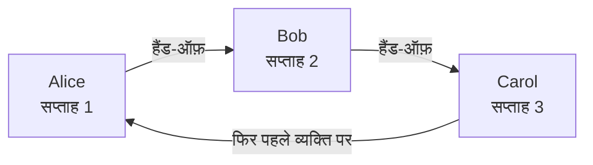
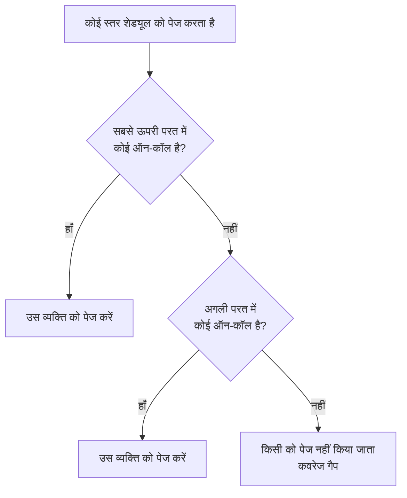

# ऑन-कॉल अनुसूची

ऑन-कॉल शेड्यूल तय करता है कि किसी भी पल कौन ऑन-कॉल है। लोग इसमें बारी-बारी से रहते हैं: हर व्यक्ति कुछ समय ऑन-कॉल रहता है, फिर अगला व्यक्ति संभाल लेता है। किसी ऑन-कॉल नीति के एस्केलेशन नियमों में शेड्यूल जोड़ें, और जब वह स्तर चलता है तो नीति उसमें ऑन-कॉल व्यक्ति को पेज करती है।

> [!NOTE]
> OneUptime Cloud पर ऑन-कॉल शेड्यूल **Growth** और उससे ऊपर के प्लान में हैं। Growth ट्रायल ख़त्म होने या प्लान घटने के बाद भी, किसी प्रोजेक्ट में बचा हुआ शेड्यूल, उसका नाम लेने वाले एस्केलेशन नियमों के ज़रिए अपने लोगों को पेज करता रहता है। इसलिए **Growth** से नीचे, **ऑन-कॉल अनुसूची** पेज प्लान का नोट दिखाता है और उसके नीचे अब भी सेट शेड्यूल, जहाँ आप उन्हें हटा सकते हैं। शेड्यूल बनाने या बदलने के लिए **Growth** चाहिए।

:::cards
- [कौन बारी-बारी से रहता है](#कौन-बारी-बारी-से-रहता-है): पहले रोटेशन के साथ एक शेड्यूल बनाएँ।
- [परतें](#परतें): रोटेशन एक के ऊपर एक रखें, ऑन-कॉल घंटे सीमित करें और बैकअप कवर जोड़ें।
- [API और Terraform](#api-या-terraform-से-शेड्यूल-बनाना): शेड्यूल और उनके रोटेशन कोड के रूप में बनाएँ।
:::

## कौन बारी-बारी से रहता है

जब आप **ऑन-कॉल अनुसूची** पेज पर शेड्यूल बनाते हैं, तो फ़ॉर्म उसका **नाम** और **बारी-बारी से कौन ऑन-कॉल रहेगा?** पूछता है। आप जिन लोगों को चुनते हैं, वे शेड्यूल की पहली परत, **Layer 1**, बन जाते हैं, जो चौबीसों घंटे ऑन-कॉल रहती है।

:::steps
1. **ऑन-कॉल ड्यूटी** > **ऑन-कॉल अनुसूची** पर जाएँ और **ऑन-कॉल अनुसूची बनाएं** पर क्लिक करें।
2. एक **नाम** दर्ज करें।
3. **बारी-बारी से कौन ऑन-कॉल रहेगा?** के नीचे **उपयोगकर्ता जोड़ें** पर क्लिक करें और लोगों को उसी क्रम में चुनें जिसमें वे बारी लेते हैं।
4. चाहें तो **और फ़ील्ड** खोलकर हर बारी की अवधि, टाइमज़ोन, विवरण या लेबल बदलें।
5. **ऑन-कॉल अनुसूची बनाएं** पर क्लिक करें। नया शेड्यूल फिर अपने **परतें** पेज पर खुलता है, जहाँ आप रोटेशन बदल सकते हैं या और परतें जोड़ सकते हैं।
:::

लोग एक-एक करके बारी लेते हैं, और शेड्यूल बनते ही पहला व्यक्ति ऑन-कॉल हो जाता है:



**बारी-बारी से कौन ऑन-कॉल रहेगा?** वैकल्पिक है। इसे खाली छोड़ने पर शेड्यूल बिना परतों के शुरू होता है: जब तक आप उसके **परतें** पेज पर कोई परत नहीं जोड़ते, यह किसी को ऑन-कॉल नहीं रखता। यह सवाल केवल उन लोगों से पूछा जाता है जो परतें जोड़ सकते हैं।

बाकी सब कुछ **और फ़ील्ड** के नीचे रहता है, जो खोलने तक सिमटा रहता है:

| फ़ील्ड | यह क्या करता है |
| --- | --- |
| **हर बारी की अवधि** | **1 दिन**, **1 सप्ताह**, **2 सप्ताह** या **1 महीना**, और अगर आप न बदलें तो **1 सप्ताह**। यह तब पूछा जाता है जब कोई बारी लेता है। हर व्यक्ति इतनी देर ऑन-कॉल रहता है, फिर दिन के उसी समय अगला व्यक्ति संभालता है जिस समय शेड्यूल बना था। |
| **टाइमज़ोन** | वह टाइमज़ोन जिसमें हैंड-ऑफ़ के समय और ऑन-कॉल घंटे रखे जाते हैं। यह आपके टाइमज़ोन से शुरू होता है। |
| **विवरण** | शेड्यूल के बारे में नोट्स। |
| **लेबल** | शेड्यूल खोजने और समूहित करने के लिए लेबल। |

जब तक कोई बारी लेता है और **और फ़ील्ड** के नीचे कुछ नहीं बदला गया, उसका सिमटा हुआ शीर्षक बताता है कि क्या होगा: हर व्यक्ति एक सप्ताह ऑन-कॉल रहता है, फिर अगला व्यक्ति संभालता है।

## परतें

शेड्यूल का रोटेशन उसके **परतें** पेज पर परतों से बना होता है। परतें ऊपर से नीचे पढ़ी जाती हैं: जिस सबसे ऊपरी परत में कोई ऑन-कॉल है, वही पेज करती है, इसलिए मुख्य रोटेशन सबसे ऊपर रखें और बैकअप कवर उसके नीचे।



**परत जोड़ें** ऐसी परत जोड़ता है जो पहली परत की तरह शुरू होती है: अभी से ऑन-कॉल, हर व्यक्ति एक सप्ताह, चौबीसों घंटे। किसी परत में लोग जोड़ने के लिए, और यह बदलने के लिए कि वह कब शुरू होती है, कितनी बार हैंड-ऑफ़ करती है, पहला हैंड-ऑफ़ कब करती है और किन घंटों में ऑन-कॉल रहती है, उसे फैलाएँ:

| फ़ील्ड | यह क्या तय करता है |
| --- | --- |
| **Layer name** | परत क्या कवर करती है, जैसे "कार्यदिवस प्राथमिक"। |
| **Rotation starts at** | वह तारीख़ और समय जब परत का रोटेशन शुरू होता है। |
| **Rotate every** | ऑन-कॉल ड्यूटी कितनी बार परत के अगले व्यक्ति के पास जाती है। |
| **First hand-off time** | अगले व्यक्ति को पहला हैंड-ऑफ़, शुरुआत पर या उसके बाद। बाद के हैंड-ऑफ़ हर रोटेशन अंतराल पर होते हैं। |
| **Restrictions** | वे घंटे जिनमें परत ऑन-कॉल रहती है: शेड्यूल के टाइमज़ोन में **कोई प्रतिबंध नहीं**, **दिन के विशिष्ट समय** या **सप्ताह के विशिष्ट समय**। इनके बाहर नीचे की परतें संभालती हैं। |

कौन-सी परत पहले आए, यह बदलने के लिए परत के मेन्यू में **Move layer up (higher priority)** या **Move layer down (lower priority)** इस्तेमाल करें।

हर व्यक्ति का रंग हर जगह एक ही रहता है, ताकि आप उसे एक नज़र में पहचान सकें: हर परत पर, अंतिम शेड्यूल और उसके ओवरराइड में, और **शेड्यूल टाइमलाइन** पर।

## API या Terraform से शेड्यूल बनाना

ऑन-कॉल शेड्यूल `/api/on-call-duty-policy-schedule` रिसोर्स हैं; उनकी परतें और उनमें मौजूद लोग `/api/on-call-duty-schedule-layer` और `/api/on-call-duty-schedule-layer-user` रिसोर्स हैं।

- शेड्यूल को उसके `miscDataProps` में `firstLayerUsers` (यूज़र ID की सूची, उसी क्रम में जिसमें वे बारी लेते हैं) के साथ बनाने पर उसे डैशबोर्ड की तरह उसकी पहली परत मिलती है: **Layer 1**, अभी से ऑन-कॉल, चौबीसों घंटे। `firstLayerRotation` बताता है कि हर बारी कितनी देर चलती है, `{"_type": "Recurring", "value": {"intervalType": "Week", "intervalCount": 1}}` जैसे रोटेशन के रूप में; इसके बिना एक सप्ताह। हर यूज़र प्रोजेक्ट का सदस्य होना चाहिए और कॉल करने वाले को परतें बनाने की अनुमति होनी चाहिए, वरना शेड्यूल नहीं बनता।
- इनके बिना बनाए गए शेड्यूल में पहले की तरह कोई परत नहीं होती; Terraform का शेड्यूल रिसोर्स इन्हें नहीं भेजता।
- बिना `rotation` के बनाई गई परत हमेशा की तरह रोज़ हैंड-ऑफ़ करती है।

```bash
curl -X POST https://oneuptime.com/api/on-call-duty-policy-schedule \
  -H "apikey: $ONEUPTIME_API_KEY" \
  -H "Content-Type: application/json" \
  -d '{
    "data": {
      "projectId": "<project-id>",
      "name": "Primary on-call",
      "timezone": "Europe/Berlin"
    },
    "miscDataProps": {
      "firstLayerUsers": ["<user-id-1>", "<user-id-2>", "<user-id-3>"],
      "firstLayerRotation": {"_type": "Recurring", "value": {"intervalType": "Week", "intervalCount": 1}}
    }
  }'
```

## अगले कदम

:::cards
- [एस्केलेशन नियम](/docs/on-call/escalation-rules): ऑन-कॉल नीति के किसी स्तर से इस शेड्यूल को पेज करें।
- [शेड्यूल टाइमलाइन](/docs/on-call/schedule-timeline): हर शेड्यूल को कवरेज गैप के साथ अगल-बगल देखें।
- [कैलेंडर फ़ीड](/docs/on-call/calendar-feeds): शिफ्टें Google कैलेंडर, Outlook या Apple कैलेंडर में रखें।
:::
