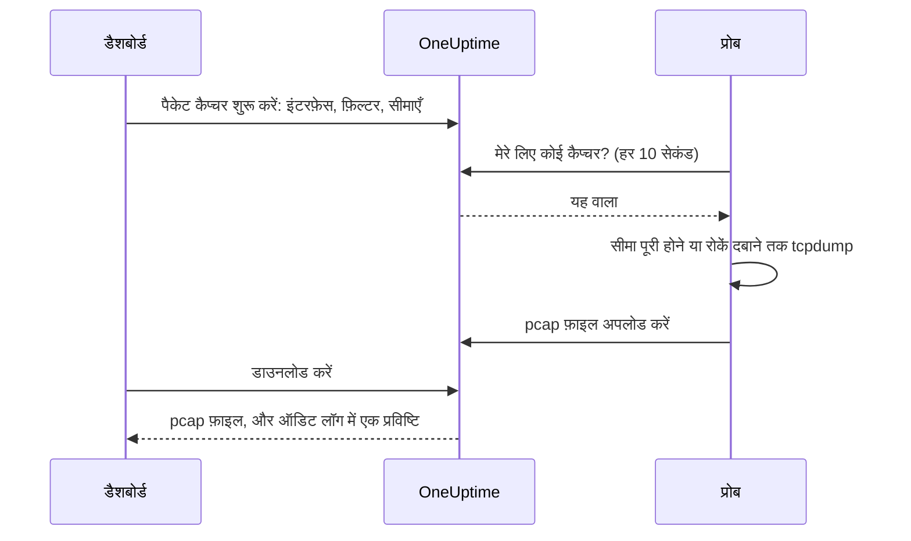

# पैकेट कैप्चर

अपने किसी प्रोब को दिखने वाला ट्रैफ़िक सीधे डैशबोर्ड से कैप्चर करें, और फ़ाइल को Wireshark में खोलें। प्रोब पहले से उसी नेटवर्क में है जिसकी आप जाँच कर रहे हैं: न कोई VPN खोलना है, न किसी जंप होस्ट पर लॉग इन करना है।

हर प्रोब पर कैप्चर तब तक बंद रहते हैं जब तक प्रोब चलाने वाला व्यक्ति उन्हें चालू न करे, और वे केवल आपके प्रोजेक्ट के अपने प्रोब पर चलते हैं।

:::cards
- [यह कैसे काम करता है](#यह-कैसे-काम-करता-है): पैकेट कैप्चर शुरू करने से लेकर Wireshark में फ़ाइल तक।
- [पैकेट कैप्चर चालू करें](#पैकेट-कैप्चर-चालू-करें): प्रोब चलाने वाला व्यक्ति Docker, Docker Compose और Kubernetes के लिए क्या सेट करता है।
- [कैप्चर शुरू करें](#कैप्चर-शुरू-करें): इंटरफ़ेस चुनें, उसे अपनी ज़रूरत तक सीमित करें, फ़ाइल डाउनलोड करें।
- [संदर्भ](#संदर्भ): सीमाएँ, फ़िल्टर, अनुमतियाँ, ऑडिट लॉग और फ़ाइलें कितने समय तक रखी जाती हैं।
- [समस्या निवारण](#समस्या-निवारण): विफल कैप्चर के संदेश का क्या मतलब है।
:::

## यह कैसे काम करता है



1. **शुरू करें।** कैप्चर शुरू करने की अनुमति वाला कोई व्यक्ति प्रोब का इंटरफ़ेस, एक फ़िल्टर और सीमाएँ चुनता है, और **कैप्चर शुरू करें** पर क्लिक करता है। कैप्चर सहेजने से पहले OneUptime जाँचता है कि फ़िल्टर और सीमाएँ प्रोब की अनुमति के भीतर हैं।
2. **उठाना।** प्रोब हर दस सेकंड में OneUptime से काम माँगता है, उसी तरह जैसे वह मॉनिटर माँगता है। वह कैप्चर लेता है और `tcpdump` शुरू करता है।
3. **कैप्चर।** कैप्चर अपनी पहली पूरी हुई सीमा पर रुकता है: अवधि, पैकेट सीमा या फ़ाइल आकार। **रोकें** उसे जल्दी खत्म करता है, और जो कैप्चर हो चुका है उसे रखता है।
4. **अपलोड।** प्रोब pcap फ़ाइल अपलोड करता है। OneUptime उसे प्रोजेक्ट की निजी फ़ाइल के रूप में रखता है।
5. **डाउनलोड।** कैप्चर **पूर्ण** दिखाता है, साथ में **डाउनलोड करें** बटन। फ़ाइल Wireshark, tcpdump या pcap फ़ाइलें पढ़ने वाले किसी भी टूल में खुलती है।

## शुरू करने से पहले

- **आपके प्रोजेक्ट का अपना प्रोब।** ग्लोबल प्रोब दूसरे प्रोजेक्ट्स का ट्रैफ़िक ले जाते हैं, इसलिए वे कभी कैप्चर नहीं करते। अपना प्रोब इंस्टॉल करने के लिए [कस्टम प्रोब](/docs/probe/custom-probe) देखें।
- **इस रिलीज़ या उसके बाद का प्रोब।** पुराने प्रोब यह नहीं बताते कि वे किस पर कैप्चर कर सकते हैं।
- **सही अनुमतियाँ।** कैप्चर शुरू करने और रोकने के लिए **Start Packet Capture** चाहिए, और फ़ाइल डाउनलोड करने के लिए **Download Packet Capture**। प्रोजेक्ट के मालिकों और एडमिन के पास दोनों हैं। [अनुमतियाँ](#अनुमतियाँ) देखें।
- **उस ट्रैफ़िक के लिए मिरर किया गया पोर्ट जो प्रोब तक नहीं पहुँचता।** प्रोब केवल अपने होस्ट के इंटरफ़ेस पर ट्रैफ़िक देखता है। दूसरे डिवाइसों के बीच का ट्रैफ़िक कैप्चर करने के लिए, उनके स्विच पोर्ट को (SPAN से) प्रोब के होस्ट के किसी खाली इंटरफ़ेस पर मिरर करें।

## पैकेट कैप्चर चालू करें

प्रोब चलाने वाला व्यक्ति कैप्चर वहीं चालू करता है जहाँ प्रोब चलता है: डैशबोर्ड ऐसा नहीं कर सकता, और यह जानबूझकर है। प्रोब को तीन चीज़ें चाहिए:

| सेटिंग | क्यों |
| --- | --- |
| `PROBE_PACKET_CAPTURE_ENABLED=true` | कैप्चर चालू करता है। कोई और मान, या कोई मान नहीं, उन्हें बंद रखता है। |
| होस्ट नेटवर्किंग | प्रोब को होस्ट के अपने इंटरफ़ेस और मिरर किया गया पोर्ट देखने देता है। इसके बिना प्रोब केवल अपने कंटेनर का नेटवर्क देखता है। |
| `NET_RAW` क्षमता | tcpdump को कैप्चर करने देती है। Docker इसे डिफ़ॉल्ट रूप से देता है। Kubernetes का Pod Security restricted मानक इसे हटा देता है, इसलिए इसे जोड़ें। |

:::tabs
@tab Docker
```bash
docker run --name oneuptime-probe --network host \
  --cap-add NET_RAW \
  -e PROBE_KEY=<probe-key> \
  -e PROBE_ID=<probe-id> \
  -e ONEUPTIME_URL=https://oneuptime.com \
  -e PROBE_PACKET_CAPTURE_ENABLED=true \
  -d oneuptime/probe:release
```
@tab Docker Compose
```yaml
services:
  oneuptime-probe:
    image: oneuptime/probe:release
    container_name: oneuptime-probe
    network_mode: host
    cap_add:
      - NET_RAW
    environment:
      - PROBE_KEY=<probe-key>
      - PROBE_ID=<probe-id>
      - ONEUPTIME_URL=https://oneuptime.com
      - PROBE_PACKET_CAPTURE_ENABLED=true
    restart: always
```
@tab Kubernetes
```yaml
apiVersion: apps/v1
kind: Deployment
metadata:
  name: oneuptime-probe
spec:
  selector:
    matchLabels:
      app: oneuptime-probe
  template:
    metadata:
      labels:
        app: oneuptime-probe
    spec:
      hostNetwork: true
      dnsPolicy: ClusterFirstWithHostNet
      containers:
        - name: oneuptime-probe
          image: oneuptime/probe:release
          securityContext:
            capabilities:
              add: ["NET_RAW"]
          env:
            - name: PROBE_KEY
              value: "<probe-key>"
            - name: PROBE_ID
              value: "<probe-id>"
            - name: ONEUPTIME_URL
              value: "https://oneuptime.com"
            - name: PROBE_PACKET_CAPTURE_ENABLED
              value: "true"
```
:::

प्रोब शुरू होने पर उसका लॉग कहता है `Packet capture is on: captures of up to 30 minutes and 25 MB can be started on this probe from the dashboard.` एक मिनट के भीतर, डैशबोर्ड में प्रोब का पेज **पैकेट कैप्चर शुरू करें** दिखाता है।

इस प्रोब पर हर प्रोब की सीमा से कम सीमा रखने के लिए, इनमें से कोई एक जोड़ें:

| वेरिएबल | डिफ़ॉल्ट | यह क्या करता है |
| --- | --- | --- |
| `PROBE_PACKET_CAPTURE_MAX_DURATION_IN_SECONDS` | `1800` | यह प्रोब जो सबसे लंबा कैप्चर चलाता है, 5 से 1800 सेकंड तक। |
| `PROBE_PACKET_CAPTURE_MAX_FILE_SIZE_IN_MB` | `25` | यह प्रोब जो सबसे बड़ी कैप्चर फ़ाइल बनाता है, 1 से 25 MB तक। |

> [!NOTE]
> Docker Compose या Helm चार्ट से सेल्फ़-होस्टेड OneUptime इंस्टॉल के साथ आने वाले प्रोब ग्लोबल प्रोब हैं, इसलिए वे कभी कैप्चर नहीं करते। जिस नेटवर्क में आप कैप्चर करना चाहते हैं, वहाँ एक कस्टम प्रोब चलाएँ।

## कैप्चर शुरू करें

:::steps
### प्रोब या डिवाइस खोलें

**मॉनिटर → सेटिंग्स → प्रोब** खोलें और अपने प्रोब पर क्लिक करें: उसका **पैकेट कैप्चर** कार्ड उसके कैप्चर दिखाता है। या कोई नेटवर्क डिवाइस खोलें और उसके **Traffic** पेज पर जाएँ: वहाँ के कैप्चर डिवाइस के अपने प्रोब पर चलते हैं, और डिवाइस के पते पर फ़िल्टर होकर शुरू होते हैं।

### पैकेट कैप्चर शुरू करें पर क्लिक करें

कैप्चर शुरू करने से पहले फ़ॉर्म बताता है कि उसमें क्या होता है: नेटवर्क से गुज़रने वाले पासवर्ड, टोकन और व्यक्तिगत डेटा फ़ाइल में पहुँच जाते हैं।

### इंटरफ़ेस चुनें

**सभी इंटरफ़ेस (any)** प्रोब के हर इंटरफ़ेस पर कैप्चर करता है। मिरर किया गया ट्रैफ़िक कैप्चर करते समय वह इंटरफ़ेस चुनें जिस पर स्विच ट्रैफ़िक मिरर करता है।

### चुनें कि कौन से पैकेट

कैप्चर को सीमित करने के लिए **होस्ट या नेटवर्क**, **पोर्ट** और **प्रोटोकॉल** भरें, या हर पैकेट रखने के लिए उन्हें खाली छोड़ दें। फ़ॉर्म उनसे बना फ़िल्टर दिखाता है, जैसे `host 10.0.0.5 and tcp port 443`। अपना फ़िल्टर लिखने के लिए **इसके बजाय BPF फ़िल्टर लिखें** पर क्लिक करें।

### सीमाएँ जाँचें

**और फ़ील्ड** में **अवधि**, **पैकेट सीमा** और **फ़ाइल आकार की सीमा (MB)** हैं। इसका सारांश बताता है कि कैप्चर कब रुकेगा: `1 मिनट, 1,00,000 पैकेट या 10 MB, जो भी पहले हो, उसके बाद रुकता है।`

### कैप्चर शुरू करें पर क्लिक करें

कैप्चर तब तक **लंबित** दिखाता है जब तक प्रोब उसे उठा न ले, फिर **चल रहा है**, साथ में यह कि वह कितना आगे बढ़ा है। उसे जल्दी खत्म करने के लिए **रोकें** पर क्लिक करें।
:::

जब कैप्चर **पूर्ण** दिखाए, तो **डाउनलोड करें** पर क्लिक करें, फिर `.pcap` फ़ाइल को Wireshark में खोलें। **सभी इंटरफ़ेस (any)** पर किया गया कैप्चर Linux cooked capture होता है, जिसे Wireshark किसी भी दूसरे कैप्चर की तरह पढ़ता है।

## संदर्भ

### सीमाएँ

| सीमा | डिफ़ॉल्ट | दायरा |
| --- | --- | --- |
| अवधि | 1 मिनट | 5 सेकंड से 30 मिनट |
| पैकेट सीमा | 1,00,000 | 1 से 10,00,000 |
| फ़ाइल आकार की सीमा | 10 MB | 1 से 25 MB |

- कैप्चर पहली पूरी हुई सीमा पर रुकता है। जो फ़ाइल अपनी आकार सीमा तक पहुँचती है, उसे आखिरी पूरे पैकेट के बाद काट दिया जाता है, ताकि वह हमेशा खुले।
- एक प्रोब एक साथ अधिकतम 2 कैप्चर चलाता है।
- जो कैप्चर प्रोब 5 मिनट के भीतर नहीं उठाता, वह विफल हो जाता है, और यह बताता है।
- प्रोब हर कैप्चर को इन सीमाओं पर दोबारा, और अपनी कम सीमाओं पर भी, रोकता है।

### फ़िल्टर

फ़ॉर्म के फ़ील्ड एक [BPF फ़िल्टर](https://www.tcpdump.org/manpages/pcap-filter.7.html) बनाते हैं, जो tcpdump और Wireshark की कैप्चर फ़िल्टर भाषा है:

| होस्ट या नेटवर्क | पोर्ट | प्रोटोकॉल | फ़िल्टर |
| --- | --- | --- | --- |
| `10.0.0.5` | | कोई भी प्रोटोकॉल | `host 10.0.0.5` |
| `10.0.0.0/24` | `443` | TCP | `net 10.0.0.0/24 and tcp port 443` |
| | `5060` | UDP | `udp port 5060` |
| | `8000-8080` | कोई भी प्रोटोकॉल | `portrange 8000-8080` |
| `10.0.0.5` | | ICMP | `host 10.0.0.5 and (icmp or icmp6)` |

आपका खुद लिखा फ़िल्टर अधिकतम 500 अक्षरों की एक पंक्ति है, जो अक्षरों, अंकों, स्पेस और `. : / ( ) [ ] ! & | < > = + - * % ^ _` से बनी हो। OneUptime सहेजने से पहले उसे जाँचता है, और tcpdump उसे प्रोब पर कंपाइल करता है। प्रोब उसे tcpdump को एक ही आर्ग्युमेंट के रूप में देता है, कभी शेल के ज़रिए नहीं।

### अनुमतियाँ

| अनुमति | किसी को यह करने देती है | डिफ़ॉल्ट रूप से किसके पास है |
| --- | --- | --- |
| **Start Packet Capture** | कैप्चर शुरू करना, और उन्हें रोकना | Project Owner, Project Admin |
| **Download Packet Capture** | कैप्चर फ़ाइलें डाउनलोड करना | Project Owner, Project Admin |
| **Delete Packet Capture** | कैप्चर और उनकी फ़ाइलें हटाना | Project Owner, Project Admin |
| **Read Packet Capture** | कैप्चर देखना: वे कब चले, किस प्रोब पर और किस फ़िल्टर के साथ | Project Owner, Project Admin, Project Member, Viewer |

किसी टीम को **Start Packet Capture** या **Download Packet Capture** देने के लिए, उसे **सेटिंग्स → टीमें** में खोलें और उसके **अनुमतियाँ** पेज पर अनुमति जोड़ें। [अनुमतियाँ](/docs/permissions/index) देखें।

### ऑडिट लॉग और गोपनीयता

- कैप्चर शुरू करना ऑडिट लॉग में **Packet Capture** के **Create** के रूप में दर्ज होता है, और उसे हटाना **Delete** के रूप में। हर डाउनलोड **Download** के रूप में दर्ज होता है, इस जानकारी के साथ कि किसने कौन सा कैप्चर डाउनलोड किया।
- फ़ाइल प्रोजेक्ट की निजी फ़ाइल है। केवल **Download Packet Capture** के साथ **डाउनलोड करें** बटन ही उसे देता है।
- कैप्चर और उनकी फ़ाइलें शुरू होने के 7 दिन बाद हटा दी जाती हैं। कैप्चर हटाने से उसकी फ़ाइल तुरंत हट जाती है।

## समस्या निवारण

:::details "इस प्रोब पर पैकेट कैप्चर बंद है"
प्रोब `PROBE_PACKET_CAPTURE_ENABLED=true` के बिना चल रहा है। उसे [पैकेट कैप्चर चालू करें](#पैकेट-कैप्चर-चालू-करें) की सेटिंग्स के साथ फिर से शुरू करें।
:::

:::details "The probe is not allowed to capture packets on eth0"
tcpdump इंटरफ़ेस नहीं खोल सका। प्रोब के कंटेनर को `NET_RAW` क्षमता दें: Docker में `--cap-add NET_RAW`, Docker Compose में `cap_add`, Kubernetes में `securityContext.capabilities.add`।
:::

:::details "The interface does not exist on the probe"
प्रोब के पिछली बार बताने के बाद इंटरफ़ेस हट गया, या प्रोब होस्ट नेटवर्किंग के बिना चल रहा है और केवल अपने कंटेनर के इंटरफ़ेस देखता है। उसे होस्ट नेटवर्किंग के साथ चलाएँ, फिर इंटरफ़ेस दोबारा चुनें।
:::

:::details "tcpdump could not use the filter"
tcpdump फ़िल्टर कंपाइल नहीं कर सका। संदेश में tcpdump के अपने शब्द होते हैं, जैसे `syntax error`। फ़िल्टर को [pcap-filter मैनुअल](https://www.tcpdump.org/manpages/pcap-filter.7.html) से जाँचें।
:::

:::details "The probe did not pick up this capture within 5 minutes"
प्रोब डिस्कनेक्ट है, या कैप्चर शुरू होने के बाद उस पर पैकेट कैप्चर बंद कर दिया गया। प्रोब की **कनेक्शन स्थिति** और उसका लॉग जाँचें।
:::

:::details "कोई भी पैकेट फ़िल्टर से मेल नहीं खाया।"
कैप्चर चला, और इंटरफ़ेस पर कुछ भी फ़िल्टर से मेल नहीं खाया। जाँचें कि ट्रैफ़िक इसी इंटरफ़ेस से गुज़रता है: दूसरे डिवाइसों के बीच का ट्रैफ़िक प्रोब तक केवल मिरर किए गए पोर्ट से पहुँचता है।
:::

:::details "This probe is already running 2 packet captures"
एक प्रोब एक साथ 2 कैप्चर चलाता है। किसी एक के खत्म होने की प्रतीक्षा करें, या एक को रोकें, और अपना कैप्चर फिर से शुरू करें।
:::

## अगले कदम

:::cards
- [कस्टम प्रोब](/docs/probe/custom-probe): जिस नेटवर्क में आप कैप्चर करना चाहते हैं, वहाँ प्रोब इंस्टॉल करें।
- [नेटवर्क डिवाइस मॉनिटर](/docs/monitor/network-device-monitor): उन डिवाइसों की निगरानी करें जिनका ट्रैफ़िक आप कैप्चर करते हैं।
- [अनुमतियाँ](/docs/permissions/index): किसी टीम को पैकेट कैप्चर की अनुमतियाँ दें।
:::
