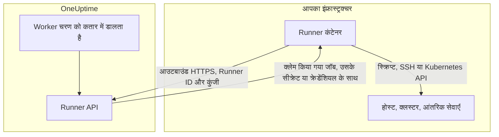
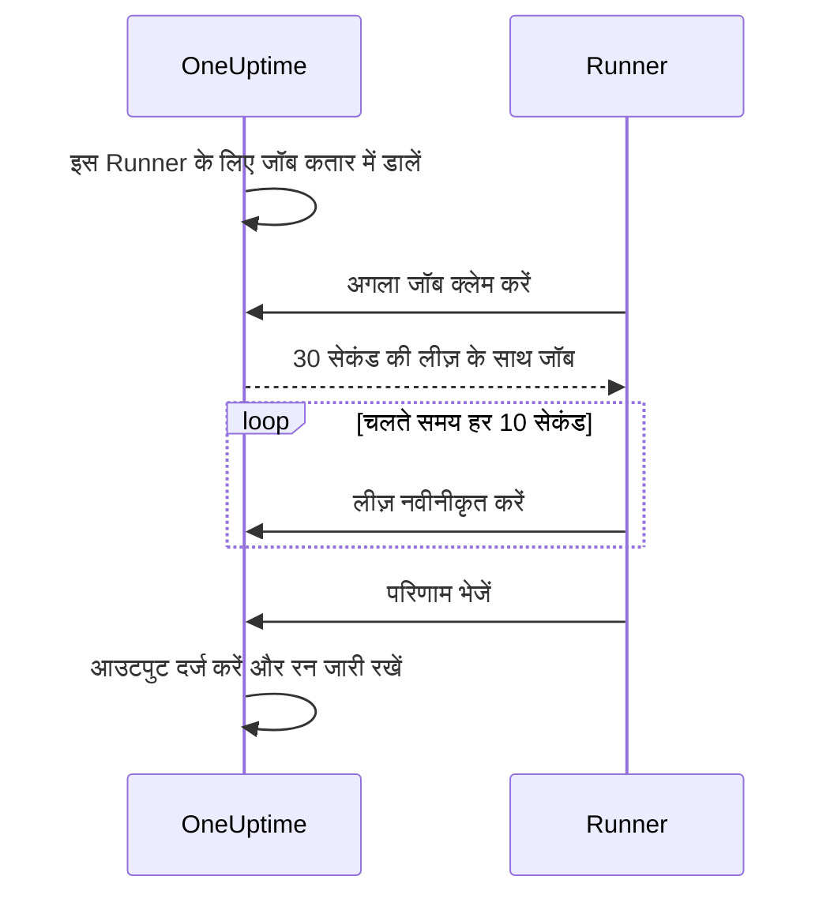

# Runbook एजेंट

**Runbook एजेंट**, जिसे डैशबोर्ड में **Runner** कहा जाता है, एक छोटी सेल्फ़-होस्टेड प्रोसेस है जो आपके Runbook के JavaScript, Bash, SSH और Kubernetes चरणों को **आपके अपने इंफ्रास्ट्रक्चर में** चलाती है। OneUptime Worker कभी आपकी स्क्रिप्ट नहीं चलाता: वह उन्हें कतार में डालता है, और चरण लिखने वाले द्वारा चुना गया Runner हर जॉब क्लेम करता है, उसे चलाता है और परिणाम वापस भेजता है। यह पेज उन लोगों के लिए है जो Runner इंस्टॉल और संचालित करते हैं।

:::cards
- [Runner इंस्टॉल करें](#runner-इंस्टॉल-करें): डैशबोर्ड से कनेक्टेड कंटेनर तक, पाँच चरणों में।
- [चरण को किसी Runner से जोड़ें](#चरण-को-किसी-runner-से-जोड़ें): चरण को उस Runner से बाँधें जिसे उसे चलाना चाहिए।
- [टाइमआउट](#टाइमआउट): क्लेम और निष्पादन टाइमआउट, और वे साथ में कैसे काम करते हैं।
- [एनवायरनमेंट वेरिएबल](#एनवायरनमेंट-वेरिएबल): शुरू होते समय कंटेनर क्या पढ़ता है।
:::

## यह कैसे काम करता है



1. आप OneUptime में एक Runner बनाते हैं। OneUptime उसके लिए एक ID और एक सीक्रेट कुंजी बनाता है।
2. आप अपने इंफ्रास्ट्रक्चर के किसी होस्ट पर उस ID, कुंजी और अपने OneUptime URL के साथ Runner कंटेनर चलाते हैं।
3. Runner हर 5 सेकंड में OneUptime से काम माँगता है और हर 60 सेकंड में बताता है कि वह चालू है।
4. JavaScript, Bash, SSH या Kubernetes चरण लिखते समय आप ड्रॉपडाउन से Runner चुनते हैं। चरण उस Runner से बँध जाता है।
5. जब चरण चलता है, तो Worker एक जॉब कतार में डालता है जिसमें `targetAgentId` उस Runner पर सेट होता है। केवल वही Runner उसे क्लेम कर सकता है।
6. Runner जॉब को लोकल रूप से चलाता है — Bash के लिए `bash -c <script>`, JavaScript के लिए `isolated-vm` सैंडबॉक्स, या चरण के क्रेडेंशियल के साथ SSH कनेक्शन या क्लस्टर के API सर्वर को कॉल — परिणाम दर्ज करता है और उसे वापस भेजता है। Worker उस परिणाम के साथ Runbook फिर से शुरू करता है।

Runner को आपके OneUptime इंस्टेंस तक केवल **आउटबाउंड HTTPS** चाहिए। यह कोई इनबाउंड कनेक्शन स्वीकार नहीं करता।

Runner के पास केवल उसकी ID और कुंजी होती है। बाक़ी सब कुछ उसे क्लेम किए गए जॉब के साथ मिलता है: एक स्क्रिप्ट जिसमें उसे सौंपे गए [Runbook सीक्रेट](/docs/runbooks/credentials#स्क्रिप्ट-के-लिए-सीक्रेट) भरे होते हैं, या वह [क्रेडेंशियल](/docs/runbooks/credentials) जिसका नाम कोई SSH या Kubernetes चरण लेता है। इसलिए जिसके पास किसी Runner की कुंजी है, वह उस Runner की तरह काम कर सकता है: कुंजी को उसे सौंपे गए क्रेडेंशियल की तरह ही संभालें।

## स्क्रिप्ट Runner पर क्यों चलती हैं

OneUptime Worker पर स्क्रिप्ट चलाने में दो समस्याएँ थीं:

- **भरोसे की सीमा।** जो भी Runbook लिख सकता था, वह Worker पर कोड चला सकता था, और Worker जहाँ तक पहुँच सकता था वहाँ तक उसकी पहुँच होती।
- **पहुँच।** ज़्यादातर उपयोगी चरण _आपके_ इंफ्रास्ट्रक्चर पर काम करते हैं ("यह सेवा रीस्टार्ट करो", "हमारे आंतरिक डेटाबेस में एक रिकॉर्ड देखो"), OneUptime के नहीं।

Runner के साथ वे चरण ऐसे होस्ट पर चलते हैं जिसे आप नियंत्रित करते हैं, और आप तय करते हैं कि वह होस्ट क्या कर सकता है। HTTP अनुरोध और AI चरण अब भी Worker पर चलते हैं, क्योंकि उन्हें आपके नेटवर्क से कुछ नहीं चाहिए।

## शुरू करने से पहले

- आपके इंफ्रास्ट्रक्चर में **Docker वाला एक होस्ट**, जो HTTPS पर आपके OneUptime URL तक और उन सिस्टम तक पहुँच सके जिन पर आपके चरण काम करते हैं।
- **Runner बनाने वाली भूमिका।** Project Owner, Project Admin, Project Member और Runbook Admin एक Runner बना सकते हैं। केवल Project Owner, Project Admin या Runbook Admin ही Runner की कुंजी देख सकते हैं, जो सेटअप कमांड में होती है।

## Runner इंस्टॉल करें

### 1. एजेंट रिकॉर्ड बनाएँ

**रनबुक → Runbook एजेंट** पर जाएँ और एक नया एजेंट बनाएँ। **Runner बनाएँ** पर क्लिक करें और दो चरण भरें:

| फ़ील्ड | चरण | नोट |
| --- | --- | --- |
| **नाम** | **Runner** | आसानी से पढ़ा जाने वाला नाम, आमतौर पर यह कि वह कहाँ चलता है और किन चीज़ों तक पहुँच सकता है, जैसे `prod-eu-west-1`। चरण लिखते समय आप यही चुनते हैं। |
| **विवरण** | **Runner** | वैकल्पिक। यह होस्ट किन चीज़ों तक पहुँच सकता है, इस पर एक वाक्य। |
| **लेबल** | **Runner** (**और फ़ील्ड** के नीचे) | वैकल्पिक। |
| **Runbook चलाता है** | **क्षमताएँ** | डिफ़ॉल्ट रूप से चालू। इस Runner को Runbook चरण क्लेम करने देता है। |
| **AI कोड सुधार चलाता है** | **क्षमताएँ** | डिफ़ॉल्ट रूप से बंद। इसे AI कोड सुधार के pull request खोलने देता है; [Fix Tasks](/docs/ai/ai-agent) देखें। |
| **AI उपचार कमांड चलाता है** | **क्षमताएँ** | डिफ़ॉल्ट रूप से बंद। AI ऑटो-रेमेडिएशन को इस पर नीति से जाँची गई कमांड चलाने देता है। SSH क्रेडेंशियल वाले Runner के लिए इसे चालू करने के लिए Runbook क्रेडेंशियल पढ़ने की अनुमति चाहिए; [OneUptime AI की कमांड चलाने वाले Runner](/docs/runbooks/credentials#oneuptime-ai-की-कमांड-चलाने-वाले-runner) देखें। |

Runner अपनी क्षमताओं में बदलाव अपनी अगली हार्टबीट पर ले लेता है; इसे रीस्टार्ट करने की ज़रूरत नहीं।

### 2. इंस्टॉल कमांड कॉपी करें

Runner की पंक्ति में **सेटअप निर्देश दिखाएं** पर क्लिक करें। **Runbook एजेंट सेटअप** डायलॉग एक `docker run` कमांड दिखाता है जिसमें इस Runner की ID और कुंजी पहले से भरी होती है। यही कमांड Runner के अपने पेज पर **सेटअप निर्देश** के नीचे भी है।

केवल Project Owner, Project Admin या Runbook Admin ही कुंजी पढ़ सकते हैं। बाक़ी सबको कमांड की जगह "आपके पास इस Runbook एजेंट की कुंजी देखने की अनुमति नहीं है" दिखता है।

### 3. इसे अपने इंफ्रास्ट्रक्चर के किसी होस्ट पर चलाएँ

कमांड को अपने वातावरण के ऐसे होस्ट पर चलाएँ जो:

- HTTPS पर आपके OneUptime इंस्टेंस तक पहुँच सके, और
- वह कर सके जो आपके चरणों को चाहिए, जैसे SSH से दूसरे होस्ट तक पहुँचना, किसी क्लस्टर के API सर्वर को कॉल करना या किसी डेटाबेस से बात करना।

```bash
docker run --name oneuptime-runner --restart unless-stopped \
  -e ONEUPTIME_RUNNER_ID=<runner-id> \
  -e ONEUPTIME_RUNNER_KEY=<runner-key> \
  -e ONEUPTIME_URL=https://oneuptime.yourdomain.com \
  -d oneuptime/runner:release
```

### 4. पुष्टि करें कि एजेंट कनेक्टेड है

**रनबुक → Runbook एजेंट** पर वापस जाएँ। कंटेनर शुरू होने के एक मिनट के भीतर Runner की **स्थिति** **कनेक्टेड** दिखानी चाहिए, साथ में नया **अंतिम बार देखा गया**। Runner के अपने पेज पर **Runbook एजेंट स्थिति** कार्ड उसका **Runbook एजेंट संस्करण** और **होस्ट** दिखाता है। अगर यह **कभी कनेक्ट नहीं हुआ** या **डिस्कनेक्टेड** ही दिखाता रहे, तो [समस्या निवारण](#समस्या-निवारण) देखें।

### 5. एजेंट को अप टू डेट रखें

जब कोई एजेंट आपके OneUptime से पुराना संस्करण चला रहा होता है, तो उसके पेज पर उसके **Runbook एजेंट संस्करण** के बगल में एक चेतावनी चिह्न दिखता है। अपग्रेड का तरीक़ा देखने के लिए उसे चुनें: नई इमेज पुल करें, कंटेनर हटाएँ, फिर चरण 2 का इंस्टॉल कमांड दोबारा चलाएँ। जो एजेंट Kubernetes एजेंट के चार्ट ने इंस्टॉल किया है, उसे चार्ट से अपग्रेड किया जाता है।

```bash
docker pull oneuptime/runner:release
docker rm -f oneuptime-runner
```

## चरण को किसी Runner से जोड़ें

:::steps
### Runner पर चलने वाला चरण जोड़ें

अपने Runbook के **चरण** में एक JavaScript, Bash, SSH या Kubernetes चरण जोड़ें।

### Runner चुनें

चरण का **Runner** ड्रॉपडाउन प्रोजेक्ट के सभी Runner दिखाता है, और यह कि वे कनेक्टेड हैं या नहीं। अगर प्रोजेक्ट में अभी कोई Runner नहीं है, तो चरण यह बताता है और आपको **Runbooks › Runners** की ओर भेजता है।

### चरण सहेजें

**Save Steps** पर क्लिक करें। जब कोई रन चरण तक पहुँचता है, तो Worker उस Runner की ID के लिए एक जॉब कतार में डालता है, और केवल वही Runner उसे क्लेम कर सकता है।
:::

Bash `bash -c` से चलता है। JavaScript Runner पर `isolated-vm` सैंडबॉक्स में चलता है, बिना फ़ाइल सिस्टम या प्रोसेस तक पहुँच के; यह `axios` से सार्वजनिक HTTP API कॉल कर सकता है, लेकिन निजी नेटवर्क के पते नहीं। SSH और Kubernetes चरण उस [क्रेडेंशियल](/docs/runbooks/credentials) का इस्तेमाल करते हैं जिसका नाम चरण लेता है, और उसे उसी Runner को सौंपा होना चाहिए।

एक से ज़्यादा Runner चाहिए? उन्हें बनाएँ और हर चरण को सही Runner से जोड़ें। रिडंडेंसी के लिए एक अतिरिक्त Runner चलाएँ और अपने चरण उनके बीच बाँटें, या एक बैकअप Runbook रखें जिसके चरण दूसरे Runner की ओर इशारा करते हों।

## संचालन संबंधी नोट

### टाइमआउट

Runner पर चलने वाले हर चरण पर दो टाइमआउट लागू होते हैं:

| टाइमआउट | डिफ़ॉल्ट | यह क्या नियंत्रित करता है |
| --- | --- | --- |
| **Claim timeout** | 2 मिनट | Worker कितनी देर तक चुने गए Runner के जॉब क्लेम करने की प्रतीक्षा करता है। अगर Runner समय पर क्लेम नहीं करता, तो चरण टाइमआउट से विफल हो जाता है और Runbook जारी रहता है (या **विफलता पर जारी रखें** के अनुसार रुक जाता है)। |
| **Execution timeout** | 30 सेकंड | Runner चरण को रोकने से पहले कितनी देर चलने देता है। Bash को `SIGKILL` मिलता है; JavaScript का सैंडबॉक्स हटा दिया जाता है। |

दोनों को हर चरण के लिए अलग से सेट किया जा सकता है। **Runbooks › आपका Runbook › चरण** खोलें, चरण को फैलाएँ, और उसकी सेटिंग्स में **Execution timeout** और **Claim timeout** (सेकंड में) सेट करें। डिफ़ॉल्ट इस्तेमाल करने के लिए फ़ील्ड ख़ाली छोड़ें। हर एक 1 सेकंड से 1 घंटे तक स्वीकार करता है; उस सीमा से बाहर के मान चरण चलते समय सीमा में ले आए जाते हैं।

Worker की कुल प्रतीक्षा अवधि `claim timeout + execution timeout + a few seconds` है। चरण के अनुसार मान चुनें।

claim timeout कम करते समय दो बातें याद रखें:

- Runner एक पोलिंग चक्र में काम माँगता है (`ONEUPTIME_RUNNER_POLL_INTERVAL_MS`, डिफ़ॉल्ट 5 सेकंड)। एक चक्र से छोटा claim timeout किसी पूरी तरह स्वस्थ Runner के जॉब देखने से पहले ही ख़त्म हो सकता है, और तब चरण उसी संदेश के साथ विफल होता है जो ऑफ़लाइन Runner देता है।
- Runner डिफ़ॉल्ट रूप से एक बार में एक जॉब चलाता है (`ONEUPTIME_RUNNER_CONCURRENCY`)। जब कोई लंबा चरण उसे व्यस्त रखता है, तो उसी Runner की ओर इशारा करने वाले दूसरे चरण अपने-अपने claim timeout तक प्रतीक्षा करते हैं। अगर आप कोई execution timeout बढ़ाकर मिनटों में करते हैं, तो उस Runner को साझा करने वाले चरणों का claim timeout भी उसी हिसाब से बढ़ाएँ, या उन्हें कोई दूसरा Runner दें।

### लीज़ और हार्टबीट



जब कोई Runner जॉब क्लेम करता है, तो उसे एक छोटी लीज़ (डिफ़ॉल्ट 30 सेकंड) मिलती है। चरण चलते समय Runner हर 10 सेकंड में लीज़ नवीनीकृत करता है। अगर स्क्रिप्ट के बीच में Runner बंद हो जाए या नेटवर्क खो दे, तो लीज़ समाप्त हो जाती है और Worker हमेशा प्रतीक्षा करने के बजाय जॉब को `TimedOut` के रूप में चिह्नित करता है।

लीज़ समाप्त होने पर Bash सबप्रोसेस अपने-आप रद्द **नहीं** होते (JavaScript सैंडबॉक्स भी, अगर वह कभी ख़त्म होता है, तो पूरा होने दिया जाता है), लेकिन Worker उनकी प्रतीक्षा बंद कर देता है, और किसी दूसरे क्लेम के कमान सँभालने के बाद Runner परिणाम जमा नहीं कर सकता। अगर ठीक एक बार चलना आपके लिए मायने रखता है, तो स्क्रिप्ट ऐसी बनाएँ कि उन्हें दोबारा चलाना सुरक्षित हो।

### अगर OneUptime Worker चरण के बीच में रीस्टार्ट हो

एक Runbook निष्पादन शुरू से अंत तक एक ही Worker पर चलता है, इसलिए कोई डिप्लॉय या क्रैश उसे चरण के बीच में रोक सकता है। आगे क्या होता है, यह इस पर निर्भर करता है कि निष्पादन फिर से उठाया जाता है या नहीं:

- **यह फिर से शुरू होता है।** जो Worker इसे उठाता है, वह आपके चरण का पहले से बना जॉब ढूँढता है और **उससे फिर जुड़ जाता है**। यह आपके Runner को स्क्रिप्ट की एक और प्रति भेजने के बजाय उसी जॉब की प्रतीक्षा करता है। अगर Runner पहले ही पूरा कर चुका था, तो दर्ज परिणाम जस का तस इस्तेमाल होता है। किसी चरण को हर निष्पादन में Runner को अधिकतम एक बार भेजा जाता है।
- **यह फिर से शुरू नहीं होता।** अगर निष्पादन कभी फिर से नहीं उठाया जाता, तो अपने मौजूदा चरण की क्लेम और निष्पादन अवधि बीत जाने पर एक क्लीनअप उसे `Failed` के रूप में चिह्नित करता है, चरण का नाम बताने वाले संदेश के साथ। कोई निष्पादन कभी `Running` में अटका नहीं रहता।

इससे केवल एक बात पता नहीं चलती: Worker के ग़ायब होने से पहले स्क्रिप्ट कितनी आगे बढ़ी। जो चरण बीच में था, उसे इस नोट के साथ विफल बताया जाता है कि वह शायद आंशिक रूप से चला: Runbook फिर से चलाने से पहले लक्ष्य सिस्टम जाँचें।

### कोई एजेंट ऑनलाइन नहीं

अगर चरण चलते समय चुना गया Runner ऑफ़लाइन है, तो जॉब claim timeout बीतने तक `Pending` के रूप में प्रतीक्षा करता है, और फिर चरण "No runbook agent picked up this step before the wait window expired." के साथ विफल हो जाता है। किसी Runbook को असल में चलाने से पहले कवरेज जाँचने की जगह **Runbook एजेंट** पेज है।

### आउटपुट की सीमा

stdout और stderr मिलाकर हर चरण के लिए **50 KB** तक सीमित हैं। इससे लंबा आउटपुट एक मार्कर के साथ काट दिया जाता है। पूरा लॉग चाहिए तो उसे स्क्रिप्ट से अपने लॉग स्टोर या ऑब्जेक्ट स्टोर में लिखें और `echo` से URL दिखाएँ।

### रद्द करना

निष्पादन पेज या API से Runbook निष्पादन रद्द करने पर उसके सभी `Pending`, `Claimed` और `Running` जॉब तुरंत `Cancelled` के रूप में चिह्नित हो जाते हैं। जो Runner पहले से किसी स्क्रिप्ट के बीच में है, वह काम पूरा करता है, लेकिन सर्वर परिणाम स्वीकार नहीं करता, और Runbook का कोई बाद का चरण नहीं भेजा जाता।

### समवर्तिता

हर Runner डिफ़ॉल्ट रूप से एक बार में एक जॉब चलाता है। ज़्यादा की अनुमति देने के लिए कंटेनर पर `ONEUPTIME_RUNNER_CONCURRENCY` सेट करें, लेकिन याद रखें कि Runner होस्ट को वहाँ चल रही बाक़ी हर चीज़ के साथ साझा करता है।

## एनवायरनमेंट वेरिएबल

Runner शुरू होते समय इन्हें पढ़ता है:

| वेरिएबल | आवश्यक | डिफ़ॉल्ट | नोट |
| --- | --- | --- | --- |
| `ONEUPTIME_URL` | हाँ | — | आपके OneUptime इंस्टेंस का बेस URL, जैसे `https://oneuptime.yourdomain.com`। |
| `ONEUPTIME_RUNNER_ID` | हाँ | — | Runner के सेटअप कमांड से उसकी ID। |
| `ONEUPTIME_RUNNER_KEY` | हाँ | — | Runner के सेटअप कमांड से उसकी सीक्रेट कुंजी। |
| `ONEUPTIME_RUNNER_POLL_INTERVAL_MS` | नहीं | `5000` | Runner कितनी बार नए जॉब माँगता है। `1000` से कम मान डिफ़ॉल्ट पर लौट आता है। |
| `ONEUPTIME_RUNNER_HEARTBEAT_INTERVAL_MS` | नहीं | `60000` | Runner कितनी बार बताता है कि वह चालू है। `5000` से कम मान डिफ़ॉल्ट पर लौट आता है। |
| `ONEUPTIME_RUNNER_JOB_HEARTBEAT_INTERVAL_MS` | नहीं | `10000` | Runner चल रहे जॉब की लीज़ कितनी बार नवीनीकृत करता है। `1000` से कम मान डिफ़ॉल्ट पर लौट आता है। |
| `ONEUPTIME_RUNNER_CONCURRENCY` | नहीं | `1` | इस Runner पर एक साथ चलने वाले अधिकतम जॉब। |
| `ONEUPTIME_RUNNER_ENABLE_RUNBOOKS` | नहीं | — | डैशबोर्ड चाहे कुछ भी कहे, इस Runner से Runbook चरण क्लेम करना बंद करवाने के लिए `false` सेट करें। यह केवल क्षमता बंद कर सकता है। |
| `ONEUPTIME_RUNNER_ENABLE_CODE_FIXES` | नहीं | — | डैशबोर्ड चाहे कुछ भी कहे, इस Runner से AI कोड सुधार क्लेम करना बंद करवाने के लिए `false` सेट करें। |
| `ONEUPTIME_RUNNER_ENABLE_AI_COMMANDS` | नहीं | — | डैशबोर्ड चाहे कुछ भी कहे, इस Runner से AI उपचार कमांड चलाना बंद करवाने के लिए `false` सेट करें। |

## एजेंट कुंजी बदलना

अगर कोई कुंजी लीक हो जाए, तो उसे रीसेट करें। पुरानी कुंजी तुरंत काम करना बंद कर देती है।

:::steps
### कुंजी रीसेट करें

**रनबुक → Runbook एजेंट** से Runner खोलें, **Runbook एजेंट कुंजी रीसेट करें** पर क्लिक करें और पुष्टि करें। नई कुंजी मिलने तक Runner कनेक्ट नहीं हो पाता।

### नई कुंजी के साथ कंटेनर चलाएँ

Runner के **सेटअप निर्देश** से नया कमांड कॉपी करें, पुराना कंटेनर हटाएँ, और उसी होस्ट पर नया कमांड चलाएँ:

```bash
docker rm -f oneuptime-runner
```

### जाँचें कि यह फिर से कनेक्ट होता है

**रनबुक → Runbook एजेंट** में Runner की **स्थिति** एक मिनट के भीतर फिर से **कनेक्टेड** हो जाती है।
:::

## अनुमतियाँ

एजेंट प्रबंधन मौजूदा Runbooks अनुमति समूह में है:

- `CreateRunner`, `EditRunner`, `DeleteRunner`, `ReadRunner` — एजेंट रिकॉर्ड प्रबंधित करें।
- `RunbookAdmin`, `RunbookMember`, `RunbookViewer` (भूमिकाएँ) — `RunbookAdmin` Runbook, उनके नियम और जिन Runner पर वे चलते हैं उन्हें बनाता है, और उन्हें चलाता है। `RunbookMember` Runbook और उनके रन खोलता है और उन्हें चलाता है — रन शुरू करता है, उसके चरण पूरे करता है या छोड़ता है और उसे रद्द करता है — लेकिन कोई Runbook या Runner बनाता, बदलता या हटाता नहीं। `RunbookViewer` Runbook और उनके रन पढ़ता है और कुछ नहीं चलाता। `RunbookAdmin` ऊपर की सभी विस्तृत अनुमतियाँ समेटता है।

किसी Runbook को ट्रिगर करने (और इस तरह उसके चरण Runner को भेजने) के लिए Runbook चलाने वाली भूमिका चाहिए — `ProjectOwner`, `ProjectAdmin`, `ProjectMember`, `RunbookAdmin` या `RunbookMember` — या `CreateRunbookExecution`; किसी रन को पूरा करने, छोड़ने या रद्द करने के लिए `EditRunbookExecution` भी स्वीकार है। कोई भूमिका केवल वही Runbook चलाती है जिन तक उसका दायरा पहुँचता है।

किसी Runner की कुंजी केवल Project Owner, Project Admin और Runbook Admin पढ़ सकते हैं।

## एजेंट के लिए API

जिज्ञासु पाठकों के लिए: Runner ये एंडपॉइंट इस्तेमाल करता है, जो `/runner-ingest` के नीचे माउंट हैं। विलय से पहले का पाथ, `/runbook-agent-ingest`, उन एजेंट के लिए अब भी उपलब्ध है जिन्हें अभी दोबारा डिप्लॉय नहीं किया गया, ताकि सर्वर अपग्रेड उन्हें न तोड़े। प्रमाणीकरण JSON बॉडी (`agentId` और `agentKey`) में या `x-agent-id` और `x-agent-key` हेडर में Runner की ID और कुंजी से होता है।

| एंडपॉइंट | उद्देश्य |
| --- | --- |
| `POST /heartbeat` | जीवित होने का संकेत। Runner का अंतिम बार देखे जाने का समय, संस्करण और होस्ट जानकारी अपडेट करता है, और प्रोजेक्ट द्वारा उसे दी गई क्षमताएँ लौटाता है। |
| `POST /claim-next-job` | इस Runner की ID के लिए सबसे पुराना `Pending` जॉब एटॉमिक रूप से क्लेम करें। करने को कुछ न हो तो `{ job: null }` लौटाता है। |
| `POST /job/:jobId/heartbeat` | जॉब की लीज़ नवीनीकृत करें। लीज़ समाप्त हो चुकी हो या जॉब ख़त्म हो गया हो तो 404 लौटाता है। |
| `POST /job/:jobId/result` | अंतिम परिणाम जमा करें। अगर लीज़ पहले ही आगे बढ़ चुकी हो तो अनदेखा किया जाता है। |
| `POST /disconnect` | सामान्य शटडाउन पर साइन ऑफ़ करें। |

आपको इन्हें हाथ से कॉल करने की ज़रूरत नहीं: साथ आने वाला Runner यह करता है। इन्हें यहाँ इसलिए दर्ज किया गया है ताकि अगर आपकी कोई ऐसी बाधा हो जिसमें हमारा एजेंट फ़िट न हो, तो आप अपना एजेंट बना सकें।

## समस्या निवारण

:::details Runner कभी कनेक्ट नहीं हुआ या डिस्कनेक्टेड ही दिखाता रहता है
- प्रमाणीकरण या नेटवर्क त्रुटियों के लिए `docker logs oneuptime-runner` से कंटेनर के लॉग देखें।
- जाँचें कि होस्ट आपके OneUptime URL तक पहुँच सकता है, उदाहरण के लिए `curl` से।
- जाँचें कि ID और कुंजी बिना स्पेस के कॉपी हुई हैं, और `ONEUPTIME_URL` वही पता है जिस पर आप OneUptime खोलते हैं।

**कभी कनेक्ट नहीं हुआ** का मतलब है कि Runner ने कभी रिपोर्ट नहीं किया। **डिस्कनेक्टेड** का मतलब है कि उसने किया है, लेकिन पिछले 5 मिनट में नहीं।
:::

:::details चरण "No runbook agent picked up this step before the wait window expired." के साथ विफल होते हैं
चरण के Runner ने अपने claim timeout के भीतर जॉब क्लेम नहीं किया। जाँचें कि Runner **कनेक्टेड** है, उसके लिए **Runbook चलाता है** चालू है, और वह किसी लंबे चरण में व्यस्त नहीं है: जब तक आप `ONEUPTIME_RUNNER_CONCURRENCY` नहीं बढ़ाते, वह एक बार में एक जॉब चलाता है। पोलिंग अंतराल से छोटा claim timeout भी इसी तरह विफल होता है।
:::

:::details चरण "The runbook agent stopped responding while this step was running." के साथ विफल होते हैं
Runner ने जॉब क्लेम किया और फिर अपनी लीज़ नवीनीकृत करना बंद कर दिया: वह क्रैश हुआ, रीस्टार्ट हुआ या उसका नेटवर्क चला गया। जाँचें कि वह ऑनलाइन है, फिर Runbook दोबारा चलाने से पहले लक्ष्य सिस्टम जाँचें।
:::

:::details Runner "No capability is enabled" लॉग करता है
इस Runner की सभी क्षमताएँ बंद हैं। OneUptime में Runner के पेज पर **Runbook चलाता है** चालू करें। वह बदलाव अपनी अगली हार्टबीट पर ले लेता है।
:::

## अगले कदम

:::cards
- [Runbook लिखना](/docs/runbooks/authoring): वे चरण लिखें जो आपके Runner पर चलते हैं।
- [Runbook क्रेडेंशियल](/docs/runbooks/credentials): SSH और Kubernetes चरणों को प्रबंधित एक्सेस दें।
- [Runbook कॉन्फ़िगरेशन और सुरक्षा](/docs/runbooks/configuration): सीमाएँ, अनुमतियाँ और हार्डनिंग।
:::
