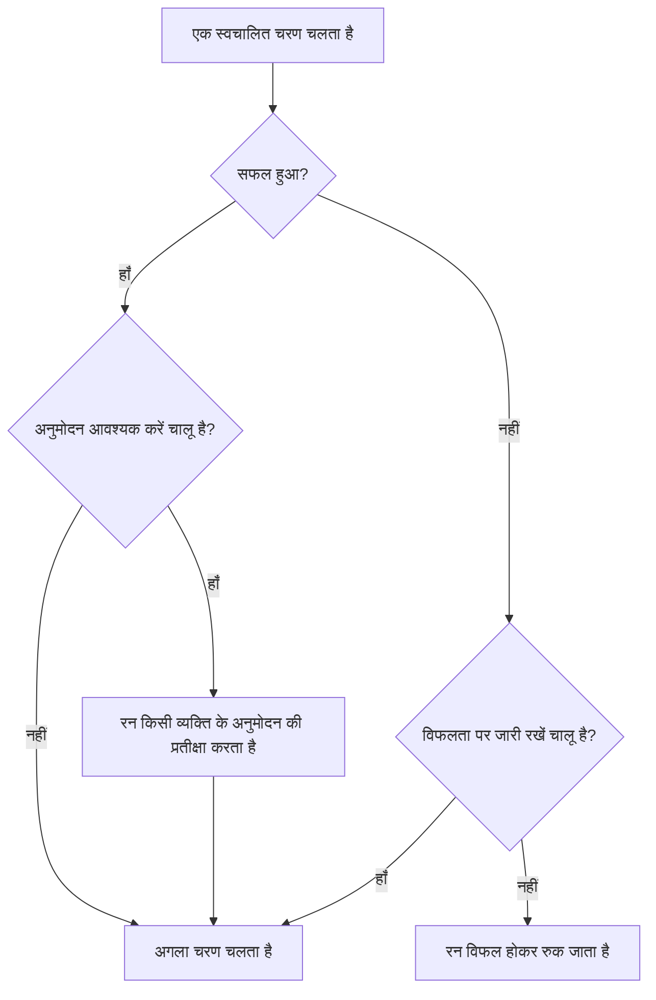

# Runbook लिखना

आप किसी Runbook को उसके **चरण** पेज पर चरणों की क्रमबद्ध सूची के रूप में लिखते हैं। यह पेज बताता है कि Runbook कैसे बनाएँ, सात तरह के चरणों में से हर एक को कैसे सेट करें, और विफलताएँ व अनुमोदन किसी रन की दिशा कैसे बदलते हैं।

:::cards
- [Runbook बनाना](#runbook-बनाना): खाली Runbook से सहेजे गए चरणों तक।
- [चरण के प्रकार](#चरण-के-प्रकार): Manual, JavaScript, HTTP request, Bash, SSH, Kubernetes और AI।
- [विफलता प्रबंधन और अनुमोदन](#विफलता-प्रबंधन-और-अनुमोदन): जब कोई चरण विफल या सफल होता है तो क्या होता है।
- [एक पूरा उदाहरण](#एक-पूरा-उदाहरण): पाँच चरणों में डेटाबेस फ़ेलओवर।
:::

## शुरू करने से पहले

- **Runbook लिखने वाली भूमिका।** Project Owner, Project Admin और Runbook Admin Runbook बनाते हैं और उनके चरण सहेजते हैं। विस्तृत अनुमतियों के साथ आपको **Create Runbook** और **Edit Runbook** चाहिए। [अनुमतियाँ](/docs/runbooks/configuration#अनुमतियाँ) देखें।
- **JavaScript, Bash, SSH और Kubernetes चरणों के लिए एक Runner।** ये चरण आपके अपने इंफ्रास्ट्रक्चर में एक [Runner](/docs/runbooks/agents) पर चलते हैं, कभी OneUptime Worker पर नहीं। पहले एक इंस्टॉल करें।
- **SSH और Kubernetes चरणों के लिए एक क्रेडेंशियल, और उसे पढ़ने की अनुमति।** [Runbook क्रेडेंशियल](/docs/runbooks/credentials) देखें। कोई चरण क्रेडेंशियल का नाम तभी ले सकता है जब आप Runbook क्रेडेंशियल पढ़ सकते हों: Project Owner, Project Admin या **Read Runbook Credential**। Runbook Admin में यह शामिल नहीं है।
- **AI चरणों के लिए एक LLM प्रदाता।** [LLM प्रदाता](/docs/ai/llm-provider) देखें।

## Runbook बनाना

:::steps
### रनबुक खोलें

**उत्पाद → रनबुक** खोलें। Runbook **डैशबोर्ड और ऑटोमेशन** समूह में हैं।

### नया Runbook बनाएँ

**Runbook बनाएँ** पर क्लिक करें, एक **नाम** और चाहें तो Runbook किस काम के लिए है इसका **विवरण** दर्ज करें। **और फ़ील्ड** के नीचे **सक्षम** स्विच है, जो डिफ़ॉल्ट रूप से चालू होता है, और **लेबल** हैं। नया Runbook सूची में दिखता है: उसे खोलें।

### चरण जोड़ें

**चरण** पर जाएँ। **Start your runbook** के नीचे पहले चरण का प्रकार चुनें; आख़िरी चरण के नीचे **Add another step** वही सात प्रकार देता है। हर चरण अपने **शीर्षक**, अपने **विवरण** (Markdown, प्रतिक्रिया देने वाले को दिखता है) और अपने प्रकार की सेटिंग्स के साथ खुलता है। जब Runbook में एक चरण हो जाता है, तो कार्ड के ऊपर **चरण जोड़ें** एक Manual चरण जोड़ता है।

### चरणों को क्रम में रखें

चरण **क्रम से** चलते हैं। क्रम बदलने के लिए किसी चरण को उसके हेडर के बाईं ओर के हैंडल से खींचें; कीबोर्ड से हैंडल पर फ़ोकस करें, Space दबाएँ, ऐरो कुंजियों से चरण को खिसकाएँ और फिर Space दबाएँ।

### चरण सहेजें

**Save Steps** पर क्लिक करें। तब तक एडिटर **सहेजे नहीं गए बदलाव** दिखाता है। सहेजने के बाद आपको **सहेजा गया** दिखता है और Runbook [चलाने](/docs/runbooks/running) के लिए तैयार है।
:::

## चरण की बनावट

हर चरण में ये फ़ील्ड होते हैं:

| फ़ील्ड | उद्देश्य |
| --- | --- |
| **शीर्षक** | एक छोटा लेबल, जो चरणों की सूची और हर रन में दिखता है। |
| **विवरण** | प्रतिक्रिया देने वाले के लिए वैकल्पिक संदर्भ, Markdown में। Manual चरण पर यही वह निर्देश है जिसे व्यक्ति पढ़ता है। |
| **विफलता पर जारी रखें** | केवल स्वचालित चरण। चालू होने पर, विफल चरण रन को नहीं रोकता: अगला चरण फिर भी चलता है। |
| **अनुमोदन आवश्यक करें** | केवल स्वचालित चरण। चालू होने पर, Runbook इस चरण के बाद रुकता है और अगला चरण चलाने से पहले किसी व्यक्ति के अनुमोदन की प्रतीक्षा करता है। स्विच का नाम **अगला चरण चलाने से पहले अनुमोदन आवश्यक करें** है। |
| प्रकार के अनुसार सेटिंग्स | स्क्रिप्ट, URL, Runner, क्रेडेंशियल या प्रॉम्प्ट। [चरण के प्रकार](#चरण-के-प्रकार) देखें। |

## चरण के प्रकार

| प्रकार | कहाँ चलता है | क्या चाहिए |
| --- | --- | --- |
| [Manual](#manual) | एक व्यक्ति | कुछ नहीं |
| [JavaScript](#javascript) | एक Runner | एक Runner |
| [HTTP request](#http-request) | OneUptime Worker | कुछ नहीं |
| [Bash](#bash) | एक Runner | एक Runner |
| [SSH](#ssh) | एक Runner | एक Runner और एक SSH क्रेडेंशियल |
| [Kubernetes](#kubernetes) | एक Runner | एक Runner और एक Kubernetes क्रेडेंशियल |
| [AI](#ai) | OneUptime Worker | एक LLM प्रदाता |

### Manual

किसी व्यक्ति के लिए चेकलिस्ट का एक आइटम। Manual चरण पर पहुँचकर रन रुक जाता है और `WaitingForManualStep` (**आपकी प्रतीक्षा में**) में तब तक रहता है जब तक कोई **Mark complete** या **छोड़ें** पर क्लिक न करे। किसी व्यक्ति की प्रतीक्षा कर रहा रन कभी टाइमआउट नहीं होता।

इसका इस्तेमाल उन कामों के लिए करें जिन्हें केवल इंसान जाँच या कर सकता है: "लोड बैलेंसर डैशबोर्ड में पुष्टि करें कि ट्रैफ़िक सेकेंडरी रीजन पर चला गया है।"

### JavaScript

JavaScript का एक स्निपेट, जो आपके अपने इंफ्रास्ट्रक्चर में एक [Runbook एजेंट](/docs/runbooks/agents) पर `isolated-vm` सैंडबॉक्स में चलता है, OneUptime Worker पर नहीं।

| फ़ील्ड | यह क्या करता है | डिफ़ॉल्ट |
| --- | --- | --- |
| **Runner** | वह Runner जो चरण चलाता है। केवल वही Runner जॉब क्लेम कर सकता है। | — |
| **Script** | चलाने के लिए JavaScript। किसी मान को दर्ज करने के लिए उसे `return` करें; `console.log` की हर पंक्ति भी दर्ज होती है। थ्रो की गई त्रुटि चरण को विफल कर देती है। | — |
| **Execution timeout** | सैंडबॉक्स हटाने से पहले Runner स्निपेट को कितनी देर चलने देता है। | 30 सेकंड |
| **Claim timeout** | Worker कितनी देर तक Runner के जॉब क्लेम करने की प्रतीक्षा करता है। | 2 मिनट |

```javascript
const start = Date.now();
// ... your logic ...
console.log("replica lag checked");
return { durationMs: Date.now() - start };
```

सैंडबॉक्स में 128 MB मेमोरी है और फ़ाइल सिस्टम या प्रोसेस तक कोई पहुँच नहीं है। यह `axios` से HTTP अनुरोध भेज सकता है, लेकिन केवल सार्वजनिक पतों पर: किसी निजी नेटवर्क, Runner के अपने होस्ट या क्लाउड मेटाडेटा एंडपॉइंट पर अनुरोध अस्वीकार कर दिया जाता है। अपने नेटवर्क की किसी सेवा तक पहुँचने के लिए `curl` वाले [Bash](#bash) चरण का इस्तेमाल करें।

### HTTP request

OneUptime Worker द्वारा किया गया एक आउटबाउंड HTTP कॉल। किसी Runner की ज़रूरत नहीं।

| फ़ील्ड | यह क्या करता है | डिफ़ॉल्ट |
| --- | --- | --- |
| **Method** | `GET`, `POST`, `PUT`, `PATCH`, `DELETE` या `HEAD`। | `GET` |
| **URL** | कॉल करने वाला एंडपॉइंट। | ख़ाली |
| **Headers (JSON)** | एक JSON ऑब्जेक्ट, जैसे `{ "Authorization": "Bearer ..." }`। जो हेडर मान्य JSON नहीं हैं, वे चरण को विफल कर देते हैं। | कोई नहीं |
| **Body** | JSON के रूप में पार्स हो सके तो JSON के रूप में भेजा जाता है, नहीं तो टेक्स्ट के रूप में। | कोई नहीं |
| **Request timeout** | चरण विफल होने से पहले एंडपॉइंट के जवाब की कितनी देर प्रतीक्षा करनी है। | 30 सेकंड |

चरण `2xx` या `3xx` जवाब पर सफल होता है और बाक़ी किसी भी जवाब पर `HTTP <status>` त्रुटि के साथ विफल होता है। रीडायरेक्ट फ़ॉलो नहीं किए जाते। जवाब की स्थिति, हेडर और बॉडी 50 KB तक दर्ज होते हैं।

> [!NOTE]
> Worker कभी लूपबैक या लिंक-लोकल पतों को कॉल नहीं करता, जैसे क्लाउड मेटाडेटा एंडपॉइंट। OneUptime Cloud पर यह केवल सार्वजनिक पतों को कॉल करता है। सेल्फ़-होस्टेड OneUptime निजी नेटवर्क तक भी पहुँचता है, जब तक `DATA_SOURCE_BLOCK_PRIVATE_ADDRESSES` का मान `true` न हो। OneUptime Cloud से अपने नेटवर्क की किसी सेवा को कॉल करने के लिए `curl` वाले [Bash](#bash) चरण का इस्तेमाल करें।

इसके लिए उपयोगी: PagerDuty घटना खोलना, Slack webhook पर पोस्ट करना, अपने क्लाउड प्रदाता या अपने सार्वजनिक API को कॉल करना।

### Bash

एक bash स्क्रिप्ट, जो आपके अपने इंफ्रास्ट्रक्चर में एक [Runbook एजेंट](/docs/runbooks/agents) पर `bash -c <script>` से चलती है। Bash कभी OneUptime Worker पर नहीं चलता।

| फ़ील्ड | यह क्या करता है | डिफ़ॉल्ट |
| --- | --- | --- |
| **Runner** | वह Runner जो चरण चलाता है। केवल वही Runner जॉब क्लेम कर सकता है। | — |
| **Bash स्क्रिप्ट** | स्क्रिप्ट। आउटपुट (stdout और stderr) 50 KB तक दर्ज होता है, और शून्य के अलावा कोई भी एग्ज़िट कोड चरण को विफल कर देता है। | — |
| **Execution timeout** | `SIGKILL` से रोकने से पहले Runner स्क्रिप्ट को कितनी देर चलने देता है। जिन चरणों को वाजिब तौर पर मिनट लगते हैं, उनके लिए इसे बढ़ाएँ। | 30 सेकंड |
| **Claim timeout** | Worker कितनी देर तक Runner के जॉब क्लेम करने की प्रतीक्षा करता है। | 2 मिनट |

स्क्रिप्ट Runner के कंटेनर में चलती है, उन टूल के साथ जो उसकी इमेज में आते हैं, जैसे `curl`, `wget` और `ssh` क्लाइंट, और उस होस्ट की नेटवर्क पहुँच के साथ जिस पर वह चल रही है। उदाहरण के लिए, किसी ऐसी सेवा की जाँच करना जिस तक केवल आपका नेटवर्क पहुँच सकता है:

```bash
set -euo pipefail
HTTP_CODE=$(curl -s -o /tmp/resp.txt -w "%{http_code}" "http://payments.internal:8080/health")
echo "HTTP $HTTP_CODE"
cat /tmp/resp.txt
if [[ "$HTTP_CODE" != "200" ]]; then
  echo "Health check failed"
  exit 1
fi
```

अगर रन इस चरण तक पहुँचते समय चुना गया Runner ऑफ़लाइन है, तो चरण **claim timeout** (डिफ़ॉल्ट 2 मिनट) तक प्रतीक्षा करता है और फिर टाइमआउट से विफल हो जाता है। Bash चरण पर भरोसा करने से पहले **रनबुक → Runbook एजेंट** में एक एजेंट जोड़ें।

> [!TIP]
> पासवर्ड और टोकन स्क्रिप्ट से बाहर रखें। उन्हें Runbook सीक्रेट के रूप में सहेजें और Bash या JavaScript स्क्रिप्ट में `{{runbookSecrets.NAME}}` लिखें: Runner को स्क्रिप्ट मान भरकर मिलती है। [स्क्रिप्ट के लिए सीक्रेट](/docs/runbooks/credentials#स्क्रिप्ट-के-लिए-सीक्रेट) देखें।

### SSH

किसी ऐसे होस्ट पर एक कमांड चलाएँ जिस तक Runner SSH से पहुँच सकता है। Bash चरण में `ssh host cmd` के विपरीत, यहाँ एक्सेस Runner की डिस्क पर रखी प्राइवेट की नहीं, बल्कि एक प्रबंधित [क्रेडेंशियल](/docs/runbooks/credentials) है: स्टोरेज में एन्क्रिप्टेड, ख़ास Runner को सौंपा हुआ, और API से फिर कभी पढ़ा न जा सकने वाला।

| फ़ील्ड | यह क्या करता है |
| --- | --- |
| **Runner** | वह Runner जो कनेक्शन खोलता है। उसे नेटवर्क पर होस्ट तक पहुँचना चाहिए। |
| **Credential** | होस्ट, पोर्ट, उपयोगकर्ता और की या पासवर्ड वाला एक SSH क्रेडेंशियल। इसे आपके चुने हुए Runner को सौंपा होना चाहिए, नहीं तो चरण ग़लत एक्सेस से चलने के बजाय विफल हो जाता है। |
| **Command** | रिमोट होस्ट पर क्रेडेंशियल के उपयोगकर्ता के रूप में चलती है। आउटपुट 50 KB तक दर्ज होता है, और शून्य के अलावा कोई भी एग्ज़िट कोड चरण को विफल कर देता है। |
| **Execution timeout** | कनेक्ट करने, प्रमाणीकरण और कमांड चलाने, तीनों को मिलाकर गिनता है, ताकि अटकी हुई कमांड चरण को खुला न रख सके। डिफ़ॉल्ट 30 सेकंड। |
| **Claim timeout** | Worker कितनी देर तक Runner के जॉब क्लेम करने की प्रतीक्षा करता है। डिफ़ॉल्ट 2 मिनट। |

### Kubernetes

किसी क्लस्टर में वर्कलोड को रीस्टार्ट या स्केल करें। कार्रवाइयाँ जानबूझकर एक बंद सेट हैं: जो चरण मनमाने ऑब्जेक्ट बदल सके, वह क्लस्टर-एडमिन शेल होगा, और यह चरण प्रकार इसलिए है ताकि आम सुधार ऑटो-रेमेडिएशन के लिए पर्याप्त सुरक्षित हों।

| फ़ील्ड | यह क्या करता है |
| --- | --- |
| **Runner** | वह Runner जो क्लस्टर के API सर्वर को कॉल करता है। उसे API सर्वर तक पहुँचना चाहिए। |
| **Credential** | एक Kubernetes क्रेडेंशियल: API सर्वर का URL, एक सर्विस अकाउंट टोकन और क्लस्टर का CA। उस सर्विस अकाउंट को ऐसी भूमिका से बाँधें जो केवल वही अनुमति दे जो आपके Runbook को चाहिए। |
| **कार्रवाई** | **Restart workload** पॉड टेम्पलेट को पैच करता है ताकि कंट्रोलर पॉड दोबारा बनाए, जैसा `kubectl rollout restart` करता है। **Scale workload** रेप्लिका की संख्या सेट करता है। |
| **Workload kind** | **परिनियोजन**, **StatefulSet** या **DaemonSet**। |
| **नेमस्पेस** और **Workload name** | वह वर्कलोड जिस पर कार्रवाई करनी है। |
| **प्रतिकृतियां** | केवल स्केल करने पर। शून्य की अनुमति है: किसी वर्कलोड को ख़ाली करना एक वैध सुधार है। DaemonSet हर नोड पर एक पॉड चलाता है और स्केल नहीं किया जा सकता; उसकी जगह उसे रीस्टार्ट करें। |
| **Execution timeout** | Runner कितनी देर तक API सर्वर के बदलाव स्वीकार करने की प्रतीक्षा करता है। डिफ़ॉल्ट 30 सेकंड। |
| **Claim timeout** | Worker कितनी देर तक Runner के जॉब क्लेम करने की प्रतीक्षा करता है। डिफ़ॉल्ट 2 मिनट। |

अगर API सर्वर बदलाव अस्वीकार करता है, तो उसका अपना संदेश चरण पर दिखता है, इसलिए अनुमति की त्रुटि बताती है कि आपको कौन-सा रोल बाइंडिंग बढ़ाना है।

### AI

रन के बीच में AI से विश्लेषण, सारांश या निर्णय माँगें। जवाब निष्पादन पर उस चरण का आउटपुट बन जाता है। AI चरण OneUptime Worker पर चलते हैं; किसी Runner की ज़रूरत नहीं।

| फ़ील्ड | यह क्या करता है |
| --- | --- |
| **Prompt** | AI को क्या करना है। उदाहरण: "पिछले चरणों का आउटपुट देखें और बताएँ कि सुधार जारी रखना सुरक्षित है या नहीं।" |
| **LLM provider** | वैकल्पिक। **Project default** प्रोजेक्ट का डिफ़ॉल्ट प्रदाता इस्तेमाल करता है। जब चरण को कोई ख़ास मॉडल चाहिए, जैसे ऐसे डेटा के लिए सेल्फ़-होस्टेड मॉडल जिसे आपके नेटवर्क से बाहर नहीं जाना चाहिए, तो एक प्रदाता तय करें। [LLM प्रदाता](/docs/ai/llm-provider) देखें। |
| **Include previous step context** | चालू होने पर, AI इस चरण से पहले चले सभी चरणों के बारे में सब कुछ देखता है: शीर्षक, प्रकार, स्थिति, आउटपुट और त्रुटि संदेश। उसे हर चरण के आउटपुट के 4,000 अक्षर तक मिलते हैं। |
| **Include trigger context** | चालू होने पर, AI देखता है कि रन किसने शुरू किया: जुड़ी हुई घटना, अलर्ट या अनुसूचित रखरखाव इवेंट (विवरण, गंभीरता, मौजूदा स्थिति, प्रभावित मॉनिटर, मूल कारण, स्थिति टाइमलाइन और सार्वजनिक नोट), या वह व्यक्ति जिसने Runbook को मैन्युअल रूप से चलाया। |

किसी इंसान को प्रक्रिया में बनाए रखने के लिए AI चरण को **अनुमोदन आवश्यक करें** के साथ जोड़ें: AI विश्लेषण करता है, एक व्यक्ति जवाब पढ़कर अनुमोदन करता है, और उसके बाद ही अगला (सुधार वाला) चरण चलता है।

**AI क्या कभी नहीं देखता।** AI चरण का जवाब निष्पादन पर चरण के आउटपुट के रूप में सहेजा जाता है, और निष्पादन को Runbook पढ़ने की अनुमति वाला कोई भी व्यक्ति पढ़ सकता है, जो घटना देखने वालों से बड़ा समूह है। इसलिए ट्रिगर संदर्भ में **निजी आंतरिक नोट** और **Slack और Microsoft Teams के चैनल संदेश** शामिल नहीं होते। पिछले चरणों के आउटपुट को सीक्रेट (टोकन, की, क्रेडेंशियल) के लिए स्कैन किया जाता है, और मॉडल को भेजने से पहले उन्हें छिपा दिया जाता है। एम्बेड की गई इमेज और लंबा एन्कोडेड डेटा, जैसे किसी घटना के विवरण में चिपकाया गया स्क्रीनशॉट, भी छोड़ दिया जाता है और उसकी जगह एक छोटा नोट रहता है।

AI चरणों को किसी भी दूसरी AI सुविधा की तरह मापा और बिल किया जाता है। चरण कारण बताने वाले संदेश के साथ विफल होता है जब उसका कोई प्रॉम्प्ट न हो, प्रोजेक्ट के लिए AI सुविधाएँ बंद हों, कोई LLM प्रदाता उपलब्ध न हो, या तय किया गया प्रदाता अब प्रोजेक्ट के लिए उपलब्ध न हो। अगर बाक़ी Runbook फिर भी चलना चाहिए, तो **विफलता पर जारी रखें** चालू करें।

## विफलता प्रबंधन और अनुमोदन



डिफ़ॉल्ट रूप से विफल चरण रन को रोक देता है और निष्पादन को `Failed` के रूप में चिह्नित करता है, चरण की त्रुटि को कारण बनाकर। **विफलता पर जारी रखें** चालू होने पर विफलता दर्ज होती है और अगला चरण चलता है, जो "ये तीन चीज़ें आज़माओ, फिर सूचना दो" जैसे Runbook के लिए ठीक है। **अनुमोदन आवश्यक करें** किसी चरण के सफल होने के बाद लागू होता है: रन उस चरण पर तब तक रुकता है जब तक कोई **Approve & continue** या **छोड़ें** पर क्लिक न करे।

## सहेजना और संपादित करना

चरणों में बदलाव तब लागू होते हैं जब आप **Save Steps** पर क्लिक करते हैं। हर रन उस स्नैपशॉट से काम करता है जो उसके शुरू होने पर लिया गया था, इसलिए चल रहे निष्पादन अपने शुरुआती चरण ही रखते हैं, और संपादन कभी पिछले रन का इतिहास नहीं बदलता।

## एक पूरा उदाहरण

"DB primary unreachable" के लिए एक Runbook:

| # | प्रकार | यह क्या करता है |
| --- | --- | --- |
| 1 | JavaScript | आपकी कॉन्फ़िगरेशन सेवा से मौजूदा प्राइमरी होस्ट लाएँ और उसे लॉग करें। |
| 2 | Manual | "पुष्टि करें कि सेकेंडरी पर रेप्लिकेशन लैग 5 सेकंड से कम है।" |
| 3 | HTTP request | आपके फ़ेलओवर ऑर्केस्ट्रेटर API को `POST`। |
| 4 | Manual | "जाँचें कि राइट अब नए प्राइमरी पर जा रहे हैं।" |
| 5 | HTTP request | Slack webhook पर ऑल-क्लियर संदेश का `POST`। |

प्रतिक्रिया देने वाला चरण 1 को चलते देखता है, चरण 2 पर टिक करता है, चरण 3 को चलते देखता है, चरण 4 पर टिक करता है, और रन चरण 5 के साथ ख़त्म होता है। हर चरण का आउटपुट पोस्टमॉर्टम के लिए दर्ज होता है।

## अगले कदम

:::cards
- [Runbook चलाना](/docs/runbooks/running): एक रन शुरू करें, और उसके चरण पूरे करें, अनुमोदित करें या छोड़ें।
- [Runbook नियम](/docs/runbooks/rules): मेल खाने वाली घटनाओं पर इस Runbook को अपने-आप शुरू करें।
- [Runbook एजेंट](/docs/runbooks/agents): वह Runner इंस्टॉल करें जिसकी आपके स्क्रिप्ट चरणों को ज़रूरत है।
- [Runbook क्रेडेंशियल](/docs/runbooks/credentials): SSH और Kubernetes चरणों को प्रबंधित एक्सेस दें।
:::
