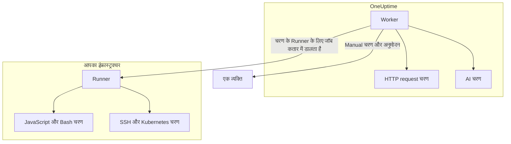

# Runbook कॉन्फ़िगरेशन और सुरक्षा

यह ऑपरेटरों और सुरक्षा समीक्षकों के लिए संदर्भ है: हर तरह का चरण कहाँ चलता है, किसी चरण पर कौन-सी सीमाएँ और टाइमआउट लागू होते हैं, कौन क्या कर सकता है, और Runbook को कैसे सुरक्षित बनाया गया है।

:::cards
- [हर चरण प्रकार कहाँ चलता है](#हर-चरण-प्रकार-कहाँ-चलता-है): Worker, कोई Runner या कोई व्यक्ति।
- [आउटपुट सीमाएँ और टाइमआउट](#आउटपुट-सीमाएँ-और-टाइमआउट): किसी चरण पर लागू हर सीमा।
- [अनुमतियाँ](#अनुमतियाँ): विस्तृत अनुमतियाँ, तीन Runbook भूमिकाएँ, और कोई भूमिका किन Runbook तक पहुँचती है।
- [हार्डनिंग नोट](#हार्डनिंग-नोट): सैंडबॉक्सिंग, नेटवर्क पहुँच और Runner प्रमाणीकरण।
:::

## हर चरण प्रकार कहाँ चलता है

| चरण का प्रकार | कहाँ चलता है | कैसे |
| --- | --- | --- |
| Manual | एक व्यक्ति | रन तब तक प्रतीक्षा करता है जब तक कोई चरण पूरा न करे या छोड़ न दे। |
| JavaScript | एक Runner | एक `isolated-vm` सैंडबॉक्स में। |
| HTTP request | OneUptime Worker | एक आउटबाउंड HTTP कॉल। |
| Bash | एक Runner | `bash -c <script>`। |
| SSH | एक Runner | एक [क्रेडेंशियल](/docs/runbooks/credentials) के साथ SSH कनेक्शन। |
| Kubernetes | एक Runner | क्रेडेंशियल के साथ क्लस्टर के API सर्वर को कॉल। |
| AI | OneUptime Worker | प्रोजेक्ट के LLM प्रदाता को कॉल। |

## Runner चरण कैसे भेजे जाते हैं

JavaScript, Bash, SSH और Kubernetes चरण **कभी OneUptime Worker पर नहीं चलते**। उन्हें जॉब के रूप में किसी ख़ास [Runbook एजेंट](/docs/runbooks/agents) को भेजा जाता है: एक छोटी प्रोसेस जिसे आप अपने इंफ्रास्ट्रक्चर के किसी होस्ट पर इंस्टॉल करते हैं।

भेजने का मॉडल:

1. Runbook चरण लिखने वाला चरण लिखते समय ड्रॉपडाउन से एक Runner चुनता है।
2. जब चरण चलता है, तो Worker `RunnerJob` में एक पंक्ति डालता है, जिसमें `targetAgentId` उस Runner की ID पर और स्थिति `Pending` पर सेट होती है।
3. वही Runner (और केवल वही) जॉब को एटॉमिक रूप से क्लेम करता है, उसे लोकल रूप से चलाता है — Bash `bash -c <script>` से, JavaScript `isolated-vm` सैंडबॉक्स में, SSH और Kubernetes चरण के क्रेडेंशियल के साथ — और परिणाम वापस भेजता है।
4. Worker उस परिणाम के साथ Runbook फिर से शुरू करता है।

अब कोई `RUNBOOK_BASH_ENABLED` एनवायरनमेंट फ़्लैग नहीं है। किसी डिप्लॉयमेंट में ये चरण काम करते हैं या नहीं, यह पूरी तरह इस पर निर्भर है कि प्रोजेक्ट में **Runbook चलाता है** चालू वाला कोई कनेक्टेड Runner है या नहीं।

## आउटपुट सीमाएँ और टाइमआउट

| सीमा | मान | किस पर लागू |
| --- | --- | --- |
| हर चरण का आउटपुट | **50 KB**। इससे लंबा आउटपुट एक मार्कर के साथ काट दिया जाता है। | हर स्वचालित चरण |
| निष्पादन टाइमआउट | डिफ़ॉल्ट रूप से **30 सेकंड** | JavaScript, Bash, SSH और Kubernetes चरण |
| अनुरोध टाइमआउट | डिफ़ॉल्ट रूप से **30 सेकंड** | HTTP request चरण |
| क्लेम टाइमआउट | डिफ़ॉल्ट रूप से **2 मिनट**: जॉब को विफल करने से पहले Worker कितनी देर तक चुने गए Runner के उसे उठाने की प्रतीक्षा करता है | JavaScript, Bash, SSH और Kubernetes चरण |
| टाइमआउट की सीमा | **1 सेकंड से 1 घंटा** | हर टाइमआउट |
| किसी व्यक्ति की प्रतीक्षा | कोई सीमा नहीं | Manual चरण और अनुमोदन |

टाइमआउट हर चरण के लिए Runbook के **चरण** पेज पर सेट करें; डिफ़ॉल्ट रखने के लिए फ़ील्ड ख़ाली छोड़ें। सीमा से बाहर का मान चरण चलते समय सीमा में ले आया जाता है, ताकि ग़लत टाइप हुई कॉन्फ़िगरेशन न तो टाइमआउट बंद कर सके और न किसी Worker स्लॉट को अनिश्चित काल तक घेरे रख सके।

## अनुमतियाँ

Runbook अनुमतियाँ `Runbook` अनुमति समूह में हैं:

- `CreateRunbook`, `EditRunbook`, `DeleteRunbook`, `ReadRunbook` — Runbook टेम्पलेट प्रबंधित करें।
- `CreateRunbookExecution`, `EditRunbookExecution`, `DeleteRunbookExecution`, `ReadRunbookExecution` — निष्पादन शुरू करें, टिक करें, हटाएँ और पढ़ें।
- `CreateRunbookRule`, `EditRunbookRule`, `DeleteRunbookRule`, `ReadRunbookRule` — ऑटो-ट्रिगर नियम प्रबंधित करें।
- `CreateRunner`, `EditRunner`, `DeleteRunner`, `ReadRunner` — वे Runner प्रबंधित करें जो आपके अपने इंफ्रास्ट्रक्चर में चरण चलाते हैं। (Runner नाम रखे जाने से पहले इन्हें `*RunbookAgent` कहा जाता था; मौजूदा अनुमतियाँ माइग्रेट कर दी गई हैं, इसलिए कुछ दोबारा सौंपने की ज़रूरत नहीं।)
- `RunbookAdmin`, `RunbookMember`, `RunbookViewer` (भूमिकाएँ) — `RunbookAdmin` Runbook, उनके नियम और जिन Runner पर वे चलते हैं उन्हें बनाता है, और उन्हें चलाता है। `RunbookMember` Runbook और उनके रन खोलता है और उन्हें चलाता है — रन शुरू करता है, उसके चरण पूरे करता है या छोड़ता है और उसे रद्द करता है — लेकिन कोई Runbook या Runner बनाता, बदलता या हटाता नहीं। `RunbookViewer` Runbook और उनके रन पढ़ता है और कुछ नहीं चलाता। `RunbookAdmin` ऊपर की सभी विस्तृत अनुमतियाँ समेटता है।

कोई भूमिका वही Runbook चलाती है जिन तक उसका दायरा पहुँचता है। कुछ लेबल तक सीमित `RunbookMember`, `RunbookAdmin` या `ProjectMember` अनुदान उन लेबल वाले Runbook के रन शुरू करता और आगे बढ़ाता है, **Owned** तक सीमित अनुदान उन Runbook के जो उसकी टीम के हैं, और किसी टीम का किसी लेबल पर ब्लॉक उन Runbook को उससे हटा देता है। `CreateRunbookExecution` और `EditRunbookExecution` रन से जुड़ी हैं, जिन पर कोई लेबल नहीं होता, इसलिए वे प्रोजेक्ट के हर Runbook तक पहुँचती हैं। Runbook शुरू करने वाले किसी उपचार सुझाव का अनुमोदन भी इसी तरह जाँचा जाता है।

क्रेडेंशियल और सीक्रेट `RunbookAdmin` से बाहर हैं। उन्हें प्रबंधित करने के लिए `ProjectOwner` या `ProjectAdmin`, या `CreateRunbookCredential`, `EditRunbookCredential`, `DeleteRunbookCredential`, `ReadRunbookCredential` और `CreateRunbookSecret`, `EditRunbookSecret`, `DeleteRunbookSecret`, `ReadRunbookSecret` अनुमतियाँ चाहिए। [Runbook क्रेडेंशियल](/docs/runbooks/credentials) देखें।

**रनबुक → सेटिंग्स** के नीचे के स्वामी नियम और लेबल नियम भी `RunbookAdmin` से बाहर हैं। उन्हें प्रबंधित करने के लिए `ProjectOwner` या `ProjectAdmin`, या `CreateRunbookOwnerRule` और `CreateRunbookLabelRule` अनुमतियाँ और उनकी संपादन, हटाने और पढ़ने वाली संगत अनुमतियाँ चाहिए।

भूमिकाएँ और विस्तृत अनुमतियाँ कैसे मिलकर काम करती हैं, इसके लिए [उपयोगकर्ता, टीमें और अनुमतियाँ](/docs/permissions/index) देखें।

## कतार और worker

Runbook निष्पादन `Runbook` BullMQ कतार पर चलते हैं। हर Worker प्रोसेस एक साथ 25 निष्पादन तक चलाती है; यह संख्या कोड में तय है, किसी एनवायरनमेंट वेरिएबल से सेट नहीं होती।

जब API से कोई मैन्युअल चरण टिक किया जाता है, तो निष्पादन अगले चरण से जारी रखने के लिए फिर कतार में डाला जाता है। यह `Scheduled` के रूप में तब तक प्रतीक्षा करता है जब तक कोई Worker इसे फिर न उठाए, और कतार में रखा निष्पादन प्रतीक्षा करने की वजह से कभी विफल नहीं होता।

## हार्डनिंग नोट

- **JavaScript, Bash, SSH और Kubernetes** आपके नियंत्रण वाले Runner होस्ट पर चलते हैं, OneUptime Worker पर नहीं। JavaScript एक अलग `isolated-vm` आइसोलेट में 128 MB मेमोरी के साथ चलता है, बिना Runner के फ़ाइल सिस्टम या प्रोसेस तक पहुँच के; यह `axios` से HTTP अनुरोध भेज सकता है, लेकिन निजी नेटवर्क, लूपबैक और लिंक-लोकल पतों पर अनुरोध अस्वीकार किए जाते हैं। Bash `bash -c` से चलता है, और उसका टाइमआउट Runner पर लागू होता है।
- **HTTP चरण** एक उदार स्थिति वैलिडेटर इस्तेमाल करते हैं, इसलिए 4xx या 5xx जवाब एक्सेप्शन के रूप में थ्रो होने के बजाय विफल चरण के रूप में दर्ज होता है, और दर्ज आउटपुट वही दिखाता है जो दूसरी तरफ़ ने असल में लौटाया। रीडायरेक्ट फ़ॉलो नहीं किए जाते। Worker कभी लूपबैक या लिंक-लोकल पतों को कॉल नहीं करता, जैसे क्लाउड मेटाडेटा एंडपॉइंट; OneUptime Cloud पर यह निजी नेटवर्क पते भी अस्वीकार करता है, और सेल्फ़-होस्टेड OneUptime उन्हें `DATA_SOURCE_BLOCK_PRIVATE_ADDRESSES=true` के साथ अस्वीकार करता है।
- **AI चरण** कभी निजी घटना नोट या Slack और Microsoft Teams संदेश नहीं देखते, और पिछले चरणों के आउटपुट को मॉडल तक पहुँचने से पहले सीक्रेट के लिए स्कैन करके उन्हें छिपा दिया जाता है। एम्बेड की गई इमेज और लंबा एन्कोडेड डेटा प्रॉम्प्ट से बाहर रखा जाता है। [AI](/docs/runbooks/authoring#ai) देखें।
- **Runner प्रमाणीकरण** ID और सीक्रेट कुंजी से होता है, जो Runner कंटेनर पर एनवायरनमेंट वेरिएबल के रूप में सेट होती हैं। सर्वर पर Runner की प्रामाणिक पहचान प्रस्तुत ID और कुंजी वाली डेटाबेस पंक्ति से आती है: कोई क्लाइंट समझौता हुई कुंजी के साथ भी किसी दूसरे Runner का रूप नहीं ले सकता।
- **क्रेडेंशियल और सीक्रेट** स्टोरेज में एन्क्रिप्टेड हैं, API उन्हें कभी नहीं लौटाता, और वे केवल उन्हीं Runner को दिए जाते हैं जिन्हें वे सौंपे गए हैं, जब वे कोई चरण क्लेम करते हैं।

## डेटाबेस तालिकाएँ

| तालिका | इसमें क्या है |
| --- | --- |
| `Runbook` | टेम्पलेट: नाम, slug, विवरण, `isEnabled`, लेबल और JSON के रूप में चरण। |
| `RunbookExecution` | हर रन के लिए एक पंक्ति, जिसमें नल हो सकने वाली `incidentId`, `alertId` और `scheduledMaintenanceId` फ़ॉरेन की हैं और एक JSON `stepExecutions` ऐरे है जो चरणों और हर चरण की स्थिति का स्नैपशॉट रखता है। |
| `RunbookRule` | ऑटो-ट्रिगर नियम, जिनमें एक `triggerEntityType` डिस्क्रिमिनेटर (Incident, Alert, ScheduledMaintenance), शुरू करने वाले Runbook से मेनी-टू-मेनी संबंध, और वे चीज़ें हैं जिन पर वे मेल खाते हैं: एक JSON `criteria` कॉलम (शर्तें), साथ में मॉनिटर, घटना गंभीरता, अलर्ट गंभीरता, लेबल और मॉनिटर लेबल से मेनी-टू-मेनी लिंक, और शीर्षक, विवरण, मॉनिटर नाम और मॉनिटर विवरण के पैटर्न। |
| `Runner` | हर इंस्टॉल किए गए Runner के लिए एक पंक्ति: नाम, सीक्रेट कुंजी, `lastAlive`, `connectionStatus`, होस्ट जानकारी और क्षमताएँ। |
| `RunnerJob` | Runner को भेजे गए हर चरण के लिए एक पंक्ति: `targetAgentId` (चरण लिखने वाले द्वारा चुना गया Runner), चरण का प्रकार, स्क्रिप्ट या पेलोड, स्थिति (`Pending` → `Claimed` → `Running` → `Succeeded`, `Failed`, `TimedOut` या `Cancelled`), क्लेम की समय-सीमा, लीज़, आउटपुट और एग्ज़िट कोड। |
| `RunbookCredential` | SSH और Kubernetes क्रेडेंशियल, एन्क्रिप्ट किए गए सीक्रेट फ़ील्ड के साथ, और वे Runner जिन्हें वे सौंपे गए हैं। |
| `RunbookSecret` | एन्क्रिप्ट किए गए Runbook सीक्रेट, और वे Runner जो उन्हें पा सकते हैं। |

## संचालन संबंधी सुझाव

- **पक्का करें कि किसी चरण पर चुना गया Runner स्वस्थ है।** अगर आपको रिडंडेंसी चाहिए, तो दूसरा Runner चलाएँ और अपने चरण उनके बीच बाँटें, या दूसरे Runner को लक्षित करने वाला एक बैकअप Runbook रखें।
- **ब्लॉब नहीं, URL दर्ज करें।** अगर कोई चरण कुछ KB से ज़्यादा आउटपुट बनाता है, तो उसे ऑब्जेक्ट स्टोरेज या अपने लॉगिंग स्टैक में लिखें और URL लौटाएँ।
- **आइडेम्पोटेंसी मायने रखती है।** अगर Worker चरण के बीच में रीस्टार्ट हो और रन फिर से शुरू हो, तो HTTP request या AI चरण दोबारा चलता है। Runner पर चरण हर निष्पादन में अधिकतम एक बार भेजा जाता है, लेकिन हो सकता है कि किसी विफलता से पहले स्क्रिप्ट आंशिक रूप से चली हो, और आप Runbook फिर से चला सकते हैं। चरण ऐसे बनाएँ कि उन्हें दोबारा चलाना सुरक्षित हो।

## अगले कदम

:::cards
- [Runbook एजेंट](/docs/runbooks/agents): Runner इंस्टॉल करें, संचालित करें और उनकी समस्याएँ सुलझाएँ।
- [Runbook क्रेडेंशियल](/docs/runbooks/credentials): प्रबंधित SSH और Kubernetes एक्सेस, और स्क्रिप्ट के लिए सीक्रेट।
- [उपयोगकर्ता, टीमें और अनुमतियाँ](/docs/permissions/index): भूमिकाएँ, लेबल और टीमें कैसे तय करती हैं कि कौन क्या चलाता है।
:::
