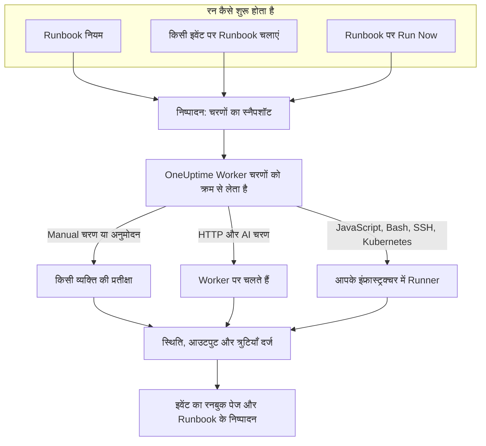

# Runbook का अवलोकन

Runbook एक दोबारा इस्तेमाल होने वाली प्रतिक्रिया प्रक्रिया है: मैन्युअल और स्वचालित चरणों की एक क्रमबद्ध सूची, जिसे आप किसी घटना, अलर्ट या अनुसूचित रखरखाव इवेंट पर चलाते हैं। यह "अब क्या करें?" वाली बातचीत को एक चेकलिस्ट में बदल देता है, जिसे ऑन-कॉल पर मौजूद कोई भी व्यक्ति रात 3 बजे भी अपना सकता है, और स्क्रिप्ट, API कॉल और अनुमोदन पहले से लिखे होते हैं। Runbook उन ऑन-कॉल इंजीनियरों के लिए हैं जो घटनाओं पर प्रतिक्रिया देते हैं, और उन प्लेटफ़ॉर्म टीमों के लिए जो उस प्रतिक्रिया को स्वचालित करती हैं।

:::cards
- [Runbook लिखना](/docs/runbooks/authoring): एक Runbook बनाएँ और उसके चरण लिखें।
- [Runbook नियम](/docs/runbooks/rules): नई घटनाओं, अलर्ट और रखरखाव इवेंट पर Runbook शुरू करें।
- [Runbook चलाना](/docs/runbooks/running): एक रन शुरू करें, उसके चरण पूरे और अनुमोदित करें, उसे रद्द करें।
- [Runbook एजेंट](/docs/runbooks/agents): वह Runner इंस्टॉल करें जो आपकी स्क्रिप्ट आपके अपने इंफ्रास्ट्रक्चर में चलाता है।
:::

## Runbook कैसे चलता है



हर रन एक **निष्पादन** होता है। जब यह शुरू होता है, तो Runbook के चरण उस पर कॉपी हो जाते हैं, और OneUptime उन्हें क्रम से पूरा करता है। Manual चरण, या अनुमोदन की ज़रूरत वाला चरण, रन को तब तक रोक देता है जब तक कोई कार्रवाई न करे।

HTTP और AI चरण OneUptime Worker पर चलते हैं। JavaScript, Bash, SSH और Kubernetes चरण एक [Runner](/docs/runbooks/agents) पर चलते हैं जिसे आप अपने इंफ्रास्ट्रक्चर में इंस्टॉल करते हैं, इसलिए आपकी स्क्रिप्ट कभी OneUptime के सर्वर पर नहीं चलतीं। हर चरण की स्थिति, आउटपुट और त्रुटि संदेश निष्पादन पर दर्ज होते हैं, और निष्पादन उसी घटना, अलर्ट या इवेंट के साथ रहता है जिसके लिए वह चला था।

## मुख्य अवधारणाएँ

| अवधारणा | अर्थ |
| --- | --- |
| **Runbook** | टेम्पलेट। एक नाम वाली, दोबारा इस्तेमाल होने वाली प्रक्रिया, जिसमें चरणों की क्रमबद्ध सूची और **इस Runbook को चलाएं** स्विच होता है। |
| **चरण** | Runbook का एक आइटम। इसका एक प्रकार (Manual, JavaScript, HTTP request, Bash, SSH, Kubernetes या AI), शीर्षक, विवरण और प्रकार के अनुसार सेटिंग्स होती हैं। |
| **Runbook नियम** | एक नियम जो अपनी शर्तों (मॉनिटर, गंभीरता, लेबल, मॉनिटर लेबल, शीर्षक या विवरण) से मेल खाने वाली घटनाओं, अलर्ट या अनुसूचित रखरखाव इवेंट से एक या अधिक Runbook को अपने-आप जोड़ता है। |
| **निष्पादन** | Runbook का एक रन। यह तब बनता है जब कोई नियम ट्रिगर होता है, कोई किसी इवेंट पर **Runbook चलाएं** पर क्लिक करता है, या कोई Runbook पर ही **Run Now** पर क्लिक करता है। इसमें चरणों का स्नैपशॉट और हर चरण की स्थिति व आउटपुट रहता है। |
| **स्नैपशॉट** | Runbook के चरणों की स्थिर प्रति, जो हर निष्पादन पर रहती है। आप बाद में Runbook संपादित कर सकते हैं, बिना पिछले रन का इतिहास बदले। |
| **Runner** | एक छोटा एजेंट जिसे आप अपने इंफ्रास्ट्रक्चर के किसी होस्ट पर चलाते हैं। यह उन JavaScript, Bash, SSH और Kubernetes चरणों को चलाता है जो इसका नाम लेते हैं। इसे Runbook एजेंट भी कहा जाता है। |
| **क्रेडेंशियल** | प्रबंधित SSH या Kubernetes एक्सेस, जिसका इस्तेमाल SSH और Kubernetes चरण करते हैं। स्टोरेज में एन्क्रिप्टेड, और केवल उन्हीं Runner को दिया जाता है जिन्हें आप इसे सौंपते हैं। |
| **सीक्रेट** | एक अकेला मान, जैसे API टोकन, जिसे Bash या JavaScript स्क्रिप्ट `{{runbookSecrets.NAME}}` के रूप में इस्तेमाल करती है। स्टोरेज में एन्क्रिप्टेड, और केवल उन्हीं Runner को दिया जाता है जिन्हें आप इसे सौंपते हैं। |

## चरण के प्रकार

हर चरण के लिए उपयुक्त प्रकार चुनें। [Runbook लिखना](/docs/runbooks/authoring) हर प्रकार की सेटिंग्स बताता है।

| चरण का प्रकार | कहाँ चलता है | कब इस्तेमाल करें | उदाहरण |
| --- | --- | --- | --- |
| **Manual** | एक व्यक्ति | किसी इंसान को कुछ जाँचना, निर्णय लेना या वह करना है जो OneUptime नहीं कर सकता। | "पुष्टि करें कि ट्रैफ़िक सेकेंडरी रीजन पर चला गया है।" |
| **JavaScript** | एक Runner | आपको सैंडबॉक्स में एक छोटी, सीमित गणना चाहिए। | रेप्लिका लैग की गणना करें और तय करें कि आगे बढ़ना है या नहीं। |
| **HTTP request** | OneUptime Worker | आप किसी मौजूदा API को कॉल कर रहे हैं: क्लाउड प्रदाता, PagerDuty, Slack webhook, आपकी अपनी सेवा। | आपके फ़ेलओवर ऑर्केस्ट्रेटर को `POST`। |
| **Bash** | एक Runner | आपको अपने इंफ्रास्ट्रक्चर पर शेल कमांड चाहिए। | `kubectl rollout restart` या कोई रिकवरी स्क्रिप्ट चलाएँ। |
| **SSH** | एक Runner | आपको प्रबंधित SSH क्रेडेंशियल के साथ किसी रिमोट होस्ट पर एक कमांड चलानी है। | किसी वेब सर्वर पर सेवा रीस्टार्ट करें। |
| **Kubernetes** | एक Runner | आपको किसी Deployment, StatefulSet या DaemonSet को रीस्टार्ट या स्केल करना है। | `production` में `checkout-api` रीस्टार्ट करें। |
| **AI** | OneUptime Worker | आप रन के बीच में अपने प्रोजेक्ट के LLM प्रदाता से विश्लेषण, सारांश या निर्णय चाहते हैं। | "ऊपर के डायग्नोस्टिक्स देखें। क्या फ़ेलओवर करना सुरक्षित है?" |

एक Runbook इन सबको मिला सकता है। Runbook की ताक़त मानवीय जाँच को ऑटोमेशन और AI विश्लेषण के साथ जोड़ने में है।

## रन कैसे शुरू होता है

| कैसे | कहाँ | निष्पादन किससे जुड़ता है |
| --- | --- | --- |
| एक Runbook नियम | **घटनाएं** , **अलर्ट** या **अनुसूचित रखरखाव** → **नियम** → **Runbook नियम** | नई घटना, अलर्ट या इवेंट |
| **Runbook चलाएं** | किसी घटना, अलर्ट या अनुसूचित रखरखाव इवेंट का **रनबुक** पेज | वही इवेंट |
| **Run Now** | Runbook का **अवलोकन** पेज | किसी से नहीं: एक तात्कालिक रन |
| एक ऑटो-रेमेडिएशन नियम | [AI SRE](/docs/ai/ai-sre) देखें | घटना या अलर्ट |

जिस Runbook का **इस Runbook को चलाएं** स्विच उसके **सेटिंग्स** पेज पर बंद है, उसे इनमें से कोई तरीका शुरू नहीं करता। जो रन पहले से शुरू हो चुके हैं, वे जारी रहते हैं।

## डैशबोर्ड में Runbook कहाँ हैं

Runbook **उत्पाद** के अंतर्गत **डैशबोर्ड और ऑटोमेशन** समूह में हैं।

| पेज | वहाँ आप क्या करते हैं |
| --- | --- |
| **उत्पाद → रनबुक** | Runbook ब्राउज़ करें, बनाएँ और खोलें। |
| किसी Runbook के **चरण** | उसके चरण लिखें और उनका क्रम बदलें, फिर **Save Steps** चुनें। |
| किसी Runbook का **अवलोकन** | नवीनतम रन और परिणाम देखें, और **Run Now** पर क्लिक करें। |
| किसी Runbook के **निष्पादन** | इस Runbook के सभी रन, स्थिति या शुरू होने की तारीख़ से फ़िल्टर किए हुए। |
| किसी Runbook के **मालिक** | इसके लिए ज़िम्मेदार लोग और टीमें जोड़ें। |
| किसी Runbook की **सेटिंग्स** | Runbook हटाए बिना **इस Runbook को चलाएं** बंद करें। |
| **रनबुक → निष्पादन** | प्रोजेक्ट के सभी Runbook के सभी रन। |
| **रनबुक → Runbook एजेंट** और **रनबुक → Runbook एजेंट → क्रेडेंशियल** | [Runner](/docs/runbooks/agents) इंस्टॉल करें और [क्रेडेंशियल](/docs/runbooks/credentials) प्रबंधित करें। |
| **रनबुक → सेटिंग्स** | स्क्रिप्ट के लिए [सीक्रेट](/docs/runbooks/credentials#स्क्रिप्ट-के-लिए-सीक्रेट) प्रबंधित करें, साथ ही वे **स्वामी नियम** और **लेबल नियम** जो नए Runbook में मालिक और लेबल जोड़ते हैं। |
| **घटनाएं / अलर्ट / अनुसूचित रखरखाव → नियम → Runbook नियम** | वे नियम बनाएँ जो Runbook अपने-आप शुरू करते हैं। |
| कोई घटना, अलर्ट या रखरखाव इवेंट → **रनबुक** | उससे जुड़े रन देखें, और नया शुरू करने के लिए **Runbook चलाएं** पर क्लिक करें। |

## एक पूरा उदाहरण

मान लीजिए कि शीर्षक में "db-primary" वाली हर घटना को पाँच चरणों वाला डेटाबेस फ़ेलओवर Runbook शुरू करना चाहिए।

:::steps
### Runbook बनाएँ

**रनबुक** में **Runbook बनाएँ** पर क्लिक करें और इसका नाम "DB primary failover" रखें। इसे खोलें, **चरण** पर जाएँ, ये चरण जोड़ें, फिर **Save Steps** पर क्लिक करें:

| # | प्रकार | शीर्षक |
| --- | --- | --- |
| 1 | JavaScript | फ़ेलओवर से पहले रेप्लिका लैग दर्ज करें |
| 2 | Manual | DBA डैशबोर्ड में पुष्टि करें कि रेप्लिका स्वस्थ है |
| 3 | HTTP request | फ़ेलओवर ऑर्केस्ट्रेटर को `POST` |
| 4 | Manual | जाँचें कि राइट नए प्राइमरी पर जा रहे हैं |
| 5 | HTTP request | Slack के `#db-incidents` में ऑल-क्लियर भेजें |

### एक नियम जोड़ें

**घटनाएं → नियम → Runbook नियम** में एक शर्त और शुरू करने वाले Runbook के साथ एक नियम बनाएँ:

```text
Conditions:  Incident Title starts with db-primary
Runbooks:    [DB primary failover]
```

### इसे चलने दें

एक मॉनिटर घटना `INC-4821 · db-primary connection timeout` खोलता है। नियम मेल खाता है और एक निष्पादन शुरू होता है:

- चरण 1 (JavaScript) उस Runner पर चलता है जिसे आपने इसके लिए चुना था। इसका रिटर्न मान, जैसे `{ lagMs: 412 }`, दर्ज होता है।
- चरण 2 (Manual) रन को रोकता है, जो **आपकी प्रतीक्षा में** दिखाता है। ऑन-कॉल व्यक्ति डैशबोर्ड जाँचता है और **Mark complete** पर क्लिक करता है।
- चरण 3 (HTTP request) चलता है और `POST` का जवाब दर्ज होता है।
- चरण 4 (Manual) रन को फिर रोकता है, जब तक कोई उसे पूरा न करे।
- चरण 5 (HTTP request) चलता है और निष्पादन **पूर्ण** हो जाता है।

### इसकी समीक्षा करें

निष्पादन घटना के **रनबुक** पेज पर बना रहता है। पोस्टमॉर्टम लिखते समय हर चरण का आउटपुट, त्रुटियाँ और समय एक क्लिक की दूरी पर हैं।
:::

## आम उपयोग

- **डेटाबेस फ़ेलओवर**: JavaScript से स्थिति दर्ज करें, ऑन-कॉल DBA से रेप्लिका की सेहत की पुष्टि करवाएँ (Manual), ऑर्केस्ट्रेटर को कॉल करें (HTTP request), DNS की पुष्टि करें (Manual), ऑल-क्लियर भेजें (HTTP request)।
- **कैश पर्ज**: एक HTTP अनुरोध, फिर एक Manual चरण "पुष्टि करें कि कैश हिट रेट ठीक हो रहा है"।
- **ग्राहकों को प्रभावित करने वाली घटना**: Manual "स्टेटस पेज पर अपडेट पोस्ट करें", सपोर्ट टीम को सूचित करने के लिए एक HTTP अनुरोध, प्रभावित खातों की सूची लाने के लिए JavaScript।
- **अनुसूचित रखरखाव से पहले की जाँच**: मेट्रिक्स का स्नैपशॉट लें, हितधारकों के साथ बदलाव की समय-सीमा की पुष्टि करें (Manual), लोड बैलेंसर पर मेंटेनेंस मोड चालू करें (HTTP request)।
- **पहले निदान, फिर सुधार**: एक Bash चरण डायग्नोस्टिक्स इकट्ठा करता है, **अनुमोदन आवश्यक करें** वाला AI चरण उन्हें पढ़कर सुधार सुझाता है, और Kubernetes चरण किसी व्यक्ति के अनुमोदन के बाद ही वर्कलोड रीस्टार्ट करता है।
- **हमेशा चलने वाली स्वच्छता**: बिना शर्तों वाला एक नियम, जो हर घटना पर पोस्टमॉर्टम के लिए सिस्टम की स्थिति दर्ज करता है।

## Runbook बाक़ी OneUptime में कैसे फ़िट होते हैं

- **मॉनिटर** घटनाएँ और अलर्ट खोलते हैं, और **Runbook नियम** उन्हें Runbook निष्पादन में बदलते हैं: पता लगाना, ट्रिगर करना, प्रतिक्रिया देना, दर्ज करना।
- **[ऑन-कॉल नीतियाँ](/docs/on-call/schedules)** तय करती हैं कि किसे पेज किया जाए। Runbook तय करते हैं कि जागने के बाद वह व्यक्ति क्या करे।
- Slack और Microsoft Teams जैसे **[वर्कस्पेस कनेक्शन](/docs/workspace-connections/slack)** अपडेट पोस्ट करने वाले HTTP अनुरोध चरणों के स्वाभाविक लक्ष्य हैं।
- **[स्टेटस पेज](/docs/status-pages/index)** अक्सर ग्राहक-केंद्रित Runbook में एक Manual चरण के रूप में अपडेट होते हैं।

## अगले कदम

:::cards
- [Runbook लिखना](/docs/runbooks/authoring): अपना पहला Runbook और उसके चरण बनाएँ।
- [Runbook एजेंट](/docs/runbooks/agents): JavaScript, Bash, SSH या Kubernetes चरण लिखने से पहले एक Runner इंस्टॉल करें।
- [Runbook नियम](/docs/runbooks/rules): घटनाएँ बनने पर Runbook अपने-आप शुरू करें।
- [Runbook कॉन्फ़िगरेशन और सुरक्षा](/docs/runbooks/configuration): सीमाएँ, टाइमआउट, अनुमतियाँ और हार्डनिंग।
:::
