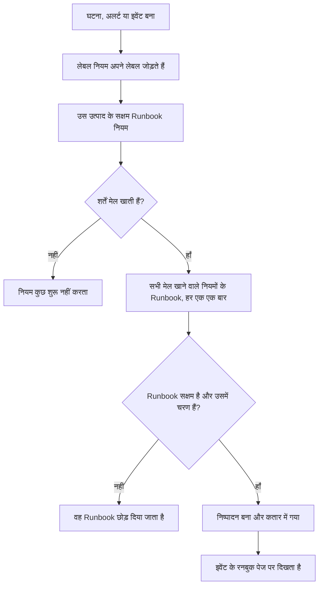

# Runbook नियम

Runbook नियम किसी **घटना**, **अलर्ट** या **अनुसूचित रखरखाव इवेंट** के बनते ही Runbook अपने-आप शुरू कर देते हैं, ताकि आउटेज के बीच किसी को उन्हें चलाना याद न रखना पड़े। हर उत्पाद के **नियम** मेन्यू में उसका अपना नियम पेज होता है:

- घटनाएं → नियम → **Runbook नियम**
- अलर्ट → नियम → **Runbook नियम**
- अनुसूचित रखरखाव → नियम → **Runbook नियम**

तीनों पेज एक ही तरह के नियम संपादित करते हैं, बस उस उत्पाद के नियमों तक फ़िल्टर किए हुए।

:::cards
- [Runbook नियम बनाना](#runbook-नियम-बनाना): चार चरण: एक नाम, शर्तें और शुरू करने वाले Runbook।
- [शर्तें](#शर्तें): हर मानदंड और ऑपरेटर जो कोई नियम इस्तेमाल कर सकता है।
- [मिलान के नियम](#मिलान-के-नियम): कई नियम, मॉनिटर शर्तें और लेबल नियम।
- [उदाहरण](#उदाहरण): कॉपी करने के लिए तीन नियम।
:::

## नियम Runbook कैसे शुरू करता है



जब कोई नियम ट्रिगर होता है, तो उसमें नामित हर Runbook के लिए:

1. Runbook लोड होता है।
2. उसके चरण एक **स्नैपशॉट** के रूप में नए Runbook निष्पादन पर कॉपी होते हैं।
3. निष्पादन Runbook वर्कर की कतार में डाला जाता है।
4. निष्पादन स्रोत इकाई से जुड़ता है: यह घटना, अलर्ट या अनुसूचित रखरखाव इवेंट के **रनबुक** पेज पर और Runbook की **निष्पादन** सूची में दिखता है।

आप हर रन, चाहे नियम ने शुरू किया हो या नहीं, **रनबुक → निष्पादन** में देख सकते हैं, स्थिति, Runbook या शुरू होने की तारीख़ से फ़िल्टर करके।

## शुरू करने से पहले

- **एक Runbook जो चल सके।** उसमें कम से कम एक चरण होना चाहिए और उसके **सेटिंग्स** पेज पर **इस Runbook को चलाएं** चालू होना चाहिए। [Runbook लिखना](/docs/runbooks/authoring) देखें।
- **नियम प्रबंधित करने की अनुमति।** Project Owner, Project Admin और Runbook Admin Runbook नियम बनाते हैं, और **Create Runbook Rule** अनुमति वाला कोई भी व्यक्ति भी।

## Runbook नियम बनाना

:::steps
### Runbook नियम खोलें

**घटनाएं**, **अलर्ट** या **अनुसूचित रखरखाव** में **नियम → Runbook नियम** खोलें और **Runbook Rule बनाएँ** पर क्लिक करें।

### नियम को नाम दें

**मूल जानकारी** में एक **नाम** दर्ज करें, जैसे "डेटाबेस घटनाओं पर DB फ़ेलओवर शुरू करें", और चाहें तो एक **विवरण**।

### शर्तें जोड़ें

**मिलान मानदंड** में **शर्त जोड़ें** पर क्लिक करें, एक मानदंड और ऑपरेटर चुनें, और मान दर्ज करें या चुनें। ज़रूरत हो तो और शर्तें जोड़ें, और **सभी से मिलान** या **किसी से भी मिलान** चुनें। इस तरह के हर नए इवेंट पर Runbook शुरू करने के लिए कोई शर्त न जोड़ें।

### Runbook चुनें

**रनबुक** में एक या अधिक **शुरू करने के लिए रनबुक** चुनें और **Runbook Rule बनाएँ** पर क्लिक करें। नियम बनते ही सक्रिय हो जाता है और सूची में **सक्षम** स्थिति के साथ दिखता है।
:::

## नियम की बनावट

| फ़ील्ड | उद्देश्य |
| --- | --- |
| **नाम** | नियम के लिए एक छोटा, आसानी से पढ़ा जाने वाला लेबल। |
| **विवरण** | साथियों के लिए वैकल्पिक संदर्भ। |
| **सक्षम** | नए नियम के लिए चालू। नियम को हटाए बिना रोकने के लिए उसके संपादन फ़ॉर्म में इसे बंद करें। |
| **शर्तें** | नियम किससे मेल खाता है, **मिलान मानदंड** चरण में। अपने प्रकार के हर इवेंट से मेल खाने के लिए इसे ख़ाली छोड़ें। |
| **शुरू करने के लिए रनबुक** | नियम ट्रिगर होने पर शुरू होने वाले एक या अधिक Runbook। |

## शर्तें

हर शर्त घटना, अलर्ट या अनुसूचित रखरखाव इवेंट की किसी एक चीज़ की तुलना आपके दिए मान से करती है। Runbook नियम वही मानदंड देता है जो उत्पाद के दूसरे नियम देते हैं: घटना का Runbook नियम उन्हीं चीज़ों पर मेल खाता है जिन पर घटना का गोपनीयता या ऑन-कॉल नियम।

| मानदंड | यह क्या जाँचता है |
| --- | --- |
| **मॉनिटर** | घटना या अनुसूचित रखरखाव इवेंट जिन मॉनिटर को प्रभावित करता है, या वह मॉनिटर जिसने अलर्ट उठाया। |
| **घटना गंभीरता** / **अलर्ट गंभीरता** | घटना या अलर्ट की गंभीरता। अनुसूचित रखरखाव इवेंट की कोई गंभीरता नहीं होती, इसलिए उनके नियम यह नहीं देते। |
| **घटना लेबल** / **अलर्ट लेबल** / **ईवेंट लेबल** | ख़ुद घटना, अलर्ट या इवेंट के लेबल, जिनमें वे भी शामिल हैं जो बनते समय लेबल नियमों ने जोड़े। |
| **मॉनिटर लेबल** | उसके मॉनिटर के लेबल। किसी Runbook को केवल एक वातावरण में चलाने के लिए अपने मॉनिटर पर `production` या `staging` लेबल लगाएँ। |
| **घटना शीर्षक** / **अलर्ट शीर्षक** / **ईवेंट शीर्षक** | उसका शीर्षक। |
| **घटना विवरण** / **अलर्ट विवरण** | उसका विवरण (इवेंट के लिए मानदंड का नाम **इवेंट विवरण** है)। |
| **मॉनिटर नाम** / **मॉनिटर विवरण** | उसके मॉनिटर का नाम या विवरण। |

हर शर्त के लिए एक ऑपरेटर चुनें:

- सूची वाला मानदंड — **मॉनिटर**, गंभीरताएँ और लेबल — चुने गए मानों के लिए **इनमें से कोई भी है**, **ये सभी हैं** या **इनमें से कोई नहीं है** इस्तेमाल करता है।
- टेक्स्ट वाला मानदंड **शामिल है** (नई शर्त इसी से शुरू होती है), **शामिल नहीं है**, **बराबर**, **बराबर नहीं**, **से शुरू होता है**, **पर समाप्त होता है**, या केस-इनसेंसिटिव रेगुलर एक्सप्रेशन या `*` वाइल्डकार्ड के लिए **पैटर्न से मेल खाता है** / **पैटर्न से मेल नहीं खाता** इस्तेमाल करता है। टेक्स्ट की तुलना केस को अनदेखा करती है।

दो या अधिक शर्तों के साथ **सभी से मिलान** (हर शर्त सही होनी चाहिए) या **किसी से भी मिलान** (कम से कम एक सही होनी चाहिए) चुनें।

## मिलान के नियम

- बिना शर्तों वाला नियम अपने प्रकार के हर इवेंट पर लागू होता है (एक ग्लोबल "हमेशा चलाओ" नियम)।
- एक ही इवेंट से कई नियम मेल खा सकते हैं। हर मेल ट्रिगर होता है, और उनके Runbook का संघ चलता है: हर Runbook का अपना निष्पादन होता है, और जिस Runbook का नाम दो मेल खाने वाले नियमों में है, वह एक बार चलता है।
- मॉनिटर शर्तें एक बार में एक मॉनिटर पर जाँची जाती हैं। **सभी से मिलान** के साथ "**मॉनिटर नाम** में `api` शामिल है" और "**मॉनिटर लेबल** में _Production_ में से कोई भी है" के लिए एक ऐसा मॉनिटर चाहिए जो दोनों पूरी करे, हर एक के लिए अलग मॉनिटर नहीं।
- Runbook नियम लेबल नियमों के बाद चलते हैं, इसलिए लेबल नियम द्वारा किसी नई घटना, अलर्ट या इवेंट पर लगाया गया लेबल Runbook शुरू कर सकता है।
- जो घटना या अलर्ट पहले से सुलझा हुआ बनाया जाता है, वह कोई Runbook शुरू नहीं करता: वह दर्ज होने से पहले ही ख़त्म हो चुका था। [पहले से स्वीकार या सुलझी हुई घोषित](/docs/incidents/declaring-incidents#पहले-से-स्वीकार-या-सुलझी-हुई-घोषित) देखें।
- किसी दूसरे उत्पाद की गंभीरता पर शर्त — जैसे घटना नियम में **अलर्ट गंभीरता** — कभी सही नहीं हो सकती, इसलिए API उसे सहेजने से मना कर देता है।
- नियमों का मूल्यांकन एक बार होता है, जब इवेंट बनता है। बाद में किसी घटना का शीर्षक, गंभीरता या लेबल बदलने से नियम फिर ट्रिगर नहीं होते।

## उदाहरण

### डेटाबेस घटनाओं पर DB फ़ेलओवर

```text
Name:        Start DB failover for DB incidents
Trigger:     Incident
Conditions:  Incident Title matches pattern (?:^|\b)(db|database|postgres|mysql|mongo)
Runbooks:    [DB failover playbook, Notify DBA team]
```

हर बार जब शीर्षक में "db", "database", "postgres" वग़ैरह वाली घटना बनती है, तो यह दो Runbook निष्पादन बनाता है।

### केवल गंभीर प्रोडक्शन घटनाओं पर

```text
Name:        Flush the CDN cache for critical production incidents
Trigger:     Incident
Conditions:  Match all
             Monitor Labels has any of Production
             Incident Severities has any of Critical
Runbooks:    [Flush CDN cache]
```

_Production_ लेबल वाले मॉनिटर की गंभीर घटना पर चलता है, और staging पर किसी चीज़ पर नहीं।

### हमेशा चलने वाला स्वच्छता नियम

```text
Name:        Always-run pre-flight check
Trigger:     Incident
Conditions:  (none)
Runbooks:    [Capture pre-incident state]
```

हर घटना पर ट्रिगर होता है: पोस्टमॉर्टम के लिए सिस्टम की स्थिति, मेट्रिक्स वग़ैरह के स्नैपशॉट दर्ज करने के काम आता है।

## बंद किए गए Runbook

अगर कोई नियम ऐसे Runbook का नाम लेता है जो बंद है (Runbook के **सेटिंग्स** पेज पर **इस Runbook को चलाएं** बंद, `isEnabled = false`), तो नियम फिर भी मेल खाता है लेकिन Runbook निष्पादन छोड़ दिया जाता है। फिर से शुरू करने के लिए स्विच दोबारा चालू करें। बिना चरणों वाला Runbook भी इसी तरह छोड़ा जाता है।

## नियम की जाँच करना

प्रोडक्शन में किसी नियम पर भरोसा करने से पहले, नियम की शर्तें पूरी करने वाली एक टेस्ट घटना (या टेस्ट अलर्ट) बनाएँ और जाँचें कि उसके **रनबुक** पेज पर अपेक्षित Runbook दिखते हैं।

> [!NOTE]
> Runbook नियम केवल नए इवेंट पर काम करते हैं। लेबल और स्वामी नियमों के विपरीत, उन्हें [मौजूदा रिकॉर्ड पर नहीं चलाया जा सकता](/docs/configuration/run-rules-now): ऐसा करने से पहले ही ख़त्म हो चुकी घटनाओं के लिए Runbook शुरू हो जाते।

## समस्या निवारण

:::details नियम मेल खाया, लेकिन कोई Runbook नहीं चला
इस क्रम में जाँचें:

- नियम **सक्षम** है।
- हर Runbook के **सेटिंग्स** पेज पर **इस Runbook को चलाएं** चालू है और उसमें कम से कम एक सहेजा गया चरण है।
- घटना या अलर्ट पहले से सुलझा हुआ नहीं बनाया गया था।
- Runbook का निष्पादन बस प्रतीक्षा तो नहीं कर रहा: उसे इवेंट के **रनबुक** पेज से खोलें। Manual चरण या अनुमोदन **आपकी प्रतीक्षा में** दिखाता है।
:::

:::details नियम कभी मेल नहीं खाता
नियम इवेंट को वैसा देखते हैं जैसा वह बना था, उन लेबल के साथ जो उस पल लेबल नियमों ने जोड़े। बाद में बदला गया लेबल, गंभीरता या शीर्षक नहीं देखा जाता। कई शर्तों के साथ **सभी से मिलान** बनाम **किसी से भी मिलान** जाँचें, और याद रखें कि सभी मॉनिटर शर्तें एक ही मॉनिटर पर लागू होनी चाहिए।
:::

:::details API "can only be used by" के साथ नियम अस्वीकार करता है
गंभीरता का मानदंड किसी एक उत्पाद का होता है। घटना नियम में **अलर्ट गंभीरता**, या अलर्ट नियम में **घटना गंभीरता**, कभी मेल नहीं खा सकती, इसलिए नियम "Alert Severities can only be used by alert runbook rules." जैसे संदेश के साथ अस्वीकार हो जाता है। वह शर्त हटाएँ। डैशबोर्ड केवल हर उत्पाद के अपने मानदंड देता है।
:::

## अगले कदम

:::cards
- [Runbook चलाना](/docs/runbooks/running): जब नियम कोई रन शुरू करता है तो प्रतिक्रिया देने वाले क्या देखते हैं।
- [Runbook लिखना](/docs/runbooks/authoring): वे Runbook लिखें जिन्हें आपके नियम शुरू करते हैं।
- [घटना घोषित करना](/docs/incidents/declaring-incidents): घटनाएँ कैसे बनती हैं, और नियम उन्हें कब देखते हैं।
:::
