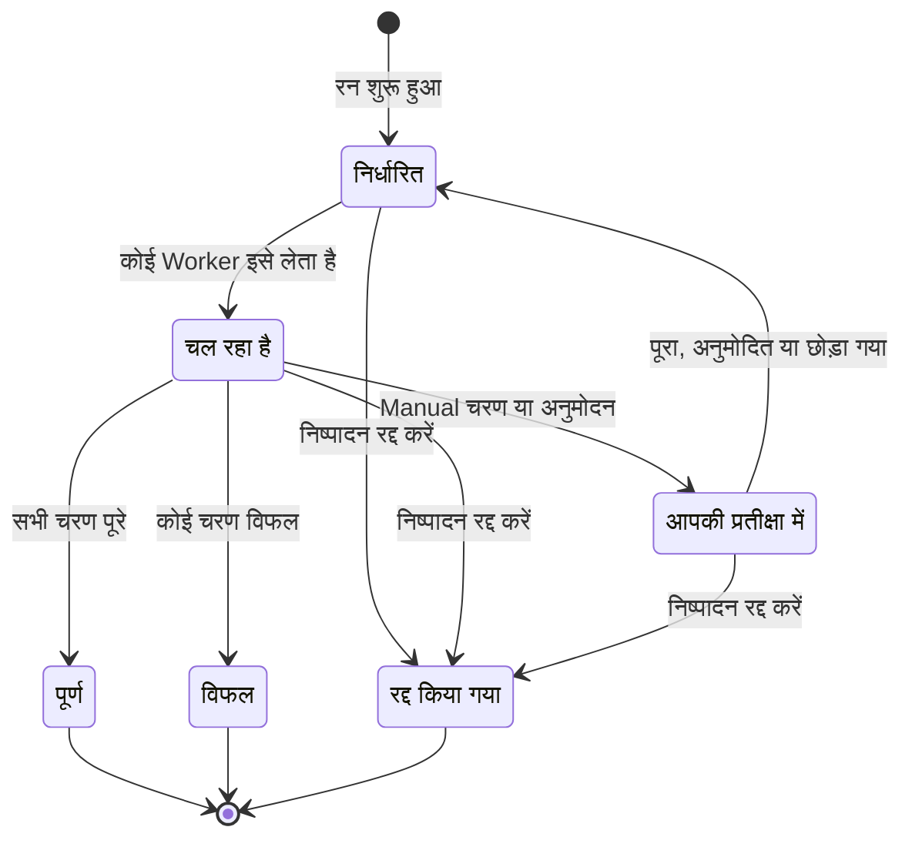

# Runbook चलाना

Runbook का हर रन एक **निष्पादन** है: Runbook के चरणों का एक स्नैपशॉट, जिसे क्रम से पूरा किया जाता है और हर चरण की स्थिति व आउटपुट दर्ज किया जाता है। यह पेज उन लोगों के लिए है जो प्रतिक्रिया देते हैं, रन शुरू करते हैं और उन्हें आगे बढ़ाते हैं: रन कैसे शुरू होता है, निष्पादन पेज क्या दिखाता है, और चरणों को कैसे पूरा, अनुमोदित, छोड़ा और रद्द किया जाता है।

:::cards
- [रन शुरू करें](#रन-शुरू-करें): किसी घटना, अलर्ट या इवेंट से, या ख़ुद Runbook से।
- [निष्पादन दृश्य](#निष्पादन-दृश्य): रन चलते समय हर चरण क्या दिखाता है।
- [चरण पूरे करना, अनुमोदित करना और छोड़ना](#चरण-पूरे-करना-अनुमोदित-करना-और-छोड़ना): कौन-सा चरण कब निर्णय स्वीकार करता है।
- [समस्या निवारण](#समस्या-निवारण): ऐसे रन जो शुरू या ख़त्म नहीं होते।
:::

## रन कैसे आगे बढ़ता है

नया रन तब तक **निर्धारित** रहता है जब तक कोई Worker उसे लेकर **चल रहा है** के रूप में चिह्नित न करे। यह किसी Manual चरण पर, या अनुमोदन की ज़रूरत वाले चरण के बाद, **आपकी प्रतीक्षा में** के रूप में रुकता है, और किसी के कार्रवाई करते ही फिर से कतार में चला जाता है। किसी व्यक्ति की प्रतीक्षा कर रहा रन कभी टाइमआउट नहीं होता। यह **पूर्ण**, **विफल** या **रद्द किया गया** के रूप में ख़त्म होता है।

## रन शुरू करें

Runbook निष्पादन तीन तरीक़ों से बनता है:

1. **नियम से अपने-आप**: जब कोई मेल खाने वाली घटना, अलर्ट या अनुसूचित रखरखाव इवेंट बनता है, तो एक [Runbook नियम](/docs/runbooks/rules) इसे शुरू करता है। एक ऑटो-रेमेडिएशन नियम भी इसे शुरू कर सकता है; [AI SRE](/docs/ai/ai-sre) देखें।
2. **किसी इवेंट से मैन्युअल रूप से**: किसी घटना, अलर्ट या अनुसूचित रखरखाव इवेंट पर **Runbook चलाएं** पर क्लिक करें। निष्पादन उस इवेंट से जुड़ जाता है।
3. **Runbook के पेज से मैन्युअल रूप से**: किसी Runbook के **अवलोकन** पेज पर **Run Now** पर क्लिक करें। यह रन किसी घटना, अलर्ट या अनुसूचित रखरखाव इवेंट से नहीं जुड़ता।

इसे मैन्युअल रूप से शुरू करने के लिए:

:::tabs
@tab किसी इवेंट से
1. घटना, अलर्ट या अनुसूचित रखरखाव इवेंट खोलें और उसके **रनबुक** पेज पर जाएँ।
2. **Runbook चलाएं** पर क्लिक करें। **एक Runbook चलाएं** डायलॉग प्रोजेक्ट के सक्षम Runbook दिखाता है।
3. Runbook के आगे **Run** पर क्लिक करें। रन इवेंट की सूची में दिखता है: उसे खोलने के लिए **देखें** पर क्लिक करें।
@tab Runbook से
1. **रनबुक** से Runbook खोलें।
2. उसके **अवलोकन** पर **Run Now** पर क्लिक करें।
3. निष्पादन पेज खुल जाता है।
:::

रन शुरू करने के लिए Project Owner, Project Admin, Project Member, Runbook Admin या Runbook Member, या **Create Runbook Execution** अनुमति चाहिए। Runbook Viewer और Viewer को **Run Now** कारण के साथ लॉक दिखता है। [अनुमतियाँ](/docs/runbooks/configuration#अनुमतियाँ) देखें।

## निष्पादन दृश्य

किसी निष्पादन को खोलकर उसकी चेकलिस्ट देखें। पेज के ऊपर रन की **स्थिति**, उसकी **Progress** (कुल चरणों में से पूरे हुए चरण), **शुरू हुआ** (यह कब शुरू हुआ) और **द्वारा ट्रिगर किया गया** (इसे किसने शुरू किया) दिखते हैं। हर चरण दिखाता है:

- **स्थिति बैज** — लंबित, चल रहा है, आपकी प्रतीक्षा में, हो गया, छोड़ा गया, विफल या रद्द किया गया।
- **शीर्षक और विवरण** — निष्पादन शुरू होते समय Runbook से कॉपी किए गए।
- **Output** (समेटा जा सकता है) — stdout, रिटर्न मान, HTTP जवाब या AI का जवाब।
- **त्रुटि संदेश**, अगर चरण विफल हुआ।
- जिस चरण पर रन रुका है उस पर: **Mark complete** (Manual चरण) या **Approve & continue** (**अनुमोदन आवश्यक करें** वाला चरण) और **छोड़ें**।
- रन रुके रहने के दौरान, बाद के उन स्वचालित चरणों पर **छोड़ें** जिन्हें अनुमोदन की ज़रूरत नहीं।

रन चलते समय पेज हर 30 सेकंड में अपने-आप रिफ्रेश होता है। नवीनतम स्थिति तुरंत देखने के लिए **रिफ्रेश** पर क्लिक करें।

## चरण पूरे करना, अनुमोदित करना और छोड़ना

रन को आगे बढ़ाने के लिए केवल वही चरण पूरा, अनुमोदित या छोड़ा जा सकता है जिस पर रन रुका है। Manual चरण या **अनुमोदन आवश्यक करें** वाले चरण को रन के वहाँ पहुँचने से पहले टिक या छोड़ा नहीं जा सकता: उसका काम रन को रोकना है, इसलिए वह निर्णय तभी स्वीकार करता है जब रन वहाँ हो (अनुमोदन के लिए: जब चरण चल चुका हो और आप उसका आउटपुट देख सकें)।

रन रुके रहने के दौरान आप बाद का कोई ऐसा स्वचालित चरण भी छोड़ सकते हैं जिसे अनुमोदन की ज़रूरत नहीं, ताकि रन फिर से शुरू होने पर वह न चले। रन उसी चरण पर रुका रहता है जो आपकी प्रतीक्षा कर रहा है। चरण चलते समय आप कुछ नहीं छोड़ सकते: रन के रुकने तक प्रतीक्षा करें, या उसे रद्द करें। हर चरण दर्ज करता है कि उसे किसने पूरा किया या छोड़ा।

| चरण | पूरा करें या अनुमोदित करें | छोड़ें |
| --- | --- | --- |
| वह जिस पर रन रुका है | हाँ | हाँ |
| बाद का स्वचालित चरण, बिना **अनुमोदन आवश्यक करें** | नहीं | हाँ, रन रुके रहने के दौरान |
| बाद का Manual चरण, या **अनुमोदन आवश्यक करें** वाला चरण | नहीं | नहीं |
| चरण चलते समय कोई भी चरण | नहीं | नहीं |

पूरा करने, अनुमोदित करने, छोड़ने और रद्द करने के लिए वही भूमिकाएँ चाहिए जो रन शुरू करने के लिए, या **Edit Runbook Execution** अनुमति।

## मैन्युअल और स्वचालित चरण साथ मिलाना

क्लासिक क्रम:

| # | चरण | क्या होता है |
| --- | --- | --- |
| 1 | Bash: सिस्टम की स्थिति दर्ज करें | रन शुरू होते ही अपने Runner पर चलता है। |
| 2 | Manual: "स्टेटस पेज बैनर से ग्राहकों को सूचित करें।" | रन तब तक रुकता है जब तक कोई **Mark complete** पर क्लिक न करे। |
| 3 | HTTP request: PagerDuty से DBA को पेज करें | Worker पर चलता है। |
| 4 | Manual: "पुष्टि करें कि सेकेंडरी डेटाबेस अब प्राइमरी है।" | रन फिर रुकता है। |
| 5 | HTTP request: Slack webhook पर ऑल-क्लियर भेजें | चलता है, और निष्पादन **पूर्ण** हो जाता है। |

चरण 2 और 4 रन को तब तक रोकते हैं जब तक कोई उन पर टिक न करे। चरण 1, 3 और 5 अपने-आप चलते हैं। पूरा रन एक निष्पादन, एक टाइमलाइन और सच्चाई का एक स्रोत है।

## रन रद्द करना

निष्पादन पेज पर **निष्पादन रद्द करें** पर क्लिक करें। स्थिति `Cancelled` हो जाती है और बाद का कोई चरण शुरू नहीं होता। जो चरण पहले से चल रहा है, वह बीच में नहीं रोका जाता, लेकिन उसका परिणाम दर्ज नहीं होता: चरण `Cancelled` ही रहता है। जो जॉब अभी Runner की प्रतीक्षा में हैं, वे रद्द हो जाते हैं; जो Runner पहले से स्क्रिप्ट चला रहा है वह उसे पूरा करता है, लेकिन परिणाम स्वीकार नहीं किया जाता।

## आउटपुट की सीमाएँ

हर चरण का आउटपुट **50 KB** तक सीमित है, ताकि बेकाबू स्क्रिप्ट डेटाबेस को न फुला दे। इससे लंबा आउटपुट एक मार्कर के साथ काट दिया जाता है। अगर आपको बड़े आर्टिफ़ैक्ट चाहिए, तो उन्हें स्क्रिप्ट से ऑब्जेक्ट स्टोरेज या लॉगिंग सिस्टम में लिखें और आउटपुट में URL डालें।

## Runbook फिर से चलाना

निष्पादन एक बार का, न बदला जा सकने वाला रिकॉर्ड है। इसे फिर से चलाने के लिए किसी ख़त्म हुए निष्पादन पर **फिर से चलाएं** पर, या Runbook पर **Run Now** पर क्लिक करें। दोनों Runbook के मौजूदा चरणों से एक नया निष्पादन बनाते हैं, जो किसी इवेंट से नहीं जुड़ता। किसी घटना पर फिर से चलाने के लिए उस घटना के **रनबुक** पेज पर **Runbook चलाएं** का इस्तेमाल करें। मूल निष्पादन ऑडिट ट्रेल के लिए जस का तस रहता है।

## पिछले निष्पादन ढूँढना

| कहाँ | यह क्या दिखाता है |
| --- | --- |
| किसी Runbook के **निष्पादन** | उस Runbook के सभी रन, स्थिति और शुरू होने की तारीख़ के फ़िल्टर और **द्वारा ट्रिगर किया गया** कॉलम के साथ। |
| **रनबुक → निष्पादन** | प्रोजेक्ट के सभी Runbook के सभी रन। |
| किसी घटना, अलर्ट या इवेंट का **रनबुक** पेज | उससे जुड़े रन। रन होते ही इवेंट का अवलोकन भी उन्हें दिखाता है। |

## समस्या निवारण

:::details Run Now लॉक है
आपकी भूमिका Runbook पढ़ सकती है लेकिन उन्हें चला नहीं सकती: बटन कहता है "आपको इस प्रोजेक्ट में Runbook निष्पादन शुरू करने की अनुमति नहीं है।" Runbook Member भूमिका या **Create Runbook Execution** अनुमति माँगें।
:::

:::details रन शुरू करना "Runbook is disabled" या "Runbook has no steps to run" के साथ विफल होता है
Runbook का **इस Runbook को चलाएं** स्विच उसके **सेटिंग्स** पेज पर बंद है, या उसमें कोई सहेजा गया चरण नहीं है। स्विच चालू करें, या चरण जोड़ें, और **Save Steps** पर क्लिक करें।
:::

:::details कोई चरण Runner या क्रेडेंशियल न होने से विफल हुआ
संदेश कुछ ऐसा होता है: "Bash step is missing a Runner. Pick one under Runbooks → Runners." चरण बिना **Runner** के सहेजा गया था, या कोई SSH या Kubernetes चरण बिना **Credential** के। Runbook के **चरण** खोलें, जो चरण में कमी है उसे चुनें, **Save Steps** पर क्लिक करें, और Runbook फिर से चलाएँ।
:::

:::details कोई चरण इसलिए विफल हुआ क्योंकि किसी Runbook एजेंट ने उसे नहीं उठाया
संदेश है "No runbook agent picked up this step before the wait window expired." चरण के Runner ने अपने claim timeout के भीतर जॉब क्लेम नहीं किया। **रनबुक → Runbook एजेंट** में जाँचें कि Runner **कनेक्टेड** है और **Runbook चलाता है** चालू है। [Runbook एजेंट](/docs/runbooks/agents#समस्या-निवारण) देखें।
:::

:::details रन घंटों से प्रतीक्षा कर रहा है
किसी व्यक्ति की प्रतीक्षा कर रहा रन कभी टाइमआउट नहीं होता। उसे खोलें और **आपकी प्रतीक्षा में** दिखाने वाले चरण पर कार्रवाई करें, या **निष्पादन रद्द करें** पर क्लिक करें।
:::

:::details कोई चरण कहता है कि वह शायद आंशिक रूप से चला
जिस OneUptime Worker ने चरण चलाया, वह रीस्टार्ट हुआ या जवाब देना बंद कर दिया, और रन अटके रहने के बजाय विफल के रूप में चिह्नित हुआ। Runbook फिर से चलाने से पहले लक्ष्य सिस्टम जाँचें।
:::

## अगले कदम

:::cards
- [Runbook लिखना](/docs/runbooks/authoring): जहाँ किसी व्यक्ति को निर्णय लेना हो, वहाँ Manual चरण और अनुमोदन जोड़ें।
- [Runbook नियम](/docs/runbooks/rules): नई घटनाओं पर रन अपने-आप शुरू करें।
- [Runbook एजेंट](/docs/runbooks/agents): अपने चरणों को जिन Runner की ज़रूरत है, उन्हें ऑनलाइन रखें।
:::
