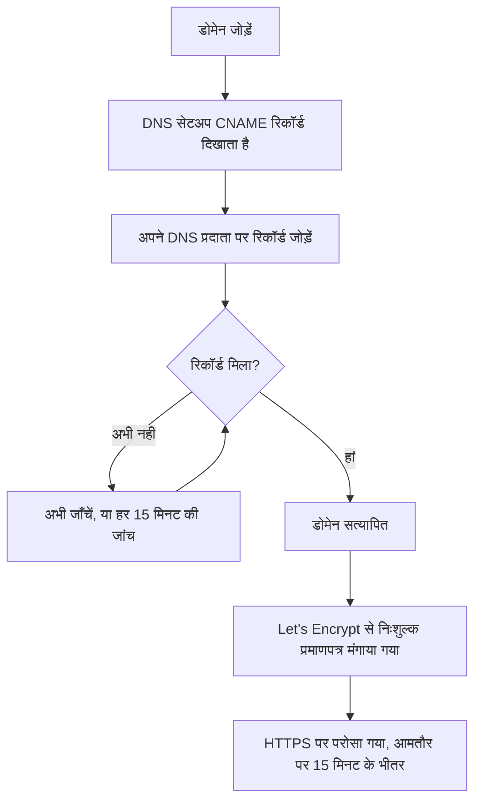

# स्थिति पृष्ठ ब्रांडिंग और डोमेन

आपका स्थिति पृष्ठ OneUptime की वह एकमात्र स्क्रीन है जिसे आपके ग्राहक देखते हैं, इसलिए उसे आपका ही लगना चाहिए और आपके अपने डोमेन पर होना चाहिए, जैसे `status.yourcompany.com`। यह पृष्ठ **ब्रांडिंग** पृष्ठ को कार्ड-दर-कार्ड समझाता है, फिर स्थिति पृष्ठ को आपके डोमेन पर ले जाता है: डोमेन जोड़ें, एक DNS रिकॉर्ड जोड़ें, और निःशुल्क SSL प्रमाणपत्र अपने आप आ जाता है।

:::cards
- [ब्रांडिंग पृष्ठ](#ब्रांडिंग-पृष्ठ): लोगो, शीर्षक, फ़ेविकॉन, लिंक, फ़ुटर, रंग और भाषाएं।
- [कस्टम HTML, CSS और JavaScript](#कस्टम-html-css-और-javascript): वह सब जो बिल्ट-इन नियंत्रणों में नहीं आता।
- [कस्टम डोमेन](#कस्टम-डोमेन): निःशुल्क प्रमाणपत्र के साथ आपका अपना होस्टनाम।
- [स्थिति कॉलम](#डोमेन-का-स्थिति-कॉलम-पढ़ना): हर डोमेन HTTPS की राह पर कहां है।
:::

## हर ब्रांडिंग नियंत्रण कहां है

कोई स्थिति पृष्ठ खोलें: उसके साइड मेनू के **ब्रांडिंग** खंड में तीन आइटम हैं:

| पृष्ठ | वहां आप क्या सेट करते हैं |
| ---- | ------------------ |
| **ब्रांडिंग** | लोगो और कवर इमेज, पृष्ठ शीर्षक और विवरण, फ़ेविकॉन, हेडर लिंक, अवलोकन पृष्ठ विवरण, कॉपीराइट पंक्ति और फ़ुटर लिंक। **और सेटिंग्स** में मुड़े हुए: इतिहास चार्ट के रंग, भाषाएं और सर्च इंजन इंडेक्सिंग। |
| **कस्टम डोमेन** | आपका अपना डोमेन, उसका DNS रिकॉर्ड और उसका निःशुल्क SSL प्रमाणपत्र। |
| **HTML, CSS और JavaScript** | हेडर HTML, फ़ुटर HTML, कस्टम CSS, कस्टम JavaScript। |

ब्रांडिंग जैसी दिखने वाली तीन चीज़ें इसकी जगह **स्थिति पृष्ठ → आपका पृष्ठ → उन्नत → उन्नत सेटिंग्स** (`{id}/settings`) पर हैं, क्योंकि वे तय करती हैं कि पृष्ठ क्या दिखाता है, न कि वह कैसा दिखता है: कुल अपटाइम प्रतिशत, कौन-सी मॉनिटर स्थितियां अपटाइम के विरुद्ध गिनी जाती हैं, और "Powered by OneUptime" पंक्ति। तीनों वहां के **आपका स्थिति पृष्ठ क्या दिखाता है** कार्ड की पंक्तियां हैं।

ब्रांडिंग पहले अलग-अलग स्क्रीनों में बंटी थी: **बुनियादी ब्रांडिंग**, **हेडर**, **फ़ुटर**, **अवलोकन पृष्ठ** और **भाषाएं**। उनके पुराने पते (`{id}/header-style`, `{id}/footer-style`, `{id}/overview-page-branding` और `{id}/languages`) अब **ब्रांडिंग** पृष्ठ खोलते हैं, इसलिए पुराने बुकमार्क और लिंक अब भी काम करते हैं।

## ब्रांडिंग पृष्ठ

**स्थिति पृष्ठ → आपका पृष्ठ → ब्रांडिंग → ब्रांडिंग** (`{id}/branding`)। हर कार्ड अपने आप सहेजा जाता है। लोगो, शीर्षक और फ़ेविकॉन के बाद कार्ड आपके स्थिति पृष्ठ को ऊपर से नीचे तक फ़ॉलो करते हैं: हेडर के लिंक, अवलोकन के ऊपर का टेक्स्ट, फिर फ़ुटर। जिसे कम लोग बदलते हैं, वह सबसे नीचे **और सेटिंग्स** में मुड़ा हुआ है।

### लोगो और कवर इमेज

पहले कार्ड, **लोगो और कवर इमेज**, में एक **Edit Images** बटन है जो दो चरण खोलता है:

| चरण | फ़ील्ड |
| ---- | ------ |
| **लोगो** | लोगो अपलोड (प्लेसहोल्डर `Upload logo`) और **Logo Alt Text** (प्लेसहोल्डर `Logo of My Company`)। वैकल्पिक टेक्स्ट खाली छोड़ें तो उसकी जगह स्थिति पृष्ठ का शीर्षक उपयोग होता है। |
| **कवर इमेज** | **कवर**, हेडर के पीछे के चौड़े बैनर के लिए एक अपलोड (प्लेसहोल्डर `Upload cover image`), और **Cover Image Alt Text**। अगर कवर सिर्फ़ सजावट है तो वैकल्पिक टेक्स्ट खाली छोड़ें। |

लोगो, कवर इमेज और फ़ेविकॉन स्थिति पृष्ठ के अपने प्रोजेक्ट में अपलोड की गई फ़ाइलें हैं, और जब भी इनमें से कोई सहेजी जाती है तो इसकी जांच होती है, चाहे डैशबोर्ड से, API से, Terraform से या किसी वर्कफ़्लो से। किसी दूसरे प्रोजेक्ट में अपलोड की गई फ़ाइल उन्हीं शब्दों के साथ अस्वीकार होती है जो अब मौजूद न रहने वाली फ़ाइल को मिलते हैं: "The logo's file could not be found. Upload the logo again.", "The cover image's file could not be found. Upload the cover image again." या "The favicon's file could not be found. Upload the favicon again." पृष्ठ से इमेज फिर से अपलोड करने पर यह ठीक हो जाता है।

आपका स्थिति पृष्ठ सिर्फ़ अपने प्रोजेक्ट की इमेज दिखाता है; जो इमेज वह नहीं दिखा सकता, उसे छोड़ देता है, मानो पृष्ठ के पास कोई इमेज थी ही नहीं। डैशबोर्ड, API और Terraform भी पृष्ठ की इमेज इसी तरह पढ़ते हैं: दूसरे प्रोजेक्ट की इमेज बिना इमेज के रूप में लौटती है। पृष्ठ के भेजे ईमेल (सब्सक्राइबरों को, और निजी उपयोगकर्ताओं को उनके साइन-इन के बारे में) उसका लोगो इसी तरह दिखाते हैं: जो लोगो पृष्ठ नहीं दिखा सकता, उसे टूटी इमेज के रूप में दिखाने की जगह उनसे भी छोड़ दिया जाता है।

### शीर्षक, विवरण और फ़ेविकॉन

- **शीर्षक और विवरण**: कार्ड बताता है कि इसका उपयोग SEO के लिए भी होता है। **संपादित करें** **पृष्ठ शीर्षक** (प्लेसहोल्डर `Please enter page title here.`) और **पृष्ठ विवरण** खोलता है। सर्च इंजन और लिंक पूर्वावलोकन इन्हें दिखाते हैं, इसलिए इन्हें अपनी टीम के लिए नहीं, ग्राहक के लिए लिखें।
- **Favicon**: **Edit Favicon** **Favicon** अपलोड खोलता है: ब्राउज़र टैब का छोटा आइकन।

### हेडर लिंक

**हेडर लिंक** तालिका में स्थिति पृष्ठ के हेडर के लिंक होते हैं, जैसे आपकी वेबसाइट, आपके दस्तावेज़ या कोई सहायता पोर्टल। हर लिंक में एक **शीर्षक** और एक **लिंक** (एक URL, प्लेसहोल्डर `https://link.com`) होता है, और आप उन्हें खींचकर क्रम बदलते हैं। कोई लिंक न होने पर तालिका **इस स्थिति पृष्ठ के लिए कोई स्थिति हेडर लिंक नहीं** कहती है, और उसके नीचे **स्थिति पृष्ठ हेडर लिंक बनाएँ** होता है।

### अवलोकन पृष्ठ विवरण

**अवलोकन पृष्ठ विवरण** स्थिति पृष्ठ के अवलोकन की पहली चीज़ है, घोषणाओं, कुल स्थिति और आपके संसाधनों के ऊपर। **विवरण संपादित करें** एक markdown फ़ील्ड खोलता है। इसका उपयोग संदर्भ के एक वाक्य के लिए करें: यह पृष्ठ क्या कवर करता है, और सहायता के लिए कहां जाएं। इसमें रखी इमेज पृष्ठ के हर विज़िटर को दिखती है।

### फ़ुटर

- **कॉपीराइट जानकारी**: **Edit Copyright** एक फ़ील्ड, **कॉपीराइट जानकारी**, खोलता है, जिसका प्लेसहोल्डर `Acme, Inc.` है।
- **Footer लिंक**: हेडर लिंक जैसी ही **शीर्षक** और **लिंक** की जोड़ी, खींचकर क्रम में रखी गई। कोई लिंक न होने पर यह "इस स्थिति पृष्ठ के लिए कोई स्थिति फ़ुटर लिंक नहीं।" कहता है।

हेडर लिंक नेविगेशन के लिए हैं; फ़ुटर लिंक बारीक शर्तों के लिए, जैसे कानूनी जानकारी, गोपनीयता और नियम।

### और सेटिंग्स

पृष्ठ का आखिरी खंड **और सेटिंग्स** में मुड़ा हुआ है, क्योंकि इसकी चीज़ें कम ही लोग बदलते हैं। मुड़े होने पर इसका शीर्षक इसके चार खंडों के नाम बताता है (**डिफ़ॉल्ट बार रंग**, **बार रंग नियम**, **भाषाएं** और **सर्च इंजन इंडेक्सिंग**) और हर उस खंड को दिखाता है जो नए स्थिति पृष्ठ की शुरुआती सेटिंग से अलग हो: हर पृष्ठ के शुरुआती हरे रंग से अलग डिफ़ॉल्ट बार रंग, कोई भी बार रंग नियम, अंग्रेज़ी के अलावा कोई डिफ़ॉल्ट भाषा, भाषाओं की छोटी सूची, या बंद की गई सर्च इंजन इंडेक्सिंग। इसे खोलने के लिए क्लिक करें: यह एक ही कार्ड है, जिसमें चारों खंड एक के नीचे एक हैं, हर एक का अपना शीर्षक और बटन, विभाजक रेखाओं से अलग।

**इतिहास चार्ट के रंग।** स्थिति पृष्ठ पर बिल्ट-इन रंग नियंत्रण बस यही हैं।

- **इतिहास चार्ट का डिफ़ॉल्ट बार रंग**: **Edit Default Bar Color** **डिफ़ॉल्ट बार रंग** पिकर खोलता है। हर नया स्थिति पृष्ठ हरे रंग से शुरू होता है। बार रंग नियमों के साथ, यह उस दिन का रंग भी है जिससे कोई नियम मेल नहीं खाता। जिस दिन का पृष्ठ के पास डेटा नहीं है, वह हमेशा धूसर बनाया जाता है।
- **Rules for Bar Colors of History Chart**: नियमों की एक क्रमबद्ध तालिका, जिसे आप खींचकर क्रम में रखते हैं। हर नियम में **जब अपटाइम % इससे अधिक या बराबर हो** और **फिर, इस बार रंग का उपयोग करें** होता है; तालिका के कॉलम `When Uptime Percent >=` और `Then, Bar Color is` कहते हैं। नए नियम का रंग पहले से चुना होता है, ऐसा जिसे दूसरे नियम अभी उपयोग नहीं करते; उसकी जगह अपना पसंदीदा रंग चुनें। क्रम मायने रखता है, इसलिए नियमों को उसी क्रम में रखें जिसमें आप उनका मूल्यांकन चाहते हैं। कोई नियम न होने पर हर दिन की पट्टी उस दिन की सबसे निचली मॉनिटर स्थिति का रंग लेती है।

चार्ट कितने दिन कवर करता है, यह यहां सेट नहीं होता। वह **उन्नत → उन्नत सेटिंग्स** पर **आपका स्थिति पृष्ठ क्या दिखाता है** कार्ड में **अपटाइम इतिहास** है, 1 से 90 दिन तक। कौन-सी मॉनिटर स्थितियां डाउन गिनी जाती हैं, यह उसी कार्ड की उसी पंक्ति में **डाउनटाइम के रूप में गिना जाता है** है।

**भाषाएं।** **भाषाएं** खंड वह भाषा स्विचर सेट करता है जो विज़िटर को पृष्ठ के फ़ुटर में मिलता है। **भाषाएं संपादित करें** दो फ़ील्ड खोलता है:

| फ़ील्ड | यह क्या करता है |
| ----- | ------------ |
| **डिफ़ॉल्ट भाषा** | पहली बार आने वाले विज़िटर को दिखने वाली भाषा, ऐसी सूची से चुनी गई जो हर भाषा का नाम उसी भाषा में और अंग्रेज़ी में देती है (`Deutsch (German)`)। डिफ़ॉल्ट अंग्रेज़ी है, और विज़िटर हमेशा फ़ुटर से बदल सकते हैं। |
| **सक्षम भाषाएं** | एक मल्टी-सिलेक्ट, प्लेसहोल्डर `All languages`। इसे खाली छोड़ें तो हर समर्थित भाषा दी जाती है; कुछ चुनें तो फ़ुटर सिर्फ़ वही सूचीबद्ध करता है। |

OneUptime सत्रह भाषाओं के साथ आता है: अंग्रेज़ी, जर्मन, फ़्रेंच, स्पैनिश, इतालवी, पुर्तगाली, डच, डेनिश, नॉर्वेजियन, स्वीडिश, रूसी, जापानी, कोरियाई, चीनी (सरलीकृत), चीनी (पारंपरिक), हिंदी और फ़ारसी।

**सर्च इंजन इंडेक्सिंग।** एक स्विच, **सर्च इंजनों को इस स्थिति पृष्ठ को इंडेक्स करने की अनुमति दें**, तय करता है कि Google, Bing और दूसरे सर्च इंजन पृष्ठ को सूचीबद्ध कर सकते हैं या नहीं। यह डिफ़ॉल्ट रूप से चालू है। कोई **संपादित करें** बटन नहीं है: स्विच बदलते ही सहेजा जाता है। इसे बंद करें तो पृष्ठ `noindex, nofollow` (एक robots मेटा टैग और एक `X-Robots-Tag` हेडर) के साथ परोसा जाता है; लिंक वाला कोई भी व्यक्ति इसे अब भी खोल सकता है। सर्च इंजन को पहले से इंडेक्स किया गया पृष्ठ हटाने में कुछ हफ़्ते लग सकते हैं।

> [!TIP]
> जब तक कोई पृष्ठ सिर्फ़ आंतरिक है या अभी सेट हो रहा है, तब तक **सर्च इंजनों को इस स्थिति पृष्ठ को इंडेक्स करने की अनुमति दें** बंद रखें, ताकि अधूरा पृष्ठ आपके ब्रांड नाम के लिए रैंक न करने लगे।

## अपटाइम प्रतिशत और डाउनटाइम स्थितियां

दोनों **स्थिति पृष्ठ → आपका पृष्ठ → उन्नत → उन्नत सेटिंग्स** (`{id}/settings`) पर **आपका स्थिति पृष्ठ क्या दिखाता है** कार्ड की **अपटाइम इतिहास** पंक्ति में हैं। कोई **संपादित करें** बटन नहीं है: हर एक बदलते ही सहेजा जाता है।

- **समग्र अपटाइम प्रतिशत दिखाएं**: एक स्विच, डिफ़ॉल्ट रूप से बंद। जब यह चालू हो, तो इसके बगल का **परिशुद्धता** चुनता है कि प्रतिशत कितने दशमलव दिखाए: `99%`, `99.9%`, `99.99%` (डिफ़ॉल्ट) या `99.999%`। OneUptime Cloud पर प्रतिशत चालू करने के लिए **Scale** प्लान चाहिए; इसकी परिशुद्धता हर प्लान पर बदली जा सकती है।
- **डाउनटाइम के रूप में गिना जाता है**: रंगीन चिप के रूप में मॉनिटर स्थितियां, जिनका समय इस पृष्ठ पर अपटाइम के विरुद्ध गिना जाता है। यहीं आप तय करते हैं कि, मान लीजिए, कमज़ोर स्थिति अपटाइम के विरुद्ध गिनी जाए या नहीं। कम से कम एक स्थिति चुनी रहती है।

पहले ये दो अलग कार्ड थे, **कुल अपटाइम प्रतिशत** और **डाउनटाइम मॉनिटर स्थितियां**, हर एक **संपादित करें** बटन के पीछे। कार्ड के बाकी हिस्से के लिए [पेज पर क्या दिखेगा, यह चुनना](/docs/status-pages/index#पेज-पर-क्या-दिखेगा-यह-चुनना) देखें।

## कस्टम HTML, CSS और JavaScript

**स्थिति पृष्ठ → आपका पृष्ठ → ब्रांडिंग → HTML, CSS और JavaScript** (`{id}/custom-code`) में चार कार्ड हैं, हर एक अलग से संपादित और स्थिति पृष्ठ के एक कॉलम में संग्रहीत:

| कार्ड | कॉलम | इसमें क्या है |
| ---- | ------ | ------------- |
| **हेडर HTML** | `headerHTML` | पृष्ठ के हेडर में जोड़ा गया HTML (प्लेसहोल्डर `Insert Custom HTML here.`)। |
| **Footer HTML** | `footerHTML` | पृष्ठ के फ़ुटर में जोड़ा गया HTML। |
| **कस्टम CSS** | `customCSS` | पूरे पृष्ठ के लिए स्टाइल (प्लेसहोल्डर `Insert Custom CSS here.`)। |
| **कस्टम JavaScript** | `customJavaScript` | पृष्ठ द्वारा चलाई जाने वाली स्क्रिप्ट (प्लेसहोल्डर `Insert Custom JavaScript here.`)। |

> [!IMPORTANT]
> कस्टम HTML, CSS और JavaScript सिर्फ़ सत्यापित कस्टम डोमेन पर परोसे जाते हैं। डिफ़ॉल्ट पते `/status-page/:id` पर ये बंद रहते हैं, क्योंकि वह पता OneUptime के साइन-इन ओरिजिन को साझा करता है।

OneUptime Cloud पर इनमें से किसी को जोड़ने या बदलने के लिए **Growth** प्लान चाहिए। किसी को खाली करना हर प्लान पर काम करता है, इसलिए ट्रायल में जोड़ा गया कस्टम कोड हमेशा हटाया जा सकता है।

**कोई थीम पिकर नहीं है।** OneUptime स्थिति पृष्ठों में थीम या ब्रांड-रंग की कोई सेटिंग नहीं है: कहीं भी बिल्ट-इन रंग नियंत्रण सिर्फ़ **डिफ़ॉल्ट बार रंग** और इतिहास चार्ट के बार रंग नियम हैं, **ब्रांडिंग** पृष्ठ पर **और सेटिंग्स** के अंतर्गत। फ़ॉन्ट, पृष्ठभूमि रंग, एक्सेंट रंग और लेआउट के बदलाव सब **कस्टम CSS** से होते हैं। अगर आप "ब्रांड रंग" फ़ील्ड ढूंढ रहे थे, तो जवाब यह है: ऐसा कोई फ़ील्ड नहीं है, और यह बॉक्स ही इसका तरीका है।

> [!WARNING]
> कस्टम JavaScript आपके विज़िटर के ब्राउज़र में चलता है, उस पृष्ठ पर जिसे लोग ठीक तभी खोलते हैं जब उन्हें लगता है कि कुछ टूटा है। इसे छोटा रखें, जहां हो सके इसके लोड किए जाने वाले संसाधन खुद होस्ट करें, और उस पर निर्भर होने से पहले इसे जांच लें।

## कस्टम डोमेन

डिफ़ॉल्ट रूप से स्थिति पृष्ठ उसकी **अवलोकन** स्क्रीन पर दिए पूर्वावलोकन URL पर उपलब्ध होता है। इसे अपने होस्टनाम पर ले जाने के लिए **स्थिति पृष्ठ → आपका पृष्ठ → ब्रांडिंग → कस्टम डोमेन** (`{id}/domains`) पर जाएं।

**कस्टम डोमेन** कार्ड बताता है कि क्या करना है: हर डोमेन के CNAME रिकॉर्ड को अपने इंस्टॉलेशन के स्थिति पृष्ठ CNAME रिकॉर्ड की ओर इंगित करें, और OneUptime डोमेन का SSL प्रमाणपत्र जारी करता है और आपके लिए उसका नवीनीकरण करता है। कुछ भी सेट न होने पर तालिका **कोई कस्टम डोमेन नहीं मिला** कहती है, और उसके नीचे **स्थिति पृष्ठ डोमेन बनाएँ** होता है। तालिका में दो कॉलम हैं, **डोमेन** और **स्थिति**, और **डोमेन**, **CNAME वैध** और **SSL प्रावधानित** के फ़िल्टर।

पृष्ठ को अपने डोमेन पर ले जाने में तीन चरण लगते हैं, और सिर्फ़ पहले दो आपके हैं:

1. **डोमेन जोड़ें**: एक सबडोमेन और आपके सत्यापित डोमेन में से एक।
2. **उसका CNAME रिकॉर्ड जोड़ें**: अपने DNS प्रदाता पर। डोमेन जोड़ते ही **DNS सेटअप** डायलॉग रिकॉर्ड दिखाता है।
3. **निःशुल्क SSL प्रमाणपत्र अपने आप जारी होता है**: रिकॉर्ड मिलते ही। दबाने के लिए कोई बटन नहीं है।



### शुरू करने से पहले

- **मूल डोमेन सत्यापित होना चाहिए।** **डोमेन** ड्रॉपडाउन सिर्फ़ **प्रोजेक्ट सेटिंग्स → डोमेन** में सत्यापित डोमेन सूचीबद्ध करता है, जहां आप TXT रिकॉर्ड से साबित करते हैं कि डोमेन आपका है। फ़ील्ड के बगल का **डोमेन जोड़ें** लिंक वह पृष्ठ नए टैब में खोलता है।
- **आपके इंस्टॉलेशन को स्थिति पृष्ठ CNAME रिकॉर्ड चाहिए।** OneUptime Cloud के पास एक है। सेल्फ़-होस्टेड इंस्टॉलेशन पर इसे ऐसे होस्टनाम पर सेट करें जो आपके OneUptime सर्वर की ओर इशारा करता हो (एक A रिकॉर्ड), और सुनिश्चित करें कि सर्वर पोर्ट 80 पर जवाब देता है, जहां Let's Encrypt उसकी जांच करता है। इसके बिना कार्ड और **DNS सेटअप** डायलॉग रिकॉर्ड दिखाने की जगह "Custom Domains not enabled for this OneUptime installation" कहते हैं।

:::tabs
@tab Docker Compose
```ini title="config.env"
STATUS_PAGE_CNAME_RECORD=oneuptime.yourcompany.com
```
@tab Kubernetes
```yaml title="values.yaml"
statusPage:
  cnameRecord: oneuptime.yourcompany.com
```
:::

### डोमेन जोड़ना

:::steps
#### स्थिति पृष्ठ डोमेन बनाएँ खोलें

**कस्टम डोमेन** पर **स्थिति पृष्ठ डोमेन बनाएँ** पर क्लिक करें। डायलॉग एक ही पृष्ठ का है।

#### सबडोमेन डालें

**सबडोमेन** (प्लेसहोल्डर `status (leave blank for root)`) में सिर्फ़ लेबल डालें, जैसे `status`, पूरा होस्टनाम नहीं। रूट (apex) डोमेन उपयोग करने के लिए इसे खाली छोड़ें, या `@` डालें।

#### डोमेन चुनें

**डोमेन** (प्लेसहोल्डर `Select domain`) में अपने सत्यापित डोमेन में से एक चुनें। जिस डोमेन को आपने सत्यापित नहीं किया, वह सूची में नहीं आता, क्योंकि वह अस्वीकार हो जाता।

#### निःशुल्क प्रमाणपत्र रखें, या अपना अपलोड करें

**और फ़ील्ड** मुड़ा हुआ है, और इसका शीर्षक बताता है कि डोमेन कौन-सा प्रमाणपत्र उपयोग करेगा: "हम इस डोमेन के लिए निःशुल्क SSL प्रमाणपत्र जारी करते हैं और उसे अपने आप नवीनीकृत करते हैं।" इसे सिर्फ़ अपना प्रमाणपत्र उपयोग करने के लिए खोलें: **कस्टम प्रमाणपत्र अपलोड करें** चालू करें, फिर PEM फ़ॉर्मेट में **प्रमाणपत्र** और **प्रमाणपत्र निजी कुंजी** पेस्ट करें। तब दोनों आवश्यक हो जाते हैं।

#### डोमेन बनाएं

**स्थिति पृष्ठ डोमेन बनाएँ** पर क्लिक करें। डायलॉग बंद होता है और नए डोमेन का **DNS सेटअप** खुलता है, जिसमें जोड़ने वाला रिकॉर्ड होता है।
:::

डोमेन का पूरा नाम जोड़ते समय तय हो जाता है, इसलिए **संपादित करें** सिर्फ़ उसका प्रमाणपत्र बदलता है। दूसरा सबडोमेन उपयोग करने के लिए वह डोमेन जोड़ें और पुराना हटा दें।

### DNS सेटअप और सत्यापन

**DNS सेटअप** डायलॉग आपके DNS प्रदाता पर जोड़ा जाने वाला रिकॉर्ड दिखाता है, हर पंक्ति में एक फ़ील्ड, हर एक के साथ कॉपी बटन:

| फ़ील्ड | क्या डालें |
| ----- | ------------- |
| **प्रकार** | `CNAME` |
| **नाम** | आपका जोड़ा गया पूरा डोमेन, उदाहरण के लिए `status.yourcompany.com` |
| **मान** | आपके इंस्टॉलेशन का स्थिति पृष्ठ CNAME रिकॉर्ड |

> [!NOTE]
> बिना सबडोमेन वाले रूट डोमेन के लिए डायलॉग एक नोट जोड़ता है: कई DNS प्रदाता वहां CNAME रिकॉर्ड की अनुमति नहीं देते। उसकी जगह अपने प्रदाता का ALIAS, ANAME या CNAME flattening रिकॉर्ड उसी मान के साथ उपयोग करें।

OneUptime हर असत्यापित डोमेन की हर 15 मिनट में जांच करता है और आपका रिकॉर्ड लाइव होते ही उसे सत्यापित करता है, चाहे आप लौटें या नहीं। तुरंत जांचने के लिए **अभी जाँचें** पर क्लिक करें:

- **रिकॉर्ड अभी नहीं मिला।** डायलॉग खुला रहता है और बताता है कि उसने कौन-सा रिकॉर्ड खोजा। नए DNS रिकॉर्ड को दिखने में कुछ समय लग सकता है: बाद में फिर से **अभी जाँचें** पर क्लिक करें, या इसे हर 15 मिनट की जांच पर छोड़ दें।
- **रिकॉर्ड मिल गया।** डायलॉग "आपका CNAME रिकॉर्ड सत्यापित हो गया है।" कहता है और बताता है कि आगे प्रमाणपत्र के साथ क्या होगा। निःशुल्क प्रमाणपत्र उसी पल मंगाया जाता है।

जब तक डोमेन सत्यापित न हो और उसका प्रमाणपत्र तैयार न हो, उसकी पंक्ति में एक **DNS सेटअप** क्रिया होती है जो वही डायलॉग खोलती है। जिस सत्यापित डोमेन का प्रमाणपत्र ऑर्डर लगातार विफल हो रहा हो, या जिसका प्रमाणपत्र समाप्त हो गया हो, उस पर वहां का **अभी जाँचें** फिर से ऑर्डर करता है और दिखाता है कि पिछला ऑर्डर क्यों विफल हुआ। यह हर डोमेन के लिए हर 15 मिनट में अधिकतम एक बार ऑर्डर करता है; बीच में OneUptime खुद फिर से कोशिश करता रहता है।

### SSL प्रमाणपत्र

हर कस्टम डोमेन को Let's Encrypt से एक निःशुल्क प्रमाणपत्र मिलता है, जो अपने आप जारी और नवीनीकृत होता है। क्लिक करने को कुछ नहीं है:

- **अभी जाँचें** रिकॉर्ड मिलते ही प्रमाणपत्र मंगाता है। फिर डायलॉग बताता है कि प्रमाणपत्र आमतौर पर 15 मिनट के भीतर लाइव हो जाता है।
- जब हर 15 मिनट की जांच कोई डोमेन सत्यापित करती है, तो वह उसी जांच में डोमेन का प्रमाणपत्र मंगाती है।
- नवीनीकरण अपने आप होता है, प्रमाणपत्र की अवधि खत्म होने से काफ़ी पहले। अगर प्रमाणपत्र के नवीनीकरण के दौरान आपका DNS कुछ पल जवाब न दे, तो प्रमाणपत्र परोसा जाता रहता है और बाद की किसी कोशिश में नवीनीकृत होता है। विफल DNS जांच कभी भी अब भी वैध प्रमाणपत्र को नहीं हटाती।

नया प्रमाणपत्र जारी होने के 15 मिनट के भीतर परोसा जाता है, क्योंकि आपके डोमेन के लिए जवाब देने वाले सर्वरों पर प्रमाणपत्र इतनी ही बार लिखे जाते हैं। स्थिति कॉलम _आमतौर पर_ 15 मिनट के भीतर कहता है: जब कई डोमेन एक साथ इंतज़ार कर रहे हों, तो उन्हें कुछ-कुछ करके निपटाया जाता है।

हर OneUptime प्रमाणपत्र एक साझा Let's Encrypt खाते से मंगाया जाता है, और Let's Encrypt सीमित करता है कि एक खाता कम समय में कितने नए ऑर्डर दे सकता है, और एक ही डोमेन का ऑर्डर कितनी बार विफल हो सकता है। OneUptime अपने सारे ऑर्डर (नए डोमेन, **अभी जाँचें**, पुनः जारी करना और नवीनीकरण) मिलाकर उन सीमाओं के भीतर रखता है, और नवीनीकरण हमेशा पहले आते हैं, ताकि नए डोमेन की भीड़ मौजूदा डोमेन को ऑनलाइन रखने वाले नवीनीकरणों को कभी न रोके।

अगर कोई ऑर्डर विफल होता है, तो डोमेन का स्थिति कॉलम यह बताता है, कारण नीचे की पंक्ति में होता है, और **DNS सेटअप** में **अभी जाँचें** भी इसे दिखाता है। OneUptime खुद कोशिश करता रहता है, लगातार हर विफलता के बाद थोड़ा ज़्यादा इंतज़ार करते हुए, ताकि जिस डोमेन का ऑर्डर लगातार विफल हो रहा हो वह बाकी हर डोमेन के ज़रूरी ऑर्डर खत्म न कर दे। आम कारण हैं: आपके डोमेन पर ऐसा CAA रिकॉर्ड जो `letsencrypt.org` की अनुमति नहीं देता, और सेल्फ़-होस्टेड इंस्टॉलेशन पर ऐसा सर्वर जिस तक Let's Encrypt पोर्ट 80 पर नहीं पहुंच सकता; सेल्फ़-होस्टेड इंस्टॉलेशन पर worker लॉग में विवरण होते हैं। कारण ठीक करने के बाद तुरंत फिर से ऑर्डर करने के लिए **अभी जाँचें** पर क्लिक करें। यह हर डोमेन के लिए हर 15 मिनट में अधिकतम एक ऑर्डर देता है; बीच में क्लिक करने पर पिछले ऑर्डर का नतीजा दिखता है।

अगर आपने **और फ़ील्ड** में अपना प्रमाणपत्र अपलोड किया है, तो OneUptime सहेजने के 15 मिनट के भीतर उसकी जगह वही परोसता है। उसकी अवधि खत्म होने से पहले डोमेन को संपादित करके उसका बदला हुआ प्रमाणपत्र अपलोड करें।

### प्रमाणपत्र फिर से जारी करना

अपने आप होने वाला नवीनीकरण सामान्य स्थिति संभाल लेता है, लेकिन कभी-कभी आपको अभी तुरंत एक बिल्कुल नया प्रमाणपत्र चाहिए होता है: कोई निजी कुंजी जिसे आप रखना नहीं चाहते, कोई प्रमाणपत्र जिससे आपका अपना स्कैनर खुश नहीं है, या ऐसा डोमेन जो ऊपर कहीं बदल गया हो। किसी डोमेन के लिए निःशुल्क प्रमाणपत्र मंगाए जाते ही उसकी पंक्ति में **Reissue SSL** क्रिया दिखती है।

इसका डायलॉग, **Reissue SSL Certificate for this Status Page**, Let's Encrypt से डोमेन के लिए नया प्रमाणपत्र मांगता है और परोसे जा रहे प्रमाणपत्र को उससे बदल देता है। इस बीच आपका स्थिति पृष्ठ मौजूदा प्रमाणपत्र पर ऑनलाइन रहता है, और नया प्रमाणपत्र 15 मिनट के भीतर परोसा जाता है। इसे मंगाने के लिए **Reissue SSL Certificate** पर क्लिक करें।

> [!NOTE]
> किसी डोमेन को हर 24 घंटे में सिर्फ़ एक बार फिर से जारी किया जा सकता है। Let's Encrypt सीमित करता है कि एक ही डोमेन कितनी बार जारी हो सकता है, और हर OneUptime प्रमाणपत्र एक साझा खाते से मंगाया जाता है, जिसमें वे अपने आप होने वाले नवीनीकरण भी शामिल हैं जो बाकी सबके पृष्ठ ऑनलाइन रखते हैं। उस अवधि के भीतर डायलॉग ऑर्डर करने की जगह बताता है कि कितना समय बाकी है। अगर उस पल डोमेन का प्रमाणपत्र मंगाया जा रहा हो, या इंस्टॉलेशन के Let's Encrypt ऑर्डर फ़िलहाल खत्म हो गए हों, तो डायलॉग यह बताता है, कुछ नहीं मंगाया जाता, और वह क्लिक आपके पुनः जारी करने में नहीं गिना जाता।

यह क्रिया आपके अपलोड किए प्रमाणपत्र का उपयोग करने वाले डोमेन पर नहीं दिखती: फिर से जारी करने के लिए कोई Let's Encrypt प्रमाणपत्र नहीं है, इसलिए उसकी जगह डोमेन संपादित करके नया प्रमाणपत्र अपलोड करें। डोमेन का पहला प्रमाणपत्र मंगाए जाने से पहले भी यह नहीं दिखती, जो उसका CNAME रिकॉर्ड सत्यापित होते ही अपने आप होता है।

यही बटन, उसी 24 घंटे की सीमा के साथ, **डैशबोर्ड → आपका डैशबोर्ड → ब्रांडिंग → कस्टम डोमेन** के अंतर्गत डैशबोर्ड कस्टम डोमेन पर भी है, जो स्थिति पृष्ठ कस्टम डोमेन की तरह ही काम करते हैं: [साझाकरण और सार्वजनिक डैशबोर्ड](/docs/dashboards/sharing#कस्टम-डोमेन) देखें।

### डोमेन का स्थिति कॉलम पढ़ना

**स्थिति** कॉलम सात अवस्थाओं में से एक में बताता है कि हर डोमेन HTTPS की राह पर कहां है। जब कोई ऑर्डर विफल हुआ हो, तो कारण नीचे की पंक्ति में होता है।

| स्थिति कॉलम क्या कहता है | इसका मतलब क्या है |
| --------------------------- | ------------- |
| DNS की प्रतीक्षा: CNAME रिकॉर्ड जोड़ें। | CNAME रिकॉर्ड अभी नहीं मिला। रिकॉर्ड के लिए **DNS सेटअप** खोलें, उसे अपने DNS प्रदाता पर जोड़ें, फिर **अभी जाँचें** पर क्लिक करें या हर 15 मिनट की जांच का इंतज़ार करें। |
| निःशुल्क प्रमाणपत्र जारी किया जा रहा है, आमतौर पर 15 मिनट के भीतर। | रिकॉर्ड सत्यापित है, और प्रमाणपत्र मंगाया या लिखा जा रहा है। कुछ करने की ज़रूरत नहीं। |
| अभी तक निःशुल्क प्रमाणपत्र जारी नहीं हो सका। हम प्रयास करते रहेंगे। | रिकॉर्ड सत्यापित है, लेकिन उसका प्रमाणपत्र मंगाना नीचे की पंक्ति में दिए कारण से विफल हुआ। कारण ठीक करें, फिर **DNS सेटअप** खोलें और तुरंत फिर से ऑर्डर करने के लिए **अभी जाँचें** पर क्लिक करें। |
| प्रमाणपत्र की अवधि समाप्त हो गई है। हम इसे नवीनीकृत करने का प्रयास करते रहेंगे। | डोमेन के प्रमाणपत्र की अवधि खत्म हो गई क्योंकि उसके नवीनीकरण विफल रहे। इसे अभी नवीनीकृत करने और कारण देखने के लिए **DNS सेटअप** खोलें और **अभी जाँचें** पर क्लिक करें। |
| प्रमाणपत्र जारी किया गया, अपने आप नवीनीकृत होता है। | हो गया। डोमेन HTTPS पर अपना प्रमाणपत्र परोसता है, और OneUptime उसका नवीनीकरण करता है। |
| प्रमाणपत्र जारी किया गया, लेकिन इसका नवीनीकरण विफल रहा। हम प्रयास करते रहेंगे। | डोमेन अब भी वैध प्रमाणपत्र परोसता है, लेकिन उसका पिछला नवीनीकरण नीचे की पंक्ति में दिए कारण से विफल हुआ। OneUptime प्रमाणपत्र की अवधि खत्म होने से काफ़ी पहले फिर कोशिश करता है। |
| आपके अपलोड किए गए प्रमाणपत्र का उपयोग करता है। | रिकॉर्ड सत्यापित है, और डोमेन आपके अपलोड किए प्रमाणपत्र के साथ परोसा जाता है। |

:::details रिकॉर्ड जोड़ने के बहुत बाद भी डोमेन "DNS की प्रतीक्षा" पर रहता है
जांचें कि रिकॉर्ड का नाम पूरा डोमेन है, जैसे `status.yourcompany.com`, और उसका मान आपके इंस्टॉलेशन के CNAME रिकॉर्ड से सटीक मेल खाता है। रूट डोमेन पर ALIAS, ANAME या flattened CNAME रिकॉर्ड का उपयोग करें। फिर **DNS सेटअप** में **अभी जाँचें** पर क्लिक करें।
:::

:::details स्थिति कॉलम कहता है कि निःशुल्क प्रमाणपत्र जारी नहीं हो सका
अपने डोमेन पर ऐसा CAA रिकॉर्ड खोजें जो `letsencrypt.org` को बाहर रखता हो, और सेल्फ़-होस्टेड इंस्टॉलेशन पर जांचें कि आपका सर्वर पोर्ट 80 पर जवाब देता है। कारण ठीक करें, फिर फिर से ऑर्डर करने के लिए **DNS सेटअप** में **अभी जाँचें** पर क्लिक करें।
:::

### कौन जांच और पुनः जारी कर सकता है

**अभी जाँचें**, डोमेन का प्रमाणपत्र मंगाना और **Reissue SSL** डोमेन को बदलते हैं, इसलिए इनके लिए उसे संपादित करने की अनुमति चाहिए: **Edit Status Page Domain**, या कोई भूमिका जिसमें यह शामिल हो (Project Owner, Project Admin, Project Member, Status Page Admin या Status Page Member)।

जो सिर्फ़ डोमेन पढ़ सकता है, जैसे Viewer या Status Page Viewer, वह फिर भी **स्थिति** कॉलम और **DNS सेटअप** में जोड़ने वाला रिकॉर्ड देखता है। उसके लिए **अभी जाँचें** और **Reissue SSL** लॉक होते हैं, और बताते हैं कि कौन-सी अनुमति चाहिए। OneUptime हर हाल में हर डोमेन की जांच और उसका प्रमाणपत्र मंगाना खुद जारी रखता है।

यही बात API कुंजियों पर लागू होती है। जो कुंजी सिर्फ़ स्थिति पृष्ठ डोमेन पढ़ सकती है, वह `/status-page-domain` पर `verify-cname`, `order-ssl` या `reissue-ssl` कॉल नहीं कर सकती। ज़रूरत हो तो उसे **Read Status Page Domain** और **Edit Status Page Domain** दें।

## Powered by OneUptime

"Powered by OneUptime" पंक्ति ब्रांडिंग सेटिंग नहीं है। यह **स्थिति पृष्ठ → आपका पृष्ठ → उन्नत → उन्नत सेटिंग्स** (`{id}/settings`) पर **आपका स्थिति पृष्ठ क्या दिखाता है** कार्ड का आखिरी स्विच है: **Powered By OneUptime ब्रांडिंग दिखाएं**, डिफ़ॉल्ट रूप से चालू। पंक्ति छिपाने के लिए इसे बंद करें; यह तुरंत सहेजा जाता है। OneUptime Cloud पर इसे छिपाने के लिए **Scale** प्लान चाहिए।

## अगले कदम

:::cards
- [स्थिति पृष्ठ अवलोकन](/docs/status-pages/index): पृष्ठ क्या दिखाता है, और इसे कौन देख सकता है।
- [स्थिति पृष्ठ संसाधन और समूह](/docs/status-pages/resources-and-groups): चुनें कि विज़िटर पृष्ठ पर असल में क्या देखते हैं।
- [सब्सक्राइबर और घोषणाएँ](/docs/status-pages/subscribers): वे ईमेल जो आपका लोगो लेकर आपके डोमेन से लिंक करते हैं।
- [सार्वजनिक API](/docs/status-pages/public-api): पृष्ठ को JSON के रूप में पढ़ें, आपके अपने डोमेन पर भी।
:::
