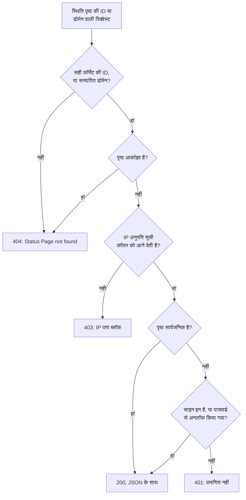

# सार्वजनिक API

हर स्थिति पृष्ठ कुछ रीड-ओनली JSON एंडपॉइंट का जवाब देता है: उसका अवलोकन, अपटाइम, घटनाएं, एपिसोड, अनुसूचित रखरखाव इवेंट और घोषणाएं। ये वही एंडपॉइंट हैं जिन्हें स्थिति पृष्ठ खुद लोड करता है, इसलिए वे ठीक वही लौटाते हैं जो किसी विज़िटर को दिखता है, और सार्वजनिक पृष्ठ के लिए किसी API कुंजी की ज़रूरत नहीं होती। इनका इस्तेमाल अपनी स्थिति को अपने ऐप, किसी चैट बॉट या दीवार पर लगी स्क्रीन में दिखाने के लिए करें।

:::cards
- [एंडपॉइंट](#एंडपॉइंट): पृष्ठ जो कुछ दिखाता है, उसके हर हिस्से के लिए एक एंडपॉइंट।
- [अवलोकन पढ़ें](#अवलोकन-पढ़ें): एक रिक्वेस्ट में पूरा पृष्ठ, curl, Node.js और Python के साथ।
- [किसी तारीख-सीमा का अपटाइम](#किसी-तारीख-सीमा-का-अपटाइम): हर संसाधन और समूह का अपटाइम, 90 दिन तक।
- [एरर](#एरर): हर स्टेटस कोड का मतलब।
:::

## रिक्वेस्ट का जवाब कैसे दिया जाता है

हर रिक्वेस्ट स्थिति पृष्ठ को उसकी ID से या उसके किसी कस्टम डोमेन से बताती है। OneUptime पृष्ठ ढूंढता है, वही एक्सेस नियम लागू करता है जो किसी विज़िटर पर लागू होते हैं, और JSON में जवाब देता है।



निजी पृष्ठ केवल उसी ब्राउज़र को जवाब देता है जिसने उसमें साइन इन किया हो, या उसे उसके पासवर्ड से अनलॉक किया हो: API वही सेशन पढ़ता है जो पृष्ठ पढ़ता है। स्क्रिप्ट के लिए सार्वजनिक पृष्ठ इस्तेमाल करें। देखें [पेज कौन देख सकता है, इसे सीमित करना](/docs/status-pages/index#पेज-कौन-देख-सकता-है-इसे-सीमित-करना)।

सही फ़ॉर्मैट वाली कोई ID जो किसी स्थिति पृष्ठ की नहीं है, निजी पृष्ठ वाले रास्ते से ही गुज़रती है और उसे `401` मिलता है। अगर कोई सार्वजनिक पृष्ठ `401` लौटाता है, तो ID जांचें।

## शुरू करने से पहले

- **स्थिति पृष्ठ की ID।** डैशबोर्ड में पृष्ठ खोलें (**स्थिति पृष्ठ → सभी स्थिति पृष्ठ**, फिर वह पृष्ठ)। उसके **अवलोकन** पर **स्थिति पृष्ठ विवरण** कार्ड **स्थिति पृष्ठ ID** दिखाता है।
- **बेस URL।** नीचे के सभी एंडपॉइंट `/status-page-api` के तहत हैं:

| पृष्ठ कहां चलता है | बेस URL |
| ------------------- | -------- |
| OneUptime Cloud | `https://oneuptime.com/status-page-api` |
| सेल्फ़-होस्टेड OneUptime | `https://<your-oneuptime-host>/status-page-api` |
| पृष्ठ का कोई कस्टम डोमेन | `https://status.example.com/status-page-api` |

नीचे जहां भी पाथ में `{statusPageIdOrDomain}` लिखा है, वहां आप पृष्ठ की ID या उसका कोई सत्यापित कस्टम डोमेन भेज सकते हैं, जैसे `status.example.com`। अपटाइम एंडपॉइंट सिर्फ़ ID लेता है।

## एंडपॉइंट

| एंडपॉइंट | मेथड | क्या लौटाता है |
| -------- | ------- | ------- |
| `/overview/{statusPageIdOrDomain}` | `GET`, `POST` | अवलोकन जो कुछ दिखाता है: समग्र स्थिति, संसाधन और समूह, सक्रिय घटनाएं और एपिसोड, अनुसूचित रखरखाव, चालू घोषणाएं, और अपटाइम बार के पीछे का डेटा। |
| `/uptime/{statusPageId}` | `POST` | किसी तारीख-सीमा के लिए हर संसाधन और हर समूह का अपटाइम प्रतिशत। |
| `/incidents/{statusPageIdOrDomain}` | `GET`, `POST` | पृष्ठ पर सूचीबद्ध घटनाएं, उनके सार्वजनिक नोट और स्थिति बदलावों के साथ। |
| `/incidents/{statusPageIdOrDomain}/{incidentId}` | `POST` | एक घटना। |
| `/episodes/{statusPageIdOrDomain}` | `POST` | पृष्ठ पर सूचीबद्ध घटना एपिसोड। |
| `/episodes/{statusPageIdOrDomain}/{episodeId}` | `POST` | एक एपिसोड। |
| `/scheduled-maintenance-events/{statusPageIdOrDomain}` | `GET`, `POST` | पृष्ठ पर सूचीबद्ध अनुसूचित रखरखाव इवेंट, उनके सार्वजनिक नोट और स्थिति बदलावों के साथ। |
| `/scheduled-maintenance-events/{statusPageIdOrDomain}/{scheduledMaintenanceId}` | `POST` | एक अनुसूचित रखरखाव इवेंट। |
| `/announcements/{statusPageIdOrDomain}` | `GET`, `POST` | पृष्ठ पर सूचीबद्ध घोषणाएं। |
| `/announcements/{statusPageIdOrDomain}/{announcementId}` | `POST` | एक घोषणा। |

एंडपॉइंट पृष्ठ की अपनी सेटिंग्स का पालन करते हैं, जो **आपका स्थिति पृष्ठ क्या दिखाता है** कार्ड में हैं (देखें [पेज पर क्या दिखेगा, यह चुनना](/docs/status-pages/index#पेज-पर-क्या-दिखेगा-यह-चुनना)):

- जो सूची बंद है, वह अपना एंडपॉइंट अस्वीकार कर देती है, जैसे `Incidents are not enabled on this status page.`
- हर सूची उतने पीछे तक जाती है जितना उसकी **पिछले … दिन दिखाएं** सेटिंग बताती है (डिफ़ॉल्ट 14)। घटनाओं की सूची में हर वह घटना भी होती है जो अभी हल नहीं हुई है, और अनुसूचित रखरखाव की सूची में हर वह इवेंट जो अभी आने वाला है या चल रहा है।
- अपनी ID से कोई घटना, एपिसोड, इवेंट या घोषणा चाहे जितनी पुरानी हो, लौटाई जाती है, इसलिए किसी पुराने आइटम का लिंक काम करता रहता है। जो आइटम पृष्ठ बिल्कुल नहीं दिखाता, जैसे किसी ऐसे मॉनिटर की घटना जो पृष्ठ पर नहीं है, वह खाली सूची के रूप में लौटता है, और कोई एपिसोड `404` के रूप में।

**पृष्ठ कौन-सी घटनाएं लौटाता है।** घटनाओं का एंडपॉइंट पृष्ठ के मॉनिटरों की घटनाएं लौटाता है, उनमें से वे घटाकर जो दूसरे स्थिति पृष्ठों तक सीमित हैं, और अगर पृष्ठ सिर्फ़ अपने तक सीमित घटनाएं दिखाता है, तो वे सभी घटनाएं भी घटाकर जो इस पृष्ठ तक सीमित नहीं हैं (देखें [हर ऑडियंस के लिए एक स्थिति पृष्ठ](/docs/status-pages/one-status-page-per-audience))। कोई घटना किन पृष्ठों तक सीमित है, यह जवाब में कभी शामिल नहीं होता।

## अवलोकन पढ़ें

अवलोकन पूरे पृष्ठ के लिए एक रिक्वेस्ट है। यह वही डेटा है जिसे स्थिति पृष्ठ बनाता है, और यह ज़्यादा से ज़्यादा 15 सेकंड पुराना होता है।

:::tabs
@tab curl
```bash
curl https://oneuptime.com/status-page-api/overview/YOUR_STATUS_PAGE_ID
```
@tab Node.js
```javascript title="status.mjs"
// Node.js 18 or later: fetch is built in. Run with `node status.mjs`.
const statusPageId = "YOUR_STATUS_PAGE_ID";

const response = await fetch(
  `https://oneuptime.com/status-page-api/overview/${statusPageId}`,
);
const body = await response.json();

if (!response.ok) {
  throw new Error(`${response.status}: ${body.error}`);
}

console.log(body.overallStatus?.name); // "Operational"
```
@tab Python
```python title="status.py"
# Python 3, standard library only. Run with `python3 status.py`.
import json
import urllib.request

STATUS_PAGE_ID = "YOUR_STATUS_PAGE_ID"
url = f"https://oneuptime.com/status-page-api/overview/{STATUS_PAGE_ID}"

with urllib.request.urlopen(url, timeout=10) as response:
    overview = json.load(response)

print((overview.get("overallStatus") or {}).get("name"))  # Operational
```
:::

समग्र स्थिति पृष्ठ के मॉनिटरों और मॉनिटर समूहों की मौजूदा स्थितियों में सबसे खराब होती है, यानी सबसे ऊंची प्राथमिकता वाली। एक मॉनिटर स्थिति ऐसी दिखती है:

```json
{
  "_id": "cc80b385-4190-42a3-ae8b-9b391e90d79f",
  "name": "Operational",
  "color": { "_type": "Color", "value": "#2ab57d" },
  "isOperationalState": true,
  "priority": 1
}
```

### अवलोकन क्या लौटाता है

| कुंजी | इसमें क्या होता है |
| --- | ------------- |
| `overallStatus` | पृष्ठ की समग्र स्थिति, ऊपर जैसी एक मॉनिटर स्थिति, या `null` जब पृष्ठ पर कुछ नहीं होता। |
| `statusPage` | पृष्ठ की सार्वजनिक सेटिंग्स: उसका शीर्षक, विवरण, ब्रांडिंग और वह क्या दिखाता है। |
| `statusPageResources` | हर संसाधन: उसका डिस्प्ले नाम, विवरण, समूह, मॉनिटर या मॉनिटर समूह, और डिस्प्ले विकल्प। |
| `resourceGroups` | समूह, नेस्टेड समूहों के लिए `parentStatusPageGroupId` के साथ। |
| `monitorStatuses` | प्रोजेक्ट की हर मॉनिटर स्थिति, सबसे कम प्राथमिकता से सबसे ऊंची तक। |
| `monitorGroupCurrentStatuses`, `monitorsInGroup` | पृष्ठ पर हर मॉनिटर समूह की मौजूदा स्थिति, और उसमें शामिल मॉनिटर। |
| `monitorStatusTimelines`, `uptimeDailyAggregate`, `monitorGroupMergedDowntime`, `statusPageHistoryChartBarColorRules` | वह डेटा जिससे अपटाइम बार बनते हैं, और पृष्ठ के बार रंग नियम। |
| `activeIncidents`, `incidentPublicNotes`, `incidentStateTimelines`, `incidentStates` | पृष्ठ पर दिखने वाली अनसुलझी घटनाएं, उनके सार्वजनिक नोट और स्थिति बदलाव, और प्रोजेक्ट की घटना स्थितियां। |
| `timelineIncidents` | अपटाइम बार की अवधि की घटनाएं, सुलझी हुई भी, बार के टूलटिप के लिए। |
| `activeEpisodes`, `episodePublicNotes`, `episodeStateTimelines` | घटना एपिसोड के लिए यही सब। |
| `scheduledMaintenanceEvents`, `scheduledMaintenanceEventsPublicNotes`, `scheduledMaintenanceStateTimelines`, `scheduledMaintenanceStates` | अनुसूचित रखरखाव इवेंट जो अभी आने वाले हैं या चल रहे हैं, उनके सार्वजनिक नोट और स्थिति बदलाव। |
| `activeAnnouncements` | अभी दिख रही घोषणाएं: शुरू हो चुकी और खत्म नहीं हुई। |

## किसी तारीख-सीमा का अपटाइम

`POST /uptime/{statusPageId}` पृष्ठ के हर संसाधन और समूह का दो तारीखों के बीच का अपटाइम लौटाता है। दोनों तारीखें वैकल्पिक हैं:

| फ़ील्ड | डिफ़ॉल्ट | नोट्स |
| ----- | ------- | ----- |
| `startDate` | 14 दिन पहले | ISO 8601 तारीख और समय। |
| `endDate` | अभी | `startDate` से पहले नहीं हो सकती। सीमा ज़्यादा से ज़्यादा 90 दिन की हो सकती है। |

:::tabs
@tab curl
```bash
curl -X POST https://oneuptime.com/status-page-api/uptime/YOUR_STATUS_PAGE_ID \
  -H "Content-Type: application/json" \
  -d '{"startDate": "2026-09-01T00:00:00Z", "endDate": "2026-09-30T23:59:59Z"}'
```
@tab Node.js
```javascript title="uptime.mjs"
// Node.js 18 or later. Run with `node uptime.mjs`.
const statusPageId = "YOUR_STATUS_PAGE_ID";

const response = await fetch(
  `https://oneuptime.com/status-page-api/uptime/${statusPageId}`,
  {
    method: "POST",
    headers: { "Content-Type": "application/json" },
    body: JSON.stringify({
      startDate: "2026-09-01T00:00:00Z",
      endDate: "2026-09-30T23:59:59Z",
    }),
  },
);
const uptime = await response.json();

for (const group of uptime.groupUptimes) {
  console.log(group.statusPageGroupName, group.uptimePercent);
}
```
@tab Python
```python title="uptime.py"
# Python 3, standard library only. Run with `python3 uptime.py`.
import json
import urllib.request

STATUS_PAGE_ID = "YOUR_STATUS_PAGE_ID"

request = urllib.request.Request(
    f"https://oneuptime.com/status-page-api/uptime/{STATUS_PAGE_ID}",
    data=json.dumps(
        {"startDate": "2026-09-01T00:00:00Z", "endDate": "2026-09-30T23:59:59Z"}
    ).encode(),
    headers={"Content-Type": "application/json"},
    method="POST",
)

with urllib.request.urlopen(request, timeout=10) as response:
    uptime = json.load(response)

for group in uptime["groupUptimes"]:
    print(group["statusPageGroupName"], group["uptimePercent"])
```
:::

जवाब:

```json
{
  "statusPageResourceUptimes": [
    {
      "statusPageResourceId": {
        "_type": "ObjectID",
        "value": "cfffa3c3-fdf3-4cd7-9585-d6d408a14663"
      },
      "uptimePercent": 99.98,
      "statusPageResourceName": "Checkout API",
      "currentStatus": {
        "_id": "cc80b385-4190-42a3-ae8b-9b391e90d79f",
        "name": "Operational",
        "color": { "_type": "Color", "value": "#2ab57d" },
        "isOperationalState": true,
        "priority": 1
      }
    }
  ],
  "groupUptimes": [
    {
      "statusPageGroupId": {
        "_type": "ObjectID",
        "value": "df7632c4-c5c0-453c-88bf-9ee3d68d45f2"
      },
      "parentStatusPageGroupId": null,
      "uptimePercent": 99.98,
      "statusPageResourceUptimes": [
        {
          "statusPageResourceId": {
            "_type": "ObjectID",
            "value": "8175534f-aa77-456c-ad5b-b8e7b85876aa"
          },
          "uptimePercent": 99.98,
          "statusPageResourceName": "Web app",
          "currentStatus": {
            "_id": "cc80b385-4190-42a3-ae8b-9b391e90d79f",
            "name": "Operational",
            "color": { "_type": "Color", "value": "#2ab57d" },
            "isOperationalState": true,
            "priority": 1
          }
        }
      ],
      "statusPageGroupName": "Web",
      "currentStatus": {
        "_id": "cc80b385-4190-42a3-ae8b-9b391e90d79f",
        "name": "Operational",
        "color": { "_type": "Color", "value": "#2ab57d" },
        "isOperationalState": true,
        "priority": 1
      }
    }
  ],
  "startDate": "2026-09-01T00:00:00.000Z",
  "endDate": "2026-09-30T23:59:59.000Z"
}
```

| कुंजी | इसमें क्या होता है |
| --- | ------------- |
| `statusPageResourceUptimes` | वे संसाधन जो किसी समूह में नहीं हैं, यानी जो विज़िटर पृष्ठ के सबसे ऊपर देखते हैं। |
| `groupUptimes` | हर समूह के लिए एक एंट्री। किसी समूह के `uptimePercent` और `currentStatus` उसके नीचे के हर संसाधन को कवर करते हैं, नेस्टेड समूहों सहित; उसका `statusPageResourceUptimes` सिर्फ़ सीधे उसमें मौजूद संसाधनों को सूचीबद्ध करता है। `parentStatusPageGroupId` से ट्री दोबारा बनाएं। |
| `uptimePercent` | संसाधन या समूह की अपनी परिशुद्धता तक राउंड किया गया। `null`, जब संसाधन या समूह अपटाइम प्रतिशत नहीं दिखाता। |
| `currentStatus` | `null`, जब संसाधन या समूह अपनी मौजूदा स्थिति नहीं दिखाता। |

समय डाउनटाइम के रूप में तब गिना जाता है जब उसकी मॉनिटर स्थिति पृष्ठ की **डाउनटाइम के रूप में गिना जाता है** स्थितियों में से एक हो।

## घटनाएं, एपिसोड, रखरखाव और घोषणाएं

सूची वाले एंडपॉइंट `POST` के साथ-साथ `GET` का भी जवाब देते हैं; एक आइटम वाले एंडपॉइंट और एपिसोड वाले एंडपॉइंट `POST` का जवाब देते हैं।

:::tabs
@tab curl
```bash
# The incidents the page lists
curl https://oneuptime.com/status-page-api/incidents/YOUR_STATUS_PAGE_ID

# One scheduled maintenance event
curl -X POST https://oneuptime.com/status-page-api/scheduled-maintenance-events/YOUR_STATUS_PAGE_ID/EVENT_ID
```
@tab Node.js
```javascript title="incidents.mjs"
// Node.js 18 or later. Run with `node incidents.mjs`.
const statusPageId = "YOUR_STATUS_PAGE_ID";

const response = await fetch(
  `https://oneuptime.com/status-page-api/incidents/${statusPageId}`,
);
const { incidents } = await response.json();

for (const incident of incidents) {
  console.log(incident.title, incident.currentIncidentState?.name);
}
```
@tab Python
```python title="incidents.py"
# Python 3, standard library only. Run with `python3 incidents.py`.
import json
import urllib.request

STATUS_PAGE_ID = "YOUR_STATUS_PAGE_ID"
url = f"https://oneuptime.com/status-page-api/incidents/{STATUS_PAGE_ID}"

with urllib.request.urlopen(url, timeout=10) as response:
    incidents = json.load(response)["incidents"]

for incident in incidents:
    print(incident["title"], (incident.get("currentIncidentState") or {}).get("name"))
```
:::

| एंडपॉइंट | जवाब में कुंजियां |
| -------- | -------------------- |
| घटनाएं | `incidents`, `incidentPublicNotes`, `incidentStateTimelines`, `incidentStates`, `statusPageResources`, `monitorsInGroup` |
| एपिसोड | `episodes`, `episodePublicNotes`, `episodeStateTimelines`, `incidentStates`, `statusPageResources`, `monitorsInGroup` |
| अनुसूचित रखरखाव इवेंट | `scheduledMaintenanceEvents`, `scheduledMaintenanceEventsPublicNotes`, `scheduledMaintenanceStateTimelines`, `scheduledMaintenanceStates`, `statusPageResources`, `monitorsInGroup` |
| घोषणाएं | `announcements`, `statusPageResources`, `monitorsInGroup` |

एक आइटम वाली रिक्वेस्ट उन्हीं कुंजियों के साथ जवाब देती है, जिनमें वह एक रिकॉर्ड होता है।

## एरर

एरर एक स्टेटस कोड और कारण बताने वाली JSON बॉडी के साथ जवाब देता है:

```json
{ "error": "You can only get uptime for 90 days. Please select a date range within 90 days." }
```

| स्टेटस | कब |
| ------ | ---- |
| `400` | रिक्वेस्ट कुछ ऐसा मांगती है जो पृष्ठ नहीं दिखाता, जैसे कोई बंद सूची, या अपटाइम की सीमा 90 दिन से लंबी है या शुरू होने से पहले खत्म होती है। |
| `401` | पृष्ठ निजी है, और रिक्वेस्ट के पास उसके लिए न कोई साइन-इन सेशन है न पासवर्ड। सही फ़ॉर्मैट वाली कोई ID जो किसी स्थिति पृष्ठ की नहीं है, उसे भी `401` मिलता है। |
| `403` | पृष्ठ की IP अनुमति सूची में कॉलर का पता नहीं है। |
| `404` | ID सही फ़ॉर्मैट की नहीं है, कोई सत्यापित कस्टम डोमेन मेल नहीं खाता, या पृष्ठ आर्काइव है। जो एपिसोड पृष्ठ नहीं दिखाता, उसे भी `404` मिलता है। |

## स्थिति पृष्ठ पढ़ने के दूसरे तरीके

- **RSS।** हर स्थिति पृष्ठ `/rss` देता है, जो उसकी घटनाओं, घोषणाओं और अनुसूचित रखरखाव इवेंट का फ़ीड है। देखें [embed होने वाला badge और RSS feed](/docs/status-pages/index#embed-होने-वाला-badge-और-rss-feed)।
- **llms.txt।** `/rss` के साथ ही हर स्थिति पृष्ठ `/llms.txt` भी देता है, जो AI एजेंटों को RSS फ़ीड और अवलोकन JSON का पता बताता है।
- **MCP।** AI एजेंट OneUptime के MCP सर्वर `https://oneuptime.com/mcp` के ज़रिए बिना API कुंजी के पृष्ठ पढ़ सकते हैं, पृष्ठ की ID या डोमेन को `statusPageIdOrDomain` के रूप में देकर। यह डिफ़ॉल्ट रूप से चालू रहता है; इसे पृष्ठ के साइड मेन्यू में **एआई → MCP** के तहत **MCP सर्वर सक्षम करें** से बंद करें। देखें [MCP सर्वर](/docs/ai/mcp-server)।
- **REST API।** स्थिति पृष्ठ, संसाधन, सब्सक्राइबर और घोषणाएं बनाने या बदलने के लिए, API कुंजी के साथ [OneUptime API](/docs/api-reference/api-reference) इस्तेमाल करें।

## अगले कदम

:::cards
- [स्थिति पृष्ठ अवलोकन](/docs/status-pages/index): स्थिति पृष्ठ क्या दिखाता है, और उसे कौन देख सकता है।
- [स्थिति पृष्ठ संसाधन और समूह](/docs/status-pages/resources-and-groups): ये एंडपॉइंट जो संसाधन और समूह लौटाते हैं।
- [हर ऑडियंस के लिए एक स्थिति पृष्ठ](/docs/status-pages/one-status-page-per-audience): एक पृष्ठ कोई घटना क्यों दिखाता है जो दूसरा नहीं दिखाता।
- [स्थिति पृष्ठ ब्रांडिंग और डोमेन](/docs/status-pages/branding-and-domains): पृष्ठ, और ये एंडपॉइंट, अपने डोमेन पर उपलब्ध कराएं।
:::
