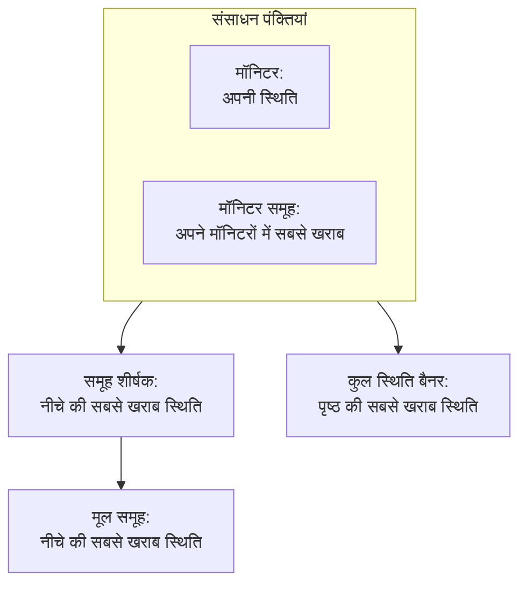

# स्थिति पृष्ठ संसाधन और समूह

संसाधन आपके स्थिति पृष्ठ की एक पंक्ति है: एक मॉनिटर या मॉनिटर समूह, ऐसे नाम के साथ जिसे आपके ग्राहक समझें, उसकी वर्तमान स्थिति और, अगर आप चाहें, उसका अपटाइम और इतिहास। समूह ऐसे खंड हैं जिनमें संसाधन रहते हैं, ताकि चालीस मॉनिटर वाला पृष्ठ एक अंतहीन सूची की जगह "API", "वेब ऐप" और "डेटा पाइपलाइन" जैसा पढ़ा जाए। आप दोनों को एक ही स्क्रीन पर बनाते हैं: कोई स्थिति पृष्ठ खोलें और उसके साइड मेनू में **संसाधन** चुनें।

:::cards
- [मॉनिटर जोड़ें](#मॉनिटर-जोड़ें): विज़िटर के पढ़े जाने वाले नाम के साथ पृष्ठ पर एक मॉनिटर रखें।
- [समूह](#समूह): पृष्ठ को खंडों में बांटें और उन्हें एक-दूसरे के भीतर रखें।
- [मॉनिटर नियम](#मॉनिटर-नियमों-से-मॉनिटर-अपने-आप-जोड़ना): किसी नियम को हर मेल खाने वाला मॉनिटर आपके लिए जोड़ने दें।
- [CSV से समूह आयात करें](#csv-से-समूह-आयात-करना): गहरी पदानुक्रम एक बार में बनाएं।
:::

विज़िटर इन पंक्तियों से तय करते हैं कि "समस्या मेरी तरफ़ है या उनकी", इसलिए इन्हें वैसे नाम दें जैसे ग्राहक आपके उत्पाद के बारे में बात करते हैं: **Checkout API**, न कि `prod-checkout-lb-healthcheck-us-east-1`।

## स्थिति पृष्ठ पर ऊपर कैसे पहुंचती है

हर पंक्ति अपने मॉनिटर की वर्तमान स्थिति दिखाती है। उसके ऊपर का हर स्तर अपने नीचे की हर चीज़ की सबसे खराब स्थिति दिखाता है, जहां सबसे खराब स्थिति वह है जिसकी प्राथमिकता आपके प्रोजेक्ट की मॉनिटर स्थितियों में सबसे ऊंची है।

संसाधन अपनी पंक्ति के रंग से ज़्यादा तय करता है:

- **संग्रहीत मॉनिटर नहीं दिखाए जाते।** संग्रहीत मॉनिटर की अब जांच नहीं होती, इसलिए उसकी आखिरी स्थिति जमी रहती है; पृष्ठ उस जमी स्थिति को लाइव की तरह दिखाने की जगह उसकी पंक्ति छोड़ देता है (और उसे मॉनिटर समूह की स्थिति से भी बाहर रखता है)। पंक्ति रखी जाती है, इसलिए मॉनिटर को असंग्रहीत करने पर वह तुरंत लौट आती है।
- **संसाधन तय करते हैं कि पृष्ठ कौन-सी घटनाएं दिखाए।** घटना यहां तब दिखती है, और पृष्ठ के सब्सक्राइबरों को उसकी सूचना तब मिलती है, जब घटना का कोई मॉनिटर पृष्ठ पर संसाधन हो, सीधे या किसी मॉनिटर समूह के ज़रिए। एक ही मॉनिटर को कई पृष्ठों पर रखें और उसकी घटनाएं उन सब तक पहुंचती हैं, जब तक कि कोई घटना उनमें से कुछ पृष्ठों तक सीमित न हो। [हर ऑडियंस के लिए एक स्थिति पृष्ठ](/docs/status-pages/one-status-page-per-audience) देखें।
- **मॉनिटर समूह की पंक्ति उसके हर मॉनिटर का प्रतिनिधित्व करती है, सब्सक्राइबरों के लिए भी।** जिस पृष्ठ पर सब्सक्राइबर संसाधन चुन सकते हैं, वहां मॉनिटर समूह की सदस्यता लेने वाले को समूह के किसी भी मॉनिटर की घटनाओं, निर्धारित रखरखाव और घोषणाओं की सूचना मिलती है, मानो उसने वही मॉनिटर चुना हो। [सब्सक्राइबर और घोषणाएँ](/docs/status-pages/subscribers#सब्सक्राइबर-को-संसाधन-और-इवेंट-प्रकार-चुनने-देना) देखें।

## संसाधन स्क्रीन

मॉनिटर समूह चालू वाले प्रोजेक्ट में इस आइटम का नाम **संसाधन** है, और बाकी में **मॉनिटर**; यह एक ही स्क्रीन है। पहले समूहों का अपना पृष्ठ होता था, और पुराना पता `/groups` अब यही स्क्रीन खोलता है।

स्क्रीन दो हिस्सों में बंटी है:

| हिस्सा | इसमें क्या है |
| ---- | ------------- |
| **समूह नेविगेटर** (बाईं ओर) | पृष्ठ के सारे समूह, ट्री के रूप में, ऊपर **Search groups...** बॉक्स और नीचे एक गिनती, जैसे `3 groups · 12 resources`। लंबी सूची के आखिर में **Show N more of M** बटन होता है। |
| **Top of page** | नेविगेटर की पहली पंक्ति: बिना समूह वाले संसाधन, जिन्हें विज़िटर हर समूह के ऊपर सबसे पहले देखते हैं। बिना समूह वाले पृष्ठ पर दाएं पैनल का शीर्षक इसकी जगह **All resources** होता है। |
| **संसाधन पैनल** (दाईं ओर) | चुने गए समूह के संसाधन। इसके शीर्ष पर **Edit Group**, मुख्य बटन **मॉनिटर जोड़ें** और **More actions** मेनू होता है। |
| कार्ड शीर्ष | **New Group**, और **Import groups from CSV** और **रिफ्रेश** वाला तीन-बिंदु मेनू। |

**खाली स्थितियां बताती हैं कि क्या करना है।** खाली समूह **No monitors here yet** दिखाता है, साथ में **मॉनिटर जोड़ें**, **Add Multiple** और, सिर्फ़ तब जब पृष्ठ पर एक भी समूह न हो, **Create a Group**। कुछ भी मेल न खाने वाली खोज **No resources match your search** दिखाती है।

## मॉनिटर जोड़ें

:::steps
### चुनें कि पंक्ति कहां जाए

समूह नेविगेटर में वह समूह चुनें जिसमें संसाधन आता है, या बिना समूह वाली पंक्ति के लिए **Top of page** चुनें।

### मॉनिटर जोड़ें पर क्लिक करें

**Add a monitor to {group}** डायलॉग खुलता है। यह एक ही पृष्ठ का है।

### मॉनिटर चुनें

इसे **मॉनिटर** (प्लेसहोल्डर **मॉनिटर चुनें**) में चुनें। **प्रदर्शन नाम**, यानी विज़िटर द्वारा पढ़ा जाने वाला टेक्स्ट, मॉनिटर के नाम से भर जाता है, और जब तक आप अपना नाम टाइप नहीं करते, दूसरा मॉनिटर चुनने पर साथ बदलता है। यह मॉनिटर के अपने नाम से अलग संग्रहीत होता है, इसलिए यहां नाम बदलने से मॉनिटरिंग में कुछ नहीं बदलता।

### चाहें तो प्रदर्शन विकल्प सेट करें

**और फ़ील्ड** मुड़ा हुआ होता है। इसमें **विवरण** (पंक्ति के नीचे दिखने वाला वैकल्पिक markdown, जो यह बताने वाले एक वाक्य के लिए अच्छा है कि सेवा असल में क्या करती है; इसमें रखी इमेज हर विज़िटर को दिखती है) और [प्रदर्शन विकल्प](#संसाधन-के-प्रदर्शन-विकल्प) होते हैं। इसे बंद छोड़ दें तो संसाधन को उनके डिफ़ॉल्ट मिलते हैं।

### संसाधन सहेजें

**मॉनिटर जोड़ें** पर क्लिक करें। पंक्ति समूह में और स्थिति पृष्ठ पर दिखने लगती है।
:::

ग्रिड समूह में डायलॉग **और फ़ील्ड** के ऊपर यह भी पूछता है कि मॉनिटर किस पंक्ति और कॉलम में जाए; [सूची लेआउट बनाम ग्रिड लेआउट](#सूची-लेआउट-बनाम-ग्रिड-लेआउट) देखें।

> [!TIP]
> कई जांचों को एक पंक्ति के रूप में दिखाने के लिए मॉनिटर समूह जोड़ें। **मॉनिटर समूह** स्विच चालू होने पर (**प्रोजेक्ट सेटिंग्स** > **उन्नत** > **फ़ीचर फ़्लैग**, जो बदलते ही सहेजा जाता है), ड्रॉपडाउन के नीचे का लिंक **Add a Monitor Group instead.** कहता है। उस पर क्लिक करें और **मॉनिटर** बदलकर **मॉनिटर समूह** (**मॉनिटर समूह चुनें**) हो जाता है; **Add a Monitor instead.** वापस बदल देता है।

### एक साथ कई जोड़ना

**Add Multiple** (**More actions** मेनू में **Add multiple monitors** भी) **Add Multiple Monitors** खोलता है। यह भी एक ही पृष्ठ है: एक **मॉनिटर** मल्टी-सिलेक्ट, फिर वही मुड़ा हुआ **और फ़ील्ड**, जिसके प्रदर्शन विकल्प आपके चुने हर मॉनिटर पर लागू होते हैं। हर संसाधन अपना प्रदर्शन नाम और विवरण अपने मॉनिटर से लेता है, और **Add Monitors** सबको जोड़ देता है। नया पृष्ठ भरने का यह सबसे तेज़ तरीका है।

मल्टी-सिलेक्ट में एक **लेबल** टैब होता है: किसी लेबल पर क्लिक करें और उस लेबल वाले सारे मॉनिटर एक साथ चुन लिए जाते हैं।

### लेबल से दो बार जोड़ना सुरक्षित है

स्थिति पृष्ठ किसी मॉनिटर को एक बार ही सूचीबद्ध करता है। जोड़ना idempotent है, इसलिए कुछ नए मॉनिटरों पर लेबल लगाने के बाद वही लेबल फिर से चुनने पर सिर्फ़ नए जुड़ते हैं: पृष्ठ पर पहले से मौजूद मॉनिटर ठीक वैसे ही रहते हैं, आपके दिए प्रदर्शन नाम और विकल्पों के साथ।

बल्क जोड़ के आखिर का सारांश यही बताता है: जोड़े गए मॉनिटर **जोड़ा गया** के अंतर्गत सूचीबद्ध होते हैं, और जो पहले से थे वे **Already Added** के अंतर्गत। किसी को विफलता के रूप में रिपोर्ट नहीं किया जाता, और उनके लिए कुछ नहीं लिखा जाता।

यही नियम हर उस जगह लागू होता है जहां संसाधन बनता है। एकल-जोड़ फ़ॉर्म से पृष्ठ पर पहले से मौजूद मॉनिटर जोड़ना, या संपादन फ़ॉर्म से किसी मौजूदा संसाधन को उसकी ओर इंगित करना, *"This monitor is already added to this status page"* के साथ अस्वीकार हो जाता है, तब भी जब मौजूदा संसाधन किसी दूसरे समूह में हो, क्योंकि विज़िटर को मॉनिटर फिर भी दो बार दिखेगा। किसी मॉनिटर को दूसरे समूह में दिखाने के लिए उसका मौजूदा संसाधन हटाएं और उसे वहां जोड़ें जहां आप चाहते हैं।

## संसाधन के प्रदर्शन विकल्प

**और फ़ील्ड** खंड एकल-जोड़ फ़ॉर्म और बल्क डायलॉग में एक जैसा है। यह दोनों में मुड़ा हुआ शुरू होता है, और **संसाधन संपादित करें** में भी, जहां इसका मुड़ा हुआ शीर्षक दिखाता है कि इसमें क्या डिफ़ॉल्ट से अलग है। यहां सब कुछ हर संसाधन के लिए अलग है: एक ही समूह की दो पंक्तियां अलग-अलग सेट हो सकती हैं।

| फ़ील्ड | डिफ़ॉल्ट | यह क्या करता है |
| ----- | ------- | ------------ |
| **टूलटिप** (`displayTooltip`) | खाली | आपके स्थिति पृष्ठ पर संसाधन के बगल में टूलटिप के रूप में दिखता है। इसे दायरे के लिए उपयोग करें: "US और EU ग्राहक"। |
| **वर्तमान संसाधन स्थिति दिखाएं** (`showCurrentStatus`) | चालू | पंक्ति के बगल में लाइव स्थिति दिखाता है, जैसे चालू, कमज़ोर या ऑफ़लाइन। |
| **अपटाइम % दिखाएं** (`showUptimePercent`) | बंद | संसाधन के बगल में अपटाइम प्रतिशत दिखाता है। |
| **अपटाइम परिशुद्धता चुनें** (`uptimePercentPrecision`) | एक दशमलव | **अपटाइम % दिखाएं** चालू होने पर दिखता है, और तब आवश्यक है। |
| **स्थिति इतिहास चार्ट दिखाएं** (`showStatusHistoryChart`) | चालू | संसाधन के दिन-प्रति-दिन के अपटाइम इतिहास की पट्टियां दिखाता है। |

**प्रदर्शन नाम** (`displayName`) और **विवरण** (`displayDescription`) भी सिर्फ़ प्रदर्शन के लिए हैं: वे कभी खुद मॉनिटर को नहीं बदलते।

## अपटाइम प्रतिशत और इतिहास चार्ट

**अपटाइम % दिखाएं** और **स्थिति इतिहास चार्ट दिखाएं** दोनों पूरे पृष्ठ की एक ही सेटिंग पढ़ते हैं: वे कितने दिन कवर करते हैं। यह **स्थिति पृष्ठ → आपका पृष्ठ → उन्नत → उन्नत सेटिंग्स** पर **आपका स्थिति पृष्ठ क्या दिखाता है** कार्ड में **अपटाइम इतिहास** है। यह 1 से 90 दिन स्वीकार करता है और डिफ़ॉल्ट 90 है। तो स्विच हर संसाधन के लिए चालू करें, फिर पूरे पृष्ठ के लिए विंडो एक बार सेट करें।

**परिशुद्धता विवेक का मामला है।** **अपटाइम परिशुद्धता चुनें** `99% (No Decimal)`, `99.9% (One Decimal)`, `99.99% (Two Decimal)` और `99.999% (Three Decimal)` देता है। ज़्यादा दशमलव सटीक दिखते हैं और तीसरे पर बहस को न्योता देते हैं; अगर आप तीन नाइन का SLA प्रकाशित करते हैं, तो उसी से मेल रखें और उससे ज़्यादा नहीं।

समूहों के पास इन स्विचों की अपनी प्रतियां होती हैं (नीचे देखें), इसलिए कोई समूह कुल प्रतिशत दिखा सकता है जबकि उसके अंदर के मॉनिटर चुप रहें, या इसका उल्टा।

इतिहास चार्ट की पट्टियों के रंग **ब्रांडिंग** पृष्ठ पर **और सेटिंग्स** के अंतर्गत सेट होते हैं, और कौन-सी मॉनिटर स्थितियां "डाउन" गिनी जाती हैं, यह **उन्नत सेटिंग्स** पर **आपका स्थिति पृष्ठ क्या दिखाता है** कार्ड में **डाउनटाइम के रूप में गिना जाता है** में; दोनों [स्थिति पृष्ठ ब्रांडिंग और डोमेन](/docs/status-pages/branding-and-domains) में बताए गए हैं।

## समूह

ज़्यादातर समूहों को सिर्फ़ एक नाम चाहिए।

:::steps
### New Group पर क्लिक करें

**Create New Status Page Group** खुलता है: दो फ़ील्ड, फिर दो मुड़े हुए खंड।

### समूह को नाम दें

**समूह नाम** टाइप करें: वह खंड शीर्षक जो विज़िटर देखते हैं।

### अगर यह किसी दूसरे समूह का हिस्सा है, तो इसे उसके भीतर रखें

एक **Parent Group** चुनें, या इसे **No parent group (top level)** पर छोड़ दें। किसी समूह के मेनू में **Add a sub group** इसे आपके लिए भर देता है।

### समूह बनाएं

**Create Status Page Group** पर क्लिक करें। समूह नेविगेटर में दिखता है, मॉनिटरों के लिए तैयार।
:::

दो फ़ील्ड **समूह नाम** (`name`) और **Parent Group** (`parentStatusPageGroupId`) हैं। दो मुड़े हुए खंडों में बाकी सब कुछ है:

- **लेआउट**: इसका मुड़ा हुआ शीर्षक **List** या **Grid** कहता है। इसमें **व्यू मोड** और ग्रिड के अक्ष होते हैं ([सूची लेआउट बनाम ग्रिड लेआउट](#सूची-लेआउट-बनाम-ग्रिड-लेआउट) देखें), और ग्रिड समूह पर यह अपने आप खुलता है।
- **और फ़ील्ड**: संसाधन विकल्पों की समूह स्तर की प्रतियां:
  - **समूह विवरण** (`description`): वैकल्पिक markdown, शीर्षक के नीचे दिखाया जाता है। इसमें रखी इमेज हर विज़िटर को दिखती है।
  - **डिफ़ॉल्ट रूप से स्थिति पृष्ठ पर विस्तृत करें** (`isExpandedByDefault`): डिफ़ॉल्ट रूप से चालू; तय करता है कि विज़िटर के लिए खंड खुला शुरू हो या मुड़ा हुआ।
  - **वर्तमान समूह स्थिति दिखाएं** (`showCurrentStatus`): डिफ़ॉल्ट रूप से चालू। समूह शीर्षक के बगल में एक स्थिति दिखाता है।
  - **अपटाइम % दिखाएं** (`showUptimePercent`): डिफ़ॉल्ट रूप से बंद, चालू होने पर **अपटाइम परिशुद्धता चुनें** के साथ।

किसी समूह को बदलने के लिए पैनल शीर्ष में **Edit Group**, या नेविगेटर के पंक्ति मेनू में **Edit group** का उपयोग करें: **Edit Status Page Group** खुलता है, **परिवर्तन सहेजें** बटन के साथ। पैनल शीर्ष चालू सेटिंग्स के लिए चिप दिखाता है (**Grid**, **Collapsed by default**, **Uptime %** ), ताकि आप फ़ॉर्म खोले बिना देख सकें कि समूह कैसे सेट है।

### समूह का प्रबंधन

| कहां | क्रियाएं |
| ----- | ------- |
| नेविगेटर का पंक्ति मेनू | **Edit group**, **Move up**, **Move down**, **ID दिखाएँ**, **Delete group** |
| पैनल का **More actions** मेनू | **Edit this group**, **Add a sub group**, **Move group up**, **Move group down**, **Show group ID**, **रिफ्रेश**, **Delete this group** |

बिना नाम के सहेजा गया समूह **Untitled group** के रूप में दिखता है, जो इस बात का अच्छा संकेत है कि आप कुछ टाइप करना चाहते थे।

## समूहों को एक-दूसरे के भीतर रखना

समूह एक-दूसरे के भीतर रखे जा सकते हैं: चाइल्ड समूह पर **Parent Group** सेट करें, या नेविगेटर में **Add a sub group inside this group** का उपयोग करें। फ़ॉर्म का सहायता टेक्स्ट उस ढांचे का वर्णन करता है जिसके लिए यह बना है (कुछ ऐसा जैसे व्यवसाय इकाइयां › क्षेत्र › बाज़ार), और हर स्तर अपने नीचे की हर चीज़ की कुल स्थिति और अपटाइम दिखाता है।

जब किसी समूह के चाइल्ड होते हैं, तो संसाधन पैनल **Sub groups** चिप की एक पंक्ति दिखाता है जो सीधे हर चाइल्ड तक ले जाती है, ताकि आप नेविगेटर पर लौटे बिना पदानुक्रम में घूम सकें।

यह ढांचा बड़े पृष्ठों पर काम आता है: उत्पादों के अंदर क्षेत्रों वाला होस्टिंग प्रदाता, या व्यवसाय इकाइयों के अंदर बाज़ारों वाला रिटेलर। बारह मॉनिटर वाले पृष्ठ पर एक सपाट स्तर ज़्यादा सुविधाजनक है।

## सूची लेआउट बनाम ग्रिड लेआउट

समूह फ़ॉर्म का **लेआउट** खंड समूह का **व्यू मोड** (`viewMode`) सेट करता है, जो बदलता है कि समूह स्थिति पृष्ठ पर कैसे दिखता है।

| अगर आप चाहते हैं… | चुनें |
| --------------- | ---- |
| सेवाओं की एक सादी लंबवत सूची दिखाना, हर पंक्ति में एक | **List** (डिफ़ॉल्ट) |
| एक ही सेवा को कई क्षेत्रों या टेनेंट में मैट्रिक्स के रूप में दिखाना | **Grid** |

**Grid** चुनें और चार और फ़ील्ड दिखते हैं:

| फ़ील्ड | क्या डालें |
| ----- | ------------- |
| **पंक्ति अक्ष लेबल** | पंक्ति आयाम का नाम, प्लेसहोल्डर `Service`। |
| **पंक्ति अक्ष मान** | पंक्तियां, **Add Row** से एक-एक करके जोड़ी गईं (प्लेसहोल्डर `e.g. Auth`)। |
| **कॉलम अक्ष लेबल** | कॉलम आयाम, प्लेसहोल्डर `Region`। |
| **कॉलम अक्ष मान** | कॉलम, **Add Column** से जोड़े गए (प्लेसहोल्डर `e.g. US-East`)। |

ग्रिड समूह का हर मॉनिटर एक सेल में रहता है, इसलिए **मॉनिटर जोड़ें** और बल्क डायलॉग आपके अपने अक्ष लेबल का उपयोग करते हुए मॉनिटर के साथ पंक्ति और कॉलम भी पूछते हैं।

> [!IMPORTANT]
> मॉनिटर जोड़ने से पहले अक्ष सेट करें। बिना पंक्तियों या कॉलमों वाला ग्रिड समूह एक सूचना दिखाता है कि अभी मॉनिटर रखने की कोई जगह नहीं है, साथ में **Set up the grid** बटन जो समूह का फ़ॉर्म उसके **लेआउट** खंड पर खोलता है, और जब तक आप ऐसा नहीं करते, उसका **मॉनिटर जोड़ें** बटन हटा रहता है।

## विज़िटर को दिखने वाला क्रम

क्रम आप तय करते हैं, वर्णमाला नहीं:

| क्या | इसका क्रम कैसे बदलें |
| ---- | ----------------- |
| किसी समूह के अंदर के संसाधन | एक पंक्ति खींचें। पैनल यह बताता है: **Drag a row to change the order visitors see**। |
| समूह आपस में | नेविगेटर के पंक्ति मेनू में **Move up** / **Move down**, या **More actions** में **Move group up** / **Move group down**। |
| बिना समूह वाले संसाधन | वे **Top of page** में होते हैं और हमेशा हर समूह के ऊपर दिखते हैं, इसलिए वहां वह चीज़ रखें जिसे सब सबसे पहले जांचते हैं। |

**दो स्थितियां जिनमें खींचना बंद रहता है।** **Search in {group}...** बॉक्स से खोजने पर क्रम बदलना बंद हो जाता है (पैनल `N of M shown · drag to reorder is off while filtering` कहता है), इसलिए पहले खोज साफ़ करें। और ग्रिड समूह कभी खींचकर क्रम नहीं बदलते, क्योंकि मॉनिटर की जगह उसकी पंक्ति और कॉलम से तय होती है।

जिस सेवा के बारे में सबसे ज़्यादा पूछा जाता है, उसे सबसे ऊपर रखें। आउटेज के दौरान पृष्ठ पर आने वाले विज़िटर आमतौर पर पहली स्क्रीन के बाद पढ़ना बंद कर देते हैं।

## मॉनिटर नियमों से मॉनिटर अपने आप जोड़ना

मॉनिटर नियम आपके लिए पृष्ठ पर मॉनिटर जोड़ता है: मॉनिटरों का एक बार वर्णन करें, और मेल खाने वाला हर मॉनिटर आपके चुने समूह में पहुंच जाता है। नियम संसाधन स्क्रीन के बगल में **संसाधन → Monitor Rules** के अंतर्गत होते हैं।

:::steps
### Monitor Rules खोलें

स्थिति पृष्ठ खोलें, उसके साइड मेनू के **संसाधन** खंड में **Monitor Rules** चुनें, और **Status Page Monitor Rule बनाएँ** पर क्लिक करें।

### नियम को नाम दें

**मूल जानकारी** में एक **नाम** डालें। **सक्षम** डिफ़ॉल्ट रूप से चालू होता है।

### बताएं कि यह किन मॉनिटरों से मेल खाता है

**मिलान मानदंड** में **मॉनिटर लेबल** (इनमें से कोई भी लेबल वाला मॉनिटर मेल खाता है), **मॉनिटर नाम** और **मॉनिटर विवरण** में से कम से कम एक भरें। मॉनिटर को आपके भरे हर मानदंड पर खरा उतरना होगा। दोनों पैटर्न बड़े-छोटे अक्षरों का अंतर न करने वाला रेगुलर एक्सप्रेशन (`^api-.*`) या `*` वाइल्डकार्ड (`*checkout*`) स्वीकार करते हैं; `.*` हर मॉनिटर से मेल खाता है।

### समूह चुनें

**समूह** में **Add Monitors To Group** चुनें, या मॉनिटरों को बिना समूह के जोड़ने के लिए इसे खाली छोड़ें। इसके बाद संसाधन जैसे ही प्रदर्शन विकल्प आते हैं; नियम पर **अपटाइम % दिखाएं** चालू शुरू होता है।

### नियम सहेजें

नियम तुरंत पहले से मौजूद हर मॉनिटर पर चलता है, और सूची **Adds Monitors To** के अंतर्गत वह समूह दिखाती है जिसमें यह मॉनिटर जोड़ता है।
:::

उसके बाद, जब भी कोई मॉनिटर बनाया जाता है या उसके लेबल, नाम या विवरण बदलते हैं, तो उस मॉनिटर के लिए नियम फिर चलता है। नियम सिर्फ़ वही संसाधन हटाता है जो उसने जोड़े: इसे बंद करने या हटाने से वे पृष्ठ से हट जाते हैं, और आपके हाथ से जोड़े गए मॉनिटर को कभी छुआ नहीं जाता। पृष्ठ पर पहले से मौजूद मॉनिटर कभी दो बार नहीं जुड़ता।

## CSV से समूह आयात करना

गहरी पदानुक्रम हाथ से बनाना थकाऊ है। कार्ड शीर्ष के तीन-बिंदु मेनू में **Import groups from CSV**, **Import Groups from CSV** डायलॉग खोलता है।

:::steps
### टेम्पलेट डाउनलोड करें

`status-page-groups-template.csv` पाने के लिए **Download CSV Template** पर क्लिक करें।

### इसे भरें

हर समूह के लिए एक पंक्ति। सिर्फ़ `name` आवश्यक है; कॉलम नीचे सूचीबद्ध हैं।

### अपलोड करें और पूर्वावलोकन देखें

**Choose CSV File** पर क्लिक करें, अपनी फ़ाइल चुनें, फिर कुछ भी लिखे जाने से पहले यह जांचने के लिए **Preview Import** पर क्लिक करें कि क्या बनेगा।

### आयात करें

आयात चलाएं। **Import results** तालिका हर पंक्ति को कारण के साथ **बनाया गया**, **विफल** या **छोड़ा गया** के रूप में सूचीबद्ध करती है, ताकि कोई खराब पंक्ति चुपचाप गायब न हो।
:::

| कॉलम | यह क्या सेट करता है |
| ------ | ------------ |
| `name` | समूह का नाम। आवश्यक। |
| `parentName` | उस समूह का नाम जिसके भीतर यह रहता है। |
| `description` | समूह का विवरण। |
| `isExpandedByDefault` | क्या विज़िटर के लिए खंड खुला शुरू होता है। |
| `showCurrentStatus` | क्या समूह शीर्षक के बगल में स्थिति दिखती है। |
| `showUptimePercent` | क्या समूह के बगल में अपटाइम प्रतिशत दिखता है। |
| `uptimePercentPrecision` | वह प्रतिशत कितने दशमलव स्थानों का उपयोग करता है। |
| `viewMode` | `List` या `Grid`। |
| `rowAxisLabel` | ग्रिड समूह के लिए पंक्ति आयाम का नाम। |
| `rowAxisValues` | ग्रिड समूह के लिए पंक्ति मान। |
| `columnAxisLabel` | ग्रिड समूह के लिए कॉलम आयाम का नाम। |
| `columnAxisValues` | ग्रिड समूह के लिए कॉलम मान। |

आयात समूह बनाता है, संसाधन नहीं: बाद में **मॉनिटर जोड़ें**, **Add Multiple** या किसी मॉनिटर नियम से मॉनिटर जोड़ें।

## समस्या निवारण

:::details "This monitor is already added to this status page"
पृष्ठ हर मॉनिटर को एक बार सूचीबद्ध करता है, समूहों के पार भी। मॉनिटर का पहले से एक संसाधन है, शायद किसी दूसरे समूह में या किसी मॉनिटर नियम द्वारा जोड़ा गया। नेविगेटर में इसे खोजें, वह संसाधन हटाएं, और मॉनिटर को वहां जोड़ें जहां आप चाहते हैं।
:::

:::details मेरा जोड़ा गया मॉनिटर स्थिति पृष्ठ पर नहीं दिखता
जांचें कि मॉनिटर संग्रहीत तो नहीं है: संग्रहीत मॉनिटर की पंक्ति तब तक छोड़ी जाती है जब तक आप उसे असंग्रहीत न करें। समूह भी जांचें: मुड़ा हुआ शुरू होने के लिए सेट समूह (**डिफ़ॉल्ट रूप से स्थिति पृष्ठ पर विस्तृत करें** बंद) तब तक अपनी पंक्तियां छिपाता है जब तक कोई विज़िटर उसे न खोले।
:::

:::details ग्रिड समूह में मॉनिटर जोड़ें बटन नहीं है
ग्रिड में अभी कोई पंक्ति या कॉलम नहीं है। **Set up the grid** पर क्लिक करें, **लेआउट** खंड में अक्ष मान जोड़ें, और **मॉनिटर जोड़ें** लौट आता है।
:::

:::details मैं पंक्तियां नहीं खींच सकता
**Search in {group}...** बॉक्स खाली करें: पैनल फ़िल्टर होने पर क्रम बदलना बंद रहता है। ग्रिड समूह कभी खींचकर क्रम नहीं बदलते।
:::

## अगले कदम

:::cards
- [स्थिति पृष्ठ ब्रांडिंग और डोमेन](/docs/status-pages/branding-and-domains): लोगो, फ़ेविकॉन, इतिहास चार्ट के रंग और आपका अपना डोमेन।
- [सब्सक्राइबर और घोषणाएँ](/docs/status-pages/subscribers): इन संसाधनों के बदलने पर किसे बताया जाता है।
- [हर ऑडियंस के लिए एक स्थिति पृष्ठ](/docs/status-pages/one-status-page-per-audience): कई पृष्ठों पर एक ही मॉनिटर, और ऐसी घटना जो उनमें से कुछ तक ही पहुंचे।
- [सार्वजनिक API](/docs/status-pages/public-api): संसाधन, समूह और अपटाइम JSON के रूप में पढ़ें।
:::
