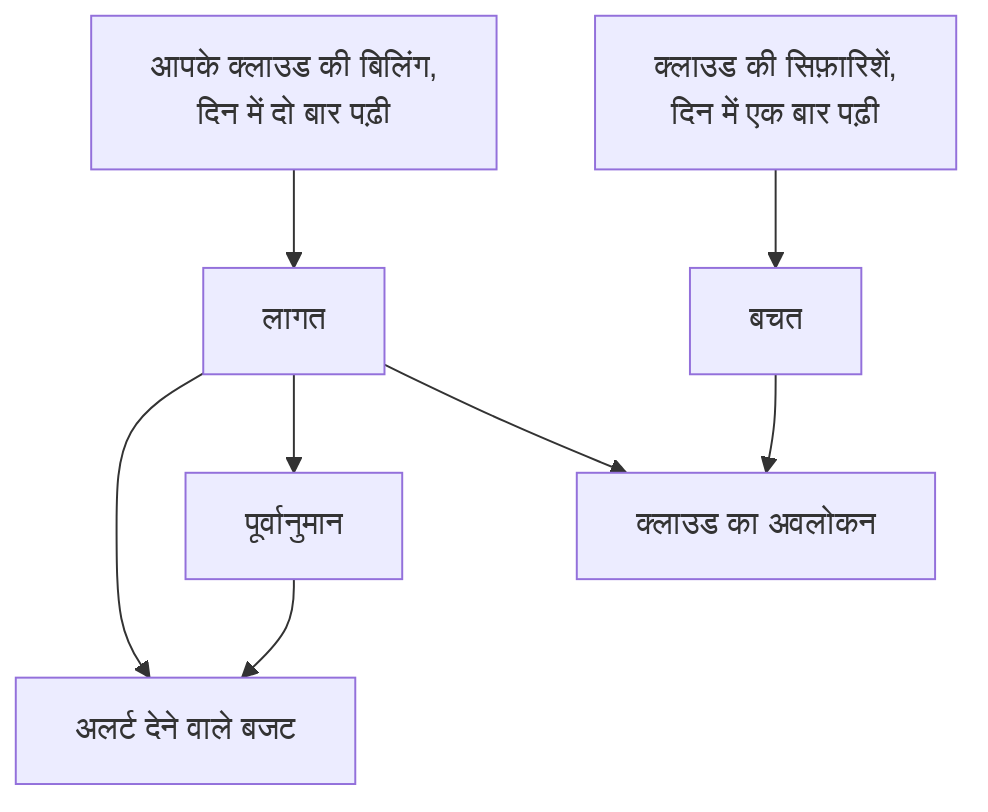

# क्लाउड लागत और बचत

कनेक्ट किया गया क्लाउड खाता यह भी बताता है कि उसकी लागत कितनी है और वह कैसे कम हो सकती है। OneUptime हर दिन की लागत आपके क्लाउड की अपनी बिलिंग से और सिफ़ारिशें आपके क्लाउड की अपनी सिफ़ारिश सेवा से पढ़ता है, उन्हें **क्लाउड → खर्च → लागत** और **क्लाउड → खर्च → बचत** में दिखाता है, आपके Savings Plans, आरक्षण और प्रतिबद्ध उपयोग छूट **क्लाउड → खर्च → प्रतिबद्धताएँ** में सूचीबद्ध करता है, किसी महीने, तिमाही या साल की लागत उसके बजट से ज़्यादा होने से पहले **क्लाउड → खर्च → बजट** में बताता है, और **क्लाउड → खर्च → पूर्वानुमान** में आने वाले महीनों का पूर्वानुमान देता है। आपकी अनुमति हो तो यह वे बचतें भी लागू करता है जिन्हें कोई मालिक स्वीकृत करता है, काम के घंटों के बाहर गैर-प्रोडक्शन संसाधन रोकता है और हर परिवर्तन को बिल से जाँचता है।

:::cards
- [Amazon Web Services](#amazon-web-services): Cost Explorer और Cost Optimization Hub, हर एक एक बार चालू किया जाता है।
- [Microsoft Azure](#microsoft-azure): Cost Management और Azure Advisor, एक और भूमिका के साथ।
- [Google Cloud](#google-cloud): BigQuery में आपका बिलिंग निर्यात, और Recommender।
- [बिल की गई, परिशोधित और शुद्ध](#बिल-की-गई-परिशोधित-और-शुद्ध): हर लागत तीन तरह से, ताकि प्रतिबद्धताएँ और क्रेडिट वहीं पड़ें जहाँ पैसा गया।
- [प्रतिबद्धताएँ और नवीनीकरण](#प्रतिबद्धताएँ-और-नवीनीकरण): हर प्रतिबद्धता, किसी के खत्म होने से पहले या कम इस्तेमाल होने पर अलर्ट, और क्या नवीनीकृत करना या खरीदना है।
- [बचत लागू करना](#बचत-लागू-करना): मालिक की स्वीकृति से कोई बचत लागू करें, और उसे पूर्ववत करें।
- [काम के घंटों के बाहर की अनुसूचियाँ](#काम-के-घंटों-के-बाहर-की-अनुसूचियाँ): रात में और सप्ताहांत पर गैर-प्रोडक्शन संसाधन रोकें।
- [बचत के AI नियम](#बचत-के-ai-नियम): मालिकों के लिए प्रस्ताव, या एक सीमा के भीतर परिवर्तन।
- [बजट](#बजट): किसी भी खाते, लागत समूह या सेवा के लिए महीने, तिमाही या साल का बजट।
- [पूर्वानुमान](#पूर्वानुमान): अगले 12 महीने कितनी लागत की राह पर हैं, और यह कितना पक्का है।
:::

## यह कैसे काम करता है


```mermaid title="आपके क्लाउड की बिलिंग से क्लाउड के पेजों तक"
flowchart TB
    bill["आपके क्लाउड की बिलिंग,<br/>दिन में दो बार पढ़ी"] --> costs["लागत"]
    rec["क्लाउड की सिफ़ारिशें,<br/>दिन में एक बार पढ़ी"] --> savings["बचत"]
    costs --> budgets["अलर्ट देने वाले बजट"]
    costs --> forecast["पूर्वानुमान"]
    forecast --> budgets
    costs --> overview["क्लाउड का अवलोकन"]
    savings --> overview
```

- **लागत आपके क्लाउड की अपनी बिलिंग से आती है।** AWS Cost Explorer, Azure Cost Management और Google Cloud का BigQuery में बिलिंग निर्यात, उस मुद्रा में जिसमें खाते का बिल बनता है, हर एक बिल की गई, परिशोधित और शुद्ध रूप में रखी जाती है: देखें [बिल की गई, परिशोधित और शुद्ध](#बिल-की-गई-परिशोधित-और-शुद्ध)। हर राशि एक दिन की होती है, UTC दिनों में, जैसे आपका क्लाउड उनका बिल बनाता है।
- **क्लाउड आख़िरी एक-दो दिन देर से बताता है।** हर रीडिंग पिछला हफ़्ता फिर से लेती है, और महीने के पहले दिनों में पूरा पिछला महीना, ताकि किसी दिन की लागत तब तक पक्की होती रहे जब तक आपका क्लाउड उसे बंद न कर दे। किसी कनेक्शन की पहली रीडिंग पिछले से पिछले महीने की शुरुआत तक पीछे जाती है।
- **महीने का अनुमान पिछले हफ़्ते की रफ़्तार पर चलता है।** यह अब तक महीने की लागत है, साथ में बाकी हर दिन पिछले सात पूरे दिनों के औसत पर।
- **बचत आपके क्लाउड की अपनी सिफ़ारिश सेवा से आती है।** AWS Cost Optimization Hub, Azure Advisor और Google Cloud का Recommender: छोटा आकार, बेकार पड़ा संसाधन, फ़ायदेमंद प्रतिबद्धता, हर एक के साथ यह कि वह हर महीने कितना बचाएगी। जिस सिफ़ारिश को आप अपने क्लाउड के कंसोल में लागू करें या ख़ारिज करें, वह अगली रीडिंग में हट जाती है।

## शुरू करने से पहले

- **एक कनेक्ट किया गया खाता।** आज के सेटअप कमांड से [क्लाउड खाता कनेक्ट करें](/docs/telemetry/cloud-accounts): यह कनेक्शन को लागत और सिफ़ारिशें पढ़ने देता है। पहले बना कनेक्शन तब तक दोनों में से कुछ नहीं पढ़ता, जब तक आप उसका कमांड फिर से न चलाएँ।

## Amazon Web Services

कनेक्शन लागत `ce:GetCostAndUsage` से, प्रतिबद्धताएँ `ce:GetSavingsPlansCoverage`, `ce:GetSavingsPlansUtilization`, `ce:GetSavingsPlansUtilizationDetails`, `ce:GetReservationCoverage` और `ce:GetReservationUtilization` से, खरीदे गए Savings Plans `savingsplans:DescribeSavingsPlans` से, और सिफ़ारिशें `cost-optimization-hub:ListRecommendations` और `cost-optimization-hub:GetRecommendation` से पढ़ता है। सेटअप कमांड Cost Explorer की रीडिंग तीन परिवारों के रूप में देता है, `ce:GetCostAndUsage*`, `ce:GetSavingsPlans*` और `ce:GetReservation*`, जो सभी केवल पढ़ते हैं, ताकि किसी एक्सेस कुंजी का उपयोगकर्ता अब भी उन 2,048 वर्णों में समा सके जो IAM उसकी नीति को देता है। Cost Explorer और Cost Optimization Hub को पहले खाते में चालू करना होता है:

:::steps
### Cost Explorer चालू करें

AWS Billing and Cost Management कंसोल में Cost Explorer एक बार खोलें: AWS एक दिन के भीतर खाते की लागत तैयार करता है। हर सदस्य खाते की लागत पढ़ने के लिए संगठन का प्रबंधन खाता कनेक्ट करें।

### Cost Optimization Hub में शामिल हों

उसी कंसोल में Cost Optimization Hub खोलें और उसमें शामिल हों, संगठन के लिए उसके प्रबंधन खाते से या सिर्फ़ इसी खाते के लिए। उसकी सिफ़ारिशें एक दिन के भीतर आती हैं।
:::

Cost Explorer हर अनुरोध पर $0.01 लेता है: लागत की एक रीडिंग दो या कुछ और अनुरोध करती है, एक बिल की गई और परिशोधित के लिए और एक शुद्ध के लिए, और प्रतिबद्धताएँ उनके कवरेज और उपयोग के लिए दिन में चार अनुरोधों से, और हर एक के अपने लिए दिन में छह से बारह और अनुरोधों से पढ़ी जाती हैं। Savings Plans API और Cost Optimization Hub मुफ़्त हैं।

### प्रति संसाधन लागत

संसाधन-स्तर का डेटा चालू होने पर Cost Explorer पिछले 14 दिनों के लिए यह भी बताता है कि हर संसाधन की कितनी लागत है। AWS Billing and Cost Management कंसोल में Cost Management की प्राथमिकताएँ खोलें और दैनिक ग्रैन्युलैरिटी पर संसाधन-स्तर का डेटा चालू करें, संगठन के लिए उसके प्रबंधन खाते से। AWS इसे 48 घंटों के भीतर तैयार करता है।

फिर **क्लाउड → कनेक्ट करें** में कनेक्शन संपादित करें, और **और फ़ील्ड** में **प्रति संसाधन लागत** चालू करें। कनेक्शन इन्हें दिन में एक बार `ce:GetCostAndUsageWithResources` से पढ़ता है: पहली बार 14 दिन, फिर पिछले तीन दिन दोबारा, हर बार कुछ अनुरोधों के साथ। जो यह पढ़ता है, वह Cost Explorer के भूल जाने के बाद भी खाते की लागत के साथ रहता है। पहले बने कनेक्शन को अपना सेटअप कमांड फिर से चलाना होगा, जो यह क्रिया जोड़ता है।

## Microsoft Azure

ऐप लागत **Cost Management Reader** भूमिका से पढ़ता है, उसी दायरे पर जिस पर **Monitoring Reader** है: सेटअप कमांड दोनों देता है। Azure Advisor की सिफ़ारिशें **Monitoring Reader** से पढ़ी जाती हैं, इसलिए कुछ चालू नहीं करना है। पहले बने ऐप को यह भूमिका देने के लिए चलाएँ:

```bash
az role assignment create --assignee <APP_ID> --role "Cost Management Reader" --scope /subscriptions/<SUBSCRIPTION_ID>
```

Cost Management हर सब्सक्रिप्शन के लिए जवाब देता है, उस संसाधन के साथ जिसके लिए हर लागत है, और इसे पढ़ना मुफ़्त है। जब वह किसी सब्सक्रिप्शन के लिए जवाब न दे पाए, तो खाते की **लागत** बताती है क्यों।

Cost Management सीमित करता है कि किसी टेनेंट की लागत कितनी तेज़ी से पढ़ी जाए, उसे पढ़ने वाले सभी के लिए एक-सी: हर क्वेरी अपने पढ़े गए हर महीने के डेटा के लिए एक क्वेरी प्रोसेसिंग यूनिट (QPU) लेती है, और किसी टेनेंट के पास हर 10 सेकंड में 12 QPU, हर मिनट 60 और हर घंटे 600 होते हैं। OneUptime किसी टेनेंट की सब्सक्रिप्शन हर कोटे के दो-तिहाई के भीतर एक-एक करके पढ़ता है, जब Cost Management कोई क्वेरी लौटा दे तो उतनी देर रुकता है जितनी वह कहे, और अगली रीडिंग में वहीं से आगे पढ़ता है जहाँ रुका था। जो सब्सक्रिप्शन अभी नहीं पढ़ी गई, वह **कतार में** दिखाती है और बताती है कि कब पढ़ी जाएगी; जिसकी राशियाँ पहले से हैं, वह इस बीच उन्हें रखती है। उसकी परिशोधित लागत हर रीडिंग में और वास्तविक लागत दिन में एक बार पढ़ी जाती है, इसलिए किसी सब्सक्रिप्शन की पहली रीडिंग Cost Management से दो बार पूछती है और दोगुनी क्वेरी यूनिट खर्च करती है: किसी बड़े टेनेंट की पहली राशियाँ आने में कुछ रीडिंग और लगती हैं।

टेनेंट के आरक्षण और बचत योजनाएँ **Reservations Reader** और **Savings plan Reader** से पढ़ी जाती हैं, जिन्हें Azure टेनेंट के अपने दायरे पर देता है, जहाँ केवल बढ़ी हुई पहुँच वाला ग्लोबल एडमिनिस्ट्रेटर उन्हें दे सकता है। सेटअप कमांड कोशिश करता है, और न दे पाने पर बता देता है। उन्हें बाद में देने के लिए, बढ़ी हुई पहुँच वाले ग्लोबल एडमिनिस्ट्रेटर के रूप में:

```bash
az role assignment create --assignee <APP_ID> --role "Reservations Reader" --scope /providers/Microsoft.Capacity
az role assignment create --assignee <APP_ID> --role "Savings plan Reader" --scope /providers/Microsoft.BillingBenefits
```

इनके बिना लागत और सिफ़ारिशें पहले की तरह पढ़ी जाती हैं, और **क्लाउड → खर्च → प्रतिबद्धताएँ** बताता है कि कौन-सी भूमिका देनी है।

## Google Cloud

Google Cloud में किसी प्रोजेक्ट की लागत के लिए कोई API नहीं है: OneUptime उसे आपके बिलिंग खाते के BigQuery में निर्यात से पढ़ता है।

:::steps
### अपनी बिलिंग BigQuery में निर्यात करें

Google Cloud कंसोल में Billing, फिर Billing export खोलें, और विस्तृत उपयोग लागत का निर्यात किसी BigQuery डेटासेट में चालू करें। Google इसे कुछ घंटे पीछे लिखता है, उस दिन से जब आप इसे चालू करते हैं।

### सेवा खाते को इसे पढ़ने दें

कनेक्शन के सेवा खाते को निर्यात के डेटासेट पर **BigQuery Data Viewer** दें। सेटअप कमांड उसे पहले ही **BigQuery Job User** दे चुका है, ताकि वह क्वेरी अपने प्रोजेक्ट में चला सके।

### निर्यात की तालिका बताएँ

**क्लाउड → कनेक्ट करें** में कनेक्शन संपादित करें, और **और फ़ील्ड** में **बिलिंग निर्यात तालिका** को तालिका के पूरे नाम पर सेट करें: `<PROJECT_ID>.<DATASET>.gcp_billing_export_resource_v1_<BILLING_ACCOUNT_ID>`।
:::

विस्तृत निर्यात उस संसाधन का नाम बताता है जिसके लिए हर लागत है; मानक निर्यात सिर्फ़ सेवा और क्षेत्र बताता है। BigQuery क्वेरी का शुल्क लेता है: हर महीने पहला 1 TiB मुफ़्त है, फिर हर TiB पर $6.25, और किसी निर्यात का एक महीना कुछ मेगाबाइट से कुछ गीगाबाइट तक होता है। Recommender की मशीन टाइप और बेकार संसाधनों वाली सिफ़ारिशें **Compute Recommender Viewer** से पढ़ी जाती हैं, जिसे सेटअप कमांड देता है, और उनकी कोई लागत नहीं है। Compute Engine की प्रतिबद्धताएँ Cloud Asset Inventory से **Cloud Asset Viewer** के साथ सूचीबद्ध होती हैं, जिसे सेटअप कमांड पहले से देता है: और कुछ देने की ज़रूरत नहीं।

## बिल की गई, परिशोधित और शुद्ध

हर लागत तीन तरह से रखी जाती है, और **क्लाउड → खर्च → लागत**, किसी खाते की **लागत**, क्लाउड का अवलोकन और बजट वही दिखाते हैं जो आप चुनें:

- **बिल की गई** हर वह शुल्क है जो उस दिन पड़ा जिस दिन आपके क्लाउड ने उसका बिल बनाया, क्रेडिट और रिफ़ंड से पहले। पहले से भुगतान किया गया Savings Plan या आरक्षण अपनी खरीद के दिन एक बड़ा शुल्क होता है, और जिस उपयोग को वह कवर करता है वह उसकी बाकी अवधि में मुफ़्त दिखता है।
- **परिशोधित** हर प्रतिबद्धता के शुल्क को उन दिनों और संसाधनों पर फैलाती है जिन्हें वह कवर करती है, ताकि पैसा वहीं पड़े जहाँ खर्च हुआ। यह भी क्रेडिट और रिफ़ंड से पहले की है। जब तक आप कुछ और न चुनें, पेज यही दिखाते हैं।
- **शुद्ध** परिशोधित है, क्रेडिट, रिफ़ंड और छूट घटाकर: जितना बिल बनता है।

| | बिल की गई | परिशोधित | शुद्ध |
|---|---|---|---|
| AWS | Cost Explorer की अनब्लेंडेड लागत (unblended) | Cost Explorer की परिशोधित लागत | Cost Explorer की शुद्ध परिशोधित लागत, क्रेडिट और रिफ़ंड के साथ |
| Azure | Cost Management की वास्तविक लागत | Cost Management की परिशोधित लागत | परिशोधित लागत: Azure क्रेडिट बिलिंग खाते पर घटाता है, जिसे किसी सब्सक्रिप्शन का कनेक्शन नहीं पढ़ता |
| Google Cloud | निर्यात की लागत | लागत में से प्रतिबद्ध उपयोग छूट और सब्सक्रिप्शन के क्रेडिट घटाकर | लागत में से हर क्रेडिट घटाकर |

आँकड़ों के ऊपर का चयनकर्ता पेज पर आधार बदलता है, और OneUptime इस प्रोजेक्ट में आपकी पसंद आपके ब्राउज़र में याद रखता है। प्रोजेक्ट का अपना आधार, जिससे पेज खुलते हैं और जिसे बजट देखते हैं, **क्लाउड → सेटिंग्स → लागत सेटिंग्स** में है। कोई बजट अपना आधार देख सकता है: उसे संपादित करें और **लागत आधार** सेट करें।

तीनों के रखे जाने से पहले पढ़ी गई लागतें हर आधार पर अपनी बिल की गई राशि दिखाती हैं। हर कनेक्शन अपनी लागतें एक बार फिर से पढ़ता है, उतना पीछे तक जितना पहली रीडिंग, ताकि हर आधार भर जाए।

## कम खर्च करने के तरीके

**क्लाउड → खर्च → बचत** हर सिफ़ारिश की सूची देता है, सबसे बड़ी बचत पहले: क्या करना है, किस संसाधन पर, क्या बदलेगा और वह हर महीने कितना बचाती है। उसके ऊपर की पट्टी उन्हें जोड़ती है, कुल मिलाकर और प्रकार के अनुसार: छोटा आकार, बेकार पड़ा संसाधन, प्रतिबद्धता। जब OneUptime के पास वह संसाधन हो, तो सिफ़ारिश उसके संसाधन के पेज से लिंक होती है, और जिसे OneUptime लागू कर सकता है उसमें **लागू करें** होता है: देखें [बचत लागू करना](#बचत-लागू-करना)।

### OneUptime की अपनी रीडिंग से साइज़ का सही चुनाव

जिस संसाधन के लिए कोई सिफ़ारिश सेवा कुछ नहीं कहती, क्योंकि वह चालू नहीं है, उसके प्रकार को कवर नहीं करती या उसे बहुत नया मानती है, उसका साइज़ OneUptime ख़ुद तय करता है, उन CPU और मेमोरी रीडिंग से जो उसके कनेक्शन ने पिछले 14 दिनों में लीं। OneUptime AWS पर EC2 इंस्टेंस, RDS डेटाबेस और ElastiCache क्लस्टर, Azure पर वर्चुअल मशीन, PostgreSQL और MySQL फ़्लेक्सिबल सर्वर और App Service प्लान, और Google Cloud पर Compute Engine VM और Cloud SQL इंस्टेंस का साइज़ तय करता है:

- **ज़रूरत से ज़्यादा प्रावधानित** जब आधे, या चौथाई, साइज़ में भी जगह बचे: छोटे साइज़ पर उसके CPU का 95वां पर्सेंटाइल ज़्यादा से ज़्यादा 60% होगा, CPU की सबसे ऊँची रीडिंग ज़्यादा से ज़्यादा 100% और मेमोरी का शिखर ज़्यादा से ज़्यादा 70%, जब मेमोरी पढ़ी जाती है।
- **ज़रूरत से कम प्रावधानित** जब उसके CPU का 95वां पर्सेंटाइल 85% या ज़्यादा हो, या मेमोरी का शिखर 90% या ज़्यादा: दोगुना बड़ा साइज़।

किसी संसाधन का साइज़ तब तय होता है जब उसके पास 6 दिनों की रीडिंग हो जाती है। उसका पेज उसकी लागत के बगल में उसका **साइज़ का सही चुनाव** दिखाता है, और ज़रूरत से ज़्यादा प्रावधानित संसाधन OneUptime को स्रोत बताकर **क्लाउड → खर्च → बचत** में दिखता है। किसी बदलाव से होने वाली बचत, पिछले 30 दिनों में संसाधन की लागत में उस बदलाव का हिस्सा है, इसलिए यह तब पता चलती है जब आपका क्लाउड संसाधन का बिल नाम से बनाता है: Azure और Google Cloud का विस्तृत एक्सपोर्ट ऐसा करता है, और AWS भी, जब प्रति संसाधन लागत चालू हो। EC2 इंस्टेंस अपनी मेमोरी केवल CloudWatch एजेंट के साथ बताता है और Compute Engine VM केवल Ops Agent के साथ: उसके बिना साइज़ केवल CPU से तय होता है। t3, B-सीरीज़ और e2-micro जैसे बर्स्टेबल साइज़ कभी तय नहीं किए जाते।

### प्रतिबद्धताएँ

**क्लाउड → खर्च → बचत** और किसी खाते की **लागत** दिखाती हैं कि पिछले 30 दिनों के खर्च का कितना हिस्सा हर खाते की प्रतिबद्धताओं ने चुकाया, और उनका कितना हिस्सा इस्तेमाल हुआ, हर प्रकार के लिए एक पंक्ति:

- AWS: Savings Plans और Reserved Instances, Cost Explorer से। संगठन का प्रबंधन खाता इन्हें संगठन के हर खाते के लिए पढ़ता है।
- Azure: बचत योजनाएँ और आरक्षण, Cost Management से, परिशोधित लागत में।
- Google Cloud: प्रतिबद्ध उपयोग छूट, आपके बिलिंग निर्यात से। निर्यात यह नहीं बताता कि किसी प्रतिबद्धता का कितना हिस्सा अप्रयुक्त रहा, इसलिए कितना इस्तेमाल हुआ यह नहीं दिखाया जाता।

बिना प्रतिबद्धता वाला खाता बताता है कि ऑन-डिमांड दरों पर क्या चला, जिसे कोई प्रतिबद्धता कम दर पर चुकाती। हर प्रकार के आँकड़े उसके क्लाउड के अपने हैं, और प्रकार कभी जोड़े नहीं जाते: एक आरक्षण और एक Savings Plan दोनों एक ही मशीन के खर्च को अपना मान सकते हैं। हर प्रतिबद्धता अलग से **क्लाउड → खर्च → प्रतिबद्धताएँ** में सूचीबद्ध है: देखें [प्रतिबद्धताएँ और नवीनीकरण](#प्रतिबद्धताएँ-और-नवीनीकरण)।

## प्रतिबद्धताएँ और नवीनीकरण

**क्लाउड → खर्च → प्रतिबद्धताएँ** हर वह Savings Plan, आरक्षण और प्रतिबद्ध उपयोग छूट सूचीबद्ध करता है जिसे आपके कनेक्शन पढ़ सकते हैं, ताकि कोई भी बिना ध्यान में आए खत्म न हो:

- सबसे ऊपर **सक्रिय प्रतिबद्धताएँ** सक्रिय और 90 दिनों में खत्म होने वाली प्रतिबद्धताएँ गिनता है, **उपयोग** बताता है कि पिछले 30 दिनों में उनका कितना इस्तेमाल हुआ और कितना बिना इस्तेमाल रहा, और **कवरेज** बताता है कि वे खर्च का कितना हिस्सा कवर करती हैं।
- **जल्द खत्म होने वाली** उन्हें सूचीबद्ध करता है जो 90 दिनों में खत्म होती हैं और अपने आप नवीनीकृत नहीं होतीं, हर एक अपनी नवीनीकरण योजना के साथ: अपनी छूट बनाए रखने के लिए क्या खरीदना है (उसकी प्रति घंटा प्रतिबद्धता, या उसके इंस्टेंस, उतने हिस्से में जितना इस्तेमाल हुआ), उसकी हर महीने लागत और बचत कितनी है, वह कब तक अपनी कीमत वसूल कर लेती है, और खर्च का कितना हिस्सा अभी और उसके खत्म होने के बाद कवर है। **कंसोल में नवीनीकृत करें** वह पेज खोलता है जहाँ आपका क्लाउड उसे नवीनीकृत करता है।
- **सभी प्रतिबद्धताएँ** पूरी सूची है: हर एक क्या है और क्या कवर करती है, उसका खाता, वह कब खत्म होती है, उसकी अवधि और भुगतान विकल्प, पिछले 30 दिनों में उसका कितना इस्तेमाल हुआ, और उसने किस उपयोग का भुगतान किया और कितनी बचत की।
- **खरीद योजनाएँ** वे हैं जिन्हें आपके क्लाउड की सिफ़ारिश सेवा खरीदने का सुझाव देती है, हर एक इस जानकारी के साथ कि उसकी हर महीने लागत और बचत कितनी होगी, वह कब तक अपनी कीमत वसूल करेगी और कवरेज कैसे बदलेगा। **कंसोल में खरीदें** उसे खरीदने का पेज खोलता है।
- इनके नीचे, हर खाते की प्रतिबद्धताएँ प्रकार के अनुसार, जैसे उसकी **लागत** उन्हें दिखाती है, और प्रतिबद्धताएँ कब अलर्ट देती हैं, **अलर्ट बदलें** के साथ।

OneUptime केवल योजना बनाता है: वह कभी कोई प्रतिबद्धता नहीं खरीदता, नवीनीकृत करता या लौटाता। खरीदारी आप अपने क्लाउड के कंसोल में करते हैं।

| | प्रतिबद्धताएँ कहाँ से आती हैं | हर एक के बारे में क्या पता है |
|---|---|---|
| AWS | Cost Explorer के Savings Plans और Reserved Instances, हर एक अपने उपयोग के साथ, और खरीदी गई योजनाओं के लिए Savings Plans API, शुरू होने के लिए कतार में लगी योजनाओं सहित | उसका अंत, अवधि, भुगतान विकल्प, प्रति घंटा प्रतिबद्धता या इंस्टेंस, शुल्क, और पिछले 30 और 7 दिनों में उपयोग |
| Azure | टेनेंट के आरक्षण और बचत योजनाएँ | उसका अंत, अवधि, बिलिंग योजना, क्या वह अपने आप नवीनीकृत होती है, और पिछले 30 और 7 दिनों में उपयोग |
| Google Cloud | Compute Engine की प्रतिबद्धताएँ, Cloud Asset Inventory से | उसका अंत, योजना, संसाधन और क्या वह अपने आप नवीनीकृत होती है। Google Cloud यह नहीं बताता कि किसी प्रतिबद्धता का कितना इस्तेमाल होता है |

किसी संगठन का प्रबंधन खाता AWS पर हर खाते की प्रतिबद्धताएँ सूचीबद्ध करता है। खर्च पर आधारित प्रतिबद्ध उपयोग छूट, जिन्हें Google Cloud किसी प्रोजेक्ट के बजाय बिलिंग खाते पर रखता है, अभी सूचीबद्ध नहीं होतीं।

### प्रतिबद्धता अलर्ट

प्रतिबद्धताएँ अलर्ट बनाती हैं, जो किसी भी अलर्ट की तरह ऑन-कॉल नीतियों से पेज करते हैं। **क्लाउड → सेटिंग्स → लागत सेटिंग्स** में, **प्रतिबद्धता अलर्ट** बताता है कि कब:

- **प्रतिबद्धता खत्म होने से पहले अलर्ट करें**: शुरुआत में उसके अंत से 90, 30 और 7 दिन पहले। प्रतिबद्धता जिन दिनों तक पहुँच चुकी है उनमें से सबसे नज़दीकी पर एक अलर्ट, और हर नज़दीकी दिन पिछले वाले की जगह लेता है। जो प्रतिबद्धता अपने आप नवीनीकृत होती है, या जिसका नवीनीकरण उसके खत्म होने पर शुरू होने के लिए कतार में है, वह कोई अलर्ट नहीं बनाती।
- **उपयोग इससे कम होने पर अलर्ट करें**: शुरुआत में 80%, किसी प्रतिबद्धता के पिछले 7 दिनों का, एक हफ़्ता चलने के बाद। उसका उपयोग लौटने पर अलर्ट सुलझ जाता है।
- **कवरेज इससे कम होने पर अलर्ट करें**: शुरुआत में 60%, उस खर्च का जिसे किसी खाते की एक प्रकार की प्रतिबद्धताएँ कवर कर सकती थीं, इससे ज़्यादा कवर करने के बाद। कवरेज लौटने पर यह सुलझ जाता है। खाली रहने पर कवरेज कोई अलर्ट नहीं बनाता।

**प्रतिबद्धताओं पर अलर्ट करें** सभी को बंद करता है, और **अलर्ट गंभीरता**, **ऑन-कॉल नीतियां** और **मालिक** बताते हैं कि वे कितने गंभीर हैं, किसे पेज किया जाता है और वे किसके हैं। हर अलर्ट बताता है कि प्रतिबद्धता क्या कवर करती है और उसने किसका भुगतान किया, और उसकी नवीनीकरण योजना की ओर इशारा करता है। अलर्ट अपने आप सुलझ जाता है जब उसकी प्रतिबद्धता खत्म होती है, नवीनीकृत होती है या सूची में नहीं रहती।

## बचत लागू करना

जैसे ही खाते के क्लाउड कनेक्शन की **बचत कार्रवाइयाँ** सेटिंग अनुमति देती है, OneUptime उस कनेक्शन से बचत लागू करता है: [बचत कार्रवाइयाँ](/docs/telemetry/cloud-accounts#बचत-कार्रवाइयाँ) बताता है कि हर विकल्प क्या देता है। यह सिर्फ़ एक चरण के परिवर्तन करता है: बेकार इंस्टेंस या डेटाबेस रोकता है, gp2 वॉल्यूम को gp3 में बदलता है, बिना जुड़ी डिस्क, पुराना स्नैपशॉट या अप्रयुक्त इमेज हटाता है, अप्रयुक्त पता छोड़ता है, और आपकी अनुमति हो तो किसी इंस्टेंस या डेटाबेस का आकार सुझाए गए आकार में बदलता है। यह कभी प्रतिबद्धता नहीं खरीदता: **कंसोल में खरीदें** उसके लिए आपके क्लाउड का पेज खोलता है।

:::steps
### लागू करें चुनें

**क्लाउड → खर्च → बचत** में किसी बचत पर **लागू करें** चुनें। डायलॉग बताता है कि क्या बदलेगा, हर महीने कितना बचेगा, उसे कैसे पूर्ववत किया जाता है या कि नहीं किया जा सकता, और उसे कौन स्वीकृत करता है।

### कोई मालिक इसे स्वीकृत करता है

संसाधन के मालिक के रूप में दर्ज व्यक्ति, या उसकी मालिक टीम का कोई सदस्य, जो उसे संपादित भी कर सकता हो, परिवर्तन स्वीकृत करता है। बिना मालिक वाले संसाधन को प्रोजेक्ट स्वामी या प्रोजेक्ट एडमिन स्वीकृत करता है। अगर आप खुद इसे स्वीकृत कर सकते हैं, तो **लागू करें** इसे तुरंत आपके नाम से करता है। वरना यह **स्वीकृति की प्रतीक्षा में** में तब तक रुकता है जब तक कोई मालिक **स्वीकृत करें** न चुने, या कारण के साथ **छिपाएं** न चुने।

### OneUptime इसे करता है

परिवर्तन कनेक्शन से किया जाता है और संसाधन व खाते की टाइमलाइन पर दिखता है, साथ में यह कि उसे किसने स्वीकृत किया। हटाई गई डिस्क का पहले अंतिम स्नैपशॉट लिया जाता है, जब तक आप **पहले अंतिम स्नैपशॉट लें** बंद न करें।
:::

हर परिवर्तन बताता है कि उसे कैसे पूर्ववत किया जाता है: **किए गए परिवर्तन** में **पूर्ववत करें** रुके हुए इंस्टेंस को फिर से शुरू करता है, वॉल्यूम या आकार को पहले जैसा करता है, या हटाई गई डिस्क को उसके अंतिम स्नैपशॉट से फिर से बनाता है। जो हमेशा के लिए हटाता है, जैसे स्नैपशॉट, इमेज या छोड़ा गया पता, उसे पूर्ववत नहीं किया जा सकता, और डायलॉग लागू करने से पहले यह बताता है। जहाँ प्रोजेक्ट **ज़्यादा जोखिम वाले सुधारों के लिए दो अनुमोदन आवश्यक करें** से दो स्वीकृतियाँ माँगता है, वहाँ पूर्ववत न हो सकने वाले परिवर्तन के लिए दो लोग चाहिए।

जिस संसाधन के टैग बताते हैं कि वह कोड के रूप में प्रबंधित है, जैसे Terraform या CloudFormation से, उसे इसके बजाय उसके कोड में बदला जाता है: डायलॉग उस रिपॉज़िटरी में **पुल रिक्वेस्ट खोलें** देता है जो उसे घोषित करती है, ताकि अगला apply बचत को पलट न दे।

### बिल से साबित

**इस महीने बचाया गया** सिर्फ़ वही गिनता है जो आपके क्लाउड का बिल दिखाता है। परिवर्तन के बाद के तीन दिन बिल में स्थिर होते ही संसाधन की प्रति दिन लागत की तुलना परिवर्तन से पहले के हफ़्ते से की जाती है: जब लागत वादे के कम से कम एक चौथाई जितनी गिरी हो तो यह **बिल में दिखा** है, न गिरी हो तो **बिल में नहीं दिखा**, और जब आपका क्लाउड संसाधन का बिल नाम से नहीं बनाता तो **मापा नहीं जा सकता**। **बिल की जाँच हो रही है** उन परिवर्तनों को गिनता है जो अभी उन दिनों की प्रतीक्षा में हैं।

## काम के घंटों के बाहर की अनुसूचियाँ

**क्लाउड → खर्च → अनुसूची** में एक अनुसूची काम के घंटों के बाहर गैर-प्रोडक्शन इंस्टेंस और डेटाबेस रोकती है, और उन्हें फिर से शुरू करती है:

:::steps
### संसाधन चुनें

वह क्लाउड टैग बताएँ जो उन्हें चुनता है, जैसे `Schedule` = `office-hours`, किसी एक खाते में या सभी में।

### बताएँ कि वे कब चलते हैं

कामकाजी दिन, उनके शुरू होने का समय और रुकने का समय 24-घंटे की घड़ी में, और टाइमज़ोन चुनें।
:::

काम के घंटे खत्म होने पर अनुसूची अपने खाते के कनेक्शन से हर वह चलता संसाधन रोकती है जिसे उसका टैग चुनता है और जिसके बारे में पता है कि वह प्रोडक्शन नहीं है, और घंटे शुरू होने पर सिर्फ़ वही फिर से शुरू करती है जो उसने रोका था: जिस संसाधन को किसी ने हाथ से रोका, वह रुका ही रहता है। **संसाधन देखें** बताता है कि अनुसूची अभी क्या चुनती है और किन्हें क्यों चलता छोड़ती है। यह AWS पर EC2 इंस्टेंस और RDS डेटाबेस, Azure पर वर्चुअल मशीनें और Google Cloud पर Compute Engine इंस्टेंस रोकती है। AWS सात दिनों से रुके डेटाबेस को खुद फिर से शुरू कर देता है।

अनुसूची कभी प्रोडक्शन नहीं रोकती, और न ही वह संसाधन जिसके एनवायरनमेंट के बारे में कुछ नहीं बताया गया। किसी संसाधन के बारे में पता होता है कि वह प्रोडक्शन नहीं है जब:

- उसका कोई टैग ऐसा कहता है, `environment`, `env`, `stage`, `tier` या `deployment.environment` जैसी कुंजी के साथ, `dev`, `test`, `qa`, `staging` या `sandbox` जैसे शब्द के साथ;
- उसका खाता खाते की **सेटिंग्स** में **एनवायरनमेंट** के अंतर्गत **गैर-प्रोडक्शन** चिह्नित है;
- या उसका कोई लेबल ऐसा कहता है, जैसे `Staging` या `env: dev`।

प्रोडक्शन को प्राथमिकता है: `prod`, `production` या `live` कहने वाला टैग, या **प्रोडक्शन** चिह्नित खाता, संसाधन को चलता रखता है, बाकी चाहे कुछ भी कहें। इसके लिए संसाधन का नाम कभी नहीं पढ़ा जाता। अनुसूची बंद करें तो वह आगे कुछ नहीं रोकती, और जो उसने रोका था उसे काम के घंटे शुरू होने पर शुरू करती है; उसे हटाएँ तो जो उसने रोका था वह तुरंत शुरू कर दिया जाता है।

## बचत के AI नियम

**AI सक्षम करें** चालू होने पर OneUptime AI खाते की बचतों की हर रीडिंग के बाद हर वह बचत संसाधन के मालिकों को प्रस्तावित करता है जिसे वह लागू कर सकता है, और वे उसे **स्वीकृति की प्रतीक्षा में** में स्वीकृत या खारिज करते हैं। **क्लाउड → सेटिंग्स → बचत के AI नियम** में एक नियम बताता है कि OneUptime AI अपने से मेल खाने वाली बचतों के साथ क्या करे, परिवर्तन के प्रकार, संसाधन के एनवायरनमेंट और उसके क्लाउड के अनुसार: **बंद**, **मालिक को प्रस्तावित करें** या **बिना पूछे कार्रवाई करें**, एक मासिक सीमा तक। बिना नियम के हर बचत प्रस्तावित होती है और कोई लागू नहीं होती; नियमों के साथ सिर्फ़ वही जिससे कोई नियम मेल खाता है, और मेल खाने वाले नियमों में सबसे सावधान नियम मान्य होता है।

नियम बिना पूछे सिर्फ़ उस संसाधन पर कार्रवाई करता है जिसके बारे में पता है कि वह प्रोडक्शन नहीं है, सिर्फ़ पूर्ववत हो सकने वाले परिवर्तन के लिए, सिर्फ़ मेल खाने वाले नियमों की सबसे छोटी सीमा तक, और किसी प्रोजेक्ट में एक घंटे में ज़्यादा से ज़्यादा 10 बार: बाकी सब प्रस्तावित होता है। बिना पूछे किया गया परिवर्तन टाइमलाइन पर उस नियम के साथ दिखता है जिसने उसे किया, और उसके मालिक उसे पूर्ववत कर सकते हैं। खारिज या पूर्ववत की गई बचत 30 दिनों तक फिर से प्रस्तावित नहीं होती।

## बजट

:::steps
### एक बजट बनाएँ

**क्लाउड → खर्च → बजट** में एक बजट बनाएँ और चुनें कि वह किस पर **लागू होता है**: सभी खाते, एक **खाता**, एक **लागत समूह** जैसा उसके नियम खर्च बाँटते हैं, या वे सेवाएँ, क्षेत्र और टैग जिन्हें कोई **फ़िल्टर** नामित करता है, जो लागत समूह के नियमों की तरह लिखा जाता है। प्रोजेक्ट का आधार गिनने के लिए उसका **लागत आधार** खाली छोड़ें।

### बताएँ कि उसकी लागत कितनी हो सकती है

उसकी **अवधि** एक महीना, तिमाही या साल होती है, और उसकी **राशि** वह है जितनी एक अवधि की लागत हो सकती है। तिमाहियाँ और साल **साल का पहला महीना** से शुरू होते हैं: अप्रैल से, एक साल अप्रैल से मार्च तक चलता है। किसी साल की **बजट योजना** उसकी राशि को महीनों में बराबर बाँट सकती है, या **मासिक योजना** में हर महीने को उसकी अपनी राशि दे सकती है। तब हर महीना अपने हिस्से पर रखा जाता है, ताकि किसी शांत महीने को कभी व्यस्त महीने के खर्च पर चेतावनी न मिले।

### चुनें कि वह कब अलर्ट दे

**अलर्ट इस पर** बजट के वे हिस्से लेता है जिन पर कार्रवाई होनी है, प्रतिशत में: शुरुआत के लिए 80 और 100। **पार होने की राह पर हो तो अलर्ट** हर अवधि में एक बार अलर्ट भी देता है, जब अवधि बजट से ज़्यादा लागत की राह पर हो। **असामान्य दिनों पर अलर्ट** सामान्य से बहुत ज़्यादा लागत वाले दिन के अगले दिन अलर्ट भी देता है: [असामान्य दिन](#असामान्य-दिन) देखें। **अलर्ट गंभीरता** बताती है कि उसके अलर्ट कितने गंभीर हैं।

### चुनें कि किसे पता चले

**सूचित करें** के लोगों और टीमों को ईमेल और चैट से बताया जाता है जब खर्च 100% से नीचे कोई हिस्सा पार करता है, बिना अलर्ट के, ताकि बजट के भीतर के खर्च के लिए ऑन-कॉल पर किसी को न बुलाया जाए। **लागत समूह की टीम को बताएं** उस टीम को भी बताता है जिससे लागत समूह जुड़ा है। 100% से एक अलर्ट बनता है, वे उसके स्वामी होते हैं, और **ऑन-कॉल नीतियां** को बुलाया जाता है। जिस बजट के पास बताने के लिए कोई नहीं, वह हर हिस्से पर अलर्ट बनाता है।
:::

हर बार लागत पढ़े जाने के बाद और हर घंटे बजट जाँचा जाता है। जब अवधि का खर्च कोई हिस्सा पार करता है, तो सूचित किए जाने वाले लोगों को बताया जाता है, या 100% से एक अलर्ट बनता है, जब एक बार पढ़ने में कई हिस्से एक साथ पार हों तो सबसे ऊँचे के लिए एक, और नई अवधि पिछली अवधि के अलर्ट हल कर देती है। महीनों में बँटा साल एक-एक महीना जाँचा जाता है, उस महीने के हिस्से के सामने। बजट केवल उन खातों को गिनता है जिनका बिल उसकी मुद्रा में बनता है, उसके आधार पर: अमॉर्टाइज़्ड बजट पहले से खरीदी गई प्रतिबद्धता से ट्रिगर नहीं होता, जिसे बिल वाला बजट खरीद के दिन गिनता है।

कोई अवधि बजट पार करने की राह पर तब होती है जब अब तक की उसकी लागत, इस महीने का बाकी हिस्सा पिछले पूरे हफ़्ते की रफ़्तार से, और किसी तिमाही या साल के बाद के महीने [पूर्वानुमान](#पूर्वानुमान) के अनुसार मिलकर बजट से ज़्यादा हों।

हर बजट की पंक्ति बताती है कि वह क्या गिनता है, उसकी अवधि और अब तक की अवधि: महीनों में बँटे साल के लिए, यह महीना उसके हिस्से के सामने, साथ में साल। उसका पेज अवधि को महीना-दर-महीना हर महीने के हिस्से के सामने, यह महीना दिन-दर-दिन, सबसे ज़्यादा लागत किसकी, और किसे पता चलता है, दिखाता है। वार्षिक बजट का पेज उसके पूर्वानुमान को उसकी योजना के रूप में सहेज सकता है।

AI एजेंट [MCP सर्वर](/docs/ai/mcp-server) के ज़रिए बजट बना और बदल सकते हैं, और स्क्रिप्ट CLI के `oneuptime cloud-budget` कमांड से: [संसाधन संचालन](/docs/cli/resource-operations) देखें।

### असामान्य दिन

हर रीडिंग के बाद, किसी खाते के पिछले 14 पूरे दिनों में से हर दिन की तुलना उससे पहले के 14 दिनों से की जाती है। कोई दिन असामान्य है जब किसी सेवा का खर्च उसके सामान्य दिन का दोगुना या ज़्यादा रहा, या पूरे खाते का उसके सामान्य दिन का डेढ़ गुना या ज़्यादा। दोनों में यह खाते की मुद्रा में सामान्य से कम से कम 10 ज़्यादा और खाते के सामान्य दिन का कम से कम 5% होना चाहिए, ताकि कुछ सेंट कभी उछाल न गिने जाएँ। किसी दिन का सामान्य मान उससे पहले के 14 दिनों की माध्यिका है, इसलिए एक उछाल उसे थोड़ा ही हिलाता है, और किसी खाते को तभी परखा जाता है जब उसके पास एक हफ़्ते की लागत हो।

**क्लाउड → खर्च → लागत** रोज़ के खर्च पर, उनके बार के ऊपर, असामान्य दिनों को चिह्नित करता है और उन्हें नीचे सूचीबद्ध करता है। सभी खातों पर, हर चिह्न अपने खाते की **लागत** खोलता है। सभी खातों या एक खाते का मासिक बजट हर खाते और दिन के लिए एक अलर्ट बनाता है, अगले दिन, और हर उस सेवा का नाम लेता है जो ऊपर गई। कोई भी दूसरा बजट उसी तरह जो गिनता है उसे अपने सामान्य दिन से मापता है। कई दिन चलने वाला उछाल उस दिन बताया जाता है जिस दिन वह शुरू हुआ, और एक हफ़्ते से पुराना दिन नहीं बताया जाता। इन अलर्ट से पहले बना बजट उन्हें तब तक नहीं बनाता जब तक आप उसे संपादित करके उन्हें चालू नहीं करते।

## पूर्वानुमान

**क्लाउड → खर्च → पूर्वानुमान** बताता है कि अगले 12 महीनों में से हर एक में खर्च कितनी लागत की राह पर है, सब कुछ, एक खाते, एक लागत समूह या एक सेवा के लिए, आपके चुने लागत आधार पर। यह बताता है कि हर पूर्वानुमान कैसे बनता है, OneUptime जितने पूरे महीनों की लागत रखता है उनसे, एक साल या उससे थोड़ा ज़्यादा:

- **यह महीना** वह है जितनी अब तक उसकी लागत रही, बाकी हर दिन पिछले सात पूरे दिनों के औसत पर, जैसे बजट उसका अनुमान लगाता है।
- **3 से कम पूरे महीनों में**, हर आने वाला महीना उसी रफ़्तार को आगे बढ़ाता है, बिना संभावित दायरे के: रुझान को एक उछाल से अलग करने के लिए बहुत कम पढ़ा गया है।
- **3 पूरे महीनों से**, एक रुझान हर महीने के औसत दिन से होकर गुज़रता है: हर दो महीनों के बीच की ढलानों की माध्यिका, ताकि एक अलग महीना उसे मुश्किल से हिलाए।
- **12 पूरे महीनों से**, हर कैलेंडर महीना यह भी रखता है कि पिछले साल वह रुझान से कितना ऊपर या नीचे रहा, ताकि दिसंबर का शिखर अगले दिसंबर के लिए भी अनुमानित हो।

हर आने वाले महीने का एक संभावित दायरा होता है, जिसमें उसे 10 में से 8 बार आना चाहिए, इस आधार पर कि पिछले महीने अपने रुझान से कितने हटे, और कभी भी हर ओर 5% से संकरा नहीं। महीना जितना आगे हो और पूर्वानुमान जितने कम महीनों से बना हो, यह उतना चौड़ा होता है। 12 पूरे महीनों से हर दायरा और भी चौड़ा होता है, क्योंकि एक साल हर कैलेंडर महीने को केवल एक बार दिखाता है। पूर्वानुमान कोई वादा नहीं है: नई सेवा, माइग्रेशन या कीमत में बदलाव आने वाले महीनों को ऐसे बदलता है जैसा कोई पिछला महीना नहीं दिखाता।

**परिदृश्य** आपके चुने महीने से हर आने वाले महीने को आपके लिखे हिस्से से बढ़ाता या घटाता है, जैसे जनवरी से 20%। **बजट योजना के रूप में सहेजें** अगले बारह महीनों को किसी वार्षिक बजट की योजना बनाता है, नए बजट में या आपके किसी मौजूदा बजट में, हर महीना अपने अनुमानित हिस्से पर रखा जाता है।

## API में बजट और पूर्वानुमान

बजट एक API संसाधन (`cloud-budget`) हैं, हर संसाधन की तरह CLI कमांड और MCP टूल के साथ। किसी बजट का `scope` `allAccounts`, `account` (`cloudAccountId` के साथ), `costGroup` (`cloudCostGroupId` के साथ) या `filter` (`filterRules` के साथ, जो लागत समूह के नियमों की तरह लिखे जाते हैं) होता है। उसका `period` `month`, `quarter` या `year` होता है, `fiscalYearStartMonth` से, 1 से 12। किसी साल का `planSplit` `none`, `equal` या `byMonth` होता है, उसके बारह महीने `monthlyPlan` में, वित्त वर्ष के क्रम में।

किसी बजट की अवधि महीना-दर-महीना, इस महीने के दिन और सबसे ज़्यादा लागत किसकी, वैसे ही पढ़ने के लिए जैसे उसका पेज पढ़ता है:

```bash
curl -X POST "https://oneuptime.com/api/cloud-budget/<budget ID>/spend" \
  -H "apikey: <API key>" -H "tenantid: <project ID>"
```

1 से 24 महीने आगे तक किसी दायरे का पूर्वानुमान लगाने के लिए, वैकल्पिक परिदृश्य के साथ:

```bash
curl -X POST "https://oneuptime.com/api/cloud-budget/forecast" \
  -H "apikey: <API key>" -H "tenantid: <project ID>" -H "Content-Type: application/json" \
  -d '{"scope": "costGroup", "cloudCostGroupId": "<group ID>", "monthsAhead": 12, "growth": {"percent": 20, "fromMonth": "2027-01"}}'
```

जवाब के `forecast` में उसका `method` (`pace`, `trend` या `trendAndSeason`), वे महीने जिनसे वह बना, और हर महीना उसके `amount` के साथ और, आने वाले महीनों के लिए, उसके `low` और `high` के साथ होता है। उस आधार पर पूर्वानुमान के लिए `basis` को `billed`, `amortized` या `net` के रूप में भेजें; उसके बिना पूर्वानुमान प्रोजेक्ट के आधार पर होता है, और जवाब का `basis` बताता है कि कौन सा। किसी बजट का खर्च उसके अपने आधार पर होता है।

## पैसा कहाँ जाता है

**क्लाउड → खर्च → लागत** किसी अवधि के खर्च को सेवा, क्षेत्र, खाते या संसाधन के अनुसार बाँटता है, और तीन और तरीकों से:

- ऐप प्लेटफ़ॉर्म परिवेश के अनुसार: हर परिवेश की प्लेटफ़ॉर्म सेवा उसके खाते और क्षेत्र में, जैसे Amazon ECS या Cloud Run, और किसी Elastic Beanstalk परिवेश के संसाधन उस टैग से जो AWS उन्हें देता है।
- ऐप के अनुसार: कोई प्लेटफ़ॉर्म किसी ऐप का नाम से जो बिल बनाता है, जैसे कोई Cloud Run सेवा या कोई Container App। Amazon ECS अपने कार्यों का और App Service अपने प्लान का बिल बनाता है, इसलिए उनके ऐप की लागत उनके परिवेश की रहती है।
- टैग के अनुसार: आपके चुने टैग का हर मान। लागत पढ़े जाने के समय के टैग अपने पास रखती है: Google Cloud बिलिंग निर्यात के लेबल, नहीं तो उस संसाधन के टैग जिस पर उसका बिल बनता है, जिसके लिए AWS पर प्रति संसाधन लागत चाहिए।

सूची के नीचे कार्ड बताता है कि बाकी कितना रहा: जो किसी परिवेश में नहीं है, जिसका बिल पूरे परिवेश पर बनता है, या जिस पर टैग नहीं है। टैग रखे जाने से पहले पढ़ी गई लागत एक बार फिर पढ़ी जाती है, पहली रीडिंग जितना पीछे तक, ताकि उनके टैग भर जाएँ।

## OneUptime में आप क्या देखते हैं

- **क्लाउड का अवलोकन।** **क्लाउड → अवलोकन** महीने के खर्च को पिछले महीने के उसी दिन तक के खर्च के मुक़ाबले, सबसे महँगी सेवाओं और कम खर्च करने के सबसे बड़े तरीकों को, ध्यान देने वाली चीज़ों के बगल में दिखाता है।
- **हर दिन का खर्च।** **क्लाउड → खर्च → लागत** पिछले 30 दिनों में से हर दिन दिखाता है और उन दिनों को चिह्नित करता है जिनका खर्च सामान्य से बहुत ज़्यादा रहा, उन दिनों की सूची देता है, और किसी अवधि को सेवा, क्षेत्र, खाते, संसाधन, ऐप प्लेटफ़ॉर्म परिवेश, ऐप या टैग के अनुसार बाँटता है, बिल की गई, परिशोधित या शुद्ध। जिन खातों की लागत नहीं पढ़ी जाती, वे नीचे सूचीबद्ध होते हैं, हर एक कारण के साथ।
- **हर प्रतिबद्धता।** **क्लाउड → खर्च → प्रतिबद्धताएँ** हर एक को सूचीबद्ध करता है कि वह कब खत्म होती है और उसका कितना इस्तेमाल होता है, जल्द खत्म होने वालों को इसके साथ कि क्या नवीनीकृत करना है, और क्या खरीदना है।
- **किसी खाते की लागत।** किसी खाते की **लागत** यही चीज़ सिर्फ़ उस खाते के लिए दिखाती है, उसकी प्रतिबद्धताओं और कम खर्च करने के तरीकों के साथ।
- **किसी संसाधन की लागत।** जब उसका क्लाउड उसका बिल नाम से बनाता है, तो किसी संसाधन का पेज दिखाता है कि इस महीने और पिछले 30 दिनों में उसकी लागत कितनी रही, उसके कम खर्च करने के तरीकों और उसके साइज़ के सही चुनाव के साथ।
- **हर बजट।** **क्लाउड → खर्च → बजट** हर बजट को इसके साथ सूचीबद्ध करता है कि वह क्या गिनता है, उसकी अवधि और अब तक की अवधि, और हर एक अपना पेज खोलता है।
- **आने वाले महीने।** **क्लाउड → खर्च → पूर्वानुमान** वे महीने जिनसे पूर्वानुमान बना, यह महीना अनुमान के साथ और अगले 12 महीने दिखाता है, और यह भी कि वह कैसे बना।
- **क्या बचाया गया।** **क्लाउड → खर्च → बचत** इस बात से शुरू होता है कि किए गए परिवर्तनों ने इस महीने बिल के अनुसार कितना बचाया, स्वीकृति की प्रतीक्षा वाले और किए गए परिवर्तन, और वे घंटे जिनमें अनुसूचियों ने संसाधन रोके।

## समस्या निवारण

:::details कोई खाता अनुमति चाहिए दिखाता है
कनेक्शन अभी खाते की लागत नहीं पढ़ सकता। **क्लाउड → कनेक्ट करें** से उसका सेटअप कमांड फिर से चलाएँ: यह वह जोड़ता है जो लागत पढ़ने के लिए चाहिए। Google Cloud पर, सेवा खाते को निर्यात के डेटासेट पर **BigQuery Data Viewer** भी दें।
:::

:::details कोई खाता सेट अप नहीं है दिखाता है
उसके क्लाउड के पास अभी देने के लिए कोई लागत नहीं है। AWS पर, Cost Explorer चालू करें; Google Cloud पर, निर्यात की तालिका **बिलिंग निर्यात तालिका** में बताएँ। पहली राशियाँ अगली रीडिंग के साथ, 12 घंटे के भीतर आती हैं।
:::

:::details कोई खाता कतार में दिखाता है
उसकी लागत अपनी बारी की प्रतीक्षा में है: Azure Cost Management सीमित करता है कि किसी टेनेंट की लागत कितनी तेज़ी से पढ़ी जाए। खाता बताता है कि वह कब पढ़ी जाएगी, उस समय के बाद कनेक्शन की पहली रीडिंग में, और कुछ करने की ज़रूरत नहीं है। जिस खाते की राशियाँ पहले से हैं, वह इस बीच उन्हें रखता है।
:::

:::details प्रति संसाधन लागत सेट अप नहीं है दिखाता है
खाते के लिए संसाधन-स्तर का डेटा चालू नहीं है। इसे AWS Billing and Cost Management कंसोल की Cost Management प्राथमिकताओं में दैनिक ग्रैन्युलैरिटी पर चालू करें, संगठन के सदस्यों के लिए उसके प्रबंधन खाते से। AWS इसे 48 घंटों के भीतर तैयार करता है, और अगले दिन की रीडिंग इसे ले लेती है।
:::

:::details प्रतिबद्धताएँ अनुमति चाहिए दिखाती हैं
कनेक्शन अभी खाते के Savings Plans और आरक्षण नहीं पढ़ सकता। **क्लाउड → कनेक्ट करें** से उसका सेटअप कमांड फिर से चलाएँ: यह वे क्रियाएँ जोड़ता है जिनसे उन्हें पढ़ा जाता है। Azure पर, बढ़ी हुई पहुँच वाला ग्लोबल एडमिनिस्ट्रेटर **Reservations Reader** और **Savings plan Reader** देता है: देखें [Microsoft Azure](#microsoft-azure)।
:::

:::details परिशोधित और शुद्ध वही दिखाते हैं जो बिल की गई
तीनों के रखे जाने से पहले पढ़ी गई लागतें कनेक्शन की अगली लागत रीडिंग तक हर आधार पर अपनी बिल की गई राशि दिखाती हैं, जो उन्हें उतना पीछे तक फिर से पढ़ती है जितना उसकी पहली। Azure पर, शुद्ध हमेशा परिशोधित लागत होती है।
:::

:::details कोई प्रतिबद्धता खत्म होती है और कोई अलर्ट नहीं आया
जो प्रतिबद्धता अपने आप नवीनीकृत होती है, या जिसका नवीनीकरण उसके खत्म होने पर शुरू होने के लिए कतार में है, वह कोई अलर्ट नहीं बनाती, और न ही ऐसे प्रोजेक्ट की कोई प्रतिबद्धता जिसके प्रतिबद्धता अलर्ट **क्लाउड → सेटिंग्स → लागत सेटिंग्स** में बंद हैं। अलर्ट के लिए यह भी ज़रूरी है कि प्रोजेक्ट में अलर्ट गंभीरता हो।
:::

:::details राशियों में कोई खाता छूट जाता है
राशियाँ उस मुद्रा में हैं जिसमें आपके ज़्यादातर खातों का बिल बनता है। किसी दूसरी मुद्रा में बिल वाला खाता उनके नीचे अपनी मुद्रा के साथ सूचीबद्ध होता है, और बजट सिर्फ़ उन खातों को गिनता है जिनका बिल उसकी अपनी मुद्रा में बनता है।
:::

:::details किसी बचत में लागू करें नहीं है
OneUptime सिर्फ़ एक चरण के परिवर्तन करता है: कोई प्रतिबद्धता, या एक से ज़्यादा चीज़ें बदलने वाली सिफ़ारिश, आपके क्लाउड के कंसोल में की जाती है। जब खाते का कनेक्शन अनुमति नहीं देता, तो लागू करें एक डायलॉग खोलता है जो बताता है कि इसे यहाँ से क्यों नहीं किया जा सकता: उसकी **बचत कार्रवाइयाँ** चालू करें और उसकी सेटअप कमांड फिर से चलाएँ।
:::

:::details कोई अनुसूची किसी संसाधन को चलता छोड़ती है
**संसाधन देखें** कारण बताता है: वह प्रोडक्शन है, कुछ भी नहीं बताता कि वह प्रोडक्शन नहीं है, या उसके खाते का कनेक्शन बचत कार्रवाइयों की अनुमति नहीं देता। उसे टैग करें, जैसे `environment` = `dev`, या उसके खाते को **गैर-प्रोडक्शन** चिह्नित करें।
:::

:::details किसी पूर्वानुमान का कोई संभावित दायरा नहीं है
वह 3 से कम पूरे महीनों की लागत से बना, इसलिए हर आने वाला महीना पिछले पूरे हफ़्ते की रफ़्तार को आगे बढ़ाता है, और कोई दायरा नहीं दिया जाता। तीसरा पूरा महीना पढ़े जाते ही दायरा आ जाता है। किसी कनेक्शन की पहली रीड पिछले से पिछले महीने की शुरुआत तक जाती है।
:::

:::details किसी को बजट के बारे में बताया गया पर कोई अलर्ट नहीं आया
100% से नीचे, जो बजट सूचित करने के लिए लोगों या टीमों को नामित करता है, वह उन्हें बताता है और कोई अलर्ट नहीं बनाता, ताकि किसी को न बुलाया जाए। 100% से वह अलर्ट बनाता है, और उसकी ऑन-कॉल नीतियों को बुलाया जाता है। जिस बजट के पास बताने के लिए कोई नहीं, वह हर हिस्से पर अलर्ट बनाता है।
:::

:::details यह महीना आपके क्लाउड के कंसोल से कम है
आपका क्लाउड आख़िरी एक-दो दिन देर से बताता है, और बिल की गई और परिशोधित राशियाँ क्रेडिट और रिफ़ंड से पहले की हैं। अगली रीडिंग बराबर कर लेती हैं। अपने क्लाउड के कंसोल में दिखने वाले आधार से तुलना करें: AWS अनब्लेंडेड लागत पर खुलता है, जो बिल की गई लागत है।
:::

## अगले कदम

:::cards
- [क्लाउड लागत आवंटन](/docs/telemetry/cloud-cost-allocation): खर्च को टीमों, उत्पादों और लागत केंद्रों में बाँटें।
- [क्लाउड खाता कनेक्ट करें](/docs/telemetry/cloud-accounts): कोई दूसरा खाता कनेक्ट करें, या उसका कमांड फिर से चलाएँ।
- [क्लाउड संसाधन](/docs/telemetry/cloud-resources): हर संसाधन के मेट्रिक्स, आपके अपने कलेक्टर से।
- [Kubernetes लागत ऑब्ज़र्वेबिलिटी](/docs/telemetry/kubernetes-cost): हर Kubernetes वर्कलोड की लागत।
:::
