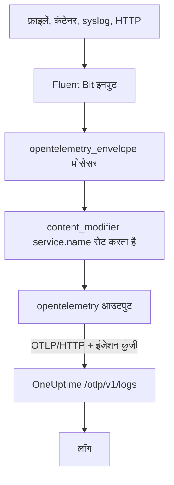

# Fluent Bit

[Fluent Bit](https://docs.fluentbit.io/manual) एक हल्का एजेंट है जो फ़ाइलों, systemd, कंटेनरों, syslog, HTTP और कई दूसरे स्रोतों से लॉग इकट्ठा करता है। इसका [OpenTelemetry आउटपुट](https://docs.fluentbit.io/manual/pipeline/outputs/opentelemetry) इकट्ठा किया गया डेटा OneUptime के OpenTelemetry (OTLP) एंडपॉइंट पर भेजता है, जहां लॉग **उत्पाद → लॉग** में खोजे जा सकते हैं।

:::cards
- [Fluent Bit कॉन्फ़िगर करें](#fluent-bit-कॉन्फ़िगर-करें): OpenTelemetry आउटपुट जोड़ें और अपनी सेवा का नाम दें।
- [पूरा उदाहरण](#पूरा-उदाहरण): शुरुआत के लिए एक पूरी कॉन्फ़िगरेशन फ़ाइल।
- [सेल्फ़-होस्टेड OneUptime](#सेल्फ़-होस्टेड-oneuptime): Fluent Bit को अपने इंस्टेंस की ओर करें।
:::

## यह कैसे काम करता है



Fluent Bit हर रिकॉर्ड को एक OpenTelemetry एनवेलप में लपेटता है, ताकि वह `service.name` जैसे रिसोर्स एट्रिब्यूट ले जा सके। फिर OpenTelemetry आउटपुट रिकॉर्ड को `x-oneuptime-token` हेडर में आपकी इंजेशन कुंजी के साथ OneUptime को भेजता है। OneUptime उन्हें `service.name` में बताई गई सेवा के तहत रखता है, और पहली बार डेटा भेजे जाने पर वह सेवा बना देता है।

## शुरू करने से पहले

- **Fluent Bit इंस्टॉल करें** — [इंस्टॉलेशन गाइड](https://docs.fluentbit.io/manual/installation/getting-started-with-fluent-bit) देखें। इस पेज की कॉन्फ़िगरेशन Fluent Bit के YAML फ़ॉर्मैट और `opentelemetry_envelope` प्रोसेसर का इस्तेमाल करती है, इसलिए हाल की रिलीज़ इस्तेमाल करें।
- **एक OneUptime प्रोजेक्ट।** OneUptime Cloud पर टेलीमेट्री का बिल प्रति GB इंजेस्ट किए गए डेटा पर बनता है — देखें [मूल्य](https://oneuptime.com/pricing) — और Free प्लान वाले प्रोजेक्ट को टेलीमेट्री भेजने से पहले भुगतान विधि जोड़नी होती है।
- **एक टेलीमेट्री इंजेशन कुंजी।** अगर आपके पास नहीं है:

:::steps
### इंजेशन कुंजियाँ खोलें

**उत्पाद → प्रोजेक्ट सेटिंग्स** पर जाएं, साइड मेन्यू में **टेलीमेट्री और APM** खोलें और **इंजेशन कुंजियाँ** चुनें।


### एक कुंजी बनाएं

**इन्जेशन कुंजी बनाएँ** पर क्लिक करें। डायलॉग में कुंजी का नाम पहले से भरा होता है और **सर्वर** चुना होता है — वह कुंजी प्रकार जिससे कोई एप्लिकेशन या collector डेटा भेजता है — इसलिए उसे बनाने के लिए **इन्जेशन कुंजी बनाएँ** पर क्लिक करें, या पहले उसका नाम बदलें।

### सीक्रेट कॉपी करें

नई कुंजी अपने पेज पर खुलती है। उसकी **सीक्रेट कुंजी** कॉपी करें: यही नीचे की कॉन्फ़िगरेशन में `YOUR_TELEMETRY_INGESTION_TOKEN` है।


:::

## Fluent Bit कॉन्फ़िगर करें

Fluent Bit अपनी YAML कॉन्फ़िगरेशन `/etc/fluent-bit/fluent-bit.yaml` जैसी फ़ाइल से पढ़ता है।

:::steps
### OpenTelemetry आउटपुट जोड़ें

एक `opentelemetry` आउटपुट जोड़ें जो OneUptime को भेजे। अगर आप रिकॉर्ड लोकल रूप से देखना चाहते हैं, तो टेस्ट करते समय `stdout` आउटपुट रहने दें:

```yaml title="fluent-bit.yaml"
pipeline:
  outputs:
    - name: stdout
      match: "*"
    - name: opentelemetry
      match: "*"
      host: "oneuptime.com"
      port: 443
      metrics_uri: "/otlp/v1/metrics"
      logs_uri: "/otlp/v1/logs"
      traces_uri: "/otlp/v1/traces"
      tls: On
      header:
        - x-oneuptime-token YOUR_TELEMETRY_INGESTION_TOKEN
```

### लॉग को OpenTelemetry एनवेलप में लपेटें और सेवा का नाम दें

हर इनपुट में `opentelemetry_envelope` प्रोसेसर जोड़ें, उसके बाद एक `content_modifier` जो `service.name` सेट करे। `YOUR_SERVICE_NAME` की जगह वह नाम लिखें जिसके तहत लॉग OneUptime में दिखने चाहिए:

```yaml title="fluent-bit.yaml"
pipeline:
  inputs:
    - name: tail # or any other input
      path: /var/log/my-app/*.log

      processors:
        logs:
          - name: opentelemetry_envelope

          - name: content_modifier
            context: otel_resource_attributes
            action: upsert
            key: service.name
            value: YOUR_SERVICE_NAME
```

### Fluent Bit रीस्टार्ट करें

Fluent Bit सर्विस को रीस्टार्ट करें, या उसे `fluent-bit -c /etc/fluent-bit/fluent-bit.yaml` से शुरू करें। कुछ ही सेकंड में लॉग **उत्पाद → लॉग** में दिखते हैं, और सेवा **उत्पाद → सेवाएं** में सूचीबद्ध हो जाती है।
:::

## पूरा उदाहरण

यह कॉन्फ़िगरेशन पोर्ट `8888` पर HTTP से लॉग लेती है और उन्हें OneUptime को आगे भेजती है:

```yaml title="fluent-bit.yaml"
service:
  flush: 1
  log_level: info

pipeline:
  inputs:
    - name: http
      listen: 0.0.0.0
      port: 8888

      processors:
        logs:
          - name: opentelemetry_envelope

          - name: content_modifier
            context: otel_resource_attributes
            action: upsert
            key: service.name
            value: YOUR_SERVICE_NAME

  outputs:
    - name: stdout
      match: "*"
    - name: opentelemetry
      match: "*"
      host: "oneuptime.com"
      port: 443
      metrics_uri: "/otlp/v1/metrics"
      logs_uri: "/otlp/v1/logs"
      traces_uri: "/otlp/v1/traces"
      tls: On
      header:
        - x-oneuptime-token YOUR_TELEMETRY_INGESTION_TOKEN
```

`http` इनपुट की जगह वे इनपुट लगाएं जिनकी आपको ज़रूरत है — जैसे लॉग फ़ाइलों के लिए `tail` या जर्नल के लिए `systemd` — और हर इनपुट पर दोनों प्रोसेसर बनाए रखें।

## सेल्फ़-होस्टेड OneUptime

`host` को अपने OneUptime इंस्टेंस के होस्ट पर सेट करें। अगर वह HTTPS के बजाय सादे HTTP पर चलता है, तो `port` को भी उस पोर्ट पर सेट करें जिस पर वह सुनता है (आमतौर पर `80`) और `tls` हटा दें:

```yaml title="fluent-bit.yaml"
pipeline:
  outputs:
    - name: stdout
      match: "*"
    - name: opentelemetry
      match: "*"
      host: "your-oneuptime-instance.com"
      port: 80
      metrics_uri: "/otlp/v1/metrics"
      logs_uri: "/otlp/v1/logs"
      traces_uri: "/otlp/v1/traces"
      header:
        - x-oneuptime-token YOUR_TELEMETRY_INGESTION_TOKEN
```

## समस्या निवारण

:::details Fluent Bit, OpenTelemetry आउटपुट से `401` लॉग करता है
इंजेशन कुंजी मौजूद नहीं है, अज्ञात है या समाप्त हो गई है। `header` लाइन जांचें: यह `x-oneuptime-token`, एक स्पेस, और फिर कुंजी की **सीक्रेट कुंजी** है।
:::

:::details Fluent Bit `402` या `422` लॉग करता है
`402`: OneUptime Cloud पर प्रोजेक्ट Free प्लान पर है और उसकी कोई भुगतान विधि नहीं है। **प्रोजेक्ट सेटिंग्स → बिलिंग और चालान → बिलिंग** में एक जोड़ें। `422`: कुंजी अक्षम है, या यह ब्राउज़र कुंजी है। कुंजी की सेटिंग में **सक्षम** फिर से चालू करें, या **सर्वर** कुंजी बनाएं।
:::

:::details लॉग किसी अनपेक्षित सेवा के तहत पहुंचते हैं
सेवा `service.name` से तय होती है। जांचें कि हर इनपुट में `opentelemetry_envelope` प्रोसेसर हो, और उसके बाद वह `content_modifier` जो इसे सेट करता है।
:::

:::details कुछ नहीं पहुंचता, और Fluent Bit कनेक्शन एरर लॉग करता है
जांचें कि HTTPS एंडपॉइंट के लिए `tls: On` और `port: 443` सेट हैं, और Fluent Bit चलाने वाला होस्ट उस पोर्ट पर आपके OneUptime होस्ट तक पहुंच सकता है।
:::

अगर आपके कोई सवाल हैं या कॉन्फ़िगरेशन में मदद चाहिए, तो हमें support@oneuptime.com पर लिखें।

## अगले कदम

:::cards
- [लॉग पाइपलाइन](/docs/telemetry/log-pipelines): Fluent Bit के भेजे लॉग पार्स करें और समृद्ध करें।
- [खोज सिंटैक्स](/docs/telemetry/search-syntax): लॉग एक्सप्लोरर में लॉग ढूंढें।
- [OpenTelemetry](/docs/telemetry/open-telemetry): सभी टेलीमेट्री के एंडपॉइंट, कुंजियां और सीमाएं।
- [Fluentd](/docs/telemetry/fluentd): इसके बजाय Fluentd इस्तेमाल करें।
:::
