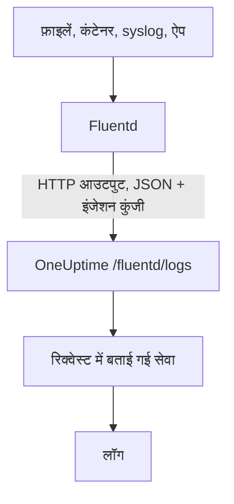

# Fluentd

[Fluentd](https://www.fluentd.org/) फ़ाइलों, कंटेनरों, syslog, एप्लिकेशन और [कई दूसरे स्रोतों](https://www.fluentd.org/datasources) से लॉग इकट्ठा करता है। इसका बिल्ट-इन [HTTP आउटपुट](https://docs.fluentd.org/output/http) उन्हें OneUptime के Fluentd एंडपॉइंट पर भेजता है, जहां वे **उत्पाद → लॉग** में खोजे जा सकते हैं।

:::cards
- [Fluentd कॉन्फ़िगर करें](#fluentd-कॉन्फ़िगर-करें): एक HTTP आउटपुट जोड़ें जो OneUptime की ओर इशारा करे।
- [रिकॉर्ड कैसे पढ़े जाते हैं](#रिकॉर्ड-कैसे-पढ़े-जाते-हैं): कौन-से फ़ील्ड मैसेज, सीवियरिटी और एट्रिब्यूट बनते हैं।
- [सेल्फ़-होस्टेड OneUptime](#सेल्फ़-होस्टेड-oneuptime): Fluentd को अपने इंस्टेंस की ओर करें।
:::

## यह कैसे काम करता है



Fluentd रिकॉर्ड को JSON के बैच में भेजता है, जिसमें आपकी इंजेशन कुंजी `x-oneuptime-token` हेडर में और सेवा का नाम `x-oneuptime-service-name` में होता है। OneUptime हर रिकॉर्ड को उस सेवा का एक लॉग बना देता है, और पहली बार डेटा भेजे जाने पर सेवा बनाता है।

## शुरू करने से पहले

- **Fluentd इंस्टॉल करें** — [इंस्टॉलेशन गाइड](https://docs.fluentd.org/installation) देखें।
- **एक OneUptime प्रोजेक्ट।** OneUptime Cloud पर टेलीमेट्री का बिल प्रति GB इंजेस्ट किए गए डेटा पर बनता है — देखें [मूल्य](https://oneuptime.com/pricing) — और Free प्लान वाले प्रोजेक्ट को टेलीमेट्री भेजने से पहले भुगतान विधि जोड़नी होती है।
- **एक टेलीमेट्री इंजेशन कुंजी।** अगर आपके पास नहीं है:

:::steps
### इंजेशन कुंजियाँ खोलें

**उत्पाद → प्रोजेक्ट सेटिंग्स** पर जाएं, साइड मेन्यू में **टेलीमेट्री और APM** खोलें और **इंजेशन कुंजियाँ** चुनें।


### एक कुंजी बनाएं

**इन्जेशन कुंजी बनाएँ** पर क्लिक करें। डायलॉग में कुंजी का नाम पहले से भरा होता है और **सर्वर** चुना होता है — वह कुंजी प्रकार जिससे कोई एप्लिकेशन या collector डेटा भेजता है — इसलिए उसे बनाने के लिए **इन्जेशन कुंजी बनाएँ** पर क्लिक करें, या पहले उसका नाम बदलें।

### सीक्रेट कॉपी करें

नई कुंजी अपने पेज पर खुलती है। उसकी **सीक्रेट कुंजी** कॉपी करें: यही नीचे की कॉन्फ़िगरेशन में `YOUR_SERVICE_TOKEN` है।


:::

## Fluentd कॉन्फ़िगर करें

Fluentd की कॉन्फ़िगरेशन फ़ाइल आमतौर पर `/etc/fluent/fluentd.conf` होती है, या पुराने td-agent पैकेज के लिए `/etc/td-agent/td-agent.conf`।

:::steps
### एक HTTP आउटपुट जोड़ें

एक `<match>` सेक्शन जोड़ें जो रिकॉर्ड OneUptime को भेजे। `YOUR_SERVICE_TOKEN` की जगह अपनी इंजेशन कुंजी लिखें, और `YOUR_SERVICE_NAME` की जगह वह नाम जिसके तहत लॉग दिखने चाहिए — कोई भी नाम जो आप चाहें:

```text title="fluentd.conf"
# Match all patterns
<match **>
  @type http

  endpoint https://oneuptime.com/fluentd/logs
  open_timeout 2

  headers {"x-oneuptime-token":"YOUR_SERVICE_TOKEN", "x-oneuptime-service-name":"YOUR_SERVICE_NAME"}

  content_type application/json
  json_array true

  <format>
    @type json
  </format>
  <buffer>
    flush_interval 10s
  </buffer>
</match>
```

`json_array true` हर बफ़र फ़्लश को एक JSON ऐरे के रूप में भेजता है, और `flush_interval 10s` हर 10 सेकंड में एक बैच भेजता है।

### Fluentd रीस्टार्ट करें

Fluentd सर्विस को रीस्टार्ट करें, ताकि वह नया आउटपुट लोड करे।

### जांचें कि लॉग पहुंच रहे हैं

अगले फ़्लश के कुछ सेकंड के अंदर लॉग **उत्पाद → लॉग** में दिखते हैं। सेवा **उत्पाद → सेवाएं** में सूचीबद्ध होती है — अगर वह पहले से नहीं थी, तो OneUptime उसे बना देता है।
:::

## पूरा उदाहरण

यह कॉन्फ़िगरेशन पोर्ट `24224` पर Fluentd के forward प्रोटोकॉल से रिकॉर्ड लेती है और उन सभी को OneUptime को भेजती है:

```text title="fluentd.conf"
####
## Source descriptions:
##

## built-in TCP input
## @see https://docs.fluentd.org/input/forward
<source>
  @type forward
  port 24224
  bind 0.0.0.0
</source>

<match **>
  @type http

  endpoint https://oneuptime.com/fluentd/logs
  open_timeout 2

  headers {"x-oneuptime-token":"YOUR_SERVICE_TOKEN", "x-oneuptime-service-name":"YOUR_SERVICE_NAME"}

  content_type application/json
  json_array true

  <format>
    @type json
  </format>
  <buffer>
    flush_interval 10s
  </buffer>
</match>
```

अलग-अलग स्रोतों को अलग-अलग सेवाओं के रूप में भेजने के लिए, हर टैग के लिए एक `<match>` सेक्शन इस्तेमाल करें, और हर एक में अपना `x-oneuptime-service-name` रखें।

## रिकॉर्ड कैसे पढ़े जाते हैं

OneUptime हर रिकॉर्ड से ये फ़ील्ड पढ़ता है:

| लॉग फ़ील्ड | रिकॉर्ड में इनमें से पहले मौजूद फ़ील्ड से पढ़ा जाता है | नोट्स |
| --- | --- | --- |
| बॉडी | `message`, `log`, `msg`, `body`, `text` | लॉग लाइन। इनमें से कोई फ़ील्ड न हो, तो पूरा रिकॉर्ड JSON के रूप में रखा जाता है। |
| सीवियरिटी | `level`, `severity`, `loglevel`, `log_level`, `priority`, `severityText`, `severity_text` | `trace`, `debug`, `info`, `notice`, `warn`, `error`, `critical` और `fatal` जैसे नाम, किसी भी केस में। कोई और मान `Unspecified` के रूप में रखा जाता है। |
| ट्रेस ID | `trace_id`, `traceId`, `traceid` | लॉग को उसके ट्रेस से जोड़ता है। |
| स्पैन ID | `span_id`, `spanId`, `spanid` | लॉग को उसके स्पैन से जोड़ता है। |
| सेवा | `x-oneuptime-service-name` हेडर | हेडर सेट न हो तो `Fluentd`। |
| समय | — | वह समय जब OneUptime रिकॉर्ड प्राप्त करता है। |

बाकी हर फ़ील्ड `fluentd.` के बाद फ़ील्ड के नाम वाला एट्रिब्यूट बन जाता है, जिस पर आप खोज और फ़िल्टर कर सकते हैं: लॉग एक्सप्लोरर में `container_name` फ़ील्ड `@fluentd.container_name` होता है। नेस्टेड ऑब्जेक्ट डॉट्स से फ़्लैट किया जाता है, जैसे `fluentd.kubernetes.pod_name`, और सूची JSON के रूप में रखी जाती है।

Fluentd लॉग भी किसी दूसरे लॉग की तरह आपकी [लॉग पाइपलाइन](/docs/telemetry/log-pipelines), ड्रॉप फ़िल्टर और स्क्रब नियमों से गुज़रते हैं।

## सेल्फ़-होस्टेड OneUptime

`endpoint` में `https://oneuptime.com` की जगह अपने OneUptime इंस्टेंस का URL लिखें: `http(s)://YOUR_ONEUPTIME_HOST/fluentd/logs`।

## समस्या निवारण

:::details Fluentd, HTTP आउटपुट से `401` लॉग करता है
इंजेशन कुंजी मौजूद नहीं है, अज्ञात है या समाप्त हो गई है। `headers` में `x-oneuptime-token` का मान जांचें।
:::

:::details Fluentd `402` या `422` लॉग करता है
`402`: OneUptime Cloud पर प्रोजेक्ट Free प्लान पर है और उसकी कोई भुगतान विधि नहीं है। **प्रोजेक्ट सेटिंग्स → बिलिंग और चालान → बिलिंग** में एक जोड़ें। `422`: कुंजी अक्षम है, या यह ब्राउज़र कुंजी है। कुंजी की सेटिंग में **सक्षम** फिर से चालू करें, या **सर्वर** कुंजी बनाएं।
:::

:::details लॉग `Fluentd` सेवा के तहत पहुंचते हैं
`x-oneuptime-service-name` हेडर मौजूद नहीं है। इसे हर `<match>` सेक्शन में `headers` में जोड़ें।
:::

:::details लॉग की बॉडी में पूरा रिकॉर्ड JSON के रूप में दिखता है
OneUptime बॉडी को `message`, `log`, `msg`, `body` या `text` में से रिकॉर्ड में पहले मौजूद फ़ील्ड से लेता है, और इनमें से कोई न हो तो पूरा रिकॉर्ड रखता है। अपनी लॉग लाइन वाले फ़ील्ड का नाम इनमें से किसी एक में बदलें, जैसे Fluentd के `record_transformer` फ़िल्टर से।
:::

अगर आपके कोई सवाल हैं या कॉन्फ़िगरेशन में मदद चाहिए, तो हमें support@oneuptime.com पर लिखें।

## अगले कदम

:::cards
- [लॉग पाइपलाइन](/docs/telemetry/log-pipelines): Fluentd के भेजे लॉग पार्स करें और समृद्ध करें।
- [खोज सिंटैक्स](/docs/telemetry/search-syntax): लॉग एक्सप्लोरर में लॉग ढूंढें।
- [Fluent Bit](/docs/telemetry/fluentbit): एक हल्का एजेंट जो OpenTelemetry से भेजता है।
- [लॉग मॉनिटर](/docs/monitor/logs-monitor): मेल खाते लॉग दिखने पर अलर्ट करें।
:::
