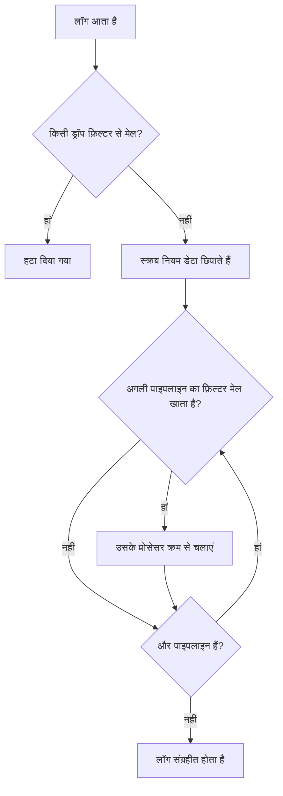

# लॉग पाइपलाइन

लॉग पाइपलाइन लॉग को तब बदलती हैं जब OneUptime उन्हें इंजेस्ट करता है, उनके संग्रहीत होने से पहले। एक पाइपलाइन में एक **फ़िल्टर** होता है जो तय करता है कि वह किन लॉग पर लागू होगी, और **प्रोसेसर** की एक क्रमबद्ध सूची होती है जिनमें से हर एक उन लॉग को बदलता है: संदेश से फ़ील्ड निकालना, गंभीरता ठीक करना, किसी एट्रिब्यूट का नाम बदलना, या लॉग को किसी श्रेणी से टैग करना।

पाइपलाइन **लॉग → सेटिंग्स → पाइपलाइन** में होती हैं।

:::cards
- [पाइपलाइन कैसे चलती है](#पाइपलाइन-कैसे-चलती-है): इंजेशन में पाइपलाइन कहां बैठती हैं, और किस क्रम में चलती हैं।
- [पाइपलाइन बनाएं](#पाइपलाइन-बनाएं): कुछ लॉग का मिलान करें और उनमें प्रोसेसर जोड़ें।
- [Key=Value Parser](#keyvalue-parser): फ़ायरवॉल और logfmt पंक्तियों को एट्रिब्यूट में बदलें।
- [उदाहरण: Sophos XGS फ़ायरवॉल](#उदाहरण-sophos-xgs-फ़ायरवॉल): फ़ायरवॉल syslog को शुरू से अंत तक पार्स करें।
:::

## पाइपलाइन कैसे चलती है

पाइपलाइन OneUptime द्वारा इंजेस्ट किए गए हर लॉग पर चलती हैं — OpenTelemetry लॉग, syslog और Fluentd सभी पर — ड्रॉप फ़िल्टर और स्क्रब नियमों के बाद, और लॉग के संग्रहीत होने से पहले:



- **पाइपलाइन क्रम से चलती हैं** — सूची के क्रम में, जिसे आप पंक्तियों को ड्रैग करके बदलते हैं। कोई पाइपलाइन केवल उन लॉग को छूती है जिनसे उसका फ़िल्टर मेल खाता है, और जिस भी पाइपलाइन का फ़िल्टर मेल खाता है वह चलती है, केवल पहली नहीं।
- **प्रोसेसर भी क्रम से चलते हैं**, और हर एक वही देखता है जो पिछले ने बनाया, इसलिए पार्सर को उस प्रोसेसर से पहले आना चाहिए जो उसके निकाले गए फ़ील्ड पढ़ता है। बाद की पाइपलाइन का फ़िल्टर भी पहले की पाइपलाइन के बदलाव देखता है।
- **प्रोसेसिंग इंजेशन के समय होती है।** पाइपलाइन बदलने का असर उसके बाद आने वाले लॉग पर लगभग एक मिनट के भीतर होता है; पहले से संग्रहीत लॉग दोबारा प्रोसेस नहीं होते।
- **प्रोसेसर कभी किसी लॉग को हटाता या खाली नहीं करता।** जिस पंक्ति को पार्सर नहीं पढ़ पाता, वह बिना बदले आगे निकल जाती है। लॉग हटाने के लिए **लॉग → सेटिंग्स → ड्रॉप फ़िल्टर** का उपयोग करें।
- **केवल सक्षम पाइपलाइन और प्रोसेसर चलते हैं।** सेटअप खोए बिना रोकने के लिए उसे उसके पेज पर बंद करें।

## प्रोसेसर के प्रकार

| प्रोसेसर | क्या करता है |
| --- | --- |
| Grok Parser | किसी नामित पैटर्न से, तय आकार वाली पंक्ति (जैसे nginx एक्सेस पंक्ति) से फ़ील्ड निकालता है। |
| Key=Value Parser | `key=value` जोड़ियों वाली पंक्ति (Sophos XGS, Fortinet, logfmt) को किसी भी क्रम में एट्रिब्यूट में बांटता है। |
| गंभीरता रीमैपर | किसी एट्रिब्यूट के `warn` जैसे कच्चे स्तर को लॉग की मानक गंभीरता पर मैप करता है। |
| विशेषता रीमैपर | किसी एट्रिब्यूट का नाम बदलता या उसे कॉपी करता है, जैसे `src_ip` से `source_ip`। |
| श्रेणी प्रोसेसर | फ़िल्टर से मेल खाने पर लॉग को किसी श्रेणी नाम से टैग करता है, जैसे "Payment Error"। |

## शुरू करने से पहले

- OneUptime में आ रहे लॉग — [OpenTelemetry](/docs/telemetry/open-telemetry), [syslog](/docs/telemetry/syslog), [Fluentd](/docs/telemetry/fluentd) या किसी प्रोब के ज़रिए।
- पाइपलाइन बदलने की अनुमति। प्रोजेक्ट के स्वामी और व्यवस्थापकों के पास यह होती है; बाकी सभी को **Create Log Pipeline** और **Create Log Pipeline Processor** अनुमतियां चाहिए।

## पाइपलाइन बनाएं

:::steps
### नई पाइपलाइन बनाएं

**लॉग → सेटिंग्स → पाइपलाइन** पर जाएं और **लॉग पाइपलाइन बनाएँ** पर क्लिक करें। उसे एक **नाम** दें, जैसे *फ़ायरवॉल लॉग पार्स करें*, और बनाएं। पाइपलाइन का पेज खुल जाता है।

### चुनें कि यह किन लॉग पर लागू हो

**फ़िल्टर शर्तें** में **संपादित करें** पर क्लिक करें और **गंभीरता**, **लॉग बॉडी**, **सेवा ID** या किसी कस्टम एट्रिब्यूट पर शर्तें जोड़ें। उन्हें **सभी शर्तें** या **कोई भी शर्त** से जोड़ें, फिर **परिवर्तन सहेजें** पर क्लिक करें। बिना शर्तों वाली पाइपलाइन हर लॉग पर लागू होती है।

### प्रोसेसर जोड़ें

**प्रोसेसर** में **प्रोसेसर जोड़ें** पर क्लिक करें, **प्रोसेसर नाम** लिखें, **प्रोसेसर प्रकार** चुनें और उसकी सेटिंग भरें। Grok और Key=Value पार्सर में एक टेस्टर होता है: यह देखने के लिए कि वे क्या निकालेंगे, एक नमूना पंक्ति चिपकाएं। **प्रोसेसर बनाएँ** पर क्लिक करें।

### उन्हें क्रम में रखें

प्रोसेसर किस क्रम में चलें, यह बदलने के लिए उन्हें ड्रैग करें, और **पाइपलाइन** सूची में पाइपलाइन को भी इसी तरह ड्रैग करें। नए लॉग लगभग एक मिनट के भीतर प्रोसेस होते हैं।
:::

### फ़िल्टर शर्तें

हर शर्त किसी फ़ील्ड की तुलना किसी मान से करती है। बिल्डर के पीछे फ़िल्टर एक क्वेरी है, जैसे `severityText = 'Error' AND body LIKE 'timeout'`, जिसे **Preview query** दिखाता है।

| ऑपरेटर | क्वेरी में | नोट |
| --- | --- | --- |
| बराबर है | `=` | सटीक और केस-संवेदी। |
| बराबर नहीं है | `!=` | सटीक और केस-संवेदी। |
| शामिल है | `LIKE` | केस को अनदेखा करता है। मान में `%` वाइल्डकार्ड है। |
| इनमें से एक है | `IN` | सटीक मानों की कॉमा से अलग की गई सूची। |

गंभीरता के मान `Fatal`, `Error`, `Warning`, `Information`, `Debug`, `Trace` और `Unspecified` हैं — इसलिए `severityText = 'Error'` मेल खाता है और `'ERROR'` कभी नहीं खाएगा। कस्टम एट्रिब्यूट `attributes.<key>` के रूप में लिखा जाता है, जैसे `attributes.networkDevice.name = 'hq-firewall'`।

## Key=Value Parser

फ़ायरवॉल और दूसरे नेटवर्क उपकरण हर इवेंट को `key=value` जोड़ियों की एक पंक्ति के रूप में लॉग करते हैं। किसी पंक्ति में कौन-से फ़ील्ड हैं, और किस क्रम में, यह इवेंट पर निर्भर करता है, इसलिए एक grok पैटर्न उन्हें बयान नहीं कर सकता। Key=Value Parser को पैटर्न की ज़रूरत नहीं: यह पूरी पंक्ति पढ़ता है और मिली हर जोड़ी को लॉग एट्रिब्यूट में बदल देता है, क्रम चाहे जो हो। एट्रिब्यूट बन जाने के बाद आप उन पर खोज और फ़िल्टर कर सकते हैं, उन्हें [लॉग मॉनिटर](/docs/monitor/logs-monitor) में इस्तेमाल कर सकते हैं, और [प्रति-समूह अलर्टिंग](/docs/monitor/logs-monitor) से हर टनल, इंटरफ़ेस या उपयोगकर्ता के लिए एक बार अलर्ट कर सकते हैं।

### कॉन्फ़िगरेशन

| सेटिंग | डिफ़ॉल्ट | विवरण |
| --- | --- | --- |
| Source Field | `body` | पार्स करने वाला फ़ील्ड: लॉग संदेश के लिए `body`, या `attributes.raw_line` जैसा कोई एट्रिब्यूट। |
| Target Prefix | कोई नहीं | निकाली गई कुंजियों के लिए नेमस्पेस। `sophos`, `con_name` को `sophos.con_name` के रूप में संग्रहीत करता है। जब तक प्रीफ़िक्स पहले से `.`, `_`, `-` या `:` पर ख़त्म न हो, एक विभाजक जोड़ा जाता है। |
| Pair Delimiter | कोई भी व्हाइटस्पेस | एक जोड़ी को अगली से क्या अलग करता है। Sophos, Fortinet और logfmt के लिए इसे खाली छोड़ें; दूसरे फ़ॉर्मैट के लिए `,`, `;` या `\|` सेट करें। |
| Key-Value Delimiter | `=` | कुंजी को उसके मान से क्या अलग करता है, जैसे `status:up` के लिए `:`। |
| विरोध पर ओवरराइड करें | बंद | क्या कोई कुंजी लॉग में पहले से मौजूद एट्रिब्यूट को बदल सकती है। डिफ़ॉल्ट रूप से बंद: कुंजियां पंक्ति से ही आती हैं, वरना कोई पंक्ति इंजेशन के समय सेट किए गए एट्रिब्यूट दोबारा लिख सकती है, जैसे वह डिवाइस जिससे वह आई। |

दोनों विभाजक अलग होने चाहिए, एक-दूसरे को शामिल नहीं कर सकते, और उनमें कोट या बैकस्लैश नहीं हो सकते; हर एक अधिकतम 8 अक्षर लंबा होता है। प्रोसेसर फ़ॉर्म सहेजने से पहले यह जांचता है, और उसका टेस्टर, **Test With a Sample Line**, ठीक वही एट्रिब्यूट दिखाता है जो कोई नमूना पंक्ति बनाएगी।

### पार्सिंग नियम

- **कोट वाले मान** अपने स्पेस और विभाजक बनाए रखते हैं: `message="IPSec Connection HQ-Branch1 terminated"` एक ही मान है। डबल और सिंगल दोनों कोट काम करते हैं, और मान के अंदर `\"` एक शाब्दिक कोट है। जो कोट कभी बंद नहीं होता — syslog आकार सीमा से कटी पंक्ति — वह पंक्ति के अंत तक चलता है।
- **बिना कोट वाले मान** अगले जोड़ी विभाजक तक चलते हैं, इसलिए `url=https://example.com/?a=b` अपना `=` बनाए रखता है।
- **खाली मान** (`key=` और `key=""`) खाली स्ट्रिंग के रूप में संग्रहीत होते हैं।
- **मान हमेशा टेक्स्ट होते हैं।** `latency=11` को `"11"` के रूप में संग्रहीत किया जाता है, ठीक बिना प्रकार वाले grok कैप्चर की तरह।
- **कुंजियां** किसी अक्षर या अंडरस्कोर से शुरू होती हैं और उनमें अक्षर, अंक और `. _ - @` होते हैं। पहली जोड़ी से पहले का टेक्स्ट, जैसे RFC 3164 syslog हेडर, और बिना विभाजक वाले भटके शब्द छोड़ दिए जाते हैं। पहली कुंजी से चिपकी syslog प्राथमिकता (`<30>device_name="SFW"`) हटा दी जाती है और कुंजी रखी जाती है।
- **दोहराई गई कुंजी अपना पहला मान रखती है**; बाद के मान अनदेखे किए जाते हैं।
- **सीमाएं:** 32 KiB से लंबी पंक्ति पार्स नहीं होती, एक पंक्ति से अधिकतम 100 जोड़ियां ली जाती हैं, 256 अक्षरों से लंबी कुंजियां छोड़ दी जाती हैं, और 4,096 अक्षरों से लंबे मान काट दिए जाते हैं।

### उदाहरण: Sophos XGS फ़ायरवॉल

जब कोई Sophos XGS फ़ायरवॉल किसी [प्रोब](/docs/monitor/network-device-monitor) को syslog भेजता है, तो हर संदेश नेटवर्क डिवाइस के लॉग के रूप में संग्रहीत होता है, और syslog संदेश उसकी बॉडी होता है। इसे पार्स करने के लिए:

:::steps
#### फ़ायरवॉल के लिए पाइपलाइन बनाएं

**लॉग → सेटिंग्स → पाइपलाइन** पर जाएं और एक पाइपलाइन बनाएं। उसे ऐसा फ़िल्टर दें जो फ़ायरवॉल के लॉग से मेल खाए, जैसे कस्टम एट्रिब्यूट `networkDevice.name` बराबर है `hq-firewall` (`attributes.networkDevice.name = 'hq-firewall'`), या हर Sophos पंक्ति से मेल के लिए **लॉग बॉडी** में `log_component=` शामिल है।

#### पार्सर जोड़ें

पाइपलाइन खोलें और **प्रोसेसर जोड़ें** पर क्लिक करें। **Key=Value Parser** चुनें, **Source Field** को `body` ही रहने दें, और **Target Prefix** को `sophos` पर सेट करें (वैकल्पिक, लेकिन इससे फ़ायरवॉल के फ़ील्ड एक साथ रहते हैं)।

#### जांचें और सहेजें

नतीजा जांचने के लिए फ़ायरवॉल की एक पंक्ति **Test With a Sample Line** में चिपकाएं, फिर **प्रोसेसर बनाएँ** पर क्लिक करें।
:::

एक Sophos IPsec इवेंट:

```text
device_name="SFW" timestamp="2024-05-02T11:03:12+0200" device_model="XGS2100" device_serial_id="X1234" log_id="010101600001" log_type="Event" log_component="IPSec" log_subtype="System" severity="Information" con_name="HQ-Branch1" src_ip="10.171.4.117" dst_ip="10.171.4.118" status="Terminated" message="IPSec Connection HQ-Branch1 between 10.171.4.117 and 10.171.4.118 for Child HQ-Branch1 terminated."
```

ये एट्रिब्यूट बन जाता है (दूसरों के साथ):

| एट्रिब्यूट | मान |
| --- | --- |
| `sophos.log_component` | `IPSec` |
| `sophos.con_name` | `HQ-Branch1` |
| `sophos.status` | `Terminated` |
| `sophos.src_ip` | `10.171.4.117` |
| `sophos.message` | `IPSec Connection HQ-Branch1 between 10.171.4.117 and 10.171.4.118 for Child HQ-Branch1 terminated.` |

SD-WAN SLA पंक्ति में फ़ील्ड का अलग समूह अलग क्रम में होता है, और वही प्रोसेसर उसे संभाल लेता है:

```text
log_id=158825619025 log_type="SD-WAN" log_component="SLA" profile_name="Branch-Internet" gw_name="WAN2" latency=11 jitter=2 packet_loss=0 gw_status="up" sla_status="SLA met"
```

इससे `sophos.gw_name = WAN2`, `sophos.latency = 11`, `sophos.packet_loss = 0`, `sophos.gw_status = up` और `sophos.sla_status = SLA met` मिलते हैं। पुरानी SFOS रिलीज़ एक लीगेसी फ़ॉर्मैट में लॉग करती हैं (`device="SFW" date=2017-01-31 time=18:02:03 timezone="IST" ... connectionname="Tunnel A"`); वह भी इसी तरह पार्स होता है, बस टनल का नाम `con_name` के बजाय `connectionname` में होता है।

इन SLA पंक्तियों को हर गेटवे के लेटेंसी, जिटर और पैकेट-लॉस मेट्रिक्स में बदलने के लिए [लॉग रिकॉर्डिंग नियम](/docs/telemetry/log-recording-rules) का उदाहरण देखें।

### उदाहरण: Fortinet FortiGate

FortiGate लॉग भी इसी शैली के होते हैं:

```text
date=2024-01-01 time=10:00:00 devname="FG100" logid="0100032001" type="event" subtype="vpn" level="notice" action="tunnel-down" vpntunnel="HQ-to-Branch2" msg="IPsec tunnel down"
```

डिफ़ॉल्ट सेटिंग और `fortigate` प्रीफ़िक्स के साथ इससे `fortigate.devname = FG100`, `fortigate.subtype = vpn`, `fortigate.action = tunnel-down`, `fortigate.vpntunnel = HQ-to-Branch2` और `fortigate.time = 10:00:00` मिलते हैं — समय मान में कोलन मान का हिस्सा हैं, विभाजक नहीं।

### हर टनल के लिए एक बार अलर्ट करें

फ़ील्ड पार्स हो जाने पर, कोई [लॉग मॉनिटर](/docs/monitor/logs-monitor) विफलताएं गिन सकता है और हर टनल के लिए अलग अलर्ट उठा सकता है: `sophos.log_component` = `IPSec` और बॉडी में `terminated` वाले लॉग पर फ़िल्टर करें, और `sophos.con_name` के अनुसार समूहित करें। देखें [प्रति-समूह अलर्टिंग](/docs/monitor/logs-monitor)।

## Grok Parser

तय आकार वाली पंक्ति से संरचित फ़ील्ड निकालता है। grok पैटर्न नामित संदर्भों वाला एक रेगुलर एक्सप्रेशन है: `%{IPV4:client_ip}` का अर्थ है "किसी IPv4 पते से मेल करो और उसे `client_ip` के रूप में संग्रहीत करो"। पैटर्न का पूरी पंक्ति से मेल खाना ज़रूरी नहीं, और जो पंक्ति मेल नहीं खाती वह बिना बदले रहती है।

| सेटिंग | डिफ़ॉल्ट | विवरण |
| --- | --- | --- |
| **Source Field** | `body` | पार्स करने वाला फ़ील्ड, Key=Value Parser की तरह। |
| **Target Prefix** | कोई नहीं | निकाले गए फ़ील्ड के लिए नेमस्पेस, उसी तरह जोड़ा जाता है। |
| **Grok Pattern** | — | पैटर्न। फ़ॉर्म उपलब्ध नामित पैटर्न की सूची दिखाता है। |

जब तक आप कोई प्रकार न दें, कैप्चर टेक्स्ट के रूप में संग्रहीत होता है: `%{NUMBER:status:int}` उसे संख्या के रूप में संग्रहीत करता है। प्रकार `int`, `long`, `float`, `double`, `boolean` और `string` हैं। सहेजने से पहले **Test Your Pattern** में किसी नमूना पंक्ति पर पैटर्न जांचें।

| लॉग बॉडी | पैटर्न | जोड़े गए एट्रिब्यूट |
| --- | --- | --- |
| `10.0.1.5 - GET /health 200` | `%{IPV4:client_ip} - %{WORD:method} %{NOTSPACE:path} %{NUMBER:status:int}` | client_ip, method, path, status |

जब पंक्ति ऐसी `key=value` जोड़ियों से बनी हो जिनका क्रम बदलता रहता है, तो इसके बजाय Key=Value Parser का उपयोग करें।

## गंभीरता रीमैपर

किसी एट्रिब्यूट से कच्चा मान पढ़ता है और उसे मानक गंभीरता पर मैप करता है। **स्रोत विशेषता** को उस एट्रिब्यूट पर सेट करें जिसमें स्तर है (डिफ़ॉल्ट रूप से `level`), फिर **मैपिंग** जोड़ें: हर मैपिंग आपके एप्लिकेशन के भेजे किसी मान, जैसे `warn`, को किसी गंभीरता, जैसे Warning, से जोड़ती है। मिलान केस को अनदेखा करता है। जिस मान की कोई मैपिंग नहीं, वह लॉग की गंभीरता को वैसा ही छोड़ देता है।

## विशेषता रीमैपर

एक एट्रिब्यूट (**स्रोत कुंजी**) का मान दूसरे (**लक्ष्य कुंजी**) में ले जाता है, जैसे `src_ip` से `source_ip`।

| सेटिंग | डिफ़ॉल्ट | असर |
| --- | --- | --- |
| **स्रोत संरक्षित करें** | बंद | बंद होने पर एट्रिब्यूट का नाम बदलता है: स्रोत कुंजी हटा दी जाती है। चालू होने पर उसे कॉपी करता है और स्रोत कुंजी रखता है। |
| **विरोध पर ओवरराइड करें** | चालू | चालू होने पर लक्ष्य पहले से मौजूद हो तो उसे बदल देता है। बंद होने पर लक्ष्य को वैसा ही छोड़ता है और रीमैप छोड़ देता है। |

## श्रेणी प्रोसेसर

नियमों की सूची को क्रम से जांचता है और जिस पहले नियम का फ़िल्टर मेल खाता है, उसका नाम एक लक्ष्य एट्रिब्यूट में संग्रहीत करता है, ताकि आप हर "Payment Error" लॉग को एक साथ खोज सकें। **लक्ष्य विशेषता** सेट करें (डिफ़ॉल्ट रूप से `category`), फिर **श्रेणी नियम** जोड़ें: एक **Category name** और **When logs match** के नीचे की शर्तें। पहला मेल खाने वाला नियम जीतता है; जो लॉग किसी से मेल नहीं खाता वह बिना बदले रहता है।

## अगले कदम

:::cards
- [लॉग मॉनिटर](/docs/monitor/logs-monitor): आपकी पाइपलाइन जो एट्रिब्यूट निकालती हैं, उन पर अलर्ट करें।
- [लॉग रिकॉर्डिंग नियम](/docs/telemetry/log-recording-rules): पार्स किए गए लॉग फ़ील्ड को मेट्रिक्स में बदलें।
- [Syslog](/docs/telemetry/syslog): फ़ायरवॉल और सर्वर का syslog OneUptime को भेजें।
- [खोज सिंटैक्स](/docs/telemetry/search-syntax): लॉग एक्सप्लोरर में नए एट्रिब्यूट पर खोजें।
:::
