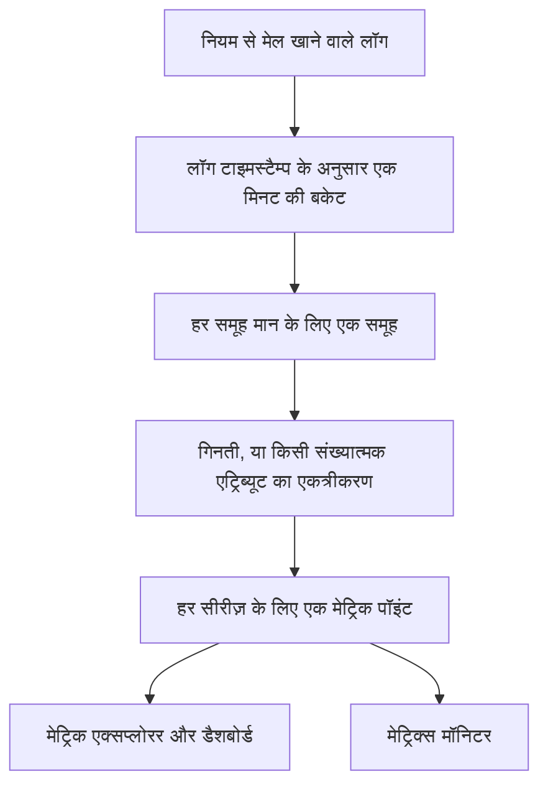
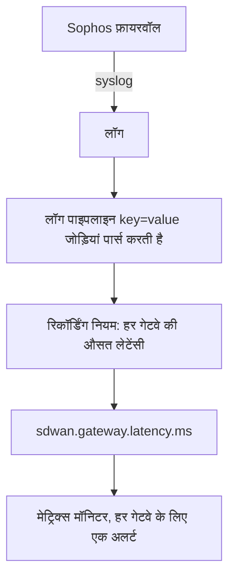

# लॉग रिकॉर्डिंग नियम

एक **Log Recording Rule** लॉग को मेट्रिक में बदलता है। हर मिनट यह अपने फ़िल्टर से मेल खाने वाले लॉग लेता है और मेट्रिक स्टोर में हर मिनट एक संख्या लिखता है: कितने लॉग मेल खाए, या उन लॉग में मौजूद किसी संख्यात्मक एट्रिब्यूट का योग, औसत, न्यूनतम, अधिकतम या कोई पर्सेंटाइल। नतीजे को अधिकतम पांच लॉग एट्रिब्यूट से बांटें और आपको हर मान के लिए एक सीरीज़ मिलती है — हर गेटवे, हर होस्ट, हर ग्राहक के लिए एक।

:::cards
- [नियम कैसे काम करता है](#नियम-कैसे-काम-करता-है): बकेट, समय, कैच-अप और खाली जगहें।
- [नियम बनाना](#नियम-बनाना): नियम एडिटर के फ़ील्ड।
- [उदाहरण: SD-WAN गेटवे लेटेंसी](#उदाहरण-sophos-फ़ायरवॉल-से-sd-wan-गेटवे-लेटेंसी): फ़ायरवॉल syslog से हर गेटवे के अलर्ट तक।
- [अनुमतियां](#अनुमतियां): कौन नियम बना, बदल और पढ़ सकता है।
:::

## अवलोकन

आउटपुट एक सामान्य मेट्रिक है। इसका चार्ट **मेट्रिक एक्सप्लोरर** और डैशबोर्ड पर बनाएं, और **मेट्रिक्स** मॉनिटर से इस पर अलर्ट करें — **इसके अनुसार समूहित करें** के साथ हर सीरीज़ के लिए अलर्ट सहित।

लॉग रिकॉर्डिंग नियम तब इस्तेमाल करें जब आपके काम की संख्या केवल आपके लॉग में हो: किसी फ़ायरवॉल के SLA सारांश, कोई बैच जॉब जो अपना लिया गया समय लॉग करता है, किसी एक्सेस लॉग के रिस्पॉन्स आकार, या बस यह कि कोई सेवा हर मिनट कितने त्रुटि लॉग लिखती है।

लॉग रिकॉर्डिंग नियम **लॉग → सेटिंग्स → रिकॉर्डिंग नियम** में होते हैं। मेट्रिक्स और स्पैन के लिए इनके जैसे नियम **मेट्रिक्स → सेटिंग्स → रिकॉर्डिंग नियम** और **ट्रेस → सेटिंग्स → रिकॉर्डिंग नियम** में हैं।

## नियम कैसे काम करता है



- **हर सीरीज़ के लिए हर मिनट एक पॉइंट।** लॉग अपने टाइमस्टैम्प के अनुसार 1 मिनट की बकेट में बांटे जाते हैं। हर बकेट समूह एट्रिब्यूट के मानों के हर अलग संयोजन के लिए एक पॉइंट बनाती है।
- **मिनट ख़त्म होने के 30 सेकंड बाद गणना होती है।** यह छोटा इंतज़ार थोड़ी देर से आने वाले लॉग को भी उनके मिनट में आने देता है। इससे भी देर से आने वाला लॉग गिना नहीं जाता।
- **न खाली जगहें, न दोहरी गिनती।** हर नियम अपना लिखा आख़िरी मिनट याद रखता है (नियमों की सूची में **Computed Until** के रूप में दिखता है)। वर्कर के रीस्टार्ट या किसी दूसरे डाउनटाइम के बाद यह छूटे हुए मिनट पूरे करता है, 60 मिनट पीछे तक, और एक ही मिनट कभी दो बार नहीं लिखता।
- **बिना समूहीकरण वाली गिनती में कभी खाली जगह नहीं होती।** जिस मिनट में कोई मेल खाता लॉग नहीं होता, वह `0` के रूप में लिखा जाता है। बाकी हर नियम उस मिनट के लिए कुछ नहीं लिखता जिसमें एकत्रित करने को कुछ न हो, इसलिए चार्ट और मॉनिटर गढ़े हुए शून्य के बजाय "कोई डेटा नहीं" देखते हैं।
- **किसी भी दूसरे व्युत्पन्न मेट्रिक की तरह लिखा जाता है।** पॉइंट Gauge डेटा पॉइंट होते हैं जिनका नाम नियम के **आउटपुट मेट्रिक नाम** पर होता है, जिनमें समूह एट्रिब्यूट और `oneuptime.derived.log_rule_id` (नियम की ID) होते हैं, और उनका प्रतिधारण मेट्रिक और ट्रेस रिकॉर्डिंग नियमों के पॉइंट जैसा ही है: 15 दिन।

नियम की परिभाषा बदलने का असर उसके लिखे जाने वाले अगले मिनट से होता है; पहले से लिखे पॉइंट दोबारा नहीं लिखे जाते। नियम को बंद करने से वह रुक जाता है; फिर से चालू करने पर वह बंद रहने के दौरान छूटे मिनट पूरे करता है, उसी 60 मिनट की सीमा तक।

## नियम बनाना

:::steps
### रिकॉर्डिंग नियम खोलें

**लॉग → सेटिंग्स → रिकॉर्डिंग नियम** पर जाएं और **Log Recording Rule बनाएँ** चुनें।

### नियम को नाम दें

एक **नाम** लिखें। उसके नीचे का **आउटपुट मेट्रिक नाम** आपके लिखते-लिखते नाम से बनता है; अपना खुद का लिखने के लिए उसके बगल में **संपादित करें** चुनें।

### लॉग और गणना चुनें

**Which Logs** में टेलीमेट्री सेवाओं, गंभीरता, बॉडी टेक्स्ट और एट्रिब्यूट फ़िल्टर से नियम को सीमित करें। एक **एकत्रीकरण** चुनें, और गिनती के अलावा किसी भी चीज़ के लिए वह **Numeric Attribute** चुनें जिसका एकत्रीकरण करना है।

### नतीजा बांटें और सहेजें

चाहें तो **इसके अनुसार समूहित करें** एट्रिब्यूट और एक **Unit** जोड़ें। एडिटर के नीचे की पंक्ति जांचें, फिर सहेजें। कुछ ही मिनटों में नियमों की सूची में **Computed Until** समय दिखता है।
:::

| फ़ील्ड | क्या करता है |
| --- | --- |
| नाम | नियम क्या गणना करता है, जैसे *SD-WAN gateway latency*। |
| आउटपुट मेट्रिक नाम | वह मेट्रिक जो नियम लिखता है। नाम से बनता है — *SD-WAN gateway latency* `sd_wan_gateway_latency` लिखता है — जब तक आप **संपादित करें** चुनकर अपना नाम न लिखें। यह प्रोजेक्ट के रिकॉर्डिंग नियमों में अद्वितीय होना चाहिए। |
| Which Logs | वैकल्पिक फ़िल्टर, सभी AND से जुड़े: टेलीमेट्री सेवाएं, गंभीरता, बॉडी में मौजूद टेक्स्ट, और एट्रिब्यूट फ़िल्टर (कोई एट्रिब्यूट किसी मान के बराबर)। |
| एकत्रीकरण | `Count of logs`, या किसी संख्यात्मक एट्रिब्यूट का एकत्रीकरण (नीचे देखें)। |
| Numeric Attribute | गिनती के अलावा हर एकत्रीकरण के लिए: वह एट्रिब्यूट जिसके मान एकत्रित होते हैं, जैसे `latency`। |
| इसके अनुसार समूहित करें | वैकल्पिक: अधिकतम 5 एट्रिब्यूट कुंजियां। उनके मानों के हर अलग संयोजन के लिए एक सीरीज़। |
| Unit | वैकल्पिक: आउटपुट मेट्रिक की इकाई, जैसे `ms`। जहां भी मेट्रिक का चार्ट बनता है, वहां दिखती है। |
| विवरण | **और फ़ील्ड** के तहत: नियम किस लिए है। |
| सक्षम | **और फ़ील्ड** के तहत: डिफ़ॉल्ट रूप से चालू। केवल सक्षम नियमों की गणना होती है। |

एडिटर के नीचे की पंक्ति बताती है कि नियम क्या लिखेगा, जैसे `avg(latency) by gw_name, profile_name`।

एक नियम अधिकतम 10 एट्रिब्यूट और 100 टेलीमेट्री सेवाओं पर फ़िल्टर कर सकता है।

### एकत्रीकरण

| एकत्रीकरण | हर मिनट का पॉइंट |
| --- | --- |
| Count of logs | फ़िल्टर से कितने लॉग मेल खाए। |
| औसत | संख्यात्मक एट्रिब्यूट के मानों का औसत। |
| योग | एट्रिब्यूट के मानों का जोड़। |
| न्यूनतम | सबसे छोटा मान। |
| अधिकतम | सबसे बड़ा मान। |
| p50 (median) | माध्यिका मान। |
| p75 | 75वां पर्सेंटाइल। |
| p90 | 90वां पर्सेंटाइल। |
| p95 | 95वां पर्सेंटाइल। |
| p99 | 99वां पर्सेंटाइल। |

### संख्यात्मक एट्रिब्यूट

संख्यात्मक एट्रिब्यूट का मान एक सादी संख्या होना चाहिए। यह संख्या के रूप में आ सकता है (`latency=11` संख्या के रूप में पार्स हुआ) या टेक्स्ट के रूप में (`"11"`, `"11.5"`, `"1e3"`)। जिस लॉग का मान गायब है या संख्या नहीं है — `"11ms"`, `"n/a"`, खाली स्ट्रिंग — वह **छोड़ दिया जाता है**। इसे कभी `0` नहीं गिना जाता, इसलिए कोई ग़लत लॉग औसत को नीचे नहीं खींच सकता।

### एट्रिब्यूट कुंजियां

एट्रिब्यूट फ़िल्टर की कुंजियां लॉग एक्सप्लोरर के फ़िल्टर की तरह किसी भी केस में मेल खाती हैं। संख्यात्मक एट्रिब्यूट और समूह कुंजियां ठीक वैसे ही लिखी जानी चाहिए जैसे आपके लॉग में हैं — लॉग पाइपलाइन का जोड़ा कोई भी प्रीफ़िक्स शामिल करके। कुंजी फ़ील्ड आपके प्रोजेक्ट के लॉग में मौजूद कुंजियां सुझाते हैं, इसलिए कुंजी हाथ से लिखने के बजाय सूची से चुनें।

कुंजियों में अक्षर, अंक और `. _ : / -` हो सकते हैं।

### समूहीकरण, और सीरीज़ की सीमा

हर समूह कुंजी नियम की लिखी सीरीज़ की संख्या को कई गुना कर देती है, इसलिए उन एट्रिब्यूट से समूहित करें जो किसी ऐसी चीज़ की पहचान करते हैं जिसे आप अलग से देखना या जिस पर अलग से अलर्ट करना चाहते हैं — गेटवे, होस्ट, ग्राहक — उनसे नहीं जो हर लॉग में अलग होते हैं, जैसे अनुरोध ID या क्लाइंट IP पता।

एक नियम हर मिनट अधिकतम 1,000 सीरीज़ लिखता है। उसके बाद, सबसे ज़्यादा मेल खाते लॉग वाली सीरीज़ रखी जाती हैं और उस मिनट की बाकी छोड़ दी जाती हैं। जिस लॉग में कोई समूह एट्रिब्यूट नहीं है, वह भी गिना जाता है; उसकी सीरीज़ उस एट्रिब्यूट के बिना लिखी जाती है।

## उदाहरण: Sophos फ़ायरवॉल से SD-WAN गेटवे लेटेंसी

SD-WAN लॉगिंग चालू वाला Sophos XGS फ़ायरवॉल हर कुछ मिनट में हर SD-WAN प्रोफ़ाइल और गेटवे का एक SLA सारांश भेजता है:

```text
log_type="SD-WAN" log_component="SLA" profile_name="Branch-Internet" gw_name="WAN2" latency=11 jitter=2 packet_loss=0 gw_status="up" sla_status="SLA met"
```

यह उदाहरण उन सारांशों को हर गेटवे के लेटेंसी मेट्रिक में बदलता है, और किसी एक गेटवे की लेटेंसी ऊंची बनी रहने पर अलर्ट करता है।



:::steps
### लॉग लाएं, उनके फ़ील्ड एट्रिब्यूट के रूप में

1. फ़ायरवॉल का syslog OneUptime को भेजें — देखें [Syslog](/docs/telemetry/syslog)।
2. **लॉग → सेटिंग्स → पाइपलाइन** में एक पाइपलाइन जोड़ें जिसका प्रोसेसर बॉडी की `key=value` जोड़ियों को लॉग एट्रिब्यूट में पार्स करे, ताकि हर सारांश में `log_type`, `log_component`, `profile_name`, `gw_name`, `latency`, `jitter` और `packet_loss` एट्रिब्यूट हों। [Key=Value Parser](/docs/telemetry/log-pipelines#keyvalue-parser) यही करता है।
3. **लॉग** एक्सप्लोरर खोलें और किसी SLA लॉग पर एट्रिब्यूट के नाम जांचें। अगर आपकी पाइपलाइन कोई प्रीफ़िक्स जोड़ती है, तो नीचे प्रीफ़िक्स वाले नाम इस्तेमाल करें।

### रिकॉर्डिंग नियम बनाएं

**लॉग → सेटिंग्स → रिकॉर्डिंग नियम** में एक नियम बनाएं:

- **नाम:** SD-WAN gateway latency
- **आउटपुट मेट्रिक नाम:** **संपादित करें** चुनें और `sdwan.gateway.latency.ms` लिखें
- **Which Logs:** एट्रिब्यूट फ़िल्टर `log_type` = `SD-WAN` और `log_component` = `SLA`
- **एकत्रीकरण:** औसत, **Numeric Attribute:** `latency`
- **इसके अनुसार समूहित करें:** `gw_name` और `profile_name`
- **Unit:** `ms`

API, MCP या Terraform में उसी नियम की **परिभाषा** यह है:

```json
{
  "filter": {
    "attributeFilters": [
      { "key": "log_type", "value": "SD-WAN" },
      { "key": "log_component", "value": "SLA" }
    ]
  },
  "aggregationType": "Avg",
  "valueAttribute": "latency",
  "groupByAttributes": ["gw_name", "profile_name"],
  "unit": "ms"
}
```

बाकी दो SLA मापों के लिए `jitter` (`sdwan.gateway.jitter.ms`, इकाई `ms`) और `packet_loss` (`sdwan.gateway.packet_loss.percent`, इकाई `%`) के साथ यही दोहराएं। `gw_status` = `down` पर फ़िल्टर किया गया और `gw_name` से समूहित **Count of logs** नियम हर गेटवे की गेटवे-डाउन रिपोर्ट गिनता है।

कुछ ही मिनटों में नियमों की सूची में **Computed Until** समय दिखता है, और `sdwan.gateway.latency.ms` मेट्रिक एक्सप्लोरर में दिखने लगता है: उसे चुनें, `gw_name` से समूहित करें, और आपको हर गेटवे की एक लेटेंसी रेखा मिलती है।

### किसी एक गेटवे की लेटेंसी ऊंची बनी रहने पर अलर्ट करें

एक **मेट्रिक्स** मॉनिटर बनाएं (देखें [मेट्रिक्स मॉनिटर](/docs/monitor/metrics-monitor)):

1. **मेट्रिक क्वेरी:** `sdwan.gateway.latency.ms`, एकत्रीकरण **औसत**, **इसके अनुसार समूहित करें** `gw_name` और `profile_name`।
2. **रोलिंग समय विंडो:** Past 15 Minutes। फ़ायरवॉल हर कुछ मिनट में रिपोर्ट करता है, इसलिए विंडो में हर गेटवे के कई पॉइंट होते हैं।
3. **एकत्रीकरण रणनीति:** **All Values** — विंडो का हर पॉइंट सीमा पार करना चाहिए, इसलिए एक धीमा सारांश किसी को पेज नहीं करता। ऊंचे औसत पर अलर्ट करने के लिए इसके बजाय **औसत** का उपयोग करें।
4. **मानदंड:** Metric value **Greater Than** `150` पर अलर्ट खुलता है।
5. चाहें तो अलर्ट शीर्षक में समूह मान इस्तेमाल करें, जैसे `SD-WAN latency high on {{gw_name}} ({{profile_name}})`।

समूहीकरण सेट होने पर हर गेटवे अपनी अलग सीरीज़ है: WAN2 धीमा होने पर केवल WAN2 के लिए अलर्ट खुलता है, और WAN2 के ठीक होने पर वह अपने आप हल हो जाता है — देखें [प्रति-सीरीज़ अलर्टिंग](/docs/monitor/metrics-monitor)।
:::

## जानने योग्य बातें

- **टाइमस्टैम्प लॉग से आते हैं।** लॉग अपने खुद के टाइमस्टैम्प वाले मिनट में आता है। जिस डिवाइस की घड़ी थोड़े से ज़्यादा ग़लत है, उसके लॉग ग़लत मिनट में आते हैं, या विंडो से पूरी तरह बाहर।
- **कोई बैकफ़िल नहीं।** नया नियम अपने पहली बार चलने से ठीक पहले वाले मिनट से शुरू होता है; पुराने लॉग की गणना नहीं होती।
- **नियम हटाने पर** वह रुक जाता है। उसके पहले से लिखे पॉइंट समाप्त होने तक बने रहते हैं।
- **रिकॉर्डिंग नियम प्रोजेक्ट के सभी लॉग देखकर चलते हैं।** जो भी आउटपुट मेट्रिक पढ़ सकता है, वह उन संख्याओं को देखता है जो नियम के फ़िल्टर से मेल खाने वाले हर लॉग से निकाली गई हैं, इसलिए लॉग रिकॉर्डिंग नियम बनाना और संपादित करना प्रोजेक्ट स्वामियों, व्यवस्थापकों और **Create / Edit Log Recording Rule** अनुमतियों तक सीमित है।

## अनुमतियां

| अनुमति | क्या करने देती है |
| --- | --- |
| Create Log Recording Rule | नियम बनाना। |
| Edit Log Recording Rule | नियम बदलना, और उन्हें बंद करना। |
| Delete Log Recording Rule | नियम हटाना। |
| Read Log Recording Rule | नियम और उनकी गणना देखना। |

प्रोजेक्ट स्वामी और व्यवस्थापक ये सब कर सकते हैं। प्रोजेक्ट सदस्य, दर्शक और टेलीमेट्री भूमिकाएं नियम पढ़ सकती हैं।

## अगले कदम

:::cards
- [मेट्रिक्स मॉनिटर](/docs/monitor/metrics-monitor): आपके नियमों के लिखे मेट्रिक्स पर अलर्ट करें।
- [लॉग पाइपलाइन](/docs/telemetry/log-pipelines): नियम जिन एट्रिब्यूट का एकत्रीकरण करता है, उन्हें निकालें।
- [Syslog](/docs/telemetry/syslog): फ़ायरवॉल और सर्वर के लॉग OneUptime को भेजें।
:::
