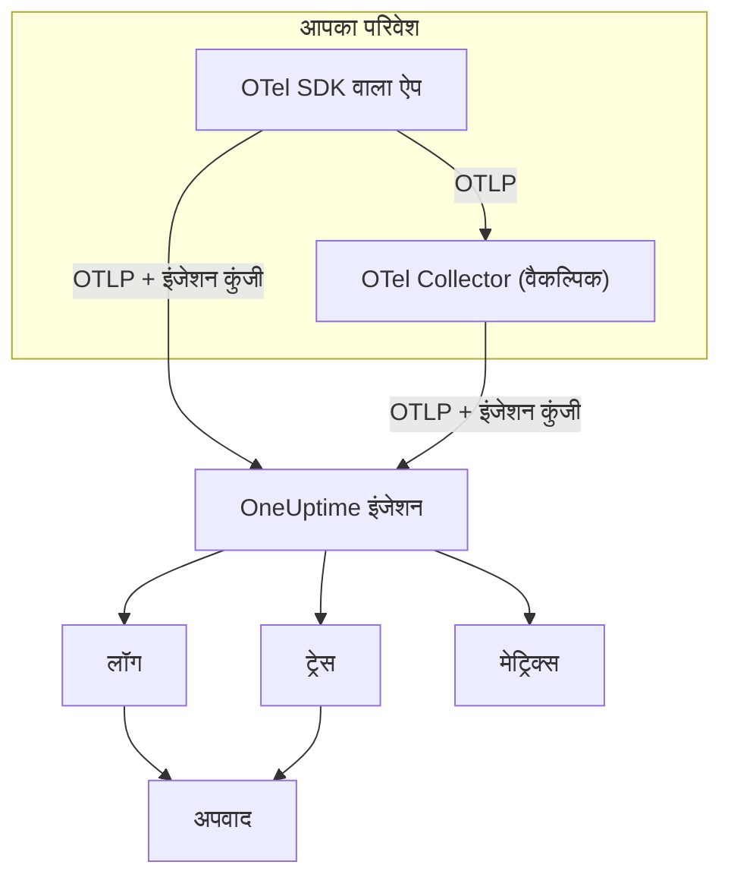

# OpenTelemetry

OneUptime OpenTelemetry Protocol (OTLP) के ज़रिए लॉग, मेट्रिक्स और ट्रेस लेता है। किसी भी OpenTelemetry SDK या OpenTelemetry Collector को इंजेशन कुंजी के साथ OneUptime की ओर करें, और आपका डेटा **लॉग**, **ट्रेस**, **मेट्रिक्स** और **अपवाद** में दिखने लगता है। यह पेज कुछ ही मिनटों में किसी सेवा से डेटा भेजना शुरू करवाता है, फिर वे एंडपॉइंट, सीमाएं और त्रुटियां बताता है जो प्रोडक्शन में चाहिए।

:::cards
- [क्विकस्टार्ट](#क्विकस्टार्ट): एक कुंजी बनाएं, चार एनवायरनमेंट वेरिएबल सेट करें और SDK जोड़ें।
- [Collector का उपयोग करें](#opentelemetry-collector-के-ज़रिए-भेजें): पहले से चल रहे collector में OneUptime को एक्सपोर्टर के रूप में जोड़ें।
- [एंडपॉइंट और सीमाएं](#एंडपॉइंट-और-सीमाएं): URL, पोर्ट, एन्कोडिंग, आकार सीमाएं और स्टेटस कोड।
- [समस्या निवारण](#समस्या-निवारण): डेटा न आने पर क्या जांचें।
:::

## यह कैसे काम करता है

आपका एप्लिकेशन OTLP सीधे OneUptime को, या उसे आगे भेजने वाले OpenTelemetry Collector को एक्सपोर्ट करता है। हर अनुरोध `x-oneuptime-token` हेडर में आपकी इंजेशन कुंजी लेकर जाता है, और OneUptime उस कुंजी से आपका प्रोजेक्ट ढूंढता है।



- **सेवाएं आपके लिए अपने आप बनती हैं।** रिसोर्स एट्रिब्यूट `service.name` (`OTEL_SERVICE_NAME` से सेट) उस सेवा का नाम तय करता है जिसका आपका डेटा है। OneUptime पहली बार डेटा आने पर सेवा बनाता है और उसे **उत्पाद → सेवाएं** में दिखाता है।
- **त्रुटियां अपवाद बन जाती हैं।** स्पैन पर अपवाद इवेंट और लॉग में दर्ज अपवाद **अपवाद** में इश्यू के रूप में समूहित होते हैं — देखें [लॉग से अपवाद](#लॉग-से-अपवाद)।

## शुरू करने से पहले

- एक OneUptime प्रोजेक्ट जिसमें आप इंजेशन कुंजियां बना सकें: प्रोजेक्ट के स्वामी और व्यवस्थापक बना सकते हैं, और **Create Telemetry Ingestion Key** अनुमति वाला कोई भी व्यक्ति भी।
- एक एप्लिकेशन जिसमें आप OpenTelemetry SDK जोड़ सकें, या एक OpenTelemetry Collector।
- आपके एप्लिकेशन या collector से `oneuptime.com` या आपके अपने OneUptime होस्ट तक आउटबाउंड HTTPS (पोर्ट 443)।

> [!NOTE]
> OneUptime Cloud पर टेलीमेट्री का बिल प्रति GB इंजेस्ट किए गए डेटा पर बनता है। Free प्लान वाले प्रोजेक्ट को टेलीमेट्री भेजने से पहले भुगतान विधि जोड़नी होती है — कुंजी बनाने वाला डायलॉग कीमत दिखाता है।

## क्विकस्टार्ट

:::steps
### एक इंजेशन कुंजी बनाएं

1. **उत्पाद → प्रोजेक्ट सेटिंग्स** पर जाएं।
2. साइड मेन्यू में **टेलीमेट्री और APM** खोलें और **इंजेशन कुंजियाँ** चुनें।
3. **इन्जेशन कुंजी बनाएँ** पर क्लिक करें। डायलॉग एक नाम भर देता है और **सर्वर** कुंजी प्रकार चुनता है, जिससे कोई एप्लिकेशन या collector डेटा भेजता है। चाहें तो नाम बदलें, फिर **इन्जेशन कुंजी बनाएँ** पर क्लिक करें।


नई कुंजी अपने पेज पर खुलती है। उसकी **सीक्रेट कुंजी** कॉपी करें — यही वह टोकन है जिसे आप `x-oneuptime-token` के रूप में भेजते हैं।


### OpenTelemetry एनवायरनमेंट वेरिएबल सेट करें

हर OpenTelemetry SDK वही मानक एनवायरनमेंट वेरिएबल पढ़ता है, इसलिए यह चरण हर भाषा में एक जैसा है।

| एनवायरनमेंट वेरिएबल | मान | यह क्या करता है |
| --- | --- | --- |
| `OTEL_EXPORTER_OTLP_ENDPOINT` | `https://oneuptime.com/otlp` | कहां भेजना है। SDK `/v1/traces`, `/v1/metrics` और `/v1/logs` खुद जोड़ता है। |
| `OTEL_EXPORTER_OTLP_HEADERS` | `x-oneuptime-token=YOUR_ONEUPTIME_INGESTION_KEY` | हर अनुरोध के साथ आपकी इंजेशन कुंजी भेजता है। |
| `OTEL_EXPORTER_OTLP_PROTOCOL` | `http/protobuf` | HTTP पर OTLP। कुछ SDK डिफ़ॉल्ट रूप से gRPC इस्तेमाल करते हैं, जो दूसरा एंडपॉइंट इस्तेमाल करता है। |
| `OTEL_SERVICE_NAME` | `my-service` | वह सेवा जिसके तहत आपका डेटा OneUptime में दिखता है। |

```bash
export OTEL_EXPORTER_OTLP_ENDPOINT="https://oneuptime.com/otlp"
export OTEL_EXPORTER_OTLP_HEADERS="x-oneuptime-token=YOUR_ONEUPTIME_INGESTION_KEY"
export OTEL_EXPORTER_OTLP_PROTOCOL="http/protobuf"
export OTEL_SERVICE_NAME="my-service"
```

सेल्फ़-होस्ट कर रहे हैं? `https://oneuptime.com` की जगह अपने OneUptime इंस्टेंस का URL लिखें, जैसे `https://oneuptime.example.com/otlp`। अपवादों पर परिवेश का टैग लगाने के लिए `OTEL_RESOURCE_ATTRIBUTES` को भी `deployment.environment=production` पर सेट करें।

### अपने ऐप में OpenTelemetry जोड़ें

अपनी भाषा चुनें। हर सेटअप ऊपर के एनवायरनमेंट वेरिएबल पढ़ता है, इसलिए आपके कोड में न कोई एंडपॉइंट होता है न कोई कुंजी।

:::tabs
@tab Node.js
SDK, ऑटोमैटिक इंस्ट्रुमेंटेशन और OTLP/HTTP एक्सपोर्टर इंस्टॉल करें:

```bash
npm install @opentelemetry/sdk-node @opentelemetry/auto-instrumentations-node \
  @opentelemetry/exporter-trace-otlp-proto @opentelemetry/exporter-metrics-otlp-proto \
  @opentelemetry/exporter-logs-otlp-proto @opentelemetry/sdk-metrics @opentelemetry/sdk-logs
```

SDK को उसकी अपनी फ़ाइल में बनाएं:

```javascript title="instrumentation.js"
const { NodeSDK } = require("@opentelemetry/sdk-node");
const { getNodeAutoInstrumentations } = require("@opentelemetry/auto-instrumentations-node");
const { OTLPTraceExporter } = require("@opentelemetry/exporter-trace-otlp-proto");
const { OTLPMetricExporter } = require("@opentelemetry/exporter-metrics-otlp-proto");
const { OTLPLogExporter } = require("@opentelemetry/exporter-logs-otlp-proto");
const { PeriodicExportingMetricReader } = require("@opentelemetry/sdk-metrics");
const { BatchLogRecordProcessor } = require("@opentelemetry/sdk-logs");

// The exporters read OTEL_EXPORTER_OTLP_ENDPOINT and OTEL_EXPORTER_OTLP_HEADERS.
const sdk = new NodeSDK({
  traceExporter: new OTLPTraceExporter(),
  metricReader: new PeriodicExportingMetricReader({
    exporter: new OTLPMetricExporter(),
  }),
  logRecordProcessors: [new BatchLogRecordProcessor(new OTLPLogExporter())],
  instrumentations: [getNodeAutoInstrumentations()],
});

sdk.start();
```

इसे अपने एप्लिकेशन कोड से पहले लोड करें:

```bash
node --require ./instrumentation.js app.js
```
@tab Python
OpenTelemetry डिस्ट्रीब्यूशन और एक्सपोर्टर इंस्टॉल करें, फिर उन लाइब्रेरी के इंस्ट्रुमेंटेशन जो आपका ऐप इस्तेमाल करता है:

```bash
pip install opentelemetry-distro opentelemetry-exporter-otlp
opentelemetry-bootstrap -a install
```

अपना ऐप `opentelemetry-instrument` के ज़रिए शुरू करें। यह ट्रेस, मेट्रिक्स और लॉग एक्सपोर्ट करता है; लॉगिंग वेरिएबल Python के `logging` मॉड्यूल से लिखे रिकॉर्ड भी भेजता है:

```bash
OTEL_PYTHON_LOGGING_AUTO_INSTRUMENTATION_ENABLED=true opentelemetry-instrument python app.py
```
@tab Go
SDK और OTLP/HTTP एक्सपोर्टर जोड़ें:

```bash
go get go.opentelemetry.io/otel go.opentelemetry.io/otel/sdk go.opentelemetry.io/otel/sdk/metric \
  go.opentelemetry.io/otel/exporters/otlp/otlptrace/otlptracehttp \
  go.opentelemetry.io/otel/exporters/otlp/otlpmetric/otlpmetrichttp
```

प्रोग्राम शुरू होने पर tracer और meter प्रोवाइडर बनाएं:

```go title="main.go"
package main

import (
	"context"
	"log"

	"go.opentelemetry.io/otel"
	"go.opentelemetry.io/otel/exporters/otlp/otlpmetric/otlpmetrichttp"
	"go.opentelemetry.io/otel/exporters/otlp/otlptrace/otlptracehttp"
	sdkmetric "go.opentelemetry.io/otel/sdk/metric"
	sdktrace "go.opentelemetry.io/otel/sdk/trace"
)

func main() {
	ctx := context.Background()

	// Both exporters read OTEL_EXPORTER_OTLP_ENDPOINT and OTEL_EXPORTER_OTLP_HEADERS.
	traceExporter, err := otlptracehttp.New(ctx)
	if err != nil {
		log.Fatal(err)
	}
	tracerProvider := sdktrace.NewTracerProvider(sdktrace.WithBatcher(traceExporter))
	defer tracerProvider.Shutdown(ctx)
	otel.SetTracerProvider(tracerProvider)

	metricExporter, err := otlpmetrichttp.New(ctx)
	if err != nil {
		log.Fatal(err)
	}
	meterProvider := sdkmetric.NewMeterProvider(
		sdkmetric.WithReader(sdkmetric.NewPeriodicReader(metricExporter)),
	)
	defer meterProvider.Shutdown(ctx)
	otel.SetMeterProvider(meterProvider)

	// Your application code.
}
```

प्रोवाइडर `OTEL_SERVICE_NAME` को एनवायरनमेंट से लेते हैं। लॉग के लिए `otlploghttp` को `otelslog` जैसे लॉग ब्रिज के साथ जोड़ें; यह भी वही वेरिएबल पढ़ता है।
@tab Java
OpenTelemetry Java एजेंट डाउनलोड करें और उसे अपने एप्लिकेशन से जोड़ें। कोड में कोई बदलाव नहीं चाहिए:

```bash
curl -L -O https://github.com/open-telemetry/opentelemetry-java-instrumentation/releases/latest/download/opentelemetry-javaagent.jar
java -javaagent:opentelemetry-javaagent.jar -jar my-app.jar
```

एजेंट आम फ़्रेमवर्क और लाइब्रेरी को इंस्ट्रुमेंट करता है, और ट्रेस, मेट्रिक्स और Logback या Log4j से लिखे लॉग एक्सपोर्ट करता है।
@tab .NET
ASP.NET Core के लिए OpenTelemetry पैकेज जोड़ें:

```bash
dotnet add package OpenTelemetry.Extensions.Hosting
dotnet add package OpenTelemetry.Exporter.OpenTelemetryProtocol
dotnet add package OpenTelemetry.Instrumentation.AspNetCore
dotnet add package OpenTelemetry.Instrumentation.Http
```

स्टार्टअप पर OpenTelemetry रजिस्टर करें। `UseOtlpExporter()` ट्रेस, मेट्रिक्स और लॉग भेजता है, और `OTEL_EXPORTER_OTLP_*` वेरिएबल पढ़ता है:

```csharp title="Program.cs"
using OpenTelemetry;
using OpenTelemetry.Metrics;
using OpenTelemetry.Trace;

var builder = WebApplication.CreateBuilder(args);

builder.Services.AddOpenTelemetry()
    .WithTracing(tracing => tracing
        .AddAspNetCoreInstrumentation()
        .AddHttpClientInstrumentation())
    .WithMetrics(metrics => metrics
        .AddAspNetCoreInstrumentation()
        .AddHttpClientInstrumentation())
    .WithLogging()
    .UseOtlpExporter();

var app = builder.Build();
app.Run();
```

Serilog इस्तेमाल करते हैं? उसके लॉग OneUptime को भेजने के लिए [Serilog](/docs/telemetry/serilog) देखें।
:::

### जांचें कि डेटा पहुंच रहा है

OneUptime से पूछें कि क्या वह आपकी कुंजी स्वीकार करता है:

```bash
curl -i -H "x-oneuptime-token: YOUR_ONEUPTIME_INGESTION_KEY" \
  https://oneuptime.com/otlp/v1/validate
```

काम करने वाली कुंजी `"valid": true` के साथ `200` लौटाती है। बाकी सब कुछ `401` लौटाता है, साथ में संदेश होता है कि क्या गलत है — अज्ञात, अक्षम या समाप्त।

फिर अपना ऐप चलाएं और एक मिनट तक इस्तेमाल करें। **उत्पाद → सेवाएं** खोलें: आपकी सेवा उस नाम से दिखती है जो आपने `OTEL_SERVICE_NAME` में सेट किया, उसके लॉग, ट्रेस, मेट्रिक्स और अपवादों के साथ। **उत्पाद → लॉग**, **उत्पाद → ट्रेस** और **उत्पाद → मेट्रिक्स** सभी सेवाओं का वही डेटा दिखाते हैं।
:::

:::details बिना SDK के एक टेस्ट लॉग भेजें
OTLP/HTTP JSON भी स्वीकार करता है, इसलिए आप `curl` से लॉग भेज सकते हैं। `severityNumber` का मान `9` इसे सूचनात्मक लॉग बनाता है:

```bash
curl -i https://oneuptime.com/otlp/v1/logs \
  -H "Content-Type: application/json" \
  -H "x-oneuptime-token: YOUR_ONEUPTIME_INGESTION_KEY" \
  -d '{
    "resourceLogs": [{
      "resource": {
        "attributes": [
          { "key": "service.name", "value": { "stringValue": "my-service" } }
        ]
      },
      "scopeLogs": [{
        "logRecords": [{
          "severityNumber": 9,
          "body": { "stringValue": "Hello from curl" }
        }]
      }]
    }]
  }'
```

`200` का मतलब है कि लॉग स्वीकार हो गया। यह कुछ ही सेकंड में **उत्पाद → लॉग** में `my-service` सेवा के तहत दिखता है।
:::

## OpenTelemetry Collector के ज़रिए भेजें

Collector तब चलाएं जब आपके पास पहले से एक हो, जब आप डेटा को एक जगह बैच, फ़िल्टर या समृद्ध करना चाहें, या इंजेशन कुंजी को अपने एप्लिकेशन से बाहर रखना चाहें। आपके ऐप collector को एक्सपोर्ट करते हैं, और केवल collector OneUptime से बात करता है।

:::steps
### OneUptime को एक्सपोर्टर के रूप में जोड़ें

OneUptime की ओर इशारा करने वाला `otlphttp` एक्सपोर्टर जोड़ें, और हर पाइपलाइन को उससे होकर भेजें:

```yaml title="otel-collector-config.yaml"
receivers:
  otlp:
    protocols:
      grpc:
        endpoint: 0.0.0.0:4317
      http:
        endpoint: 0.0.0.0:4318

processors:
  batch: {}

exporters:
  otlphttp:
    endpoint: https://oneuptime.com/otlp
    headers:
      x-oneuptime-token: YOUR_ONEUPTIME_INGESTION_KEY

service:
  pipelines:
    traces:
      receivers: [otlp]
      processors: [batch]
      exporters: [otlphttp]
    metrics:
      receivers: [otlp]
      processors: [batch]
      exporters: [otlphttp]
    logs:
      receivers: [otlp]
      processors: [batch]
      exporters: [otlphttp]
```

एक्सपोर्टर की डिफ़ॉल्ट सेटिंग रखें: यह gzip से कंप्रेस किया protobuf भेजता है, और OneUptime दोनों स्वीकार करता है। एक्सपोर्टर पर `Content-Type` हेडर सेट न करें — OneUptime उसी हेडर से डिकोडर चुनता है, इसलिए protobuf बाइट्स के आगे JSON कंटेंट टाइप इंजेशन तोड़ देता है।

### Collector चलाएं

:::tabs
@tab Docker
```bash
docker run -d --name otel-collector \
  -p 4317:4317 -p 4318:4318 \
  -v "$(pwd)/otel-collector-config.yaml:/etc/otelcol-contrib/config.yaml" \
  otel/opentelemetry-collector-contrib:latest
```
@tab Linux
```bash
otelcol-contrib --config otel-collector-config.yaml
```
:::

Collector पोर्ट `4317` (gRPC) और `4318` (HTTP) पर OTLP सुनता है, यही वे पोर्ट हैं जिन पर SDK डिफ़ॉल्ट रूप से भेजते हैं।

### अपने ऐप को collector की ओर करें

अपने एप्लिकेशन में `OTEL_EXPORTER_OTLP_ENDPOINT` को collector पर सेट करें, जैसे `http://localhost:4318`, और `OTEL_EXPORTER_OTLP_HEADERS` हटा दें — कुंजी collector जोड़ता है। हर एप्लिकेशन में `OTEL_SERVICE_NAME` रखें।

डेटा OneUptime में ठीक क्विकस्टार्ट की तरह पहुंचता है। अगर नहीं पहुंचता, तो collector का अपना लॉग कारण बताता है — देखें [समस्या निवारण](#समस्या-निवारण)।
:::

पहले से किसी दूसरे विक्रेता को एक्सपोर्ट कर रहे हैं? मौजूदा एक्सपोर्टर के बगल में `otlphttp` एक्सपोर्टर जोड़ें और तुलना करते समय दोनों को भेजने के लिए हर पाइपलाइन के `exporters` में दोनों लिखें। होस्ट मेट्रिक्स और लॉग फ़ाइलें भी इकट्ठा करने के लिए [Host OpenTelemetry Collector](/docs/telemetry/host-otel-collector) गाइड देखें।

## एंडपॉइंट और सीमाएं

| सेटिंग | OTLP/HTTP (अनुशंसित) | OTLP/gRPC |
| --- | --- | --- |
| एंडपॉइंट | `https://oneuptime.com/otlp` | `https://oneuptime.com:443` |
| प्रमाणीकरण | `x-oneuptime-token` हेडर | `x-oneuptime-token` मेटाडेटा |
| एन्कोडिंग | Protobuf (`application/x-protobuf`) या JSON (`application/json`) | Protobuf |
| कंप्रेशन | कोई नहीं, `gzip`, `deflate` या `zstd` | कोई नहीं या `gzip` |
| अनुरोध का आकार | `/otlp` पर प्रति अनुरोध 4 MB तक | प्रति संदेश 4 MB तक |

HTTP पर हर सिग्नल का एंडपॉइंट के नीचे अपना पथ होता है। SDK और collector इसे आपके लिए जोड़ते हैं; इसे खुद तभी सेट करें जब कोई टूल पूरा URL मांगे।

| सिग्नल | OTLP/HTTP URL |
| --- | --- |
| ट्रेस | `https://oneuptime.com/otlp/v1/traces` |
| मेट्रिक्स | `https://oneuptime.com/otlp/v1/metrics` |
| लॉग | `https://oneuptime.com/otlp/v1/logs` |
| प्रोफ़ाइल | `https://oneuptime.com/otlp/v1/profiles` |

निरंतर प्रोफ़ाइलिंग के लिए ज़्यादातर प्रोफ़ाइलर इसके बजाय Pyroscope-संगत एंडपॉइंट पर भेजते हैं — देखें [निरंतर प्रोफ़ाइलिंग](/docs/telemetry/profiles)। OTLP प्रोफ़ाइल एक्सपोर्ट करने वाले collector को एक्सपोर्टर का `profiles_endpoint` `https://oneuptime.com/otlp/v1/profiles` पर सेट करना होगा, क्योंकि डिफ़ॉल्ट रूप से यह प्रोफ़ाइल एक डेवलपमेंट पथ पर भेजता है जिसे OneUptime सर्व नहीं करता।

### gRPC पर OTLP

OneUptime वेब ऐप वाले ही होस्ट पर, पोर्ट 443 पर TLS के ज़रिए OTLP/gRPC देता है। `OTEL_EXPORTER_OTLP_PROTOCOL` को `grpc` और `OTEL_EXPORTER_OTLP_ENDPOINT` को `https://oneuptime.com:443` पर सेट करें, और वही `x-oneuptime-token` हेडर भेजें। Collector में `endpoint: oneuptime.com:443` और वही `headers` के साथ `otlp` एक्सपोर्टर इस्तेमाल करें।

सेल्फ़-होस्टेड इंस्टॉलेशन में gRPC केवल HTTPS पर OneUptime तक पहुंचता है: सादा-HTTP (h2c) कनेक्शन अस्वीकार हो जाता है। अगर आपका इंस्टेंस सादे HTTP पर चलता है, तो OTLP/HTTP इस्तेमाल करें।

किसी कुंजी की दो सेटिंग केवल OTLP/HTTP पर लागू होती हैं: उसकी **Requests Per Minute Limit** और उसका **Pinned Service Name**। gRPC पर भेजा गया डेटा वही `service.name` रखता है जिसके साथ वह भेजा गया था, और सीमा में नहीं गिना जाता।

### प्रतिक्रियाएं

डेटा कतार में आते ही OneUptime एक्सपोर्ट का जवाब देता है, और डेटा कुछ सेकंड बाद दिखता है।

| प्रतिक्रिया | gRPC स्टेटस | मतलब | क्या करें |
| --- | --- | --- | --- |
| `200` | `OK` | स्वीकार किया गया। | कुछ नहीं। |
| `401` | `UNAUTHENTICATED` | कुंजी मौजूद नहीं है, अज्ञात है या समाप्त हो गई है। | `x-oneuptime-token` के मान को कुंजी की **सीक्रेट कुंजी** से मिलाएं। |
| `402` | `PERMISSION_DENIED` | केवल OneUptime Cloud: प्रोजेक्ट Free प्लान पर है और उसकी कोई भुगतान विधि नहीं है। | **प्रोजेक्ट सेटिंग्स → बिलिंग और चालान → बिलिंग** में एक जोड़ें। |
| `413` | — | अनुरोध आकार सीमा से बड़ा है। | छोटे बैच भेजें। |
| `415` | — | असमर्थित `Content-Encoding`। | `gzip`, `deflate` या `zstd` इस्तेमाल करें, या कंप्रेशन न करें। |
| `422` | `PERMISSION_DENIED` | कुंजी अक्षम है, या यह एक ब्राउज़र कुंजी है जो अपने अनुमत ओरिजिन के बाहर इस्तेमाल हुई। | कुंजी फिर से सक्षम करें, या सर्वर कुंजी से भेजें। |
| `429` | — | कुंजी की **Requests Per Minute Limit** पूरी हो गई है। | शुरू में कुछ नहीं: एक्सपोर्टर `Retry-After` समय के बाद फिर कोशिश करते हैं। बार-बार हो तो सीमा बढ़ाएं। |
| `503` | `UNAVAILABLE` | OneUptime शुरू हो रहा है, या इंजेशन कतार उपलब्ध नहीं है। | कुछ नहीं: OTLP एक्सपोर्टर `503` पर खुद फिर कोशिश करते हैं। |

`401`, `402`, `413`, `415` और `422` OTLP एक्सपोर्टर के लिए स्थायी त्रुटियां हैं: एक्सपोर्टर फिर कोशिश करने के बजाय बैच छोड़ देता है और त्रुटि लॉग करता है।

### रीस्टार्ट और अपग्रेड

जब OneUptime रीस्टार्ट या अपग्रेड हो रहा होता है, तब तैयार होने तक वह एक्सपोर्ट का जवाब `503` और `Retry-After: 5` से देता है, और एक्सपोर्टर उन्हें फिर भेजते हैं। Collector का एक्सपोर्टर डिफ़ॉल्ट रूप से पांच मिनट तक फिर कोशिश करता रहता है (`retry_on_failure`) और जो नहीं भेज सका उसे अपनी `sending_queue` में रखता है, इसलिए दोनों को चालू रहने दें। जितने समय OneUptime डेटा नहीं ले रहा था, वह आपके सर्वर, होस्ट या दूसरे संसाधनों के ख़िलाफ़ कभी नहीं गिना जाता: देखें [जब OneUptime डेटा नहीं ले रहा हो](/docs/monitor/when-oneuptime-is-not-receiving#शुरू-होते-समय)।

### इंजेशन कुंजियां

**प्रोजेक्ट सेटिंग्स → टेलीमेट्री और APM → इंजेशन कुंजियाँ** के तहत हर कुंजी के पेज पर ये सेटिंग होती हैं:

| सेटिंग | यह क्या करती है |
| --- | --- |
| **कुंजी प्रकार** | एप्लिकेशन, collector और एजेंट के लिए **सर्वर** (डिफ़ॉल्ट)। वेब पेज में जाने वाली कुंजियों के लिए **Browser**: केवल लिखने के लिए, और केवल उसके **Allowed Origins** से स्वीकार। कुंजी बनने के बाद इसे बदला नहीं जा सकता। |
| **Allowed Origins** | वे वेब ओरिजिन जहां से ब्राउज़र कुंजी काम करती है, जैसे `https://app.example.com`। सर्वर कुंजी पर अनदेखा किया जाता है। |
| **Pinned Service Name** | सेट होने पर, इस कुंजी से OTLP/HTTP पर भेजी गई हर चीज़ पर `service.name` को बदल देता है। |
| **सक्षम** | कुंजी हटाए बिना, उससे भेजा गया डेटा तुरंत स्वीकार करना बंद करने के लिए इसे बंद करें। |
| **इस समय समाप्त होता है** | इस तारीख़ के बाद कुंजी अस्वीकार हो जाती है। ख़ाली होने का मतलब है कि यह कभी समाप्त नहीं होती। |
| **Requests Per Minute Limit** | इस कुंजी को इस्तेमाल करने वाले सभी क्लाइंट को मिलाकर, प्रति मिनट स्वीकार होने वाले OTLP/HTTP अनुरोधों की अधिकतम संख्या। ख़ाली होने पर सर्वर कुंजी पर कोई सीमा नहीं, और ब्राउज़र कुंजी पर 6,000। |
| **Last Used At** | इस कुंजी से आख़िरी बार डेटा कब स्वीकार हुआ। इससे ऐसी कुंजियां ढूंढें जिन्हें सुरक्षित रूप से बदला या हटाया जा सकता है। |

कुंजी के पेज पर **सीक्रेट कुंजी रीसेट करें** सीक्रेट को बदल देता है। पुराने सीक्रेट से भेजने वाला हर एप्लिकेशन और collector तब तक अस्वीकार होता है जब तक आप उसे अपडेट न करें।

## सेल्फ़-होस्टेड OneUptime

इस पेज की हर बात आपके अपने इंस्टॉलेशन पर भी वैसे ही काम करती है। जहां भी यह पेज `https://oneuptime.com` कहता है, वहां अपना OneUptime URL इस्तेमाल करें:

- `OTEL_EXPORTER_OTLP_ENDPOINT` है `https://YOUR-ONEUPTIME-HOST/otlp`, या `http://YOUR-ONEUPTIME-HOST/otlp` अगर आप OneUptime को सादे HTTP पर चलाते हैं।
- साथ आने वाला ingress `/otlp` पर 4 MB तक के अनुरोध स्वीकार करता है। OneUptime के आगे आप जो प्रॉक्सी चलाते हैं उसकी सीमा कम हो सकती है — ingress-nginx में `proxy-body-size` डिफ़ॉल्ट रूप से 1 MB है — इसलिए उसे `/otlp` के लिए भी बढ़ाएं, वरना एक्सपोर्टर को `413` मिलेगा।
- अगर `DISABLE_TELEMETRY_INGESTION=true` सेट है, तो OneUptime हर एक्सपोर्ट स्वीकार करता है और कुछ भी स्टोर नहीं करता। जब कोई सेल्फ़-होस्टेड इंस्टेंस बिल्कुल डेटा न दिखाए, तो सबसे पहले यही जांचें।

## लॉग से अपवाद

OneUptime आपके **logs** में अपवाद ढूंढता है और उन्हें उसी **अपवाद** व्यू में जोड़ता है जिसमें ट्रेस की त्रुटियां आती हैं। हर लॉग पहले से किसी सेवा या होस्ट का होता है, इसलिए अपवाद उसी को सौंपा जाता है। लॉग और ट्रेस के अपवाद एक ही फ़िंगरप्रिंट समूहीकरण साझा करते हैं, इसलिए जो त्रुटि ट्रेस और लॉग दोनों बताते हैं वह एक ही इश्यू बन जाती है।

कोई लॉग दो तरीकों से अपवाद बनता है:

| पहचान | किन लॉग पर लागू | यह कैसे काम करता है |
| --- | --- | --- |
| **अपवाद एट्रिब्यूट** (अनुशंसित) | किसी भी लॉग पर | OpenTelemetry एट्रिब्यूट `exception.type`, `exception.message` या `exception.stacktrace` वाला लॉग रिकॉर्ड सीधे अपवाद बन जाता है। ज़्यादातर लॉगिंग इंटीग्रेशन अपवाद लॉग करते समय इन्हें सेट करते हैं: Logback और Log4j appender, Serilog, Python लॉगिंग इंस्ट्रुमेंटेशन। यह सटीक है और हर भाषा में काम करता है। |
| **बॉडी में स्टैक ट्रेस** | एरर और फ़ेटल लॉग जिनमें ट्रेस ID और स्पैन ID नहीं है | OneUptime बॉडी के पहले 16 KB में JavaScript, Python, Java, Go, Ruby, C#/.NET या PHP स्टैक ट्रेस खोजता है, और उससे प्रकार, संदेश और फ़्रेम निकालता है। स्पैन के अंदर लिखा गया लॉग छोड़ दिया जाता है, क्योंकि स्पैन खुद अपवाद बताता है। |

बॉडी स्कैन सादे-टेक्स्ट लॉग के लिए उपयुक्त है, जैसे कच्चा stdout, journald या syslog जिसे collector पढ़ता है। कई लाइनों वाला स्टैक ट्रेस एक ही लॉग रिकॉर्ड के रूप में आना चाहिए, इसलिए collector में मल्टीलाइन जोड़ना चालू करें — देखें [Host OpenTelemetry Collector](/docs/telemetry/host-otel-collector) गाइड।

पहचान डिफ़ॉल्ट रूप से चालू है। सेल्फ़-होस्टेड इंस्टॉलेशन में इसे बंद करने के लिए `app` सेवा पर `TELEMETRY_LOG_EXCEPTION_EXTRACTION_ENABLED=false` सेट करें — और अगर आप Helm चार्ट का अलग worker चलाते हैं तो `worker` पर भी।

## समस्या निवारण

:::details कोई डेटा नहीं दिखता, और एक्सपोर्टर `401` लॉग करता है
कुंजी मौजूद नहीं है, अज्ञात है या समाप्त हो गई है। जांचें कि `OTEL_EXPORTER_OTLP_HEADERS` में `x-oneuptime-token=` के बाद कुंजी की **सीक्रेट कुंजी** है, मान के अंदर कोई उद्धरण चिह्न या स्पेस नहीं है, और कुंजी उसी प्रोजेक्ट की है जिसे आप देख रहे हैं। [जांचें कि डेटा पहुंच रहा है](#जांचें-कि-डेटा-पहुंच-रहा-है) वाला सत्यापन अनुरोध बताता है कि इनमें से कौन-सी स्थिति है।
:::

:::details एक्सपोर्टर `422` लॉग करता है
कुंजी अक्षम है, या यह ब्राउज़र कुंजी है। कुंजी की सेटिंग में **सक्षम** फिर से चालू करें, या **सर्वर** कुंजी बनाएं: ब्राउज़र कुंजी केवल अपने किसी अनुमत ओरिजिन पर मौजूद वेब पेज से स्वीकार होती है।
:::

:::details एक्सपोर्टर `402` लॉग करता है
प्रोजेक्ट OneUptime Cloud के Free प्लान पर है और उसकी कोई भुगतान विधि नहीं है, और टेलीमेट्री का बिल इस्तेमाल के हिसाब से बनता है। **प्रोजेक्ट सेटिंग्स → बिलिंग और चालान → बिलिंग** में भुगतान विधि जोड़ें, और एक्सपोर्ट फिर से स्वीकार होने लगेंगे।
:::

:::details एक्सपोर्टर `404` लॉग करता है
SDK गलत पथ पर भेज रहा है। `OTEL_EXPORTER_OTLP_ENDPOINT` को `/otlp` पर ख़त्म होना चाहिए, आख़िर में स्लैश के बिना और `/v1/...` के बिना — वह SDK जोड़ता है। अगर आप `OTEL_EXPORTER_OTLP_TRACES_ENDPOINT` जैसा किसी एक सिग्नल वाला वेरिएबल सेट करते हैं, तो उसे पूरा URL चाहिए, जैसे `https://oneuptime.com/otlp/v1/traces`।
:::

:::details कुछ भी नहीं होता, और SDK कनेक्शन त्रुटियां लॉग करता है
SDK शायद gRPC पर किसी HTTP एंडपॉइंट या `localhost` को एक्सपोर्ट कर रहा है। `OTEL_EXPORTER_OTLP_PROTOCOL=http/protobuf` सेट करें, या [gRPC पर OTLP](#grpc-पर-otlp) में बताया gRPC एंडपॉइंट इस्तेमाल करें। यह भी जांचें कि प्रोसेस को वाकई एनवायरनमेंट वेरिएबल दिख रहे हैं — कंटेनर में उन्हें कंटेनर पर सेट करें, अपने शेल में नहीं।
:::

:::details Collector `413` के साथ `Exporting failed` लॉग करता है
कोई बैच आकार सीमा से बड़ा है। बैच का आकार घटाएं, जैसे `batch` प्रोसेसर पर `send_batch_max_size: 1000`। अगर आप अपने प्रॉक्सी के पीछे सेल्फ़-होस्ट करते हैं, तो उस प्रॉक्सी की बॉडी-आकार सीमा भी जांचें।
:::

:::details डेटा गलत सेवा में, या Unknown Service में आता है
सेवा रिसोर्स एट्रिब्यूट `service.name` से आती है। हर एप्लिकेशन में `OTEL_SERVICE_NAME` सेट करें। अगर कुंजी पर **Pinned Service Name** है, तो उस कुंजी से हर OTLP/HTTP एक्सपोर्ट उसकी जगह उसी नाम के तहत दर्ज होता है।
:::

## अगले कदम

:::cards
- [सर्च सिंटैक्स](/docs/telemetry/search-syntax): एक्सप्लोरर में लॉग, ट्रेस, मेट्रिक्स और अपवाद फ़िल्टर करें।
- [लॉग पाइपलाइन](/docs/telemetry/log-pipelines): लॉग आते ही उन्हें पार्स और समृद्ध करें।
- [लॉग मॉनिटर](/docs/monitor/logs-monitor): मिलते-जुलते लॉग दिखने पर अलर्ट पाएं।
- [Host OpenTelemetry Collector](/docs/telemetry/host-otel-collector): collector से होस्ट मेट्रिक्स और लॉग फ़ाइलें इकट्ठा करें।
:::
