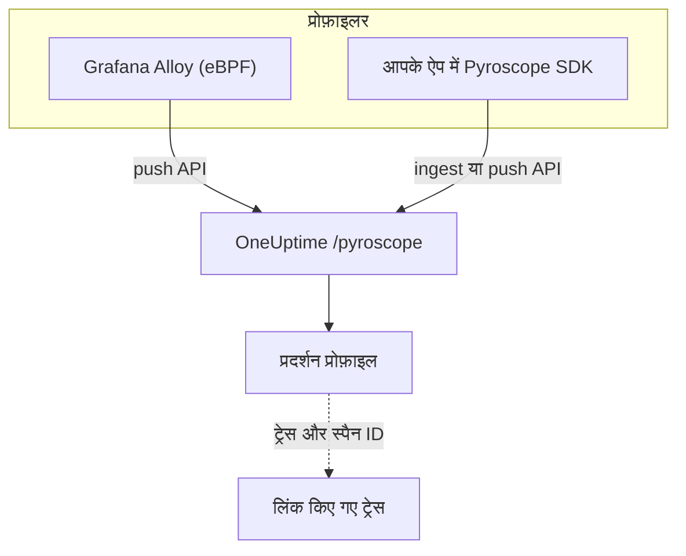

# निरंतर प्रोफ़ाइलिंग

निरंतर प्रोफ़ाइलिंग दिखाती है कि आपका एप्लिकेशन CPU समय और मेमोरी कहां खर्च करता है, फ़ंक्शन दर फ़ंक्शन। OneUptime एक **Pyroscope-संगत इंजेस्ट API** देता है, इसलिए जो कुछ भी Pyroscope सर्वर को पुश कर सकता है — Grafana Alloy eBPF प्रोफ़ाइलर या कोई Pyroscope भाषा SDK — वह OneUptime को भी पुश कर सकता है, और आप नतीजे को अपने लॉग, मेट्रिक्स और ट्रेस के बगल में फ़्लेम ग्राफ़ के रूप में पढ़ते हैं।

:::cards
- [प्रोफ़ाइल भेजें](#प्रोफ़ाइल-भेजें): eBPF के साथ Grafana Alloy, या आपके ऐप में Pyroscope SDK।
- [इंजेस्ट एंडपॉइंट](#इंजेस्ट-एंडपॉइंट): बेस URL और कुंजी देने के तीन तरीके।
- [जांचें कि यह काम कर रहा है](#जांचें-कि-यह-काम-कर-रहा-है): कुंजी, पेज और अपलोड स्थिति जांचें।
- [प्रोफ़ाइल देखें](#oneuptime-में-प्रोफ़ाइल-देखें): फ़्लेम ग्राफ़, शीर्ष फ़ंक्शन, डिफ़ और ट्रेस लिंक।
:::

## यह कैसे काम करता है

एक प्रोफ़ाइलर आपकी प्रोसेस का सैंपल लेता है और हर कुछ सेकंड में आपकी इंजेशन कुंजी के साथ OneUptime के `/pyroscope` एंडपॉइंट पर एक प्रोफ़ाइल अपलोड करता है। OneUptime हर प्रोफ़ाइल को उसकी बताई सेवा के तहत संग्रहीत करता है और उसे **प्रदर्शन प्रोफ़ाइल** में फ़्लेम ग्राफ़ के रूप में दिखाता है।



## शुरू करने से पहले

आपको एक **सर्वर** टेलीमेट्री इंजेशन कुंजी चाहिए। अगर अभी तक नहीं है:

:::steps
### इंजेशन कुंजियां खोलें

**उत्पाद → प्रोजेक्ट सेटिंग्स** पर जाएं, साइड मेन्यू में **टेलीमेट्री और APM** खोलें और **इंजेशन कुंजियाँ** चुनें।


### एक कुंजी बनाएं

**इन्जेशन कुंजी बनाएँ** पर क्लिक करें। डायलॉग में कुंजी का नाम भरा होता है और **सर्वर** चुना होता है — वह कुंजी प्रकार जिससे कोई एप्लिकेशन या कलेक्टर डेटा भेजता है — इसलिए इसे बनाने के लिए **इन्जेशन कुंजी बनाएँ** पर क्लिक करें, या पहले नाम बदलें।

### सीक्रेट कॉपी करें

नई कुंजी अपने पेज पर खुलती है। उसकी **सीक्रेट कुंजी** कॉपी करें: यही वह इंजेशन टोकन है जिसे नीचे के उदाहरण `YOUR_ONEUPTIME_INGESTION_TOKEN` कहते हैं।


:::

## इंजेस्ट एंडपॉइंट

| सेटिंग | मान |
| --- | --- |
| बेस URL (Pyroscope सर्वर पता) | `https://oneuptime.com/pyroscope` |
| ऑथेंटिकेशन हेडर | `x-oneuptime-token: YOUR_ONEUPTIME_INGESTION_TOKEN` |

क्लाइंट बेस URL में अपना पाथ जोड़ते हैं — ज़्यादातर Pyroscope SDK के लिए `/ingest`, Grafana Alloy और v0.14 से आगे के .NET SDK के लिए `/push.v1.PusherService/Push` — इसलिए आप हमेशा केवल बेस URL कॉन्फ़िगर करते हैं, आख़िर में स्लैश के बिना।

OneUptime इनमें से किसी से भी इंजेशन टोकन पढ़ता है, इसलिए वह तरीका इस्तेमाल करें जो आपका क्लाइंट सपोर्ट करता है:

| तरीका | कब इस्तेमाल करें |
| --- | --- |
| `x-oneuptime-token` हेडर | ऐसे क्लाइंट जो कस्टम हेडर जोड़ने देते हैं। |
| `Authorization: Bearer <token>` | `authToken` / `auth_token` विकल्प वाले SDK — वे यही भेजते हैं। |
| HTTP बेसिक ऑथ, टोकन को **पासवर्ड** बनाकर (कोई भी उपयोगकर्ता नाम) | ऐसे क्लाइंट जो केवल बेसिक-ऑथ उपयोगकर्ता और पासवर्ड देते हैं। |

> [!NOTE]
> OneUptime खुद होस्ट करते हैं? `https://oneuptime.com` को अपने होस्ट से बदलें, जैसे `https://YOUR-ONEUPTIME-HOST/pyroscope`।

## समर्थित प्रोफ़ाइल फ़ॉर्मैट

| फ़ॉर्मैट | कौन भेजता है | समर्थित |
| --- | --- | --- |
| pprof (बाइनरी protobuf, वैकल्पिक रूप से gzip किया हुआ) | Go, Node.js और .NET Pyroscope SDK; Grafana Alloy | हां |
| Folded / collapsed टेक्स्ट | Python, Ruby और Rust Pyroscope SDK (उनका डिफ़ॉल्ट अपलोड फ़ॉर्मैट) | हां |
| JFR (Java Flight Recorder) | Pyroscope Java एजेंट | अभी नहीं — Java सेवाओं के लिए Grafana Alloy का उपयोग करें |

## प्रोफ़ाइल भेजें

Grafana Alloy किसी होस्ट की हर प्रोसेस को कोड बदले बिना प्रोफ़ाइल करता है, और शुरुआत का सुझाया गया तरीका है। इसके बजाय Pyroscope SDK आपके एप्लिकेशन के अंदर चलता है।

:::tabs
@tab Grafana Alloy
[Grafana Alloy](https://grafana.com/docs/alloy/latest/) eBPF का उपयोग करके किसी Linux होस्ट की हर प्रोसेस से CPU प्रोफ़ाइल इकट्ठा करता है — आपके एप्लिकेशन के अंदर कोई एजेंट नहीं और कोई कोड बदलाव नहीं। यह Go, Rust, C/C++, Java, Python, Ruby, PHP, Node.js और .NET के लिए काम करता है।

Alloy कॉन्फ़िगरेशन बनाएं:

```hcl title="alloy-config.alloy"
discovery.process "all" {
  refresh_interval = "60s"
}

discovery.relabel "alloy_profiles" {
  targets = discovery.process.all.targets

  rule {
    action       = "replace"
    source_labels = ["__meta_process_exe"]
    target_label  = "service_name"
  }
}

pyroscope.ebpf "default" {
  targets    = discovery.relabel.alloy_profiles.output
  forward_to = [pyroscope.write.oneuptime.receiver]

  collect_interval = "15s"
  sample_rate      = 97
}

pyroscope.write "oneuptime" {
  endpoint {
    url = "https://oneuptime.com/pyroscope"
    headers = {
      "x-oneuptime-token" = "YOUR_ONEUPTIME_INGESTION_TOKEN",
    }
  }
}
```

इसे Docker से चलाएं। eBPF को होस्ट PID नेमस्पेस वाले प्रिविलेज्ड कंटेनर की ज़रूरत होती है:

```yaml title="docker-compose.yml"
services:
  alloy:
    image: grafana/alloy:latest
    privileged: true
    pid: host
    volumes:
      - ./alloy-config.alloy:/etc/alloy/config.alloy
      - /proc:/proc:ro
      - /sys:/sys:ro
    command:
      - run
      - /etc/alloy/config.alloy
```

या इसे सीधे होस्ट पर चलाएं:

```bash
alloy run alloy-config.alloy
```

relabel नियम हर प्रोफ़ाइल की सेवा का नाम प्रोसेस के एक्ज़िक्यूटेबल के नाम पर रखता है।
@tab Go
Go SDK pprof अपलोड करता है। इसका सर्वर पता OneUptime बेस URL पर रखें और अपना इंजेशन टोकन ऑथ टोकन के रूप में दें:

```go
import "github.com/grafana/pyroscope-go"

pyroscope.Start(pyroscope.Config{
    ApplicationName: "my-service",
    ServerAddress:   "https://oneuptime.com/pyroscope",
    AuthToken:       "YOUR_ONEUPTIME_INGESTION_TOKEN",
    ProfileTypes: []pyroscope.ProfileType{
        pyroscope.ProfileCPU,
        pyroscope.ProfileAllocObjects,
        pyroscope.ProfileAllocSpace,
        pyroscope.ProfileInuseObjects,
        pyroscope.ProfileInuseSpace,
        pyroscope.ProfileGoroutines,
    },
})
```
@tab Node.js
Node.js SDK pprof अपलोड करता है:

```javascript
const Pyroscope = require("@pyroscope/nodejs");

Pyroscope.init({
  serverAddress: "https://oneuptime.com/pyroscope",
  appName: "my-service",
  authToken: "YOUR_ONEUPTIME_INGESTION_TOKEN",
});

Pyroscope.start();
```
@tab Python
Python SDK folded टेक्स्ट अपलोड करता है:

```python
import pyroscope

pyroscope.configure(
    application_name="my-service",
    server_address="https://oneuptime.com/pyroscope",
    auth_token="YOUR_ONEUPTIME_INGESTION_TOKEN",
)
```
@tab .NET
Pyroscope .NET प्रोफ़ाइलर एक नेटिव CLR प्रोफ़ाइलर है: इसे कोड बदलाव की ज़रूरत नहीं होती और यह पूरी तरह एनवायरनमेंट वेरिएबल से चालू होता है। [pyroscope-dotnet releases](https://github.com/grafana/pyroscope-dotnet/releases) से अपनी इमेज के लिए रिलीज़ डाउनलोड करें — `glibc` या Alpine के लिए `musl`, `x86_64` या `aarch64` — और उसे रनटाइम में लोड करें:

```dockerfile title="Dockerfile"
FROM alpine:3.20 AS pyroscope-profiler
ARG PYROSCOPE_DOTNET_VERSION=1.5.1
ADD https://github.com/grafana/pyroscope-dotnet/releases/download/pyroscope-${PYROSCOPE_DOTNET_VERSION}/pyroscope.${PYROSCOPE_DOTNET_VERSION}-glibc-x86_64.tar.gz /tmp/pyroscope.tar.gz
RUN mkdir -p /pyroscope && tar -xzf /tmp/pyroscope.tar.gz -C /pyroscope

FROM mcr.microsoft.com/dotnet/aspnet:10.0
# ... your application ...
COPY --from=pyroscope-profiler /pyroscope /pyroscope
ENV CORECLR_ENABLE_PROFILING=1
ENV CORECLR_PROFILER={BD1A650D-AC5D-4896-B64F-D6FA25D6B26A}
ENV CORECLR_PROFILER_PATH=/pyroscope/Pyroscope.Profiler.Native.so
ENV LD_PRELOAD=/pyroscope/Pyroscope.Linux.ApiWrapper.x64.so
ENV LD_LIBRARY_PATH=/pyroscope
```

फिर इसे OneUptime की ओर करें, उदाहरण के लिए अपने Kubernetes / Helm परिवेश में:

```bash
PYROSCOPE_APPLICATION_NAME=my-service
PYROSCOPE_PROFILING_ENABLED=1
PYROSCOPE_SERVER_ADDRESS=https://oneuptime.com/pyroscope
PYROSCOPE_BASIC_AUTH_USER=oneuptime
PYROSCOPE_BASIC_AUTH_PASSWORD=YOUR_ONEUPTIME_INGESTION_TOKEN
```

इंजेशन टोकन बेसिक-ऑथ पासवर्ड में जाता है। उपयोगकर्ता नाम कोई भी गैर-खाली मान हो सकता है, लेकिन जब तक दोनों सेट न हों, प्रोफ़ाइलर कोई क्रेडेंशियल भेजता ही नहीं। इसके बजाय टोकन को हेडर के रूप में भेजने के लिए `PYROSCOPE_HTTP_HEADERS={"x-oneuptime-token":"YOUR_ONEUPTIME_INGESTION_TOKEN"}` सेट करें।

टोकन कैसे दिया जाता है, यह प्रोफ़ाइलर की रिलीज़ पर निर्भर करता है। 1.5 और उसके बाद की रिलीज़ `PYROSCOPE_AUTH_TOKEN` को अनदेखा करती हैं, इसलिए अगर आप किसी पुरानी रिलीज़ से अपग्रेड करते हैं और वह सेटिंग रखते हैं, तो हर अपलोड `401` के साथ अस्वीकार हो जाता है:

| pyroscope-dotnet रिलीज़ | कहां अपलोड करता है | टोकन सेटिंग |
| --- | --- | --- |
| v0.13 और पहले | `/pyroscope/ingest` | `PYROSCOPE_AUTH_TOKEN` |
| v0.14 से 1.4 | `/pyroscope/push.v1.PusherService/Push` | `PYROSCOPE_AUTH_TOKEN` |
| 1.5 और बाद | `/pyroscope/push.v1.PusherService/Push` | `PYROSCOPE_BASIC_AUTH_USER=oneuptime` और `PYROSCOPE_BASIC_AUTH_PASSWORD=<token>` (दोनों सेट होने चाहिए), या `PYROSCOPE_HTTP_HEADERS={"x-oneuptime-token":"<token>"}` |

1.0 से पहले की रिलीज़ पर `pyroscope-<version>` के बजाय `v<version>-pyroscope` टैग होता है (जैसे `https://github.com/grafana/pyroscope-dotnet/releases/download/v0.13.0-pyroscope/pyroscope.0.13.0-glibc-x86_64.tar.gz`); प्रोफ़ाइलर GUID और फ़ाइल नाम हर रिलीज़ में एक जैसे हैं।

CPU प्रोफ़ाइलिंग डिफ़ॉल्ट रूप से चालू है। वॉल-टाइम, एलोकेशन, अपवाद और लॉक-कंटेंशन प्रोफ़ाइलिंग वैकल्पिक हैं: `PYROSCOPE_PROFILING_WALLTIME_ENABLED`, `PYROSCOPE_PROFILING_ALLOCATION_ENABLED`, `PYROSCOPE_PROFILING_EXCEPTION_ENABLED` या `PYROSCOPE_PROFILING_LOCK_ENABLED` को `true` पर सेट करें। स्थिर लेबल `PYROSCOPE_LABELS` (`key:value,key:value`) में जाते हैं।

प्रोफ़ाइलर हर 15 सेकंड में अपलोड करता है और अपने अपलोड को कंप्रेस **नहीं** करता, इसलिए कोई व्यस्त सेवा हर अपलोड में कई MB भेज सकती है। OneUptime का अपना इंग्रेस `/pyroscope` पर 16 MB तक स्वीकार करता है; अगर OneUptime के आगे कोई दूसरा प्रॉक्सी है (जैसे ingress-nginx, जिसका डिफ़ॉल्ट `proxy-body-size` 1 MB है), तो उसकी `/pyroscope` बॉडी-साइज़ सीमा भी बढ़ाएं, वरना बड़े अपलोड OneUptime तक पहुंचने से पहले ही `413` के साथ अस्वीकार हो जाते हैं।
@tab Java
Pyroscope Java एजेंट JFR फ़ॉर्मैट में प्रोफ़ाइल अपलोड करता है, जिसे OneUptime अभी इंजेस्ट नहीं करता। इसके बजाय Java सेवाओं को Grafana Alloy (**Grafana Alloy** टैब) से प्रोफ़ाइल करें — यह बिना किसी एजेंट या कोड बदलाव के JVM CPU प्रोफ़ाइल कैप्चर करता है।
:::

**Ruby** और **Rust** Go, Node.js और Python की तरह काम करते हैं: [अपनी भाषा का Pyroscope SDK](https://grafana.com/docs/pyroscope/latest/configure-client/) इंस्टॉल करें और सर्वर पता `https://oneuptime.com/pyroscope` पर सेट करें, अपने इंजेशन टोकन को ऑथ टोकन के रूप में देकर (या, अगर आपका SDK संस्करण केवल बेसिक ऑथ देता है, तो बेसिक-ऑथ पासवर्ड के रूप में)।

## समर्थित प्रोफ़ाइल प्रकार

एक pprof कई सैंपल प्रकार घोषित कर सकता है; हर अपलोड की गई प्रोफ़ाइल उनमें से एक के तहत संग्रहीत होती है — CPU समय (नैनोसेकंड में `cpu`) अगर हो, वरना वॉल समय, वरना इस्तेमाल में मौजूद और फिर आवंटित बाइट, वरना उसका घोषित पहला प्रकार। कोई भी प्रकार संग्रहीत होता है और देखा जा सकता है; नीचे दिए प्रकारों को OneUptime UI में प्रथम-श्रेणी का समूहन, इकाइयां और लेबल मिलते हैं:

| प्रोफ़ाइल प्रकार | कैसे दिखता है | इकाई |
| --- | --- | --- |
| `cpu`, `samples` | CPU समय | नैनोसेकंड |
| `wall` | वॉल समय | नैनोसेकंड |
| `inuse_space`, `alloc_space`, `heap` | मेमोरी (बाइट) | बाइट |
| `inuse_objects`, `alloc_objects` | मेमोरी (ऑब्जेक्ट की गिनती) | गिनती |
| `mutex`, `contention`, `block` | लॉक कंटेंशन | नैनोसेकंड |
| `goroutine` | Goroutines (Go) | गिनती |

बाकी कुछ भी (जैसे कोई कस्टम सैंपल प्रकार) अपने कच्चे नाम के साथ "अन्य" में दिखता है।

## जांचें कि यह काम कर रहा है

:::steps
### अपना टोकन जांचें

इंजेस्ट एंडपॉइंट गायब या अमान्य टोकन का जवाब `401` से देते हैं, लेकिन ज़्यादातर प्रोफ़ाइलर इसे ऐसी जगह नहीं दिखाते जहां आप देखेंगे (उदाहरण के लिए .NET प्रोफ़ाइलर HTTP जवाब केवल debug स्तर पर लॉग करता है)। सीधे वैलिडेशन एंडपॉइंट से पूछें:

```bash
curl -i -H "x-oneuptime-token: YOUR_ONEUPTIME_INGESTION_TOKEN" \
  https://oneuptime.com/otlp/v1/validate
```

मान्य टोकन `{"valid": true, ...}` के साथ `200` लौटाता है, और उसका `keyType` `Server` होना चाहिए: ब्राउज़र कुंजी भी मान्य होती है, लेकिन प्रोफ़ाइल नहीं भेज सकती। अज्ञात, रद्द, अक्षम या समाप्त टोकन `401` लौटाता है।

### प्रोफ़ाइल पेज खोलें

OneUptime डैशबोर्ड में **उत्पाद → प्रदर्शन प्रोफाइल** पर जाएं। Alloy के 15 सेकंड के कलेक्ट अंतराल (या SDK के 10 से 15 सेकंड के अपलोड अंतराल) के साथ, एजेंट शुरू होने के एक-दो मिनट के भीतर पहली प्रोफ़ाइल और उनके फ़्लेम ग्राफ़ दिखने लगते हैं।

### सेवा जांचें

प्रोफ़ाइल उस टेलीमेट्री सेवा से जुड़ती हैं जिसका नाम SDK का `application_name` / `appName` / `PYROSCOPE_APPLICATION_NAME` देता है (या ऊपर के Alloy relabel नियम में प्रोसेस के एक्ज़िक्यूटेबल का नाम)।

### फिर भी कुछ नहीं? अपलोड स्थिति देखें

.NET प्रोफ़ाइलर के लिए, एप्लिकेशन पर एक मिनट के लिए `DD_TRACE_DEBUG=1` सेट करें: तब यह हर अपलोड के लिए एक `PyroscopePprofSink <status>` पंक्ति लॉग करता है। `200` का अर्थ है OneUptime ने उसे स्वीकार किया; `401` टोकन है; `404` का अर्थ आम तौर पर यह है कि `PYROSCOPE_SERVER_ADDRESS` में `/pyroscope` प्रत्यय नहीं है; `413` का अर्थ है कि OneUptime के आगे के किसी प्रॉक्सी ने अपलोड का आकार अस्वीकार कर दिया (देखें [प्रोफ़ाइल भेजें](#प्रोफ़ाइल-भेजें) के तहत **.NET** टैब)। अगर आप OneUptime खुद चलाते हैं, तो इंग्रेस (nginx) का एक्सेस लॉग भी हर `/pyroscope` अनुरोध के लिए वही स्थिति दर्ज करता है।
:::

## OneUptime में प्रोफ़ाइल देखें

**उत्पाद → प्रदर्शन प्रोफाइल** एक ओवरव्यू खोलता है कि आपकी सेवाओं में समय कहां जा रहा है, और **सभी प्रोफ़ाइल** हर अपलोड की सूची दिखाता है। चुनें कि क्या विश्लेषण करना है — **सब कुछ**, **CPU समय**, **मेमोरी** या **लॉक**, या कोई विशिष्ट प्रकार जैसे **वॉल समय** या **Goroutines**।

किसी प्रोफ़ाइल के पेज में तीन व्यू हैं:

| व्यू | क्या दिखाता है |
| --- | --- |
| **फ़्लेम ग्राफ़** | हर बार कॉल स्टैक का एक फ़ंक्शन है, और उसकी चौड़ाई उसके खर्च किए समय या संसाधनों के अनुपात में होती है। उसके कॉलर और कॉली देखने के लिए किसी फ़ंक्शन पर क्लिक करके ज़ूम करें। |
| **Top functions** | प्रोफ़ाइल के फ़ंक्शन, सेल्फ़ टाइम या कुल समय के क्रम में। **Only my code** लाइब्रेरी फ़्रेम छिपा देता है। |
| **Diff vs. baseline** | प्रोफ़ाइल की तुलना किसी पिछली अवधि से — **बनाम 1 घंटे पहले**, **बनाम कल** या **बनाम पिछले सप्ताह** — **Most regressed** और **Most improved** फ़ंक्शन के साथ। |

**Download pprof** प्रोफ़ाइल को `go tool pprof` जैसे लोकल टूल के लिए सहेजता है।

### ट्रेस से जोड़ना

जब किसी प्रोफ़ाइल में ट्रेस और स्पैन ID होते हैं (जैसे `trace_id` / `span_id` सैंपल लेबल के रूप में), तो आप किसी धीमे ट्रेस स्पैन से सीधे उससे जुड़ी CPU या मेमोरी प्रोफ़ाइल पर जा सकते हैं और ठीक-ठीक समझ सकते हैं कि कौन-सा कोड चल रहा था, और **Open linked trace** दूसरी दिशा में ले जाता है।

किसी स्पैन के **प्रोफ़ाइल** टैब में उसके नीचे नेस्टेड स्पैन से जुड़े सैंपल भी शामिल होते हैं, क्योंकि प्रोफ़ाइलर अक्सर किसी अनुरोध का CPU समय अनुरोध स्पैन के बजाय किसी चाइल्ड स्पैन से जोड़ते हैं।

## डेटा प्रतिधारण

प्रोफ़ाइल आपके प्रोजेक्ट की टेलीमेट्री प्रतिधारण अवधि तक रखी जाती हैं: **प्रोजेक्ट सेटिंग्स → टेलीमेट्री और APM → डेटा प्रतिधारण** में **डिफ़ॉल्ट प्रतिधारण (दिन)** सेट होता है, जो बदलने तक 15 दिन है। प्रतिधारण अवधि ख़त्म होने पर डेटा अपने आप हट जाता है। जिन प्लान में प्रतिधारण ओवरराइड शामिल हैं, वे प्रोफ़ाइल को दूसरी टेलीमेट्री से ज़्यादा या कम समय तक भी रख सकते हैं, या सेवा के **सेटिंग्स** पेज पर हर सेवा के लिए प्रतिधारण सेट कर सकते हैं।

## अगले कदम

:::cards
- [प्रोफ़ाइल मॉनिटर](/docs/monitor/profiles-monitor): आपकी सेवाओं की भेजी प्रोफ़ाइल पर, गिनती और प्रकार के अनुसार अलर्ट करें।
- [OpenTelemetry](/docs/telemetry/open-telemetry): वे ट्रेस भेजें जिनसे आपकी प्रोफ़ाइल जुड़ती हैं।
- [Kubernetes एजेंट](/docs/telemetry/kubernetes-agent): एजेंट के eBPF प्रोफ़ाइलर से पूरे क्लस्टर को प्रोफ़ाइल करें।
:::
