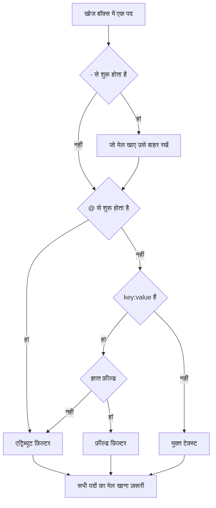

# खोज सिंटैक्स

लॉग, ट्रेस, मेट्रिक्स और अपवाद एक्सप्लोरर के ऊपर वाला खोज बॉक्स एक ही क्वेरी भाषा समझता है। क्वेरी स्पेस से अलग किए गए फ़िल्टरों की एक सूची है, और **हर फ़िल्टर का मेल खाना ज़रूरी है** — फ़िल्टरों के बीच कोई अंतर्निहित OR नहीं होता। खोजते समय इस पेज को संदर्भ के रूप में इस्तेमाल करें।

:::cards
- [फ़िल्टर के दो प्रकार](#फ़िल्टर-के-दो-प्रकार): बिल्ट-इन फ़ील्ड, एट्रिब्यूट और मुक्त टेक्स्ट।
- [मानों का मिलान](#मानों-का-मिलान): वाइल्डकार्ड, शामिल होना, तुलना और सूचियां।
- [बाहर रखना](#बाहर-रखना): आगे `-` लगाकर किसी भी फ़िल्टर को उलट दें।
- [सिग्नल के अनुसार फ़ील्ड](#सिग्नल-के-अनुसार-फ़ील्ड): हर एक्सप्लोरर में आप किन चीज़ों पर फ़िल्टर कर सकते हैं।
:::

## क्वेरी कैसे पढ़ी जाती है

```text
severity:error @platform.team:a* -@http.method:GET timeout
```

इसका अर्थ है: त्रुटि स्तर के लॉग, जिनका `platform.team` एट्रिब्यूट `a` से शुरू होता है, जिनका `http.method` एट्रिब्यूट `GET` नहीं है, और जिनके संदेश में `timeout` आता है।

| पद | प्रकार | मेल खाता है |
| --- | --- | --- |
| `severity:error` | फ़ील्ड | लॉग की गंभीरता Error है। |
| `@platform.team:a*` | एट्रिब्यूट | `platform.team` एट्रिब्यूट `a` से शुरू होता है। |
| `-@http.method:GET` | बाहर रखा गया एट्रिब्यूट | `http.method` एट्रिब्यूट `GET` के अलावा कुछ भी है। |
| `timeout` | मुक्त टेक्स्ट | संदेश में `timeout` है। |

स्पेस से अलग हर पद अपने आप में पढ़ा जाता है, फिर उन सभी को AND से जोड़ा जाता है:



## फ़िल्टर के दो प्रकार

| रूप | किस पर फ़िल्टर करता है | उदाहरण |
| --- | --- | --- |
| `field:value` | सिग्नल का एक बिल्ट-इन फ़ील्ड | `severity:error` |
| `@attribute:value` | पंक्ति पर एक OpenTelemetry एट्रिब्यूट | `@http.status_code:500` |
| अकेले शब्द | संदेश (लॉग), स्पैन का नाम (ट्रेस), मेट्रिक का नाम (मेट्रिक्स) या अपवाद संदेश (अपवाद) | `connection refused` |

ऐसा अकेला `key:value` जिसकी कुंजी कोई ज्ञात फ़ील्ड नहीं है, एट्रिब्यूट माना जाता है, इसलिए `k8s.pod:api-0` और `@k8s.pod:api-0` का अर्थ एक ही है। आगे `@` लगाने का अर्थ हमेशा "एट्रिब्यूट में देखें" होता है, एक अपवाद के साथ: अपवाद एक्सप्लोरर में `@type:`, `@service:`, `@env:` और `@class:` अब भी उन्हीं फ़ील्ड पर फ़िल्टर करते हैं।

जिस टेक्स्ट में संयोग से कोलन आ जाता है, वह टेक्स्ट ही रहता है — `https://example.com` और `12:30` शब्दों की तरह खोजे जाते हैं, फ़िल्टर के रूप में नहीं पढ़े जाते।

## मानों का मिलान

इस तालिका की हर चीज़ किसी भी एट्रिब्यूट और ज़्यादातर बिल्ट-इन फ़ील्ड पर काम करती है; [सिग्नल के अनुसार फ़ील्ड](#सिग्नल-के-अनुसार-फ़ील्ड) उन फ़ील्ड को बताता है जो मान को ज़्यादा सरल तरीके से पढ़ते हैं।

| आप लिखते हैं | यह मेल खाता है |
| --- | --- |
| `@k:abc` | ठीक `abc` |
| `@k:a*` | `a` से शुरू होने वाला कुछ भी — `abc`, `alpha` |
| `@k:*c` | `c` पर ख़त्म होने वाला कुछ भी |
| `@k:a*c` | `a` से शुरू और `c` पर ख़त्म |
| `@k:a?c` | `?` ठीक एक अक्षर है — `abc`, `axc`, लेकिन `ac` नहीं |
| `@k:*` | एट्रिब्यूट मौजूद है और खाली नहीं है |
| `@k:~abc` | कहीं भी `abc` शामिल है |
| `@k:!abc` | `abc` के अलावा कुछ भी |
| `@k:>100` | 100 से अधिक। `>=`, `<`, `<=` भी |
| `@k:(a OR b)` | दोनों में से कोई भी मान। `@k:[a, b]` भी यही है |
| `@k:(a* OR b*)` | दोनों में से कोई भी पैटर्न |

वाइल्डकार्ड और "शामिल है" मिलान केस को अनदेखा करते हैं; सटीक मिलान ऐसा नहीं करता, क्योंकि उसकी तुलना मान से ठीक उसी रूप में होती है जिसमें वह संग्रहीत हुआ था।

### स्पेस वाले मान

मान को डबल कोट में रखें:

```text
name:"SELECT wp_options"
@k8s.container.name:"my container"
```

कोट **स्पेस** को सुरक्षित रखते हैं, वाइल्डकार्ड को नहीं — `@k:"a b*"` अब भी `a b` से शुरू होने वाली किसी भी चीज़ से मेल खाता है।

### शाब्दिक `*`, `?` और दूसरे विराम चिह्न

बैकस्लैश अगले अक्षर को शाब्दिक बना देता है:

| आप लिखते हैं | यह मेल खाता है |
| --- | --- |
| `@k:a\*b` | ठीक `a*b` |
| `@k:\~abc` | ठीक `~abc` |
| `@k:\>5` | ठीक `>5` |

`%` या `_` वाले मानों को एस्केप करने की ज़रूरत नहीं — वे हमेशा शाब्दिक होते हैं।

## बाहर रखना

आगे लगा `-` किसी भी फ़िल्टर को उलट देता है, ऊपर वाले फ़िल्टर भी:

| आप लिखते हैं | यह मेल खाता है |
| --- | --- |
| `-severity:debug` | debug के अलावा सब कुछ |
| `-@platform.team:a*` | कोई भी पंक्ति जिसका `platform.team` `a` से शुरू **नहीं** होता, उन पंक्तियों सहित जिनमें `platform.team` है ही नहीं |
| `-@k:*` | एट्रिब्यूट मौजूद नहीं है या खाली है |
| `-@k:(a OR b)` | दोनों में से कोई भी मान नहीं |
| `-@k:>100` | 100 या उससे कम |
| `-@k:~abc` | `abc` शामिल नहीं है |

ट्रेस एक्सप्लोरर में `-` केवल एट्रिब्यूट को बाहर रखता है। `-status:error` को स्पैन नामों में खोजे जाने वाले टेक्स्ट के रूप में पढ़ा जाता है, और कुछ नहीं मिलता; इसके बजाय वे मान मांगें जो आप चाहते हैं, जैसे `status:(ok OR unset)`।

## सिग्नल के अनुसार फ़ील्ड

फ़ील्ड नाम केस-संवेदी नहीं हैं: `statusMessage:` और `statusmessage:` एक ही फ़ील्ड हैं।

### लॉग

| फ़ील्ड | उपनाम | नोट |
| --- | --- | --- |
| `severity` | `level` | `fatal`, `error`, `warning` (या `warn`), `info` (या `information`), `debug`, `trace`, `unspecified` — किसी भी केस में |
| `service` | | सेवा का नाम, पूरा लिखा हुआ, किसी भी केस में |
| `trace` | | ट्रेस ID |
| `span` | | स्पैन ID |
| `message` | `msg`, `log`, `body` | लॉग पंक्ति। अकेले शब्द भी इसी में खोजते हैं |

### ट्रेस

ट्रेस फ़ील्ड एक सादा मान या `status:(ok OR unset)` जैसी "इनमें से कोई भी" सूची लेते हैं, और `duration` में `>` और `<` भी चलते हैं। वाइल्डकार्ड, `~`, `!` और आगे लगा `-` यहां केवल एट्रिब्यूट पर काम करते हैं।

| फ़ील्ड | नोट |
| --- | --- |
| `service` | सेवा का नाम |
| `name` | स्पैन का नाम। एक मान इसके किसी भी हिस्से से मेल खाता है। अकेले शब्द भी इसी में खोजते हैं |
| `status` | `ok`, `error`, `unset` (unset = कोई त्रुटि स्थिति सेट नहीं है, जो OpenTelemetry का डिफ़ॉल्ट है) |
| `kind` | `server`, `client`, `producer`, `consumer`, `internal` |
| `duration` | मिलीसेकंड: `duration:>500`, `duration:<200` या एक सटीक मान |
| `statusMessage` | स्टेटस संदेश का टेक्स्ट। एक मान इसके किसी भी हिस्से से मेल खाता है |
| `hasException` | `true` या `false` |
| `trace`, `span` | ID |

### मेट्रिक्स

| फ़ील्ड | नोट |
| --- | --- |
| `name` | मेट्रिक का नाम। सादा मान इसके किसी भी हिस्से से मेल खाता है, इसलिए `name:http.server` से `http.server.request.duration` मिल जाता है। अकेले शब्द भी इसी में खोजते हैं |
| `service` | सेवा का नाम। सादा मान इसके किसी भी हिस्से से मेल खाता है |

### अपवाद

| फ़ील्ड | उपनाम | नोट |
| --- | --- | --- |
| `type` | `exceptionType` | अपवाद का प्रकार, जैसे `type:TypeError` |
| `env` | `environment` | परिवेश, `deployment.environment` रिसोर्स एट्रिब्यूट से |
| `service` | | सेवा का नाम। सादा मान इसके किसी भी हिस्से से मेल खाता है |
| `class` | `errorClass` | त्रुटि किसकी गलती है: `code-fault`, `user-error`, `expected-denial`, `infrastructure` या `unknown` |

अकेले शब्द अपवाद संदेश में खोजते हैं।

**Security Events** एक्सप्लोरर भी यही भाषा इस्तेमाल करता है, अपने खुद के फ़ील्ड के साथ, जैसे `severity`, `tactic` और `user` — देखें [सुरक्षा इवेंट](/docs/telemetry/security-events)।

## फ़िल्टर जोड़ना

फ़िल्टर AND से जुड़ते हैं। उनके बीच `AND` लिखा जा सकता है, इससे कुछ नहीं बदलता:

```text
severity:error service:api          # both must hold
severity:error AND service:api      # identical
```

फ़िल्टरों के **बीच** कोई OR या NOT नहीं होता: वहां लिखे `OR` और `NOT` छोड़ दिए जाते हैं, इसलिए `NOT severity:debug` का अर्थ वही है जो `severity:debug` का। आगे `-` लगाकर बाहर रखें (`-severity:debug`), और एक ही कुंजी के दो मानों में से किसी एक से मिलान के लिए "इनमें से कोई भी" रूप का उपयोग करें:

```text
@http.method:(GET OR POST)
```

एक ही कुंजी पर दो फ़िल्टर AND से जुड़ते हैं, और रेंज या दोनों सिरों वाला पैटर्न इसी तरह लिखा जाता है:

```text
@http.status_code:>=500 @http.status_code:<=599
@k:a* @k:*z
```

## चिप और खोज बॉक्स

किसी `key:value` पद पर Enter दबाने से वह लागू हो जाता है, आम तौर पर नतीजों के ऊपर एक चिप के रूप में। चिप मान को ठीक वैसा ही रखती है जैसा लिखा गया था, इसलिए वाइल्डकार्ड वाइल्डकार्ड ही रहता है। जिस पद को चिप नहीं रख सकती, जैसे बाहर रखा गया `-key:value`, वह खोज बॉक्स में रहता है और वहीं से फ़िल्टर करता है। फ़ेसेट साइडबार में किसी मान पर क्लिक करने से उसी तरह की चिप जुड़ती है, जिसका मान एस्केप किया हुआ होता है — संयोग से `*` वाला संग्रहीत मान उसी शाब्दिक मान के लिए फ़िल्टर करता है, पैटर्न के रूप में नहीं।

चिप सहेजे गए व्यू और पेज URL का हिस्सा होती हैं, इसलिए फ़िल्टर रीफ़्रेश, बुकमार्क और साझा किए गए लिंक के बाद भी बना रहता है।

## जानने योग्य बातें

- वाइल्डकार्ड, "शामिल है" और प्रीफ़िक्स/सफ़िक्स फ़िल्टर के लिए एट्रिब्यूट **कुंजियों** का मिलान केस को अनदेखा करके होता है, इसलिए आपको याद रखने की ज़रूरत नहीं कि वह `requestId` के रूप में इंजेस्ट हुआ था या `requestid` के रूप में।
- `-@k:...` फ़िल्टर उन पंक्तियों से भी मेल खाता है जिनमें वह एट्रिब्यूट कभी था ही नहीं — जिस पंक्ति में `platform.team` है ही नहीं, वह स्वाभाविक रूप से `a` से शुरू नहीं होती।
- संख्यात्मक तुलनाएं टेक्स्ट के रूप में संग्रहीत एट्रिब्यूट मानों पर काम करती हैं; जो मान संख्या नहीं है, वह कभी किसी तुलना को पूरा नहीं करता।

## अगले कदम

:::cards
- [समय सीमा पर ज़ूम इन करना](/docs/telemetry/charts-and-time-ranges): एक्सप्लोरर को उस पल तक सीमित करें जो मायने रखता है।
- [लॉग पाइपलाइन](/docs/telemetry/log-pipelines): लॉग पंक्ति के हिस्सों को खोजने योग्य एट्रिब्यूट में बदलें।
- [लॉग मॉनिटर](/docs/monitor/logs-monitor): जिन लॉग को आप खोजते हैं, उनके दिखते ही अलर्ट करें।
- [OpenTelemetry](/docs/telemetry/open-telemetry): खोजने के लिए लॉग, मेट्रिक्स और ट्रेस भेजें।
:::
