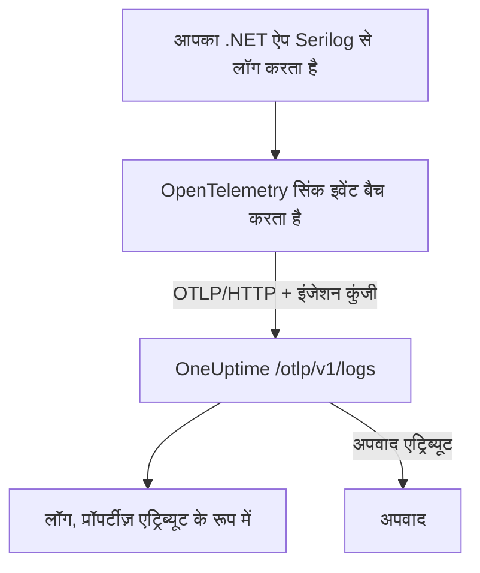

# Serilog (.NET)

[Serilog](https://serilog.net) .NET के लिए सबसे लोकप्रिय स्ट्रक्चर्ड लॉगिंग लाइब्रेरी है। आधिकारिक [`Serilog.Sinks.OpenTelemetry`](https://github.com/serilog/serilog-sinks-opentelemetry) सिंक के साथ, आपका एप्लिकेशन Serilog से जो भी इवेंट लॉग करता है, वह OpenTelemetry Protocol (OTLP) के ज़रिए OneUptime को भेजा जाता है, और अपनी स्ट्रक्चर्ड प्रॉपर्टीज़, सीवियरिटी और ट्रेस से जुड़ाव के साथ **उत्पाद → लॉग** में खोजा जा सकता है।

OneUptime के लिए अलग से कोई पैकेज इंस्टॉल नहीं करना होता — सिंक उसी OTLP एंडपॉइंट से बात करता है जिसे OneUptime सभी OpenTelemetry डेटा के लिए देता है। यह कंसोल ऐप, वर्कर सर्विस, ASP.NET Core ऐप और .NET पर चलने वाली हर चीज़ के लिए काम करता है।

:::cards
- [सिंक सेट अप करें](#सिंक-सेट-अप-करें): दो पैकेज इंस्टॉल करें और उन्हें कोड में या `appsettings.json` में कॉन्फ़िगर करें।
- [अपवाद](#अपवाद): लॉग किए गए अपवाद, अपवाद में इश्यू बन जाते हैं।
- [समस्या निवारण](#समस्या-निवारण): लॉग न पहुंचें तो क्या जांचें।
:::

## यह कैसे काम करता है



सिंक लॉग इवेंट को बैच में इकट्ठा करता है और बैकग्राउंड में भेजता है। हर नाम वाली प्रॉपर्टी एक लॉग एट्रिब्यूट बन जाती है, और Serilog से लॉग किया गया अपवाद उन एट्रिब्यूट के साथ पहुंचता है जिनसे OneUptime एक इश्यू बनाता है।

## शुरू करने से पहले

- एक OneUptime प्रोजेक्ट। OneUptime Cloud पर टेलीमेट्री का बिल प्रति GB इंजेस्ट किए गए डेटा पर बनता है — देखें [मूल्य](https://oneuptime.com/pricing) — और Free प्लान वाले प्रोजेक्ट को टेलीमेट्री भेजने से पहले भुगतान विधि जोड़नी होती है।
- एक .NET एप्लिकेशन जो Serilog इस्तेमाल करता है या कर सकता है।
- आपके लॉग प्रमाणित करने के लिए एक टेलीमेट्री इंजेशन कुंजी। अगर आपके पास नहीं है:

:::steps
### इंजेशन कुंजियाँ खोलें

**उत्पाद → प्रोजेक्ट सेटिंग्स** पर जाएं, साइड मेन्यू में **टेलीमेट्री और APM** खोलें और **इंजेशन कुंजियाँ** चुनें।


### एक कुंजी बनाएं

**इन्जेशन कुंजी बनाएँ** पर क्लिक करें। डायलॉग में कुंजी का नाम पहले से भरा होता है और **सर्वर** चुना होता है — वह कुंजी प्रकार जिससे कोई एप्लिकेशन या collector डेटा भेजता है — इसलिए उसे बनाने के लिए **इन्जेशन कुंजी बनाएँ** पर क्लिक करें, या पहले उसका नाम बदलें।

### सीक्रेट कॉपी करें

नई कुंजी अपने पेज पर खुलती है। उसकी **सीक्रेट कुंजी** कॉपी करें: यही नीचे के उदाहरणों में `YOUR_TELEMETRY_INGESTION_TOKEN` है।


:::

## आपको OneUptime से क्या चाहिए

| सेटिंग | मान |
| ------------- | ------------------------------------------------------------ |
| OTLP एंडपॉइंट | `https://oneuptime.com/otlp` |
| ऑथ हेडर | `x-oneuptime-token: YOUR_TELEMETRY_INGESTION_TOKEN` |
| सेवा का नाम | वह नाम जिसके तहत आपकी सेवा दिखनी चाहिए, जैसे `my-service` |

> [!NOTE]
> OneUptime खुद होस्ट करते हैं? `https://oneuptime.com/otlp` की जगह `https://YOUR-ONEUPTIME-HOST/otlp` लिखें (या `http://...`, अगर आप TLS टर्मिनेट नहीं करते)। बाकी सब वैसा ही रहता है।

प्रोटोकॉल `HttpProtobuf` पर सेट होने पर सिंक एंडपॉइंट के आगे `/v1/logs` पाथ जोड़ देता है, इसलिए वह जिस अंतिम URL पर भेजता है वह `https://oneuptime.com/otlp/v1/logs` है। आपको सिर्फ़ बेस `/otlp` एंडपॉइंट देना होता है।

## सिंक सेट अप करें

:::steps
### NuGet पैकेज इंस्टॉल करें

अपने प्रोजेक्ट में Serilog और OpenTelemetry सिंक जोड़ें:

```bash
dotnet add package Serilog
dotnet add package Serilog.Sinks.OpenTelemetry
```

अगर आप सिंक को `appsettings.json` से कॉन्फ़िगर कर रहे हैं, तो `Serilog.Settings.Configuration` भी जोड़ें। ASP.NET Core ऐप के लिए `Serilog.AspNetCore` जोड़ें, जो Serilog को होस्ट और रिक्वेस्ट पाइपलाइन से जोड़ता है:

```bash
dotnet add package Serilog.Settings.Configuration
dotnet add package Serilog.AspNetCore
```

### सिंक कॉन्फ़िगर करें

सिंक को अपने OneUptime OTLP एंडपॉइंट की ओर करें, प्रोटोकॉल `HttpProtobuf` पर सेट करें, अपना इंजेशन टोकन हेडर के रूप में दें, और लॉग पर `service.name` लगाएं। इसे कोड में, `appsettings.json` में या ASP.NET Core होस्ट में कॉन्फ़िगर करें:

:::tabs
@tab कोड में
```csharp title="Program.cs"
using Serilog;
using Serilog.Sinks.OpenTelemetry;

Log.Logger = new LoggerConfiguration()
    .MinimumLevel.Information()
    .Enrich.FromLogContext()
    .WriteTo.Console() // optional: keep local logs too
    .WriteTo.OpenTelemetry(options =>
    {
        // Base OTLP endpoint. The sink appends /v1/logs automatically.
        options.Endpoint = "https://oneuptime.com/otlp";
        options.Protocol = OtlpProtocol.HttpProtobuf;

        // Authenticate with your OneUptime telemetry ingestion token.
        options.Headers = new Dictionary<string, string>
        {
            ["x-oneuptime-token"] = "YOUR_TELEMETRY_INGESTION_TOKEN"
        };

        // Identify your service in OneUptime.
        options.ResourceAttributes = new Dictionary<string, object>
        {
            ["service.name"] = "my-service",
            ["deployment.environment"] = "production"
        };
    })
    .CreateLogger();

try
{
    Log.Information("Application starting up");
    // ... your application code ...
}
finally
{
    // Flush any buffered logs before the process exits.
    Log.CloseAndFlush();
}
```
@tab appsettings.json
सिंक की सेटिंग्स `appsettings.json` में रखें:

```json title="appsettings.json"
{
  "Serilog": {
    "Using": ["Serilog.Sinks.OpenTelemetry"],
    "MinimumLevel": "Information",
    "WriteTo": [
      {
        "Name": "OpenTelemetry",
        "Args": {
          "endpoint": "https://oneuptime.com/otlp",
          "protocol": "HttpProtobuf",
          "headers": {
            "x-oneuptime-token": "YOUR_TELEMETRY_INGESTION_TOKEN"
          },
          "resourceAttributes": {
            "service.name": "my-service",
            "deployment.environment": "production"
          }
        }
      }
    ]
  }
}
```

फिर कॉन्फ़िगरेशन से लॉगर बनाएं:

```csharp title="Program.cs"
using Serilog;
using Microsoft.Extensions.Configuration;

IConfiguration configuration = new ConfigurationBuilder()
    .AddJsonFile("appsettings.json")
    .Build();

Log.Logger = new LoggerConfiguration()
    .ReadFrom.Configuration(configuration)
    .CreateLogger();
```
@tab ASP.NET Core
ASP.NET Core (.NET 6+ मिनिमल होस्टिंग) के लिए `Serilog.AspNetCore` इस्तेमाल करें, ताकि Serilog डिफ़ॉल्ट लॉगर की जगह ले और फ़्रेमवर्क व रिक्वेस्ट लॉग भी कैप्चर करे:

```csharp title="Program.cs"
using Serilog;
using Serilog.Sinks.OpenTelemetry;

var builder = WebApplication.CreateBuilder(args);

builder.Host.UseSerilog((context, services, configuration) =>
{
    configuration
        .ReadFrom.Configuration(context.Configuration)
        .Enrich.FromLogContext()
        .WriteTo.OpenTelemetry(options =>
        {
            options.Endpoint = "https://oneuptime.com/otlp";
            options.Protocol = OtlpProtocol.HttpProtobuf;
            options.Headers = new Dictionary<string, string>
            {
                ["x-oneuptime-token"] = "YOUR_TELEMETRY_INGESTION_TOKEN"
            };
            options.ResourceAttributes = new Dictionary<string, object>
            {
                ["service.name"] = "my-service"
            };
        });
});

var app = builder.Build();

// Logs one summary event per HTTP request.
app.UseSerilogRequestLogging();

app.MapGet("/", () => "Hello World");
app.Run();
```
:::

> [!IMPORTANT]
> सिंक लॉग इवेंट को बैच करता है और उन्हें एसिंक्रोनस रूप से भेजता है। एप्लिकेशन बंद होने से पहले हमेशा `Log.CloseAndFlush()` कॉल करें (या लॉगर को डिस्पोज़ करें), वरना लॉग का आखिरी बैच खो सकता है। ASP.NET Core में, ग्रेसफ़ुल शटडाउन पर `Serilog.AspNetCore` यह आपके लिए कर देता है।

> [!TIP]
> टोकन को सोर्स कंट्रोल से बाहर रखें। उसे किसी एनवायरनमेंट वेरिएबल या सीक्रेट्स स्टोर से पढ़ें और स्टार्टअप पर कॉन्फ़िगरेशन में डालें, न कि `appsettings.json` में कमिट करें।

### लॉग लिखें

Serilog को हमेशा की तरह इस्तेमाल करें। स्ट्रक्चर्ड प्रॉपर्टीज़ बनी रहती हैं और OneUptime में खोजने योग्य एट्रिब्यूट बन जाती हैं:

```csharp
Log.Information("Order {OrderId} placed by {CustomerId} for {Amount:C}",
    orderId, customerId, amount);

Log.Warning("Payment gateway slow: {LatencyMs}ms", latencyMs);
```

हर नाम वाली प्रॉपर्टी (`OrderId`, `CustomerId`, `Amount`, `LatencyMs`) लॉग एट्रिब्यूट के रूप में भेजी जाती है, ताकि आप **उत्पाद → लॉग** एक्सप्लोरर में उन पर फ़िल्टर और खोज कर सकें।

### जांचें कि लॉग पहुंच रहे हैं

अपना एप्लिकेशन चलाएं और कुछ लॉग इवेंट लिखें। कुछ ही सेकंड में वे **उत्पाद → लॉग** में दिखते हैं, और **उत्पाद → सेवाएं** के तहत आपकी सेवा के पेज पर भी — सेवा का नाम आपके सेट किए `service.name` (`my-service`) पर होता है। उनकी स्ट्रक्चर्ड प्रॉपर्टीज़ फ़िल्टर के रूप में उपलब्ध होती हैं।
:::

## अपवाद

जब आप Serilog से कोई अपवाद लॉग करते हैं, तो सिंक लॉग रिकॉर्ड पर OpenTelemetry के `exception.type`, `exception.message` और `exception.stacktrace` एट्रिब्यूट जोड़ देता है:

```csharp
try
{
    ProcessPayment();
}
catch (Exception ex)
{
    Log.Error(ex, "Failed to process payment for order {OrderId}", orderId);
}
```

OneUptime इन एट्रिब्यूट को पहचानता है और त्रुटि को फ़िंगरप्रिंट के अनुसार **अपवाद** में एक इश्यू में समूहित करता है, सही सेवा से जोड़कर। जो त्रुटि ट्रेस और लॉग दोनों से रिपोर्ट होती है, वह एक ही इश्यू में मिल जाती है। पहचान कैसे काम करती है, यह [लॉग से अपवाद](/docs/telemetry/open-telemetry#लॉग-से-अपवाद) में देखें।

## ट्रेस से जुड़ाव

अगर आपका एप्लिकेशन ट्रेस के लिए OpenTelemetry .NET SDK से भी इंस्ट्रूमेंटेड है, तो किसी सक्रिय स्पैन के अंदर बने Serilog इवेंट पर अपने आप मौजूदा `TraceId` और `SpanId` लग जाते हैं (यह सिंक के डिफ़ॉल्ट `IncludedData` का हिस्सा है)। इससे OneUptime किसी लॉग लाइन को सीधे उस ट्रेस से जोड़ पाता है जिसमें वह हुई, और आप लॉग से आसपास की रिक्वेस्ट पर जा सकते हैं और वापस आ सकते हैं।

ट्रेस और मेट्रिक्स भी भेजने के लिए, [OpenTelemetry क्विकस्टार्ट](/docs/telemetry/open-telemetry#क्विकस्टार्ट) में .NET सेटअप देखें।

## समस्या निवारण

:::details कोई लॉग नहीं दिखता
`x-oneuptime-token` का मान दोबारा जांचें और पक्का करें कि वह उसी प्रोजेक्ट का है जिसे आप देख रहे हैं। पक्का करें कि एंडपॉइंट `https://oneuptime.com/otlp` है (सिर्फ़ बेस पाथ — `/v1/logs` खुद न जोड़ें)। सिंक क्यों विफल हो रहा है यह देखने के लिए, स्टार्टअप पर `Serilog.Debugging.SelfLog.Enable(Console.Error)` से Serilog का अपना एरर आउटपुट चालू करें: वह OneUptime का लौटाया स्टेटस कोड दिखाता है।
:::

:::details लॉग सिर्फ़ ऐप बंद होने पर दिखते हैं, या आखिरी लॉग गायब हैं
पक्का करें कि शटडाउन पर `Log.CloseAndFlush()` चले। सिंक इवेंट को बैच करता है, इसलिए अगर प्रोसेस को फ़्लश किए बिना बंद कर दिया जाए तो बफ़र में पड़े लॉग खो जाते हैं।
:::

:::details 401 Unauthorized, और कुछ भी इंजेस्ट नहीं होता
कुंजी मौजूद नहीं है, अज्ञात है या समाप्त हो गई है। पक्का करें कि हेडर का नाम ठीक `x-oneuptime-token` है, और उसका मान कुंजी की **सीक्रेट कुंजी** है।
:::

:::details 402 या 422, और कुछ भी इंजेस्ट नहीं होता
`402`: OneUptime Cloud पर प्रोजेक्ट Free प्लान पर है और उसकी कोई भुगतान विधि नहीं है। **प्रोजेक्ट सेटिंग्स → बिलिंग और चालान → बिलिंग** में एक जोड़ें। `422`: कुंजी अक्षम है, या यह ब्राउज़र कुंजी है। कुंजी की सेटिंग में **सक्षम** फिर से चालू करें, या **सर्वर** कुंजी बनाएं।
:::

:::details लॉग गलत सेवा नाम के तहत पहुंचते हैं
`ResourceAttributes` (कोड) या `resourceAttributes` (appsettings.json) में `service.name` सेट करें। इसके बिना आपके लॉग आपकी सेवा के नाम के बजाय उस प्लेसहोल्डर नाम के तहत रखे जाते हैं जो सिंक उसकी जगह भेजता है।
:::

:::details सेल्फ़-होस्टेड इंस्टेंस से कनेक्शन एरर
पक्का करें कि प्रोटोकॉल आपके एंडपॉइंट की स्कीम (`https://` या `http://`) से मेल खाता है, और एप्लिकेशन से आपका OneUptime होस्ट पहुंच योग्य है।
:::

अगर आपके कोई सवाल हैं या मदद चाहिए, तो हमें support@oneuptime.com पर लिखें।

## अगले कदम

:::cards
- [OpenTelemetry](/docs/telemetry/open-telemetry): .NET से ट्रेस और मेट्रिक्स भी भेजें।
- [लॉग पाइपलाइन](/docs/telemetry/log-pipelines): लॉग आते ही उन्हें पार्स करें और समृद्ध करें।
- [लॉग मॉनिटर](/docs/monitor/logs-monitor): मेल खाते लॉग दिखने पर अलर्ट करें।
- [खोज सिंटैक्स](/docs/telemetry/search-syntax): अपनी Serilog प्रॉपर्टीज़ पर फ़िल्टर करें।
:::
