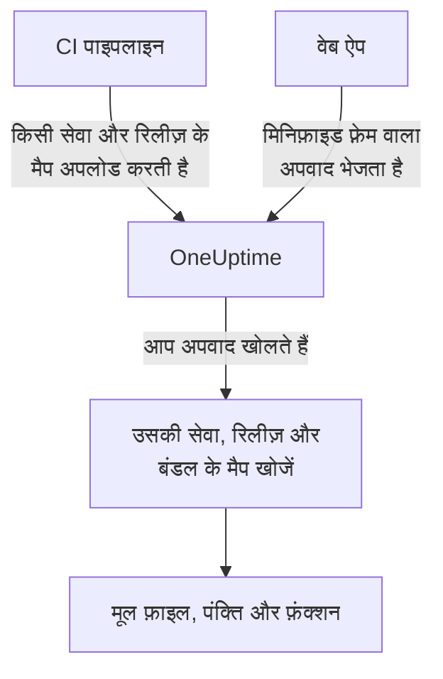

# सोर्स मैप

अपने फ़्रंट-एंड बिल्ड के सोर्स मैप OneUptime पर अपलोड करें, और **अपवाद** में ब्राउज़र अपवाद मिनिफ़ाइड नामों के बजाय आपकी मूल फ़ाइल के नाम, पंक्तियां और फ़ंक्शन दिखाते हैं। यह पेज उन फ़्रंट-एंड डेवलपरों के लिए है जो पहले से OneUptime को ब्राउज़र टेलीमेट्री भेज रहे हैं।

:::cards
- [मिलान कैसे होता है](#मिलान-कैसे-होता-है): सेवा का नाम, रिलीज़ और बंडल फ़ाइल।
- [सोर्स मैप अपलोड करें](#सोर्स-मैप-अपलोड-करें): CI से एक `curl` अनुरोध।
- [सीमाएं](#सीमाएं): आकार, गिनती और सेल्फ़-होस्टेड सेटिंग।
- [हल किए गए स्टैक ट्रेस देखना](#हल-किए-गए-स्टैक-ट्रेस-देखना): हल किया गया फ़्रेम कैसा दिखता है।
:::

## अवलोकन

प्रोडक्शन फ़्रंट-एंड बंडल मिनिफ़ाइड होते हैं, इसलिए OpenTelemetry वेब SDK से कैप्चर किया गया ब्राउज़र अपवाद ऐसे स्टैक फ़्रेम के साथ आता है:

```text
TypeError: Cannot read properties of undefined (reading 'id')
    at e.onSelect (https://app.example.com/assets/main.a8f1b2.js:1:48291)
```

अपने बिल्ड के सोर्स मैप OneUptime पर अपलोड करें, और अपवाद डैशबोर्ड उन फ़्रेम को वापस मूल फ़ाइल, पंक्ति और फ़ंक्शन नाम में हल कर देता है — और, अगर मैप `sourcesContent` के साथ बना था, तो आपके मूल सोर्स की आसपास की पंक्तियां भी दिखाता है।

मैप एक ऑथेंटिकेटेड API से OneUptime पर अपलोड होते हैं और **आपकी साइट से कभी नहीं लाए जाते**, इसलिए आप `hidden-source-map` (webpack) या `sourcemap: 'hidden'` (Vite / Rollup) के साथ बिल्ड करते रह सकते हैं (और करना चाहिए), और `.map` फ़ाइलें अपने बंडल के बगल में कभी प्रकाशित न करें।



## मिलान कैसे होता है

सोर्स मैप तीन कुंजियों के साथ संग्रहीत होता है:

| कुंजी | किससे मेल खाना चाहिए |
|---|---|
| सेवा का नाम | `service.name` OpenTelemetry रिसोर्स एट्रिब्यूट, जिसके साथ आपका वेब ऐप टेलीमेट्री भेजता है |
| सेवा संस्करण | `service.version` रिसोर्स एट्रिब्यूट (आपकी रिलीज़ पहचान) |
| बंडल पाथ | वह मिनिफ़ाइड फ़ाइल जिसके लिए मैप बना था, जैसे `main.a8f1b2.js` |

जब आप कोई अपवाद खोलते हैं, तो OneUptime उस अपवाद की सेवा और रिलीज़ के लिए अपलोड किए गए मैप खोजता है, हर स्टैक फ़्रेम को फ़ाइल नाम से किसी बंडल से मिलाता है (पाथ का अंतिम हिस्सा मिलना काफ़ी है — `main.a8f1b2.js`, `https://app.example.com/assets/main.a8f1b2.js` से मेल खाता है), और मैप के ज़रिए मिनिफ़ाइड पंक्ति और कॉलम को हल करता है। हल करना तब होता है जब अपवाद देखा जाता है, इंजेशन के रास्ते पर कभी नहीं — इसलिए नई रिलीज़ की पहली त्रुटि के कुछ मिनट *बाद* अपलोड किया गया मैप भी पिछली तारीख से लागू होता है।

## शुरू करने से पहले

- एक **सर्वर** टेलीमेट्री इंजेशन कुंजी, **प्रोजेक्ट सेटिंग्स → टेलीमेट्री और APM → इंजेशन कुंजियाँ** से। देखें [एक इंजेशन कुंजी बनाएं](/docs/telemetry/open-telemetry#एक-इंजेशन-कुंजी-बनाएं)।
- एक वेब ऐप जो पहले से OpenTelemetry वेब SDK के साथ OneUptime को अपवाद भेज रहा हो — देखें [ब्राउज़र सेटअप](/docs/rum/browser-setup)।
- एक बिल्ड जो सोर्स मैप लिखता हो, और अगर आप हर फ़्रेम के आसपास सोर्स के अंश चाहते हैं, तो `sourcesContent` शामिल हो (ज़्यादातर बंडलर का डिफ़ॉल्ट)।

## सोर्स मैप अपलोड करें

:::steps
### अपनी टेलीमेट्री के साथ `service.version` भेजें

आपके वेब ऐप को `service.version` भेजना होगा, और यह वही स्ट्रिंग होनी चाहिए जिसके साथ आप मैप अपलोड करते हैं:

```javascript
import { resourceFromAttributes } from "@opentelemetry/resources";

const resource = resourceFromAttributes({
  "service.name": "my-web-app",
  "service.version": "1.4.2", // same value you upload maps with
});
```

कोई भी स्थिर रिलीज़ पहचान काम करती है — सिमेंटिक वर्ज़न, git कमिट SHA, बिल्ड नंबर — बशर्ते अपलोड किया गया `serviceVersion` और `service.version` रिसोर्स एट्रिब्यूट एक ही स्ट्रिंग हों।

### हर प्रोडक्शन बिल्ड के बाद मैप अपलोड करें

CI से अपलोड करें, अपनी इंजेशन कुंजी `x-oneuptime-token` हेडर में रखकर:

```bash
curl --fail -X POST "https://oneuptime.com/source-maps/v1/upload" \
  -H "x-oneuptime-token: YOUR_TELEMETRY_INGESTION_KEY" \
  -F "serviceName=my-web-app" \
  -F "serviceVersion=1.4.2" \
  -F "sourcemap=@dist/assets/main.a8f1b2.js.map" \
  -F "sourcemap=@dist/assets/vendor.9c3d4e.js.map"
```

सेल्फ़-होस्टेड इंस्टॉलेशन के लिए `oneuptime.com` को अपने OneUptime होस्ट से बदलें। `x-oneuptime-token` हेडर के विकल्प के रूप में `Authorization: Bearer YOUR_KEY` भी स्वीकार किया जाता है।

### अपलोड जांचें

सफल अपलोड संग्रहीत मैप की सूची वाली JSON बॉडी लौटाता है, ताकि CI उस पर जांच कर सके। मैप OneUptime में सेवा के **Source Maps** पेज पर भी दिखते हैं।
:::

एक सामान्य CI चरण बिल्ड के बनाए हर मैप को अपलोड करता है:

```bash
VERSION="$(git rev-parse --short HEAD)"

find dist -name "*.js.map" -print0 | while IFS= read -r -d '' map; do
  curl --fail -X POST "https://oneuptime.com/source-maps/v1/upload" \
    -H "x-oneuptime-token: $ONEUPTIME_INGESTION_KEY" \
    -F "serviceName=my-web-app" \
    -F "serviceVersion=$VERSION" \
    -F "sourcemap=@$map"
done
```

### अपलोड के नियम

- हर अपलोड की गई फ़ाइल का बंडल पाथ उसका फ़ाइल नाम है, आख़िरी `.map` हटाकर — `main.a8f1b2.js.map` बन जाता है `main.a8f1b2.js`। अगर आपकी मैप फ़ाइल का नाम इस परंपरा का पालन नहीं करता, तो हर अनुरोध में एक फ़ाइल अपलोड करें और एक स्पष्ट `bundlePath` फ़ील्ड दें।
- उसी सेवा और संस्करण के लिए वही बंडल फिर से अपलोड करने पर पिछला मैप बदल जाता है, इसलिए CI के दोबारा प्रयास सुरक्षित हैं।
- फ़ाइलें [source map v3](https://tc39.es/ecma426/) JSON होनी चाहिए (हर आधुनिक बंडलर यही बनाता है — `sections` वाले इंडेक्स्ड मैप भी समर्थित हैं)।
- अगर आपके सेल्फ़-होस्टेड ऑपरेटर ने टेलीमेट्री इंजेशन बंद कर दिया है (`DISABLE_TELEMETRY_INGESTION`), तो अपलोड एक खाली सफल जवाब लौटाते हैं और कुछ संग्रहीत नहीं होता — उस मोड में हर टेलीमेट्री इंजेस्ट एंडपॉइंट का यही व्यवहार है। असली अपलोड हमेशा संग्रहीत मैप की सूची वाली JSON बॉडी लौटाता है, ताकि CI दोनों में अंतर कर सके।

## सीमाएं

हर `.map` फ़ाइल 50 MB तक हो सकती है, लेकिन इंग्रेस **पूरी अनुरोध बॉडी** को भी 50 MB पर सीमित करता है — इसलिए बड़े मैप एक अनुरोध में एक करके अपलोड करें। हर अनुरोध में 50 फ़ाइलें तक स्वीकार होती हैं, और एक रिलीज़ (सेवा + संस्करण) में कुल मिलाकर अधिकतम 1,000 मैप रह सकते हैं; जो अपलोड इससे आगे जाता, वह सीमा बताने वाले संदेश के साथ अस्वीकार हो जाता है। जो बिल्ड एक अनुरोध की सीमा से ज़्यादा मैप बनाता है, उसे बस कई अनुरोध भेजने चाहिए — एक ही रिलीज़ के अपलोड जुड़ते जाते हैं।

सेल्फ़-होस्टेड इंस्टॉलेशन इन्हें बदल सकते हैं। पांचों सामान्य एनवायरनमेंट वेरिएबल हैं, और Helm चार्ट इन्हें `values.yaml` में `sourceMaps` के तहत उपलब्ध कराता है:

| `values.yaml` | एनवायरनमेंट वेरिएबल | डिफ़ॉल्ट |
| --- | --- | --- |
| `sourceMaps.maxMapsPerRelease` | `SOURCE_MAP_MAX_MAPS_PER_RELEASE` | `1000` |
| `sourceMaps.maxFilesPerRequest` | `SOURCE_MAP_MAX_FILES_PER_REQUEST` | `50` |
| `sourceMaps.maxFileSizeBytes` | `SOURCE_MAP_MAX_FILE_SIZE_BYTES` | `52428800` |
| `sourceMaps.maxBytesPerResolve` | `SOURCE_MAP_MAX_BYTES_PER_RESOLVE` | `536870912` |
| `sourceMaps.retentionDays` | `SOURCE_MAP_RETENTION_DAYS` | `90` |

अगर आपका बिल्ड डिफ़ॉल्ट से आगे निकल जाए, तो बढ़ाने वाला मान `maxMapsPerRelease` है; यह केवल भंडारण के आकार की सीमा है, क्योंकि हल करने का भार `maxBytesPerResolve` से सीमित होता है, न कि इससे कि किसी रिलीज़ में कितने मैप हैं। `maxFilesPerRequest` और `maxFileSizeBytes` को केवल **घटाया** जा सकता है — multipart बॉडी अनुरोध के ऑथेंटिकेट होने से पहले पार्स होती है, इसलिए बिना ऑथेंटिकेशन वाले कॉलर पर उनके ऊपर की साझा सीमाएं लागू होती हैं, और बड़ा मान लागू होने के बजाय सीमा तक घटा दिया जाता है।

## हल किए गए स्टैक ट्रेस देखना

डैशबोर्ड में **अपवाद** के तहत कोई भी अपवाद खोलें। सोर्स मैप से हल किए गए फ़्रेम पर **Source mapped** बैज दिखता है और वे मूल फ़ंक्शन नाम और फ़ाइल स्थान दिखाते हैं; किसी फ़्रेम को खोलने पर मिनिफ़ाइड स्थान के साथ मूल सोर्स का अंश (जब मैप में `sourcesContent` हो) दिखता है।

किसी सेवा के अपलोड किए गए मैप **उत्पाद → सेवाएं → आपकी सेवा → Source Maps** में देखे और हटाए जा सकते हैं, जहां हर मैप की रिलीज़, बंडल, आकार और अपलोड समय की सूची होती है।

## प्रतिधारण

सोर्स मैप अपलोड के बाद 90 दिनों तक रखे जाते हैं, फिर अपने आप हट जाते हैं। मैप तभी तक उपयोगी है जब तक उसकी रिलीज़ के अपवाद आपकी टेलीमेट्री प्रतिधारण अवधि के भीतर हों, इसलिए यह अवधि उन अपवादों से आराम से ज़्यादा चलती है जिन्हें यह पढ़ने योग्य बनाता है। अगर फिर से ज़रूरत हो, तो किसी रिलीज़ के मैप दोबारा अपलोड करें।

## सुरक्षा

- मैप एक ऑथेंटिकेटेड एंडपॉइंट से अपलोड होते हैं और आपके OneUptime प्रोजेक्ट में संग्रहीत होते हैं — वे आपकी वेबसाइट से कभी नहीं लाए जाते, इसलिए छिपे हुए सोर्स मैप छिपे ही रहते हैं।
- मैप की कच्ची सामग्री (जिसमें `sourcesContent` के साथ बनने पर आपका मूल सोर्स शामिल होता है) केवल प्रोजेक्ट स्वामी और व्यवस्थापक, और **Read Telemetry Source Map** अनुमति पाने वाला कोई भी व्यक्ति वापस पढ़ सकता है। टीम के दूसरे सदस्य उन अपवादों के, जिन तक उनकी पहले से पहुंच है, केवल हल किए गए फ़्रेम और हर क्रैश स्थान के आसपास की कुछ सोर्स पंक्तियां देखते हैं।
- किसी सेवा को हटाने से उसके सोर्स मैप भी हट जाते हैं।

## समस्या निवारण

:::details फ़्रेम अब भी मिनिफ़ाइड हैं
अपवाद की रिलीज़ के लिए कोई मेल खाता मैप नहीं है। जांचें कि आपका ऐप जो `service.version` भेजता है वह ठीक वही `serviceVersion` है जिसके साथ आपने अपलोड किया था, कि `serviceName` `service.name` से मेल खाता है, और उस बंडल फ़ाइल के लिए कोई मैप अपलोड हुआ था: सेवा का **Source Maps** पेज हर मैप की रिलीज़ और बंडल दिखाता है।
:::

:::details अपलोड अस्वीकार हुआ क्योंकि मैप बहुत बड़ा है
एक मैप 50 MB तक हो सकता है, और पूरा अनुरोध भी। ऊपर के CI लूप की तरह, बड़े मैप एक अनुरोध में एक करके अपलोड करें।
:::

## अगले कदम

:::cards
- [ब्राउज़र सेटअप](/docs/rum/browser-setup): OpenTelemetry वेब SDK से ब्राउज़र ट्रेस और अपवाद भेजें।
- [अपवाद मॉनिटर](/docs/monitor/exceptions-monitor): नए अपवाद दिखने पर अलर्ट करें।
- [OpenTelemetry](/docs/telemetry/open-telemetry): सारी टेलीमेट्री के लिए एंडपॉइंट, कुंजियां और सीमाएं।
:::
