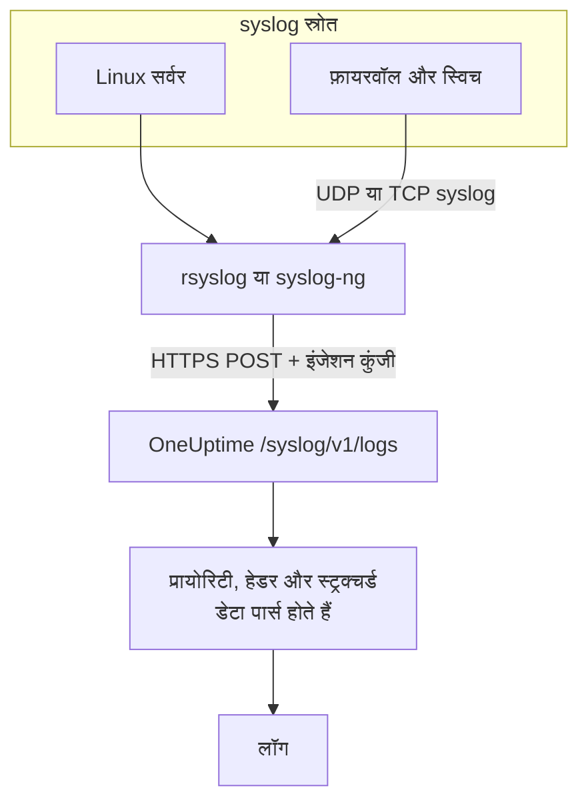

# Syslog

OneUptime HTTPS पर syslog स्वीकार करता है। अपनी इंजेशन कुंजी के साथ RFC 5424 या RFC 3164 मैसेज `/syslog/v1/logs` पर भेजें, और हर मैसेज एक खोजने योग्य लॉग बन जाता है, जिसमें उसकी प्रायोरिटी, फ़ैसिलिटी, सीवियरिटी, होस्ट, एप्लिकेशन और स्ट्रक्चर्ड डेटा एट्रिब्यूट के रूप में होते हैं। इसका इस्तेमाल rsyslog, syslog-ng या HTTP रिक्वेस्ट भेज सकने वाले किसी भी रिले से फ़ॉरवर्ड करने के लिए करें।

:::cards
- [एक टेस्ट मैसेज भेजें](#एक-टेस्ट-मैसेज-भेजें): बस एक `curl` रिक्वेस्ट।
- [rsyslog से फ़ॉरवर्ड करें](#rsyslog-से-फ़ॉरवर्ड-करें): सर्वर या रिले को मिलने वाली हर चीज़ भेजें।
- [पार्स किए गए एट्रिब्यूट](#पार्स-किए-गए-एट्रिब्यूट): OneUptime हर मैसेज से क्या निकालता है।
- [समस्या निवारण](#समस्या-निवारण): अस्वीकार हुई रिक्वेस्ट और अनपेक्षित सेवाएं।
:::

## यह कैसे काम करता है



OneUptime रिक्वेस्ट से मैसेज पढ़ते ही जवाब देता है, और कुछ पल बाद उन्हें पार्स करके सहेजता है। मैसेज का टेक्स्ट लॉग की बॉडी में रहता है; बाकी सब एट्रिब्यूट बन जाता है।

> [!TIP]
> जिन नेटवर्क डिवाइस को आप OneUptime प्रोब से मॉनिटर करते हैं, वे बिना रिले के UDP पर सीधे प्रोब को अपना syslog भेज सकते हैं — तब लॉग OneUptime में उसी डिवाइस पर दिखते हैं। देखें [नेटवर्क वेंडर गाइड (Sophos, Extreme, Cambium)](/docs/monitor/network-vendor-guides)।

## शुरू करने से पहले

- **एक OneUptime प्रोजेक्ट** – OneUptime Cloud पर टेलीमेट्री का बिल प्रति GB इंजेस्ट किए गए डेटा पर बनता है, और Free प्लान वाले प्रोजेक्ट को टेलीमेट्री भेजने से पहले भुगतान विधि जोड़नी होती है।
- **टेलीमेट्री इंजेशन कुंजी** – **उत्पाद → प्रोजेक्ट सेटिंग्स → टेलीमेट्री और APM → इंजेशन कुंजियाँ** में एक **सर्वर** कुंजी बनाएं, और उसकी **सीक्रेट कुंजी** कॉपी करें। आप इसे `x-oneuptime-token` हेडर में भेजते हैं।
- **syslog फ़ॉरवर्डर** – HTTP POST रिक्वेस्ट भेज सकने वाला कोई भी टूल (जैसे `curl`, `omhttp` के ज़रिए `rsyslog`, या अपने HTTP डेस्टिनेशन के साथ `syslog-ng`)।
- **सेवा का नाम (वैकल्पिक)** – आने वाले लॉग को किसी खास टेलीमेट्री सेवा के तहत रखने के लिए `x-oneuptime-service-name` हेडर सेट करें। इसे छोड़ने पर OneUptime syslog के `APP-NAME`, होस्टनेम, या `Syslog` का इस्तेमाल करता है।

## एंडपॉइंट

```http
POST https://oneuptime.com/syslog/v1/logs
```

| हेडर | ज़रूरी | मान |
| --- | --- | --- |
| `x-oneuptime-token` | हां | आपकी इंजेशन कुंजी। |
| `Content-Type` | हां, JSON बॉडी के लिए | `application/json` |
| `x-oneuptime-service-name` | नहीं | वह सेवा जिसके लॉग हैं। |
| `Content-Encoding` | नहीं | कंप्रेस की गई बॉडी के लिए `gzip`। |

अगर आप OneUptime खुद होस्ट करते हैं, तो `oneuptime.com` की जगह अपना होस्ट लिखें।

## रिक्वेस्ट बॉडी

`messages` ऐरे वाला JSON पेलोड भेजें। RFC 5424 और RFC 3164 (BSD) दोनों फ़ॉर्मैट समर्थित हैं, और आप उन्हें एक ही रिक्वेस्ट में मिला सकते हैं:

```json
{
  "messages": [
    "<34>1 2025-03-02T14:48:05.003Z web-01 nginx 7421 ID47 [env@32473 host=\"web-01\"] 502 on /api/login",
    "<13>Feb  5 17:32:18 db-01 postgres[2419]: connection received from 10.0.0.12"
  ]
}
```

### समर्थित बॉडी फ़ॉर्मैट

| बॉडी | कैसे भेजें |
| --- | --- |
| `messages` ऐरे वाला JSON ऑब्जेक्ट | `Content-Type: application/json` — अनुशंसित। |
| मैसेज का JSON ऐरे | `Content-Type: application/json`। |
| एक `message` वाला JSON ऑब्जेक्ट | `Content-Type: application/json`। कई लाइनों वाला मान कई मैसेज के रूप में पढ़ा जाता है। |
| नई लाइन से अलग किए गए मैसेज | gzip से कंप्रेस करके, `Content-Encoding: gzip` के साथ भेजे गए। |

जो प्लेन-टेक्स्ट बॉडी gzip से कंप्रेस नहीं है, वह पढ़ी नहीं जाती, और रिक्वेस्ट `400` के साथ अस्वीकार हो जाती है। gzip से कंप्रेस की गई बॉडी हमेशा नई लाइन से अलग किए गए मैसेज के रूप में पढ़ी जाती है, इसलिए JSON बॉडी को कंप्रेस न करें। हर रिक्वेस्ट 1 MB से कम रखें: OneUptime का इनग्रेस इस एंडपॉइंट के लिए nginx की डिफ़ॉल्ट रिक्वेस्ट-बॉडी सीमा नहीं बढ़ाता।

## एक टेस्ट मैसेज भेजें

```bash
curl \
  -X POST https://oneuptime.com/syslog/v1/logs \
  -H "Content-Type: application/json" \
  -H "x-oneuptime-token: YOUR_TELEMETRY_KEY" \
  -H "x-oneuptime-service-name: production-web" \
  -d '{
    "messages": [
      "<34>1 2025-03-02T14:48:05.003Z web-01 nginx 7421 ID47 [env@32473 host=\"web-01\"] 502 on /api/login"
    ]
  }'
```

`200` का मतलब है कि मैसेज स्वीकार हो गया। **उत्पाद → लॉग** खोलें: लॉग `production-web` सेवा में दिखता है, बॉडी `502 on /api/login`, सीवियरिटी `Error` और [पार्स किए गए एट्रिब्यूट](#पार्स-किए-गए-एट्रिब्यूट) में बताए एट्रिब्यूट के साथ।

## rsyslog से फ़ॉरवर्ड करें

rsyslog अपने HTTP आउटपुट मॉड्यूल `omhttp` से OneUptime को भेजता है।

:::steps
### पक्का करें कि `omhttp` उपलब्ध है

नीचे की कॉन्फ़िगरेशन इसे `module(load="omhttp")` से लोड करती है। अगर rsyslog बताता है कि वह मॉड्यूल लोड नहीं कर सकता, तो अपने डिस्ट्रीब्यूशन के लिए `omhttp` देने वाला पैकेज इंस्टॉल करें।

### OneUptime डेस्टिनेशन जोड़ें

`/etc/rsyslog.d/oneuptime.conf` बनाएं। टेम्पलेट हर मैसेज को RFC 5424 लाइन के रूप में दोबारा बनाता है और उसे उस JSON बॉडी में लपेटता है जिसकी OneUptime को उम्मीद होती है:

```text title="/etc/rsyslog.d/oneuptime.conf"
module(load="omhttp")

template(name="OneUptimeJson" type="string"
         string="{\"messages\":[\"<%PRI%>1 %TIMESTAMP:::date-rfc3339% %HOSTNAME% %APP-NAME% %PROCID% %MSGID% - %msg:::json%\"]}")

action(
  type="omhttp"
  server="oneuptime.com"
  serverport="443"
  usehttps="on"
  restpath="syslog/v1/logs"
  httpheaders=[
    "x-oneuptime-token: YOUR_TELEMETRY_KEY",
    "x-oneuptime-service-name: rsyslog-demo"
  ]
  template="OneUptimeJson"
)
```

`restpath` में पाथ शुरुआती स्लैश के बिना लिखा जाता है। `omhttp` डिफ़ॉल्ट रूप से JSON `Content-Type` भेजता है, और यह टेम्पलेट यही बनाता है।

### कॉन्फ़िगरेशन जांचें और rsyslog रीस्टार्ट करें

```bash
sudo rsyslogd -N1
sudo systemctl restart rsyslog
```

`rsyslogd -N1` rsyslog को शुरू किए बिना कॉन्फ़िगरेशन की पुष्टि करता है। रीस्टार्ट के बाद नए मैसेज **उत्पाद → लॉग** में `rsyslog-demo` सेवा में दिखते हैं।
:::

यह एक्शन rsyslog द्वारा संभाले गए हर मैसेज को फ़ॉरवर्ड करता है — लोकल प्रोग्राम, systemd जर्नल (जब rsyslog उसे पढ़ता है), और नेटवर्क से मिलने वाली हर चीज़।

### नेटवर्क डिवाइस का syslog रिले करें

फ़ायरवॉल, स्विच और दूसरे अप्लायंस अक्सर syslog सिर्फ़ UDP या TCP पर भेजते हैं। उन्हें एक rsyslog रिले की ओर करें, और रिले को HTTPS पर आगे भेजने दें। रिले की कॉन्फ़िगरेशन में `action` से पहले एक लिसनर जोड़ें:

```text title="/etc/rsyslog.d/oneuptime.conf"
module(load="imudp")
input(type="imudp" port="514")
```

`x-oneuptime-service-name` को `perimeter-firewall` जैसे नाम पर सेट करें, या हेडर हटा दें ताकि हर डिवाइस के लॉग उसके होस्टनेम से समूहित हों। कई अप्लायंस अपना मैसेज `key=value` जोड़ों में लिखते हैं; एक [Key=Value Parser](/docs/telemetry/log-pipelines#keyvalue-parser) उन्हें एट्रिब्यूट में बदल देता है।

:::details हर मैसेज के लिए एक रिक्वेस्ट के बजाय बैच में भेजें
rsyslog मैसेज को बैच करके gzip से कंप्रेस कर सकता है, जिसे OneUptime नई लाइन से अलग किए गए मैसेज के रूप में पढ़ता है। टेम्पलेट और एक्शन को इनसे बदलें:

```text title="/etc/rsyslog.d/oneuptime.conf"
template(name="OneUptimeLine" type="string"
         string="<%PRI%>1 %TIMESTAMP:::date-rfc3339% %HOSTNAME% %APP-NAME% %PROCID% %MSGID% - %msg%")

action(
  type="omhttp"
  server="oneuptime.com"
  serverport="443"
  usehttps="on"
  restpath="syslog/v1/logs"
  httpheaders=["x-oneuptime-token: YOUR_TELEMETRY_KEY"]
  template="OneUptimeLine"
  batch="on"
  batch.format="newline"
  compress="on"
)
```

`compress="on"` बनाए रखें: OneUptime नई लाइन से अलग किए गए मैसेज सिर्फ़ gzip से कंप्रेस की गई बॉडी से पढ़ता है।
:::

### दूसरे फ़ॉरवर्डर

- **syslog-ng** – उसी URL, हेडर और JSON बॉडी के साथ इसका HTTP डेस्टिनेशन इस्तेमाल करें।
- **Fluent Bit** – Fluent Bit के `syslog` इनपुट से syslog लें और उसे किसी दूसरे लॉग की तरह आगे भेजें। देखें [Fluent Bit](/docs/telemetry/fluentbit)।

## पार्स किए गए एट्रिब्यूट

OneUptime हर लॉग एंट्री में अपने आप ये एट्रिब्यूट जोड़ता है:

| एट्रिब्यूट | मान | टेस्ट मैसेज में |
| --- | --- | --- |
| `syslog.priority` | प्रायोरिटी, `<PRI>` | `34` |
| `syslog.facility.code`, `syslog.facility.name` | प्रायोरिटी से निकली फ़ैसिलिटी | `4`, `security` |
| `syslog.severity.code`, `syslog.severity.name` | प्रायोरिटी से निकली सीवियरिटी | `2`, `critical` |
| `syslog.version` | RFC 5424 वर्शन | `1` |
| `syslog.hostname` | `HOSTNAME` | `web-01` |
| `syslog.appName` | `APP-NAME`, या RFC 3164 टैग | `nginx` |
| `syslog.processId` | `PROCID` | `7421` |
| `syslog.messageId` | `MSGID` | `ID47` |
| `syslog.structured.raw` | RFC 5424 स्ट्रक्चर्ड डेटा, जैसा भेजा गया | `[env@32473 host="web-01"]` |
| `syslog.structured.*` | स्ट्रक्चर्ड डेटा का हर पैरामीटर, फ़्लैट किया हुआ | `syslog.structured.env_32473.host` = `web-01` |
| `syslog.raw` | मूल मैसेज, ट्रेस करने के लिए | पूरी लाइन |

ये एट्रिब्यूट **उत्पाद → लॉग** एक्सप्लोरर में खोजे जा सकते हैं — जैसे `@syslog.severity.name:error` या `@syslog.hostname:web-01`। देखें [खोज सिंटैक्स](/docs/telemetry/search-syntax)।

मैसेज खुद लॉग की बॉडी में रहता है। Sophos XGS और Fortinet FortiGate जैसे फ़ायरवॉल इसे `key=value` जोड़ों में लिखते हैं (`log_component="IPSec" con_name="HQ-Branch1" status="Terminated"`); इन जोड़ों को भी एट्रिब्यूट में बदलने के लिए किसी [लॉग पाइपलाइन](/docs/telemetry/log-pipelines#keyvalue-parser) में **Key=Value Parser** प्रोसेसर जोड़ें।

### सीवियरिटी

| syslog सीवियरिटी | कोड | OneUptime सीवियरिटी |
| --- | --- | --- |
| Emergency, Alert | `0`, `1` | `Fatal` |
| Critical, Error | `2`, `3` | `Error` |
| Warning | `4` | `Warning` |
| Notice, Informational | `5`, `6` | `Information` |
| Debug | `7` | `Debug` |
| मैसेज में कोई प्रायोरिटी नहीं | — | `Unspecified` |

बिना टाइमस्टैम्प वाला मैसेज उस समय के साथ रखा जाता है जब OneUptime ने उसे प्राप्त किया।

### सेवा

हर लॉग एक टेलीमेट्री सेवा के तहत रखा जाता है, जिसे OneUptime पहली बार डेटा भेजे जाने पर बनाता है। सेवा इनमें से पहली मौजूद चीज़ होती है:

1. `x-oneuptime-service-name` हेडर;
2. मैसेज का `APP-NAME` (या टैग);
3. मैसेज का होस्टनेम;
4. `Syslog`।

## समस्या निवारण

:::details HTTP 401
कुंजी मौजूद नहीं है, अज्ञात है या समाप्त हो गई है। जांचें कि `x-oneuptime-token` हेडर में उस प्रोजेक्ट की किसी इंजेशन कुंजी की **सीक्रेट कुंजी** है जिसे लॉग मिलने चाहिए।
:::

:::details HTTP 402 या 422
`402`: OneUptime Cloud पर प्रोजेक्ट Free प्लान पर है और उसकी कोई भुगतान विधि नहीं है। **प्रोजेक्ट सेटिंग्स → बिलिंग और चालान → बिलिंग** में एक जोड़ें। `422`: कुंजी अक्षम है, या यह ब्राउज़र कुंजी है। कुंजी की सेटिंग में **सक्षम** फिर से चालू करें, या **सर्वर** कुंजी बनाएं।
:::

:::details HTTP 400, या कोई लॉग नहीं दिखता
पक्का करें कि रिक्वेस्ट बॉडी में सच में syslog लाइनें हैं, `Content-Type: application/json` वाले JSON के रूप में। खाली बॉडी — और gzip से कंप्रेस न की गई प्लेन-टेक्स्ट बॉडी — HTTP 400 के साथ अस्वीकार होती हैं।
:::

:::details HTTP 413
रिक्वेस्ट इनग्रेस की स्वीकार सीमा से बड़ी है। हर रिक्वेस्ट में कम मैसेज भेजें।
:::

:::details लॉग किसी अनपेक्षित सेवा नाम के तहत पहुंचते हैं
डिफ़ॉल्ट पहचान को बदलने के लिए `x-oneuptime-service-name` सेट करें, जो पहले `APP-NAME` और फिर होस्टनेम इस्तेमाल करती है।
:::

## अगले कदम

:::cards
- [लॉग पाइपलाइन](/docs/telemetry/log-pipelines): `key=value` मैसेज को एट्रिब्यूट में पार्स करें।
- [लॉग रिकॉर्डिंग नियम](/docs/telemetry/log-recording-rules): अपने syslog की संख्याओं को मेट्रिक्स में बदलें।
- [लॉग मॉनिटर](/docs/monitor/logs-monitor): मेल खाते syslog मैसेज आने पर अलर्ट करें।
:::
