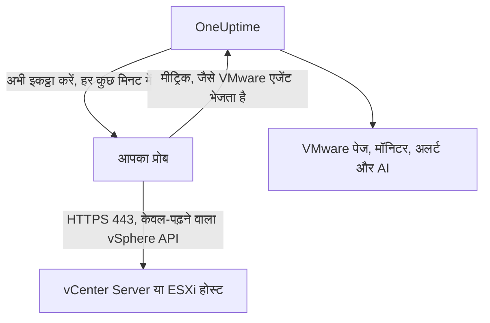

# एजेंट के बिना VMware

कुछ भी इंस्टॉल किए बिना किसी vCenter Server, या किसी स्टैंडअलोन ESXi होस्ट की निगरानी करें: OneUptime में vCenter का पता और एक केवल-पढ़ने वाला खाता दर्ज करें, वह प्रोब चुनें जो उस तक पहुँच सकता है, और प्रोब वही डेटा इकट्ठा करता है जो [VMware एजेंट](/docs/telemetry/vmware) करता। न कोई एजेंट इंस्टॉल, अपग्रेड या चालू रखना है, न उसके लिए अलग मशीन तैयार करनी है।

:::cards
- [शुरू करने से पहले](#शुरू-करने-से-पहले): vCenter तक पहुँचने वाला एक प्रोब, और एक केवल-पढ़ने वाला खाता।
- [vCenter कनेक्ट करें](#vcenter-कनेक्ट-करें): चार फ़ील्ड, एक परीक्षण और एक नाम।
- [समस्या निवारण](#समस्या-निवारण): हर संदेश का मतलब और उसे क्या ठीक करता है।
:::

## यह कैसे काम करता है

हर कुछ मिनट में प्रोब आपके सहेजे गए खाते से vCenter में लॉग इन करता है, इन्वेंटरी, परफ़ॉर्मेंस काउंटर और vSAN आँकड़े पढ़ता है, और उन्हें OneUptime को भेजता है। वे ठीक वैसे ही पहुँचते हैं जैसे VMware एजेंट के, इसलिए हर VMware पेज, [VMware मॉनिटर](/docs/monitor/vmware-monitor), अलर्ट टेम्पलेट और OneUptime AI उन्हें एक ही तरह पढ़ते हैं। प्रोब दो संग्रहों के बीच अपना vCenter सत्र बनाए रखता है, ताकि vCenter का इवेंट लॉग लॉगिन से न भर जाए।

## प्रोब या एजेंट?

| | प्रोब (यह पेज) | VMware एजेंट |
|---|---|---|
| आप क्या चलाते हैं | पहले से चल रहा कोई प्रोब, या नया प्रोब | एजेंट, अपनी अलग मशीन पर |
| खाता कहाँ रखा जाता है | OneUptime में एन्क्रिप्ट किया हुआ, केवल प्रोब को भेजा जाता है | एजेंट की `.env` फ़ाइल में |
| इसे कहाँ तक पहुँचना है | प्रोब से TCP 443 पर vCenter तक | एजेंट से TCP 443 पर vCenter तक |
| सबसे बड़ा vCenter | हर संग्रह में लगभग 48 MiB मीट्रिक | कोई सीमा नहीं |
| ESXi syslog और AI एजेंट | शामिल नहीं | शामिल |

दोनों एक जैसा डेटा भेजते हैं। आप किसी vCenter को उसके **सेटिंग्स** पेज पर कभी भी एक से दूसरे पर बदल सकते हैं।

## शुरू करने से पहले

- **TCP 443 पर vCenter तक पहुँच सकने वाला प्रोब।** आम तौर पर यह vCenter के नेटवर्क में एक [कस्टम प्रोब](/docs/probe/custom-probe) होता है। OneUptime Cloud पर साझा प्रोब को कभी vCenter पासवर्ड नहीं मिलता, इसलिए अपना खुद का प्रोब जोड़ें। सेल्फ़-होस्टेड इंस्टेंस पर इंस्टेंस के अपने प्रोब भी इकट्ठा कर सकते हैं।
- **Read-Only भूमिका वाला vSphere उपयोगकर्ता**, शीर्ष-स्तरीय vCenter ऑब्जेक्ट पर, **Propagate to children** चुने हुए। [केवल-पढ़ने वाला vSphere उपयोगकर्ता बनाएँ](/docs/telemetry/vmware#create-the-read-only-vsphere-user) के चरणों का पालन करें: यह वही खाता है जो एजेंट इस्तेमाल करता है।

> [!IMPORTANT]
> **Propagate to children** के बिना उपयोगकर्ता लॉग इन तो कर लेता है पर कुछ नहीं देखता, और प्रोब बताता है कि खाता vCenter की इन्वेंटरी नहीं पढ़ सकता।

## vCenter कनेक्ट करें

:::steps
### vCenter सूची खोलें
OneUptime में **VMware → सभी vCenter** खोलें और **vCenter कनेक्ट करें** पर क्लिक करें।

### पता और खाता दर्ज करें
वह पता दर्ज करें जिस पर आप vSphere Client खोलते हैं, जैसे `https://vcsa.example.com`, डोमेन सहित उपयोगकर्ता नाम, जैसे `oneuptime@vsphere.local`, और उसका पासवर्ड। वह प्रोब चुनें जो vCenter तक पहुँचता है।

### कनेक्शन जाँचें
अगले चरण में **कनेक्शन का परीक्षण करें** पर क्लिक करें। प्रोब लॉग इन करता है, खाता जो देख सकता है उसे पढ़ता है और लॉग आउट करता है, और परिणाम बताता है कि उसे कितने डेटासेंटर, क्लस्टर, होस्ट, वर्चुअल मशीनें और डेटास्टोर मिले।

### vCenter के प्रमाणपत्र पर भरोसा करें
vCenter डिफ़ॉल्ट रूप से अपने ही प्राधिकरण का प्रमाणपत्र इस्तेमाल करता है, जिस पर प्रोब भरोसा नहीं करता। तब परीक्षण प्रमाणपत्र दिखाता है: उसके फ़िंगरप्रिंट को vCenter के अपने फ़िंगरप्रिंट से मिलाएँ, फिर **इस प्रमाणपत्र पर भरोसा करें** पर क्लिक करें।

### नाम दें और कनेक्ट करें
डिफ़ॉल्ट नाम vCenter का होस्ट नाम होता है। सहेजने के लिए **vCenter कनेक्ट करें** पर क्लिक करें।
:::

vCenter के **अवलोकन** पर **डेटा संग्रह** कार्ड दिखता है। पहले संग्रह तक, जो एक मिनट के भीतर शुरू होता है, उस पर **जाँच हो रही है** लिखा होता है, फिर **इकट्ठा हो रहा है**, और इन्वेंटरी भर जाती है।

## प्रमाणपत्र

प्रोब प्रमाणपत्र की जाँच कभी नहीं छोड़ता। हर कनेक्शन पूरा TLS हैंडशेक करता है, और फिर:

- कोई भरोसेमंद प्रमाणपत्र सेट न हो, तो vCenter का प्रमाणपत्र ऐसे प्राधिकरण का होना चाहिए जिस पर प्रोब की मशीन भरोसा करती है, और आपके दर्ज किए पते के लिए होना चाहिए;
- कोई भरोसेमंद प्रमाणपत्र सेट हो, तो vCenter को ठीक वही प्रमाणपत्र दिखाना होगा, जिसकी पहचान उसके SHA-256 फ़िंगरप्रिंट से होती है। इसके अलावा कुछ भी स्वीकार नहीं होता, सार्वजनिक रूप से भरोसेमंद प्रमाणपत्र भी नहीं।

फ़िंगरप्रिंट जाँचने के लिए vSphere Client में **Administration → Certificates → Certificate Management** खोलें, या प्रोब की मशीन पर `openssl s_client -connect vcsa.example.com:443 </dev/null | openssl x509 -noout -fingerprint -sha256` चलाएँ।

जब vCenter का प्रमाणपत्र नवीनीकृत होता है, तो संग्रह **vCenter का प्रमाणपत्र बदल गया है** के साथ रुक जाता है और नया प्रमाणपत्र दिखाया जाता है। जब तक आप vCenter के **अवलोकन** या **सेटिंग्स** पेज पर उस पर भरोसा नहीं करते, vCenter को कुछ नहीं भेजा जाता।

## सहेजा गया पासवर्ड

पासवर्ड एन्क्रिप्ट किया हुआ और केवल-लिखने योग्य है: कोई उसे वापस नहीं पढ़ सकता, और API उसे कभी नहीं लौटाता। उसे केवल उस प्रोब को भेजा जाता है जो vCenter इकट्ठा करता है, और प्रोब उसे मेमोरी में रखता है।

सहेजा गया पासवर्ड केवल उसी पते पर, उसी प्रोब के ज़रिए और उसी प्रमाणपत्र को भेजा जाता है जिसके लिए उसे दर्ज किया गया था। पता, प्रोब या भरोसेमंद प्रमाणपत्र बदलने पर पासवर्ड फिर से माँगा जाता है, इसलिए vCenter को संपादित कर सकने वाला कोई भी व्यक्ति उसे कहीं और नहीं भेज सकता। सहेजे गए पते पर प्रोब को मिले प्रमाणपत्र पर भरोसा करने से पासवर्ड बना रहता है।

## एजेंट और प्रोब के बीच बदलें

vCenter का **सेटिंग्स** पेज खोलें। उसका **डेटा संग्रह** कार्ड उस vCenter के लिए **प्रोब से इकट्ठा करें** देता है जिसे एजेंट भेजता है, और उस vCenter के लिए **VMware एजेंट का उपयोग करें** देता है जिसे कोई प्रोब इकट्ठा करता है। एजेंट पर बदलने से सहेजा गया पासवर्ड भुला दिया जाता है।

> [!WARNING]
> प्रोब का पहला संग्रह सफल होते ही VMware एजेंट बंद कर दें। जब तक दोनों चलते हैं, हर मीट्रिक दो बार आता है।

## संदर्भ

| सेटिंग | डिफ़ॉल्ट | टिप्पणियाँ |
|---|---|---|
| संग्रह अंतराल | 2 मिनट | 1 से 60 मिनट। बड़े vCenter पर कम भार डालने के लिए उसे कम बार इकट्ठा करें। |
| एक साथ संग्रह | हर प्रोब पर 4 | अपने अंतराल से धीमा संग्रह छोड़ दिया जाता है, कभी जमा नहीं होता। |
| सबसे बड़ा संग्रह | लगभग 48 MiB | इससे बड़े vCenter के लिए VMware एजेंट चाहिए। |
| कनेक्शन परीक्षण | शुरू होने के लिए 90 सेकंड | जिस परीक्षण को कोई प्रोब समय पर नहीं उठाता, या जो 2 मिनट से ज़्यादा चलता है, उसे विफल माना जाता है। |

## समस्या निवारण

:::details vCenter का प्रमाणपत्र भरोसेमंद नहीं है
vCenter अपने ही प्राधिकरण का प्रमाणपत्र दिखाता है। दिखाए गए फ़िंगरप्रिंट को vCenter के प्रमाणपत्र से मिलाएँ, फिर **इस प्रमाणपत्र पर भरोसा करें** पर क्लिक करें।
:::

:::details vCenter ने लॉगिन अस्वीकार कर दिया
डोमेन सहित पूरा उपयोगकर्ता नाम इस्तेमाल करें, जैसे `oneuptime@vsphere.local`, और पासवर्ड जाँचें, और यह भी कि खाता लॉक न हो। इन्हें vCenter के **सेटिंग्स** पेज पर **कनेक्शन संपादित करें** से बदलें।
:::

:::details उपयोगकर्ता vCenter की इन्वेंटरी नहीं पढ़ सकता
उपयोगकर्ता को शीर्ष-स्तरीय vCenter ऑब्जेक्ट पर Read-Only भूमिका दें, **Propagate to children** चुने हुए।
:::

:::details प्रोब को vCenter से कोई जवाब नहीं मिल रहा
प्रोब का नेटवर्क TCP 443 पर vCenter तक नहीं पहुँच पा रहा। फ़ायरवॉल में यह ट्रैफ़िक अनुमति दें, या vCenter के नेटवर्क में कोई प्रोब चुनें।
:::

:::details प्रोब ने इसे नहीं उठाया
प्रोब ऑफ़लाइन है, या VMware संग्रह से पुराना OneUptime संस्करण चला रहा है। **कस्टम प्रोब** तालिका में जाँचें कि वह कनेक्ट है, और उसे अपडेट करें।
:::

:::details यह vCenter प्रोब से इकट्ठा करने के लिए बहुत बड़ा है
इसके मीट्रिक एक प्रोब अपलोड की सीमा से बड़े हैं। इस vCenter के लिए [VMware एजेंट](/docs/telemetry/vmware) का उपयोग करें।
:::

## अगले कदम

:::cards
- [VMware मॉनिटर](/docs/monitor/vmware-monitor): होस्ट, वर्चुअल मशीनों, डेटास्टोर और क्लस्टर पर अलर्ट।
- [कस्टम प्रोब](/docs/probe/custom-probe): vCenter के नेटवर्क में एक प्रोब चलाएँ।
- [VMware एजेंट](/docs/telemetry/vmware): इसके बजाय एजेंट से vCenter इकट्ठा करें।
:::
