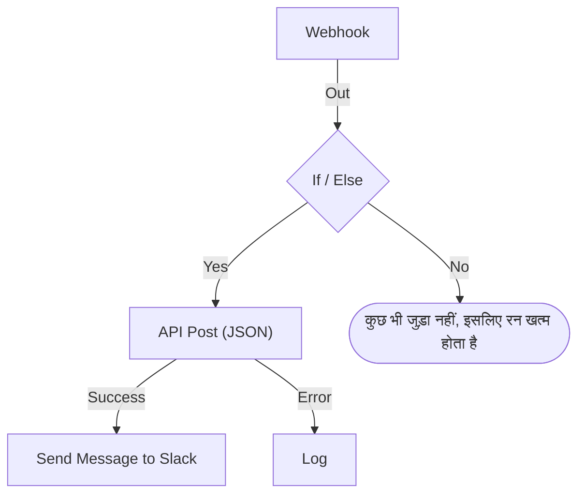

# वर्कफ़्लो बनाना

आप किसी वर्कफ़्लो को उसके **बिल्डर** में बनाते हैं: एक कैनवास जहाँ आप ब्लॉक जोड़ते हैं, उन्हें कनेक्ट करते हैं और उनकी सेटिंग्स भरते हैं। यह पेज बताता है कि वर्कफ़्लो कैसे बनाएं, [ब्लॉक कैसे जोड़ें](#ब्लॉक-जोड़ना), उन्हें कैसे [कनेक्ट](#ब्लॉक-कनेक्ट-करना) और [कॉन्फ़िगर](#ब्लॉक-कॉन्फ़िगर-करना) करें, [उनके बीच मान कैसे भेजें](#पिछले-ब्लॉक-के-मान-इस्तेमाल-करना) और [वर्कफ़्लो को कैसे चालू करें](#इसे-चालू-करना)।

वर्कफ़्लो बनाने के लिए **वर्कफ़्लो** खोलें और **वर्कफ़्लो बनाएं** पर क्लिक करें। **एक वर्कफ़्लो बनाएं** डायलॉग पहले पूछता है कि आप कैसे शुरू करना चाहते हैं, फिर नाम पूछता है। जिस टेम्पलेट को अपनी सेटिंग्स चाहिए, जैसे Slack वेबहुक URL, वह उन्हें एक अतिरिक्त चरण में पूछता है और उन्हें वर्कफ़्लो वेरिएबल के रूप में सहेजता है, ताकि आप बाद में वर्कफ़्लो संपादित किए बिना उन्हें बदल सकें।

चुनें कि कैसे शुरू करना है:

- डायलॉग में सबसे ऊपर **शुरू से बनाएं** आपको एक खाली कैनवास देता है। ज़्यादातर वर्कफ़्लो यहीं से शुरू होते हैं।
- **या किसी टेम्पलेट से शुरू करें** कुछ **सुझाए गए** टेम्पलेट दिखाता है। बाकी के लिए, खोज बॉक्स के बगल में कोई श्रेणी चुनें, जैसे **घटनाएं**, **मॉनिटर** या **Jira**, या **सभी टेम्पलेट**, या **टेम्पलेट खोजें…** में टाइप करें। आपका टाइप किया हर शब्द मेल खाना चाहिए।

किसी टेम्पलेट पर क्लिक करके देखें कि वह क्या करता है: उसका ट्रिगर, वह किन ब्लॉक से बना है, और वह कौन-सी सेटिंग्स पूछेगा। फिर **यह टेम्पलेट इस्तेमाल करें** पर क्लिक करें, या टेम्पलेट पर डबल-क्लिक करें। खोज बॉक्स में ऐरो कुंजियाँ टेम्पलेट चुनती हैं, और **Enter** उसे इस्तेमाल करता है। `/` आपको वापस खोज बॉक्स पर ले आता है।

वर्कफ़्लो बंद अवस्था में बनते हैं, इसलिए जब तक आप उन्हें चालू न करें, कुछ नहीं चलता। नया वर्कफ़्लो **बिल्डर** में खुलता है, वह कैनवास जहाँ आप उसे डिज़ाइन करते हैं।

## कैनवास

शुरू से बना वर्कफ़्लो एक अकेले डैश वाले ब्लॉक के साथ खुलता है, जिस पर **Choose what starts this workflow** लिखा होता है। यही ब्लॉक शुरुआती बिंदु है — ट्रिगर चुनने के लिए उस पर क्लिक करें। टेम्पलेट से बना वर्कफ़्लो अपने ब्लॉक पहले से अपनी जगह पर रखे हुए खुलता है।

हर वर्कफ़्लो में सबसे ऊपर ठीक एक **ट्रिगर** होता है। बाकी सब कुछ ऐसा **घटक** है जो कोई काम करता है। ट्रिगर बदलने के लिए उसे हटाएं: डैश वाला प्लेसहोल्डर उसकी जगह वापस आ जाता है, और उस पर क्लिक करके आप दूसरा चुन सकते हैं। किसी ब्लॉक को हटाने पर उसकी रेखाएं भी हट जाती हैं, इसलिए नए ट्रिगर को पहले ब्लॉक से फिर से कनेक्ट करें।

बदलाव अपने-आप सहेजे जाते हैं। टूलबार में एक पिल इस पर नज़र रखती है: बदलाव जाते समय **सहेजा जा रहा है…** , फिर **सहेजा गया**, या अगर सहेजना न हो पाए तो **सहेजा नहीं जा सका**। कैनवास पर कोई सहेजें बटन और कोई अलग प्रकाशन चरण नहीं है।

## ब्लॉक जोड़ना

| जोड़ने के लिए          | क्लिक करें                                                     | खुलने वाला पैनल               |
| ---------------------- | -------------------------------------------------------------- | ----------------------------- |
| ट्रिगर                 | डैश वाला प्लेसहोल्डर ब्लॉक                                     | **Add Trigger**               |
| कोई भी दूसरा ब्लॉक     | कैनवास के ऊपर टूलबार में **घटक जोड़ें**                        | **घटक जोड़ें**                |

दोनों पैनल **Popular** के अंतर्गत उन ब्लॉक पर खुलते हैं जिन्हें ज़्यादातर वर्कफ़्लो इस्तेमाल करते हैं, उसके बाद बाकी बिल्ट-इन ब्लॉक आते हैं। **OneUptime resources** के अंतर्गत **घटना** जैसे किसी संसाधन पर क्लिक करके देखें कि उससे आप क्या कर सकते हैं; **Browse all resources** उन सबको दिखाता है। या खोजें: कुछ शब्द टाइप करें, जैसे `create incident`, और सबसे अच्छा मेल पहले आता है। खोज बॉक्स पर जाने के लिए `/` दबाएं, नतीजों में चलने के लिए ऐरो कुंजियाँ, और हाइलाइट किया गया ब्लॉक जोड़ने के लिए **Enter**। किसी ब्लॉक पर क्लिक करने से भी वह जुड़ जाता है।

नया ब्लॉक कैनवास के सबसे नीचे वाले ब्लॉक के नीचे आता है, और नया ट्रिगर सबसे ऊपर डैश वाले ब्लॉक की जगह लेता है। नया ब्लॉक चुना हुआ रहता है, और अगर वह दिखने वाले हिस्से से बाहर पड़ता है, तो कैनवास उतना ही स्क्रॉल होता है जितना उसे दिखाने के लिए ज़रूरी हो। उसकी सेटिंग्स अपने-आप नहीं खुलतीं: जब आप उसे कॉन्फ़िगर करने को तैयार हों, तब ब्लॉक पर क्लिक करें। जब तक उसकी ज़रूरी सेटिंग्स नहीं भरी जातीं, उस पर **Click to set up** लिखा रहता है।

ब्लॉक को जहाँ चाहें खींचें; खींचते समय कैनवास उन्हें ग्रिड पर बिठा देता है। ब्लॉक की जगहें सहेजी जाती हैं, इसलिए अगला व्यक्ति वही लेआउट देखता है जो आपने छोड़ा था।

## ब्लॉक पर क्या होता है

| फ़ील्ड                                | यह क्या करता है                                                                                                                                                                                                                                                                                               |
| ------------------------------------- | ------------------------------------------------------------------------------------------------------------------------------------------------------------------------------------------------------------------------------------------------------------------------------------------------------------- |
| **Identifier** (**ID** के अंतर्गत)    | ब्लॉक पर दिखने वाला छोटा ID, जैसे `log-1`। दूसरे ब्लॉक इसी से इस ब्लॉक का संदर्भ देते हैं, इसलिए इसका नाम बदलने पर इसकी ओर इशारा करने वाले सभी `{{local.components.…}}` संदर्भ टूट जाते हैं। ब्लॉक का शीर्षक घटक का अपना नाम है और बदला नहीं जा सकता।                                       |
| **सेटिंग्स**                          | वह जो ब्लॉक को अपना काम करने के लिए चाहिए — कोई URL, कोई Slack चैनल, कोई संदेश टेक्स्ट। वैकल्पिक फ़ील्ड पर **(वैकल्पिक)** लिखा होता है; बाकी सब ज़रूरी है। ऑन/ऑफ़ स्विच पर दोनों में से कुछ नहीं लिखा होता, क्योंकि उसका हमेशा कोई मान होता है। कम इस्तेमाल होने वाली सेटिंग्स **और फ़ील्ड** के अंतर्गत सिकुड़ी रहती हैं, जिसके शीर्षक में उनके नाम और भरी हुई सेटिंग्स दिखती हैं। |
| **Input**                             | ऊपरी किनारे का बिंदु, जहाँ पिछले ब्लॉक से आने वाली रेखाएं जुड़ती हैं। ट्रिगर में यह नहीं होता — उनसे पहले कुछ नहीं चलता।                                                                                                                                                                                    |
| **Outputs**                           | निचले किनारे पर लगे बिंदु, जिनके ठीक ऊपर लेबल होते हैं, जहाँ से रेखाएं अगले ब्लॉक तक जाती हैं। कई ब्लॉक में अलग **Success** और **Error** आउटपुट होते हैं, ताकि आप दोनों स्थितियाँ संभाल सकें।                                                                                                     |

## ब्लॉक कनेक्ट करना

एक ब्लॉक के नीचे वाले बिंदु से अगले ब्लॉक के ऊपर वाले बिंदु तक खींचें। आप जो रेखा खींचते हैं, वही तय करती है कि आगे क्या चलेगा।

- **Success** से कनेक्ट करें, तो अगला ब्लॉक सिर्फ़ तब चलता है जब पिछला सफल रहा हो।
- **Error** से कनेक्ट करें, तो अगला ब्लॉक सिर्फ़ तब चलता है जब पिछला विफल रहा हो।
- किसी आउटपुट को कनेक्ट न करें, तो वह रास्ता बस रुक जाता है।

आप एक आउटपुट को कई ब्लॉक से कनेक्ट कर सकते हैं। वे सभी चलते हैं — लेकिन एक के बाद एक, एक ही कतार में, समानांतर नहीं। शाखाओं के बीच के क्रम पर भरोसा न करें, और न ही यह मानें कि वे समय में एक-दूसरे पर चढ़ेंगी।

हर ब्लॉक एक रन में अधिकतम एक बार चलता है। ऐसी रेखा जो पहले से चल चुके ब्लॉक तक जाती है — कैनवास पर वापस ऊपर, या किसी दूसरी शाखा से जब पहली शाखा वहाँ पहुँच चुकी हो — रन को एक त्रुटि के साथ रोक देती है, ताकि वर्कफ़्लो चक्कर में न फँसे।

## ब्लॉक कॉन्फ़िगर करना

किसी ब्लॉक की सेटिंग्स एक डायलॉग में खोलने के लिए उस पर क्लिक करें, या **Tab** से उस तक जाएं और **Enter** दबाएं। सेटिंग्स भरें और **सहेजें** पर क्लिक करें।

हर सेटिंग में वही इनपुट होता है जो उसके मान को चाहिए:

| सेटिंग में क्या है                               | आपको मिलता है                                                                  |
| ------------------------------------------------ | ------------------------------------------------------------------------------ |
| शब्द: कोई संदेश, कोई प्रॉम्प्ट, लॉग करने वाला मान | ऐसा फ़ील्ड जो टाइप करते-करते बढ़ता है। **Enter** नई पंक्ति शुरू करता है।      |
| छोटा मान: कोई URL, कोई ID, कोई विषय पंक्ति       | एक पंक्ति।                                                                     |
| कोड या HTML                                      | कोड एडिटर।                                                                     |
| JSON                                             | JSON एडिटर।                                                                    |
| ऑन या ऑफ़                                        | बगल में नाम वाला एक स्विच। बदलने के लिए स्विच या नाम पर क्लिक करें।             |

डायलॉग उसी चीज़ पर खुलता है जिसके लिए आप शायद आए हैं। **वेबहुक** ट्रिगर के लिए यह उसका URL है, **URL कॉपी करें** बटन, वह किन तरीकों को स्वीकार करता है, और एक नमूना अनुरोध। **Manual** ट्रिगर के लिए यह है कि वर्कफ़्लो कैसे शुरू होता है। कोई भी दूसरा ब्लॉक अपनी सेटिंग्स पर खुलता है। जिस ब्लॉक में कोई सेटिंग नहीं, उसमें **सेटिंग्स** खंड होता ही नहीं।

उसके नीचे, ऊपर से नीचे:

- **ID**, **Inputs** और **Outputs**, साथ-साथ — ब्लॉक का पहचानकर्ता, उस तक कहाँ से पहुँचा जाता है, और उसके बाद क्या चलता है।
- **Returns** — वह डेटा जो यह ब्लॉक बाद के चरणों को देता है। हर मान उसे पढ़ने वाला सटीक संदर्भ दिखाता है, उसे कॉपी करने के बटन के साथ।
- **How to use** — ब्लॉक क्या करता है, एक वाक्य में, उसे सेट अप करने के चरण, कॉपी करने लायक उदाहरण, और लोगों की आम गलतियाँ। उदाहरण आपके वर्कफ़्लो से बनता है: जहाँ वह किसी संदेश में डेटा डालता है, वहाँ इस ब्लॉक का ID और ट्रिगर के मान इस्तेमाल करता है। **Learn more** लंबी व्याख्या खोलता है, और लिंक पूरी गाइड तक ले जाते हैं। हर ब्लॉक में यह होता है, और डायलॉग में सबसे ऊपर **How to use** बटन सीधे यहाँ ले आता है।

नीचे ये होते हैं:

- **हटाएं** — यह ब्लॉक हटाता है। यह पहले पूछता है और ब्लॉक को उसके प्रकार और पहचानकर्ता से बताता है, जैसे **Send Email (send-email-2)** , ताकि आपको पता रहे कि कई एक जैसे ब्लॉक में से कौन-सा जा रहा है।
- **Run just this step** — बाकी वर्कफ़्लो के बिना सिर्फ़ यही एक ब्लॉक चलाता है। जो मान यह दूसरे चरणों से पढ़ता, वे खाली पहुँचते हैं, और जो कुछ यह भेजता, लिखता या हटाता है, वह सचमुच होता है। यह ब्लॉक से पहले की सभी शर्तें छोड़ देता है, इसलिए इसे सिर्फ़ वही लोग इस्तेमाल कर सकते हैं जिन्हें वर्कफ़्लो संपादित करने की अनुमति है।

### पिछले ब्लॉक के मान इस्तेमाल करना

ज़्यादातर सेटिंग्स किसी पिछले ब्लॉक का मान या कोई वेरिएबल इस्तेमाल कर सकती हैं — इसी तरह डेटा एक ब्लॉक से अगले तक बहता है। ऐसी हर सेटिंग के अंत में एक **{ }** बटन होता है। यह उन मानों की सूची खोलता है जिन्हें आप इस्तेमाल कर सकते हैं: हर पिछला ब्लॉक अपने नाम से, उसके लौटाए हर मान के साथ — उसका नाम, उसमें क्या है और उसका प्रकार — फिर आपके वर्कफ़्लो के वेरिएबल और आपके ग्लोबल वेरिएबल। सूची में खोजें, माउस से या ऐरो कुंजियों और **Enter** से कोई एक चुनें, और मान वहीं डल जाता है जहाँ आपका कर्सर है।

सेटिंग में कोई मान एक चिप के रूप में दिखता है, जैसे **Webhook › Request Body**। उस पर पॉइंटर ले जाएं तो वह संदर्भ दिखता है जिसका यह प्रतिनिधित्व करता है, `{{local.components.webhook-1.returnValues.request-body}}`, जो कि सहेजा जाता है। कर्सर एक ही बार में चिप को पार करता है, **Backspace** उसे पूरा हटा देता है, और उसे कॉपी करने पर संदर्भ कॉपी होता है। अगर आपको सिंटैक्स आता है, तो इसके बजाय `{{` टाइप करें: वही सूची सेटिंग के नीचे खुलती है और टाइप करते-करते छोटी होती जाती है।

- **सिर्फ़ वही मान दिए जाते हैं जो मौजूद होंगे।** यानी ट्रिगर और वे ब्लॉक जो इससे पहले चलते हैं। बाद में चलने वाले ब्लॉक का अभी कोई आउटपुट नहीं होता। जब तक कोई ब्लॉक कनेक्ट नहीं होता, सिर्फ़ ट्रिगर के मान दिखते हैं, और सूची यह बताती है।
- **रिकॉर्ड अपने फ़ील्ड पर खुलता है।** कोई Find One या On Create ब्लॉक पूरा रिकॉर्ड लौटाता है। उसके फ़ील्ड देखने के लिए उसे चुनें, जिनमें वे पहले आते हैं जिन्हें ब्लॉक का **Select Fields** पढ़ता है। कोई JSON मान या हेडर का सेट एक ऐसे फ़ील्ड पर खुलता है जहाँ आप पथ टाइप करते हैं, जैसे `title` या `alerts[0].status`।
- **जब कोई ब्लॉक एक बार चल चुका होता है, तो सूची जानती है कि उसके मानों में क्या है।** हर मान बताता है कि पिछले रन में उसमें क्या था — `"production"` या `3 fields` — और कोई JSON मान या हेडर का सेट उन फ़ील्ड पर खुलता है जो उसमें थे, हर एक अपनी सामग्री के साथ। इसलिए किसी वेबहुक के **Request Body** से आप पथ टाइप करने के बजाय **incident.title** चुनते हैं। खोज भी ये फ़ील्ड ढूँढती है: `title` टाइप करें, या `{{` और किसी पथ की शुरुआत। रिकॉर्ड के फ़ील्ड भी दिखाते हैं कि उनमें क्या था। फ़ील्ड पिछले रन से आते हैं, इसलिए जो फ़ील्ड बाद का कोई अनुरोध छोड़ देता है, वह उस रन में खाली होता है। जो मान सीक्रेट जैसा दिखता है, जैसे `Authorization` हेडर, कोई टोकन या पासवर्ड, वह बिना अपनी सामग्री के दिखता है।
- **जिस वेबहुक को अभी तक कोई अनुरोध नहीं मिला, वह ऐसा बताता है** अपने मानों में सबसे ऊपर, **Copy test request** के साथ: एक `curl` कमांड जो वर्कफ़्लो के वेबहुक URL पर `{"message": "Hello"}` भेजती है। सूची खुली रहते हुए इसे टर्मिनल में चलाएं, और जैसे ही इससे शुरू हुआ रन खत्म होता है, आम तौर पर कुछ सेकंड में, अनुरोध के फ़ील्ड सूची में आ जाते हैं। वर्कफ़्लो सक्षम होना चाहिए, वरना अनुरोध अस्वीकार हो जाता है। यह बटन सिर्फ़ उन्हें मिलता है जिन्हें वेबहुक URL देखने की अनुमति है। जिस Incoming Email ट्रिगर को अभी तक कोई ईमेल नहीं मिला, वह उसी जगह यह बताता है; उसके पते पर एक ईमेल भेजें, और उसके हेडर और अटैचमेंट इसी तरह दिखने लगते हैं।
- **कोड एडिटर के टूलबार में Insert value होता है।** JSON में यह वे उद्धरण चिह्न जोड़ता है जो किसी दस्तावेज़ के अंदर मान को चाहिए। **Run Custom JavaScript** अपने **Arguments** के ज़रिए मान पढ़ता है, इसलिए उसके कोड में कोई पिकर नहीं है।
- **संख्याएँ, पासवर्ड, स्विच और तारीखें अपना कंट्रोल बनाए रखती हैं,** जिसके बगल में **{ }** होता है। चुना गया मान कंट्रोल की जगह ले लेता है, और **abc** वापस टाइपिंग पर ले जाता है।

जब कोई चिप जिस चीज़ को पढ़ती है वह मौजूद न हो, तो चिप नारंगी हो जाती है: ऐसा ब्लॉक जिसका नाम बदल दिया गया या जिसे हटा दिया गया, ऐसा मान जो ब्लॉक नहीं लौटाता, ऐसा ब्लॉक जो बाद में चलता है, या ऐसा वेरिएबल जो मौजूद नहीं है। उसका टूलटिप बताता है कि कौन-सी बात है। संदर्भ सिंटैक्स के लिए देखें [वेरिएबल](/docs/workflows/variables)।

## बनाते समय जाँच

हर बार जब आप ग्राफ़ बदलते हैं, बिल्डर पूरे ग्राफ़ की जाँच करता है और टूलबार की एक पिल में जो पाता है वह बताता है। पिल पर क्लिक करके **Problems with this workflow** खोलें, जो हर समस्या की सूची देता है और आपको संबंधित ब्लॉक तक ले जाता है। कैनवास पर, जिस ब्लॉक की ज़रूरी सेटिंग्स अभी खाली हैं उस पर **Click to set up** लिखा होता है, और किसी दूसरी समस्या वाले ब्लॉक के कोने पर एक बैज होता है: त्रुटि के लिए लाल, चेतावनी के लिए नारंगी। क्या गलत है यह पढ़ने के लिए बैज पर पॉइंटर ले जाएं।

यह वे गलतियाँ पकड़ता है जो रन गलत होने तक वरना दिखती ही नहीं:

- बिना ट्रिगर वाला वर्कफ़्लो;
- एक ही ID वाले दो ब्लॉक, या ऐसा ID जिसमें बिंदु हो;
- ऐसा ब्लॉक जिससे कुछ भी जुड़ा नहीं;
- खाली छोड़ी गई ज़रूरी सेटिंग;
- अमान्य JSON;
- `{{ }}` के अंदर स्पेस;
- ऐसे चरण या लौटाए गए मान के संदर्भ जो मौजूद नहीं।

एक चीज़ यह जाँच नहीं सकता: कोई वेरिएबल नाम मौजूद है या नहीं। ब्लॉक की सेटिंग्स यह कर सकती हैं — ऐसे वेरिएबल का संदर्भ जो मौजूद नहीं, वहाँ नारंगी चिप के रूप में दिखता है। बाकी हर जगह, नाम बदला गया वेरिएबल पहली बार रन के लॉग में ही सामने आता है।

## आपका पहला वर्कफ़्लो

कैनवास को जानने का सबसे तेज़ तरीका दो ब्लॉक वाला एक वर्कफ़्लो है जिसे आप हाथ से शुरू करते हैं:

:::steps
1. डैश वाले प्लेसहोल्डर ब्लॉक पर क्लिक करें, फिर **Add Trigger** पैनल में **Manual** पर क्लिक करें।
2. **घटक जोड़ें** पर क्लिक करें, फिर **Popular** के अंतर्गत **लॉग** पर क्लिक करें। नया ब्लॉक ट्रिगर के नीचे आता है। ट्रिगर के **Execute** बिंदु को नीचे Log ब्लॉक के इनपुट बिंदु से कनेक्ट करें।
3. Log ब्लॉक पर क्लिक करें, जिस पर **Click to set up** लिखा है, और उसके **Value** में `Hello from ` टाइप करें। **{ }** पर क्लिक करें, फिर **Manual** के अंतर्गत **JSON** पर क्लिक करें। सेटिंग **Manual › JSON** दिखाती है और `{{local.components.manual-1.returnValues.value}}` सहेजती है। `manual-1` ट्रिगर का **Identifier** है, जो ट्रिगर ब्लॉक पर दिखता है। **सहेजें** पर क्लिक करें।
4. बिल्डर में सबसे ऊपर **सक्षम** चालू करें। अक्षम वर्कफ़्लो बिल्कुल नहीं चल सकता, हाथ से भी नहीं; अगर आप यह छोड़ देते हैं, तो **वर्कफ़्लो चलाएं** पहले इसे चालू करने को कहता है।
5. वापस **बिल्डर** में, **वर्कफ़्लो चलाएं** पर क्लिक करें, **JSON** फ़ील्ड में `{ "name": "Ada" }` टाइप करें, **Run Workflow Manually** पर क्लिक करें, और **Run** से पुष्टि करें।
6. एक **वर्कफ़्लो रन** पैनल अपने-आप खुलता है और रन का अनुसरण करता है। लॉग `Value:` दिखाता है, जिसके बाद `Hello from { "name": "Ada" }` आता है।
:::

यही चक्र — जोड़ें, कनेक्ट करें, कॉन्फ़िगर करें, चलाएं, लॉग पढ़ें — हर वर्कफ़्लो बनाने का तरीका है।

> [!TIP]
> **वर्कफ़्लो चलाएं** में टाइप किया गया JSON, Manual ट्रिगर तक उसी टेक्स्ट के रूप में पहुँचता है जो आपने टाइप किया। उसमें से कोई फ़ील्ड, जैसे `name`, पढ़ने के लिए एक **Text to JSON** ब्लॉक जोड़ें, ट्रिगर का **JSON** उसके **Text** में डालें, और फ़ील्ड को उस ब्लॉक के **JSON** से पढ़ें: `{{local.components.text-to-json-1.returnValues.json.name}}`।

## इसे चालू करना

नए वर्कफ़्लो अक्षम अवस्था में शुरू होते हैं, और आपके द्वारा प्रतिलिपि बनाया या आयात किया गया हर वर्कफ़्लो भी। जब तक कोई वर्कफ़्लो बंद है, बिल्डर कैनवास के ऊपर यह बताता है, एक **वर्कफ़्लो चालू करें** बटन के साथ।

**सक्षम** स्विच **बिल्डर** में सबसे ऊपर है, **घटक जोड़ें** और **वर्कफ़्लो चलाएं** के बगल में। यह वर्कफ़्लो के **अवलोकन** पेज पर भी है, जिसका **वर्कफ़्लो विवरण** कार्ड मौजूदा स्थिति को हरे **सक्षम** पिल या लाल **अक्षम** पिल के रूप में दिखाता है: **वर्कफ़्लो संपादित करें** पर क्लिक करें और **और फ़ील्ड** खोलें। सिर्फ़ वही लोग इसे चालू या बंद कर सकते हैं जिन्हें वर्कफ़्लो संपादित करने की अनुमति है; बाकी सबको स्विच धुंधला दिखता है।

अक्षम वर्कफ़्लो बिल्कुल नहीं चल सकता, चाहे उसे कैसे भी शुरू किया जाए:

| किससे शुरू हुआ                                             | जब वर्कफ़्लो बंद है                                                                                                                                                                       |
| ---------------------------------------------------------- | ----------------------------------------------------------------------------------------------------------------------------------------------------------------------------------------- |
| उसका ट्रिगर: कोई अनुसूची, कोई OneUptime इवेंट या कोई ईमेल  | अनदेखा कर दिया जाता है।                                                                                                                                                                   |
| **वर्कफ़्लो चलाएं** या **Run just this step**              | बिल्डर इसके बजाय पूछता है **यह वर्कफ़्लो चालू करें?** । **चालू करें और चलाएं** (या **चालू करें और चरण चलाएं**) वर्कफ़्लो को चालू करता है, फिर आपके दिए मानों के साथ वही चलाता है जो आपने माँगा था। |
| उसके वेबहुक URL पर कॉल                                     | HTTP 400 और "This workflow is turned off, so it can't run. Turn it on with the Enabled switch at the top of its Builder, then try again." के साथ अस्वीकार।                                 |
| किसी दूसरे वर्कफ़्लो का **Execute Workflow** ब्लॉक         | वह ब्लॉक अपना **Error** रास्ता लेता है, और त्रुटि उस वर्कफ़्लो का नाम बताती है जिसे उसने कॉल किया था।                                                                                     |

तो क्रम यह है: इसे बनाएं, **वर्कफ़्लो चलाएं** से परखें, रन का लॉग पढ़ें, और अगर आप इसके ट्रिगर के चलने के लिए तैयार नहीं हैं तो **सक्षम** फिर से बंद कर दें। पूरा वर्कफ़्लो चलाए बिना सिर्फ़ एक ब्लॉक परखने के लिए, उस ब्लॉक की सेटिंग्स में **Run just this step** इस्तेमाल करें।

किसी वर्कफ़्लो को हटाए बिना रोकने के लिए **सक्षम** बंद करें। कोई नया रन शुरू नहीं होता। चल रहा रन पूरा होता है, लेकिन जो **Sleep** ब्लॉक पर रुका है, वह जागने पर रद्द हो जाता है और त्रुटि के रूप में दर्ज होता है।

## साफ़-सफ़ाई

- ब्लॉक को खिसकाने के लिए उन्हें खींचें। लेआउट सहेजा जाता है।
- कोई रेखा हटाने के लिए उसका एक सिरा बिंदु से दूर खींचें और कैनवास की किसी खाली जगह पर छोड़ दें।
- कोई ब्लॉक हटाने के लिए उस पर क्लिक करें और उसके सेटिंग्स डायलॉग में सबसे नीचे **हटाएं** इस्तेमाल करें। किसी ब्लॉक या रेखा को चुनकर Backspace दबाने से भी वह हट जाती है।
- किसी अकेले ब्लॉक की प्रतिलिपि बनाने का कोई तरीका नहीं है। वर्कफ़्लो के **सेटिंग्स** पेज पर **वर्कफ़्लो की प्रतिलिपि बनाएँ** पूरी चीज़ कॉपी करता है। प्रतिलिपि का नाम पहले से भरा होता है, प्रोजेक्ट के वर्कफ़्लो के बाद वाले क्रमांक के साथ ("Nightly Sync" की प्रतिलिपि "Nightly Sync 2" बनती है), और प्रतिलिपि अक्षम अवस्था में खुलती है।
- ब्लॉक ऊपर से नीचे रखें ताकि वे उसी दिशा में पढ़े जाएं जिसमें वे चलते हैं — इनपुट ऊपरी किनारे पर है, आउटपुट निचले पर, इसलिए प्रवाह स्वाभाविक रूप से नीचे जाता है।

## अगले कदम

:::cards
- [ट्रिगर](/docs/workflows/triggers): वर्कफ़्लो शुरू होने के पाँच तरीके।
- [घटक](/docs/workflows/components): हर वह ब्लॉक जिसे आप जोड़ सकते हैं, उसकी सेटिंग्स और आउटपुट के साथ।
- [वेरिएबल](/docs/workflows/variables): ब्लॉक के बीच डेटा भेजें, और सीक्रेट को उनसे बाहर रखें।
- [रन](/docs/workflows/runs-and-logs): जाँचें कि हर रन ने चरण-दर-चरण क्या किया।
:::
