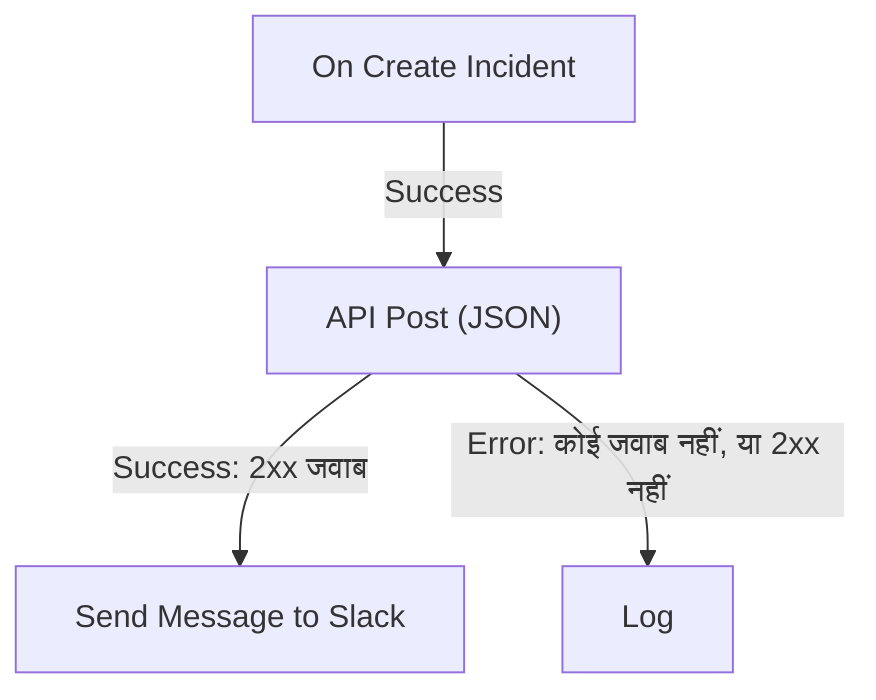

# वर्कफ़्लो घटक

घटक वे ब्लॉक हैं जिन्हें आप ट्रिगर के बाद जोड़ते हैं। हर एक कोई एक काम करता है — संदेश भेजना, कोई API कॉल करना, कोई शर्त जाँचना, कोई OneUptime रिकॉर्ड बदलना — और फिर अपने किसी एक आउटपुट को चुनकर उससे जुड़े ब्लॉक तक जाता है। यह पेज सूची है: हर ब्लॉक को क्या चाहिए, वह क्या लौटाता है, और वह कौन-सा आउटपुट कब चुनता है।

बनाते समय आपको इसे खुला रखने की ज़रूरत कम ही पड़ती है। हर ब्लॉक की सेटिंग्स के अंत में **How to use** होता है: ब्लॉक क्या करता है, उसे सेट अप करने के चरण, आपके अपने वर्कफ़्लो से बना एक उदाहरण, और लोगों की आम गलतियाँ। ब्लॉक जोड़ने और कनेक्ट करने के लिए देखें [वर्कफ़्लो बनाना](/docs/workflows/authoring)।

:::cards
- [संदेश भेजें](#slack): Slack, Microsoft Teams, Discord, Telegram, IRC और ईमेल।
- [कोई API कॉल करें](#api): किसी भी HTTP API को अनुरोध भेजें और जवाब पढ़ें।
- [लॉजिक जोड़ें](#conditions): किसी मान पर शाखा बनाएं, डेटा का रूप बदलें, इंतज़ार करें या लॉग करें।
- [OneUptime रिकॉर्ड के साथ काम करें](#oneuptime-डेटा-घटक): मॉनिटर, घटनाएँ और बहुत कुछ ढूँढें, बनाएं, अपडेट करें और हटाएं।
:::

## मुझे कौन-सा घटक इस्तेमाल करना चाहिए?

| किसलिए…                                                       | इस्तेमाल करें                                                     |
| ------------------------------------------------------------- | ----------------------------------------------------------------- |
| किसी चैट टूल पर पोस्ट करना                                    | [Slack](#slack), [Microsoft Teams](#microsoft-teams), [Discord](#discord), [Telegram](#telegram) या [IRC](#irc) |
| अपने मेल सर्वर से ईमेल भेजना                                  | [Email](#email)                                                   |
| कोई दूसरा API या अपनी सेवा कॉल करना                           | [API](#api)                                                       |
| टेक्स्ट का सारांश बनाना, वर्गीकरण करना या मसौदा लिखना         | [Generate Text with AI](#generate-text-with-ai)                   |
| किसी मान के आधार पर एक या दूसरा रास्ता लेना                   | [Conditions](#conditions)                                         |
| दो ब्लॉक के बीच डेटा का रूप बदलना                             | [JSON](#json) या [Custom Code](#custom-code)                      |
| अगले ब्लॉक से पहले इंतज़ार करना                               | [Sleep](#sleep)                                                   |
| कोई दूसरा वर्कफ़्लो शुरू करना                                 | [Execute Workflow](#execute-workflow)                             |
| घटनाएँ, मॉनिटर और दूसरे रिकॉर्ड पढ़ना या बदलना                | [OneUptime डेटा घटक](#oneuptime-डेटा-घटक)                  |

समर्पित ब्लॉक सामान्य ब्लॉक से बेहतर है: Slack ब्लॉक Slack की सीमाएँ जानता है, और रिकॉर्ड ब्लॉक रिकॉर्ड के फ़ील्ड जानता है, इसलिए आपको उसी काम को करने वाले **API** ब्लॉक से ज़्यादा साफ़ त्रुटियाँ और लॉग मिलते हैं।

## हर ब्लॉक कैसे काम करता है

कोई ब्लॉक तब चलता है जब उससे पहले वाला ब्लॉक उससे जुड़ा आउटपुट चुनता है। वह अपनी सेटिंग्स पढ़ता है, अपना काम करता है, और फिर अपना कोई एक आउटपुट चुनता है। आगे सिर्फ़ वही ब्लॉक चलते हैं जो उस आउटपुट से जुड़े हों।



- **सेटिंग्स** वह है जो आप भरते हैं। **(वैकल्पिक)** लिखी सेटिंग्स खाली छोड़ी जा सकती हैं। कम इस्तेमाल होने वाली सेटिंग्स **और फ़ील्ड** के अंतर्गत सिकुड़ी रहती हैं।
- **Outputs** निचले किनारे के बिंदु हैं। ज़्यादातर ब्लॉक में **Success** और **Error** होते हैं; [Conditions](#conditions) में **Yes** और **No** होते हैं।
- **Returns** वे मान हैं जो कोई ब्लॉक बाद के ब्लॉक को देता है, जैसे किसी API का **Response Body**। बाद का ब्लॉक इसे `{{local.components.<block ID>.returnValues.<value ID>}}` से पढ़ता है; किसी सेटिंग में **{ }** बटन इसे आपके लिए डाल देता है। देखें [वेरिएबल](/docs/workflows/variables#घटक-आउटपुट-पिछले-ब्लॉक-से-आया-डेटा)।

जो ब्लॉक **Error** चुनता है, वह रन को विफल नहीं करता: रन **Error** रास्ते पर चलता है, या अगर उससे कुछ जुड़ा न हो तो वहीं खत्म हो जाता है। लेकिन खाली छोड़ी गई कोई ज़रूरी सेटिंग, या ऐसी सेटिंग जो कभी काम नहीं कर सकती, रन को एक त्रुटि के साथ रोक देती है।

## API

किसी भी URL पर HTTP अनुरोध करें। हर तरीके के लिए एक ब्लॉक है: **API Get (JSON)**, **API Post (JSON)**, **API Put (JSON)**, **API Patch (JSON)** और **API Delete (JSON)**।

| सेटिंग              | यह क्या करती है                                                                                                                      |
| ------------------- | ------------------------------------------------------------------------------------------------------------------------------------ |
| **URL**             | कॉल करने का पता, `http` या `https`।                                                                                                  |
| **Request Body**    | भेजने वाला JSON। आम तौर पर सिर्फ़ `POST`, `PUT` और `PATCH` अनुरोधों को इसकी ज़रूरत होती है।                                          |
| **Request Headers** | साथ भेजने वाले हेडर, जैसे कोई API कुंजी। **और फ़ील्ड** के अंतर्गत। रन के लॉग में इनके मान छिपे रहते हैं।                             |

| आउटपुट      | कब                                                                                             |
| ----------- | ---------------------------------------------------------------------------------------------- |
| **Success** | सर्वर ने 2xx स्थिति के साथ जवाब दिया।                                                          |
| **Error**   | अनुरोध विफल हुआ: सर्वर तक पहुँचा नहीं जा सका, या उसने किसी दूसरी स्थिति के साथ जवाब दिया।      |

किसी भी हालत में ब्लॉक **Response Status**, **Response Headers** और **Response Body** लौटाता है, और विफल होने पर कारण के साथ **Error** भी। JSON जवाब का कोई फ़ील्ड पढ़ने के लिए उसका नाम संदर्भ में जोड़ें, जैसे `{{local.components.api-get-1.returnValues.response-body.id}}`।

रीडायरेक्ट का पालन नहीं किया जाता, इसलिए ब्लॉक को उसी पते पर रखें जो जवाब देता है। अनुरोध OneUptime से बाहर जाते हैं: ऐसा URL जो किसी निजी नेटवर्क पते पर हल होता है, अस्वीकार कर दिया जाता है, जब तक कोई स्व-होस्टेड व्यवस्थापक उसकी अनुमति न दे, और रन कारण के साथ रुक जाता है। देखें [बाहर जाने वाली नेटवर्क पहुँच](/docs/workflows/configuration#बाहर-जाने-वाली-नेटवर्क-पहुँच)।

## AI

### Generate Text with AI

किसी प्रॉम्प्ट और वैकल्पिक JSON संदर्भ से एक टेक्स्ट जवाब बनाएं। ब्लॉक प्रोजेक्ट के डिफ़ॉल्ट LLM प्रदाता का इस्तेमाल करता है, या जब प्रोजेक्ट का कोई न हो तो इंस्टॉलेशन के ग्लोबल प्रदाता का। प्रदाता **प्रोजेक्ट सेटिंग्स → एआई → LLM प्रदाता** में केंद्रीय रूप से कॉन्फ़िगर होते हैं; उनकी कुंजियाँ और एंडपॉइंट कभी भी ब्लॉक की सेटिंग्स नहीं होते।

| सेटिंग                    | यह क्या करती है                                                                                                                                                   |
| ------------------------- | ----------------------------------------------------------------------------------------------------------------------------------------------------------------- |
| **System Instructions**   | मॉडल की भूमिका, लहजे और सीमाओं के बारे में वैकल्पिक मार्गदर्शन।                                                                                                  |
| **Prompt**                | काम। यह ठीक वैसा ही भेजा जाता है जैसा आप लिखते हैं, इसलिए Markdown ठीक है, और इसमें वेरिएबल और पिछले ब्लॉक के मान हो सकते हैं।                                  |
| **Context**               | वैकल्पिक JSON जो आप जानबूझकर साथ भेजते हैं। यह संदेश के अंत के एक स्पष्ट चिह्न के बाद जोड़ा जाता है और अविश्वसनीय डेटा माना जाता है।                            |
| **Temperature**           | **और फ़ील्ड** के अंतर्गत। `0` से `1` तक का बदलाव; डिफ़ॉल्ट `0.2` है, अनुमान योग्य स्वचालन के लिए। मौजूदा Claude मॉडल, Opus 4.7 और उसके बाद के और हर Claude 5 मॉडल, अपना सैंपलिंग खुद चुनते हैं: OneUptime उनके अनुरोधों से **Temperature** हटा देता है, इसलिए उन पर इसका कोई असर नहीं होता। |
| **Maximum Output Tokens** | **और फ़ील्ड** के अंतर्गत। `1` से `4096` तक; डिफ़ॉल्ट `1024` है।                                                                                                 |

System Instructions, Prompt और सीरियलाइज़ किया गया Context मिलाकर 50,000 अक्षरों तक सीमित हैं। इनमें base64 के रूप में जुड़ी कोई छवि, जैसे किसी घटना के विवरण में सिंथेटिक मॉनिटर का स्क्रीनशॉट, मापे जाने से पहले `[image omitted: PNG, 340 KB]` जैसे छोटे नोट से बदल दी जाती है, क्योंकि मॉडल टेक्स्ट पढ़ता है, छवियाँ नहीं। रन का लॉग बताता है कि क्या छोड़ा गया। प्रदाता को भेजा गया अनुरोध अधिकतम 60 सेकंड चलता है और एक बार आज़माया जाता है। हर प्रोजेक्ट में एक साथ अधिकतम तीन वर्कफ़्लो AI अनुरोध चल सकते हैं।

यह **Response** (बना हुआ टेक्स्ट), **Provider** और **Model** (किसने जवाब दिया), **Total Tokens** और **Completion Tokens** (प्रदाता द्वारा बताया गया उपयोग), **LLM Log ID** (AI लॉग में इस कॉल की प्रविष्टि) और **Error** लौटाता है।

**Success** को उन ब्लॉक से जोड़ें जो जवाब इस्तेमाल करते हैं, और **Error** को किसी विकल्प से: सत्यापन, पहुँच, प्रदाता, बजट, बिलिंग और टाइमआउट की विफलताएँ सभी उसी रास्ते पर जाती हैं। ब्लॉक कोई टूल नहीं भेजता, इसलिए मॉडल खुद OneUptime से क्वेरी नहीं कर सकता, API कॉल नहीं कर सकता या डेटा नहीं बदल सकता।

> [!WARNING]
> मॉडल का आउटपुट अविश्वसनीय टेक्स्ट है। ग्राहकों तक पहुँचने से पहले इसकी समीक्षा करें, और किसी विनाशकारी क्रिया का फ़ैसला अकेले मुक्त AI टेक्स्ट पर कभी न छोड़ें। प्रदाता को क्या भेजा जाता है, क्या लॉग होता है और इसकी लागत क्या है, इसके लिए देखें [AI घटक](/docs/workflows/configuration#ai-components)।

## Slack

किसी इनकमिंग वेबहुक के ज़रिए Slack चैनल पर संदेश पोस्ट करें।

| सेटिंग                         | यह क्या करती है                                                                                                                                                                                              |
| ------------------------------ | ------------------------------------------------------------------------------------------------------------------------------------------------------------------------------------------------------------ |
| **Slack Incoming Webhook URL** | जिस चैनल पर पोस्ट करना है उसका वेबहुक। यह `https://hooks.slack.com/services/` से शुरू होना चाहिए। Slack की [एक बनाने की गाइड](https://api.slack.com/messaging/webhooks) में कुछ मिनट लगते हैं।             |
| **Message Text**               | भेजने वाला टेक्स्ट। यह ठीक वैसा ही भेजा जाता है जैसा आप लिखते हैं, इसलिए Slack का अपना फ़ॉर्मेट इस्तेमाल करें: `*bold*`, `_italic_`, `~strikethrough~` और `<https://example.com|a link>`। Slack के एक सेक्शन (3,000 अक्षर) से लंबा टेक्स्ट कई सेक्शन में भेजा जाता है; दस सेक्शन से आगे यह काट दिया जाता है और "… (truncated — see OneUptime for the full text)" पर खत्म होता है। |

जब Slack संदेश स्वीकार करता है तो **Success** चलता है, और जब Slack उसे अस्वीकार करता है तो **Error**, जिसमें Slack का कारण **Error** में होता है। ये ब्लॉक अपनी सेटिंग्स के वेबहुक से पोस्ट करते हैं, आपके प्रोजेक्ट के Slack कनेक्शन से नहीं।

## Microsoft Teams

Microsoft Teams चैनल पर संदेश पोस्ट करें। इस ब्लॉक का नाम **Send Message to Teams** है।

| सेटिंग                         | यह क्या करती है                                                                                                                                                                                                                               |
| ------------------------------ | --------------------------------------------------------------------------------------------------------------------------------------------------------------------------------------------------------------------------------------------- |
| **Teams Incoming Webhook URL** | जिस चैनल पर पोस्ट करना है उसका वेबहुक, `office.com`, `office365.com`, `logic.azure.com` या `environment.api.powerplatform.com` पर एक `https` URL। Microsoft की गाइड बताती है कि [Teams Workflows से एक कैसे बनाएं](https://support.microsoft.com/en-us/teams/apps-service/create-incoming-webhooks-with-workflows-for-microsoft-teams)। |
| **Message Text**               | भेजने वाला टेक्स्ट। जो संदेश इनकमिंग वेबहुक की स्वीकार सीमा (भेजे गए रूप में लगभग 12,000 अक्षर) से बड़ा है, उसे काट दिया जाता है और वह "… (truncated — see OneUptime for the full text)" पर खत्म होता है।                                  |

## Discord

किसी इनकमिंग वेबहुक के ज़रिए Discord चैनल पर संदेश पोस्ट करें।

| सेटिंग                           | यह क्या करती है                                                                                                                                    |
| -------------------------------- | -------------------------------------------------------------------------------------------------------------------------------------------------- |
| **Discord Incoming Webhook URL** | चैनल का वेबहुक, `discord.com` या `discordapp.com` पर एक `https` URL।                                                                               |
| **Message Text**                 | भेजने वाला टेक्स्ट। Discord की सीमा, 2,000 अक्षरों, से लंबा संदेश काट दिया जाता है और "… (truncated — see OneUptime for the full text)" पर खत्म होता है। |

## Telegram

किसी बॉट से Telegram चैट पर संदेश भेजें।

| सेटिंग                 | यह क्या करती है                                                                                                                                    |
| ---------------------- | -------------------------------------------------------------------------------------------------------------------------------------------------- |
| **Telegram Bot Token** | BotFather ने आपके बॉट को जो टोकन दिया, जैसे `123456789:ABCdef…`। किसी भी दूसरे रूप का टोकन रन रोक देता है, और टोकन लॉग में नहीं लिखा जाता।         |
| **Chat ID**            | जिस चैट पर पोस्ट करना है: उसका ID, या किसी चैनल का `@username`। पहले बॉट को समूह या चैनल में जोड़ें। किसी व्यक्ति को लिखने के लिए, उस व्यक्ति को बॉट के साथ चैट शुरू करनी होगी। |
| **Message Text**       | भेजने वाला टेक्स्ट। Telegram की सीमा, 4,096 अक्षरों, से लंबा संदेश काट दिया जाता है और "… (truncated — see OneUptime for the full text)" पर खत्म होता है। |

जब Telegram संदेश अस्वीकार करता है, तो **Error** Telegram के कारण के साथ चलता है।

## IRC

किसी भी IRC नेटवर्क के IRC चैनल पर संदेश पोस्ट करें: Libera.Chat, OFTC या आपका अपना सर्वर। IRC में वेबहुक नहीं होते, इसलिए ब्लॉक खुद सर्वर से जुड़ता है, चैनल में शामिल होता है, संदेश भेजता है, और फिर से चला जाता है।

| सेटिंग           | यह क्या करती है                                                                                                                                                                                                                                    |
| ---------------- | -------------------------------------------------------------------------------------------------------------------------------------------------------------------------------------------------------------------------------------------------- |
| **IRC Server**   | सर्वर का होस्टनाम, जैसे `irc.libera.chat`। सिर्फ़ नाम: न `ircs://` और न कोई पोर्ट।                                                                                                                                                                 |
| **Channel**      | जिस चैनल पर पोस्ट करना है, जैसे `#ops`। यह चैनल ही होना चाहिए: यहाँ लिखा गया कोई निकनेम निजी संदेश पाने के बजाय अस्वीकार कर दिया जाता है।                                                                                                       |
| **Message Text** | भेजने वाला टेक्स्ट। हर पंक्ति अपने अलग IRC संदेश के रूप में भेजी जाती है, और लंबी पंक्ति को फ़िट होने के लिए तोड़ा जाता है। एक संदेश अधिकतम 15 IRC पंक्तियों के रूप में भेजा जाता है: इससे लंबा काट दिया जाता है, और उसकी आख़िरी पंक्ति यह बताती है। IRC में Markdown नहीं होता, इसलिए टेक्स्ट जैसा लिखा है वैसा ही भेजा जाता है; IRC के अपने फ़ॉर्मेटिंग कोड, जैसे बोल्ड और रंग, काम करते हैं। |

**और फ़ील्ड** के अंतर्गत:

| सेटिंग                                   | यह क्या करती है                                                                                                                                                                                                    |
| ---------------------------------------- | ------------------------------------------------------------------------------------------------------------------------------------------------------------------------------------------------------------------ |
| **Nickname**                             | संदेश किसकी ओर से है। डिफ़ॉल्ट `OneUptime` है। अगर निकनेम पहले से लिया गया है, तो ब्लॉक उसके साथ एक अंडरस्कोर या अंक जोड़कर कोशिश करता है, और फिर ऐसे सर्वर के लिए जो लंबा निकनेम स्वीकार नहीं करता, आख़िरी अक्षरों की जगह ऐसा अक्षर रखकर। |
| **Port**                                 | सर्वर का पोर्ट। डिफ़ॉल्ट `6697` है, या **Disable TLS** चालू होने पर `6667`।                                                                                                                                        |
| **Disable TLS**                          | ब्लॉक TLS पर जुड़ता है और सर्वर का प्रमाणपत्र जाँचता है। इसे सिर्फ़ ऐसे सर्वर के लिए चालू करें जो TLS नहीं देता; तब कोई पासवर्ड हो तो वह बिना एन्क्रिप्शन के भेजा जाता है। अपने खुद के प्रमाणपत्र प्राधिकरण के प्रमाणपत्र पर भरोसा करने के लिए, स्व-होस्टेड इंस्टॉलेशन इसके बजाय `NODE_EXTRA_CA_CERTS` सेट करता है। |
| **Channel Key**                          | जिस चैनल की कुंजी है (मोड `+k`), उसकी कुंजी।                                                                                                                                                                       |
| **Send Without Joining**                 | चैनल में शामिल हुए बिना पोस्ट करता है, ताकि चैनल ब्लॉक को आते-जाते न देखे। यह सिर्फ़ वहीं काम करता है जहाँ चैनल बाहर से संदेश स्वीकार करता है (मोड `+n` नहीं)।                                                     |
| **Server Password**                      | ऐसा पासवर्ड जो सर्वर या आपका बाउंसर कनेक्ट करते समय माँगता है।                                                                                                                                                     |
| **SASL Username** और **SASL Password**   | SASL इस्तेमाल करने वाले नेटवर्क पर अपने खाते में साइन इन करें, जैसे Libera.Chat, जो कुछ क्लाउड और VPN पतों से आने वाले कनेक्शन के लिए इसे ज़रूरी बनाता है। दोनों भरें या दोनों में से कोई नहीं।                   |

**Success** तब चलता है जब सर्वर हर पंक्ति स्वीकार कर लेता है। ब्लॉक यह आख़िरी पंक्ति के बाद सर्वर से एक ping का जवाब माँगकर जाँचता है: सर्वर क्रम से जवाब देता है, इसलिए संदेश की कोई अस्वीकृति पहले आती है। ZNC जैसा बाउंसर ping का जवाब खुद देता है, इसलिए ब्लॉक उसके पीछे वाले नेटवर्क के जवाब के लिए एक सेकंड और सुनता है।

**Error** तब चलता है जब सर्वर तक पहुँचा न जा सके, या वह कनेक्शन, निकनेम, कोई पासवर्ड या चैनल अस्वीकार करे, या संदेश अस्वीकार करे। यह कारण आगे देता है, जहाँ सर्वर ने अपने शब्द दिए हों वहाँ उसके अपने शब्दों में। लेकिन **IRC Server**, **Channel** या **Message Text** का न होना, या ऐसी सेटिंग जो कभी काम नहीं कर सकती, रन को रोक देती है।

ब्लॉक का हर रन एक अलग कनेक्शन है, और IRC नेटवर्क सीमित करते हैं कि एक पता कितनी बार जुड़ सकता है: संदेशों की बौछार "Reconnecting too fast" जैसे कारण से अस्वीकार हो सकती है, और किसी भी दूसरी अस्वीकृति की तरह **Error** लेती है। ऐसे वर्कफ़्लो के लिए जो एक मिनट में कई बार चल सकता है, जो कहना है उसे एक संदेश में इकट्ठा करें, या उसे अपने सर्वर के ज़रिए भेजें।

पासवर्ड [सीक्रेट ग्लोबल वेरिएबल](/docs/workflows/variables#ग्लोबल-वेरिएबल) में रखें और सेटिंग में वेरिएबल इस्तेमाल करें; रन लॉग में ये हर हाल में छिपे रहते हैं। लूपबैक (`localhost`, `127.0.0.1`), लिंक-लोकल और क्लाउड मेटाडेटा पतों से कनेक्शन अस्वीकार किए जाते हैं। OneUptime Cloud पर, किसी निजी नेटवर्क पते पर का सर्वर, या ऐसे पते पर हल होने वाला नाम, भी अस्वीकार किया जाता है। स्व-होस्टेड इंस्टॉलेशन अपने नेटवर्क के IRC सर्वर तक पहुँच सकते हैं, जब तक `DATA_SOURCE_BLOCK_PRIVATE_ADDRESSES` को `true` पर सेट न किया गया हो।

## Email

ब्लॉक पर आपके बताए SMTP सर्वर से ईमेल भेजें। इस ब्लॉक का नाम **Send Email** है।

| सेटिंग                                  | यह क्या करती है                                                                                       |
| --------------------------------------- | ----------------------------------------------------------------------------------------------------- |
| **From Email**                          | भेजने वाला, उदाहरण के लिए `Alerts <alerts@company.com>`।                                              |
| **To Email**                            | पाने वाले का पता। कई पतों को कॉमा या अर्धविराम से अलग करें।                                           |
| **Subject**                             | विषय पंक्ति।                                                                                          |
| **Email Body**                          | संदेश, HTML के रूप में भेजा गया।                                                                      |
| **SMTP HOST** और **SMTP Port**          | जिस मेल सर्वर से जुड़ना है।                                                                           |
| **SMTP Username** और **SMTP Password**  | वैकल्पिक। दोनों भरें या दोनों में से कोई नहीं।                                                        |
| **Use Implicit TLS**                    | निहित TLS के लिए चालू करें, आम तौर पर पोर्ट 465 पर। STARTTLS के लिए बंद रखें, आम तौर पर पोर्ट 587 पर।   |

जब SMTP सर्वर संदेश स्वीकार करता है तो **Success** चलता है। जब SMTP होस्ट अस्वीकार किया जाए, सर्वर तक पहुँचा न जा सके, या वह संदेश अस्वीकार करे, तो **Error** चलता है और त्रुटि संदेश आगे देता है। लेकिन **To Email**, **From Email**, **SMTP HOST** या **SMTP Port** का न होना रन को रोक देता है।

ब्लॉक सीधे अपनी सेटिंग्स के सर्वर से जुड़ता है। यह आपके प्रोजेक्ट की [SMTP](/docs/emails/smtp) सेटिंग्स या OneUptime के अपने मेल सर्वर का इस्तेमाल नहीं करता, और इसके भेजे ईमेल सूचना लॉग में नहीं दिखते। यह जाँचने के लिए कि इसने क्या किया, वर्कफ़्लो के [रन](/docs/workflows/runs-and-logs) देखें।

लूपबैक (`localhost`, `127.0.0.1`), लिंक-लोकल और क्लाउड मेटाडेटा पतों से कनेक्शन अस्वीकार किए जाते हैं। OneUptime Cloud पर, किसी निजी नेटवर्क पते पर का SMTP होस्ट, या ऐसे पते पर हल होने वाला नाम, भी अस्वीकार किया जाता है। स्व-होस्टेड इंस्टॉलेशन अपने नेटवर्क के मेल सर्वर तक पहुँच सकते हैं, जब तक `DATA_SOURCE_BLOCK_PRIVATE_ADDRESSES` को `true` पर सेट न किया गया हो। अस्वीकार किया गया होस्ट **Error** आउटपुट लेता है, और कुछ नहीं भेजा जाता।

## Custom Code

जब दूसरे ब्लॉक वह नहीं कर सकते जो आपको चाहिए, तब JavaScript की कुछ पंक्तियाँ चलाएं। इस ब्लॉक का नाम **Run Custom JavaScript** है।

| सेटिंग              | यह क्या करती है                                                                                                                      |
| ------------------- | ------------------------------------------------------------------------------------------------------------------------------------ |
| **JavaScript Code** | आपका कोड। यह `return` से जो लौटाता है, वह ब्लॉक का **Value** बनता है। यह `await` इस्तेमाल कर सकता है।                               |
| **Arguments**       | कोड के लिए मानों वाला एक JSON ऑब्जेक्ट, जिसे कोड `args` के रूप में पढ़ता है। वेरिएबल और पिछले ब्लॉक के मान यहाँ रखें; कोड खुद उन्हें नहीं पढ़ सकता। |

```json title="Arguments"
{ "title": "{{local.components.incident-on-create-1.returnValues.model.title}}" }
```

```javascript title="JavaScript Code"
const words = args.title.split(" ");

return {
  shortTitle: words.slice(0, 5).join(" "),
  wordCount: words.length,
};
```

बाद का ब्लॉक छोटा शीर्षक `{{local.components.javascript-1.returnValues.returnValue.shortTitle}}` के रूप में पढ़ता है।

कोड एक सैंडबॉक्स में चलता है जिसमें `args`, `console.log` (रन के लॉग में लिखा जाता है), HTTP अनुरोधों के लिए `axios`, `crypto` और `sleep` होते हैं। इसमें न फ़ाइल सिस्टम है, न प्रोसेस, और इसके अनुरोधों पर API ब्लॉक वाले ही पता नियम लागू होते हैं। इसे डिफ़ॉल्ट रूप से 5 सेकंड मिलते हैं; स्व-होस्टेड इंस्टॉलेशन इसे `WORKFLOW_SCRIPT_TIMEOUT_IN_MS` से बदलता है।

**Success** लौटाए गए **Value** के साथ चलता है, और **Error** तब जब कोड कोई अपवाद फेंके या समय खत्म हो जाए, जिसका संदेश **Error** में होता है। भारी स्क्रिप्ट के लिए इसके बजाय कोई [Runbook](/docs/runbooks/index) इस्तेमाल करें।

## JSON

टेक्स्ट और JSON के बीच बदलें, या दो JSON ऑब्जेक्ट को मिलाएं।

| ब्लॉक            | लेता है                                  | लौटाता है                                                                                                  |
| ---------------- | ---------------------------------------- | ---------------------------------------------------------------------------------------------------------- |
| **JSON to Text** | **JSON**, एक ऑब्जेक्ट                    | **Text**: स्ट्रिंग के रूप में ऑब्जेक्ट। तब काम का जब अगला ब्लॉक टेक्स्ट की उम्मीद करता हो।               |
| **Text to JSON** | **Text**, जो कई पंक्तियों का हो सकता है  | **JSON**: पार्स किया गया ऑब्जेक्ट, ताकि आप उसके फ़ील्ड पढ़ सकें। इसे उस JSON पर इस्तेमाल करें जो टेक्स्ट के रूप में आया। |
| **Merge JSON**   | **JSON 1** और **JSON 2**                 | **JSON**: दोनों की कुंजियों वाला एक ऑब्जेक्ट। जहाँ दोनों में कोई कुंजी हो, वहाँ **JSON 2** जीतता है।       |

जब टेक्स्ट JSON नहीं होता, तो **Text to JSON** **Error** लेता है। कोई इनपुट न होना, या **Merge JSON** का ऐसा इनपुट जो ऑब्जेक्ट नहीं है, रन को रोक देता है।

## Conditions

किसी तुलना पर शाखा बनाएं। **घटक जोड़ें** पैनल में इस ब्लॉक का नाम **If / Else** है, **Popular** के अंतर्गत।

इसकी सेटिंग्स एक वाक्य की तरह पढ़ी जाती हैं: **यदि** *जाँचने वाला मान* *तुलना* *तुलना करने वाला मान*, तो **Yes** पर आगे बढ़ें, वरना **No** पर। सेटिंग्स के नीचे शर्त को शब्दों में दोहराया जाता है, ताकि आप देख सकें कि यह वही कहती है जो आपका मतलब है। कैनवास पर भी ब्लॉक अपनी शर्त दिखाता है, उदाहरण के लिए *यदि environment is equal to “production”*।

| सेटिंग             | यह क्या करती है                                                                                                                          |
| ------------------ | ---------------------------------------------------------------------------------------------------------------------------------------- |
| **Value to check** | आम तौर पर किसी पिछले ब्लॉक का मान। चुनने के लिए फ़ील्ड में **{ }** दबाएं, या `{{` टाइप करें।                                              |
| **Comparison**     | शब्दों में, तुलना कैसे करनी है। तुलनाएँ नीचे हैं।                                                                                        |
| **Compare with**   | जिससे तुलना करनी है, उसी तरह टाइप किया या चुना गया। **खाली है**, **खाली नहीं है**, **is true** और **is false** इसका इस्तेमाल नहीं करते। |
| **Compare as**     | तुलना के नीचे सिकुड़ा हुआ: **टेक्स्ट**, **संख्या** या **True / False**। `2026-10-01` लिखी तारीखों को क्रम में रखने के लिए **टेक्स्ट** चुनें, या `200` और `200.0` को बराबर बनाने के लिए **संख्या**। |

तुलनाएँ:

- **is equal to** और **is not equal to**;
- टेक्स्ट के लिए: **शामिल है**, **शामिल नहीं है**, **इससे शुरू होता है** और **इससे समाप्त होता है**;
- संख्याओं के लिए: **इससे बड़ा है**, **is greater than or equal to**, **इससे छोटा है** और **is less than or equal to**;
- **खाली है** और **खाली नहीं है**, जो जाँचते हैं कि मान मौजूद भी है या नहीं;
- **is true** और **is false**।

संख्या वाली तुलनाएँ संख्याओं की और टेक्स्ट वाली तुलनाएँ टेक्स्ट की तुलना करती हैं, इसलिए आपको **Compare as** की ज़रूरत कम ही पड़ती है। मानों की तुलना ऐसे होती है:

- टेक्स्ट के रूप में बड़े-छोटे अक्षर मायने रखते हैं: `Error`, `error` नहीं है।
- संख्या के रूप में, जो टेक्स्ट संख्या नहीं है वह `0` गिना जाता है। सेटिंग्स ऐसे टाइप किए गए मान की ओर इशारा करती हैं।
- सही या गलत के रूप में, सिर्फ़ `true` सही गिना जाता है।
- **खाली है** इनसे पूरा होता है: कुछ भी नहीं, खाली टेक्स्ट, खाली सूची या खाली ऑब्जेक्ट, या ऐसा मान जो पिछले ब्लॉक के पास नहीं था, जैसे वह फ़ील्ड जो वेबहुक ने नहीं भेजा। `0` और `false` मान हैं, इसलिए वे खाली नहीं हैं।

शर्त पूरी होने पर **Yes** चलता है, और न होने पर **No**। जिन ब्लॉक को सेटिंग्स के ये नाम मिलने से पहले सेट किया गया था, वे ठीक पहले की तरह चलते हैं। एक पुराना विकल्प अब नहीं दिया जाता: किसी मान की तुलना **Null** या **Undefined** के रूप में करना, जो यह अनदेखा करता था कि मान में क्या है। जो ब्लॉक अब भी इसका इस्तेमाल करता है, वह खोलने पर यह बताता है; किसी गायब मान की जाँच के लिए **खाली है** चुनें।

## Sleep

अगले ब्लॉक से पहले रन को रोकें, किसी दूसरे सिस्टम को बराबरी पर आने का समय देने के लिए या बाद में फ़ॉलो-अप करने के लिए।

**Days**, **Hours**, **Minutes** और **Seconds** जोड़े जाते हैं। सबसे लंबा इंतज़ार 30 दिन है: इससे लंबा 30 दिन तक छोटा कर दिया जाता है, और रन का लॉग यह बताता है।

इंतज़ार के दौरान रन **प्रतीक्षारत** स्थिति के साथ एक तरफ़ रख दिया जाता है और समय पूरा होने पर फिर उठाया जाता है, इसलिए लंबा इंतज़ार कुछ भी नहीं रोकता। जिस रन का वर्कफ़्लो इस बीच बंद या संग्रहित कर दिया गया, वह जागने पर रद्द हो जाता है।

## Log

रन के लॉग में कोई मान लिखें। यह और कहीं कुछ नहीं बदलता, जिससे यह देखने का सबसे आसान तरीका बनता है कि किसी मान में क्या था।

**Value** वह है जो लिखना है। यह कई पंक्तियों का हो सकता है और इसमें पिछले ब्लॉक के मान हो सकते हैं, जैसे `{{local.components.webhook-1.returnValues.request-body}}`। काम पूरा होने पर ब्लॉक **Out** लेता है।

## Execute Workflow

उसी प्रोजेक्ट का कोई दूसरा वर्कफ़्लो शुरू करें। आपका वर्कफ़्लो दूसरे के खत्म होने का इंतज़ार किए बिना आगे बढ़ता है।

| सेटिंग        | यह क्या करती है                                                                                                                           |
| ------------- | ----------------------------------------------------------------------------------------------------------------------------------------- |
| **Workflow**  | शुरू करने वाला वर्कफ़्लो। यह सक्षम होना चाहिए और, आर्गुमेंट पाने के लिए, इसमें **Manual** ट्रिगर होना चाहिए।                              |
| **Arguments** | साथ भेजने वाला JSON। दूसरे वर्कफ़्लो का Manual ट्रिगर हर कुंजी को अलग मान के रूप में आगे देता है: `{"customerId": "42"}` के साथ वह `{{local.components.manual-1.returnValues.customerId}}` पढ़ता है। |

**Out** तभी चलता है जब दूसरा वर्कफ़्लो कतार में लग जाता है। **Error** तब चलता है जब ऐसा नहीं हो सकता: वह मौजूद नहीं है, बंद या संग्रहीत है, या उसे शुरू करने से एक लूप बन जाएगा।

इसका इस्तेमाल साझा लॉजिक बाँटने के लिए करें: "घटना चैनल पर पोस्ट करें" वाला एक वर्कफ़्लो एक बार बनाएं, और उसे हर उस वर्कफ़्लो से शुरू करें जिसे इसकी ज़रूरत है। एक-दूसरे को शुरू करने वाले वर्कफ़्लो की श्रृंखला अपने आप पर वापस नहीं लौट सकती और अधिकतम 10 स्तर गहरी होती है। देखें [कॉन्फ़िगरेशन और सुरक्षा](/docs/workflows/configuration#दूसरे-वर्कफ़्लो-बुलाने-की-सीमा)।

## OneUptime डेटा घटक

OneUptime में हर तरह के रिकॉर्ड (मॉनिटर, घटनाएँ, अलर्ट, स्थिति पृष्ठ, ऑन-कॉल नीतियाँ और बहुत सारे) के लिए **घटक जोड़ें** पैनल में ये घटक हैं: **OneUptime resources** के अंतर्गत रिकॉर्ड के प्रकार पर क्लिक करें (जो नहीं दिखते वे **Browse all resources** में हैं), या प्रकार के नाम से खोजें। हर शीर्षक रिकॉर्ड के प्रकार से बनता है, इसलिए Monitor का सेट ऐसा पढ़ा जाता है:

| घटक                      | यह क्या करता है                                                                |
| ------------------------ | ------------------------------------------------------------------------------ |
| **Find One Monitor**     | क्वेरी से मेल खाने वाला एक रिकॉर्ड पढ़ता है।                                   |
| **Find Many Monitors**   | क्वेरी से मेल खाने वाले रिकॉर्ड की सूची पढ़ता है।                              |
| **Create One Monitor**   | एक JSON ऑब्जेक्ट से एक रिकॉर्ड जोड़ता है।                                     |
| **Create Many Monitors** | एक JSON ऐरे से कई रिकॉर्ड जोड़ता है।                                          |
| **Update One Monitor**   | लिखने वाला डेटा एक मेल खाने वाले रिकॉर्ड पर लागू करता है।                     |
| **Update Many Monitors** | लिखने वाला डेटा मेल खाने वाले रिकॉर्ड पर, **Limit** तक, लागू करता है।          |
| **Delete One Monitor**   | एक मेल खाने वाला रिकॉर्ड हटाता है।                                             |
| **Delete Many Monitors** | मेल खाने वाले रिकॉर्ड, **Limit** तक, हटाता है।                                 |

यही सेट आपको तीन ट्रिगर देता है — **On Create Monitor**, **On Update Monitor** और **On Delete Monitor**। देखें [ट्रिगर](/docs/workflows/triggers#oneuptime-इवेंट-ट्रिगर)।

कोई प्रकार सिर्फ़ वही घटक देता है जिनकी उसका मॉडल अनुमति देता है। केवल-पढ़ने वाले प्रकार में दो Find घटक होते हैं और कुछ नहीं, इसलिए अगर आपको पैनल में **Delete One Monitor** नहीं मिलता, तो वह प्रकार इसकी अनुमति नहीं देता।

इसी तरह कोई वर्कफ़्लो OneUptime डेटा पढ़ता और बदलता है। उदाहरण के लिए, आपके CI टूल से आया कोई वेबहुक विफलता के विवरण के साथ एक घटना खोलने के लिए **Create One Incident** इस्तेमाल कर सकता है।

ये घटक वर्कफ़्लो के प्रोजेक्ट के Project Admin के रूप में काम करते हैं: जो Project Admin नहीं कर सकता, या जो आपके प्लान में शामिल नहीं है, वह अस्वीकार कर दिया जाता है, और रन का लॉग कारण बताता है। देखें [वर्कफ़्लो के चरण क्या कर सकते हैं](/docs/workflows/configuration#वर्कफ़्लो-के-चरण-क्या-कर-सकते-हैं)।

### किसी टेम्पलेट से घटना घोषित करना

**Create One Incident** आपके किसी [घटना टेम्पलेट](/docs/incidents/settings#घटना-टेम्पलेट) से घटना घोषित कर सकता है: इसे **Incident Template** के अंतर्गत चुनें, जो चरण की पहली सेटिंग है। टेम्पलेट वे सभी फ़ील्ड भर देता है जो **JSON Object** छोड़ देता है — शीर्षक, विवरण, गंभीरता, आरंभिक स्थिति, मॉनिटर और दूसरे संसाधन, ऑन-कॉल नीतियाँ, लेबल, स्थिति पृष्ठ और कस्टम फ़ील्ड — और उसके मालिक घटना के मालिक बन जाते हैं। **JSON Object** में आप जो कुछ भी सेट करते हैं, स्थिति समेत, वह टेम्पलेट से ऊपर रहता है, इसलिए टेम्पलेट चुने होने पर **JSON Object** में सिर्फ़ वह चाहिए जो अलग होना चाहिए, और इसे खाली भी छोड़ा जा सकता है।

घटना वह टेम्पलेट `createdIncidentTemplateId` में दर्ज करती है जिससे उसे घोषित किया गया। यह कॉलम OneUptime सेट करता है: जो चरण इसे **JSON Object** में भेजता है वह अस्वीकार हो जाता है, और उसका रन लॉग आपको **Incident Template** की ओर इशारा करता है। किसी दूसरे प्रोजेक्ट का टेम्पलेट, या हटाया जा चुका टेम्पलेट, चरण से उसका **Error** आउटपुट लिवाता है, और ऐसे प्लान पर जिसमें घटना टेम्पलेट शामिल नहीं हैं, चरण ज़रूरी प्लान बताते हुए अस्वीकार हो जाता है। देखें [टेम्पलेट कैसे लागू होता है](/docs/incidents/settings#टेम्पलेट-कैसे-लागू-होता-है)।

## रिकॉर्ड के साथ काम करना

डेटा घटक का हर फ़ील्ड रिकॉर्ड के अपने **कॉलम** नाम इस्तेमाल करता है — वही नाम जो API में हैं, डैशबोर्ड फ़ॉर्म के लेबल नहीं। ID कॉलम `_id` है। जहाँ भी आप कॉलम का नाम टाइप कर सकते हैं, वहाँ `id` वर्तनी उपनाम के रूप में स्वीकार की जाती है, लेकिन रिकॉर्ड `_id` लौटाता है, इसलिए बाहर निकालते समय वही पढ़ें:

```json
{ "_id": "00000000-0000-0000-0000-000000000000" }
```

**Query** तय करती है कि घटक किन रिकॉर्ड पर काम करता है। कुंजियाँ कॉलम हैं, मान वह है जिससे मेल खाना है:

```json
{ "monitorType": "Website", "isEnabled": true }
```

क्वेरी हमेशा उस प्रोजेक्ट तक सीमित रहती है जिसमें वर्कफ़्लो चलता है। आप किसी दूसरे प्रोजेक्ट के रिकॉर्ड तक नहीं पहुँच सकते, और आपको प्रोजेक्ट को क्वेरी में खुद जोड़ने की ज़रूरत नहीं है।

Create One पर **JSON Object**, Create Many पर **JSON Array** और Update घटकों पर **Data (JSON Object)** लिखने वाले फ़ील्ड उन्हीं कुंजियों के साथ ले जाते हैं:

```json
{ "name": "Checkout API", "monitorType": "Website" }
```

जो कुंजी कॉलम नहीं है, उसे अस्वीकार करने के बजाय अनदेखा किया जाता है — रन का लॉग छोड़ी गई कुंजियों के नाम बताता है, इसलिए जब कोई फ़ील्ड दर्ज न हो तो वहीं देखें। Find घटकों और ट्रिगर पर **Select Fields** उन्हीं कॉलम कुंजियों को `true` मान के साथ इस्तेमाल करता है: `{"_id": true, "name": true}`।

**कस्टम फ़ील्ड** एक कॉलम है, `customFields`, जो हर कस्टम फ़ील्ड का मान उस फ़ील्ड के नाम के अंतर्गत रखता है। Update घटक सिर्फ़ वही कस्टम फ़ील्ड बदलते हैं जिनका आप ज़िक्र करते हैं, और बाकी सब अपना मान बनाए रखते हैं:

```json
{ "customFields": { "Notification Count": 1 } }
```

**Notification Count** सेट करता है और रिकॉर्ड के दूसरे कस्टम फ़ील्ड जैसे थे वैसे छोड़ देता है। किसी कस्टम फ़ील्ड को खाली करने के लिए उसे `null` पर सेट करें, या सबको खाली करने के लिए `customFields` को ही `null` पर सेट करें। एक ही रिकॉर्ड पर एक ही पल में अलग-अलग कस्टम फ़ील्ड अपडेट करने वाले दो वर्कफ़्लो, दोनों दर्ज होते हैं। यह सिर्फ़ Update घटकों पर लागू होता है: OneUptime API `customFields` को पूरा लिखता है, इसलिए उसे भेजे गए अनुरोध में वह हर कस्टम फ़ील्ड होना चाहिए जिसे आप रखना चाहते हैं।

ये कुंजियाँ आपको खुद टाइप करने की ज़रूरत कम ही पड़ती है। घटक की सेटिंग्स में, **Add a field** (या क्वेरी पर **Add a condition**) मॉडल के कॉलम नाम से दिखाता है, हर एक जिस तरह का मान लेता है उसके साथ। नाम, कॉलम कुंजी या फ़ील्ड क्या करता है, इससे खोजें, और सबसे अच्छा मेल जोड़ने के लिए **Enter** दबाएं। बनाते समय पहले वे फ़ील्ड आते हैं जिनके बिना रिकॉर्ड नहीं बन सकता, फिर मॉडल के मुख्य फ़ील्ड (जिन्हें आप छोड़ दें तो वह खुद भरता है), और फिर बाकी।

जिन फ़ील्ड को OneUptime खुद भरता है, वे रिकॉर्ड लिखते समय नहीं दिए जाते: रिकॉर्ड का `_id`, **बनाया गया**, **अद्यतन किया गया**, **Created by User**, स्लग, रिकॉर्ड क्रमांक और सूचना स्थितियाँ। किसने और कब कोई रिकॉर्ड बनाया, संग्रहित किया या हल किया, यह कभी वर्कफ़्लो सेट नहीं करता: वर्कफ़्लो का बनाया रिकॉर्ड किसी ने नहीं बनाया होता, इनमें से किसी फ़ील्ड के लिए दूसरे फ़ील्ड के साथ भेजा गया मान अनदेखा होता है, और ऐसा Update जो और कुछ नहीं भेजता, इन फ़ील्ड का नाम लेने वाले संदेश के साथ विफल होता है। अपडेट सिर्फ़ वही फ़ील्ड देता है जो रिकॉर्ड के मौजूद होने के बाद बदले जा सकते हैं। क्वेरी अब भी ID, टाइमस्टैम्प और **Created by User** देती है, क्योंकि इन पर फ़िल्टर करना काम का है। **Deleted At** कहीं नहीं दिया जाता: रिकॉर्ड पूरी तरह हटाए जाते हैं, इसलिए यह हमेशा खाली रहता है।

**Skip** और **Limit**, Find Many, Update Many और Delete Many पर दो संख्या फ़ील्ड हैं, **और फ़ील्ड** के अंतर्गत — `Skip: 0` के साथ `Limit: 100` पहले सौ मेल लेता है। **Limit** का डिफ़ॉल्ट `10` है, और Update Many और Delete Many पर यह सीमित करता है कि वास्तव में कितने रिकॉर्ड लिखे जाते हैं, सिर्फ़ यह नहीं कि कितने वापस आते हैं। इसलिए `Items Deleted: 10` का मतलब है कि दस रिकॉर्ड हटाए गए, यह नहीं कि दस मेल खाए। दस से ज़्यादा बदलना हो तो **Limit** बढ़ाएं।

**Success** और **Error** बताते हैं कि क्वेरी चली या नहीं, यह नहीं कि उसने क्या पाया। ऐसी क्वेरी जो किसी से मेल नहीं खाती, `0` लौटाती है और फिर भी **Success** से निकलती है — यह त्रुटि नहीं है। कुछ मेल खाया या नहीं, इस पर शाखा बनाने के लिए **If / Else** ब्लॉक में लौटाई गई गिनती पढ़ें।

## अगले कदम

:::cards
- [वेरिएबल](/docs/workflows/variables): ब्लॉक के बीच मान भेजें, और सीक्रेट को उनसे बाहर रखें।
- [रन](/docs/workflows/runs-and-logs): देखें कि किसी रन में हर ब्लॉक ने क्या पाया और क्या लौटाया।
- [कॉन्फ़िगरेशन और सुरक्षा](/docs/workflows/configuration): सीमाएँ, अनुमतियाँ और चरण क्या कर सकते हैं।
:::
