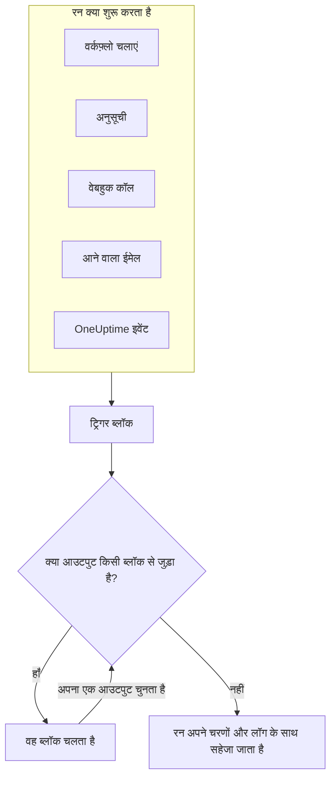
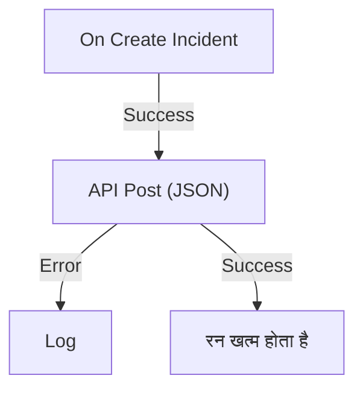

# वर्कफ़्लो अवलोकन

वर्कफ़्लो बिना कोड लिखे OneUptime में काम को स्वचालित करते हैं। आप कैनवास पर ब्लॉक रखते हैं, उन्हें जोड़ते हैं, और जब भी उसका ट्रिगर चलता है, वर्कफ़्लो अपने-आप चल जाता है: कोई घटना बनती है, कोई अनुसूचित समय आता है, कोई दूसरा टूल एक URL कॉल करता है, या कोई ईमेल आता है। इनका इस्तेमाल OneUptime को अपने बाकी स्टैक से जोड़ने और रोज़मर्रा के फ़ॉलो-अप काम संभालने के लिए करें, जबकि आप खुद समस्या पर ध्यान देते हैं।

:::cards
- [वर्कफ़्लो बनाना](/docs/workflows/authoring): एक वर्कफ़्लो बनाएं, फिर कैनवास पर उसके ब्लॉक जोड़ें, आपस में कनेक्ट करें और सेट अप करें।
- [ट्रिगर](/docs/workflows/triggers): वर्कफ़्लो को हाथ से, अनुसूची पर, किसी वेबहुक, ईमेल या OneUptime इवेंट से शुरू करें।
- [घटक](/docs/workflows/components): हर वह ब्लॉक जिसे आप जोड़ सकते हैं, API कॉल से लेकर OneUptime रिकॉर्ड तक।
- [रन](/docs/workflows/runs-and-logs): देखें कि हर रन ने चरण-दर-चरण क्या किया।
:::

## वर्कफ़्लो कैसे काम करता है

हर वर्कफ़्लो के तीन हिस्से होते हैं:

1. **एक ट्रिगर** — जो वर्कफ़्लो को शुरू करता है: हाथ से चलाया गया रन, कोई अनुसूची, वेबहुक कॉल, आने वाला ईमेल, या OneUptime में कोई इवेंट, जैसे नई घटना। हर वर्कफ़्लो में ठीक एक होता है।
2. **घटक** — वर्कफ़्लो क्या करता है: संदेश भेजना, कोई API कॉल करना, कोई शर्त जांचना, OneUptime रिकॉर्ड बनाना या अपडेट करना।
3. **कनेक्शन** — वे रेखाएं जो आप एक ब्लॉक से अगले ब्लॉक तक खींचते हैं। ये तय करती हैं कि किसके बाद क्या चलेगा।

जब ट्रिगर चलता है, OneUptime एक **रन** शुरू करता है। हर ब्लॉक अपने किसी एक आउटपुट को चुनकर खत्म होता है, जैसे **Success** या **Error**, **Yes** या **No**, और आगे सिर्फ़ वही ब्लॉक चलते हैं जो उस आउटपुट से जुड़े हों। अगर किसी ब्लॉक के चुने गए आउटपुट से कोई ब्लॉक जुड़ा नहीं है, तो वह रास्ता वहीं खत्म हो जाता है। रन अपनी स्थिति, अपनाए गए रास्ते और हर ब्लॉक ने क्या पाया और क्या लौटाया, इन सबके साथ सहेजा जाता है।



यह सब आप कैनवास पर दृश्य रूप से बनाते हैं। ज़्यादातर वर्कफ़्लो को कोई कोड नहीं चाहिए; जब चाहिए, तो एक **Run Custom JavaScript** ब्लॉक JavaScript की कुछ पंक्तियाँ चलाता है।

## वर्कफ़्लो से आप क्या कर सकते हैं

- **OneUptime को अपने दूसरे टूल से जोड़ें** — Slack, Microsoft Teams, Discord, Telegram या IRC पर पोस्ट करें, Jira टिकट बनाएं, या अपने स्टैक के किसी भी API को अनुरोध भेजें।
- **OneUptime में जो होता है, उस पर प्रतिक्रिया दें** — कोई घटना बनते ही सही चैनल को बताएं और अपने-आप एक टिकट खोलें।
- **अनुसूची पर काम चलाएं** — हर पाँच मिनट, हर रात, हर सोमवार सुबह।
- **बाहर से डेटा प्राप्त करें** — दूसरे सिस्टम को वर्कफ़्लो का URL कॉल करके या उसके पते पर ईमेल भेजकर वर्कफ़्लो शुरू करने दें।
- **साझा स्वचालन दोबारा इस्तेमाल करें** — इसे एक बार बनाएं, और किसी भी दूसरे वर्कफ़्लो से **Execute Workflow** ब्लॉक के ज़रिए शुरू करें।

## मुख्य शब्द

| शब्द                  | इसका मतलब                                                                                              |
| --------------------- | ------------------------------------------------------------------------------------------------------ |
| **वर्कफ़्लो**         | पूरा स्वचालन: एक नाम, ब्लॉक वाला एक कैनवास, और उसे चालू या बंद करने वाला स्विच।                       |
| **ट्रिगर**            | पहला ब्लॉक। यह तय करता है कि वर्कफ़्लो कब चलेगा। हर वर्कफ़्लो में ठीक एक होता है।                     |
| **घटक**               | कोई भी दूसरा ब्लॉक: यह संदेश भेजता है, अनुरोध करता है, शर्त जांचता है या रिकॉर्ड बदलता है।            |
| **आउटपुट**            | ब्लॉक के नीचे का एक बिंदु, जैसे **Success** या **Error**। उससे निकलने वाली रेखाएं अगले ब्लॉक तक जाती हैं। |
| **रन**                | वर्कफ़्लो का एक निष्पादन, जो अपनी स्थिति, टाइमस्टैम्प और हर ब्लॉक ने क्या किया, इसके साथ सहेजा जाता है। |
| **ग्लोबल वेरिएबल**    | कोई मान, जैसे API कुंजी, जिसे आप एक बार सहेजते हैं और प्रोजेक्ट के किसी भी वर्कफ़्लो में इस्तेमाल करते हैं। |

## शुरू करने से पहले

- **ऐसा प्लान जिसमें वर्कफ़्लो शामिल हों।** OneUptime Cloud पर वर्कफ़्लो के लिए **Growth** प्लान या उससे ऊपर चाहिए, और हर प्लान हर 30 दिनों में तय संख्या में रन की अनुमति देता है — देखें [प्लान की सीमाएँ](/docs/workflows/configuration#प्लान-की-सीमाएँ)। बिलिंग के बिना स्व-होस्टेड इंस्टॉलेशन पर इनमें से कोई सीमा नहीं है।
- **बनाने की अनुमति।** वर्कफ़्लो बनाने और बदलने के लिए **Workflow Admin**, **Project Admin** या **Project Owner**, या मिलती-जुलती अनुमतियों वाली कोई कस्टम भूमिका चाहिए। एक **Workflow Member** वर्कफ़्लो खोल सकता है और उन्हें हाथ से चला सकता है, लेकिन बदल नहीं सकता। देखें [अनुमतियाँ](/docs/workflows/configuration#अनुमतियाँ)।

## OneUptime में वर्कफ़्लो कहाँ मिलते हैं

ऊपर की पट्टी में **उत्पाद** खोलें और **डैशबोर्ड और ऑटोमेशन** के अंतर्गत **वर्कफ़्लो** चुनें। इसके मेनू में ये हैं:

- **वर्कफ़्लो** — आपके वर्कफ़्लो की सूची। नया बनाएं या कोई मौजूदा खोलें।
- **ग्लोबल वेरिएबल** — आपके सभी वर्कफ़्लो के साझा मान।
- **लॉग → रन** — आपके प्रोजेक्ट के हर वर्कफ़्लो का निष्पादन इतिहास।
- **सेटिंग्स → लेबल नियम** और **स्वामी नियम** — नए वर्कफ़्लो को अपने-आप लेबल दें और उनके मालिक तय करें।
- **उन्नत → संग्रहीत** — वे वर्कफ़्लो जिन्हें आपने संग्रहित किया है। ये कभी नहीं चलते और सूची से बाहर रहते हैं; इन्हें यहीं से अनसंग्रहीत करें। देखें [वर्कफ़्लो को संग्रहित करना](/docs/workflows/configuration#वर्कफ़्लो-को-संग्रहित-करना)।
- **डेवलपर** — Terraform, API या किसी AI सहायक से वर्कफ़्लो कैसे प्रबंधित करें।

किसी एक वर्कफ़्लो को खोलें, तो उसके अपने मेनू में ये हैं:

- **अवलोकन** — नाम, विवरण, लेबल और **सक्षम** स्विच।
- **बिल्डर** — वह कैनवास जहाँ आप वर्कफ़्लो डिज़ाइन करते हैं, सबसे ऊपर **सक्षम** स्विच के साथ।
- **वर्कफ़्लो वेरिएबल** — सिर्फ़ इसी वर्कफ़्लो के मान।
- **लॉग → रन** — इस वर्कफ़्लो का हर रन, विवरण के साथ।
- **मालिक** — वर्कफ़्लो के लिए ज़िम्मेदार लोग और टीमें।
- **डेवलपर** — Terraform, API या किसी AI सहायक से इस वर्कफ़्लो को कैसे प्रबंधित करें।
- **सेटिंग्स** — प्रतिलिपि बनाना, निर्यात करना और संग्रहित करना।

**सेटिंग्स** मेनू के **उन्नत** खंड में **ऑडिट लॉग** और **वर्कफ़्लो हटाएं** के साथ है। **उन्नत** और **डेवलपर** इस मेनू और बाकी हर मेनू में शुरू में सिकुड़े रहते हैं, ताकि जो पेज आप रोज़ इस्तेमाल करते हैं वे पहले आएं। किसी खंड के नाम पर क्लिक करके उसके पेज दिखाएं। जब आप उनमें से किसी पेज पर होते हैं, तो वह अपने-आप खुल जाता है।

## अपना पहला वर्कफ़्लो बनाएं

हर वर्कफ़्लो एक ही तरीके से बनता है:

:::steps
1. **बनाएं** — कोई शुरुआती बिंदु चुनें, फिर अपने वर्कफ़्लो को नाम दें। देखें [वर्कफ़्लो बनाना](/docs/workflows/authoring)।
2. **ट्रिगर चुनें** — हाथ से, अनुसूचित, वेबहुक, आने वाला ईमेल, या OneUptime का कोई इवेंट। देखें [ट्रिगर](/docs/workflows/triggers)।
3. **घटक जोड़ें** — कैनवास पर क्रियाएँ जोड़ें और उन्हें आपस में कनेक्ट करें। देखें [घटक](/docs/workflows/components)।
4. **इसे चालू करें** — **बिल्डर** में सबसे ऊपर **सक्षम** चालू करें। अक्षम वर्कफ़्लो बिल्कुल नहीं चल सकता, हाथ से भी नहीं।
5. **परखें** — **बिल्डर** में **वर्कफ़्लो चलाएं** पर क्लिक करें और रन को होते हुए देखें।
:::

नीचे दिया गया उदाहरण एक असली वर्कफ़्लो के लिए इन्हीं चरणों का पालन करता है।

## उदाहरण: नई घटनाएँ किसी वेबहुक पर भेजें

यह वर्कफ़्लो हर नई घटना का JSON सारांश आपके चुने URL पर भेजता है — कोई टिकटिंग सिस्टम, डेटा वेयरहाउस, कुछ भी जो वेबहुक स्वीकार करता हो — और अनुरोध विफल होने पर कारण रन के लॉग में लिखता है।



> [!TIP]
> **Forward new incidents to another system** टेम्पलेट आपके लिए यही वर्कफ़्लो बना देता है। वर्कफ़्लो बनाते समय यह **घटनाएं** के अंतर्गत मिलता है।

:::steps
### वर्कफ़्लो बनाएं

**वर्कफ़्लो** खोलें और **वर्कफ़्लो बनाएं** पर क्लिक करें। **शुरू से बनाएं** पर क्लिक करें, वर्कफ़्लो का नाम `Send new incidents to a webhook` रखें, और **वर्कफ़्लो बनाएं** पर क्लिक करें।

नया वर्कफ़्लो **बिल्डर** में बंद अवस्था में खुलता है।

### ट्रिगर जोड़ें

डैश वाले **Choose what starts this workflow** ब्लॉक पर क्लिक करें, फिर **Add Trigger** पैनल में **Popular** के अंतर्गत **On Create Incident** पर क्लिक करें।

ट्रिगर डैश वाले ब्लॉक की जगह ले लेता है। उस पर दिखने वाला ID, `incident-on-create-1`, वही है जिससे बाद के ब्लॉक इसका संदर्भ देते हैं।

### घटना के फ़ील्ड चुनें

ट्रिगर पर क्लिक करें। **Select Fields** में वे फ़ील्ड चुनें जो अनुरोध में जाने चाहिए, जैसे शीर्षक और विवरण, और **सहेजें** पर क्लिक करें।

ट्रिगर नई घटना को इन फ़ील्ड के साथ आगे देता है। जो फ़ील्ड आप नहीं चुनते, वह खाली पहुँचता है।

### API ब्लॉक जोड़ें

**घटक जोड़ें** पर क्लिक करें, फिर **Popular** के अंतर्गत **API Post (JSON)** पर क्लिक करें। ट्रिगर के **Success** बिंदु से नीचे नए ब्लॉक के ऊपरी बिंदु तक खींचें।

### अनुरोध भरें

API ब्लॉक पर क्लिक करें, जिस पर **Click to set up** लिखा है। **URL** में अपना एंडपॉइंट डालें। **Request Body** में भेजने वाला JSON लिखें, जहाँ ज़रूरत हो वहाँ घटना के फ़ील्ड डालने के लिए **{ }** का इस्तेमाल करें, और **सहेजें** पर क्लिक करें।

```json title="Request Body"
{
  "id": "{{local.components.incident-on-create-1.returnValues.model._id}}",
  "title": "{{local.components.incident-on-create-1.returnValues.model.title}}",
  "description": "{{local.components.incident-on-create-1.returnValues.model.description}}"
}
```

वर्कफ़्लो चलने पर हर `{{…}}` संदर्भ घटना के मान से बदल दिया जाता है। सिंटैक्स के लिए देखें [वेरिएबल](/docs/workflows/variables)।

### विफलताएँ पकड़ें

**घटक जोड़ें** पर क्लिक करें, फिर **लॉग** पर क्लिक करें। API ब्लॉक के **Error** बिंदु को इससे जोड़ें, फिर Log ब्लॉक का **Value** `Could not send the incident: {{local.components.api-post-1.returnValues.error}}` पर सेट करें।

विफल होने वाला अनुरोध — ऐसा URL जिस तक पहुँचा न जा सके, या ऐसा जवाब जो 2xx न हो — अब इस रास्ते पर जाता है, और रन का लॉग कारण बताता है।

### इसे चालू करें

**बिल्डर** में सबसे ऊपर **सक्षम** चालू करें।

### इसे परखें

**वर्कफ़्लो चलाएं** पर क्लिक करें, इस प्रोजेक्ट की किसी घटना का **घटना ID** डालें, **Run Workflow Manually** पर क्लिक करें, और **Run** से पुष्टि करें।

एक **वर्कफ़्लो रन** पैनल खुलता है और रन का अनुसरण करता है। भेजी गई बॉडी और मिला जवाब देखने के लिए **API Post (JSON)** चरण खोलें।
:::

अब से प्रोजेक्ट की हर नई घटना एक रन शुरू करती है। ये सब आपको वर्कफ़्लो के [रन](/docs/workflows/runs-and-logs) में मिलेंगे।

> [!NOTE]
> अनुरोध OneUptime से बाहर जाता है। OneUptime Cloud पर URL इंटरनेट से पहुँच योग्य होना चाहिए। स्व-होस्टेड इंस्टॉलेशन निजी नेटवर्क पतों को अस्वीकार करता है, जब तक कोई व्यवस्थापक उन्हें अनुमति न दे — देखें [बाहर जाने वाली नेटवर्क पहुँच](/docs/workflows/configuration#बाहर-जाने-वाली-नेटवर्क-पहुँच)।

## वर्कफ़्लो OneUptime के बाकी हिस्सों के साथ कैसे जुड़ते हैं

- **मॉनिटर** समस्या पकड़ते हैं। **घटनाएं** और **अलर्ट** उसे दर्ज करते हैं। **वर्कफ़्लो** उस पर प्रतिक्रिया देते हैं।
- **Runbook** वे प्रतिक्रिया प्रक्रियाएँ हैं जिन्हें आपकी टीम किसी घटना, अलर्ट या रखरखाव इवेंट पर पूरा करती है: हाथ से किए जाने वाले चरण, अनुमोदन और स्क्रिप्ट, जिनमें लोग शामिल होते हैं। वर्कफ़्लो बिना निगरानी के चलते हैं। जब किसी व्यक्ति को रास्ते में फ़ैसले लेने हों तो [Runbook](/docs/runbooks/index) इस्तेमाल करें, और जब हर चरण स्वचालित हो तो वर्कफ़्लो।
- **वर्कस्पेस कनेक्शन** घटना चैनलों और सूचनाओं के लिए किसी प्रोजेक्ट को Slack और Microsoft Teams से जोड़ते हैं। वर्कफ़्लो के Slack और Microsoft Teams ब्लॉक इनका इस्तेमाल नहीं करते: हर ब्लॉक अपने इनकमिंग वेबहुक URL के ज़रिए पोस्ट करता है।

## अगले कदम

:::cards
- [वर्कफ़्लो बनाना](/docs/workflows/authoring): कैनवास, ब्लॉक और उनकी सेटिंग्स के साथ काम करें।
- [वेरिएबल](/docs/workflows/variables): ब्लॉक के बीच डेटा भेजें और सीक्रेट को अपने वर्कफ़्लो से बाहर रखें।
- [कॉन्फ़िगरेशन और सुरक्षा](/docs/workflows/configuration): लाइव होने से पहले अनुमतियाँ, सीमाएँ और सुरक्षा।
:::
