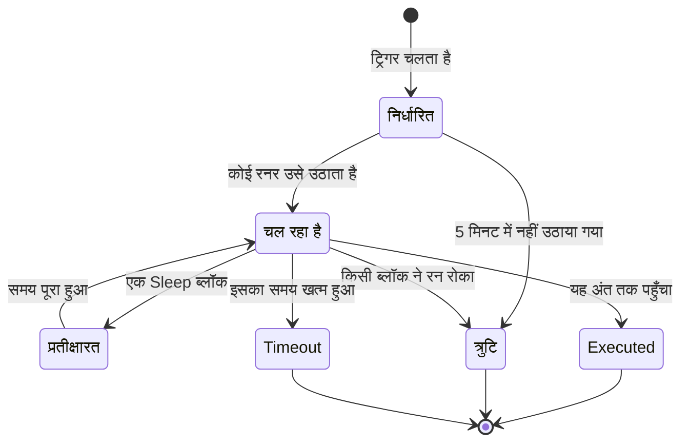

# वर्कफ़्लो रन

हर बार जब कोई वर्कफ़्लो चलता है, OneUptime इस बात का रिकॉर्ड सहेजता है कि क्या हुआ — वह कब चला, क्या वह सफल रहा, और हर ब्लॉक ने क्या पाया और क्या लौटाया। इस रिकॉर्ड को **रन** कहते हैं। रन से ही आप पुष्टि करते हैं कि वर्कफ़्लो ने काम किया, जिसने नहीं किया उसकी जाँच करते हैं, और पिछली गतिविधि देखते हैं।

:::cards
- [रन की स्थितियाँ](#रन-की-स्थितियाँ): निर्धारित, प्रतीक्षारत, Executed और दूसरी स्थितियों का मतलब।
- [रन पढ़ना](#रन-पढ़ना): रन ने जो रास्ता लिया, उसे ब्लॉक-दर-ब्लॉक देखें।
- [समस्या निवारण](#समस्या-निवारण): ऐसा वर्कफ़्लो जो नहीं चला, ऐसा ब्लॉक जो कभी नहीं चला, ऐसा मान जो खाली पहुँचा।
:::

## ये कहाँ मिलते हैं

| पेज                                                  | आप क्या देखते हैं                                                                                  |
| ---------------------------------------------------- | -------------------------------------------------------------------------------------------------- |
| **वर्कफ़्लो → लॉग → रन** (वर्कफ़्लो मेनू)            | प्रोजेक्ट के हर वर्कफ़्लो का हर रन। वर्कफ़्लो के नाम, स्थिति और समय से फ़िल्टर करें।               |
| **वर्कफ़्लो → लॉग → रन** (किसी एक वर्कफ़्लो का मेनू) | सिर्फ़ इसी एक वर्कफ़्लो के रन। इसमें वर्कफ़्लो फ़िल्टर के बजाय **रन ID** फ़िल्टर है।               |
| **एक अकेला रन**                                      | किसी रन की पंक्ति पर **लॉग्स देखें** बटन से खुलता है — पंक्तियाँ खुद क्लिक करने योग्य नहीं हैं।   |

**बिल्डर** से रन शुरू करने पर वही **वर्कफ़्लो रन** दृश्य खुलता है जो पहले से रन का अनुसरण कर रहा होता है, ताकि आप उसे होते हुए देख सकें, बाद में उसे ढूँढने के बजाय।

## रन की स्थितियाँ

| स्थिति                              | इसका मतलब                                                                                                                                                                                                                                                             |
| ----------------------------------- | --------------------------------------------------------------------------------------------------------------------------------------------------------------------------------------------------------------------------------------------------------------------- |
| **निर्धारित**                       | ट्रिगर चला और रन किसी रनर के लिए कतार में है। आम तौर पर एक सेकंड का एक हिस्सा। जो रन 5 मिनट बाद भी निर्धारित है, वह विफल होता है: उसे किसी ने नहीं उठाया।                                                                                                          |
| **चल रहा है**                       | वर्कफ़्लो चल रहा है।                                                                                                                                                                                                                                                  |
| **प्रतीक्षारत**                     | रन किसी **Sleep** ब्लॉक पर रुका है और अपने-आप फिर शुरू होगा। इंतज़ार के दौरान यह कोई वर्कर नहीं घेरता।                                                                                                                                                              |
| **Executed**                        | रन बिना विफल हुए अंत तक पहुँचा। यही सफलता की स्थिति है: पिल पर **Executed** लिखा होता है, "सफल" नहीं।                                                                                                                                                              |
| **त्रुटि**                          | किसी ब्लॉक ने रन रोका। इसका इस्तेमाल तब भी होता है जब कतार वाला रन कभी उठाया न जाए, जब सोए हुए रन की बहाली खो जाए, जब कोई अनुसूची एक्सप्रेशन हल न हो सके, और जब रन किसी **Sleep** ब्लॉक पर इंतज़ार कर रहा हो और वर्कफ़्लो बंद या संग्रहित कर दिया जाए।           |
| **Timeout**                         | रन को अनुमति से ज़्यादा समय लगा: डिफ़ॉल्ट रूप से 2 मिनट। देखें [एक रन कितना समय ले सकता है](/docs/workflows/configuration#एक-रन-कितना-समय-ले-सकता-है)।                                                                                                                 |
| **Execution Exceeded Current Plan** | प्रोजेक्ट ने पिछले 30 दिनों के अपने वर्कफ़्लो रन खत्म कर दिए हैं, या सब्सक्रिप्शन का भुगतान नहीं हुआ है। रन दर्ज होता है लेकिन चलाया नहीं जाता। सिर्फ़ OneUptime Cloud।                                                                                           |

जो ब्लॉक अपना **Error** आउटपुट लेता है — मान लीजिए किसी API ब्लॉक को 4xx जवाब मिला — वह रन को विफल नहीं करता। **Error** से जुड़े ब्लॉक चलते हैं, और रन फिर भी **Executed** पर खत्म होता है। चरण खुद लाल रंग में दिखाया जाता है, ताकि आप उसे ढूँढ सकें।

## रन पढ़ना

किसी रन को खोलने के लिए उस पर **लॉग्स देखें** पर क्लिक करें। **वर्कफ़्लो रन** दृश्य में दो टैब हैं, **चरण** और **Full Log**।

### चरण टैब

रन ने जो रास्ता लिया, हर ब्लॉक के लिए एक क्रमांकित कार्ड, उसी क्रम में जिसमें वे चले। कुछ भी खोले बिना हर कार्ड ये दिखाता है:

- ब्लॉक का शीर्षक और ID, क्या वह **सफल रहा** या **विफल** हुआ, और उसमें कितना समय लगा।
- उसने कौन-सा आउटपुट लिया, कैनवास पर उसके नाम से, और वह कहाँ ले गया: अगले चरण का क्रमांक और नाम, या यह नोट कि उससे कुछ जुड़ा नहीं, इसलिए रन या वह शाखा वहीं खत्म हो गई। जिस चरण तक वह ले गया लेकिन जो कभी नहीं चला, उस पर **(did not run)** लिखा होता है। Error आउटपुट लाल रंग में दिखाया जाता है; Yes और No बस वह रास्ता हैं जिस पर रन गया। आउटपुट का मतलब जानने के लिए उसके नाम पर पॉइंटर ले जाएं।
- अगर चरण विफल हुआ तो उसकी त्रुटि, और उसके बारे में कोई चेतावनी — उदाहरण के लिए ऐसा `{{…}}` संदर्भ जो कुछ भी नहीं बना।

विवरण के दो ब्लॉक देखने के लिए कोई कार्ड खोलें:

| ब्लॉक        | यह क्या दिखाता है                                                                                                                                                                                               |
| ------------ | --------------------------------------------------------------------------------------------------------------------------------------------------------------------------------------------------------------- |
| **Received** | सभी वेरिएबल भरे जाने के बाद ब्लॉक को मिली सेटिंग्स, नाम से और उसी क्रम में जिसमें उसकी सेटिंग सूची उन्हें रखती है। जो सेटिंग किसी दूसरे चरण या वेरिएबल का संदर्भ देती है, वह संदर्भ को उस मान के बगल में दिखाती है जो वह बना, और कुछ न बनने पर **Did not resolve**। |
| **Returned** | उसने क्या बनाया, हर मान के ID (`returnValues` संदर्भ का आख़िरी हिस्सा) के साथ। सूचियाँ और ऑब्जेक्ट इंडेंट करके दिखाए जाते हैं।                                                                                |

विफल चरण, चेतावनी वाले चरण, और किसी रन का इकलौता चरण खुले हुए शुरू होते हैं। **चरण** टैब की गिनती कुछ विफल होने पर लाल और किसी चरण पर चेतावनी होने पर नारंगी हो जाती है।

कुछ रन अलग तरह से पढ़े जाते हैं:

- **एक चरण की जाँच।** **Run just this step** से शुरू हुए रन में सबसे ऊपर **Only this step ran** लिखा होता है। उससे पहले के चरण नहीं चले, इसलिए जो मान यह उनसे पढ़ता है वे गायब होते हैं (उनके लिए **Did not resolve** चेतावनी की उम्मीद करें), और इसके बाद के चरणों पर **(not run in this test)** लिखा होता है। पूरा रास्ता आज़माने के लिए **वर्कफ़्लो चलाएं** इस्तेमाल करें।
- **चरणों के बीच रुका रन।** अगर रन किसी ऐसे कारण से रुका जिसे कोई चरण नहीं समझाता — चरणों के बीच उसका समय खत्म हो गया, या अपने पहले चरण से पहले विफल हो गया — तो रास्ता **The run stopped here** और कारण के साथ खत्म होता है।
- **सोया हुआ रन।** जो रन किसी **Sleep** ब्लॉक पर इंतज़ार कर रहा है, वह **Sleeping** और उस समय के साथ खत्म होता है जब वह अपने-आप आगे बढ़ेगा; Sleep के बाद के चरणों पर **(not run yet)** लिखा होता है।

हर चरण के शीर्षक के नीचे का ID ठीक वही है जो `{{local.components.<id>.returnValues.…}}` संदर्भ में जाता है, जिससे संदर्भ सही लिखने का यह सबसे तेज़ तरीका बनता है।

दिखाए गए मान वे हैं जो ब्लॉक को मिले, वेरिएबल भरे जाने के बाद और ब्लॉक के उनके साथ कुछ करने से पहले, दो अपवादों के साथ: सीक्रेट और ब्लॉक द्वारा संवेदनशील चिह्नित फ़ील्ड छिपाए जाते हैं, और 4,000 अक्षरों से लंबा मान "… (truncated)" के साथ छोटा कर दिया जाता है। एक रन अपने आख़िरी 100 चरण रखता है; लंबा या बार-बार बहाल हुआ रन वहाँ एक नारंगी नोट दिखाता है जहाँ पहले वाले हटाए गए थे। आउटपुट के नाम सहेजे जाने से पहले दर्ज हुए रन आउटपुट को उसके ID से दिखाते हैं, बिना यह बताए कि वह कहाँ ले गया।

### Full Log टैब

रनर का लिखा कच्चा, पंक्ति-दर-पंक्ति लॉग, जिसमें वह सब शामिल है जो ब्लॉक ने खुद लॉग किया, जैसे किसी **Log** ब्लॉक का मान या किसी स्क्रिप्ट का `console.log`। जब चरण टैब विफलता नहीं समझाता, तब इसका इस्तेमाल करें।

## रन को कॉपी और डाउनलोड करना

**वर्कफ़्लो रन** दृश्य में सबसे ऊपर, उसके बंद करने वाले बटन के बगल में, **लॉग कॉपी करें** पूरा **Full Log** आपके क्लिपबोर्ड पर रखता है, किसी चैट या टिकट में चिपकाने के लिए तैयार। **डाउनलोड करें** रन को एक फ़ाइल के रूप में सहेजता है:

| डाउनलोड                                 | आपको क्या मिलता है                                                                                                                                                                                                                     |
| --------------------------------------- | -------------------------------------------------------------------------------------------------------------------------------------------------------------------------------------------------------------------------------------- |
| **लॉग डाउनलोड करें**                    | एक `.txt` फ़ाइल जिसमें पूरा लॉग ठीक वैसा ही है जैसा रनर ने छापा, चाहे कितना भी लंबा हो, एक छोटे शीर्षक के नीचे: वर्कफ़्लो का नाम और ID, रन ID, उसकी स्थिति, और वह कब निर्धारित हुआ, शुरू हुआ और पूरा हुआ।                       |
| **रन को JSON के रूप में डाउनलोड करें**  | एक `.json` फ़ाइल जिसमें वही जानकारी डेटा के रूप में है, वे चरण जो **चरण** टैब दिखाता है (हर एक ने क्या पाया और लौटाया, और कौन-सा आउटपुट लिया), और पंक्तियों की सूची के रूप में लॉग। चरण उसी रूप में हैं जिसमें API किसी रन का `stepTrace` लौटाता है, और **चरण** टैब की तरह ये रन के आख़िरी 100 हैं। लॉग हमेशा पूरा होता है। |

यही दो डाउनलोड दोनों रन सूचियों में हर रन के **⋯** मेनू में हैं, ताकि आप किसी रन को खोले बिना सहेज सकें। **बिल्डर** से शुरू किया गया रन चलते रहने के दौरान भी कॉपी या डाउनलोड किया जा सकता है; आपको वह मिलता है जो उसने अब तक लॉग किया है।

फ़ाइलों के नाम वर्कफ़्लो, रन और उसके शुरू होने के समय पर रखे जाते हैं, UTC में, ताकि उनका फ़ोल्डर पहले वर्कफ़्लो और फिर समय के हिसाब से क्रम में आए: `nightly-sync-run-<run id>-2026-09-30T10-00-01.txt`।

डाउनलोड में ऐसा कुछ नहीं होता जो आप रन में पहले से न पढ़ सकें। सीक्रेट और किसी ब्लॉक द्वारा संवेदनशील चिह्नित फ़ील्ड रन दर्ज होते समय छिपा दिए जाते हैं, इसलिए वे फ़ाइल में भी छिपे रहते हैं, और जो कोई रन खोल सकता है वह उसे डाउनलोड कर सकता है।

## समस्या निवारण

:::details मेरा वर्कफ़्लो नहीं चला
1. पक्का करें कि वर्कफ़्लो **सक्षम** है: स्विच उसके **बिल्डर** में सबसे ऊपर है, जो वर्कफ़्लो बंद होने पर कैनवास के ऊपर यह बताता है। नए वर्कफ़्लो अक्षम अवस्था में शुरू होते हैं, और अक्षम वर्कफ़्लो हर रन को अस्वीकार करता है — हाथ से चलाए गए रन भी। उस पर वेबहुक कॉल को HTTP 400 मिलता है, एक संदेश के साथ जो बताता है कि इसे कैसे चालू करें।
2. OneUptime इवेंट ट्रिगर के लिए, पुष्टि करें कि इवेंट सचमुच हुआ: रिकॉर्ड खोलें और उसका इतिहास देखें। **Listen on** वाला **On Update** ट्रिगर सिर्फ़ तब चलता है जब उनमें से कोई फ़ील्ड बदला हो।
3. वेबहुक ट्रिगर के लिए, पुष्टि करें कि दूसरा सिस्टम सही URL पर भेज रहा है। ज़्यादातर टूल वेबहुक भेजते समय लॉग करते हैं — वहाँ देखें।
4. अनुसूची ट्रिगर के लिए, पुष्टि करें कि cron एक्सप्रेशन उस समय से मेल खाता है जिसकी आप उम्मीद करते हैं। अनुसूचियाँ UTC में चलती हैं।

अगर रन **Execution Exceeded Current Plan** स्थिति के साथ दिखता है, तो प्रोजेक्ट ने पिछले 30 दिनों के अपने सभी वर्कफ़्लो रन इस्तेमाल कर लिए हैं, या सब्सक्रिप्शन का भुगतान नहीं हुआ है। रन का लॉग गिनती और आपके प्लान की सीमा बताता है। यह सिर्फ़ OneUptime Cloud पर लागू होता है।
:::

:::details बाद का कोई ब्लॉक कभी नहीं चला
जो ब्लॉक नहीं चलता, वह आम तौर पर वायरिंग की समस्या होती है। **बिल्डर** खोलें और जाँचें:

- क्या पिछले ब्लॉक का आउटपुट इस ब्लॉक के इनपुट से जुड़ा है?
- क्या पिछले ब्लॉक ने आपकी उम्मीद से अलग आउटपुट लिया — **Success** के बजाय **Error**, या **Yes** के बजाय **No**? **चरण** टैब बताता है कि उसने कौन-सा आउटपुट लिया और वह कहाँ ले गया, या यह कि उससे कुछ जुड़ा नहीं।
:::

:::details कोई मान खाली पहुँचा, या {{…}} टेक्स्ट के रूप में
रन खोलें और चरण देखें। जो संदर्भ हल नहीं हुआ, उसे चरण पर ही चेतावनी के रूप में बताया जाता है, और **Received** ब्लॉक में उसकी सेटिंग पर **Did not resolve** लिखा होता है।

- अगर आप शाब्दिक `{{local.components.…}}` टेक्स्ट देखते हैं, तो संदर्भ हल नहीं हुआ। आम तौर पर यह घटक ID या लौटाए गए मान के ID में टाइपिंग की गलती होती है — याद रखें कि यह ब्लॉक का **Identifier** है, उस पर दिखने वाला नाम नहीं। `local.components` की वर्तनी भी जाँचें: `{{local.componets.api-get-1.returnValues.response-body}}` शाब्दिक टेक्स्ट के रूप में भेजा जाता है और रन फिर भी **Executed** बताता है। अगर रन **Run just this step** की जाँच थी, तो पिछला ब्लॉक चला ही नहीं — इसके बजाय पूरा वर्कफ़्लो चलाएं।
- अगर आप **Empty text** देखते हैं, तो पिछला ब्लॉक चला लेकिन उसने वह फ़ील्ड नहीं बनाया।

यही चेतावनी **Full Log** टैब में `Warning:` से शुरू होने वाली पंक्ति के रूप में होती है।
:::

:::details जब मैं इसे हाथ से चलाता हूँ तो यह काम करता है, लेकिन ट्रिगर से नहीं
**बिल्डर** खोलें, **वर्कफ़्लो चलाएं** पर क्लिक करें, और ट्रिगर के फ़ील्ड ऐसे मानों से भरें जो असली ट्रिगर के भेजे मानों जैसे दिखें। फिर उस रन के **Received** मानों की असली रन के मानों से अगल-बगल तुलना करें। फ़र्क आम तौर पर किसी एक फ़ील्ड के नाम या प्रकार में होता है।
:::

## वर्कफ़्लो फिर से चलाना

"यह रन दोबारा आज़माएं" जैसा कोई बटन नहीं है। पुराने रन कभी अपने-आप दोबारा नहीं चलाए जाते, क्योंकि उनके दुष्प्रभाव — Slack संदेश, API कॉल, टिकट — दोहराना सुरक्षित नहीं हो सकता। काम दोबारा करने के लिए वर्कफ़्लो ठीक करें और अगले असली ट्रिगर को उसे चलाने दें, या **बिल्डर** खोलें और उन्हीं मानों के साथ **वर्कफ़्लो चलाएं** पर क्लिक करें।

## रन कितने समय तक रखे जाते हैं?

OneUptime Cloud पर रन **30 दिनों** तक रखे जाते हैं और फिर हटा दिए जाते हैं — इसीलिए दोनों रन सूचियाँ खुद को पिछले 30 दिनों को कवर करने वाली बताती हैं। स्व-होस्टेड इंस्टॉलेशन रन तब तक रखते हैं जब तक आप उन्हें हटा न दें; अगर कोई वर्कफ़्लो बहुत बार चलता है और आपका इतिहास भर देता है, तो उसे बंद करें या हटा दें।

चरण ट्रेसिंग जोड़े जाने से पहले दर्ज हुए रन में **चरण** की कोई सामग्री नहीं होती और वे सिर्फ़ अपना **Full Log** दिखाते हैं।

## अगले कदम

:::cards
- [कॉन्फ़िगरेशन और सुरक्षा](/docs/workflows/configuration): समय सीमाएँ, प्लान की सीमाएँ, और रिकॉर्ड में क्या छिपाया जाता है।
- [वेरिएबल](/docs/workflows/variables): आपके ब्लॉक जो संदर्भ सिंटैक्स इस्तेमाल करते हैं।
- [घटक](/docs/workflows/components): हर ब्लॉक क्या लौटाता है और वह हर आउटपुट कब लेता है।
:::
