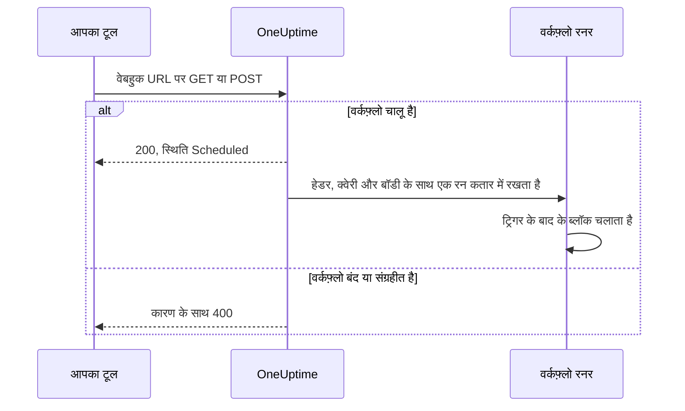
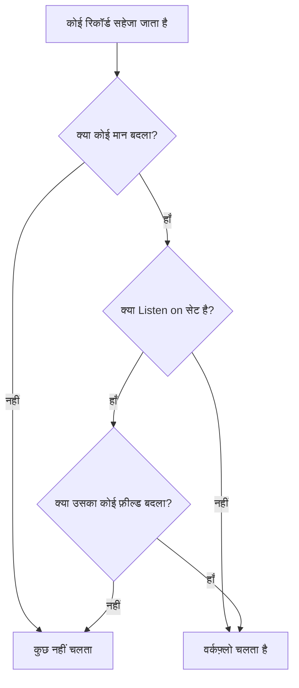

# वर्कफ़्लो ट्रिगर

ट्रिगर किसी वर्कफ़्लो का पहला ब्लॉक है — यह तय करता है कि वर्कफ़्लो कब चलेगा। हर वर्कफ़्लो में ठीक एक ट्रिगर होता है। आप पाँच प्रकारों में से चुनते हैं।

:::cards
- [हाथ से](#manual): बिल्डर से या किसी दूसरे वर्कफ़्लो से वर्कफ़्लो शुरू करें।
- [अनुसूची](#schedule): इसे cron एक्सप्रेशन में लिखी दोहराई जाने वाली अनुसूची पर चलाएं।
- [वेबहुक](#webhook): किसी दूसरे सिस्टम को एक URL कॉल करके इसे शुरू करने दें।
- [आने वाला ईमेल](#incoming-email): इसके अपने पते पर भेजे गए हर ईमेल से इसे शुरू करें।
- [OneUptime इवेंट ट्रिगर](#oneuptime-इवेंट-ट्रिगर): जब कोई रिकॉर्ड बनाया, अपडेट किया या हटाया जाए, तब प्रतिक्रिया दें।
:::

ट्रिगर जोड़ने के लिए, नए वर्कफ़्लो के कैनवास पर डैश वाले **Choose what starts this workflow** ब्लॉक पर क्लिक करें। इसे बदलने के लिए ट्रिगर ब्लॉक हटाएं, और डैश वाला ब्लॉक वापस आ जाता है। देखें [वर्कफ़्लो बनाना](/docs/workflows/authoring#ब्लॉक-जोड़ना)।

## मुझे कौन-सा ट्रिगर इस्तेमाल करना चाहिए?

| अगर आप चाहते हैं…                              | चुनें                       |
| ---------------------------------------------- | --------------------------- |
| बटन पर क्लिक करके वर्कफ़्लो चलाना              | **Manual**                  |
| दोहराई जाने वाली अनुसूची पर चलाना              | **अनुसूची**                 |
| किसी दूसरे सिस्टम से डेटा भिजवाना              | **वेबहुक**                  |
| किसी ईमेल से शुरू करना                         | **Incoming Email**          |
| OneUptime में किसी चीज़ पर प्रतिक्रिया देना    | **OneUptime इवेंट**         |

किसी वर्कफ़्लो में सिर्फ़ एक ट्रिगर हो सकता है। अगर एक ही स्वचालन को शुरू करने के दो तरीके चाहिए, तो साझा लॉजिक **Manual** ट्रिगर वाले एक वर्कफ़्लो में बनाएं, और उसे दो पतले "रैपर" वर्कफ़्लो से **Execute Workflow** ब्लॉक के ज़रिए शुरू करें।

## Manual

जब चाहें वर्कफ़्लो चलाएं: **बिल्डर** पेज पर **वर्कफ़्लो चलाएं** पर क्लिक करें, ट्रिगर का **JSON** भरें, **Run Workflow Manually** पर क्लिक करें, और **Run** से पुष्टि करें। कोई दूसरा वर्कफ़्लो भी इसे **Execute Workflow** ब्लॉक से शुरू कर सकता है।

किसके लिए अच्छा: एक-क्लिक स्वचालन जिसके लिए आप बटन चाहते हैं, जैसे "इस कुंजी को रोटेट करें" या "एक टेस्ट अलर्ट भेजें", और ऐसा लॉजिक जिसे आप वर्कफ़्लो के बीच साझा करते हैं।

**Returns**: **JSON** — वह जिसके साथ रन शुरू हुआ।

- **वर्कफ़्लो चलाएं** से, यह वह JSON है जो आपने टाइप किया, टेक्स्ट के रूप में। उसमें से कोई फ़ील्ड पढ़ने के लिए, पहले उसे एक **Text to JSON** ब्लॉक से गुज़ारें।
- **Execute Workflow** ब्लॉक से, ब्लॉक के **Arguments** की हर कुंजी अपना अलग मान होती है। `{"customerId": "42"}` के साथ, बाद का ब्लॉक `{{local.components.manual-1.returnValues.customerId}}` पढ़ता है, जहाँ `manual-1` Manual ट्रिगर का ID है।

## Schedule

वर्कफ़्लो को दोहराई जाने वाली अनुसूची पर चलाएं। **Schedule at** में तय करें कि कितनी बार: **Common schedules** में से कोई एक चुनें, कोई **Custom cron** एक्सप्रेशन टाइप करें, या ऐसा **वेरिएबल** चुनें जिसमें एक्सप्रेशन हो। फ़ील्ड के नीचे अनुसूची शब्दों में बताई जाती है, साथ में **Next runs** भी।

किसके लिए अच्छा: रात की सफ़ाई, हर घंटे का सिंक, साप्ताहिक रिपोर्ट।

समय UTC में होता है, इसलिए घंटा चुनते समय अपने समय क्षेत्र से बदलकर देखें। cron एक्सप्रेशन के पाँच हिस्से हैं मिनट, घंटा, महीने का दिन, महीना और सप्ताह का दिन:

| एक्सप्रेशन    | कब चलता है                             |
| ------------- | -------------------------------------- |
| `*/5 * * * *` | हर 5 मिनट।                             |
| `0 * * * *`   | हर घंटे, ठीक घंटे पर।                  |
| `0 0 * * *`   | हर दिन UTC आधी रात को।                 |
| `0 9 * * 1-5` | हर कार्यदिवस UTC 9:00 बजे।             |
| `0 9 * * 1`   | हर सोमवार UTC 9:00 बजे।                |

जब तक वर्कफ़्लो बंद है, कुछ भी अनुसूचित नहीं होता। **वेरिएबल** वाली अनुसूची किसी वर्कफ़्लो या ग्लोबल वेरिएबल को पढ़ती है, जैसे `{{local.variables.schedule}}`। अगर वह मान्य cron एक्सप्रेशन नहीं बनता, तो वर्कफ़्लो अनुसूचित नहीं होता, और उसकी रन सूची में एक विफल रन कारण बताता है।

अनुसूची का इंतज़ार किए बिना वर्कफ़्लो परखने के लिए **बिल्डर** में **वर्कफ़्लो चलाएं** पर क्लिक करें: यह तुरंत एक रन शुरू करता है।

## Webhook

OneUptime वर्कफ़्लो को उसका अपना URL देता है। जो कुछ भी उस URL को कॉल करता है, वह वर्कफ़्लो शुरू करता है और अनुरोध के हेडर, क्वेरी पैरामीटर और बॉडी साथ भेजता है।

किसके लिए अच्छा: किसी दूसरे टूल से OneUptime में डेटा लेना — CI/CD कॉलबैक, किसी दूसरी मॉनिटरिंग से अलर्ट, आपके CRM में साइन-अप।

URL पाने के लिए कैनवास पर वेबहुक ट्रिगर पर क्लिक करें। URL उसकी सेटिंग्स में सबसे ऊपर होता है, **URL कॉपी करें** बटन, वह किन तरीकों को स्वीकार करता है, और एक `curl` कमांड के साथ जिसे आप इसे आज़माने के लिए टर्मिनल में पेस्ट कर सकते हैं:

```bash
curl -X POST "https://oneuptime.example.com/workflow/trigger/<secret key>" \
  -H "Content-Type: application/json" \
  -d '{"message": "Hello"}'
```

URL `GET` और `POST` दोनों स्वीकार करता है। कॉल करने वाले को तुरंत एक पावती मिलती है, `{"status": "Scheduled"}` — वर्कफ़्लो खुद पृष्ठभूमि में चलता है, इसलिए कॉल करने वाला कभी नहीं देखता कि वह क्या करता है। बंद या संग्रहीत वर्कफ़्लो पर कॉल HTTP 400 और कारण के साथ अस्वीकार हो जाती है।



**Returns**:

| मान                      | इसमें क्या होता है                                                                                                     |
| ------------------------ | ---------------------------------------------------------------------------------------------------------------------- |
| **Request Headers**      | अनुरोध का हर हेडर, छोटे अक्षरों वाले नाम से, जैसे `content-type`।                                                      |
| **Request Query Params** | URL के क्वेरी पैरामीटर, नाम से।                                                                                        |
| **Request Body**         | कॉल करने वाले की भेजी बॉडी। `Content-Type: application/json` के साथ भेजी गई JSON बॉडी को फ़ील्ड-दर-फ़ील्ड पढ़ा जा सकता है। |

कोई एक फ़ील्ड पढ़ने के लिए उसका नाम संदर्भ में जोड़ें, जैसे `{{local.components.webhook-1.returnValues.request-body.message}}`।

अनुरोध आने के बाद, ट्रिगर के बाद के हर ब्लॉक का वैल्यू पिकर जानता है कि उसमें क्या था: वह बॉडी के फ़ील्ड, हेडर और क्वेरी पैरामीटर दिखाता है, हर एक अपनी सामग्री के साथ, ताकि आप पथ टाइप करने के बजाय `incident.title` चुन सकें। तब तक वह बताता है कि अभी कोई अनुरोध नहीं आया, और **Copy test request** देता है, जो URL के लिए एक `curl` कमांड है; अनुरोध से शुरू हुआ रन खत्म होते ही फ़ील्ड दिखने लगते हैं। देखें [पिछले ब्लॉक के मान इस्तेमाल करना](/docs/workflows/authoring#पिछले-ब्लॉक-के-मान-इस्तेमाल-करना)।

दूसरे टूल के बिना वर्कफ़्लो परखने के लिए **बिल्डर** में **वर्कफ़्लो चलाएं** पर क्लिक करें और हेडर, क्वेरी पैरामीटर और एक बॉडी डालें।

### URL को निजी रखें

URL का आख़िरी हिस्सा वर्कफ़्लो की सीक्रेट कुंजी है, और जिसके पास URL है वह वर्कफ़्लो शुरू कर सकता है। इसलिए जब तक आप **दिखाएं** पर क्लिक नहीं करते, कुंजी छिपी रहती है, और **URL कॉपी करें** पूरा URL बिना दिखाए कॉपी करता है।

अगर URL लीक हो जाए, तो उसी जगह **URL रीसेट करें** पर क्लिक करें: वर्कफ़्लो को नया URL मिलता है और पुराना तुरंत काम करना बंद कर देता है, इसलिए उसे कॉल करने वाली हर चीज़ अपडेट करें। सिर्फ़ वही लोग उसका URL देख या रीसेट कर सकते हैं जिन्हें वर्कफ़्लो संपादित करने की अनुमति है — देखें [वेबहुक सुरक्षा](/docs/workflows/configuration#वेबहुक-सुरक्षा)।

> [!WARNING]
> URL को पासवर्ड की तरह बरतें। जिसके पास भी यह है, वह बिना साइन इन किए आपका वर्कफ़्लो शुरू कर सकता है।

## Incoming Email

OneUptime वर्कफ़्लो को उसका अपना ईमेल पता देता है। उस पते पर भेजा गया हर ईमेल वर्कफ़्लो शुरू करता है और ईमेल साथ भेजता है: किसने भेजा, किसके लिए था, विषय, टेक्स्ट और HTML, हेडर, और अगर कोई अटैचमेंट हो तो उनके नाम।

किसके लिए अच्छा: ऐसे सिस्टम के ईमेल पर कार्रवाई करना जो वेबहुक कॉल नहीं कर सकते — पुराने मॉनिटरिंग टूल के अलर्ट, किसी वेंडर की स्थिति सूचनाएँ, रात का कोई काम जो रिपोर्ट मेल करता है।

पता पाने के लिए कैनवास पर Incoming Email ट्रिगर पर क्लिक करें। पता उसकी सेटिंग्स में सबसे ऊपर होता है, **पता कॉपी करें** बटन के साथ। इसे उस चीज़ को दें जिसे वर्कफ़्लो शुरू करना चाहिए: ऐसा टूल जो सिर्फ़ ईमेल भेज सकता है, किसी वेंडर की सूचना सेटिंग्स, या आपके अपने मेलबॉक्स का कोई फ़ॉरवर्डिंग नियम।

हर ईमेल अपना अलग रन शुरू करता है। पता To या Cc में हो, Bcc हो, या फ़ॉरवर्डिंग नियम से पहुँचा हो, ईमेल वर्कफ़्लो तक पहुँचता है। जिस ईमेल में पता दो बार हो, वह एक ही रन शुरू करता है।

**Returns**:

| मान             | इसमें क्या होता है                                                                                       |
| --------------- | -------------------------------------------------------------------------------------------------------- |
| **From**        | भेजने वाले का पता।                                                                                       |
| **To**          | जिन-जिन को ईमेल भेजा गया, एक पंक्ति में, जैसे `ops@example.com, oncall@example.com`।                     |
| **CC**          | जिन-जिन को ईमेल की प्रति भेजी गई, एक पंक्ति में।                                                         |
| **Subject**     | विषय पंक्ति।                                                                                             |
| **Body**        | ईमेल का सादा टेक्स्ट।                                                                                    |
| **HTML Body**   | ईमेल का HTML, अगर हो। Body और HTML Body दोनों 1 MB पर काट दिए जाते हैं।                                  |
| **Headers**     | ईमेल का हर हेडर, छोटे अक्षरों वाले नाम से, जैसे `message-id`।                                           |
| **Attachments** | हर अटैचमेंट का नाम, प्रकार और आकार। फ़ाइलें खुद नहीं सहेजी जातीं।                                       |
| **Received At** | OneUptime को ईमेल कब मिला।                                                                               |

ईमेल आने के बाद, ट्रिगर के बाद के हर ब्लॉक का वैल्यू पिकर जानता है कि उसमें क्या था: वह ईमेल का हर हेडर और हर अटैचमेंट उनकी सामग्री के साथ दिखाता है, ताकि आप पथ टाइप करने के बजाय `headers.message-id` चुन सकें। तब तक वह बताता है कि अभी तक पते पर कोई ईमेल नहीं पहुँचा। देखें [पिछले ब्लॉक के मान इस्तेमाल करना](/docs/workflows/authoring#पिछले-ब्लॉक-के-मान-इस्तेमाल-करना)।

ईमेल भेजे बिना वर्कफ़्लो आज़माने के लिए **बिल्डर** पेज पर **वर्कफ़्लो चलाएं** पर क्लिक करें और कोई भेजने वाला, विषय और बॉडी भरें। जो मान आप छोड़ देते हैं, वे खाली पहुँचते हैं।

ईमेल वर्कफ़्लो को सिर्फ़ तब शुरू करता है जब वह चालू हो। बंद वर्कफ़्लो को भेजा गया ईमेल अनदेखा होता है, और उस वर्कफ़्लो को भेजा गया ईमेल भी जिसका ट्रिगर अब Incoming Email नहीं है।

### पते को निजी रखें

पते का `@` से पहले वाला हिस्सा वर्कफ़्लो की सीक्रेट कुंजी रखता है, और जिसके पास पता है वह वर्कफ़्लो शुरू कर सकता है। इसलिए जब तक आप **दिखाएं** पर क्लिक नहीं करते, कुंजी छिपी रहती है, और **पता कॉपी करें** पूरा पता बिना दिखाए कॉपी करता है।

अगर पता लीक हो जाए, तो उसी जगह **पता रीसेट करें** पर क्लिक करें: वर्कफ़्लो को नया पता मिलता है, और उसके बाद पुराने पते पर आने वाला ईमेल अनदेखा होता है, इसलिए नया पता हर उस चीज़ को दें जो वर्कफ़्लो को मेल भेजती है। सिर्फ़ वही लोग उसका पता देख या रीसेट कर सकते हैं जिन्हें वर्कफ़्लो संपादित करने की अनुमति है — देखें [आने वाले ईमेल की सुरक्षा](/docs/workflows/configuration#आने-वाले-ईमेल-की-सुरक्षा)।

> [!WARNING]
> कोई भी किसी ईमेल पर कोई भी भेजने वाला लिख सकता है, इसलिए **From** इस बात का सबूत नहीं है कि उसे किसने भेजा। किसी चरण के कुछ महत्वपूर्ण करने से पहले, ऐसी चीज़ जाँचें जो सिर्फ़ असली भेजने वाला जानता हो।

> [!NOTE]
> स्व-होस्टेड इंस्टॉलेशन पर, OneUptime आपके व्यवस्थापक द्वारा कॉन्फ़िगर किए गए इनबाउंड ईमेल प्रदाता के ज़रिए ईमेल प्राप्त करता है — देखें [SendGrid Inbound Email](/docs/self-hosted/sendgrid-inbound-email)। तब तक ट्रिगर का कोई पता नहीं होता, और उसकी सेटिंग्स यह बताती हैं।

## OneUptime इवेंट ट्रिगर

OneUptime में लगभग हर चीज़ — मॉनिटर, घटनाएँ, अलर्ट, अनुसूचित रखरखाव, स्थिति पृष्ठ, ऑन-कॉल नीतियाँ, टीमें — कोई वर्कफ़्लो शुरू कर सकती है। हर एक तीन तक इवेंट देता है:

- **On Create** — जब कोई नया जोड़ा जाए तब चलता है।
- **On Update** — जब किसी में बदलाव हो तब चलता है। किसी रिकॉर्ड को उन्हीं मानों के साथ सहेजना जो उसके पास पहले से हैं, जैसे बिना बदलाव के सहेजा गया फ़ॉर्म या जैसा है वैसा ही भेजा गया स्विच, बदलाव नहीं है और इसे नहीं चलाता।
- **On Delete** — जब कोई हटाया जाए तब चलता है।

इसी तरह आप "जब OneUptime में X हो, तो Y करो" बनाते हैं, बिना लूप में चीज़ें जाँचे।

**On Update** को **Listen on** से कुछ फ़ील्ड तक सीमित किया जा सकता है: तब यह सिर्फ़ तब चलता है जब कोई अपडेट उनमें से किसी एक को किसी भी मान में बदलता है — स्विच बंद करना या फ़ील्ड खाली करना भी गिना जाता है।



**On Create** और **On Update** रिकॉर्ड को अगले ब्लॉक तक भेजते हैं, उन फ़ील्ड के साथ जो आप ट्रिगर के **Select Fields** में चुनते हैं। उदाहरण के लिए, **Incident → On Create** ट्रिगर नई घटना आगे भेजता है, ताकि अगला ब्लॉक उसका शीर्षक, विवरण, गंभीरता या आपका चुना कोई भी दूसरा फ़ील्ड पढ़ सके, जैसे `{{local.components.incident-on-create-1.returnValues.model.title}}`। जो फ़ील्ड आपने नहीं चुना, वह खाली पहुँचता है।

**On Delete** सिर्फ़ हटाए गए रिकॉर्ड का ID भेजता है: वर्कफ़्लो चलने तक रिकॉर्ड जा चुका होता है, इसलिए उसके दूसरे फ़ील्ड पढ़े नहीं जा सकते।

इवेंट का इंतज़ार किए बिना किसी इवेंट ट्रिगर को परखने के लिए **बिल्डर** में **वर्कफ़्लो चलाएं** पर क्लिक करें और किसी मौजूदा रिकॉर्ड का ID डालें, जैसे कोई **घटना ID**। रन उस रिकॉर्ड को आपके चुने फ़ील्ड के साथ पढ़ता है।

### वे इवेंट जिन्हें टीमें सबसे ज़्यादा इस्तेमाल करती हैं

| संसाधन                                    | टीमें इसका क्या इस्तेमाल करती हैं                                                         |
| ----------------------------------------- | ----------------------------------------------------------------------------------------- |
| **घटना**                                  | जब कोई घटना घोषित, अपडेट (स्वीकृत, हल) या हटाई जाए तब प्रतिक्रिया देना।                   |
| **अलर्ट**                                 | अलर्ट के लिए वही तीन इवेंट।                                                               |
| **मॉनिटर**                                | जब कोई मॉनिटर जोड़ा, संपादित या हटाया जाए तब प्रतिक्रिया देना।                            |
| **अनुसूचित रखरखाव इवेंट**                 | रखरखाव की अवधि अनुसूचित होते ही उसकी अपने-आप घोषणा करना।                                  |
| **स्थिति पृष्ठ सब्सक्राइबर**              | स्थिति पृष्ठ की सदस्यता लेने वाले व्यक्ति का स्वागत करना।                                 |
| **ऑन-कॉल नीति**                           | नीति के बदलाव किसी दूसरे ऑन-कॉल सिस्टम के साथ सिंक करना।                                  |

**Add Trigger** पैनल में ये **OneUptime resources** के अंतर्गत हैं: संसाधन पर क्लिक करें, फिर ट्रिगर पर। **Browse all resources** में ये सब हैं, और खोज बॉक्स कुछ शब्दों से ट्रिगर ढूँढ लेता है, जैसे `incident created`।

## अगले कदम

:::cards
- [घटक](/docs/workflows/components): वे क्रियाएँ जो आप ट्रिगर के बाद जोड़ते हैं।
- [वेरिएबल](/docs/workflows/variables): ट्रिगर ने जो भेजा, उसे बाद के ब्लॉक में पढ़ें।
- [रन](/docs/workflows/runs-and-logs): पुष्टि करें कि आपका ट्रिगर चला, और देखें कि वह क्या लाया।
:::
