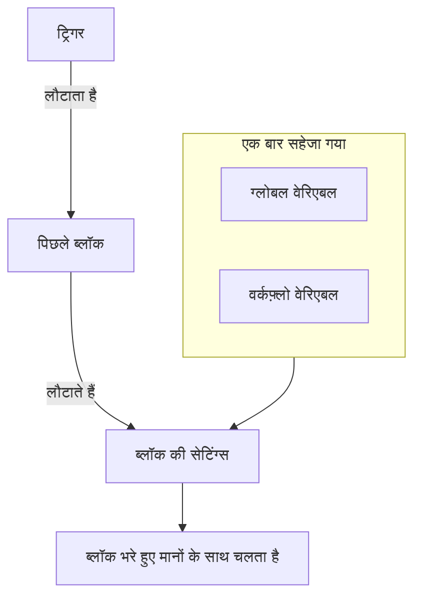
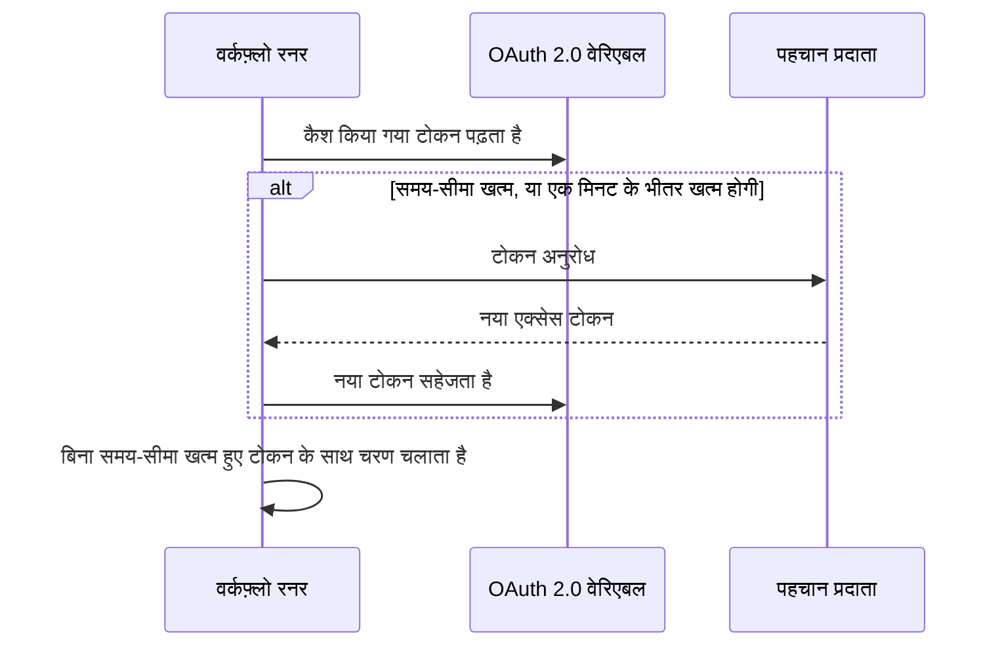

# वर्कफ़्लो वेरिएबल

वेरिएबल वह तरीका हैं जिससे डेटा किसी वर्कफ़्लो में आगे बढ़ता है: ट्रिगर से पहले ब्लॉक तक, एक ब्लॉक से अगले तक, और उन मानों से जिन्हें आप एक बार सहेजते हैं, हर उस ब्लॉक तक जिसे उनकी ज़रूरत है। किसी ब्लॉक की सेटिंग दोहरे कर्ली ब्रेसेस वाले संदर्भ से कोई मान पढ़ती है, और रनर ब्लॉक के चलने से ठीक पहले उसे भर देता है।

| मान                            | यह कहाँ से आता है                                                    | ब्लॉक इसे कैसे पढ़ता है                               |
| ------------------------------ | -------------------------------------------------------------------- | ----------------------------------------------------- |
| **ग्लोबल वेरिएबल**             | **वर्कफ़्लो → ग्लोबल वेरिएबल** के अंतर्गत सहेजा गया                 | `{{global.variables.NAME}}`                          |
| **वर्कफ़्लो वेरिएबल**          | किसी एक वर्कफ़्लो के **वर्कफ़्लो वेरिएबल** पेज पर सहेजा गया          | `{{local.variables.NAME}}`                           |
| **किसी पिछले ब्लॉक का मान**    | इस रन में ट्रिगर या किसी पिछले ब्लॉक ने जो लौटाया                    | `{{local.components.BLOCK_ID.returnValues.VALUE_ID}}` |



आपको संदर्भ खुद कम ही टाइप करना पड़ता है। किसी सेटिंग के अंत में **{ }** पर क्लिक करें, या उसमें `{{` टाइप करें, और सूची से मान चुनें। देखें [पिछले ब्लॉक के मान इस्तेमाल करना](/docs/workflows/authoring#पिछले-ब्लॉक-के-मान-इस्तेमाल-करना)।

## ग्लोबल वेरिएबल

पूरे प्रोजेक्ट के मान जिन्हें आप एक बार सहेजते हैं और हर वर्कफ़्लो में दोबारा इस्तेमाल करते हैं: API कुंजियाँ, URL, चैनल के नाम — कुछ भी जिसे आप दस अलग-अलग वर्कफ़्लो में कॉपी नहीं करना चाहते।

:::steps
### ग्लोबल वेरिएबल खोलें

**वर्कफ़्लो → ग्लोबल वेरिएबल** पर जाएं और **वर्कफ़्लो वेरिएबल बनाएँ** पर क्लिक करें।

### वेरिएबल को नाम दें

**वेरिएबल** चरण में भरें:

- **नाम** — जिससे आप इसका संदर्भ देते हैं। कम से कम दो अक्षर, कोई स्पेस नहीं, और सिर्फ़ अक्षर, अंक, हाइफ़न और अंडरस्कोर। `UPPER_SNAKE_CASE` एक अच्छी आदत है, क्योंकि यह आपके ब्लॉक में अलग से दिखता है।
- **विवरण** — वैकल्पिक, मुक्त टेक्स्ट जो आपको याद दिलाए कि यह किसलिए है।

**अगला** पर क्लिक करें।

### इसे एक मान दें

**मान** चरण में भरें:

- **सामग्री** — मान खुद। यह लंबे टेक्स्ट का फ़ील्ड है, इसलिए कई पंक्तियों वाले मान काम करते हैं।
- **रहस्य** — चालू होने पर मान रन लॉग और चरण ट्रेस से हटा दिया जाता है।

**वर्कफ़्लो वेरिएबल बनाएँ** पर क्लिक करें। उससे पहले नाम या विवरण बदलने के लिए, फ़ॉर्म के बगल की चरण सूची (चौड़ी स्क्रीन पर दिखती है) में **वेरिएबल** पर क्लिक करें; दोनों चरणों में आपने जो टाइप किया, वह बना रहता है।
:::

किसी भी वर्कफ़्लो में ग्लोबल वेरिएबल ऐसे इस्तेमाल करें:

```text
{{global.variables.NAME}}
```

उदाहरण के लिए, अगर आपने अपनी PagerDuty कुंजी `PAGERDUTY_KEY` के रूप में सहेजी है, तो कोई भी ब्लॉक इसे `{{global.variables.PAGERDUTY_KEY}}` के रूप में इस्तेमाल कर सकता है — एडिटर संदर्भ सहेजता है, और वर्कफ़्लो का लॉगिंग हल किया गया सीक्रेट मान हटा देता है।

सूची हर वेरिएबल का नाम और विवरण दिखाती है। वेरिएबल का पेज खोलने के लिए किसी पंक्ति में **देखें** पर क्लिक करें। यह दिखाता है कि वेरिएबल स्थिर है या OAuth 2.0, और बाकी सब यहीं होता है:

| बटन                                        | यह क्या करता है                                                                                                                                  |
| ------------------------------------------ | ------------------------------------------------------------------------------------------------------------------------------------------------ |
| **वेरिएबल संपादित करें**                   | नाम, विवरण और — ऐसे स्थिर वेरिएबल के लिए जो अभी सीक्रेट नहीं है — सीक्रेट का निशान बदलता है। एक बार सीक्रेट बन गया वेरिएबल सीक्रेट ही रहता है। |
| **Update Content**                         | किसी स्थिर मान को बदलता है। सहेजी गई सामग्री वापस पढ़ी नहीं जा सकती, इसलिए आप नया मान पूरा टाइप करते हैं।                                      |
| **Use in Workflows**                       | आपके ब्लॉक में चिपकाने वाला सटीक संदर्भ, कॉपी बटन के साथ दिखाता है।                                                                             |
| **वर्कफ़्लो वेरिएबल हटाएँ**                | आपसे पुष्टि माँगने के बाद इसे हटाता है। पुष्टि में वेरिएबल का नाम होता है, ताकि आप जाँच सकें कि यह सही वाला है।                                 |

इसके बजाय **OAuth 2.0 एक्सेस टोकन** के लिए वेरिएबल बनाने के लिए, **वर्कफ़्लो वेरिएबल बनाएँ** के बगल वाला **अधिक** मेनू (**⋯**) खोलें और **Create OAuth 2.0 Variable** चुनें। OAuth 2.0 वेरिएबल का नीचे [अपना खंड](#oauth-20-वेरिएबल-ऐसे-टोकन-जो-खुद-रिफ्रेश-होते-हैं) है। सहेजने के बाद किसी वेरिएबल का प्रकार नहीं बदला जा सकता।

आप API से भी कोई वेरिएबल अपडेट कर सकते हैं, जो [इस पेज के अंत में](#किसी-वर्कफ़्लो-से-वेरिएबल-अपडेट-करना) बताया गया है। ग्लोबल और वर्कफ़्लो वेरिएबल Growth प्लान की सुविधा हैं।

## स्थानीय वर्कफ़्लो वेरिएबल

ऐसे वेरिएबल जो किसी एक वर्कफ़्लो के होते हैं, उस वर्कफ़्लो के मेनू में **वर्कफ़्लो वेरिएबल** के अंतर्गत प्रबंधित। ये ग्लोबल वेरिएबल की तरह ही काम करते हैं: **वर्कफ़्लो वेरिएबल बनाएँ** एक स्थिर वेरिएबल बनाता है, **अधिक** मेनू (**⋯**) एक OAuth 2.0 वेरिएबल बनाता है, और **देखें** किसी वेरिएबल का पेज खोलता है। इनका संदर्भ ऐसे दें:

```text
{{local.variables.NAME}}
```

इसे ऐसे मान के लिए इस्तेमाल करें जिसकी ज़रूरत सिर्फ़ उसी वर्कफ़्लो को है, जैसे किसी टेम्पलेट का Slack वेबहुक URL। जो टेम्पलेट सेटिंग्स पूछते हैं, वे उन्हें वर्कफ़्लो वेरिएबल के रूप में सहेजते हैं, ताकि आप बाद में ब्लॉक संपादित किए बिना उन्हें बदल सकें।

## OAuth 2.0 वेरिएबल (ऐसे टोकन जो खुद रिफ्रेश होते हैं)

किसी स्थिर वेरिएबल में चिपकाया गया bearer टोकन तब तक काम करता है जब तक उसकी समय-सीमा खत्म न हो, आम तौर पर एक घंटे के भीतर। उसके बाद, उसे इस्तेमाल करने वाला हर रन `401 Unauthorized` के साथ विफल होता है, जब तक कोई नया न चिपकाए। **OAuth 2.0 एक्सेस टोकन** के लिए वेरिएबल टोकन के बजाय वह सहेजता है जिसकी OAuth टोकन एक्सचेंज को ज़रूरत है, और OneUptime टोकन को ताज़ा रखता है।

आप इसे बिल्कुल किसी दूसरे वेरिएबल की तरह इस्तेमाल करते हैं:

```http
Authorization: Bearer {{global.variables.CRM_API_TOKEN}}
```

### टोकन कैसे वैध बना रहता है



- जब कोई वर्कफ़्लो पहली बार वेरिएबल इस्तेमाल करता है, तो OneUptime आपके पहचान प्रदाता के टोकन एंडपॉइंट से एक्सेस टोकन माँगता है और उसे सहेजता है।
- वेरिएबल का संदर्भ देने वाले हर चरण से पहले रनर टोकन जाँचता है। अगर उसकी समय-सीमा खत्म हो गई है, या अगले एक मिनट में खत्म होगी, तो चरण चलने से पहले नया टोकन लाया जाता है। घटक को हमेशा ऐसा टोकन मिलता है जिसकी समय-सीमा खत्म नहीं हुई, चाहे वेरिएबल कितनी भी देर से बेकार पड़ा हो, और रन कितनी भी देर से चल रहा हो।
- सिर्फ़ वे चरण जो सचमुच वेरिएबल का संदर्भ देते हैं, रिफ्रेश शुरू करते हैं। जो रन कभी कोई वेरिएबल इस्तेमाल नहीं करता, वह कभी उसका टोकन नहीं लाता और उस प्रदाता के बंद होने की वजह से विफल नहीं होता।
- जब कई रन को एक साथ नए टोकन की ज़रूरत होती है, तो उनमें से एक उसे लाता है और बाकी उसे इस्तेमाल करते हैं।
- अगर प्रदाता यह नहीं बताता कि टोकन की समय-सीमा कब खत्म होगी (कोई `expires_in` नहीं, और टोकन `exp` दावे वाला JWT नहीं है), तो OneUptime हर रन में एक बार नया टोकन लाता है और उसे उस रन के चरणों में साझा करता है।

### ग्रांट प्रकार

| ग्रांट प्रकार                  | किसके लिए इस्तेमाल करें                                                                                                                                                                                                                             |
| ------------------------------ | --------------------------------------------------------------------------------------------------------------------------------------------------------------------------------------------------------------------------------------------------- |
| **Client Credentials**         | OneUptime आपके एप्लिकेशन के रूप में साइन इन करता है। सर्वर-से-सर्वर API के लिए सामान्य विकल्प, जैसे Microsoft Graph, Auth0 या Okta API, या Keycloak के पीछे की कोई आंतरिक सेवा।                                                               |
| **रिफ्रेश टोकन**               | किसी उपयोगकर्ता की ओर से सौंपी गई पहुँच। एप्लिकेशन को एक बार अधिकृत करें (उदाहरण के लिए अपने प्रदाता के OAuth playground में या Postman से), और मिला refresh token चिपकाएं। OneUptime इसे एक्सेस टोकन से बदलता है और अगर आपका प्रदाता refresh token घुमाता है तो हर नया सहेजता है। बिना क्लाइंट सीक्रेट वाला सार्वजनिक क्लाइंट भी काम करता है। |

### एक बनाएं

**Create OAuth 2.0 Variable** हर चरण में एक चीज़ पूछता है:

1. **वेरिएबल**: वह नाम जिससे वर्कफ़्लो इसका संदर्भ देते हैं, और एक विवरण।
2. **प्रदाता**: अपना **पहचान प्रदाता** चुनें, और OneUptime उसका **टोकन URL** भर देता है:

   | पहचान प्रदाता | भरा जाने वाला टोकन URL |
   |---|---|
   | Microsoft Entra ID | `https://login.microsoftonline.com/{tenant-id}/oauth2/v2.0/token` |
   | Google | `https://oauth2.googleapis.com/token` |
   | Okta | `https://{your-domain}/oauth2/default/v1/token` |
   | Auth0 | `https://{your-domain}/oauth/token` |

   कर्ली ब्रेसेस वाले हिस्से को अपने मान से बदलें, जैसे अपनी डायरेक्टरी (टेनेंट) ID या अपना Okta डोमेन। जब तक URL में वह बचा है, फ़ॉर्म आगे नहीं बढ़ता। किसी भी दूसरे प्रदाता के लिए **अन्य प्रदाता** चुनें और उसका टोकन एंडपॉइंट खुद दें। फिर **ग्रांट प्रकार** चुनें। Google चुनने पर **रिफ्रेश टोकन** चुना जाता है, क्योंकि Google के OAuth क्लाइंट Client Credentials इस्तेमाल नहीं कर सकते। प्रदाता सिर्फ़ फ़ॉर्म भरता है; वह वेरिएबल के साथ सहेजा नहीं जाता।
3. **क्रेडेंशियल**: आपने प्रदाता के पास जो एप्लिकेशन पंजीकृत किया, उसका **क्लाइंट ID** और **क्लाइंट सीक्रेट**, और Refresh Token ग्रांट प्रकार के लिए **रिफ्रेश टोकन**। Refresh Token ग्रांट प्रकार वाला सार्वजनिक क्लाइंट क्लाइंट सीक्रेट खाली छोड़ सकता है।
4. **उन्नत**, सब वैकल्पिक:
   - **दायरा**: स्पेस से अलग। प्रदाता के डिफ़ॉल्ट दायरे पाने के लिए खाली छोड़ें। Client Credentials के लिए Microsoft Entra ID को `/.default` पर खत्म होने वाला दायरा चाहिए (जैसे `https://graph.microsoft.com/.default`), और Okta को एक कस्टम दायरा चाहिए।
   - **अतिरिक्त पैरामीटर**: टोकन अनुरोध के लिए अतिरिक्त फ़ॉर्म फ़ील्ड, जैसे Auth0 के लिए `audience` (Client Credentials के लिए ज़रूरी) या Azure AD v1 के लिए `resource`। जो कोई भी वेरिएबल पढ़ सकता है वह इन्हें पढ़ सकता है, इसलिए यहाँ सीक्रेट न रखें।
   - **क्लाइंट प्रमाणीकरण**: क्लाइंट ID और सीक्रेट HTTP Basic हेडर में (डिफ़ॉल्ट) भेजे जाएं या अनुरोध बॉडी में। अगर आपका प्रदाता `invalid_client` जवाब देता है, तो दूसरा आज़माएं।

कुछ फ़ील्ड के नीचे फ़ॉर्म आपके चुने प्रदाता के लिए मदद की एक पंक्ति जोड़ता है, उदाहरण के लिए Microsoft Entra ID आपकी टेनेंट ID कहाँ दिखाता है, और यह कि उसका क्लाइंट सीक्रेट सीक्रेट का **Value** है, उसका **Secret ID** नहीं।

जब आप नया OAuth 2.0 वेरिएबल सहेजते हैं, तो OneUptime तुरंत उसका पहला टोकन लाता है और आपको बताता है कि प्रदाता ने क्या जवाब दिया। सीक्रेट या URL में टाइपिंग की गलती तभी सामने आ जाती है, घंटों बाद किसी विफल रन में नहीं। टोकन लाना वेरिएबल में लिखता है, इसलिए इसके लिए वर्कफ़्लो वेरिएबल संपादित करने की अनुमति चाहिए; अगर आप वेरिएबल बना सकते हैं लेकिन संपादित नहीं कर सकते, तो वेरिएबल इस्तेमाल करने वाला पहला वर्कफ़्लो रन उसका टोकन लाता है।

वेरिएबल के पेज (उसकी पंक्ति में **देखें** पर क्लिक करें) पर एक **OAuth 2.0 Settings** कार्ड है। **सेटिंग्स संपादित करें** उन्हीं **प्रदाता** (टोकन URL), **क्रेडेंशियल** (क्लाइंट ID) और **उन्नत** (दायरा, अतिरिक्त पैरामीटर, क्लाइंट प्रमाणीकरण) चरणों से गुज़रता है। **अगला** आगे बढ़ता है, और **परिवर्तन सहेजें** आख़िरी चरण पर है। हर चरण पहले से भरा है, इसलिए फ़ॉर्म के बगल की चरण सूची उनमें से कोई भी खोलती है: कोई एक सेटिंग उसके चरण पर बदलें, फिर आख़िरी चरण खोलें और सहेजें। सहेजने के बाद ग्रांट प्रकार तय हो जाता है।

### एक्सेस टोकन कार्ड

OAuth 2.0 वेरिएबल के पेज पर **एक्सेस टोकन** कार्ड इनमें से कोई एक स्थिति दिखाता है:

| स्थिति                       | इसका मतलब                                                                                                                            |
| ---------------------------- | ------------------------------------------------------------------------------------------------------------------------------------ |
| **Valid**                    | कैश किए गए टोकन की समय-सीमा अभी खत्म नहीं हुई।                                                                                       |
| **समय-सीमा खत्म**            | ऐसे वेरिएबल के लिए सामान्य जिसे हाल में किसी वर्कफ़्लो ने इस्तेमाल नहीं किया। इसे इस्तेमाल करने वाला अगला रन नया टोकन लाता है।        |
| **अभी तक नहीं लाया गया**     | वेरिएबल बनने या उसकी सेटिंग्स बदलने के बाद से कोई टोकन नहीं लाया गया।                                                                |
| **No expiry reported**       | प्रदाता ने नहीं बताया कि टोकन की समय-सीमा कब खत्म होगी, इसलिए हर रन नया टोकन लाता है।                                                |
| **Refresh failed**           | टोकन लाने की पिछली कोशिश विफल रही। प्रदाता का कारण पूरा दिखाया जाता है, यह कब हुआ इसके साथ। अगला सफल रिफ्रेश इसे हटा देता है।       |

स्थिति के नीचे **अभी रिफ्रेश करें** तुरंत नया टोकन लाता है। कोई वर्कफ़्लो चलाए बिना नई सेटिंग्स जाँचने के लिए इसका इस्तेमाल करें। **OAuth 2.0 Settings** कार्ड पर **Update Credentials** क्लाइंट सीक्रेट या refresh token बदलता है, फिर उनसे एक टोकन लाता है। कोई सेटिंग (टोकन URL, क्लाइंट ID, दायरा वगैरह) बदलने से कैश किया गया टोकन हटा दिया जाता है, ताकि अगला रन नई सेटिंग्स से टोकन लाए।

### जब प्रदाता मना कर दे

जिस चरण को टोकन चाहिए था, वह चलने से पहले विफल होता है, और रन का लॉग वेरिएबल का नाम लेता है और प्रदाता का जवाब उद्धृत करता है, उदाहरण के लिए `Could not get an OAuth 2.0 access token for {{global.variables.CRM_API_TOKEN}}: The token endpoint refused the request (HTTP 400): invalid_grant - Token has been expired or revoked.` यही कारण वेरिएबल के **एक्सेस टोकन** कार्ड पर भी दिखता है। Refresh Token वेरिएबल पर `invalid_grant` का मतलब लगभग हमेशा यह होता है कि refresh token की खुद की समय-सीमा खत्म हो गई है या उसे रद्द कर दिया गया है, और उपाय **Update Credentials** है।

अगर रिफ्रेश तब विफल होता है जब कैश किए गए टोकन की समय-सीमा असल में अभी खत्म नहीं हुई (वह सिर्फ़ एक मिनट के मार्जिन के भीतर था), तो चरण कैश किए गए टोकन के साथ आगे बढ़ता है, और लॉग यह बताता है।

### सुरक्षा

- OAuth 2.0 वेरिएबल हमेशा सीक्रेट होते हैं। रन लॉग और चरण ट्रेस में एक्सेस टोकन `[REDACTED]` से बदल दिया जाता है, रन के बीच में बदला गया टोकन भी।
- क्लाइंट सीक्रेट, refresh token और एक्सेस टोकन डेटाबेस में एन्क्रिप्टेड होते हैं और API या डैशबोर्ड से कभी वापस पढ़े नहीं जा सकते। **अभी रिफ्रेश करें** बताता है कि नए टोकन की समय-सीमा कब खत्म होगी, टोकन कभी नहीं।
- टोकन URL `http` या `https` होना चाहिए। लूपबैक, लिंक-लोकल और क्लाउड मेटाडेटा पतों पर अनुरोध अस्वीकार किए जाते हैं। OneUptime Cloud पर निजी नेटवर्क पते भी अस्वीकार किए जाते हैं। स्व-होस्टेड इंस्टॉलेशन अपने नेटवर्क के पहचान प्रदाता तक पहुँच सकते हैं। OneUptime टोकन अनुरोधों पर रीडायरेक्ट का पालन नहीं करता, इसलिए टोकन URL उसी पते पर रखें जिस पर एंडपॉइंट वास्तव में जवाब देता है। टोकन अनुरोध 20 सेकंड बाद हार मान लेता है।

### किसी मौजूदा स्थिर टोकन को OAuth 2.0 पर ले जाना

सहेजने के बाद किसी वेरिएबल का प्रकार तय हो जाता है। स्थिर वेरिएबल हटाएं, और **उसी नाम** से एक OAuth 2.0 वेरिएबल बनाएं। वर्कफ़्लो वेरिएबल का संदर्भ नाम से देते हैं, इसलिए वे बिना किसी बदलाव के नया वेरिएबल उठा लेते हैं।

## घटक आउटपुट (पिछले ब्लॉक से आया डेटा)

हर ट्रिगर और घटक किसी रन के दौरान आउटपुट दे सकता है। संदर्भ खुद टाइप करने के बजाय किसी सेटिंग में **{ }** बटन से, या उसमें `{{` टाइप करके डालें — इससे वही सटीक ID डलते हैं जिनकी रनर को उम्मीद है, और मान ब्लॉक और मान का नाम बताने वाली चिप के रूप में दिखता है।

आप उस ब्लॉक से भी शुरू कर सकते हैं जो मान बनाता है: उसकी सेटिंग्स **Returns** के अंतर्गत हर आउटपुट को सटीक संदर्भ और उसे कॉपी करने के बटन के साथ दिखाती हैं।

किसी पिछले ब्लॉक के आउटपुट का संदर्भ ऐसे दें:

```text
{{local.components.COMPONENT_ID.returnValues.FIELD_ID}}
```

`COMPONENT_ID` ब्लॉक का **Identifier** है — ब्लॉक पर दिखने वाला छोटा ID, उस पर लिखा नाम नहीं। नए ब्लॉक को `api-get-1` जैसा ID मिलता है, और आप ब्लॉक के **ID** खंड में उसका नाम बदल सकते हैं। नाम बदलने पर उसकी ओर पहले से इशारा करने वाला हर संदर्भ टूट जाता है, ठीक वैसे ही जैसे वेरिएबल का नाम बदलने पर। `FIELD_ID` मान का ID है, और उसके बाद का पथ किसी JSON मान के अंदर का फ़ील्ड पढ़ता है।

| ऐसे ब्लॉक के बाद…                                         | पढ़ें                                                                                  |
| --------------------------------------------------------- | -------------------------------------------------------------------------------------- |
| `lookup-user` ID वाला **API** ब्लॉक                       | उसका स्थिति कोड: `{{local.components.lookup-user.returnValues.response-status}}`। उसकी बॉडी: `{{local.components.lookup-user.returnValues.response-body}}`। |
| `transform` ID वाला **Run Custom JavaScript** ब्लॉक       | जो उसने लौटाया: `{{local.components.transform.returnValues.returnValue}}`।             |
| `incident-on-create-1` ID वाला **On Create Incident** ट्रिगर | घटना का शीर्षक: `{{local.components.incident-on-create-1.returnValues.model.title}}`। रिकॉर्ड ट्रिगर एक मान, `model`, लौटाते हैं, जिसके अंदर आप जाते हैं। |

ब्लॉक के मान सिर्फ़ मौजूदा रन के दौरान होते हैं। हर नया रन शुरू से शुरू होता है।

## वेरिएबल कहाँ काम करते हैं

लगभग हर टेक्स्ट फ़ील्ड वेरिएबल स्वीकार करता है:

- API ब्लॉक का URL।
- Slack, Teams, Discord, Telegram, IRC, Email का संदेश टेक्स्ट।
- ईमेल का विषय और बॉडी।
- हेडर और बॉडी फ़ील्ड (स्ट्रिंग मानों के अंदर)।
- **If / Else** ब्लॉक के दोनों पक्ष।

JSON फ़ील्ड में — रिकॉर्ड घटकों पर **Data (JSON Object)**, **Query** और **Select Fields**, API ब्लॉक का **Request Body**, **Run Custom JavaScript** पर **Arguments** — कोई संदर्भ इस हिसाब से भरा जाता है कि वह कहाँ है:

- **उद्धरण चिह्नों के अंदर, यह टेक्स्ट है।** `{"title": "Down: {{local.components.ci-webhook.returnValues.request-body.service}}"}` मान को स्ट्रिंग के अंदर रखता है। मान में उद्धरण चिह्न, बैकस्लैश और नई पंक्तियाँ एस्केप की जाती हैं, ताकि JSON वैध रहे और मान एक ही स्ट्रिंग रहे।
- **अकेले होने पर, यह खुद मान है।** `{"customFields": {{local.components.transform.returnValues.returnValue}}}` पूरा ऑब्जेक्ट डालता है, सूची सूची ही रहती है, और संख्या संख्या ही। ऐसा टेक्स्ट जो खुद JSON है — `5`, `true`, या ऐसा ऑब्जेक्ट जिसे किसी ब्लॉक ने JSON टेक्स्ट के रूप में लौटाया — उसी मान के रूप में डाला जाता है। बाकी कोई भी टेक्स्ट स्ट्रिंग के रूप में डाला जाता है।

किसी कुंजी के उद्धरण चिह्नों के अंदर का संदर्भ भी टेक्स्ट है। अगर आपको कोई संरचना गतिशील रूप से बनानी है, तो उसे **Run Custom JavaScript** ब्लॉक से बनाएं और उसका आउटपुट अगले ब्लॉक को दें।

**Run Custom JavaScript** ब्लॉक को वेरिएबल अपने-आप नहीं मिलते — सैंडबॉक्स में कुछ भी नहीं डाला जाता। ब्लॉक के **Arguments** JSON फ़ील्ड में `{{global.variables.NAME}}` (या कोई भी घटक संदर्भ) रखें; वे मान स्क्रिप्ट चलने से पहले भरे जाते हैं और `args` के रूप में पहुँचते हैं।

## Arrays पर लूप करना

किसी टेक्स्ट फ़ील्ड में आप `{{#each path}}…{{/each}}` से किसी सूची के हर आइटम के लिए टेक्स्ट का एक टुकड़ा दोहरा सकते हैं। ब्लॉक के अंदर `{{property}}` मौजूदा आइटम से पढ़ता है, `{{@index}}` 0 से उसकी स्थिति है, और साधारण मानों की सूची में `{{this}}` खुद आइटम है। `{{#each}}` ब्लॉक के अंदर के नाम ट्रिम किए जाते हैं, इसलिए वहाँ अतिरिक्त स्पेस से कोई नुकसान नहीं — बाकी हर जगह से अलग।

उदाहरण के लिए, यह **Message Text** किसी वेबहुक के भेजे हर अलर्ट की सूची बनाता है:

```text title="Message Text"
{{#each local.components.ci-webhook.returnValues.request-body.alerts}}
- {{@index}}: {{name}} is {{status}}
{{/each}}
```

## उदाहरण

### किसी वेबहुक से पेलोड बनाना

एक वेबहुक `{ "service": "checkout", "status": "failed" }` जैसी बॉडी के साथ आता है। इसे OneUptime घटना में बदलने के लिए:

1. `ci-webhook` ID वाला एक **वेबहुक** ट्रिगर।
2. एक **If / Else** ब्लॉक: **Value to check** वेबहुक के Request Body का `status` फ़ील्ड है (`{{local.components.ci-webhook.returnValues.request-body.status}}`), **Comparison** है **is equal to**, और **Compare with** है `failed`।
3. **Yes** शाखा से एक **Create One Incident** ब्लॉक, जिसमें:
   - शीर्षक: `CI build failed: {{local.components.ci-webhook.returnValues.request-body.service}}`
   - विवरण: `See {{local.components.ci-webhook.returnValues.request-body.url}} for the logs.`

### API कॉल में सीक्रेट इस्तेमाल करना

PagerDuty कॉल करने वाला एक वर्कफ़्लो:

1. `PAGERDUTY_KEY` को सीक्रेट ग्लोबल वेरिएबल के रूप में सहेजें।
2. **API** ब्लॉक पर `Authorization` हेडर को `Token token={{global.variables.PAGERDUTY_KEY}}` पर सेट करें।

कुंजी वर्कफ़्लो और लॉग से बाहर रहती है।

### दो API कॉल जोड़ना

पहली कॉल आपको वह ID देती है जिसकी दूसरी को ज़रूरत है:

1. **API** घटक `lookup-order`: उसके **URL** में `/orders?email=` के बाद, हाथ से चलाए गए ट्रिगर का JSON `email` पथ के साथ डालने के लिए **{ }** इस्तेमाल करें।
2. **API** घटक `cancel-order`: `POST /orders/{{local.components.lookup-order.returnValues.response-body.id}}/cancel`।

अगर `lookup-order` विफल होता है, तो **Success** के बजाय उसका **Error** आउटपुट चलता है। इसे किसी Email या Slack ब्लॉक से जोड़ें, ताकि विफलताओं पर ध्यान जाए।

## किसी वर्कफ़्लो से वेरिएबल अपडेट करना

एक आम तरीका है किसी अनुसूची पर कोई क्रेडेंशियल घुमाना: किसी तीसरे पक्ष से नया टोकन लाना और फिर उसे वेरिएबल में वापस सहेजना, ताकि अगला रन उसे इस्तेमाल करे। यह OneUptime API कॉल करने वाले **API** ब्लॉक से करें।

अगर क्रेडेंशियल OAuth 2.0 एक्सेस टोकन है, तो आपको यह खुद बनाने की ज़रूरत नहीं। एक [OAuth 2.0 वेरिएबल](#oauth-20-वेरिएबल-ऐसे-टोकन-जो-खुद-रिफ्रेश-होते-हैं) टोकन खुद लाता है और रिफ्रेश करता है।

`ApiKey` हेडर के साथ `PUT /api/workflow-variable/<variable-id>` भेजें और — यहीं लोग गलती करते हैं — जो फ़ील्ड बदलने हैं उन्हें **एक `data` ऑब्जेक्ट में लपेटकर**:

```json title="Request Body"
{
  "data": {
    "content": "{{local.components.get-token.returnValues.response-body.access_token}}"
  }
}
```

`data` लपेटन के बिना सपाट बॉडी 400 के साथ अस्वीकार हो जाती है। सिर्फ़ वे फ़ील्ड भेजें जिन्हें आप सचमुच बदलना चाहते हैं; `name` और `description` को पेलोड से बाहर रखा जा सकता है।

API कुंजी के पास **Edit Workflow Variables** होना चाहिए। पढ़ने की कोई अनुमति नहीं चाहिए — अपडेट पंक्ति को वापस नहीं पढ़ता।

दो बातों का ध्यान रखें:

- **जिस वेरिएबल का आप संदर्भ देते हैं, उसका नाम न बदलें।** `name`, `{{local.variables.NAME}}` का हिस्सा है। इसे बदलने से हर मौजूदा संदर्भ हल नहीं होता, और हल न हुआ संदर्भ शाब्दिक टेक्स्ट के रूप में आगे जाता है — देखें [फँसाने वाली बातें](#फँसाने-वाली-बातें)।
- **वेरिएबल इस तरह लिखा जा सकता है, लेकिन कभी वापस पढ़ा नहीं जा सकता।** API पर हर वेरिएबल का `content` सिर्फ़ लिखने के लिए है, सीक्रेट हो या नहीं। यही वेरिएबल को घूमने वाले टोकन रखने की सुरक्षित जगह बनाता है। इसे सीक्रेट चिह्नित करने से मान रन लॉग और चरण ट्रेस से भी बाहर रहता है।

## फँसाने वाली बातें

- **{ } इस्तेमाल करें (या `{{` टाइप करें)।** यह वही सटीक घटक, लौटाए गए मान और वेरिएबल ID डालता है जिनकी रनर को उम्मीद है, और सिर्फ़ वे मान देता है जो ब्लॉक के चलने पर मौजूद होंगे।
- **वेरिएबल नाम बड़े-छोटे अक्षरों में फ़र्क करते हैं।** `{{global.variables.MyKey}}` और `{{global.variables.mykey}}` अलग हैं।
- **जो संदर्भ हल नहीं हो सकता, वह जैसा है वैसा छोड़ दिया जाता है, खाली नहीं होता।** किसी ऐसी चीज़ का संदर्भ देना जो मौजूद नहीं, त्रुटि नहीं है, और न ही यह आपको खाली स्ट्रिंग देता है: कर्ली ब्रेसेस वैसे ही आगे जाते हैं, इसलिए गलत वर्तनी वाले चरण ID के साथ `{{local.components.api-get-1.returnValues.body}}` शब्दशः आपके Slack संदेश, URL या अनुरोध बॉडी में पहुँच जाता है, और रन फिर भी **Executed** बताता है। रन का **चरण** टैब उस चरण पर एक चेतावनी दिखाता है जिसमें हर फिसला संदर्भ बताया जाता है, और जिस सेटिंग में वह था उसे **Did not resolve** चिह्नित करता है; रन के लॉग में भी वही चेतावनी पंक्ति होती है।
- **समस्या पैनल वेरिएबल नाम जाँच नहीं सकता।** यह सहेजने से पहले ऐसे घटक संदर्भ चिह्नित करता है जिनका मेल नहीं बैठता — अज्ञात चरण ID, अज्ञात लौटाया गया मान, अमान्य रूट। यह नहीं देख सकता कि कोई वेरिएबल मौजूद है या नहीं। ब्लॉक की सेटिंग्स देख सकती हैं: किसी गायब वेरिएबल का संदर्भ वहाँ नारंगी चिप के रूप में दिखता है। नहीं तो, नाम बदला गया वेरिएबल सिर्फ़ रन के लॉग से पकड़ में आता है।
- **कर्ली ब्रेसेस के अंदर की स्पेस ट्रिम नहीं की जाती।** `{{ local.variables.NAME }}`, `{{local.variables.NAME}}` से अलग लुकअप है और कभी हल नहीं होता। एकमात्र अपवाद `{{#each}}` ब्लॉक के अंदर है, जहाँ नाम ट्रिम किए जाते हैं।

## अगले कदम

:::cards
- [घटक](/docs/workflows/components): हर ब्लॉक को क्या चाहिए और वह क्या लौटाता है।
- [रन](/docs/workflows/runs-and-logs): देखें कि किसी रन में हर संदर्भ किस मान में बदला।
- [कॉन्फ़िगरेशन और सुरक्षा](/docs/workflows/configuration#secrets): सीक्रेट को ब्लॉक, निर्यात और लॉग से बाहर रखें।
:::
