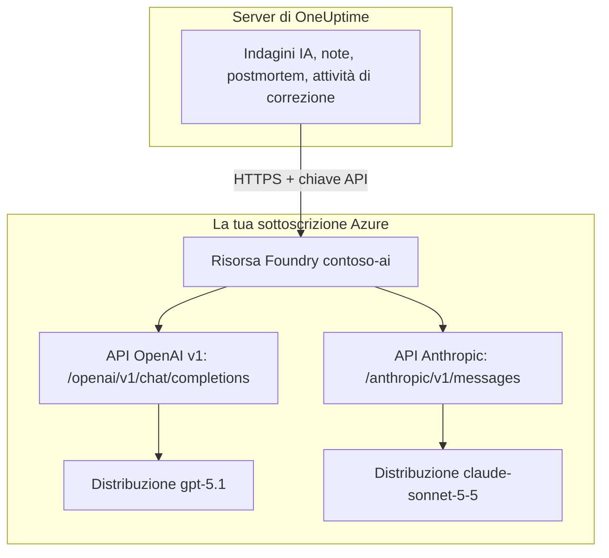

# Microsoft Foundry e Azure OpenAI

Esegui le funzionalità di IA di OneUptime su modelli che distribuisci in Microsoft Foundry (in precedenza Azure AI Foundry) o in Azure OpenAI. OneUptime invia ogni richiesta direttamente alla tua risorsa nella tua sottoscrizione Azure, quindi prompt e risposte vengono elaborati dalla distribuzione che hai scelto, dove l'hai scelta. Questa pagina ti porta da una sottoscrizione vuota a un provider funzionante: la risorsa Azure, la distribuzione del modello, endpoint e chiave, le impostazioni di OneUptime, la rete e cosa fare quando una richiesta non riesce.

:::cards
- [Configurare Azure](#configurare-microsoft-foundry): Creare una risorsa, distribuire un modello, copiarne endpoint e chiave.
- [Collegare OneUptime](#collegare-oneuptime): Quattro campi nelle impostazioni del progetto, poi il pulsante Test.
- [Self-hosted](#configurare-unistanza-self-hosted-con-variabili-dambiente): Un provider per tutti i progetti, da variabili d'ambiente.
- [Risoluzione dei problemi](#risoluzione-dei-problemi): 401, 403, una distribuzione mancante, una api-version.
:::

## Come funziona

OneUptime chiama la tua risorsa Foundry tramite HTTPS dal server di OneUptime, mai dal browser delle persone. Ogni richiesta porta una delle chiavi API della risorsa e indica la distribuzione che deve rispondere.



Un solo tipo di provider, **Azure OpenAI / Microsoft Foundry**, copre ogni distribuzione della risorsa. L'URL di base dice a OneUptime quale API chiamare:

| Modello che distribuisci | API chiamata da OneUptime | URL di base |
| --- | --- | --- |
| Modelli OpenAI, come GPT-5.1 e GPT-4.1 | OpenAI v1 chat completions | `https://contoso-ai.openai.azure.com/openai/v1` |
| Foundry Models con chat completions, come DeepSeek e Grok | OpenAI v1 chat completions | `https://contoso-ai.services.ai.azure.com/openai/v1` |
| Claude | Anthropic Messages | `https://contoso-ai.services.ai.azure.com/anthropic` |

> [!IMPORTANT]
> Le funzionalità di IA di OneUptime chiamano strumenti: mentre lavorano interrogano i tuoi monitor, incidenti e dati di telemetria. Distribuisci un modello che supporti la chiamata di strumenti (function calling). Il pulsante **Test** del provider lo verifica per te.

## Prima di iniziare

Ti servono una sottoscrizione Azure, un ruolo che ti permetta di creare e leggere la risorsa e un ruolo di OneUptime che possa aggiungere provider LLM.

| Per | Cosa ti serve in Azure |
| --- | --- |
| Creare la risorsa | **Owner** o **Contributor** sul gruppo di risorse, oppure **Foundry Account Owner** |
| Distribuire un modello | **Owner** o **Contributor** sul gruppo di risorse, oppure **Foundry Owner** o **Foundry Account Owner** sulla risorsa. Claude richiede anche il permesso di sottoscrivere offerte di Azure Marketplace |
| Leggere le chiavi della risorsa | Un ruolo con `Microsoft.CognitiveServices/accounts/listKeys/action`, come **Owner**, **Contributor** o **Cognitive Services Contributor** |

OneUptime in sé non ha bisogno di alcun ruolo Azure. Una chiave dà da sola accesso a ogni distribuzione della risorsa, senza controlli di ruolo, quindi trattala come una password.

In OneUptime, aggiungere un provider a un progetto richiede **Project Owner**, **Project Admin**, **Project Member**, **Settings Admin**, **Settings Member** o **Create LLM**. Un'istanza self-hosted può invece registrare un provider per tutti i progetti da variabili d'ambiente, il che richiede l'accesso al server.

## Configurare Microsoft Foundry

:::steps
### Creare una risorsa

Nel [portale Foundry](https://ai.azure.com), crea una risorsa Foundry o scegline una esistente. Una risorsa Azure OpenAI funziona allo stesso modo. Annota il nome della risorsa: è la prima parte del suo endpoint, come `contoso-ai` in `https://contoso-ai.openai.azure.com`.

Scegli un'area che offra il modello che vuoi. Per ora lascia l'accesso di rete della risorsa aperto a tutte le reti; [Requisiti di rete](#requisiti-di-rete) spiega quando e come chiuderlo.

### Distribuire un modello

Nel portale Foundry, seleziona **Discover**, poi **Models**, e scegli un modello, ad esempio `gpt-5.1` o `claude-sonnet-5-5`. Seleziona **Deploy**, poi **Custom settings**:

- **Deployment name**: Foundry inserisce il nome del modello. OneUptime chiede la distribuzione con questo nome, quindi annotalo esattamente.
- **Deployment type**: decide dove vengono elaborati i prompt. Vedi [Dove vengono elaborati i tuoi dati](#dove-vengono-elaborati-i-tuoi-dati).

Seleziona **Deploy** e attendi che lo stato della distribuzione sia **Succeeded**.

### Copiare l'endpoint e una chiave

Nel [portale di Azure](https://portal.azure.com), apri la risorsa, poi **Resource Management** > **Keys and Endpoint**. Copia l'**Endpoint** e **KEY 1**. Tieni **KEY 2** per la rotazione: passa OneUptime a quella, poi rigenera **KEY 1**.

Nel portale Foundry la stessa chiave si trova nella scheda **Details** della distribuzione, accanto al suo **Target URI**.
:::

:::details Preferisci la riga di comando?
Gli stessi passaggi con l'interfaccia della riga di comando di Azure. `--model-version` vuole una versione che il catalogo dei modelli elenca per il modello.

```bash
az cognitiveservices account create \
  --name contoso-ai --resource-group oneuptime-ai \
  --kind AIServices --sku S0 --location eastus2 \
  --custom-domain contoso-ai

az cognitiveservices account deployment create \
  --name contoso-ai --resource-group oneuptime-ai \
  --deployment-name gpt-5.1 \
  --model-name gpt-5.1 --model-version <version> --model-format OpenAI \
  --sku-name GlobalStandard --sku-capacity 50

# KEY 1
az cognitiveservices account keys list \
  --name contoso-ai --resource-group oneuptime-ai \
  --query key1 --output tsv
```

Con `--custom-domain contoso-ai`, l'endpoint della risorsa è `https://contoso-ai.openai.azure.com`.
:::

## Collegare OneUptime

:::steps
### Aprire i provider LLM

Vai in **Impostazioni del progetto** > **IA** > **Provider LLM** e fai clic su **Crea: Provider LLM**.

### Dare un nome al provider

In **Informazioni di base**, inserisci un **Nome**, come `Azure gpt-5.1`, e, se vuoi, una **Descrizione**. Fai clic su **Avanti**.

### Compilare le impostazioni del fornitore

| Campo | Cosa inserire |
| --- | --- |
| **Provider LLM** | **Azure OpenAI / Microsoft Foundry** |
| **Chiave API** | **KEY 1** o **KEY 2** della risorsa |
| **Nome modello** | Il nome della distribuzione, esattamente come lo mostra Foundry, come `gpt-5.1` |
| **URL di base** | L'endpoint della risorsa con `/openai/v1`, come `https://contoso-ai.openai.azure.com/openai/v1`. Per Claude: `https://contoso-ai.services.ai.azure.com/anthropic` |

**Imposta come predefinito**, sotto **Altri campi**, è attivo: le funzionalità di IA usano il provider predefinito del progetto. Fai clic su **Crea: Provider LLM**.

### Verificare la connessione

Fai clic su **Test** nella riga del provider. Un provider funzionante risponde "Connection successful. The LLM provider responded to a test prompt and used tool calling." Se il test non riesce, il messaggio dice cosa ha risposto Azure e cosa cambiare; vedi [Risoluzione dei problemi](#risoluzione-dei-problemi).
:::

Il provider completo, come esempio:

```text
Nome: Azure gpt-5.1
Provider LLM: Azure OpenAI / Microsoft Foundry
Chiave API: <KEY 1 di contoso-ai>
Nome modello: gpt-5.1
URL di base: https://contoso-ai.openai.azure.com/openai/v1
```

D'ora in poi le funzionalità di IA del progetto usano questa distribuzione. Su OneUptime Cloud le loro richieste non vengono pagate con i crediti IA del progetto: Azure le addebita alla tua sottoscrizione.

## Formati dell'URL di base

OneUptime accetta l'endpoint nelle forme in cui lo mostrano i portali di Azure e di Foundry, e invia ogni richiesta all'indirizzo accanto. Preferisci quelle brevi: l'URL di base contiene al massimo 100 caratteri.

| URL di base | Le richieste vanno a |
| --- | --- |
| `https://contoso-ai.openai.azure.com` | `https://contoso-ai.openai.azure.com/openai/v1/chat/completions` |
| `https://contoso-ai.openai.azure.com/openai/v1` | `https://contoso-ai.openai.azure.com/openai/v1/chat/completions` |
| `https://contoso-ai.services.ai.azure.com/openai/v1` | `https://contoso-ai.services.ai.azure.com/openai/v1/chat/completions` |
| `https://contoso-ai.openai.azure.com/openai/deployments/gpt-4o` | `https://contoso-ai.openai.azure.com/openai/deployments/gpt-4o/chat/completions?api-version=2024-10-21` |
| `https://contoso-ai.services.ai.azure.com/anthropic` | `https://contoso-ai.services.ai.azure.com/anthropic/v1/messages` |

- **L'API v1** (`/openai/v1`) è l'API attuale di Microsoft. Non richiede `api-version`, prende il nome della distribuzione come modello e serve allo stesso modo i modelli OpenAI e gli altri Foundry Models. Usala per i nuovi provider.
- **Un URL di distribuzione** (`/openai/deployments/<name>`) indica da sé la distribuzione, e Azure segue quel nome invece del **Nome modello**. OneUptime aggiunge `api-version=2024-10-21` a meno che l'URL di base non abbia una propria `api-version`. I provider salvati così continuano a funzionare come prima.
- **Il Target URI di una distribuzione**, incollato per intero dal portale Foundry, funziona anch'esso, purché stia in 100 caratteri.
- **Claude**: Foundry serve Claude solo tramite l'API Anthropic Messages, al percorso `/anthropic` della risorsa. OneUptime la chiama con la stessa chiave. Anche il tipo di provider **Anthropic** la raggiunge, con lo stesso URL di base.

## Configurare un'istanza self-hosted con variabili d'ambiente

Su un'istanza self-hosted, le variabili `GLOBAL_LLM_PROVIDER_*` registrano all'avvio un provider LLM globale, che usa ogni progetto senza un provider proprio, comprese le attività di correzione con IA. Il provider proprio di un progetto viene sempre per primo.

```bash
GLOBAL_LLM_PROVIDER_TYPE=AzureOpenAI
GLOBAL_LLM_PROVIDER_NAME=Azure gpt-5.1
GLOBAL_LLM_PROVIDER_BASE_URL=https://contoso-ai.openai.azure.com/openai/v1
GLOBAL_LLM_PROVIDER_MODEL_NAME=gpt-5.1
GLOBAL_LLM_PROVIDER_API_KEY=<KEY 1 of contoso-ai>
```

:::tabs
@tab Docker Compose
Aggiungi le variabili a `config.env`, poi riavvia OneUptime nel modo in cui l'hai avviato:

```bash
(export $(grep -v '^#' config.env | xargs) && docker compose up --remove-orphans -d)
```
@tab Kubernetes
Tieni la chiave in un Secret e passa le variabili con l'`extraEnv` globale del chart:

```bash
kubectl create secret generic azure-foundry \
  --namespace oneuptime --from-literal=api-key='<KEY 1 of contoso-ai>'
```

```yaml title="values.yaml"
extraEnv:
  - name: GLOBAL_LLM_PROVIDER_TYPE
    value: AzureOpenAI
  - name: GLOBAL_LLM_PROVIDER_NAME
    value: Azure gpt-5.1
  - name: GLOBAL_LLM_PROVIDER_BASE_URL
    value: https://contoso-ai.openai.azure.com/openai/v1
  - name: GLOBAL_LLM_PROVIDER_MODEL_NAME
    value: gpt-5.1
  - name: GLOBAL_LLM_PROVIDER_API_KEY
    valueFrom:
      secretKeyRef:
        name: azure-foundry
        key: api-key
```

Poi esegui `helm upgrade` con questi valori.
:::

Il provider segue le variabili: modificarle lo aggiorna al successivo avvio, e rimuovere `GLOBAL_LLM_PROVIDER_TYPE` lo elimina. Se per questo tipo mancano la chiave o l'URL di base, il log di avvio lo segnala. Vedi [Provider LLM](/docs/ai/llm-provider) per ogni variabile e ogni tipo di provider.

## Requisiti di rete

Il server di OneUptime apre connessioni HTTPS, sulla porta 443, verso il nome host della risorsa, come `contoso-ai.openai.azure.com` o `contoso-ai.services.ai.azure.com`. Consenti questo traffico in uscita nel tuo firewall o nel tuo proxy.

- **OneUptime Cloud** raggiunge la risorsa tramite Internet, quindi la risorsa deve accettare traffico pubblico. Per tenere la risorsa fuori da Internet, ospita OneUptime in self-hosting.
- **Self-hosted, endpoint privato**: metti la risorsa dietro un endpoint privato in una rete virtuale che il server di OneUptime raggiunge, e collegale le zone DNS private `privatelink.openai.azure.com`, `privatelink.services.ai.azure.com` e `privatelink.cognitiveservices.azure.com`, in modo che il solito nome host della risorsa si risolva nel suo indirizzo privato. L'URL di base resta lo stesso.
- **Indirizzi privati**: un'istanza self-hosted si connette agli indirizzi privati, a meno che non sia impostato `DATA_SOURCE_BLOCK_PRIVATE_ADDRESSES=true`. Un provider LLM globale vi si connette in ogni caso.
- **Regole di rete della risorsa**: in **Networking** della risorsa, **Selected networks and private endpoints** tiene fuori tutto il resto. Una richiesta respinta da una regola non riesce con un 403.

## Dove vengono elaborati i tuoi dati

Il tipo di distribuzione che scegli quando distribuisci il modello decide dove Azure elabora i prompt di OneUptime e le risposte del modello. I dati archiviati restano nell'area geografica di Azure della risorsa.

| Tipo di distribuzione | Prompt e risposte vengono elaborati |
| --- | --- |
| Global Standard, Global Provisioned | In qualsiasi area di Azure |
| Data Zone Standard, Data Zone Provisioned | Solo all'interno della zona dati: Stati Uniti, Unione europea o Asia-Pacifico |
| Standard, Regional Provisioned | All'interno dell'area geografica di Azure della risorsa |

Le distribuzioni Claude sono **Hosted on Azure** oppure **Hosted on Anthropic**. Scegli **Hosted on Azure** per tenere prompt e risposte all'interno di Azure. Vedi i [tipi di distribuzione](https://learn.microsoft.com/en-us/azure/foundry/foundry-models/concepts/deployment-types) di Microsoft per i dettagli.

## Esempio di richiesta e risposta

Per verificare una distribuzione al di fuori di OneUptime, inviale con `curl` la richiesta che invia OneUptime:

:::tabs
@tab OpenAI v1 API
```bash
curl https://contoso-ai.openai.azure.com/openai/v1/chat/completions \
  -H "Content-Type: application/json" \
  -H "api-key: $AZURE_API_KEY" \
  -d '{
    "model": "gpt-5.1",
    "messages": [
      { "role": "user", "content": "Reply with the word: OK" }
    ]
  }'
```

La risposta, abbreviata:

```json
{
  "id": "chatcmpl-7R1nGnsXO8n4oi9UPz2f3UHdgAYMn",
  "object": "chat.completion",
  "model": "gpt-5.1",
  "choices": [
    {
      "index": 0,
      "finish_reason": "stop",
      "message": { "role": "assistant", "content": "OK" }
    }
  ],
  "usage": { "prompt_tokens": 12, "completion_tokens": 2, "total_tokens": 14 }
}
```
@tab Anthropic API
```bash
curl https://contoso-ai.services.ai.azure.com/anthropic/v1/messages \
  -H "Content-Type: application/json" \
  -H "x-api-key: $AZURE_API_KEY" \
  -H "anthropic-version: 2023-06-01" \
  -d '{
    "model": "claude-sonnet-5-5",
    "max_tokens": 1024,
    "messages": [
      { "role": "user", "content": "Reply with the word: OK" }
    ]
  }'
```

La risposta, abbreviata:

```json
{
  "id": "msg_01XFDUDYJgAACzvnptvVoYEL",
  "type": "message",
  "role": "assistant",
  "model": "claude-sonnet-5-5",
  "content": [{ "type": "text", "text": "OK" }],
  "stop_reason": "end_turn",
  "usage": { "input_tokens": 14, "output_tokens": 4 }
}
```
:::

Le richieste di OneUptime contengono di più: le sue istruzioni, la conversazione, gli strumenti che il modello può chiamare e un limite di token. Dalla risposta legge il testo, le chiamate agli strumenti, il motivo per cui il modello si è fermato e il consumo di token, che **Impostazioni del progetto** > **IA** > **Registri IA** elenca per ogni richiesta. I **Parametri aggiuntivi** del provider vengono aggiunti a ogni richiesta.

## Microsoft Entra ID e risorse senza chiave

OneUptime accede alla risorsa con una delle sue chiavi API. L'accesso con Microsoft Entra ID, come entità servizio o identità gestita, non è ancora supportato.

Se la tua organizzazione disattiva l'accesso con chiave per le risorse di IA (`disableLocalAuth`), le richieste non riescono con `AuthenticationTypeDisabled`. Consenti l'accesso con chiave sulla risorsa che usa OneUptime, oppure metti Azure API Management davanti:

1. Importa la distribuzione della risorsa in API Management come API Azure OpenAI. API Management accede quindi alla risorsa con la propria identità gestita.
2. Imposta `api-key` come nome dell'intestazione della chiave di sottoscrizione dell'API.
3. In OneUptime, imposta l'**URL di base** sull'indirizzo dell'API in API Management per la distribuzione, come `https://contoso-apim.azure-api.net/aoai/openai/deployments/gpt-5.1`, con l'`api-version` di cui la distribuzione ha bisogno, come per qualsiasi URL di distribuzione. Imposta la **Chiave API** su una chiave di sottoscrizione di API Management.

I modelli Claude che accettano solo Microsoft Entra ID, come Claude Mythos, non si possono ancora usare.

## Risoluzione dei problemi

OneUptime mette all'inizio dell'errore cosa cambiare, poi la risposta di Azure stessa. Il pulsante **Test** lo mostra per intero; i **Registri IA** ne conservano i primi 490 caratteri.

:::details "Azure did not accept the API key" (401)
La chiave è sbagliata, è stata rigenerata o appartiene a un'altra risorsa. Copia di nuovo **KEY 1** da **Keys and Endpoint** della risorsa indicata dall'URL di base e incollala in **Chiave API**.
:::

:::details "Key-based authentication is turned off for this resource" (403)
Azure ha risposto `AuthenticationTypeDisabled`: la risorsa accetta solo Microsoft Entra ID. Vedi [Microsoft Entra ID e risorse senza chiave](#microsoft-entra-id-e-risorse-senza-chiave).
:::

:::details "Azure refused the request" (403)
Una regola di rete della risorsa ha tenuto fuori la richiesta. Controlla le impostazioni **Networking** della risorsa rispetto ai [requisiti di rete](#requisiti-di-rete).
:::

:::details "This resource has no deployment named ..." (404)
Azure ha risposto `DeploymentNotFound`. Imposta il **Nome modello** sul nome della distribuzione esattamente come lo elenca il portale Foundry. Una distribuzione creata negli ultimi minuti potrebbe non essere ancora pronta. Se l'URL di base è un URL di distribuzione, il nome da controllare è quello dopo `/openai/deployments/`.
:::

:::details "Azure found nothing at this address" (404)
L'URL di base non porta a nessuna API Azure OpenAI. Usa l'endpoint della risorsa con `/openai/v1`, come `https://contoso-ai.openai.azure.com/openai/v1`. L'endpoint di inferenza dei modelli dell'SDK Azure AI Inference ritirato (`/models`) non lo è: usa `/openai/v1` sulla stessa risorsa.
:::

:::details "This model needs api-version ... or later" (400)
Un URL di distribuzione chiede `api-version=2024-10-21` a meno che non ne indichi un'altra, e i modelli più recenti, come la serie o e GPT-5, rifiutano versioni così vecchie. Passa l'URL di base all'API v1, `https://contoso-ai.openai.azure.com/openai/v1`, con il nome della distribuzione come **Nome modello**. Oppure aggiungi all'URL di base la versione indicata da Azure, come `?api-version=2024-12-01-preview`.
:::

:::details "Azure's v1 API takes no dated api-version" (400)
L'URL di base termina con `/openai/v1` e ha anche una `api-version` datata. Rimuovi l'`api-version` dall'URL di base.
:::

:::details "URL di base non può avere più di 100 caratteri."
Un Target URI con la sua `api-version` è spesso più lungo. Usa l'endpoint della risorsa con `/openai/v1` e metti il nome della distribuzione in **Nome modello**.
:::

:::details "...could not be reached" o "...host name could not be resolved"
Il server di OneUptime non è riuscito a connettersi alla risorsa. Su OneUptime Cloud la risorsa deve essere raggiungibile da Internet. Su un'istanza self-hosted, verifica che il server risolva il nome host della risorsa, tramite la zona DNS privata per un endpoint privato, e che l'HTTPS in uscita sia consentito.
:::

:::details Troppe richieste (429)
La quota di token al minuto della distribuzione è esaurita. Le funzionalità di IA attendono e riprovano, fino a dieci tentativi in circa cinque minuti, prima di segnalare l'errore; il pulsante **Test** si arrende prima. Aumenta la quota della distribuzione nel portale Foundry o passala a un altro tipo di distribuzione.
:::

## Passaggi successivi

:::cards
- [Provider LLM](/docs/ai/llm-provider): Tutti i tipi di provider e come un progetto ne sceglie uno.
- [AI SRE](/docs/ai/ai-sre): Indagini che girano su questo provider.
- [Ask AI](/docs/ai/ask-ai): Domande sul tuo sistema, con la risposta nella dashboard.
:::
