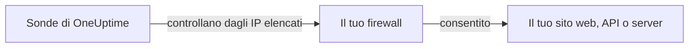

# Indirizzi IP

Le sonde di OneUptime Cloud controllano i tuoi siti web, le API e i server da un insieme fisso di indirizzi IP. Se davanti a ciò che monitori c'è un firewall o una allowlist, consenti questi indirizzi perché i controlli passino.



## Indirizzi IP da consentire

Consenti nel tuo firewall il traffico da questi indirizzi:

{{IP_WHITELIST}}

> [!NOTE]
> Questi indirizzi possono cambiare. OneUptime ti avvisa in anticipo quando succede. Per restare aggiornato senza seguire gli annunci, [recupera l'elenco](#recuperare-lelenco-in-modo-programmatico) ogni volta che aggiorni il firewall.

## Recuperare l'elenco in modo programmatico

Lo stesso elenco è disponibile in JSON, senza bisogno di una chiave API, così uno script può tenere allineate le regole del firewall:

```bash
curl -s https://oneuptime.com/ip-whitelist
```

```json
{
  "ipWhitelist": ["<list of IPs>"]
}
```

`ipWhitelist` è un array con un indirizzo per voce. Per stampare un indirizzo per riga, ad esempio da passare a uno script del firewall:

```bash
curl -s https://oneuptime.com/ip-whitelist | jq -r '.ipWhitelist[]'
```

## OneUptime self-hosted

Sulla tua istanza, questa pagina e l'endpoint `/ip-whitelist` mostrano gli indirizzi dell'impostazione `IP_WHITELIST` dell'istanza, un elenco separato da virgole. Indica gli indirizzi da cui le tue sonde inviano i controlli.

:::tabs
@tab Kubernetes
Imposta il valore `ipWhitelist` del chart Helm:

```yaml title="values.yaml"
ipWhitelist: "203.0.113.1,203.0.113.2"
```
@tab Docker Compose
`config.env` non la passa all'applicazione. Aggiungila all'ambiente del servizio `app` in un file `docker-compose.override.yml` accanto a `docker-compose.yml`, poi riavvia OneUptime:

```yaml title="docker-compose.override.yml"
services:
  app:
    environment:
      IP_WHITELIST: "203.0.113.1,203.0.113.2"
```
:::

Se non è impostato nulla, questa pagina mostra **No IP addresses configured.** e l'endpoint restituisce un array `ipWhitelist` vuoto.

## Passaggi successivi

:::cards
- [Sonde personalizzate](/docs/probe/custom-probe): Eseguire una sonda nella tua rete invece di aprire il firewall.
- [Creare un monitor](/docs/monitor/create-monitor): Iniziare a controllare un sito web, un'API o un server.
:::
