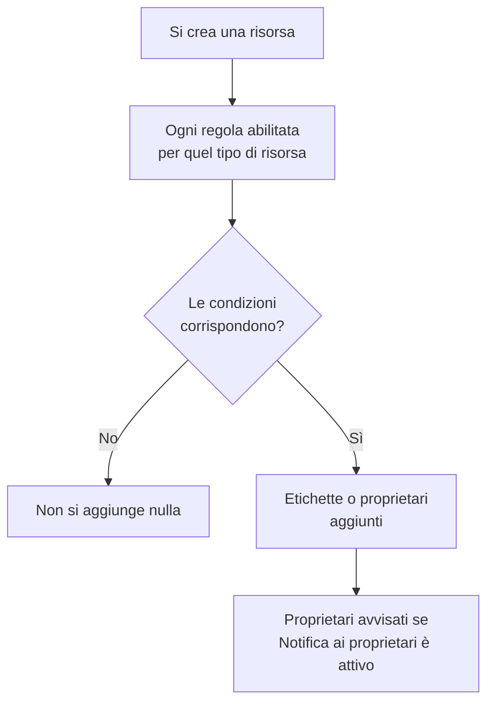

# Regole per etichette e proprietari

Le regole per le etichette e le regole per i proprietari organizzano le risorse al posto tuo. Una **regola per etichette** aggiunge etichette a ogni nuova risorsa che le corrisponde, e una **regola per proprietari** le aggiunge utenti e team come proprietari: così un nuovo incidente del database riceve l'etichetta _Database_ e appartiene al team del database senza che nessuno debba ricordarsene.

:::cards
- [Creare una regola](#creare-una-regola): Due passaggi: a cosa corrisponde la regola, poi cosa aggiunge.
- [Ereditare etichette e proprietari](#ereditare-etichette-e-proprietari): Trasmettere ciò che portano i monitor, gli host e i servizi di un evento.
- [Quando vengono eseguite le regole](#quando-vengono-eseguite-le-regole): Le nuove risorse, e **Run Now** per quelle che hai già.
:::

## Come funziona

Le regole vengono eseguite quando si crea una risorsa. Ogni regola abilitata controlla le sue condizioni sulla nuova risorsa, e ogni regola che corrisponde aggiunge ciò che aggiunge.

Le etichette e i proprietari servono a filtrare e raggruppare le risorse, decidono chi OneUptime avvisa al loro riguardo e cosa raggiungono le [autorizzazioni limitate per etichette o alle proprie risorse](/docs/permissions/index). Le regole le mantengono coerenti senza che nessuno debba ricordarsene.

## Dove trovare le regole

Ogni prodotto con etichette e proprietari ha entrambe le regole nelle sue **Impostazioni** (per incidenti, avvisi e manutenzione programmata, in **Regole**): monitor, incidenti ed episodi di incidente, avvisi ed episodi di avviso, eventi di manutenzione programmata, pagine di stato, servizi, host, cluster Kubernetes, host Docker, cluster Docker Swarm, host Podman, cluster Proxmox, vCenter VMware, cluster Ceph, storage array, database, code, flotte IoT, funzioni serverless, risorse cloud, applicazioni RUM, dashboard, policy di reperibilità, turni di reperibilità, policy per le chiamate in arrivo, workflow, runbook, dispositivi di rete e SLO.

Per esempio, le regole per le etichette dei monitor sono in **Monitor → Impostazioni → Regole etichette**, e quelle degli incidenti in **Incidenti → Regole → Regole etichette**. **Impostazioni** e **Regole** sono inizialmente chiuse nel menu laterale: fai clic sul titolo della sezione per aprirla. Le pagine degli incidenti e degli avvisi hanno una scheda **Incident Rules** (o **Alert Rules**) e una scheda **Episode Rules**.

## Creare una regola

Tutte le regole per etichette e per proprietari si creano allo stesso modo, in due passaggi.

:::steps
### Aprire l'elenco delle regole

Apri la pagina **Regole etichette** o **Regole del proprietario** del prodotto e fai clic sul suo pulsante di creazione, che porta il nome della regola, per esempio **Crea: Monitor Label Rule**.

### Scegliere a cosa corrisponde la regola

Nel passaggio **Corrispondenza**, fai clic su **Aggiungi condizione** per ogni condizione che la risorsa deve soddisfare. Con due o più condizioni, scegli **Soddisfa tutte** o **Soddisfa almeno una**. Una regola senza condizioni corrisponde a ogni nuova risorsa.

### Scegliere cosa aggiunge la regola

Nel passaggio **Etichette**, scegli le **Etichette da aggiungere**. In una regola per proprietari il passaggio è **Proprietari**: **Aggiungi proprietario** apre un unico elenco di persone e team.

Il **Nome** viene compilato in base alle tue scelte (_Aggiungi Production_, _Aggiungi Platform come proprietari_) e le segue finché non scrivi un nome tuo. Una regola che si limita a ereditare prende invece il nome di ciò da cui eredita (vedi sotto).

### Controllare i campi chiusi

**Altri campi** contiene la **Descrizione** facoltativa e, in una regola per proprietari, **Notifica ai proprietari**, attiva per impostazione predefinita: i proprietari che una regola aggiunge ricevono la stessa notifica «sei stato aggiunto come proprietario» di un proprietario aggiunto a mano. Disattivala per aggiungere proprietari senza avvisarli.

### Salvare la regola

Nell'ultimo passaggio, fai di nuovo clic sul pulsante con il nome della regola, per esempio **Crea: Monitor Label Rule**. La regola parte abilitata e l'elenco la mostra con un'etichetta verde **Abilitato**.
:::

Una nuova regola deve aggiungere qualcosa: almeno un'etichetta (o un proprietario) oppure, in una regola di incidenti, avvisi o manutenzione programmata, qualcosa che eredita (vedi sotto). Per mettere in pausa una regola senza eliminarla, disattiva **Abilitato** nel suo modulo di modifica; l'elenco mostra allora un'etichetta rossa **Disabilitato**.

### Comunque venga creata la regola

Lo stesso vale per una regola creata tramite l'API, Terraform, un workflow o un'[importazione di regole per etichette](/docs/configuration/label-rule-import-export): OneUptime rifiuta una nuova regola che non aggiunge nulla, con un messaggio che indica i campi da compilare. Questi messaggi sono in inglese in tutte le lingue.

| Regola | Messaggio |
| --- | --- |
| Regola per etichette | This label rule adds nothing. Choose at least one label in Labels to Add. |
| Regola per etichette di incidenti, avvisi o manutenzione programmata | This label rule adds nothing. Choose at least one label in Labels to Add, or turn on an Inherit Labels switch. |
| Regola per proprietari | This owner rule adds nothing. Choose at least one user or team in Owner Users or Owner Teams. |
| Regola per proprietari di incidenti, avvisi o manutenzione programmata | This owner rule adds nothing. Choose at least one user or team in Owner Users or Owner Teams, or turn on an Inherit Owners switch. |

- **API**: imposta `labelsToAdd` (oppure `ownerUsers` / `ownerTeams`) su almeno un record del progetto, oppure uno degli interruttori `inheritLabelsFrom…` (`inheritOwnersFrom…`) della regola su `true`, un booleano JSON.
- **Terraform**: una risorsa di regola per etichette o per proprietari che non aggiunge nulla fallisce in `terraform apply` con il messaggio qui sopra. Assegnale `labels_to_add` (oppure `owner_users` / `owner_teams`) o attiva uno dei suoi interruttori di ereditarietà.

Le regole che hai già non vengono toccate: vedi [Modificare una regola](#modificare-una-regola).

## Ereditare etichette e proprietari

Le regole di incidenti, avvisi e manutenzione programmata possono anche trasmettere ciò che portano le risorse coinvolte da un evento. Sotto **Etichette da aggiungere** (o **Proprietari**), la sezione chiusa **Eredita etichette** (o **Eredita proprietari**) contiene sei interruttori:

- **Eredita etichette dai monitor**: ogni etichetta dei monitor dell'incidente viene aggiunta anche all'incidente. Un avviso ha un solo monitor, quindi in una regola di avvisi l'interruttore è **Eredita etichette dal monitor** (e in una regola per proprietari degli avvisi, **Eredita proprietari dal monitor**).
- **Eredita etichette dagli host**, **Eredita etichette dai cluster Kubernetes**, **Eredita etichette dagli host Docker**, **Inherit Labels From Podman Hosts** ed **Eredita etichette dai servizi** fanno lo stesso per quelle risorse.

Le regole per proprietari hanno gli stessi sei interruttori per i proprietari (**Eredita proprietari dai monitor** e così via). Finché nessun interruttore è attivo, la sezione chiusa dice a cosa serve; in una regola che eredita si apre da sola. Le regole degli episodi non hanno interruttori di ereditarietà.

Una regola che eredita può lasciare vuoto **Etichette da aggiungere** (o **Proprietari**): aggiunge ciò che eredita. Una regola del genere prende il nome di ciò da cui eredita:

| Interruttori attivi | Nome |
| --- | --- |
| **Eredita etichette dai monitor** | _Eredita etichette da: monitor_ |
| **Eredita etichette dai monitor** ed **Eredita etichette dagli host** | _Eredita etichette da: monitor, host_ |
| **Eredita etichette dal monitor**, in una regola di avvisi | _Eredita etichette da: monitor_ |

Il nome segue gli interruttori finché non scegli un'etichetta (la regola prende allora il nome delle sue etichette) o scrivi un nome tuo.

## Modificare una regola

Il modulo di modifica di una regola ha gli stessi due passaggi e aggiunge l'interruttore **Abilitato**. Non pretende ciò che la regola aggiunge: una regola salvata prima che OneUptime lo chiedesse (tramite l'API, Terraform, un'importazione o il vecchio modulo) può non aggiungere nulla, e una modifica può togliere tutto ciò che una regola aggiunge.

Una regola del genere si può comunque rinominare, disattivare o eliminare, anche tramite l'API e Terraform. L'elenco contrassegna una regola che non aggiunge nulla con **Non aggiunge nulla** accanto al suo stato, e lo stesso fa la pagina della regola. Modificala per scegliere cosa aggiunge, oppure eliminala.

## Quando vengono eseguite le regole

Ogni regola abilitata viene eseguita quando si crea una risorsa, dalla dashboard o tramite l'API, e ogni regola che corrisponde aggiunge ciò che aggiunge:

- Se corrispondono più regole, aggiungono tutte le loro etichette e i loro proprietari.
- Una regola non toglie mai nulla: né le etichette o i proprietari aggiunti a mano, né quelli che ha aggiunto lei stessa.
- Una regola disabilitata non fa nulla.

Una regola scritta oggi si applica alle risorse create dopo. Per applicarla a quelle che hai già, usa **Run Now**: vedi [Eseguire le regole sulle risorse esistenti](/docs/configuration/run-rules-now). Le regole per etichette si possono anche copiare tra progetti: vedi [Importare ed esportare regole per etichette](/docs/configuration/label-rule-import-export).

## Passaggi successivi

:::cards
- [Eseguire le regole sulle risorse esistenti](/docs/configuration/run-rules-now): Applicare una regola alle risorse che hai già.
- [Importare ed esportare regole per etichette](/docs/configuration/label-rule-import-export): Copiare regole per etichette tra progetti in JSON.
- [Impostazioni e automazione degli incidenti](/docs/incidents/settings): Le altre regole che un incidente può eseguire.
- [Regole per etichette e proprietari degli SLO](/docs/slo/label-and-owner-rules): A cosa corrispondono le regole degli SLO.
:::
