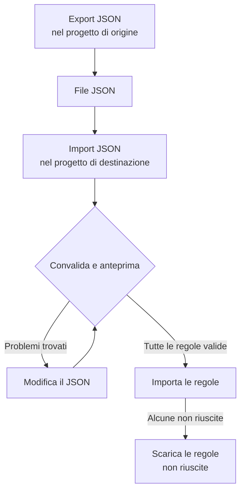

# Importare ed esportare regole per etichette

Copia regole per etichette tra progetti, o creane molte in una volta, come file JSON. Ogni pagina **Regole etichette** ha le azioni **Export JSON** e **Import JSON** nel suo menu **Altre opzioni** (**⋯**), anche per incidenti, avvisi, monitor e dispositivi di rete. L'unica eccezione è VMware: le sue regole per etichette dei vCenter non hanno né l'una né l'altra.



## Esportare le regole

Apri **Altre opzioni** e seleziona **Export JSON** per scaricare tutte le regole di quel tipo nel progetto corrente. L'esportazione include le regole che si trovano in altre pagine della tabella e ignora i filtri della tabella.

Il file conserva per ogni regola lo stato di abilitazione, le condizioni, le etichette da aggiungere e le opzioni di ereditarietà delle etichette. Gli ID di progetto, gli ID delle regole e i campi di audit vengono omessi.

Le etichette, i monitor e le gravità collegati sono scritti con il loro nome esatto. Un'importazione non li crea: devono già esistere nel progetto di destinazione.

## Importare le regole

:::steps
### Aprire Import JSON

Apri la pagina **Regole etichette** del progetto di destinazione e seleziona **Altre opzioni → Import JSON**.

### Aggiungere il file

Carica un file di esportazione JSON oppure incollane il contenuto.

### Convalidare e vedere l'anteprima

Seleziona **Validate and preview**. Ogni regola viene controllata prima che ne venga creata una qualsiasi, e le risorse a cui fa riferimento devono esistere nel progetto di destinazione con nomi univoci e corrispondenti.

### Controllare l'anteprima

Controlla i nomi delle regole, lo stato, le etichette e le condizioni. Un lotto grande viene mostrato una pagina alla volta. Per correggere qualcosa, seleziona **Edit JSON** e convalida di nuovo.

### Importare

Seleziona il pulsante di importazione, che conta le regole (per esempio **Import 2 rules**), e tieni aperta la finestra finché non compaiono i risultati.
:::

Le importazioni aggiungono nuove regole e mantengono quelle esistenti, quindi importare di nuovo lo stesso file crea un'altra copia. A ogni regola si applicano le normali autorizzazioni di creazione e la convalida lato server.

Se alcune regole non riescono, seleziona **Download failed rules** per salvare solo quelle righe, correggile e importa di nuovo quel file. Se una richiesta va in timeout, controlla l'elenco delle regole prima di riprovare: il server potrebbe aver salvato la regola prima che la sua risposta andasse persa.

## Creare un lotto in JSON

Esporta una regola esistente per avere un esempio per il tuo tipo di risorsa, poi modifica o aggiungi voci nell'array `items`. Questo esempio crea due regole per etichette dei monitor. Le etichette `Production` e `Infrastructure` devono già esistere nel progetto di destinazione.

```json title="monitor-label-rules.json"
{
  "fileType": "oneuptime-label-rules",
  "schemaVersion": 1,
  "resourceType": "MonitorLabelRule",
  "items": [
    {
      "name": "Production API monitors",
      "description": "Label production API monitors automatically",
      "isEnabled": true,
      "monitorNamePattern": "^api-prod-",
      "monitorLabels": [],
      "labelsToAdd": ["Production"]
    },
    {
      "name": "Database monitors",
      "isEnabled": false,
      "monitorNamePattern": "^database-",
      "labelsToAdd": ["Infrastructure"]
    }
  ]
}
```

| Campo | Cosa contiene |
| --- | --- |
| `fileType` | Sempre `oneuptime-label-rules`. |
| `schemaVersion` | Sempre `1`. |
| `resourceType` | Il tipo di regola contenuto nel file, per esempio `MonitorLabelRule`. |
| `items` | Le regole, un oggetto ciascuna. Un file ne richiede almeno una. |

Usa booleani JSON per `isEnabled`, testo per i pattern e array di nomi per le risorse collegate.

Questi casi bloccano l'intero lotto prima del passaggio di importazione: pattern non validi, campi sconosciuti, nomi mancanti e riferimenti ambigui. Lo stesso vale per una regola che non aggiunge nulla (un `labelsToAdd` vuoto e, in una regola di incidenti, avvisi o manutenzione programmata, nessun interruttore `inheritLabelsFrom…` impostato su `true`), perché OneUptime si rifiuta di crearla (vedi [Regole per etichette e proprietari](/docs/configuration/label-and-owner-rules#comunque-venga-creata-la-regola)). Un'esportazione può contenere una regola del genere se è stata salvata prima di quel controllo; assegnale un'etichetta o toglila dal file prima di importare.

> [!NOTE]
> I file e il JSON incollato sono limitati a 10 MB.

## Copiare tra tipi di risorsa

Mantieni nel file il `resourceType` originale e apri **Import JSON** sulla pagina di destinazione. I pattern compatibili di nome o titolo principale, i pattern di descrizione e le etichette richieste vengono associati ai campi della destinazione, e l'anteprima elenca queste associazioni perché tu possa controllarle. I riferimenti alle gravità di incidenti e avvisi vengono confrontati con i nomi delle gravità della destinazione.

Le condizioni o le azioni che la destinazione non supporta bloccano l'importazione. Per esempio, una regola di incidenti limitata a monitor specifici non si può copiare nelle regole dei dispositivi di rete senza modificare quelle condizioni.

> [!WARNING]
> Le regole per etichette dei dispositivi di rete e degli SLO supportano i caratteri jolly oltre alle espressioni regolari. Un trasferimento tra queste regole e altri tipi di regola rifiuta i pattern che contengono `*` o spazi iniziali o finali, perché lì corrispondono in modo diverso. Modifica quei pattern per la destinazione, oppure mantieni la regola nello stesso tipo di risorsa. Le regole per etichette dei dispositivi di rete e degli SLO possono scambiarsi qualsiasi pattern, perché corrispondono allo stesso modo.

## Passaggi successivi

:::cards
- [Regole per etichette e proprietari](/docs/configuration/label-and-owner-rules): A cosa corrisponde una regola per etichette e cosa aggiunge.
- [Eseguire le regole sulle risorse esistenti](/docs/configuration/run-rules-now): Applicare le regole importate alle risorse che hai già.
:::
