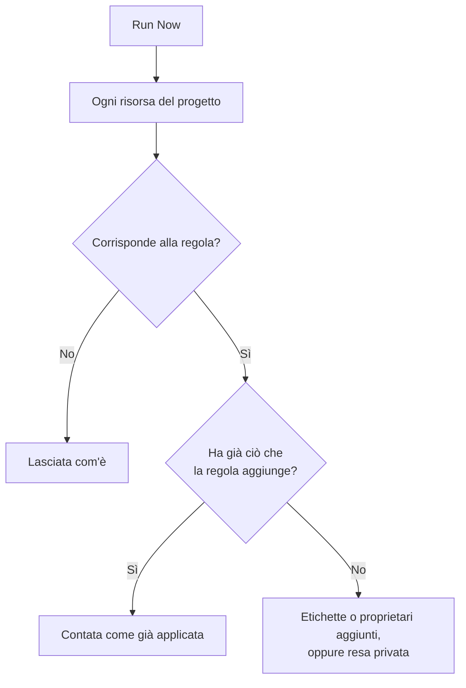

# Eseguire le regole sulle risorse esistenti

Le regole per etichette, per proprietari e di privacy vengono eseguite automaticamente quando una risorsa viene **creata**. Una regola scritta oggi, quindi, non cambia nulla nei monitor, negli incidenti o negli host che hai già. **Run Now** colma questa lacuna: applica una regola a ogni risorsa che esiste già nel progetto.

## Quali regole si possono eseguire

- **Regole etichette** e **Regole del proprietario**, per ogni risorsa che le ha: monitor, incidenti, episodi di incidente, avvisi, episodi di avviso, eventi di manutenzione programmata, pagine di stato, servizi, host, cluster Kubernetes, host Docker, cluster Docker Swarm, host Podman, cluster Proxmox, vCenter VMware, cluster Ceph, storage array, database, code, flotte IoT, funzioni serverless, risorse cloud, applicazioni RUM, dashboard, policy di reperibilità, turni di reperibilità, policy per le chiamate in arrivo, workflow, runbook, dispositivi di rete e SLO.
- **Regole di privacy**, per incidenti, avvisi, episodi di incidente ed episodi di avviso.
- **Monitor Rules** su una pagina di stato. Risincronizzano già la pagina ogni volta che si salva una regola; eseguirne una la risincronizza subito.
- **Monitor Rules** su uno SLO. Risincronizzano già lo SLO ogni volta che si salva una regola; eseguirne una risincronizza subito i monitor dello SLO. Vedi [Monitor e regole dei monitor](/docs/slo/monitor-rules).

Le regole che compiono un'azione invece di descrivere una risorsa (**Regole di reperibilità**, **Regole di runbook**, **Regole di rimedio automatico** e **Regole di raggruppamento**) non si possono eseguire sui record esistenti. Eseguirle chiamerebbe persone, avvierebbe runbook, lancerebbe correzioni o riorganizzerebbe episodi per incidenti già conclusi.

## Prima di iniziare

Per eseguire una regola ti serve l'autorizzazione a modificare la regola **e** a modificare le risorse che cambia: per esempio, una regola per etichette dei monitor richiede sia l'autorizzazione a modificare le regole per etichette dei monitor sia quella a modificare i monitor. Le regole per proprietari richiedono anche l'autorizzazione ad aggiungere proprietari. Le regole dei monitor di una pagina di stato o di uno SLO richiedono solo l'autorizzazione a modificare la regola.

> [!IMPORTANT]
> Un'autorizzazione limitata a determinate etichette, o alle risorse di cui sei proprietario, non basta: un'esecuzione può cambiare tutte le risorse del progetto. Le block list dei team si applicano come ovunque, e anche un blocco limitato ad alcune etichette conta: un'esecuzione cambierebbe le risorse che portano quelle etichette, quindi un blocco con etichette sulla modifica delle risorse che una regola cambia rifiuta l'esecuzione.

Le regole di una rete chiedono lo stesso quando le esegui sui dispositivi che hai già. **Run Now** di una regola di assegnazione del sito o di etichette dei dispositivi richiede l'autorizzazione a modificare la regola e **Edit Network Device**. **Dry Run** e **Run Rule** di una regola di importazione automatica richiedono l'autorizzazione a modificare la regola, **Create Network Device** e, quando la regola ha un modello di monitor, **Create Monitor**. Ognuna deve coprire l'intero progetto. Vedi [Importare automaticamente con le regole di importazione automatica](/docs/monitor/network-device-monitor#importing-automatically-with-auto-import-rules).

## Eseguire una regola

:::steps
### Aprire l'elenco delle regole

Apri la pagina delle regole, per esempio **Monitor → Impostazioni → Regole etichette**.

### Selezionare Run Now

Apri il menu **⋯** alla fine della riga della regola e seleziona **Run Now**, oppure seleziona **Visualizza** e poi **Run Now** nella pagina della regola. Una finestra di dialogo dice cosa farà l'esecuzione.

### Decidere se avvisare i nuovi proprietari

Per una regola per proprietari, scegli se attivare **Notify the owners this run adds**. È disattivato per impostazione predefinita e ha effetto solo quando la regola stessa ha **Notifica ai proprietari** attivo. Un proprietario riceve un avviso per ogni risorsa a cui viene aggiunto.

### Avviare la regola

Seleziona **Run Rule** e tieni aperta la finestra di dialogo. In un progetto grande, la finestra mostra a che punto è l'esecuzione.

### Leggere il resoconto

Al termine dell'esecuzione, la finestra indica a quante risorse corrispondeva la regola, quante ne ha cambiate e quante avevano già ciò che la regola aggiunge.
:::

## Eseguire più regole

Seleziona le regole nella tabella, apri il menu delle azioni di gruppo e scegli **Run Now**. Le regole selezionate vengono eseguite una dopo l'altra.

- I proprietari aggiunti da un'esecuzione di gruppo non vengono mai avvisati. Per avvisarli, esegui invece una regola singola.
- Una regola che non può essere eseguita (per esempio perché è disabilitata) viene elencata con il motivo, e le altre regole vengono eseguite comunque.

## Cosa fa un'esecuzione

- **Aggiunge soltanto.** Si aggiungono etichette e proprietari, le risorse diventano private. Non si toglie nulla e nulla diventa pubblico, quindi eseguire di nuovo una regola è sicuro: la seconda esecuzione riferisce che tutto era già applicato.
- **Ogni risorsa del progetto viene valutata**, compresi gli incidenti e gli avvisi risolti.
- **I proprietari esistenti vengono saltati**, mai aggiunti due volte.
- **Vengono aggiunte solo le etichette del tuo progetto.** Un'etichetta indicata dalla regola che non fa più parte delle etichette del tuo progetto viene saltata, e le altre etichette della regola vengono aggiunte comunque. Lo stesso vale quando una regola viene eseguita su una nuova risorsa.
- **La regola viene applicata come alla creazione**, comprese le etichette e i proprietari ereditati dai monitor, dagli host e dai servizi di un incidente. Se la risorsa ha un feed delle attività, il feed registra quale regola l'ha cambiata.
- **Le regole disabilitate non vengono eseguite.** Abilita prima la regola.
- **Le regole dei monitor delle pagine di stato** aggiungono i monitor a cui corrispondono e tolgono quelli che avevano aggiunto e a cui non corrispondono più. I monitor aggiunti a mano alla pagina non vengono mai toccati.
- **Una singola esecuzione copre fino a 100.000 risorse.** In un progetto più grande l'esecuzione si ferma e lo dice; esegui di nuovo la regola per continuare.

## Passaggi successivi

:::cards
- [Regole per etichette e proprietari](/docs/configuration/label-and-owner-rules): Scrivere le regole che un'esecuzione applica.
- [Importare ed esportare regole per etichette](/docs/configuration/label-rule-import-export): Portare prima le regole per etichette da un altro progetto.
- [Impostazioni e automazione degli incidenti](/docs/incidents/settings): Le regole degli incidenti, comprese le regole di privacy.
:::
