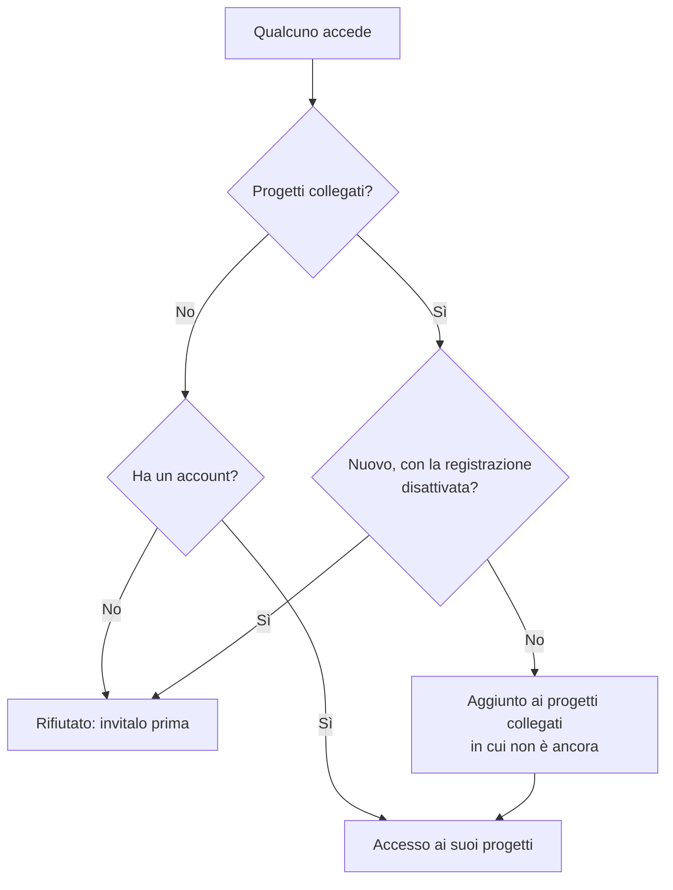

# SSO globale

L'SSO globale permette a un **amministratore dell'istanza** OneUptime (master admin) di configurare **una sola volta**, a livello di istanza, un provider di identità SAML 2.0 o OpenID Connect (OIDC) e di collegarlo a qualsiasi progetto del server. Invece di far configurare a ogni proprietario di progetto il proprio provider di identità, un amministratore principale ne configura uno che serve l'intera istanza.

> [!NOTE]
> L'SSO globale, incluso l'interruttore "Require SSO for Login" valido per tutta l'istanza, fa parte di ogni edizione di OneUptime: ogni istanza self-hosted lo ha, Community Edition compresa, e non richiede licenza. È amministrazione dell'istanza, quindi non si applica a OneUptime Cloud. Consulta [Edizione Enterprise](/docs/self-hosted/enterprise) per vedere cosa include ogni edizione.

:::cards
- [Configurare un provider](#configurare-lsso-globale): Crearlo, dare gli URL di OneUptime al tuo provider di identità e provarlo.
- [Come accedono gli utenti](#come-accedono-gli-utenti): Solo i membri esistenti, o i nuovi arrivati aggiunti ai progetti che colleghi.
- [Imporre l'SSO](#imporre-lsso): Richiedere l'SSO per un progetto o per l'intera istanza.
- [Disattivare un provider](#disattivare-o-eliminare-un-provider): Che cosa termina e quali modifiche OneUptime rifiuta.
:::

## SSO globale e SSO di progetto

|                       | SSO di progetto                                        | SSO globale                                            |
| --------------------- | ------------------------------------------------------ | ------------------------------------------------------ |
| Configurato da        | Proprietario/amministratore del progetto (Impostazioni del progetto) | Amministratore principale dell'istanza (Admin Dashboard) |
| Ambito                | Un singolo progetto                                    | L'intera istanza, collegabile a qualsiasi progetto     |
| Risultato dell'accesso | Accesso a quel solo progetto                          | Accesso a ogni progetto che l'utente può raggiungere   |

Per il provider proprio di un singolo progetto, vedi [SSO](/docs/identity/sso).

## Configurare l'SSO globale

:::steps
### Aprire l'elenco dei provider

:::tabs
@tab SAML
Accedi come amministratore principale e apri l'Admin Dashboard con **Impostazioni admin** nel menu utente. Poi vai a **Impostazioni** > **Autenticazione** > **Global SSO**.
@tab OpenID Connect
Accedi come amministratore principale e apri l'Admin Dashboard con **Impostazioni admin** nel menu utente. Poi vai a **Impostazioni** > **Autenticazione** > **Global OIDC**.
:::

### Creare il provider

:::tabs
@tab SAML
- Fai clic su **Create Global SSO**.
- Inserisci un **Nome**, la **Sign On URL** e l'**Issuer** del tuo provider di identità, e incolla il **Public Certificate**. Tutto il resto è già compilato sotto **Altri campi**: il **Signature Method** (`RSA-SHA256`), il **Digest Method** (`SHA256`) e una descrizione (`Sign in with` seguito dal nome). Modificali solo se il tuo IdP lo richiede. Il salvataggio apre la pagina del provider.
@tab OpenID Connect
- Fai clic su **Create Global OIDC**.
- Inserisci un **Nome**, l'**Issuer URL**, il **Client ID** e il **Client Secret** dell'app che hai registrato nel tuo IdP. Funziona anche incollare l'URL di discovery dell'IdP in **Issuer URL**. Tutto il resto è già compilato sotto **Altri campi**: la **Discovery URL** (l'emittente seguito da `/.well-known/openid-configuration`), gli **Scopes** (`openid email profile`), i nomi delle attestazioni `email` e `name`, e una descrizione (`Sign in with` seguito dal nome). Modificali solo se il tuo IdP lo richiede. Il salvataggio apre la pagina del provider.
:::

### Copiare gli URL di OneUptime nel provider di identità

:::tabs
@tab SAML
Nella pagina del provider, la scheda **Identity Provider URLs** mostra l'**ACS URL (Assertion Consumer Service / Reply URL)** e l'**Issuer (Entity ID)**. Incollali entrambi nel tuo provider di identità (Okta, Microsoft Entra ID, OneLogin, JumpCloud e altri).
@tab OpenID Connect
Nella pagina del provider, la scheda **Identity Provider URL** mostra la **Redirect URI (Callback URL)**. Aggiungila agli URI di reindirizzamento consentiti del tuo provider di identità.
:::

### Attivare il provider

Un nuovo provider parte disattivato. Fai clic su **Edit Configuration** nella pagina del provider e attiva **Abilitato**.

Attivare un provider globale aggiunge solo un'opzione "Sign in with SSO" alla pagina di accesso: non impone mai l'SSO né esclude qualcuno, quindi puoi attivarlo, provarlo e disattivarlo di nuovo senza rischi se serve.

### Provare il provider

Usa il link della scheda **Test this SSO provider** (**Test this OIDC provider** per OpenID Connect) per eseguire un accesso completo tramite il tuo provider di identità. Non devi collegare prima alcun progetto: la prova ti fa accedere ai progetti di cui fai già parte. Perché il link funzioni, il provider deve essere attivo.
:::

## Come accedono gli utenti

Il comportamento di un provider globale dipende dal fatto che tu gli colleghi dei progetti:

- **Nessun progetto collegato (tutti i progetti / prima l'invito):** gli utenti possono accedere con il provider e raggiungere **qualsiasi progetto di cui sono già membri**. I nuovi utenti **non** vengono creati automaticamente: un utente deve prima essere invitato in un progetto. Usalo per un SSO aziendale quando le appartenenze vengono gestite altrove.

- **Progetti collegati (provisioning automatico):** Apri il provider e usa la tabella **Attached Projects** per collegare uno o più progetti, ciascuno con un insieme di team predefiniti. Gli utenti che accedono vengono **provisionati automaticamente** in quei progetti e aggiunti ai team predefiniti al primo accesso. Un progetto che colleghi parte dal suo team dei membri; scegli altri team se i nuovi arrivati devono partire con un accesso diverso. Aggiungi un progetto + team alla volta per costruire l'elenco; per modificare un collegamento, eliminalo e aggiungilo di nuovo.

Chi è già membro di un progetto collegato mantiene i team che ha lì.

Due interruttori del provider cambiano questo comportamento. Partono entrambi disattivati, raccolti sotto **Altri campi**:

| Interruttore | Che cosa fa quando è attivo |
| --- | --- |
| **Disable Sign Up with SSO** | Le persone devono essere invitate in un progetto prima di poter accedere con questo provider, anche se ci sono progetti collegati. Al primo accesso non viene creato nessuno. |
| **Restrict to Attached Projects** | Accedere con questo provider soddisfa l'obbligo di SSO solo nei progetti collegati a esso, quindi chi ha già eseguito l'accesso può perdere l'accesso ad altri progetti. Quando è disattivato, lo soddisfa in ogni progetto di cui la persona fa parte, e i progetti collegati decidono solo dove vengono aggiunti i nuovi arrivati. |

## Imporre l'SSO

Configurare un provider globale non obbliga nessuno a usarlo; l'accesso con password continua a funzionare. Per richiedere l'SSO, attiva l'obbligo per un progetto o per l'intera istanza:

- **Per progetto:** un progetto può richiedere l'SSO e, facoltativamente, un provider *specifico* (di progetto o globale). Vedi [Richiedere l'SSO per il progetto](/docs/identity/sso#richiedere-lsso-per-il-progetto).
- **Per tutta l'istanza:** **Admin** > **Impostazioni** > **Autenticazione** ha un interruttore **Richiedi l'SSO per l'accesso** che impone l'SSO a ogni utente dell'istanza. Chiede conferma prima di attivarsi e salva non appena confermi. Gli amministratori principali restano esenti, così non possono rimanere esclusi.

Attivare **Richiedi l'SSO per l'accesso** richiede un provider SSO che faccia accedere le persone, così nessuno resta escluso:

- Per l'intera istanza, ogni progetto che non richiede l'SSO di per sé ne ha bisogno di uno: uno dei suoi provider SAML o OIDC attivo, oppure un provider globale attivo che faccia accedere le persone a quel progetto. Finché un progetto non ne ha, l'attivazione viene rifiutata e il messaggio indica i progetti (o, se sono molti, i primi e quanti sono). Attiva prima un provider globale, o un provider in quei progetti. Un progetto che richiede un provider specifico ha bisogno proprio di quello: finché è disattivato, eliminato o non fa accedere le persone al progetto, il messaggio indica quel progetto a parte; attiva prima quel provider o richiedine un altro lì.
- Per un progetto, viene chiesto lo stesso a quel progetto, e al provider che richiede se ne richiede uno.
- Un salvataggio che invia **Richiedi l'SSO per l'accesso** attivo quando lo è già — insieme ad altre impostazioni o dall'API — viene verificato allo stesso modo, per l'istanza come per un progetto, così come uno che indica il provider già richiesto da un progetto.
- Per un nuovo progetto, che non ha ancora un provider proprio: finché l'istanza richiede l'SSO, creare un progetto richiede un provider globale attivo che faccia accedere le persone a ogni progetto, altrimenti nessuno, nemmeno chi lo crea, potrebbe aprirlo. Senza di esso la creazione di un progetto viene rifiutata, e il messaggio chiede a un amministratore del server di attivarne uno. Gli amministratori principali possono comunque creare progetti. Un progetto creato con **Richiedi l'SSO per l'accesso** già attivo richiede lo stesso, chiunque lo crei.

La disattivazione non viene mai rifiutata.

## Disattivare o eliminare un provider

Disattivare un provider globale, eliminarlo o limitarlo ai suoi progetti collegati chiude gli accessi che ha concesso dove non fa più accedere nessuno. Dove l'SSO è richiesto, chi ha eseguito l'accesso con esso deve accedere di nuovo con l'SSO alla richiesta successiva, le pagine che ha aperte smettono subito di ricevere gli aggiornamenti in tempo reale, e un client MCP che qualcuno ha collegato dopo aver eseguito l'accesso con esso smette di funzionare nel progetto.

Riattivare il provider non ripristina quegli accessi: le persone accedono di nuovo con esso. Un provider che era già disattivato quando hai eseguito l'aggiornamento conta come disattivato al momento dell'aggiornamento.

Un nuovo certificato o client secret, altri URL o un nuovo nome lasciano tutti con l'accesso eseguito.

### Ogni progetto che richiede l'SSO mantiene un modo per entrare

Un progetto che richiede l'SSO, di per sé o perché lo richiede l'intera istanza, mantiene sempre un provider con cui le persone possono accedervi. Per questo queste modifiche vengono rifiutate finché lascerebbero un progetto del genere senza alcun provider, o gli toglierebbero il provider che richiede:

- disattivare un provider globale, eliminarlo o limitarlo ai suoi progetti collegati;
- per un provider limitato ai suoi progetti collegati: collegare il suo primo progetto (fino ad allora fa accedere le persone a ogni progetto), disattivare un collegamento, spostarlo in un altro progetto o provider, o rimuoverlo.

Il messaggio indica i progetti, oppure i primi e quanti sono. Attiva prima un altro provider per loro, uno dei loro o uno globale, oppure disattiva lì **Richiedi l'SSO per l'accesso**. Un progetto che richiede proprio questo provider viene indicato a parte: richiedi prima un altro provider lì o disattiva **Richiedi l'SSO per l'accesso**.

Le modifiche che permettono a un provider di far accedere più persone — attivarlo o attivare un collegamento, togliere la limitazione — non vengono mai rifiutate. Raggiungono subito tutti i server applicativi, come la disattivazione di **Richiedi l'SSO per l'accesso**: le persone possono accedere con il provider subito. Solo se nello stesso istante viene salvata un'altra modifica allo stesso provider un server applicativo può impiegare fino a un minuto per allinearsi.

Due modifiche su chi può accedere vengono verificate una dopo l'altra. Se nello stesso momento ne viene salvata un'altra e richiede più tempo del solito — l'attivazione di **Richiedi l'SSO per l'accesso** per l'intera istanza legge ogni progetto —, una modifica viene rifiutata con "Another change to who can sign in with SSO is being saved. Try again in a moment.": salvala di nuovo. Anche un progetto creato in quel momento attende la modifica, e se attende troppo viene rifiutato con "The server's SSO settings are being changed. Create the project again in a moment."

## Risoluzione dei problemi

:::details "You must be invited to a project on this OneUptime instance before you can sign in with SSO"
La persona non ha ancora un account OneUptime e il provider non ne crea: o non ha progetti collegati, o **Disable Sign Up with SSO** è attivo. Invitala in un progetto o collega un progetto al provider.
:::

:::details "This SSO provider does not grant access to any project you are a member of"
**Restrict to Attached Projects** è attivo e la persona non è membro di nessun progetto collegato al provider. Collega uno dei suoi progetti o aggiungila a un progetto collegato.
:::

:::details "You are not a member of any project on this OneUptime instance"
La persona ha un account ma non appartiene a nessun progetto, e il provider non ha dove aggiungerla. Invitala in un progetto o collega al provider un progetto con team predefiniti.
:::

:::details "Issuer URL does not match"
Per un provider SAML, l'emittente nella risposta del tuo provider di identità non è l'**Issuer** salvato sul provider. Copialo di nuovo dal tuo provider di identità; i due devono coincidere esattamente.
:::

## Passaggi successivi

:::cards
- [SSO](/docs/identity/sso): Configurare il provider SAML o OIDC proprio di un progetto.
- [SCIM](/docs/identity/scim): Lascia che il tuo provider di identità aggiunga e rimuova persone automaticamente.
- [Utenti, team e autorizzazioni](/docs/permissions/index): Che cosa permettono di fare i team in cui entrano i nuovi arrivati.
:::
