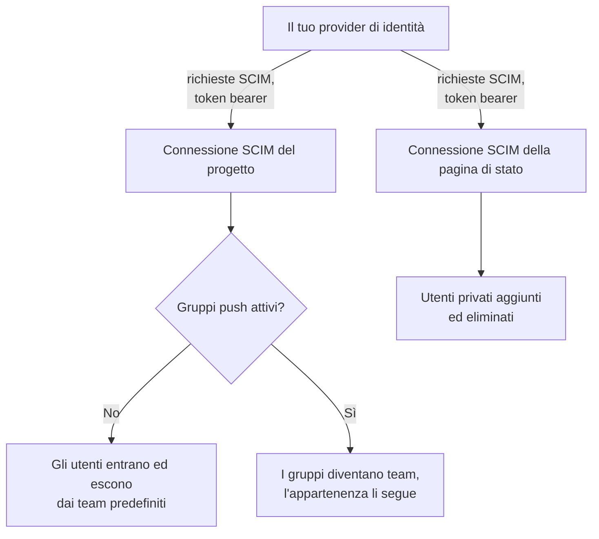
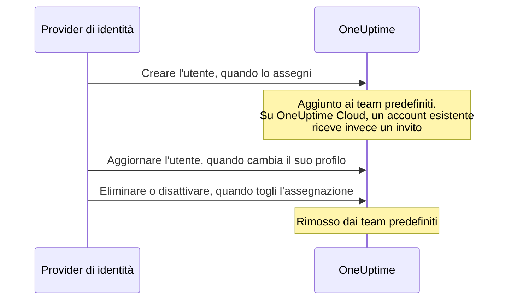

# SCIM

SCIM (System for Cross-domain Identity Management) esegue automaticamente il provisioning e il deprovisioning delle persone. Il tuo provider di identità (IdP) — Microsoft Entra ID, Okta o qualsiasi altro sistema SCIM 2.0 — aggiunge persone ai tuoi progetti OneUptime e alle pagine di stato private quando gliele assegni, e le rimuove quando togli l'assegnazione.

> [!NOTE]
> **Edizione:** SCIM fa parte della Enterprise Edition di OneUptime. Su OneUptime Cloud è disponibile dal piano **Scale** in su. Le installazioni self-hosted richiedono l'immagine della Enterprise Edition e una licenza. Consulta [Edizione Enterprise](/docs/self-hosted/enterprise). Senza una licenza valida (dopo la prova di 14 giorni, o 30 giorni dopo la scadenza di una licenza), le richieste SCIM vengono rifiutate finché non si attiva una licenza.

:::cards
- [Configurare lo SCIM di progetto](#configurare-lo-scim-di-progetto): Creare una connessione e dare al tuo IdP il suo URL e il suo token.
- [Configurare lo SCIM della pagina di stato](#configurare-lo-scim-della-pagina-di-stato): Eseguire il provisioning degli utenti privati di una pagina di stato.
- [Collegare il provider di identità](#configurare-il-provider-di-identità): Passo dopo passo per Microsoft Entra ID e Okta.
- [Domande frequenti](#domande-frequenti): Utenti esistenti, deprovisioning, modifiche dell'email.
:::

## Come funziona

Il tuo provider di identità chiama l'endpoint SCIM di OneUptime, autenticato con un token bearer, ogni volta che assegni, modifichi o togli l'assegnazione a qualcuno. Che cosa cambia la richiesta dipende da dove si trova la connessione:



L'integrazione SCIM offre questi vantaggi:

- **Provisioning automatico degli utenti**: gli utenti vengono creati in OneUptime quando vengono assegnati nel tuo IdP.
- **Deprovisioning automatico degli utenti**: gli utenti vengono rimossi da OneUptime quando viene tolta la loro assegnazione nel tuo IdP.
- **Sincronizzazione degli attributi utente**: le informazioni sugli utenti restano allineate tra il tuo IdP e OneUptime.
- **Gestione centralizzata degli accessi**: l'accesso a OneUptime si gestisce dal tuo sistema di gestione delle identità esistente.

SCIM e [SSO](/docs/identity/sso) sono indipendenti: SCIM decide chi fa parte di un progetto, l'SSO come le persone accedono. La maggior parte delle organizzazioni li usa entrambi.

## SCIM per i progetti

Lo SCIM di progetto permette ai provider di identità di gestire i membri dei team nei progetti OneUptime.

### Configurare lo SCIM di progetto

Solo un proprietario del progetto può aggiungere o modificare la connessione SCIM di un progetto, o vedere o reimpostare il suo token bearer: tramite SCIM, il tuo provider di identità può aggiungere persone a qualsiasi team del progetto.
:::steps
1. **Aprire le impostazioni del progetto**

   - Apri il tuo progetto OneUptime
   - Vai a **Impostazioni del progetto** > **Sicurezza** > **SCIM**

2. **Configurare le impostazioni SCIM**

   - Inserisci un **Nome**. **Team predefiniti** parte dal team dei membri del progetto: i nuovi utenti vengono aggiunti a questi team
   - Sotto **Altri campi**, **Provisioning automatico degli utenti** (aggiungere gli utenti quando vengono assegnati nel tuo IdP) e **Deprovisioning automatico degli utenti** (rimuovere gli utenti quando viene tolta la loro assegnazione nel tuo IdP) sono attivi, e **Abilita gruppi push** è disattivato. Modificali lì se serve
   - Salva. La finestra con la **SCIM Base URL** e il **Bearer Token** per la configurazione del tuo IdP si apre subito

3. **Configurare il provider di identità**

   - Usa la **SCIM Base URL** della finestra. Su OneUptime Cloud è `https://oneuptime.com/identity/scim/v2/<scim-id>`; un'installazione self-hosted mostra il proprio host
   - Configura l'autenticazione con token bearer usando il **Bearer Token** della finestra
   - Mappa gli attributi utente (l'email è obbligatoria). [Configurare il provider di identità](#configurare-il-provider-di-identità) riporta i dettagli per Microsoft Entra ID e Okta
:::

Per rivedere gli URL, seleziona **Visualizza URL SCIM** nella riga della connessione. **Reimposta il token Bearer** sostituisce il token; aggiorna il tuo provider di identità con quello nuovo.

### Come avviene il provisioning di un utente di progetto



Chi aveva già un account OneUptime entra nel progetto quando accetta l'invito su OneUptime Cloud (vedi le [domande frequenti](#domande-frequenti)). L'accesso concesso da team diversi dai team predefiniti della connessione non viene toccato.

## SCIM per le pagine di stato

Lo SCIM della pagina di stato permette ai provider di identità di eseguire il provisioning e il deprovisioning degli utenti privati delle pagine di stato, che possono accedere alle pagine di stato private.

### Configurare lo SCIM della pagina di stato

:::steps
1. **Aprire le impostazioni della pagina di stato**

   - Apri **Pagine di stato** e seleziona la tua pagina di stato
   - Vai a **Sicurezza** > **SCIM**

2. **Configurare le impostazioni SCIM**

   - Inserisci un **Nome**. Sotto **Altri campi**, **Provisioning automatico degli utenti** (aggiungere utenti privati quando vengono assegnati nel tuo IdP) e **Deprovisioning automatico degli utenti** (eliminare gli utenti privati quando viene tolta la loro assegnazione nel tuo IdP) sono attivi. Modificali lì se serve
   - Salva. La finestra con la **SCIM Base URL** e il **Bearer Token** per la configurazione del tuo IdP si apre subito

3. **Configurare il provider di identità**

   - Usa la **SCIM Base URL** della finestra. Su OneUptime Cloud è `https://oneuptime.com/identity/status-page-scim/v2/<scim-id>`
   - Configura l'autenticazione con token bearer usando il token fornito
   - Mappa gli attributi utente (l'email è obbligatoria)
:::

Per rivedere gli URL, seleziona **Mostra URL degli endpoint SCIM** nella riga della connessione.

Lo SCIM della pagina di stato supporta solo gli utenti. Non supporta i gruppi né il loro provisioning.

### Come avviene il provisioning di un utente privato

```mermaid title="La vita di un utente privato con lo SCIM della pagina di stato"
sequenceDiagram
    participant IdP as Provider di identità
    participant O as OneUptime
    IdP->>O: Creare l'utente, quando lo assegni
    Note over O: L'utente privato può accedere<br/>alla pagina di stato privata
    IdP->>O: Eliminare, o impostare active su false
    Note over O: Utente privato e sue<br/>sessioni eliminati
```

> [!WARNING]
> Il deprovisioning elimina definitivamente l'utente privato della pagina di stato e tutte le sue sessioni per quella pagina di stato. Se l'utente viene assegnato di nuovo in seguito, viene provisionato come nuovo utente privato. Quando **Deprovisioning automatico degli utenti** è disattivato, gli aggiornamenti che impostano `active` su `false` vengono ignorati e le richieste DELETE vengono rifiutate.

## Configurare il provider di identità

Ogni provider qui sotto parte dalla creazione di una connessione SCIM di progetto in OneUptime, poi vi collega il tuo provider di identità.

### Microsoft Entra ID (prima Azure AD)

Microsoft Entra ID offre una gestione delle identità di livello aziendale con provisioning SCIM. Ti servono:

- Un tenant Microsoft Entra ID con licenza Premium P1 o P2 (necessaria per il provisioning automatico).
- Un progetto OneUptime con il piano **Scale** o superiore su OneUptime Cloud.
- L'accesso amministrativo sia a Microsoft Entra ID sia a OneUptime.

:::steps
#### Creare la connessione SCIM per Entra ID

1. Accedi alla dashboard di OneUptime
2. Vai a **Impostazioni del progetto** > **Sicurezza** > **SCIM**
3. Fai clic su **Crea: SCIM**
4. Inserisci un nome descrittivo (ad esempio "Microsoft Entra ID Provisioning")
5. Controlla le opzioni:
   - **Team predefiniti**: parte dal team dei membri del progetto; i nuovi utenti vengono aggiunti a questi team
   - **Provisioning automatico degli utenti** e **Deprovisioning automatico degli utenti**: attivi, sotto **Altri campi**
   - **Abilita gruppi push**: sotto **Altri campi**; attivalo se vuoi gestire l'appartenenza ai team tramite i gruppi di Entra ID
6. Salva la configurazione
7. Copia la **SCIM Base URL** e il **Bearer Token** dalla finestra che si apre: ti serviranno per Entra ID

#### Creare un'applicazione aziendale in Entra ID

1. Accedi al [Microsoft Entra admin center](https://entra.microsoft.com)
2. Vai a **Identity** > **Applications** > **Enterprise applications**
3. Fai clic su **+ New application**, poi su **+ Create your own application**
4. Inserisci un nome (ad esempio "OneUptime")
5. Seleziona **Integrate any other application you don't find in the gallery (Non-gallery)** e fai clic su **Create**

#### Collegare Entra ID a OneUptime

1. Nella tua applicazione aziendale OneUptime, vai a **Provisioning** e fai clic su **Get started**
2. Imposta **Provisioning Mode** su **Automatic**
3. In **Admin Credentials**, imposta **Tenant URL** sulla **SCIM Base URL** di OneUptime (ad esempio `https://oneuptime.com/identity/scim/v2/<scim-id>`) e **Secret Token** sul **Bearer Token**
4. Fai clic su **Test Connection** per verificare la configurazione, poi su **Save**

#### Mappare gli attributi utente in Entra ID

1. Nella sezione Provisioning, fai clic su **Mappings**, poi su **Provision Azure Active Directory Users**
2. Configura le seguenti mappature degli attributi, rimuovi quelle che non ti servono e fai clic su **Save**:

| Attributo Azure AD                                            | Attributo SCIM di OneUptime    | Obbligatorio |
| ------------------------------------------------------------- | ------------------------------ | ------------ |
| `userPrincipalName`                                           | `userName`                     | Sì           |
| `mail`                                                        | `emails[type eq "work"].value` | Consigliato  |
| `displayName`                                                 | `displayName`                  | Consigliato  |
| `givenName`                                                   | `name.givenName`               | Facoltativo  |
| `surname`                                                     | `name.familyName`              | Facoltativo  |
| `Switch([IsSoftDeleted], , "False", "True", "True", "False")` | `active`                       | Consigliato  |

#### Mappare i gruppi in Entra ID (facoltativo)

Se hai attivato **Abilita gruppi push** in OneUptime:

1. Torna a **Mappings** e fai clic su **Provision Azure Active Directory Groups**
2. Imposta **Enabled** su **Yes**
3. Configura le seguenti mappature degli attributi e fai clic su **Save**:

| Attributo Azure AD | Attributo SCIM di OneUptime |
| ------------------ | --------------------------- |
| `displayName`      | `displayName`               |
| `members`          | `members`                   |

#### Assegnare utenti e gruppi in Entra ID

1. Nella tua applicazione aziendale OneUptime, vai a **Users and groups**
2. Fai clic su **+ Add user/group**, seleziona gli utenti e i gruppi da provisionare in OneUptime e fai clic su **Assign**

#### Avviare il provisioning in Entra ID

1. Vai a **Provisioning** > **Overview** e fai clic su **Start provisioning**
2. Parte il ciclo di provisioning iniziale; la prima sincronizzazione può richiedere fino a 40 minuti
3. Controlla gli errori nei **Provisioning logs**. Le persone che hai assegnato compaiono nei team del progetto in OneUptime
:::

### Okta

Okta offre una gestione delle identità flessibile con il supporto di SCIM. Ti servono:

- Un tenant Okta con il provisioning (la funzionalità Lifecycle Management).
- Un progetto OneUptime con il piano **Scale** o superiore su OneUptime Cloud.
- L'accesso amministrativo sia a Okta sia a OneUptime.

:::steps
#### Creare la connessione SCIM per Okta

1. Accedi alla dashboard di OneUptime
2. Vai a **Impostazioni del progetto** > **Sicurezza** > **SCIM**
3. Fai clic su **Crea: SCIM**
4. Inserisci un nome descrittivo (ad esempio "Okta Provisioning")
5. Controlla le opzioni:
   - **Team predefiniti**: parte dal team dei membri del progetto; i nuovi utenti vengono aggiunti a questi team
   - **Provisioning automatico degli utenti** e **Deprovisioning automatico degli utenti**: attivi, sotto **Altri campi**
   - **Abilita gruppi push**: sotto **Altri campi**; attivalo se vuoi gestire l'appartenenza ai team tramite i gruppi di Okta
6. Salva la configurazione
7. Copia la **SCIM Base URL** e il **Bearer Token** dalla finestra che si apre: ti serviranno per Okta

#### Creare o aprire l'applicazione Okta

Nella Okta Admin Console, vai a **Applications** > **Applications**:

- Se usi già Okta per l'SSO di OneUptime, apri quell'applicazione.
- Altrimenti fai clic su **Create App Integration**, seleziona **SAML 2.0**, chiamala "OneUptime" e completa la configurazione SAML (vedi [SSO](/docs/identity/sso)).

#### Attivare il provisioning SCIM in Okta

1. Nella tua applicazione OneUptime, vai alla scheda **General**
2. Nella sezione **App Settings**, fai clic su **Edit**, seleziona **SCIM** sotto **Provisioning** e fai clic su **Save**
3. Compare una nuova scheda **Provisioning**

#### Collegare Okta a OneUptime

1. Nella scheda **Provisioning**, fai clic su **Integration**, poi su **Configure API Integration**, e seleziona **Enable API integration**
2. Configura quanto segue:
   - **SCIM connector base URL**: la **SCIM Base URL** di OneUptime (ad esempio `https://oneuptime.com/identity/scim/v2/<scim-id>`)
   - **Unique identifier field for users**: `userName`
   - **Supported provisioning actions**: Import New Users and Profile Updates, Push New Users, Push Profile Updates e, se usi il provisioning basato sui gruppi, Push Groups
   - **Authentication Mode**: **HTTP Header**
   - **Authorization**: il **Bearer Token** di OneUptime. OneUptime si aspetta l'intestazione `Authorization: Bearer <token>`; se Okta mostra già la parola Bearer davanti al campo, inserisci solo il token
3. Fai clic su **Test API Credentials** per verificare la connessione, poi su **Save**

#### Scegliere che cosa provisiona Okta

1. Nella scheda **Provisioning**, fai clic su **To App**, poi su **Edit**
2. Attiva **Create Users**, **Update User Attributes** e **Deactivate Users**, e fai clic su **Save**

#### Mappare gli attributi utente in Okta

Scorri fino ad **Attribute Mappings** e controlla queste mappature. Rimuovi quelle che non ti servono:

| Attributo Okta     | Attributo SCIM di OneUptime     | Direzione       |
| ------------------ | ------------------------------- | --------------- |
| `userName`         | `userName`                      | Da Okta all'app |
| `user.email`       | `emails[primary eq true].value` | Da Okta all'app |
| `user.firstName`   | `name.givenName`                | Da Okta all'app |
| `user.lastName`    | `name.familyName`               | Da Okta all'app |
| `user.displayName` | `displayName`                   | Da Okta all'app |

#### Inviare i gruppi da Okta (facoltativo)

Se hai attivato **Abilita gruppi push** in OneUptime:

1. Vai alla scheda **Push Groups** e fai clic su **+ Push Groups**
2. Seleziona **Find groups by name** o **Find groups by rule**
3. Cerca e seleziona i gruppi da inviare, poi fai clic su **Save**

#### Assegnare le persone in Okta

1. Vai alla scheda **Assignments**
2. Fai clic su **Assign** > **Assign to People** o **Assign to Groups**, seleziona chi provisionare, fai clic su **Assign** per ciascuno e poi su **Done**

#### Verificare il provisioning in Okta

1. Vai a **Reports** > **System Log** nella Okta Admin Console e filtra per la tua applicazione OneUptime
2. Verifica che gli eventi di provisioning siano andati a buon fine e che le persone compaiano nei team del progetto in OneUptime
:::

### Altri provider di identità

L'implementazione SCIM di OneUptime segue la specifica SCIM v2.0 e funziona con qualsiasi provider di identità conforme:

| Impostazione | Valore |
| --- | --- |
| SCIM Base URL | La **SCIM Base URL** di OneUptime: `https://oneuptime.com/identity/scim/v2/<scim-id>` per un progetto, o `https://oneuptime.com/identity/status-page-scim/v2/<scim-id>` per una pagina di stato |
| Autenticazione | Token HTTP Bearer |
| Identificatore univoco dell'utente | `userName`, che deve essere un indirizzo email valido |
| Operazioni | GET, POST, PUT, PATCH e DELETE per gli Users, nello SCIM di progetto e della pagina di stato. I Groups sono supportati solo nello SCIM di progetto. |

## Riferimento API SCIM

I percorsi sono relativi alla **SCIM Base URL** della connessione.

| Endpoint                 | Metodi                  | Descrizione                                                 |
| ------------------------ | ----------------------- | ----------------------------------------------------------- |
| `/ServiceProviderConfig` | GET                     | Funzionalità del server SCIM                                |
| `/Schemas`               | GET                     | Schemi di risorse disponibili                               |
| `/ResourceTypes`         | GET                     | Tipi di risorse disponibili                                 |
| `/Users`                 | GET, POST               | Elencare e creare utenti                                    |
| `/Users/{id}`            | GET, PUT, PATCH, DELETE | Gestire un singolo utente                                   |
| `/Groups`                | GET, POST               | Elencare e creare gruppi/team (solo SCIM di progetto)       |
| `/Groups/{id}`           | GET, PUT, PATCH, DELETE | Gestire un singolo gruppo (solo SCIM di progetto)           |
| `/Bulk`                  | POST                    | Più operazioni in una sola richiesta                        |

Che cosa riporta `/ServiceProviderConfig`:

| Funzionalità | Supportata |
| --- | --- |
| PATCH | Sì |
| Bulk | Sì, fino a 1.000 operazioni e 1 MB per richiesta |
| Filtro | Sì, fino a 200 risultati |
| Ordinamento | Sì |
| Modifica della password | No |
| ETag | No |
| Autenticazione | Token HTTP Bearer |

Un gruppo creato dal tuo provider di identità diventa un team con lo stesso nome nel progetto; se esiste già un team con quel nome, viene usato quello invece di crearne uno nuovo.

:::details Schema utente SCIM
```json
{
  "schemas": ["urn:ietf:params:scim:schemas:core:2.0:User"],
  "userName": "user@example.com",
  "name": {
    "givenName": "John",
    "familyName": "Doe",
    "formatted": "John Doe"
  },
  "displayName": "John Doe",
  "emails": [
    {
      "value": "user@example.com",
      "type": "work",
      "primary": true
    }
  ],
  "active": true
}
```
:::

:::details Schema gruppo SCIM
```json
{
  "schemas": ["urn:ietf:params:scim:schemas:core:2.0:Group"],
  "displayName": "Engineering Team",
  "members": [
    {
      "value": "user-id-here",
      "display": "user@example.com"
    }
  ]
}
```
:::

## Piani e licenze

Su OneUptime Cloud, SCIM richiede il piano **Scale**. Un'installazione self-hosted richiede la Enterprise Edition e una licenza, come indica la nota in cima a questa pagina.

### Sotto il piano Scale

Su OneUptime Cloud, il provisioning SCIM funziona completamente solo finché il progetto è su **Scale** o superiore. Sotto — dopo la fine di una prova di Scale o il passaggio a un piano inferiore — le connessioni SCIM del progetto, e quelle delle sue pagine di stato, si limitano a rimuovere persone, così chi se ne va perde comunque l'accesso:

- **Funziona ancora:** disattivare un utente (`active` impostato su `false`, su una connessione impostata per rimuovere le persone che disattiva), eliminare un utente, rimuovere membri da un gruppo (il `Remove` di Entra ID su `members` con i membri come valore, il `remove` di Okta su `members[value eq "..."]`, o la sostituzione dei membri con una parte di quelli che il gruppo ha già), eliminare un gruppo e una richiesta `Bulk` composta solo da `DELETE`. Anche le consultazioni ricevono risposta — elencare e filtrare utenti e gruppi, cosa che i provider di identità fanno prima di rimuovere qualcuno —, ma sotto il piano una consultazione non crea mai nessuno.
- **Rifiutato:** creare un utente o un gruppo, riattivare un utente (`active` impostato su `true` per qualcuno che la connessione aggiungerebbe di nuovo a uno dei suoi team), aggiungere qualcuno a un gruppo di cui non fa parte, e modificare solo l'email o il nome di un utente o il nome di un gruppo. Una richiesta che aggiunge chiunque viene rifiutata per intero, anche se rimuove anche delle persone, perché un `PATCH` SCIM è tutto o niente. Il rifiuto è un `402` con un errore in formato SCIM, che il tuo provider di identità mostra: `SCIM provisioning needs the Scale plan. This project's plan does not include it, so its SCIM connections can only remove people: requests that add or change people or groups are refused. The connections are kept: upgrade the project to Scale in Project Settings > Billing and they work fully again.` Ogni rifiuto compare anche nei registri SCIM della connessione.
- **Una rimozione che modifica anche un profilo** — una disattivazione che invia una nuova email o un nuovo nome, o un aggiornamento di gruppo che rimuove membri e rinomina il gruppo — va a buon fine e lascia invariati l'email, il nome o il nome del gruppo. I provider di identità rinviano ciò che vedono diverso, quindi una modifica rifiutata una volta torna con le loro richieste successive, e una rimozione non aspetta mai il piano. Una disattivazione su una connessione che non rimuove le persone che disattiva (deprovisioning automatico disattivato, oppure gruppi inviati al suo posto) non rimuove nessuno, quindi una nuova email o un nuovo nome inviati con essa vengono rifiutati come modifica a sé.
- **Una richiesta che non cambia nulla riceve la solita risposta** — il `PUT` di Okta di un utente così com'è, con `active` impostato su `true`, per qualcuno che è già in tutti i team della connessione; aggiungere qualcuno a un gruppo di cui fa già parte; un'email rinviata con maiuscole diverse; attributi che OneUptime non conserva, come una qualifica o un reparto. L'utente privato di una pagina di stato è sulla pagina oppure non c'è affatto, quindi `active` impostato su `true` non lo modifica mai.

Non viene eliminato nulla. Passa al piano **Scale** e le connessioni tornano a funzionare completamente così come sono, con lo stesso token bearer e niente da riconfigurare nel provider di identità; un cambio di piano ha effetto entro un minuto. I provider di identità continuano a chiamare secondo i propri tempi: Okta elenca i rifiuti tra i suoi errori di provisioning, ed Entra ID li mostra nei suoi registri di provisioning e può mettere in quarantena un job che continua a fallire, rallentando le sue sincronizzazioni — rimozioni comprese — a circa una al giorno. Riavvia lì il provisioning dopo il cambio di piano, così le persone aggiunte nel frattempo vengono provisionate.

Sotto **Scale**, **Impostazioni del progetto** > **Sicurezza** > **SCIM**, e la pagina **SCIM** di una pagina di stato, elencano le connessioni sotto l'offerta del piano (**Connessioni SCIM ancora configurate**) e indicano che si limitano a rimuovere persone. Elimina una connessione per rimuoverla. Aggiungere una connessione, modificarne una o sostituire il suo token bearer richiede **Scale**. L'elenco non mostra i token bearer, e solo i proprietari del progetto possono leggere un token, con qualsiasi piano.

## Risoluzione dei problemi

Parti dalla scheda **Registri** di **Impostazioni del progetto** > **Sicurezza** > **SCIM** (o della pagina **SCIM** della pagina di stato). Elenca le richieste SCIM inviate dal tuo provider di identità, con il loro stato, e **Visualizza dettagli** mostra la richiesta e la risposta di OneUptime.

:::details Entra ID: Test Connection non riesce
Verifica che **Tenant URL** sia la **SCIM Base URL** esattamente come la mostra OneUptime, e che **Secret Token** sia il **Bearer Token** attuale. Dopo **Reimposta il token Bearer**, il vecchio token smette di funzionare.
:::

:::details Okta: la verifica delle credenziali API non riesce, o le richieste ricevono 401 Unauthorized
Controlla la **SCIM connector base URL** e il token. OneUptime legge l'intestazione `Authorization: Bearer <token>`, quindi assicurati che la parola Bearer venga inviata esattamente una volta. Se il token è stato perso o è trapelato, seleziona **Reimposta il token Bearer** in OneUptime e aggiorna Okta.
:::

:::details Gli utenti non vengono provisionati
Verifica che gli utenti siano assegnati all'applicazione nel tuo provider di identità, che lì il provisioning sia attivo e che le mappature degli attributi siano corrette. In Entra ID i **Provisioning logs** mostrano ogni errore; in Okta lo fa il **System Log**.
:::

:::details Utenti duplicati in Okta
Assicurati che `userName` sia univoco e corrisponda all'indirizzo email dell'utente.
:::

:::details Errori nell'invio dei gruppi
Verifica che i gruppi esistano nel tuo provider di identità e abbiano i membri giusti, e che **Abilita gruppi push** sia attivo in OneUptime.
:::

:::details Le modifiche da Entra ID arrivano in ritardo
Entra ID esegue il provisioning secondo i propri tempi: la prima sincronizzazione può richiedere fino a 40 minuti, e le successive avvengono circa ogni 40 minuti. Un job che Entra ID ha messo in quarantena si sincronizza meno spesso; correggi gli errori nei suoi **Provisioning logs** e riavvialo.
:::

## Domande frequenti

:::details Che cosa succede quando un utente viene deprovisionato?
Il deprovisioning può essere richiesto con una richiesta DELETE o impostando `active` su `false` in un aggiornamento PUT/PATCH:

- **SCIM di progetto**: con **Deprovisioning automatico degli utenti** attivo, l'utente viene rimosso dai team predefiniti configurati nelle impostazioni SCIM, mentre il suo account OneUptime resta. L'accesso concesso da altri team non viene toccato. Quando i gruppi push sono attivi, l'appartenenza ai team è gestita tramite il provisioning dei gruppi.
- **SCIM della pagina di stato**: con **Deprovisioning automatico degli utenti** attivo, l'utente privato della pagina di stato e tutte le sue sessioni per quella pagina di stato vengono eliminati definitivamente. Questo non elimina un eventuale account utente di progetto OneUptime separato.
:::

:::details Posso usare SCIM senza SSO?
Sì, SCIM e SSO sono funzionalità indipendenti. Puoi usare SCIM per il provisioning degli utenti consentendo loro di accedere con le password OneUptime o qualsiasi altro metodo di autenticazione.
:::

:::details Come gestisco gli utenti che già esistono in OneUptime?
Quando SCIM tenta di creare un utente che già esiste (corrispondenza per email), OneUptime non crea un utente duplicato. Cosa succede poi dipende da dove viene eseguito OneUptime:

- **Self-hosted**: l'utente esistente viene aggiunto subito ai team predefiniti configurati (o al team del gruppo, con i gruppi push).
- **OneUptime Cloud**: Un account OneUptime appartiene alla persona, non a un singolo progetto, quindi SCIM non può rendere qualcuno membro del tuo progetto di propria iniziativa. L'utente esistente viene invece **invitato** nei team e riceve la consueta email di invito. Entra nel progetto quando accetta gli inviti da **Inviti al progetto** in OneUptime, oppure quando conferma il single sign-on (SSO) del tuo progetto dall'email che OneUptime invia al suo primo accesso tramite SSO. Fino ad allora risulta in attesa. Lo stesso vale quando un gruppo aggiunge un utente esistente che non è ancora membro del tuo progetto.

Gli utenti che SCIM crea direttamente e gli utenti che sono membri del tuo progetto vengono aggiunti subito in entrambi i casi. Confermare l'SSO del tuo progetto rende una persona membro, quindi anche lei viene aggiunta subito; chi nel frattempo ha lasciato il tuo progetto viene invitato di nuovo.
:::

:::details SCIM può modificare l'indirizzo email o il nome di un utente?
L'indirizzo email di un account OneUptime è quello con cui la persona accede a ogni progetto di cui fa parte, ed è dove arrivano i suoi link per reimpostare la password. Quindi:

- **OneUptime Cloud**: SCIM non modifica mai un indirizzo email. Una richiesta che ne modificherebbe uno viene rifiutata con un errore SCIM `400` di tipo `mutability`, e nulla di quella richiesta viene applicato; il tuo provider di identità mostra il motivo. Chiedi all'utente di modificare il proprio indirizzo dal suo profilo OneUptime. Una richiesta che ripete l'indirizzo che l'account ha già non è una modifica e va a buon fine.
- **Self-hosted**: SCIM modifica l'indirizzo email solo di un utente che è entrato in questo progetto, non appartiene a nessun altro progetto e non è un amministratore di OneUptime. Qualsiasi altra modifica viene rifiutata allo stesso modo.

I nomi seguono ovunque la stessa regola: SCIM aggiorna il nome solo di un utente che è entrato in questo progetto, non appartiene a nessun altro progetto e non è un amministratore di OneUptime. Per chiunque altro il nome resta invariato e il resto della richiesta va comunque a buon fine.
:::

:::details Qual è la differenza tra team predefiniti e gruppi push?
- **Team predefiniti**: tutti gli utenti provisionati tramite SCIM vengono aggiunti agli stessi team prestabiliti
- **Gruppi push**: l'appartenenza ai team è gestita dal tuo provider di identità, così utenti diversi possono stare in team diversi in base ai gruppi dell'IdP di cui fanno parte
:::

:::details Con quale frequenza avviene la sincronizzazione?
Dipende dal tuo provider di identità:

- **Microsoft Entra ID**: la sincronizzazione iniziale può richiedere fino a 40 minuti; le successive avvengono ogni 40 minuti
- **Okta**: quasi in tempo reale per la maggior parte delle operazioni, con sincronizzazioni complete periodiche
:::

## Passaggi successivi

:::cards
- [SSO](/docs/identity/sso): Lascia che le persone provisionate da SCIM accedano con il tuo provider di identità.
- [Utenti, team e autorizzazioni](/docs/permissions/index): Che cosa permettono di fare i team predefiniti ai nuovi utenti.
- [SSO globale](/docs/identity/global-sso): Un unico provider di identità per tutti i progetti di un'istanza self-hosted.
:::
