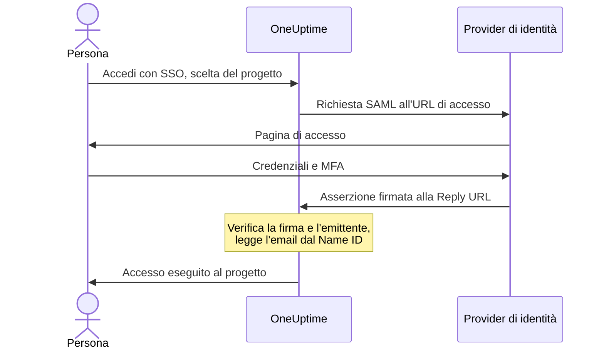

# SSO

Il single sign-on (SSO) permette alle persone del tuo progetto di accedere a OneUptime con il provider di identità (IdP) della tua organizzazione, tramite SAML 2.0 o OpenID Connect. Gestisci accessi, password e autenticazione a più fattori in un unico posto, e puoi richiedere l'SSO a tutti nel progetto.

> [!NOTE]
> **Edizione:** l'SSO, incluso "Require SSO for login", fa parte di ogni edizione di OneUptime: le installazioni self-hosted lo hanno nella Community Edition, senza licenza. Su OneUptime Cloud è disponibile dal piano **Scale** in su. Consulta [Edizione Enterprise](/docs/self-hosted/enterprise) per vedere cosa include ogni edizione.

:::cards
- [Configurare un provider SAML](#configurare-lsso): Crearlo in OneUptime e dare due URL al tuo IdP.
- [Guide dei provider di identità](#guide-dei-provider-di-identità): Keycloak, Microsoft Entra ID e Okta, passo dopo passo.
- [OpenID Connect](#openid-connect-oidc): Accedere invece tramite un'app OIDC.
- [Richiedere l'SSO](#richiedere-lsso-per-il-progetto): Fare dell'SSO l'unico modo per entrare nel progetto.
:::

## Come funziona l'accesso SAML

Un provider SAML collega un progetto a un'applicazione del tuo provider di identità. Chi accede sceglie il progetto nella pagina **Accedi con SSO** di OneUptime, accede presso il tuo IdP e torna con l'accesso eseguito.



OneUptime legge solo poche cose dall'asserzione che invia il tuo IdP:

| Dall'asserzione | Che cosa ne fa OneUptime |
| --- | --- |
| Firma | La verifica con il **Certificato pubblico** del provider. La risposta deve essere firmata e non deve essere cifrata. |
| Issuer | Deve corrispondere esattamente all'**Emittente** del provider. |
| Name ID | L'indirizzo email della persona. Deve essere un indirizzo email valido. |
| `http://schemas.microsoft.com/identity/claims/displayname` | Il nome della persona, usato quando OneUptime crea il suo account. Facoltativo. |

Chi accede per la prima volta entra nei **Team** del provider, che decidono che cosa può fare: vedi [Ruoli e team degli utenti SSO](#ruoli-e-team-degli-utenti-sso).

> [!NOTE]
> Su OneUptime Cloud, la prima volta che qualcuno accede al progetto con uno dei suoi provider SAML o OIDC, OneUptime gli invia un link via email invece di farlo entrare. La persona lo apre, conferma che il single sign-on del progetto può farla accedere e prosegue con l'accesso. Il link vale 24 ore. Succede una volta per progetto, e di nuovo se la persona lascia il progetto e poi torna. Le installazioni self-hosted fanno accedere subito.

## Configurare l'SSO

Ti serve l'autorizzazione ad aggiungere provider SSO — **Project Owner**, **Project Admin** o **Create Project SSO** — e, su OneUptime Cloud, il piano **Scale**. Per la parte del tuo provider di identità, vedi le [guide dei provider di identità](#guide-dei-provider-di-identità).

:::steps
1. **Aprire le impostazioni del progetto**

   - Apri il tuo progetto OneUptime
   - Vai a **Impostazioni del progetto** > **Sicurezza** > **SSO**

2. **Creare la configurazione SSO**

   - Fai clic su **Crea: SSO**
   - Inserisci un **Nome** per la configurazione SSO (ad esempio "Keycloak SAML" o "Okta SAML")
   - Inserisci l'**URL di accesso** del tuo provider di identità
   - Inserisci l'**Emittente** (Entity ID) del tuo provider di identità
   - Incolla il **Certificato pubblico** del tuo provider di identità
   - Nel passaggio **Accesso**, **Team** parte dal team dei membri del progetto: chi accede per la prima volta entra in questi team. Sono accettati solo i team in cui potresti invitare qualcuno: un team che dà più accesso di quello che hai viene indicato sotto **Team**
   - Tutto il resto è già compilato sotto **Altri campi**: il **Metodo di firma** (`RSA-SHA256`), il **Metodo di digest** (`SHA256`) e una descrizione ("Sign in with" seguito dal nome). Modificali solo se il tuo provider di identità lo richiede

3. **Ottenere i metadati SSO di OneUptime**
   - Il salvataggio apre la finestra **SSO Configuration**. Puoi riaprirla con il pulsante **Visualizza configurazione SSO**
   - Copia l'**Identifier (Entity ID)**, ad esempio `https://oneuptime.com/<project-id>/<provider-id>`: serve nella configurazione del tuo IdP
   - Copia la **Reply URL (Assertion Consumer Service URL)**, ad esempio `https://oneuptime.com/identity/idp-login/<project-id>/<provider-id>`: serve nella configurazione del tuo IdP
   - Un nuovo provider parte disattivato. Quando il tuo IdP ha questi due valori, modifica il provider e attiva **Abilitato**

4. **Provare il provider**
   - Apri il link della scheda **Test Single Sign On (SSO)** e scegli il provider nella pagina che si apre. Vieni portato alla pagina di accesso del tuo provider di identità e torni su OneUptime con l'accesso eseguito
   - Quando funziona, puoi [richiedere l'SSO](#richiedere-lsso-per-il-progetto) per il progetto
:::

## Guide dei provider di identità

Scegli il tuo provider di identità. Ogni guida recupera i valori dell'IdP, crea il provider in OneUptime e poi dà all'IdP l'**Identifier (Entity ID)** e la **Reply URL** di OneUptime.

:::tabs
@tab Keycloak
Keycloak è una diffusa soluzione open source per la gestione delle identità e degli accessi. Ti serve un'istanza Keycloak in funzione con un realm, e l'accesso amministrativo sia a Keycloak sia a OneUptime.

:::steps
1. **Raccogliere i valori del realm**

   - **URL di accesso**: `https://<your-keycloak-domain>/auth/realms/<your-realm>/protocol/saml`
   - **Emittente**: `https://<your-keycloak-domain>/auth/realms/<your-realm>`
   - **Certificato**: il certificato di firma del realm. Apri `https://<your-keycloak-domain>/auth/realms/<your-realm>/protocol/saml/descriptor` e copia il valore `X509Certificate`, oppure apri **Realm settings** > **Keys** e fai clic su **Certificate** sulla chiave RS256

   Keycloak 17 e versioni successive servono questi URL senza il prefisso `/auth`. Metti il certificato tra le sue righe, così:

   ```text
   -----BEGIN CERTIFICATE-----
   MIICnzCCAYcCBgFyPZ8QFzANBgkqhkiG.......
   -----END CERTIFICATE-----
   ```

2. **Creare il provider in OneUptime**

   Vai a **Impostazioni del progetto** > **Sicurezza** > **SSO**, fai clic su **Crea: SSO** e compila:
   - **Nome**: un nome descrittivo (ad esempio `my-project-oneuptime`)
   - **URL di accesso** ed **Emittente**: i valori sopra
   - **Certificato pubblico**: il certificato, tra le sue righe `BEGIN CERTIFICATE` ed `END CERTIFICATE`
   - **Metodo di firma** e **Metodo di digest**: già impostati sotto **Altri campi** (`RSA-SHA256` e `SHA256`)

   Salva e copia l'**Identifier (Entity ID)** e la **Reply URL (Assertion Consumer Service URL)** dalla finestra che si apre.

3. **Creare il client Keycloak**

   In Keycloak, apri **Clients** nel tuo realm e crea un client, oppure modificane uno esistente:
   - **Client Protocol** (tipo di client): `saml`
   - **Client ID**: l'**Identifier (Entity ID)** di OneUptime
   - **Root URL** e **Valid Redirect URIs**: l'URL di OneUptime
   - **Assertion Consumer Service POST Binding URL**: la **Reply URL (Assertion Consumer Service URL)** di OneUptime

4. **Regolare le impostazioni del client**

   - Imposta **Name ID Format** su `email` e attiva **Force Name ID Format**, così Keycloak invia sempre l'email come Name ID
   - Nella scheda **Keys** del client, disattiva **Client signature required** (in **Signing keys config**): OneUptime non firma le sue richieste

5. **Attivare il provider e provarlo**

   In OneUptime, modifica il provider e attiva **Abilitato**, poi apri il link della scheda **Test Single Sign On (SSO)** e scegli il provider. Dovresti arrivare alla pagina di accesso di Keycloak e tornare su OneUptime.
:::
@tab Microsoft Entra ID
Microsoft Entra ID (prima Azure AD / Active Directory) è il servizio di identità cloud di Microsoft. Ti serve un tenant che supporti le applicazioni aziendali con SSO SAML, e l'accesso amministrativo sia a Entra ID sia a OneUptime.

:::steps
1. **Creare un'applicazione aziendale in Entra ID**

   - Accedi al [Microsoft Entra admin center](https://entra.microsoft.com)
   - Vai a **Identity** > **Applications** > **Enterprise applications**, fai clic su **+ New application** e poi su **+ Create your own application**
   - Inserisci un nome (ad esempio "OneUptime"), seleziona **Integrate any other application you don't find in the gallery (Non-gallery)** e fai clic su **Create**

2. **Copiare i valori SAML di Entra ID**

   - Nell'applicazione, vai a **Single sign-on** e seleziona **SAML**
   - In **SAML Certificates**, scarica il **Certificate (Base64)**, apri il file in un editor di testo e copiane il contenuto
   - In **Set up OneUptime**, copia la **Login URL** e il **Microsoft Entra Identifier** (**Azure AD Identifier** nei tenant meno recenti)

3. **Creare il provider in OneUptime**

   Vai a **Impostazioni del progetto** > **Sicurezza** > **SSO**, fai clic su **Crea: SSO** e compila:
   - **Nome**: un nome descrittivo (ad esempio `Azure AD SAML`)
   - **URL di accesso**: la **Login URL**
   - **Emittente**: il **Microsoft Entra Identifier**
   - **Certificato pubblico**: il certificato Base64, comprese le righe `BEGIN CERTIFICATE` ed `END CERTIFICATE`
   - **Metodo di firma** e **Metodo di digest**: già impostati sotto **Altri campi** (`RSA-SHA256` e `SHA256`)

   Salva e copia l'**Identifier (Entity ID)** e la **Reply URL (Assertion Consumer Service URL)** dalla finestra che si apre.

4. **Dare a Entra ID gli URL di OneUptime**

   In **Basic SAML Configuration**, fai clic su **Edit** e imposta:
   - **Identifier (Entity ID)**: l'**Identifier (Entity ID)** di OneUptime
   - **Reply URL (Assertion Consumer Service URL)**: la **Reply URL** di OneUptime

   Fai clic su **Save**.

5. **Inviare l'email come Name ID**

   In **Attributes & Claims**, fai clic su **Edit**:
   - Imposta **Unique User Identifier (Name ID)** sull'indirizzo email dell'utente: `user.mail`, oppure `user.userprincipalname` quando quello è l'indirizzo email
   - Imposta il **Name identifier format** su `Email address`
   - Facoltativamente, aggiungi un'attestazione chiamata `http://schemas.microsoft.com/identity/claims/displayname` con l'attributo di origine `user.displayname`, così i nuovi account ricevono il nome della persona. OneUptime ignora le altre attestazioni

6. **Assegnare utenti e gruppi**

   In **Users and groups** dell'applicazione, fai clic su **+ Add user/group**, seleziona gli utenti e i gruppi a cui dare l'accesso SSO e fai clic su **Assign**.

7. **Attivare il provider e provarlo**

   In OneUptime, modifica il provider e attiva **Abilitato**, poi apri il link della scheda **Test Single Sign On (SSO)** e scegli il provider. Dovresti arrivare alla pagina di accesso di Microsoft e tornare su OneUptime.
:::
@tab Okta
Okta è una piattaforma di identità molto diffusa con SSO SAML. Ti serve un'organizzazione Okta con accesso amministrativo, e l'accesso amministrativo a OneUptime.

:::steps
1. **Creare un'applicazione SAML in Okta**

   - Nella Okta Admin Console, vai a **Applications** > **Applications** e fai clic su **Create App Integration**
   - Seleziona **SAML 2.0** e fai clic su **Next**, inserisci "OneUptime" come **App name** e fai clic su **Next**
   - Okta chiede gli URL di OneUptime prima di mostrare i propri. Per ora inserisci il tuo indirizzo OneUptime (ad esempio `https://oneuptime.com`) come **Single sign-on URL** e come **Audience URI (SP Entity ID)**: li sostituirai entrambi al passaggio 4
   - Imposta **Name ID format** su `EmailAddress` e **Application username** su `Email`
   - Fai clic su **Next**, seleziona **I'm an Okta customer adding an internal app** e fai clic su **Finish**

2. **Copiare i valori SAML di Okta**

   Nella scheda **Sign On** dell'applicazione, in **SAML Signing Certificates**, trova il certificato attivo:
   - Fai clic su **Actions** > **View IdP metadata** e copia l'**URL di accesso** (Identity Provider Single Sign-On URL) e l'**Emittente** (Identity Provider Issuer)
   - Fai clic su **Actions** > **Download certificate**, apri il file `.cert` in un editor di testo e copiane il contenuto

3. **Creare il provider in OneUptime**

   Vai a **Impostazioni del progetto** > **Sicurezza** > **SSO**, fai clic su **Crea: SSO** e compila:
   - **Nome**: un nome descrittivo (ad esempio `Okta SAML`)
   - **URL di accesso** ed **Emittente**: i valori di Okta
   - **Certificato pubblico**: il certificato, comprese le righe `BEGIN CERTIFICATE` ed `END CERTIFICATE`
   - **Metodo di firma** e **Metodo di digest**: già impostati sotto **Altri campi** (`RSA-SHA256` e `SHA256`)

   Salva e copia l'**Identifier (Entity ID)** e la **Reply URL (Assertion Consumer Service URL)** dalla finestra che si apre.

4. **Dare a Okta gli URL di OneUptime**

   Nella scheda **General** dell'applicazione, fai clic su **Edit** in **SAML Settings** e poi su **Next**, quindi imposta:
   - **Single sign-on URL**: la **Reply URL (Assertion Consumer Service URL)** di OneUptime
   - **Audience URI (SP Entity ID)**: l'**Identifier (Entity ID)** di OneUptime

   Facoltativamente, aggiungi un'istruzione di attributo chiamata `http://schemas.microsoft.com/identity/claims/displayname` con il valore `user.firstName + " " + user.lastName`, così i nuovi account ricevono il nome della persona. Fai clic su **Next**, poi su **Finish**.

5. **Assegnare le persone**

   Nella scheda **Assignments**, fai clic su **Assign** > **Assign to People** o **Assign to Groups**, seleziona chi ottiene l'accesso SSO, fai clic su **Assign** per ciascuno e poi su **Done**.

6. **Attivare il provider e provarlo**

   In OneUptime, modifica il provider e attiva **Abilitato**, poi apri il link della scheda **Test Single Sign On (SSO)** e scegli il provider. Dovresti arrivare alla pagina di accesso di Okta e tornare su OneUptime.
:::
@tab Altro
L'SSO di OneUptime usa SAML 2.0 e funziona con qualsiasi provider di identità conforme:

:::steps
1. Recupera l'**URL di accesso** (il suo endpoint SSO), l'**Emittente** (il suo Entity ID) e il **Certificato pubblico** (il suo certificato di firma X.509) del tuo provider di identità. Se il tuo IdP li mostra solo dopo che esiste un'applicazione, crea l'applicazione usando il tuo indirizzo OneUptime come URL provvisori.
2. In OneUptime, crea il provider con quei valori e copia l'**Identifier (Entity ID)** e la **Reply URL (Assertion Consumer Service URL)** dalla finestra **SSO Configuration** (o da **Visualizza configurazione SSO**).
3. Nell'applicazione SAML del tuo provider di identità, imposta l'**Assertion Consumer Service URL / Reply URL** e l'**Entity ID / Audience URI** sui valori di OneUptime, e il **Name ID Format** sull'indirizzo email.
4. Il **Metodo di firma** (`RSA-SHA256`) e il **Metodo di digest** (`SHA256`) sono già impostati sotto **Altri campi**; modificali solo se il tuo provider di identità firma in modo diverso
5. Attiva **Abilitato** per il provider e provalo con il link della scheda **Test Single Sign On (SSO)**.
:::
:::

## OpenID Connect (OIDC)

Un progetto può anche accedere tramite un provider OpenID Connect, come Google Workspace, Okta, Microsoft Entra ID, Auth0 o Keycloak. Ti serve l'autorizzazione ad aggiungere provider OIDC (**Project Owner**, **Project Admin** o **Create Project OIDC**) e, su OneUptime Cloud, il piano **Scale**.

:::steps
1. Registra presso il tuo provider di identità un'app (un client OIDC) che possa usare il flusso authorization code con PKCE, e copia il suo **URL dell'emittente**, il **Client ID** e il **Client Secret**.
2. In OneUptime, vai a **Impostazioni del progetto** > **Sicurezza** > **OIDC** e fai clic su **Crea: OIDC**.
3. Inserisci un **Nome** (ciò che le persone vedono nella pagina di accesso), l'**URL dell'emittente**, il **Client ID** e il **Client Secret**. In alternativa puoi incollare l'URL di discovery del provider in **URL dell'emittente**.
4. Nel passaggio **Accesso**, **Team** parte dal team dei membri del progetto: chi accede per la prima volta entra in questi team. Tutto il resto è già compilato sotto **Altri campi**: l'**URL di discovery** (l'emittente seguito da `/.well-known/openid-configuration`), gli **Ambiti** (`openid email profile`), i nomi delle attestazioni `email` e `name`, e una descrizione ("Sign in with" seguito dal nome). Modificali solo se il tuo provider lo richiede. Sono accettati solo i team in cui potresti invitare qualcuno: un team che dà più accesso di quello che hai viene indicato sotto **Team**.
5. Salva. Si apre la finestra **OIDC Configuration** con la **Redirect URI**: aggiungila agli URI di reindirizzamento consentiti della tua app. Un nuovo provider parte disattivato, quindi poi modificalo e attiva **Abilitato**.
6. Usa il link della scheda **Test OpenID Connect (OIDC)** per accedere tramite il provider prima di richiedere l'SSO per il progetto.
:::

## Ruoli e team degli utenti SSO

OneUptime non associa ruoli o gruppi del tuo provider di identità. Ciò che una persona può fare dipende dai team di cui fa parte: un provider aggiunge i nuovi arrivati ai suoi **Team**, e tu gestisci i team e le loro autorizzazioni in OneUptime, come descritto in [Utenti, team e autorizzazioni](/docs/permissions/index). Per tenere l'appartenenza ai team allineata al tuo provider di identità, usa [SCIM](/docs/identity/scim).

I team di un provider decidono che cosa possono fare le persone che accedono con esso, quindi un provider viene salvato solo con team in cui chi lo salva potrebbe invitare qualcuno. Ogni salvataggio li verifica di nuovo: un provider i cui team danno più accesso di quello che hai può essere modificato solo da qualcuno il cui accesso li copre, come un proprietario del progetto. I provider salvati prima di questa verifica continuano a far accedere le persone nei loro team. Chiunque possa modificare un provider può comunque disattivarlo, così da poterlo fermare subito.

## Richiedere l'SSO per il progetto

Configurare un provider non impedisce a nessuno di accedere con una password. Per fare dell'SSO l'unico modo per entrare nel progetto, usa l'interruttore **Richiedi l'SSO per l'accesso** in **Impostazioni del progetto** > **Sicurezza** > **SSO**, sotto i tuoi provider:

:::steps
1. Prova prima il tuo provider con il link della scheda **Test Single Sign On (SSO)**.
2. Attiva **Richiedi l'SSO per l'accesso**. OneUptime chiede conferma prima di salvare: da quel momento tutti nel progetto, te compreso, devono accedere con l'SSO per aprirlo, e chi ha eseguito l'accesso con una password resta escluso dal progetto finché non accede con l'SSO.
3. Fai clic su **Richiedi l'SSO** per confermare. L'interruttore salva subito; non c'è un pulsante di salvataggio separato.
:::

Per attivare **Richiedi l'SSO per l'accesso** serve un provider che faccia accedere le persone al progetto: uno dei suoi provider SAML o OIDC attivo, oppure un provider globale attivo che faccia accedere le persone a quel progetto. Senza, OneUptime rifiuta e chiede di attivare prima un provider per il progetto e di provarlo. Se scegli un provider richiesto dal progetto, deve essere uno di questi, e la stessa verifica avviene quando in seguito richiedi un altro provider.

Un salvataggio che invia **Richiedi l'SSO per l'accesso** attivo quando lo è già, o che indica il provider già richiesto dal progetto, viene verificato allo stesso modo: l'API, Terraform e altri strumenti spesso inviano tutte le impostazioni a ogni salvataggio. Quindi, finché il progetto non ha un provider che faccia accedere le persone, o se il provider richiesto è stato disattivato nel frattempo, un salvataggio del genere viene rifiutato con le stesse parole, qualunque altra cosa cambi: prima attiva un provider, richiedine un altro o disattiva **Richiedi l'SSO per l'accesso**.

Un nuovo progetto segue la stessa regola. Non ha ancora un provider proprio, quindi crearlo con **Richiedi l'SSO per l'accesso** già attivo — solo un amministratore principale (master admin) può farlo — richiede un provider globale attivo che faccia accedere le persone a ogni progetto, e senza di esso viene rifiutato con le stesse parole. Crea il progetto, configura e prova il suo provider, poi attiva l'interruttore.

Finché l'intero server richiede l'SSO (**Admin** > **Impostazioni** > **Autenticazione** > **Richiedi l'SSO per l'accesso**), anche la creazione di qualsiasi progetto richiede un provider globale del genere, altrimenti nessuno, nemmeno chi lo crea, potrebbe aprire il progetto. Senza di esso la creazione di un progetto viene rifiutata, e il messaggio chiede a un amministratore del server di attivarne uno. Gli amministratori principali possono comunque creare progetti.

Disattivare **Richiedi l'SSO per l'accesso** salva non appena sposti l'interruttore e fa rientrare subito i membri con la loro password, a meno che qualcuno non lo riattivi nello stesso istante; in quel caso un server applicativo può impiegare fino a un minuto per allinearsi. Possono modificarlo i proprietari del progetto, gli amministratori del progetto e i membri con l'autorizzazione **Edit Project**; gli altri vedono l'interruttore bloccato, insieme all'autorizzazione che servirebbe loro.

> [!NOTE]
> Su OneUptime Cloud, richiedere l'SSO richiede il piano **Scale**, mentre disattivarlo funziona con ogni piano. Sotto Scale, **Impostazioni del progetto** > **Sicurezza** > **SSO** mostra l'offerta del piano; un progetto che una prova di Scale ha lasciato con l'SSO richiesto trova lì anche **Richiedi l'SSO per l'accesso**, sotto l'offerta, per poterlo disattivare. Riattivarlo richiede **Scale**.

## Disattivare o eliminare un provider

| Che cosa modifichi | Le persone che hanno eseguito l'accesso con il provider |
| --- | --- |
| Disattivarlo o eliminarlo | Accedono di nuovo con l'SSO alla richiesta successiva, dove l'SSO è richiesto |
| Un nuovo certificato o client secret, altri URL, un nuovo nome o altri team | Restano con l'accesso eseguito |
| Attivarlo | Possono accedere con esso subito |

Disattivare o eliminare un provider SAML o OIDC chiude gli accessi che ha concesso. In un progetto che richiede l'SSO, di per sé o perché lo richiede l'intero server:

- Chi ha eseguito l'accesso con esso deve accedere di nuovo con l'SSO alla richiesta successiva, e le pagine che ha aperte smettono subito di ricevere gli aggiornamenti in tempo reale.
- Un client MCP che qualcuno ha collegato dopo aver eseguito l'accesso con esso smette di funzionare nel progetto. Collegalo di nuovo dopo aver eseguito l'accesso con l'SSO.
- Riattivare il provider non ripristina quegli accessi: le persone accedono di nuovo con esso.

Modificare qualsiasi altra cosa di un provider lascia tutti con l'accesso eseguito: un nuovo certificato o client secret, altri URL, un nuovo nome o altri team. I loro accessi sono stati verificati quando sono avvenuti, e l'accesso successivo usa le nuove impostazioni.

Finché il progetto richiede l'SSO, OneUptime mantiene un modo per entrare: non puoi disattivare né eliminare l'ultimo provider con cui le persone possono accedere al progetto, contando i provider globali che fanno accedere a esso, né il provider richiesto dal progetto. Disattiva prima **Richiedi l'SSO per l'accesso**.

Attivare un provider permette di accedere con esso subito.

Quando l'intero server richiede l'SSO (**Admin** > **Impostazioni** > **Autenticazione** > **Richiedi l'SSO per l'accesso**), ogni progetto mantiene allo stesso modo un modo per entrare, anche uno che non richiede l'SSO di per sé: attiva prima un altro provider per esso.

I provider globali seguono la stessa regola: una modifica a uno di essi, o ai suoi progetti collegati, che lascerebbe senza provider un progetto che richiede l'SSO viene rifiutata, indicando il progetto. Vedi [SSO globale](/docs/identity/global-sso#disattivare-o-eliminare-un-provider).

Dove né il progetto né il server richiedono l'SSO, disattivare un provider blocca i nuovi accessi con esso. Chi ha già eseguito l'accesso resta dentro, come chi ha eseguito l'accesso con una password.

## Provider rimasti sotto il piano Scale

Un provider SAML o OIDC che un progetto ha ancora continua a far accedere le persone dopo la fine di una prova di Scale o il passaggio a un piano inferiore. Per questo, sotto Scale, le pagine **SSO** e **OIDC** elencano i provider del progetto sotto l'offerta (**Provider SAML ancora configurati**, **Provider OIDC ancora configurati**):

- **Disattiva** ferma subito un provider. OneUptime chiede prima conferma.
- **Elimina** lo rimuove.

Aggiungere un provider, modificarne uno o riattivarlo richiede **Scale**. Chi può fare cosa resta come con Scale: disattivare un provider richiede l'autorizzazione a modificarlo, eliminarlo quella a eliminarlo.

Finché il progetto richiede ancora l'SSO, anche le sue pagine **SSO** e **OIDC** mostrano **Richiedi l'SSO per l'accesso**: disattivalo prima di disattivare l'ultimo provider. Fino ad allora l'ultimo provider con cui le persone possono accedere non può essere disattivato né eliminato, così nessuno resta escluso dal progetto.

Le pagine **SSO** e **OIDC** di una pagina di stato elencano allo stesso modo i suoi provider. Finché la pagina di stato richiede ancora l'SSO, entrambe le pagine mostrano anche **Richiedi l'SSO per l'accesso**: disattivalo prima di disattivare i suoi provider, altrimenti i suoi utenti privati non potranno più accedere.

## Risoluzione dei problemi

:::details "SSO Config not found"
Il provider è disattivato, oppure il link riguarda un provider che non esiste più. Un nuovo provider parte disattivato: modificalo e attiva **Abilitato**.
:::

:::details "No teams added."
La persona non è ancora nel progetto e il provider non ha **Team** in cui aggiungerla. Modifica il provider e scegli almeno un team, come il team dei membri del progetto.
:::

:::details "Issuer URL does not match"
L'emittente nell'asserzione del tuo IdP non è l'**Emittente** del provider. Copialo di nuovo dal tuo IdP — l'URL del realm di Keycloak, il **Microsoft Entra Identifier** o l'Identity Provider Issuer di Okta — in modo che i due coincidano esattamente.
:::

:::details L'accesso non riesce con un errore di firma o di certificato
Incolla l'attuale certificato di firma dell'IdP in **Certificato pubblico**, comprese le righe `BEGIN CERTIFICATE` ed `END CERTIFICATE`. Per Entra ID scarica il certificato **Base64**, non quello raw; per Okta il certificato di firma attivo; per Keycloak il certificato del realm giusto.
:::

:::details "Encrypted SAML Responses are not supported"
OneUptime non decifra le asserzioni. Disattiva la cifratura delle asserzioni per l'applicazione nel tuo IdP, così invia un'asserzione firmata e non cifrata.
:::

:::details "SAML response did not include a valid email address"
OneUptime legge l'indirizzo email dal Name ID. Imposta il Name ID sull'email dell'utente: **Name ID Format** `email` con **Force Name ID Format** in Keycloak, l'**Unique User Identifier (Name ID)** in Entra ID, oppure **Name ID format** `EmailAddress` e **Application username** `Email` in Okta. L'indirizzo deve corrispondere all'account OneUptime della persona.
:::

:::details Entra ID: AADSTS700016
L'**Identifier (Entity ID)** in Entra ID non corrisponde a quello di OneUptime. Copialo di nuovo da **Visualizza configurazione SSO**; i due valori devono essere identici.
:::

:::details Okta: 404, o un'audience che non corrisponde
La **Single sign-on URL** in Okta deve essere esattamente la **Reply URL** di OneUptime, e l'**Audience URI** esattamente l'**Identifier (Entity ID)** di OneUptime. Verifica che entrambi abbiano sostituito i valori provvisori.
:::

:::details L'utente non è assegnato all'applicazione
Entra ID e Okta fanno accedere solo le persone assegnate all'applicazione. Assegna l'utente, o un gruppo di cui fa parte.
:::

:::details Keycloak: ciclo di reindirizzamento
Verifica che **Valid Redirect URIs** e **Assertion Consumer Service POST Binding URL** siano impostati come sopra, sul client del realm giusto.
:::

## Passaggi successivi

:::cards
- [SSO globale](/docs/identity/global-sso): Un unico provider di identità per tutti i progetti di un'istanza self-hosted.
- [SCIM](/docs/identity/scim): Lascia che il tuo provider di identità aggiunga e rimuova persone automaticamente.
- [Utenti, team e autorizzazioni](/docs/permissions/index): Che cosa permettono di fare i team in cui entrano i nuovi arrivati.
:::
