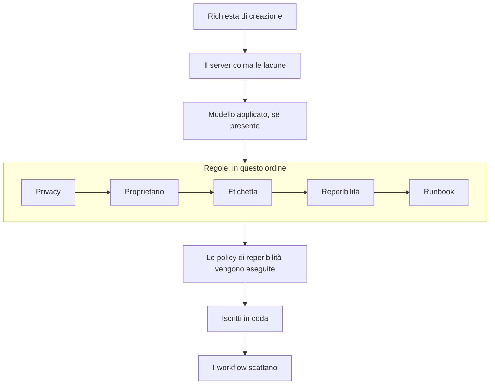

# Dichiarare un incidente

Dichiarare un incidente crea il documento su cui lavora il vostro team: riceve un numero, una gravità e uno stato di partenza, le sue policy di reperibilità avvisano le persone e — salvo indicazione contraria — gli iscritti alla pagina di stato ne vengono informati. Questa pagina percorre i cinque modi di dichiararne uno, campo per campo, e che cosa succede nel momento in cui esiste.

:::cards
- [Dichiararne uno a mano](#dichiararne-uno-a-mano): Il modulo in tre passaggi, campo per campo.
- [Dichiarare da un modello](#dichiarare-da-un-modello): Lo stesso tipo di incidente, precompilato ogni volta.
- [Dichiarare dai criteri di un monitor](#dichiarare-automaticamente-dai-criteri-di-un-monitor): Lasciate che un controllo fallito lo apra per voi.
- [Dichiarare tramite l'API](#dichiarare-tramite-lapi): Dal vostro codice, da uno script o da un altro strumento.
:::

## Cinque modi in cui viene dichiarato un incidente

Un incidente entra in OneUptime in cinque modi, e tutti finiscono nello stesso punto: una riga della tabella `Incident` con una gravità, uno stato attuale e un elenco di risorse interessate. L'unica differenza è chi compila i campi: voi alle 3 del mattino, un modello salvato, i criteri di un monitor, il vostro codice che chiama l'API, oppure qualcuno esterno al vostro team che compila un modulo.

| Se volete…                                                          | Scegliete                                                                   |
| ------------------------------------------------------------------- | --------------------------------------------------------------------------- |
| Aprire un incidente a mano, compilando tutto                        | La procedura guidata **Dichiara incidente**                                 |
| Aprire un tipo di incidente ricorrente con i campi precompilati     | **Crea da modello**                                                         |
| Aprirne uno automaticamente quando i controlli di un monitor falliscono | Un filtro dei criteri di un monitor con **Quando i filtri corrispondono, dichiara un incidente.** |
| Aprirne uno dal vostro codice, da uno script o da un altro strumento | `POST /api/incident`                                                       |
| Lasciare che persone esterne al vostro team segnalino un problema tramite un link | Un [modulo](/docs/forms/index)                                   |

Tutti e cinque scrivono lo stesso modello, quindi un incidente aperto da una sonda ha esattamente lo stesso aspetto di uno aperto a mano da un responder — a parte alcune colonne di servizio che il server imposta su quelli automatici. Lo scrivono anche le integrazioni: [Huntress](/docs/integrations/huntress) apre un incidente per ogni rapporto di incidente inviato dal suo SOC.

> [!TIP]
> Potete anche dichiarare un incidente dagli avvisi: **Dichiara incidente** in un elenco di avvisi, nell'intestazione di un avviso o nella pagina **Incidenti collegati** di un avviso apre la stessa procedura guidata, precompilata dagli avvisi, e li collega al nuovo incidente. Una casella del modulo, spuntata per impostazione predefinita, riconosce anche gli avvisi, così smettono di inoltrarsi. Vedete [Avvisi collegati](/docs/incidents/linked-alerts).

## Dichiararne uno a mano

Il modulo **Dichiara nuovo incidente** chiede un incidente in tre passaggi — **Dettagli dell'incidente**, **Risorse interessate** e **Reperibilità e ruoli** — poi mostra un riepilogo da controllare. Quando il vostro progetto chiede alla creazione alcuni dei suoi campi personalizzati dell'incidente, un quarto passaggio, **Dettagli**, arriva subito dopo **Risorse interessate**.

:::steps
1. Aprite **Incidenti → Tutti gli incidenti** e fate clic su **Dichiara incidente** in alto a destra dell'elenco **Incidenti**. Il modulo si apre su **Dettagli dell'incidente**.
2. Inserite un **Titolo** e scegliete una **Gravità incidente**. Il resto del modulo è facoltativo.
3. Fate clic su **Avanti** per percorrere i passaggi rimanenti, compilando ciò che sapete già: monitor e altre risorse, policy di reperibilità, ruoli.
4. Leggete il riepilogo e fate clic su **Dichiara incidente**. Arrivate sul nuovo incidente, e il suo **Incidente Feed** inizia a registrare.
:::

Solo il primo passaggio ha campi obbligatori, più qualsiasi campo personalizzato che i vostri amministratori hanno contrassegnato come **Obbligatorio alla creazione**, che viene chiesto dal passaggio **Dettagli**. Ogni passaggio prima del riepilogo ha un semplice **Avanti**, e **Dichiara incidente** si trova nel riepilogo, l'ultimo passaggio. Se avete fretta, compilate **Dettagli dell'incidente** e premete **Avanti** negli altri passaggi senza compilarli: collegare risorse, aggiungere policy di reperibilità e assegnare ruoli possono anche aspettare le pagine dell'incidente stesso. Premere **Enter** in un campo fa anche avanzare; non dichiara mai prima del riepilogo.

> [!TIP]
> Le opzioni di cui la maggior parte degli incidenti non ha mai bisogno aspettano sotto un'intestazione **Altri campi** alla fine del loro passaggio, ripiegata; fate clic per aprirla. Mentre è ripiegata, l'intestazione nomina ciò che contiene e mostra ogni opzione impostata, con il suo valore — impostata da un modello, ad esempio, o da un avviso privato da cui state dichiarando — e si apre da sola quando qualcosa al suo interno va corretto. Il riepilogo elenca una di queste opzioni solo quando è impostata — tranne **Notifica gli iscritti alla pagina di stato**, che elenca sempre, con chi verrà avvisato.

**Dalla pagina di una risorsa.** **Dichiara incidente** nella scheda **Incidenti** di un monitor, di un host, di un servizio, di un cluster o della maggior parte delle altre risorse apre lo stesso modulo con quella risorsa già scelta in **Risorse interessate**, così bastano un titolo e una gravità, e l'incidente compare nella scheda da cui siete partiti.

:::details Quali pagine di risorse lo offrono e che cosa scelgono
**Dichiara incidente** nella scheda **Incidenti** di un monitor, di un host, di un cluster Kubernetes, Proxmox, Ceph o Docker Swarm, di un host Docker o Podman, di un vCenter, di uno storage array, di una flotta IoT, di un database o di un servizio apre la stessa procedura guidata con quella risorsa già scelta in **Risorse interessate** (un monitor sotto **Monitor**, qualsiasi altra cosa sotto **Altre risorse interessate**), prima di qualsiasi cosa aggiunga un modello. Anche **Crea da modello** in quella scheda mantiene la risorsa. Il percorso di navigazione ripassa dalla scheda della risorsa, e una volta dichiarato arrivate sul nuovo incidente, come dall'elenco degli incidenti.

La scheda **Incidenti** di un elemento dell'inventario sceglie l'host, il servizio o il cluster Kubernetes a cui punta l'elemento, e il percorso di navigazione ripassa dalla scheda di quella risorsa. **Crea avviso** nella scheda **Avvisi** di una risorsa funziona allo stesso modo: da un monitor compila il **Monitor** dell'avviso, da qualsiasi altra risorsa **Altre risorse interessate**.

La risorsa viene cercata con i vostri permessi: se non potete leggerla, o è stata eliminata, il modulo si apre semplicemente senza nulla di scelto.
:::

### Passaggio 1 — Dettagli dell'incidente

- **Titolo** — obbligatorio. Il riepilogo di una riga che tutti vedranno nell'elenco, in Slack e (se l'incidente è visibile) sulla vostra pagina di stato. Testo segnaposto: `Incident Title`.
- **Gravità incidente** — obbligatoria. Una delle gravità configurate per il vostro progetto; i nuovi progetti vengono creati con **Critical Incident**, **Major Incident** e **Minor Incident**.
- **Descrizione** — facoltativa, scritta in Markdown. È il campo che compare sulla pagina di stato, quindi scrivetelo per i clienti anziché per il vostro team. Un'immagine che vi inserite viene mostrata a tutti mentre l'incidente è visibile sulle pagine di stato, e solo ai membri del vostro progetto mentre è nascosto. Potete modificarla in seguito da **Descrizione** nel menu laterale dell'incidente.

Sotto **Altri campi**:

- **Dichiarato il** — parte dal momento in cui avete aperto la pagina. È l'orario da cui viene misurata ogni durata dell'incidente, quindi retrodatatelo se state registrando qualcosa che è iniziato prima.
- **Stato iniziale** — facoltativo, e vuoto all'inizio. Se lasciato vuoto, l'incidente parte nello stato contrassegnato con `isCreatedState`, che i nuovi progetti creano come **Identified** — oppure nello stato iniziale del modello, quando dichiarate da un modello. Scegliete uno stato successivo solo quando registrate un incidente che aveva già superato quel punto, riconosciuto o risolto. Un incidente del genere non avvisa nessuno — vedete [Dichiarato già riconosciuto o risolto](#dichiarato-già-riconosciuto-o-risolto).
- **Etichette** — facoltative. Le etichette raggruppano incidenti correlati così potete filtrarli, e un team i cui permessi sono limitati a delle etichette vede solo gli incidenti che portano una delle sue etichette.
- **Incidente privato** — casella di controllo, disattivata per impostazione predefinita (`isPrivate`). Un incidente privato è visibile solo ai suoi utenti proprietari, ai membri dei suoi team proprietari, agli amministratori e ai proprietari del progetto — ed è nascosto da ogni pagina di stato, indipendentemente da qualsiasi altra impostazione, comprese le pagine di stato a cui è limitato. L'elenco degli incidenti li contrassegna con un'etichetta rossa **Private**.

> [!NOTE]
> **Anche avvisi ed episodi partono nello stato che scegliete.** **Crea avviso**, e **Crea episodio** negli elenchi degli episodi di incidenti e di avvisi, hanno lo stesso **Stato iniziale** sotto **Altri campi**. Se lasciato vuoto, l'avviso o l'episodio parte nello stato di creazione del progetto. Scegliete uno stato successivo per registrarne uno che era già riconosciuto o risolto: parte in quello stato, la sua cronologia degli stati inizia con esso, e un episodio registrato come risolto conta subito come risolto. I suoi proprietari non vengono informati di quel primo stato a parte, e gli iscritti alla pagina di stato di un episodio di incidente ne vengono informati una volta, quando l'episodio viene creato. Un avviso o un episodio registrato così non avvisa nessuno, come un incidente: vedete [Dichiarato già riconosciuto o risolto](#dichiarato-già-riconosciuto-o-risolto). Tramite l'API, la stessa scelta è `currentAlertStateId` o `currentIncidentStateId` — vedete [Riferimento API OneUptime](/docs/api-reference/api-reference).

:::details Scrivere nell'editor Markdown
La descrizione — come le note, la causa principale, il rimedio e i campi personalizzati di testo formattato — si scrive nell'editor Markdown. Si apre in modalità visuale, che mostra il testo formattato; **Markdown** nella sua barra degli strumenti passa alla modalità Markdown, che mostra il sorgente Markdown, e **Visual** torna indietro. In un elenco, **Aumenta rientro** e **Riduci rientro** nella sua barra degli strumenti, oppure Tab e Maiusc+Tab, annidano un elemento sotto quello sopra e lo fanno uscire di nuovo; dove non c'è nulla sotto cui annidare, e fuori da un elenco, Tab passa al campo successivo come di consueto. In modalità visuale, **Blocco di codice**, **Tabella** ed **Elenco di attività** a metà o alla fine di una riga dividono la riga al cursore e mettono il nuovo blocco su righe proprie — anche al bordo di una parola in grassetto, di un link o di un codice in linea, senza lasciare formattazione vuota dietro di sé — ed **Elenco di attività** in un elemento di elenco aggiunge la sua attività all'elenco di quell'elemento anziché come sottoattività. In modalità Markdown, **Blocco di codice** e **Tabella** vengono inseriti al cursore, quindi iniziate prima una nuova riga per loro, **Elenco di attività** trasforma in attività la riga del cursore, ed **Elenco numerato** numera ogni livello di un elenco annidato a partire da 1. La barra degli strumenti sta su una riga: i moduli con l'editor si aprono in una finestra di dialogo ampia, quindi sulla maggior parte degli schermi ci stanno tutti i pulsanti, e dove non ci stanno — su un telefono, o in una finestra stretta — i pulsanti che non ci stanno si trovano sotto **Altra formattazione** (**⋯**) alla fine della barra degli strumenti, nello stesso ordine, e ognuno che scegliete lì viene inserito dove si trovava il cursore. Sugli schermi più stretti, anche l'interruttore **Markdown** finisce lì.

**Annullare.** In modalità visuale, Ctrl+Z (Cmd+Z su un Mac) annulla le vostre modifiche una alla volta, dalla più recente — ciò che avete digitato e anche le modifiche dell'editor stesso: un rientro aumentato o ridotto, un blocco che ha inserito in una riga, un incollaggio formattato o a blocchi — e Ctrl+Maiusc+Z (Cmd+Maiusc+Z) o Ctrl+Y le ripristinano nello stesso ordine. In modalità Markdown, Ctrl+Z annulla un rientro aumentato o ridotto, la modifica di un pulsante di elenco e un incollaggio formattato, ma non ciò che inseriscono i pulsanti **Blocco di codice**, **Tabella** e **Linea orizzontale**.

**Incollarci dentro.** Incollare da Word, Google Docs o una pagina di OneUptime — la descrizione di un altro incidente, ad esempio — mantiene gli elenchi e il loro annidamento, i link e la formattazione, e i punti elenco `•` incollati diventano un vero elenco. I link che sono solo un'icona, come l'ancora accanto a un titolo su GitHub, vengono tralasciati. In modalità visuale, codice o una citazione incollati in una riga diventano un blocco a sé, dividendo la riga, e un elenco incollato in un elemento di elenco si unisce all'elenco di quell'elemento invece di annidarvisi — incollato nell'elemento vuoto lasciato da Invio, ne prende il posto — mentre un blocco di codice, una citazione o una tabella incollati in un elemento vi restano dentro. In modalità Markdown, ciò che l'incollaggio trasforma in blocchi — codice, una citazione, un elenco, un titolo, più paragrafi — va su righe proprie, con una riga vuota da ciascun lato, quando cade a metà di una riga, e un elenco incollato alla fine della riga di un elemento di elenco, o dopo un `- ` isolato, si unisce a quell'elenco con il rientro dell'elemento; il Markdown copiato come testo semplice viene inserito al cursore esattamente com'è. Qualsiasi cosa incolliate dentro un blocco di codice resta esattamente come l'avete copiata. Incollare sopra una selezione che si estende su più elementi, paragrafi o celle di tabella la sostituisce, come farebbe la digitazione. In modalità visuale, un incollaggio o il pulsante **Codice** sopra delle celle di tabella mantiene ogni cella e colonna, un incollaggio non lascia dietro di sé punti elenco, citazioni o blocchi di codice vuoti, e quando la selezione termina dentro un blocco di codice, solo il resto di quella riga di codice si unisce al testo.

**Copiare da una nota.** Un blocco di codice copiato da una nota o da una descrizione si reincolla come blocco di codice nel suo linguaggio, e così anche una sua riga copiata con il suo a capo, come la copia un triplo clic in Chrome, Edge e Safari. Una parola o parte di una riga copiata da un blocco di codice si incolla come codice in linea. In Chrome, Edge e Safari, le righe copiate da una vista di codice disegnata come tabella — la scheda YAML di una risorsa Kubernetes, i frame della traccia dello stack di un'eccezione — si incollano come testo semplice, con il rientro mantenuto.
:::

### Passaggio 2 — Risorse interessate

I monitor vengono per primi, a sé, perché le pagine di stato vedono un incidente attraverso i suoi monitor, e lo stato in cui passano i monitor si trova subito sotto.

- **Monitor** — un campo di ricerca che collega i monitor interessati dall'incidente; la sua scheda **Etichette** aggiunge in una volta ogni monitor con un'etichetta. Una pagina di stato mostra un incidente, e ne informa i suoi iscritti, quando elenca uno dei monitor dell'incidente, quindi sono questi a decidere quali pagine di stato ne vengono informate (`monitors` sull'incidente).
- **Cambia lo stato del monitor in** — facoltativo, e mostrato solo una volta scelto almeno un monitor. Sceglie uno stato del monitor che viene applicato a ogni monitor collegato a questo incidente, così dichiarare l'incidente e segnare i monitor come degradati è un'unica azione anziché due. Dichiarare da un modello che ne imposta uno parte con lo stato del modello, mostrato non appena scegliete un monitor. Senza monitor scelti non viene salvato alcuno stato, nemmeno quello del modello; togliete l'ultimo monitor e il campo scompare finché non ne scegliete un altro, che riporta la vostra scelta. Lo stato di un monitor è condiviso da ogni pagina di stato che lo elenca, quindi con delle pagine di stato scelte sotto **Altri campi**, il modulo vi ricorda che il cambiamento compare anche sulle pagine che non avete scelto.
- **Altre risorse interessate** — un secondo campo di ricerca per tutto il resto interessato dall'incidente: host, cluster Kubernetes, host Docker e Podman, cluster Proxmox, Ceph e Docker Swarm, vCenter, storage array, flotte IoT, database e servizi — tutto ciò che, oltre ai monitor, offre la scheda **Risorse interessate** dell'incidente stesso. Dietro le quinte si tratta di relazioni separate sull'incidente (`hosts`, `kubernetesClusters`, `dockerHosts`, `podmanHosts`, `services` e altre), ma il modulo le riunisce in un unico selettore.

Un monitor può indicare che cosa sorveglia — **Monitor → Panoramica → Risorse collegate**, gli stessi tipi di risorse di **Altre risorse interessate**. Scegliete un monitor del genere e ciò a cui è collegato viene aggiunto subito ad **Altre risorse interessate**, e una riga sotto il campo nomina ciò che è stato aggiunto. Togliete ciò che non volete prima di dichiarare: per quel monitor non viene aggiunto più nulla finché restate sul modulo, e togliere il monitor lascia ciò che ha aggiunto. Lo stesso accade quando un monitor arriva da un modello o dalla pagina da cui state dichiarando, e su **Crea avviso** e **Schedule Maintenance**.

La scheda **Risorse interessate** dell'incidente pone le stesse domande quando la modificate in seguito: **Monitor**, **Cambia lo stato del monitor in** non appena c'è un monitor, poi **Altre risorse interessate**. Salvare un incidente senza più alcun monitor mantiene lo stato che aveva.

Sotto **Altri campi**:

- **Limita a queste pagine di stato** — facoltativo. Se lasciato vuoto, l'incidente compare su ogni pagina di stato che elenca i suoi monitor, e ne informa gli iscritti. Scegliete delle pagine qui e vengono usate solo quelle scelte tra queste; la scheda **Etichette** aggiunge in una volta ogni pagina con un'etichetta. Il modulo vi avverte quando una pagina scelta non elenca nessuno dei monitor dell'incidente, e quando l'incidente è privato, il che lo nasconde da ogni pagina di stato. Vedete [Una pagina di stato per pubblico](/docs/status-pages/one-status-page-per-audience).
- **Notifica gli iscritti alla pagina di stato** — casella di controllo, attiva per impostazione predefinita. Stabilisce se gli iscritti vengono avvisati della creazione dell'incidente (`shouldStatusPageSubscribersBeNotifiedOnIncidentCreated`). Ripiegarla sotto **Altri campi** non cambia nulla di ciò che fa: parte sempre spuntata, e il riepilogo la elenca sempre. Sotto di essa, e di nuovo nel riepilogo prima dell'invio, **Will notify** elenca le pagine di stato che verranno informate, con un numero di iscritti «fino a» per canale, e le pagine che non verranno informate e perché. Quando nessuno verrà informato (nessun monitor collegato, nessuna pagina di stato elenca i monitor, oppure le pagine non hanno ancora iscritti) non mostra nulla, e avverte solo quando il motivo è l'ambito delle pagine di stato dell'incidente. Nel riepilogo, **Anteprima**, accanto a **Sì**, mostra l'e-mail che riceveranno gli iscritti di ciascuna di queste pagine di stato, e **Inviami un test** la invia all'indirizzo e-mail del vostro account; vedete [Iscritti e annunci](/docs/status-pages/subscribers#incidenti). Disattivatela per il rumore interno che volete comunque registrare. L'incidente resta allora silenzioso per impostazione predefinita: le nuove note pubbliche su di esso, e la finestra di cambio di stato della sua pagina di panoramica (**Riconosci**, **Risolvi** o la scelta di un altro stato), partono con la propria casella **Notifica gli iscritti alla pagina di stato** disattivata. Il modulo manuale della pagina **Cronologia stato** e l'azione di massa **Cambia stato** dell'elenco degli incidenti partono comunque con la casella attiva.

> [!IMPORTANT]
> **Collegate i monitor anche quando sembra superfluo.** Il legame tra un incidente e una pagina di stato passa per i monitor dell'incidente: una pagina di stato mostra un incidente, e ne informa i suoi iscritti, quando una delle sue risorse è uno dei monitor dell'incidente. **Limita a queste pagine di stato** può solo restringere quell'elenco, mai ampliarlo, e una pagina di stato con **Mostra solo gli incidenti limitati a questa pagina** attivo mostra solo gli incidenti limitati a essa. Un incidente senza monitor collegati non avvisa alcun iscritto alla pagina di stato. Vedete [Risorse e gruppi della pagina di stato](/docs/status-pages/resources-and-groups).

Il flag **Should be visible on status page?** (`isVisibleOnStatusPage`) non è nella procedura guidata; vale true per impostazione predefinita. Cambiatelo in seguito da **Impostazioni** nel menu laterale dell'incidente, dove si chiama **Visibile sulla pagina di stato**.

**Dichiarare nascosto e pubblicare dopo.** Un incidente nascosto dalle pagine di stato al momento della creazione non avvisa alcun iscritto, e il suo stato di notifica indica **Saltato: nascosto dalle pagine di stato**. Quando in seguito attivate **Visibile sulla pagina di stato**, il modulo di modifica offre **Notifica agli iscritti che questo incidente è stato creato**, così la routine — dichiarare nascosto, capire chi è colpito, poi pubblicare — li informa comunque. Parte spuntata finché l'incidente non è risolto e senza spunta una volta risolto, così pubblicare un vecchio incidente per la cronaca non lo annuncia come nuovo. Viene offerta solo quando l'incidente è stato dichiarato con **Notifica gli iscritti alla pagina di stato** attivo e non è privato — quindi non per un incidente segnalato tramite un [modulo](/docs/forms/on-submit), che viene dichiarato nascosto con l'opzione disattivata. Tramite l'API, inviate `"miscDataProps": {"notifySubscribersOfIncidentCreatedOnPublish": true}` con l'aggiornamento che porta `isVisibleOnStatusPage` a `true`, oppure riportate voi stessi `subscriberNotificationStatusOnIncidentCreated` a `Pending`. Un post-mortem pubblicato mentre l'incidente era nascosto non ha bisogno di caselle: attivare **Visibile sulla pagina di stato** lo invia una volta, come descritto in [Iscritti e annunci](/docs/status-pages/subscribers#incidenti).

### Dettagli — i vostri campi personalizzati dell'incidente

Questo passaggio compare solo quando almeno un campo personalizzato dell'incidente ha **Mostra alla creazione** attivo in **Incidenti → Impostazioni → Campi personalizzati** — oppure, quando dichiarate da un modello, quando i **Campi personalizzati alla creazione** del modello ne chiedono uno. Chiede quei campi, nel loro **Ordine** — quello in cui vengono trascinati in quella pagina di impostazioni — con l'input richiesto dal loro tipo: un menu a tendina, un numero, una data, un interruttore sì/no, testo lungo, o testo formattato nell'editor Markdown. Viene anche omesso per chi non può leggere i campi personalizzati dell'incidente del progetto: su OneUptime Cloud serve il piano **Growth** o superiore, e un ruolo che possa vedere i campi personalizzati degli incidenti.

- Un campo contrassegnato come **Obbligatorio alla creazione** deve essere compilato prima di poter dichiarare. Un campo sì/no obbligatorio — una conferma, ad esempio — deve essere attivato.
- Uno 0 o un interruttore lasciato disattivato è una risposta, e viene salvato come tale.
- Un campo il cui valore viene copiato da un campo personalizzato del monitor non viene chiesto una volta che l'incidente ha un monitor, perché il valore viene copiato dal monitor quando l'incidente viene creato.
- Dichiarare da un modello fa partire il passaggio con i valori del modello, e i valori del modello per i campi che il passaggio non chiede vengono mantenuti così come sono. Un valore che cancellate nel passaggio resta cancellato. Un valore del modello che non si adatta più al suo campo — un'opzione del menu a tendina rimossa nel frattempo — viene tralasciato anziché far rifiutare l'incidente.
- Dichiarare da un modello segue anche i **Campi personalizzati alla creazione** del modello. Un campo che esso contrassegna come **Obbligatorio** o **Facoltativo** viene chiesto anche quando il progetto non lo mostra alla creazione, un campo che contrassegna come **Nascosto** non viene chiesto — il valore del modello per esso si applica comunque — e un campo lasciato su **Predefinito** segue i propri **Mostra alla creazione** e **Obbligatorio alla creazione**. Vedete [Campi personalizzati alla creazione](/docs/incidents/settings#campi-personalizzati-alla-creazione).

**Obbligatorio alla creazione** viene controllato solo dalla dashboard, così come i **Campi personalizzati alla creazione** di un modello. Gli incidenti creati da monitor, API, Slack, Microsoft Teams o IA possono lasciare vuoto un campo, e ogni campo resta facoltativo in seguito nella pagina **Campi personalizzati** dell'incidente, così correggere un valore nel pieno di un disservizio non richiede mai tutti gli altri. Vedete [Campi personalizzati](/docs/incidents/settings#campi-personalizzati) per i tipi di campo e le impostazioni.

### Passaggio 3 — Reperibilità e ruoli

- **Policy di reperibilità** — una selezione multipla delle policy di reperibilità da eseguire quando viene creato questo incidente. Corrisponde a `onCallDutyPolicies` sull'incidente.
- **Assegna ruoli incidente** — chi prende ciascun ruolo definito dal vostro progetto, una scheda per ruolo. Un ruolo contrassegnato come **Principale** che lasciate vuoto è vostro: lo prendete quando l'incidente viene dichiarato, e il riepilogo lo dice. Un ruolo che accetta una sola persona lo indica non appena ne ha una; un ruolo che ne accetta diverse mantiene il suo selettore.

Questo è l'unico punto in cui una policy di reperibilità viene collegata direttamente a un incidente. Le gravità non portano con sé una policy di reperibilità — la gravità è un'etichetta, e influisce sugli avvisi solo come *criterio di corrispondenza* all'interno di una regola di reperibilità. Le regole configurate in **Incidenti → Regole → Regole di reperibilità** aggiungono le loro policy a ciò che scegliete qui; l'insieme finale che viene eseguito è l'unione delle due, senza duplicati. Un incidente dichiarato in uno stato successivo non ne esegue nessuna — vedete [Dichiarato già riconosciuto o risolto](#dichiarato-già-riconosciuto-o-risolto).

I ruoli stessi si configurano in **Incidenti → Impostazioni → Ruoli incidente**. Un nuovo progetto ne ha uno, Comandante dell'incidente; aggiungete lì Responder, Responsabile della comunicazione o qualsiasi altra cosa serva al vostro processo. Se non scegliete nessuno come Comandante dell'incidente, lo diventate voi quando l'incidente viene dichiarato.

## Dichiarare da un modello

Se continuate a dichiarare lo stesso tipo di incidente — lo stesso schema di titolo, la stessa gravità, la stessa policy di reperibilità — salvatelo una volta come modello, poi dichiarate da esso:

:::steps
1. Nell'elenco **Incidenti**, fate clic su **Crea da modello** (il pulsante con il bordo accanto a **Dichiara incidente**). Si apre una finestra **Crea incidente da modello**, con un menu a tendina **Seleziona modello di incidente**.
2. Scegliete un modello. Il modulo di creazione si apre precompilato.
3. Cambiate ciò che questa volta è diverso, poi percorrete i passaggi e dichiarate come di consueto.
:::

Se il vostro progetto non ha ancora modelli, ottenete invece una finestra **No Incident Templates**, con un pulsante **Create Template** che vi porta a **Incidenti → Impostazioni → Modelli di incidenti**.

I modelli si costruiscono con la loro procedura guidata in quattro passaggi — **Informazioni del modello**, **Dettagli dell'incidente**, **Risorse interessate**, **Reperibilità** — più i passaggi **Campi personalizzati** e **Campi personalizzati alla creazione** dopo **Risorse interessate** quando il vostro progetto ha campi personalizzati dell'incidente. Lo **Stato iniziale dell'incidente**, i **Proprietari** e le **Etichette** del modello si trovano sotto **Altri campi** alla fine di **Dettagli dell'incidente**. **Risorse interessate** pone le domande come il modulo di dichiarazione — **Monitor**, poi **Cambia lo stato del monitor in**, poi **Altre risorse interessate**, con **Limita a queste pagine di stato** sotto **Altri campi** — tranne che un modello chiede sempre lo stato del monitor: si applica anche ai monitor scelti quando un incidente viene dichiarato dal modello. Questi sono i campi:

| Campo                                   | Scopo                                                  |
| --------------------------------------- | ------------------------------------------------------ |
| **Nome del modello**                    | Come il modello viene identificato nel selettore.      |
| **Descrizione del modello**             | Una nota per il vostro io futuro su quando usarlo.     |
| **Titolo**                              | Il titolo precompilato sull'incidente.                 |
| **Descrizione**                         | La descrizione Markdown precompilata sull'incidente.   |
| **Gravità incidente**                   | La gravità precompilata sull'incidente.                |
| **Stato iniziale dell'incidente**       | Lo stato in cui partono gli incidenti di questo modello. Se lasciato vuoto, il consueto stato di partenza. Un incidente che parte riconosciuto o risolto non avvisa nessuno. |
| **Monitor**                             | I monitor da collegare.                                |
| **Cambia lo stato del monitor in**      | Lo stato del monitor da applicare ai monitor dell'incidente, compresi quelli scelti alla dichiarazione. |
| **Altre risorse interessate**           | Host, cluster e servizi da collegare.                  |
| **Limita a queste pagine di stato**     | Le pagine di stato a cui l'incidente è limitato.       |
| **Policy di reperibilità**              | Le policy da eseguire quando l'incidente viene creato. |
| **Proprietari**                         | Le persone e i team proprietari degli incidenti creati da questo modello, scelti da un unico elenco. |
| **Etichette**                           | Le etichette applicate all'incidente.                  |
| **Campi personalizzati**                | I valori dei campi personalizzati dell'incidente.      |
| **Campi personalizzati alla creazione** | Quali campi personalizzati chiede il passaggio **Dettagli**, e quali devono essere compilati. |

Qualche regola veloce:

- I modelli non si modificano dall'elenco dei modelli — ne create uno, poi lo aprite per modificarlo.
- Un modello compila solo un campo che avete lasciato vuoto. Nella pagina di creazione il modello viene applicato come una precompilazione che potete sovrascrivere; sul server — per un modulo che dichiara da un modello — un campo viene compilato dal modello solo quando la richiesta ha lasciato quel campo `undefined`. Ciò che il chiamante ha fornito vince sempre.
- Il passaggio **Dettagli** segue i **Campi personalizzati alla creazione** del modello, come [descritto sopra](#dettagli-i-vostri-campi-personalizzati-dellincidente).
- I valori dei campi personalizzati si uniscono campo per campo. I valori di un modello compilano i campi personalizzati senza i quali l'incidente viene dichiarato; un valore impostato nel passaggio **Dettagli**, o inviato nei `customFields` della richiesta, vince sempre — `0`, `false` e `null` compresi. Un campo copiato da un campo personalizzato del monitor prende comunque il valore del monitor.
- I valori dei campi personalizzati di un modello esistente si trovano nella sua scheda **Campi personalizzati**, accanto alle sue altre schede.
- I **Proprietari** del modello vengono aggiunti una volta che esistono i canali Slack e Microsoft Teams dell'incidente, così una regola di notifica che invita i proprietari degli incidenti in un nuovo canale invita anche loro. Dichiarare da un modello nella dashboard li aggiunge senza la notifica «siete stati aggiunti»; un [modulo](/docs/forms/on-submit) con un modello li avvisa, e trattiene la notifica **Incidente creato** dell'incidente finché non vengono aggiunti, così arriva a loro anziché ai proprietari del progetto.

## Dichiarare automaticamente dai criteri di un monitor

La maggior parte degli incidenti non dovrebbe aver bisogno di una persona che li digiti. I criteri di un monitor possono dichiararne uno nel momento in cui un filtro corrisponde:

:::steps
1. Aprite il monitor, scegliete **Criteri** nel suo menu laterale e fate clic su **Edit Monitoring Criteria**. (Un nuovo monitor chiede gli stessi criteri mentre lo create.)
2. Nel filtro dei criteri che deve dichiarare, attivate **Quando i filtri corrispondono, dichiara un incidente.** Compare una sezione **Crea incidente** con un pulsante **Aggiungi incidente** — un filtro dei criteri può dichiarare più di un incidente.
3. Compilate i campi dell'incidente (sotto) e salvate. La prossima volta che il filtro corrisponde, l'incidente viene dichiarato e avvisa le sue policy di reperibilità.
:::

Ogni voce di incidente ha:

- **Titolo dell'incidente** — supporta i modelli; il testo segnaposto suggerisce qualcosa come `{{monitorName}} is down`.
- **Gravità** — obbligatoria.
- **Descrizione dell'incidente** — supporta anch'essa i modelli.
- **Reperibilità → Policy di reperibilità** — le policy eseguite quando viene creato questo incidente.
- **Ruoli incidente** — chi prende ciascun ruolo sull'incidente, scelto sulle stesse schede di **Assegna ruoli incidente** nel modulo di dichiarazione, una per ruolo. Mostrato quando il vostro progetto ha ruoli dell'incidente.
- **Proprietà ed etichette → Proprietari** (persone e team, scelti da un unico elenco), **Etichette**.
- **Altri campi → Risoluzione automatica dell'incidente** (risolve l'incidente automaticamente quando i criteri smettono di corrispondere), **Mostra incidente sulla pagina di stato**, **Incidente privato** e **Note di rimedio**.

Per l'elenco completo dei segnaposto `{{variable}}` che potete usare nel titolo, nella descrizione e nelle note di rimedio, vedete [Modelli di incidenti e avvisi](/docs/monitor/incident-alert-templating).

Gli incidenti creati in questo modo vengono contrassegnati dal server: viene impostato `isCreatedAutomatically`, `createdCriteriaId` registra quale filtro dei criteri è scattato, e `createdByProbe` quale sonda l'ha visto. Per tutto il resto si comportano esattamente come un incidente dichiarato a mano.

Un incidente dichiarato da un monitor è collegato a ciò che il monitor sorveglia: tutto ciò che nomina la sua configurazione (l'host di un monitor di host, il cluster di un monitor Kubernetes, i servizi di un monitor dei log) e tutto ciò che sta sotto le sue **Risorse collegate**. La configurazione di un monitor di sito web o di API non nomina alcuna infrastruttura, quindi collegatelo al cluster, agli host o al database dietro il sito: i suoi incidenti compaiono allora sulle pagine di quelle risorse, OneUptime AI può esaminarli lì e la correzione IA del cluster o della risorsa può agire su di essi (vedete [AI SRE](/docs/ai/ai-sre#which-incidents-a-clusters-fixes-act-on)). Gli avvisi creati da un monitor vengono collegati allo stesso modo.

## Dichiarare tramite l'API

Il modello dell'incidente espone un endpoint CRUD standard, quindi `POST /api/incident` ne crea uno. Autenticatevi con una chiave API generata in **Impostazioni del progetto → Avanzato → Chiavi API**, inviata nell'intestazione `apikey` — la chiave identifica il progetto, quindi non serve passare un id di progetto a parte.

```bash
curl -X POST https://oneuptime.com/api/incident \
  -H "apikey: $ONEUPTIME_API_KEY" \
  -H "Content-Type: application/json" \
  -d '{
    "data": {
      "title": "Checkout latency above SLO",
      "description": "Investigating elevated p99 latency on the checkout service.",
      "incidentSeverityId": "<incident-severity-id>"
    }
  }'
```

Campi utili del corpo della richiesta:

| Campo                    | Obbligatorio | Note                                                                                                                                                                                                                                        |
| ------------------------ | ------------ | ------------------------------------------------------------------------------------------------------------------------------------------------------------------------------------------------------------------------------------------- |
| `title`                  | Sì           | Il titolo dell'incidente.                                                                                                                                                                                                                   |
| `incidentSeverityId`     | Sì           | Una delle gravità del vostro progetto. Il server controlla che appartenga allo stesso progetto della chiave API, e altrimenti rifiuta la richiesta.                                                                                         |
| `declaredAt`             | No           | Facoltativo qui anche se il modulo lo richiede. Omettetelo e il server usa l'ora attuale.                                                                                                                                                   |
| `currentIncidentStateId` | No           | Lo stato in cui partire; se omesso, lo stato di creazione. Controllato rispetto al progetto della chiave API, come la gravità. Lo stesso controllo si applica allo stato del monitor dietro **Cambia lo stato del monitor in**.            |
| `statusPages`            | No           | Gli id delle pagine di stato a cui limitare l'incidente, tutte dello stesso progetto. Omettetelo per raggiungere ogni pagina di stato che elenca i monitor dell'incidente. `isScopedToStatusPages` viene ricavato da esso, e un valore che inviate per questo viene ignorato. Vedete [Una pagina di stato per pubblico](/docs/status-pages/one-status-page-per-audience). |
| `customFields`           | No           | I valori dei campi personalizzati dell'incidente, indicizzati per nome di ciascun campo. Ogni valore che inviate deve adattarsi al suo campo — un numero per un campo **Numero**, una delle opzioni per un **Menu a tendina (selezione singola)** — altrimenti la richiesta viene rifiutata con un errore `400` che nomina il campo. **Obbligatorio alla creazione** qui non viene controllato. Vedete [Valori dei campi personalizzati tramite l'API](/docs/incidents/settings#valori-dei-campi-personalizzati-tramite-lapi). |

Una chiave API non può dichiarare da un modello: una richiesta che invia `createdIncidentTemplateId` viene rifiutata. OneUptime imposta quella colonna da sé, per gli incidenti segnalati tramite un [modulo](/docs/forms/on-submit) e per il passaggio **Create One Incident** di un workflow, che dichiara dal modello scelto nella sua impostazione **Incident Template** (vedete [Componenti del workflow](/docs/workflows/components)). Per dichiarare da un modello tramite l'API, leggete il modello da `/api/incident-templates` e inviate i suoi valori nella richiesta.

Gli endpoint correlati sono `/api/incident-state`, `/api/incident-severity` e `/api/incident-state-timeline`. Il [riferimento API](/reference) generato riporta la forma esatta di richieste e risposte per ciascuno, compreso il modo in cui si esprimono i campi di relazione come i monitor.

## Segnalare tramite un modulo

La quinta via d'accesso è per le persone esterne al vostro team. Un modulo è una pagina che condividete come link: chiunque lo abbia può segnalare un problema senza un account OneUptime, e ogni invio dichiara un incidente. Voi costruite ciò che il modulo chiede — un titolo, una descrizione, una gravità, dei monitor, campi personalizzati, domande vostre — e decidete come le risposte diventano l'incidente: una gravità predefinita, un modello di incidente da cui dichiarare, e monitor, etichette, policy di reperibilità e proprietari da aggiungere sempre.

Gli incidenti segnalati così vengono dichiarati nascosti dalle pagine di stato, con **Notifica gli iscritti alla pagina di stato** disattivata, così un responder li valuta prima che qualcosa diventi pubblico, e una nota privata registra chi li ha segnalati. I moduli sono un prodotto a sé, sotto **Moduli** nel menu **Prodotti**, e possono anche pianificare eventi di manutenzione; vedete [Moduli](/docs/forms/index).

## Numeri e prefissi degli incidenti

Ogni incidente riceve un numero progressivo da un contatore del progetto, assegnato dal server al momento della creazione. Lo conservano due colonne: `incidentNumber` (l'intero grezzo) e `incidentNumberWithPrefix` (ciò che vedete davvero). Senza prefisso configurato, il valore mostrato è `#42`.

:::steps
1. Andate in **Incidenti → Impostazioni → Prefisso del numero** e fate clic su **Aggiorna**.
2. Digitate il prefisso in **Prefisso del numero dell'incidente**. Il campo mostra un'anteprima del numero mentre digitate: `INC-` lo trasforma in `INC-42`. Lasciatelo vuoto per mantenere il `#` predefinito.
3. Fate clic su **Salva modifiche**. Gli incidenti dichiarati da ora in poi ricevono il nuovo prefisso; quelli esistenti mantengono il loro numero.
:::

La stessa finestra ha **Prefisso del numero dell'episodio dell'incidente** per la numerazione degli episodi. [Prefissi dei numeri](/docs/incidents/settings#prefissi-dei-numeri) elenca le regole che segue un prefisso.

Il numero compare come prima colonna dell'elenco degli incidenti, porta all'incidente e appare come **Numero dell'incidente** nella **Panoramica** dell'incidente.

## Che cosa succede nel momento in cui un incidente viene dichiarato

La chiamata di creazione fa più che scrivere una riga:



In ordine:

1. **Il server colma le lacune.** `declaredAt` vale adesso per impostazione predefinita, lo stato attuale vale per impostazione predefinita lo stato `isCreatedState` del progetto, e il numero dell'incidente e il numero con prefisso vengono assegnati dal contatore del progetto.
2. **Viene applicato un modello**, quando un modulo o il passaggio **Create One Incident** di un workflow dichiara l'incidente da uno (`createdIncidentTemplateId`) — compilando solo i campi che il chiamante ha lasciato non definiti; uno stato nominato dal chiamante vince su quello del modello. La dashboard invece applica un modello nel modulo, prima che la richiesta venga inviata.
3. **Vengono eseguite le regole di privacy**, che contrassegnano l'incidente come privato quando una regola corrispondente lo prevede. È il primo motore di regole a essere eseguito, così tutto ciò che viene dopo vede l'impostazione di privacy corretta.
4. **Vengono eseguite le regole del proprietario**, che aggiungono gli utenti e i team proprietari nominati dalle regole corrispondenti.
5. **Vengono eseguite le regole delle etichette**, che aggiungono le etichette corrispondenti all'incidente.
6. **Vengono eseguite le regole di reperibilità.** Ogni regola abilitata in **Incidenti → Regole → Regole di reperibilità** i cui criteri corrispondono aggiunge le sue policy all'incidente. Non c'è ordine di priorità né cortocircuito — tutte le regole corrispondenti scattano e le policy vengono deduplicate.
7. **Vengono eseguite le regole di runbook**, che collegano e avviano i runbook corrispondenti. Vedete [Runbook](/docs/runbooks/index).
8. **Le policy di reperibilità vengono eseguite.** Ogni policy dell'incidente — scelta nella procedura guidata, ereditata da un modello o aggiunta da una regola — viene eseguita in parallelo con il tipo di evento `IncidentCreated`. Il fallimento di una policy non ferma le altre. Una policy archiviata non avvisa nessuno: il suo registro di esecuzione sull'incidente dice che non è stata eseguita perché la policy è archiviata. Un incidente dichiarato già riconosciuto o risolto non ne esegue nessuna; vedete [Dichiarato già riconosciuto o risolto](#dichiarato-già-riconosciuto-o-risolto) più sotto.
9. **Gli iscritti vengono messi in coda**, se **Notifica gli iscritti alla pagina di stato** è rimasta attiva e l'incidente è visibile sulla pagina di stato. L'invio viene gestito da un'attività in background, non all'interno della vostra richiesta, e va alle pagine di stato che l'incidente raggiunge: quelle che elencano i suoi monitor, ristrette da **Limita a queste pagine di stato**, e senza le pagine che mostrano solo gli incidenti limitati a esse quando l'incidente non è limitato. Una pagina di stato archiviata non invia nulla. Il suo avanzamento compare come **Stato notifica iscritto** nella **Panoramica** dell'incidente: che cosa è stato inviato e che cosa è fallito su ogni pagina di stato, e **Riprova** o **Invia di nuovo** una volta concluso. Vedete [Iscritti e annunci](/docs/status-pages/subscribers).
10. **I workflow scattano.** Il trigger **On Create Incident** avvia qualsiasi workflow costruito su di esso. Vedete [Panoramica dei workflow](/docs/workflows/index).

Da lì l'incidente è attivo: conta per il badge **Incidenti attivi** nel menu laterale di Incidenti (qualsiasi stato sopra il vostro stato risolto conta come attivo), compare sulle pagine di stato che portano uno dei suoi monitor (solo quelle scelte, se lo avete limitato), e la sua **Cronologia stato** inizia a registrare.

### Dichiarato già riconosciuto o risolto

Scegliere uno **Stato iniziale** successivo — nel modulo, tramite lo **Stato iniziale dell'incidente** di un modello, oppure con `currentIncidentStateId` dall'API, da Terraform o da un workflow — registra un incidente di cui qualcuno si sta già occupando, o che è già finito. Non viene trattato come una nuova emergenza:

```mermaid title="Che cosa mette in moto un nuovo incidente, in base allo stato in cui parte"
flowchart TB
    start{"Stato di partenza"} -->|"Stato di creazione, quello predefinito"| live["Trattato come nuovo: avvisa la reperibilità"]
    start -->|"Riconosciuto o oltre"| acked["Registrato: non avvisa nessuno"]
    start -->|"Risolto o oltre"| over["Registrato come finito"]
    over --> quiet["Niente raggruppamento, runbook, IA, canale né SLA"]
```

- **Al vostro stato riconosciuto o oltre** — **Riconosciuto**, o qualsiasi stato posto sotto di esso in **Incidenti → Impostazioni → Stato incidente** — non viene eseguita alcuna policy di reperibilità, quindi nessuno viene avvisato. L'incidente elenca comunque le sue policy, quelle che avete scelto e quelle aggiunte dalle regole di reperibilità, e il suo feed dice perché in una riga: _No one was paged. This incident was created already acknowledged, so its on-call policy **Primary** was not run._ Il suo SLA, se una regola gliene assegna uno, parte già con la risposta registrata. Tutto il resto qui sotto viene eseguito come per qualsiasi nuovo incidente.
- **Al vostro stato risolto o oltre** — **Risolto**, o qualsiasi stato posto sotto di esso — l'incidente è finito, quindi in più non viene eseguito nulla di ciò che risponde a un incidente in corso:
  - non viene raggruppato in un episodio, che potrebbe avvisare di nuovo;
  - nessuna regola di runbook e nessuna regola di rimedio automatico agisce su di esso;
  - OneUptime AI non lo esamina — la sua scheda **AI Investigation** dice che è stato creato già risolto, e **Ask OneUptime AI** sotto di essa risponde comunque a domande su di esso;
  - non viene creato alcun canale Slack o Microsoft Teams per esso;
  - i suoi monitor mantengono il loro stato e continuano a essere monitorati, qualunque cosa dica **Cambia lo stato del monitor in**;
  - non viene avviato alcuno SLA per esso.
- **Che cosa succede comunque:** vengono eseguite le regole di privacy, del proprietario, delle etichette e di reperibilità, i suoi proprietari vengono aggiunti e informati della sua creazione, la voce **Incidente creato** viene scritta nel suo feed e pubblicata nei canali Slack e Microsoft Teams nominati dalle vostre regole, e gli iscritti alla pagina di stato vengono informati quando **Notifica gli iscritti alla pagina di stato** è attiva e l'incidente compare sulla loro pagina di stato. Un incidente già finito è comunque una notizia per loro.

Avvisi, episodi di avvisi ed episodi di incidenti seguono la stessa regola: ciò che viene creato già riconosciuto non avvisa nessuno, e ciò che viene creato risolto in più non viene raggruppato, rimediato o esaminato dall'IA, e non riceve un proprio canale. Un incidente o un avviso nello stato di creazione — quello predefinito, e quello di ogni incidente aperto da un monitor — mette in moto tutto come prima.

## Risoluzione dei problemi

:::details La dichiarazione fallisce e chiede uno stato di creazione dell'incidente
Se il vostro progetto non ha alcuno stato con il flag `isCreatedState`, la chiamata di creazione fallisce e vi chiede di aggiungere uno stato di creazione dell'incidente dalle impostazioni. Di norma succede solo in un progetto i cui stati sono stati pesantemente modificati — vedete [Stati e gravità degli incidenti](/docs/incidents/states-and-severities).
:::

:::details L'incidente è stato dichiarato, ma nessun iscritto alla pagina di stato ne è stato informato
Controllate, nell'ordine: **Notifica gli iscritti alla pagina di stato** era attiva; l'incidente ha almeno un monitor collegato, e una pagina di stato elenca quel monitor; l'incidente è visibile sulle pagine di stato e non è privato; e la pagina non è esclusa da **Limita a queste pagine di stato**. Lo **Stato notifica iscritto** nella **Panoramica** dell'incidente dice quale di questi punti l'ha fermato.
:::

:::details Il passaggio Dettagli con i nostri campi personalizzati non compare
Il passaggio compare solo quando un campo ha **Mostra alla creazione** attivo, o quando i **Campi personalizzati alla creazione** di un modello ne chiedono uno, e solo per chi può leggere i campi personalizzati dell'incidente del progetto — su OneUptime Cloud serve il piano **Growth** o superiore.
:::

## Dove leggere dopo

:::cards
- [Stati e gravità degli incidenti](/docs/incidents/states-and-severities): Che cosa fanno i flag degli stati e come aggiungere i vostri.
- [Note, proprietari e feed degli incidenti](/docs/incidents/notes-owners-and-feed): Note pubbliche, note private, proprietari e il feed delle attività.
- [Impostazioni e automazione degli incidenti](/docs/incidents/settings): Modelli, campi personalizzati, ruoli, regole e trigger dei workflow.
- [Iscritti e annunci](/docs/status-pages/subscribers): Chi viene informato dell'incidente che avete appena dichiarato.
:::
